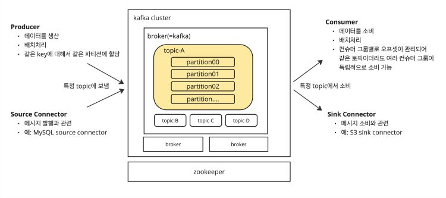

# SWA

[chat gpt 문제](chat%20gpt%20%E1%84%86%E1%85%AE%E1%86%AB%E1%84%8C%E1%85%A6%20cb242103a5fc4bbb9f80244e8950e9a4.md)

[Example](Example%2014c68dbc7b5049ad80a17d4f8ffc2817.md)

[sa ](sa%2055d2c4c1ba2b4826b131bd9734c0851d.md)

예상 문제

- 비동기 연계 시, 성능 지연 현상 해결을 위한 개선 방안 수립
    - 고객 상황
        - CK사는 MSA 기반 아키텍처로 구현된 서비스를 Private Cloud의 Kubernetes 기반 Pod 환경에서 구축 후, 운영 중
        - 모든 온라인 서비스는 SpringBoot를 활용하여 개발되었으며, Embedded Tomcat 기반으로 서비스를 수행
        - 각 mS 간에는 Kafka 기반으로 메시지를 송수신하여 연계
        - 최근 월 배치 프로그램 요건이 발생하였고 해당 배치 프로그램은 온라인 서비스 A와 동일 DB를 사용
        - 온라인 서비스A와 배치 프로그램에서 비즈니스 로직에 따라 DB의 업무 데이터 C/U/D 수행
        - 월 배치 프로그램은 온라인 서비스 A에서 발행하는 Kafka 메시지와 동일한 규격의 메시지를 대량으로 발행(Publish)하도록 개발
        - 온라인 서비스 A는 Kafka 연계 시 Transactional Outbox Pattern 적용을 통해 DB의 Outbox Table에 메시지를 insert하고, 별도의 프로세스가 Outbox Table의 데이터를 조회하여 Kafka에 Publish하도록 구성되어 있다.
        - 월 배치 프로그램은 온라인 서비스 A와 동일한 메시지를 발행하므로 온라인 서비스 A의 Kafka Topic 및 Outbox Table을 공유하여 추가적인 Topic 생성 및 구독 서비스 변경 영향도를 최소화하였다.
        - Kafka 전송용 CDC 프로그램은 Outbox Table에서 메시지를 조회하여 Kafka에 Publish하는 별도의 단일 Thread 기반 프로세스
        - 메시지를 구독하는 온라인 서비스 B는 API 호출과 Kafka 메시지 구독을 모두 처리 가능하도록 개발되었으며, 부하량에 따라 Pod를 동적으로 증감하도록 Auto-Scale 구성되어 있다.
        - 월 배치 프로그램 수행 시, 대량 메시지 발생으로 인해 온라인 서비스 A에서 생성한 Kafka 메시지 처리 지연이 발생하여 원인 식별 및 대응 방안을 수립하고자 한다.
        - 당신은 CK사에 S/W 아키텍트로 참여하여 현재 환경을 진단하고 성능 최적화 관점에서 아키텍처 개선 방향성을 제시하여야 한다.
    - 문제
        
        
        
        - 온라인 서비스 A의 Kafka 메시지 처리 지연에 1)영향을 미치는 지점을 모두 식별하고 이에 대한 2)원인을 분석하고 3)개선 방안 및 4)고려 사항/전제 사항을 각각 1가지 이상 구체적으로 제시하시오.
    - 해결 방안
        
        ## 1. 영향 지점 식별
        
        ### a. Outbox Table 공유
        
        - **영향 지점**: 온라인 서비스 A와 월 배치 프로그램이 동일한 Outbox Table을 사용하여 메시지를 발행.
        - **원인 분석**: 두 프로그램의 트랜잭션이 동일한 Outbox Table에 집중되면서 데이터베이스 I/O 병목이 발생할 가능성. 특히 월 배치 프로그램이 대량 메시지를 발행할 때, Outbox Table에 대한 insert 작업이 급증하여 지연이 발생할 수 있음.
        
        ### b. Kafka 전송용 CDC 프로그램
        
        - **영향 지점**: Outbox Table의 메시지를 Kafka로 전송하는 단일 Thread 기반의 CDC 프로그램.
        - **원인 분석**: 단일 스레드로 인해 병렬 처리에 한계가 있으며, 대량의 메시지를 처리할 때 큐잉 및 처리 지연이 발생할 수 있음. 월 배치 프로그램의 대량 메시지로 인해 CDC 프로그램의 처리 속도가 부족할 가능성.
        
        ### c. Kafka 브로커 및 Topic 설정
        
        - **영향 지점**: Kafka 클러스터의 브로커 및 Topic 구성.
        - **원인 분석**: 브로커의 처리 능력이 메시지 발행 속도를 따라가지 못하거나, Topic의 파티션 수가 부족할 경우 메시지 처리 지연이 발생할 수 있음.
        
        ### d. 온라인 서비스 B의 처리 능력
        
        - **영향 지점**: 메시지를 구독하여 처리하는 온라인 서비스 B.
        - **원인 분석**: Auto-Scaling 설정이 적절하지 않거나, 서비스 B의 스레드 수가 충분하지 않아 대량의 메시지를 처리하는 데 지연이 발생할 수 있음
        
        ## 2. 원인 분석
        
        - **Outbox Table의 병목**: 온라인 서비스 A와 월 배치 프로그램의 동시 접근으로 인해 발생하는 데이터베이스 병목.
        - **CDC 프로그램의 단일 스레드**: 메시지 발행 속도를 따라잡지 못하는 단일 스레드 구조로 인한 처리 속도 부족.
        - **Kafka 브로커 및 Topic 설정**: 브로커 과부하 또는 파티션 수 부족으로 인한 메시지 큐잉 및 지연.
        - **서비스 B의 스케일링 문제**: 메시지 수신 및 처리 속도를 보장하지 못하는 인프라 및 설정.
        
        ## 3. 개선 방안
        
        ### a. Outbox Table 분리
        
        - **개선 방안**: 월 배치 프로그램을 위한 별도의 Outbox Table을 구성하여 데이터베이스 병목을 줄임. 각 서비스가 개별 Outbox Table을 사용하도록 하여 트랜잭션 충돌을 방지.
        
        ### b. CDC 프로그램의 스레드 확장
        
        - **개선 방안**: CDC 프로그램을 멀티 스레드로 확장하여 병렬 처리 능력을 강화. 이를 통해 더 많은 메시지를 동시에 처리할 수 있도록 조정.
        - **CPU 및 I/O 혼합 작업:** CK사의 CDC 프로그램은 Outbox Table에서 데이터를 조회한 후 Kafka에 전송하는 작업을 수행합니다. 이는 데이터베이스와 네트워크 I/O가 혼합된 작업으로, 여러 스레드를 통해 병렬로 처리하는 것이 효과적일 수 있습니다.
        - **대량 데이터 처리:** 월 배치 프로그램 수행 시 대량 메시지가 발생하는 상황에서, 멀티 스레드 확장은 많은 데이터를 동시에 처리할 수 있어 지연을 줄이는 데 도움이 됩니다.
        
        ### c. Kafka 클러스터 확장 및 파티션 증가
        
        - **개선 방안**: Kafka 브로커 수를 늘리고, Topic의 파티션 수를 증가시켜 병렬 처리 능력을 향상. 각 파티션에 할당된 소비자 수를 늘려 메시지 처리 속도를 높임.
        
        ### d. 서비스 B의 Auto-Scaling 최적화
        
        - **개선 방안**: Auto-Scaling 정책을 최적화하여 메시지 처리 부하에 맞게 동적으로 Pod를 늘릴 수 있도록 조정. 서비스 B의 최대 처리 능력을 고려하여 리소스 할당을 조정.
        
        ## 4. 고려 사항/전제 사항
        
        ### a. 데이터 일관성 및 동시성 제어
        
        - **고려 사항**: Outbox Table을 분리할 경우, 데이터 일관성과 트랜잭션 관리를 위해 별도의 동기화 메커니즘이 필요할 수 있음.
        
        ### b. 인프라 비용
        
        - **고려 사항**: CDC 프로그램의 멀티 스레드 확장 및 Kafka 클러스터 확장은 추가적인 인프라 비용을 수반. 비용 대비 효과 분석이 필요.
        
        ### c. 운영 복잡성 증가
        
        - **고려 사항**: 시스템 구성의 복잡도가 증가할 수 있으며, 이로 인한 운영 및 관리의 어려움이 발생할 수 있음. 적절한 모니터링 및 운영 방안 마련 필요.
        
        ### d. 성능 테스트 및 검증
        
        - **고려 사항**: 모든 개선 방안은 실제 적용 전에 충분한 성능 테스트 및 검증이 필요. 이를 통해 예상하지 못한 문제를 사전에 발견하고 해결할 수 있음.
        
        이와 같은 분석 및 개선 방안을 통해 CK사의 Kafka 메시지 처리 성능을 최적화하고, 월 배치 프로그램으로 인한 지연 문제를 해결할 수 있습니다.
        

SWA 개요

- 소프트웨어 아키텍처란?
    
    소프트웨어 아키텍처는 소프트웨어 시스템의 상위 구조를 정의하는 개념으로, 시스템의 주요 구성 요소, 그들 간의 상호작용, 설계 및 진화를 위한 원칙과 지침을 포괄합니다. 
    
    다음은 소프트웨어 아키텍처의 주요 요소들입니다:
    
    1. **컴포넌트 (Components)**: 시스템의 기본 빌딩 블록으로, 클래스, 모듈, 서비스 등 다양한 형태로 존재합니다. 각 컴포넌트는 특정 책임을 가지며 명확한 인터페이스를 통해 상호작용합니다.
    2. **커넥터 (Connectors)**: 컴포넌트 간의 상호작용을 정의하는 요소들입니다. 커넥터는 프로토콜, API, 메시지 큐 등 데이터 교환과 통신을 촉진하는 메커니즘을 포함합니다.
    3. **아키텍처 패턴 (Architectural Patterns)**: 일반적인 소프트웨어 아키텍처 문제에 대한 재사용 가능한 솔루션입니다. 예를 들어, 모델-뷰-컨트롤러(MVC), 마이크로서비스, 계층화 아키텍처, 이벤트 중심 아키텍처 등이 있습니다.
    4. **품질 속성 (Quality Attributes)**: 비기능 요구사항으로, 성능, 확장성, 보안, 유지보수성, 사용성 등 시스템의 행동을 정의하는 특성들입니다.
    5. **설계 원칙 (Design Principles)**: 아키텍처에 영향을 미치는 지침과 모범 사례들입니다. 관심사 분리, 모듈성, 캡슐화, 느슨한 결합 등의 원칙들이 잘 조직되고 유지보수 가능한 시스템을 보장합니다.
    6. **뷰 (Views)**: 다양한 이해관계자의 요구를 해결하기 위해 아키텍처를 다양한 관점에서 표현하는 방법입니다. 일반적으로 논리적 뷰, 개발 뷰, 프로세스 뷰, 물리적 뷰, 시나리오/사용 사례 뷰 등이 있습니다.
    7. **아키텍처 문서화 (Architectural Documentation)**: 아키텍처의 구조, 동작 및 그 논리를 캡처하는 다이어그램, 설명 및 기타 산출물을 포함합니다.
- 핵심 기반 솔루션
    
    소프트웨어 아키텍처에서 핵심 기반 솔루션은 시스템의 기본 구조와 원칙을 정의하는 데 중점을 둡니다. 이러한 솔루션들은 시스템의 유지보수성, 확장성, 성능 등을 보장하며, 전반적인 설계를 효율적으로 할 수 있도록 도와줍니다. 핵심 기반 솔루션의 주요 요소는 다음과 같습니다:
    
    1. **모듈화 (Modularity)**:
        - 시스템을 독립적인 모듈로 나누어 각 모듈이 특정 기능을 담당하도록 합니다. 이렇게 하면 시스템의 각 부분을 독립적으로 개발, 테스트, 유지보수할 수 있어 유연성과 재사용성이 높아집니다.
    2. **계층화 (Layered Architecture)**:
        - 소프트웨어를 계층으로 나누어 각 계층이 특정 역할을 수행하도록 합니다. 예를 들어, 프레젠테이션 계층, 비즈니스 로직 계층, 데이터 접근 계층 등으로 나누어 설계합니다. 이는 시스템의 복잡성을 줄이고, 각 계층의 책임을 명확히 할 수 있습니다.
    3. **서비스 지향 아키텍처 (SOA)**:
        - 시스템을 독립적인 서비스로 나누어 이들 서비스가 서로 통신하며 기능을 제공합니다. 서비스는 재사용 가능하며, 다른 시스템과의 통합을 용이하게 합니다.
    4. **마이크로서비스 아키텍처 (Microservices)**:
        - 단일 애플리케이션을 여러 개의 작은 서비스로 나누어 각 서비스가 독립적으로 배포, 확장될 수 있도록 합니다. 이는 높은 유연성과 확장성을 제공합니다.
    5. **패턴과 원칙 (Design Patterns and Principles)**:
        - 다양한 디자인 패턴(예: 싱글턴, 팩토리, 전략 패턴)과 원칙(예: SOLID 원칙)을 활용하여 설계를 표준화하고, 코드의 품질과 유지보수성을 향상시킵니다.
    6. **성능 최적화 (Performance Optimization)**:
        - 시스템의 성능을 극대화하기 위해 캐싱, 로드 밸런싱, 비동기 처리 등 다양한 기법을 적용합니다. 성능은 시스템의 효율성과 사용자 경험에 큰 영향을 미칩니다.
    7. **보안 (Security)**:
        - 시스템의 보안을 고려하여 인증, 권한 부여, 데이터 암호화 등의 기법을 적용합니다. 이는 데이터와 시스템을 보호하는 데 필수적입니다.
    8. **유연성 및 확장성 (Flexibility and Scalability)**:
        - 시스템이 변화하는 요구 사항에 적응할 수 있도록 설계하고, 필요에 따라 시스템을 확장할 수 있는 구조를 갖추는 것이 중요합니다.
    
    이러한 핵심 기반 솔루션들은 시스템의 기본 아키텍처를 구성하고, 소프트웨어 개발의 전반적인 품질과 효율성을 높이는 데 도움을 줍니다.
    
- 핵심 기반 솔루션 장단점
    
    소프트웨어 아키텍처의 핵심 기반 솔루션은 시스템의 안정성, 확장성, 유지보수성 등을 보장하는 데 중요한 역할을 합니다. 이러한 솔루션들은 다양한 기능과 이점을 제공하지만, 각각의 접근 방식에는 장단점이 있습니다. 주요 핵심 기반 솔루션의 기능과 장단점을 아래에 설명하겠습니다.
    
    ### 1. **모듈화 (Modularity)**
    
    - **주요 기능**:
        - 시스템을 독립적인 모듈로 나누어 각 모듈이 특정 기능을 담당하도록 합니다.
        - 모듈 간의 의존성을 최소화하고, 각 모듈을 독립적으로 개발, 테스트, 배포할 수 있습니다.
    - **장점**:
        - **유지보수성**: 각 모듈이 독립적이기 때문에 변경 사항이 다른 모듈에 영향을 미치지 않습니다.
        - **재사용성**: 모듈을 재사용할 수 있어 개발 효율성을 높일 수 있습니다.
        - **병렬 개발**: 여러 팀이 독립적으로 작업할 수 있어 개발 속도를 높일 수 있습니다.
    - **단점**:
        - **모듈 간 통신**: 모듈 간의 통신이 복잡할 수 있으며, 인터페이스 설계에 신중을 기해야 합니다.
        - **추가 오버헤드**: 모듈화로 인한 추가적인 설계와 통합 작업이 필요할 수 있습니다.
    
    ### 2. **계층화 (Layered Architecture)**
    
    - **주요 기능**:
        - 소프트웨어를 여러 계층으로 나누어 각 계층이 특정 역할을 수행합니다.
        - 일반적으로 프레젠테이션 계층, 비즈니스 로직 계층, 데이터 접근 계층으로 나뉩니다.
    - **장점**:
        - **구조적 명확성**: 각 계층의 책임이 명확하여 이해와 유지보수가 용이합니다.
        - **유연성**: 계층 간의 독립성이 높아 계층별로 독립적인 변경이 가능합니다.
        - **재사용성**: 특정 계층의 컴포넌트를 다른 시스템에서 재사용할 수 있습니다.
    - **단점**:
        - **성능**: 계층 간의 호출로 인해 성능이 저하될 수 있습니다.
        - **복잡성**: 계층 간의 의존성과 인터페이스를 설계하고 관리하는 데 복잡성이 증가할 수 있습니다.
    
    ### 3. **서비스 지향 아키텍처 (SOA)**
    
    - **주요 기능**:
        - 시스템을 독립적인 서비스로 나누어 각 서비스가 특정 기능을 수행합니다.
        - 서비스는 네트워크를 통해 서로 통신하며, 다른 시스템과의 통합이 용이합니다.
    - **장점**:
        - **재사용성**: 서비스는 독립적으로 재사용할 수 있습니다.
        - **확장성**: 개별 서비스를 독립적으로 확장할 수 있습니다.
        - **유연성**: 시스템의 일부분을 변경하거나 교체하기 용이합니다.
    - **단점**:
        - **복잡성**: 서비스 간의 통신 및 데이터 전송 방식이 복잡할 수 있습니다.
        - **성능**: 네트워크를 통한 서비스 호출로 인해 성능이 저하될 수 있습니다.
    
    ### 4. **마이크로서비스 아키텍처 (Microservices)**
    
    - **주요 기능**:
        - 단일 애플리케이션을 여러 개의 작은 서비스로 나누어 각 서비스가 독립적으로 배포되고 확장됩니다.
    - **장점**:
        - **독립적 배포**: 각 서비스가 독립적으로 배포되며, 서비스 간의 독립성이 높습니다.
        - **확장성**: 필요한 서비스만 독립적으로 확장할 수 있습니다.
        - **유연성**: 다양한 기술 스택을 서비스별로 사용할 수 있습니다.
    - **단점**:
        - **복잡성**: 서비스 간의 통신, 데이터 관리, 트랜잭션 관리가 복잡할 수 있습니다.
        - **운영 오버헤드**: 여러 서비스를 운영하고 모니터링하는 데 추가적인 노력이 필요합니다.
    
    ### 5. **패턴과 원칙 (Design Patterns and Principles)**
    
    - **주요 기능**:
        - 다양한 디자인 패턴(예: 싱글턴, 팩토리, 전략 패턴)과 원칙(예: SOLID 원칙)을 활용하여 설계를 표준화합니다.
    - **장점**:
        - **코드 품질**: 코드의 품질과 일관성을 높일 수 있습니다.
        - **유지보수성**: 잘 정의된 패턴과 원칙은 코드의 유지보수를 용이하게 합니다.
        - **재사용성**: 패턴을 통해 공통 문제를 해결하고, 코드 재사용성을 높일 수 있습니다.
    - **단점**:
        - **과도한 사용**: 패턴을 과도하게 사용하면 코드가 복잡해질 수 있습니다.
        - **학습 곡선**: 디자인 패턴과 원칙을 이해하고 적용하는 데 시간이 걸릴 수 있습니다.
    
    ### 6. **성능 최적화 (Performance Optimization)**
    
    - **주요 기능**:
        - 시스템의 성능을 향상시키기 위해 캐싱, 로드 밸런싱, 비동기 처리 등을 적용합니다.
    - **장점**:
        - **응답 시간 단축**: 사용자 경험을 향상시킬 수 있습니다.
        - **리소스 효율성**: 시스템 자원을 효율적으로 사용할 수 있습니다.
    - **단점**:
        - **복잡성 증가**: 성능 최적화를 위한 추가적인 설계와 코드가 필요할 수 있습니다.
        - **유지보수 어려움**: 최적화된 코드나 구조가 시간이 지나면서 유지보수하기 어려울 수 있습니다.
    
    ### 7. **보안 (Security)**
    
    - **주요 기능**:
        - 시스템의 보안을 고려하여 인증, 권한 부여, 데이터 암호화 등의 기법을 적용합니다.
    - **장점**:
        - **데이터 보호**: 사용자 데이터와 시스템을 안전하게 보호할 수 있습니다.
        - **신뢰성**: 보안이 강화된 시스템은 사용자와 조직의 신뢰를 얻을 수 있습니다.
    - **단점**:
        - **성능 저하**: 암호화와 같은 보안 기능이 성능에 영향을 미칠 수 있습니다.
        - **복잡성**: 보안 요구 사항을 충족시키기 위한 추가적인 복잡성이 발생할 수 있습니다.
    
    ### 8. **유연성 및 확장성 (Flexibility and Scalability)**
    
    - **주요 기능**:
        - 시스템이 변화하는 요구 사항에 적응할 수 있도록 설계하고, 필요에 따라 확장할 수 있는 구조를 갖추는 것입니다.
    - **장점**:
        - **변화 대응**: 새로운 기능 추가와 요구 사항 변경에 유연하게 대응할 수 있습니다.
        - **성장 지원**: 시스템이 성장하면서도 안정적으로 운영될 수 있습니다.
    - **단점**:
        - **설계 복잡성**: 유연성과 확장성을 고려한 설계가 복잡할 수 있습니다.
        - **자원 소모**: 확장성을 고려한 추가적인 자원 소모가 있을 수 있습니다.
    
    이러한 핵심 기반 솔루션들은 각기 다른 소프트웨어 개발 요구를 충족하기 위해 설계되었습니다. 각각의 장점과 단점을 이해하고, 시스템의 요구 사항에 맞는 솔루션을 선택하는 것이 중요합니다.
    
- 소프트웨어 아키텍쳐 설계
    
    소프트웨어 아키텍처 설계는 시스템의 구조를 정의하고 그 구성 요소들 간의 관계를 규정하는 과정입니다. 이 과정은 시스템의 성능, 확장성, 유지보수성, 보안성 등 다양한 비기능 요구사항을 충족시키는 데 중점을 둡니다. 소프트웨어 아키텍처 설계 방법에는 여러 접근법이 있으며, 그중 주요 방법들을 설명하겠습니다.
    
    ### 1. **요구사항 분석 (Requirement Analysis)**
    
    ### 기능적 요구사항 (Functional Requirements)
    
    - 시스템이 수행해야 하는 구체적인 기능이나 작업을 정의합니다.
    - 예: 사용자 인증, 데이터 처리, 보고서 생성
    
    ### 비기능적 요구사항 (Non-Functional Requirements)
    
    - 성능, 보안, 확장성, 유지보수성 등 시스템의 품질 속성을 정의합니다.
    - 예: 시스템 응답 시간, 데이터 보안 수준, 시스템 가용성
    
    ### 2. **시스템 컨텍스트와 경계 정의 (Defining System Context and Boundaries)**
    
    - 시스템이 작동할 환경과 다른 시스템과의 상호작용을 정의합니다.
    - 시스템 경계를 명확히 하여 외부 시스템과의 인터페이스를 규정합니다.
    - **컨텍스트 다이어그램**을 사용하여 시스템과 외부 환경 간의 상호작용을 시각화할 수 있습니다.
    
    ### 3. **아키텍처 패턴 선택 (Selecting Architecture Patterns)**
    
    아키텍처 패턴은 특정 문제를 해결하기 위한 일반적인 해결책을 제공합니다. 대표적인 아키텍처 패턴에는 다음과 같은 것들이 있습니다:
    
    ### 레이어드 아키텍처 (Layered Architecture)
    
    - 시스템을 계층으로 나누어 각 계층이 특정 기능을 담당합니다.
    - 예: 프레젠테이션 계층, 비즈니스 계층, 데이터 접근 계층
    
    ### 클라이언트-서버 아키텍처 (Client-Server Architecture)
    
    - 클라이언트와 서버 간의 분할을 통해 작업을 분배합니다.
    - 클라이언트는 사용자 인터페이스와 사용자 입력을 처리하고, 서버는 데이터 저장과 비즈니스 로직을 처리합니다.
    
    ### 이벤트 드리븐 아키텍처 (Event-Driven Architecture)
    
    - 시스템이 이벤트를 중심으로 동작합니다.
    - 이벤트 발생 시 이를 처리하는 이벤트 핸들러가 실행됩니다.
    
    ### 마이크로서비스 아키텍처 (Microservices Architecture)
    
    - 시스템을 독립적으로 배포 및 확장 가능한 작은 서비스들로 구성합니다.
    - 각 서비스는 특정 비즈니스 기능을 수행하며, 서로 독립적으로 배포될 수 있습니다.
    
    ### CQRS (Command Query Responsibility Segregation)
    
    - 읽기와 쓰기 작업을 분리하여 서로 다른 모델로 처리합니다.
    - 쓰기 모델은 데이터를 수정하고, 읽기 모델은 데이터를 조회합니다.
    
    ### 4. **모델링과 다이어그램 작성 (Modeling and Diagramming)**
    
    ### UML 다이어그램 (UML Diagrams)
    
    - **클래스 다이어그램:** 시스템의 클래스와 그들 간의 관계를 시각화합니다.
    - **시퀀스 다이어그램:** 객체 간의 상호작용 순서를 보여줍니다.
    - **유스케이스 다이어그램:** 시스템의 기능적 요구사항을 사용자 관점에서 표현합니다.
    
    ### C4 모델 (C4 Model)
    
    - **컨텍스트 다이어그램:** 시스템과 외부 엔티티 간의 상호작용을 시각화합니다.
    - **컨테이너 다이어그램:** 시스템의 주요 컨테이너(애플리케이션, 데이터베이스 등)를 나타냅니다.
    - **컴포넌트 다이어그램:** 각 컨테이너의 내부 구성 요소와 그들 간의 관계를 보여줍니다.
    - **코드 다이어그램:** 실제 코드 구조를 나타내며, 클래스와 메서드 간의 관계를 시각화합니다.
    
    ### 5. **기술 스택 결정 (Deciding the Technology Stack)**
    
    - 각 아키텍처 패턴에 적합한 기술을 선택합니다.
    - 예: 데이터베이스 (MySQL, PostgreSQL), 웹 프레임워크 (Spring, Django), 메시지 브로커 (Kafka, RabbitMQ)
    
    ### 6. **프로토타입과 검증 (Prototyping and Validation)**
    
    - 아키텍처의 핵심 부분을 프로토타입으로 구현하여 검증합니다.
    - 성능 테스트, 보안 테스트 등을 통해 설계가 요구사항을 충족하는지 확인합니다.
    
    ### 7. **아키텍처 문서화 (Documenting the Architecture)**
    
    - 아키텍처의 구조, 패턴, 구성 요소, 인터페이스 등을 문서화합니다.
    - *아키텍처 결정 기록(ADR, Architecture Decision Record)**을 통해 주요 아키텍처 결정의 배경과 이유를 기록합니다.
    
    ### 8. **피드백과 개선 (Feedback and Improvement)**
    
    - 개발팀, 이해관계자들로부터 피드백을 받아 아키텍처를 지속적으로 개선합니다.
    - 요구사항 변화나 기술 발전에 따라 아키텍처를 유연하게 조정합니다.
    
    ### 결론
    
    소프트웨어 아키텍처 설계는 체계적인 접근과 다양한 고려 사항을 포함하는 복잡한 과정입니다. 요구사항 분석에서 시작하여 아키텍처 패턴 선택, 모델링, 기술 스택 결정, 프로토타입 검증, 문서화, 그리고 피드백과 개선까지의 단계를 통해 안정적이고 확장 가능한 시스템을 구축할 수 있습니다. 각 단계에서 적절한 도구와 기법을 활용하여 설계 품질을 높이고, 이해관계자들과의 원활한 의사소통을 통해 최적의 아키텍처를 도출하는 것이 중요합니다.
    
- 소프트웨어 아키텍쳐 설계 시 고려사항
    
    소프트웨어 아키텍처를 설계할 때 고려해야 할 사항은 여러 가지가 있습니다. 이를 체계적으로 접근하기 위해서는 다양한 측면에서 고려해야 하는 요소들을 분류할 수 있습니다. 이 요소들을 이해하고 고려하는 것은 시스템이 요구사항을 만족하고 유지보수성이 높으며 성능이 우수한 소프트웨어를 개발하는 데 필수적입니다. 다음은 소프트웨어 아키텍처 설계 시 고려해야 할 주요 사항들입니다.
    
    ### 1. **시스템 요구사항 분석**
    
    ### 기능적 요구사항 (Functional Requirements)
    
    - **시스템 기능**: 시스템이 어떤 기능을 제공해야 하는지 정의합니다.
    - **사용자 인터페이스**: 사용자와 시스템의 상호 작용을 어떻게 디자인할지 고려합니다.
    
    ### 비기능적 요구사항 (Non-Functional Requirements)
    
    - **성능**: 시스템이 어떤 성능 수준을 달성해야 하는지 (예: 응답 시간, 처리량 등).
    - **확장성**: 시스템이 어떻게 성장할 수 있는지, 사용량이 증가할 때 어떻게 대응할지.
    - **가용성**: 시스템의 가동 시간이 얼마나 되어야 하는지.
    - **신뢰성**: 시스템이 얼마나 안정적으로 작동해야 하는지.
    - **보안**: 시스템이 어떤 보안 요구사항을 충족해야 하는지 (예: 인증, 권한 부여, 데이터 암호화 등).
    - **유지보수성**: 시스템이 얼마나 쉽게 유지보수될 수 있는지.
    - **이식성**: 다른 플랫폼에서 시스템이 어떻게 작동할 수 있는지.
    
    ### 2. **시스템 구조 설계**
    
    ### 모듈화 (Modularity)
    
    - **모듈 분해**: 시스템을 작은 모듈로 나누어 각 모듈이 독립적으로 동작할 수 있도록 합니다.
    - **인터페이스 정의**: 모듈 간의 통신을 위해 명확한 인터페이스를 정의합니다.
    
    ### 계층 구조 (Layered Architecture)
    
    - **계층별 역할 분담**: 각 계층이 어떤 역할을 하는지 정의합니다.
    - **계층 간 의존성 관리**: 상위 계층이 하위 계층의 구현에 의존하지 않도록 합니다.
    
    ### 패턴 사용 (Design Patterns)
    
    - **패턴 선택**: 문제를 해결하는 데 적절한 디자인 패턴을 선택합니다 (예: MVC, MVP, MVVM 등).
    - **패턴 적용**: 선택한 패턴을 어떻게 시스템에 적용할지 결정합니다.
    
    ### 3. **기술적 고려사항**
    
    ### 데이터베이스 설계
    
    - **데이터 모델링**: 시스템에서 사용할 데이터 구조를 정의합니다.
    - **데이터베이스 선택**: 관계형 데이터베이스 또는 NoSQL 데이터베이스 중 어떤 것을 사용할지 결정합니다.
    - **쿼리 최적화**: 데이터베이스의 성능을 최적화하기 위한 전략을 수립합니다.
    
    ### 네트워크 및 배포
    
    - **네트워크 구조**: 시스템이 어떻게 네트워크 상에서 구성될지 고려합니다.
    - **배포 전략**: 시스템을 어떤 방식으로 배포할지 결정합니다 (예: 클라우드 배포, 온프레미스 배포 등).
    
    ### 4. **품질 속성 고려사항**
    
    ### 성능 (Performance)
    
    - **응답 시간**: 시스템의 응답 시간이 얼마나 빨라야 하는지.
    - **처리량**: 시스템이 동시에 얼마나 많은 요청을 처리할 수 있는지.
    - **리소스 사용**: 시스템이 얼마나 효율적으로 자원을 사용하는지.
    
    ### 보안 (Security)
    
    - **위험 평가**: 시스템이 직면할 수 있는 보안 위협을 식별합니다.
    - **보안 통제**: 이러한 위협을 완화하기 위한 보안 통제를 설계합니다.
    
    ### 유연성 (Flexibility)
    
    - **변경 용이성**: 시스템이 어떻게 쉽게 변경될 수 있는지.
    - **확장 용이성**: 시스템이 어떻게 쉽게 확장될 수 있는지.
    
    ### 5. **아키텍처 스타일 및 패턴**
    
    ### 아키텍처 스타일
    
    - **계층형 (Layered)**: 계층화된 구조를 통해 모듈 간의 의존성을 관리합니다.
    - **마이크로서비스 (Microservices)**: 작은 서비스들로 구성되어 독립적으로 배포 및 운영이 가능합니다.
    - **이벤트 주도 (Event-Driven)**: 이벤트를 통해 서비스 간의 통신이 이루어집니다.
    
    ### 아키텍처 패턴
    
    - **싱글톤 (Singleton)**: 인스턴스가 하나만 존재하도록 보장합니다.
    - **펙토리 (Factory)**: 객체 생성 로직을 별도의 클래스나 메소드로 분리합니다.
    - **프로토타입 (Prototype)**: 객체의 복제 과정을 최적화합니다.
    
    ### 6. **리스크 관리**
    
    - **리스크 식별**: 아키텍처에 잠재적인 리스크를 식별합니다.
    - **리스크 분석**: 리스크의 영향을 분석하고 대응 방안을 마련합니다.
    - **리스크 완화**: 리스크를 완화하기 위한 계획을 수립하고 실행합니다.
    
    ### 7. **아키텍처 검증**
    
    - **검토 (Review)**: 설계된 아키텍처를 검토하고 필요한 수정 사항을 파악합니다.
    - **프로토타이핑 (Prototyping)**: 시스템의 일부를 구현하여 아키텍처의 타당성을 검증합니다.
    - **시뮬레이션 (Simulation)**: 시뮬레이션을 통해 아키텍처가 요구사항을 만족하는지 확인합니다.
    
    ### 8. **문서화**
    
    - **아키텍처 다이어그램**: 시스템의 구조를 시각적으로 표현합니다.
    - **기능 명세서**: 시스템이 제공하는 기능을 상세히 기술합니다.
    - **비기능 요구사항 문서**: 시스템이 충족해야 하는 비기능 요구사항을 문서화합니다.
    
    ### 9. **의사소통 및 협업**
    
    - **이해관계자 참여**: 아키텍처 설계 과정에서 이해관계자의 요구사항을 수집하고 반영합니다.
    - **팀 협업**: 개발 팀 간의 원활한 협업을 위해 아키텍처를 명확하게 정의하고 공유합니다.
    
    이러한 고려사항들을 종합적으로 검토하고 반영하여 소프트웨어 아키텍처를 설계하는 것이 중요합니다. 이는 시스템의 성공적인 개발과 운영을 위한 핵심적인 요소입니다.
    
- 소프트웨어 통합과 시스템 연계
    
    소프트웨어 통합과 시스템 연계는 다양한 시스템과 애플리케이션이 함께 작동하여 전체 비즈니스 프로세스를 지원할 수 있도록 하는 중요한 과정입니다. 이를 성공적으로 수행하려면 다양한 측면을 고려해야 합니다. 다음은 소프트웨어 통합과 시스템 연계 시 고려해야 할 주요 사항입니다.
    
    ### 1. **요구사항 정의 및 이해**
    
    ### 기능적 요구사항
    
    - **데이터 흐름**: 어떤 데이터가 어디에서 어디로 이동하는지, 그리고 어떤 형태로 변환되어야 하는지 정의합니다.
    - **비즈니스 로직**: 각 시스템에서 수행해야 하는 비즈니스 로직을 이해합니다.
    - **시스템 간 의존성**: 어떤 시스템이 다른 시스템의 데이터를 필요로 하는지 파악합니다.
    
    ### 비기능적 요구사항
    
    - **성능**: 통합된 시스템이 요구하는 응답 시간과 처리량을 충족할 수 있는지.
    - **확장성**: 시스템 사용량 증가 시 어떻게 확장할 것인지 고려합니다.
    - **가용성**: 시스템이 중단 없이 작동해야 하는 시간과 연계된 시스템이 다운되었을 때의 대처 방법을 정합니다.
    - **보안**: 데이터 전송 시 어떤 보안 메커니즘을 사용할 것인지 (예: 암호화, 인증).
    
    ### 2. **통합 방법 및 아키텍처 선택**
    
    ### 통합 유형
    
    - **포인트 투 포인트(Point-to-Point)**: 시스템 간 직접적인 연결로 간단하지만 확장성과 유지보수성이 낮습니다.
    - **허브 앤 스포크(Hub-and-Spoke)**: 중앙 허브를 통해 시스템을 연결하여 관리와 모니터링이 용이합니다.
    - **메시(Mesh)**: 각 시스템이 다른 시스템과 직접 연결되는 방식으로 유연하지만 복잡성이 높습니다.
    - **이벤트 기반(Event-Driven)**: 이벤트 발생 시 시스템이 동작하며, 느슨한 결합을 제공합니다.
    - **서비스 지향 아키텍처(SOA)**: 서비스 간의 통신으로 시스템을 통합하며 재사용성이 높습니다.
    
    ### 통합 기술
    
    - **API**: RESTful, SOAP 등 API를 통해 시스템 간의 통신을 가능하게 합니다.
    - **메시지 브로커**: 메시지 큐 시스템(예: RabbitMQ, Kafka)으로 비동기 통신을 제공합니다.
    - **데이터베이스 통합**: 데이터베이스 레벨에서 통합을 구현하여 데이터 일관성을 유지합니다.
    - **ETL 도구**: 데이터 추출, 변환, 적재(ETL) 과정을 통해 시스템 간 데이터를 이동합니다.
    
    ### 3. **데이터 통합 및 관리**
    
    ### 데이터 모델링
    
    - **공통 데이터 모델**: 통합된 시스템이 사용할 공통 데이터 모델을 정의합니다.
    - **데이터 매핑**: 시스템 간 데이터 형식이 다른 경우 매핑을 통해 일관성을 유지합니다.
    - **데이터 변환**: 필요에 따라 데이터를 적절한 형태로 변환합니다.
    
    ### 데이터 일관성 및 동기화
    
    - **일관성 유지**: 시스템 간 데이터의 일관성을 유지하는 방법을 고려합니다.
    - **동기화 주기**: 데이터가 얼마나 자주 동기화되어야 하는지 결정합니다.
    
    ### 4. **보안 및 규정 준수**
    
    ### 접근 제어
    
    - **인증 및 권한 부여**: 시스템 간 통신 시 적절한 인증 및 권한 부여 메커니즘을 구현합니다.
    - **데이터 보호**: 민감한 데이터는 전송 중 및 저장 시 암호화합니다.
    
    ### 규정 준수
    
    - **규정 요구사항 파악**: 각 시스템이 준수해야 하는 규정과 표준을 파악합니다.
    - **감사 및 로깅**: 통합 프로세스의 감사를 위해 로깅 메커니즘을 구현합니다.
    
    ### 5. **에러 처리 및 복구**
    
    ### 오류 감지 및 보고
    
    - **모니터링**: 시스템 상태와 통합 프로세스를 지속적으로 모니터링합니다.
    - **알림**: 오류 발생 시 담당자에게 즉시 알릴 수 있는 알림 시스템을 구축합니다.
    
    ### 복구 메커니즘
    
    - **자동 복구**: 자동으로 복구할 수 있는 메커니즘을 구현합니다.
    - **수동 복구 절차**: 자동 복구가 불가능한 경우를 대비하여 수동 복구 절차를 마련합니다.
    
    ### 6. **성능 최적화**
    
    ### 최적화 기법
    
    - **로드 밸런싱**: 시스템 부하를 여러 서버에 분산시켜 성능을 향상시킵니다.
    - **캐싱**: 자주 사용되는 데이터를 캐시하여 응답 시간을 줄입니다.
    - **병렬 처리**: 데이터 처리 작업을 병렬로 수행하여 처리 속도를 높입니다.
    
    ### 성능 테스트
    
    - **부하 테스트**: 시스템이 높은 부하에서 어떻게 작동하는지 테스트합니다.
    - **스트레스 테스트**: 시스템의 한계를 알아보기 위해 스트레스 테스트를 수행합니다.
    
    ### 7. **통합 테스트 및 검증**
    
    ### 통합 테스트 전략
    
    - **단위 테스트**: 각 모듈 또는 시스템의 개별 기능을 테스트합니다.
    - **시스템 테스트**: 전체 시스템이 통합된 상태에서 기능을 테스트합니다.
    - **회귀 테스트**: 기존 기능이 새로운 통합으로 인해 영향을 받지 않았는지 확인합니다.
    
    ### 사용자 수용 테스트
    
    - **사용자 피드백**: 통합된 시스템에 대한 사용자 피드백을 수집하고 반영합니다.
    
    ### 8. **문서화 및 교육**
    
    ### 문서화
    
    - **설계 문서**: 통합 아키텍처, 데이터 흐름, 에러 처리 방법 등을 상세히 문서화합니다.
    - **유지보수 가이드**: 유지보수 시 필요한 정보를 문서화합니다.
    
    ### 교육
    
    - **개발자 교육**: 통합 시스템에 대한 개발자 교육을 실시합니다.
    - **사용자 교육**: 최종 사용자에게 새로운 시스템 사용법을 교육합니다.
    
    ### 9. **배포 및 운영**
    
    ### 배포 전략
    
    - **점진적 배포**: 단계적으로 시스템을 배포하여 문제 발생 시 영향을 최소화합니다.
    - **롤백 계획**: 문제 발생 시 빠르게 이전 상태로 복구할 수 있는 롤백 계획을 마련합니다.
    
    ### 운영 관리
    
    - **지속적 모니터링**: 통합 시스템의 상태를 지속적으로 모니터링하고 문제를 예측합니다.
    - **지속적 개선**: 통합 시스템의 성능과 안정성을 향상시키기 위해 지속적으로 개선합니다.
    
    이러한 사항들을 종합적으로 고려하면 소프트웨어 통합과 시스템 연계가 더욱 원활하게 이루어질 수 있으며, 전체 시스템의 성능과 안정성을 높일 수 있습니다.
    
- 시스템 유형별 참조 아키텍쳐
    
    시스템 유형별로 적합한 소프트웨어 아키텍처를 선택하는 것은 시스템의 성능, 확장성, 유지보수성 등을 보장하는 데 매우 중요합니다. 아래는 여러 시스템 유형별로 자주 사용되는 참조 소프트웨어 아키텍처에 대해 설명합니다.
    
    ### 1. 웹 애플리케이션 (Web Applications)
    
    ### 레이어드 아키텍처 (Layered Architecture)
    
    - **구성 요소:** 프레젠테이션 계층, 비즈니스 로직 계층, 데이터 접근 계층, 데이터베이스 계층
    - **장점:** 구조가 명확하고 각 계층이 독립적으로 개발 및 테스트 가능
    - **예:** Django (Python), Spring MVC (Java), ASP.NET (C#)
    
    ### MVC 아키텍처 (Model-View-Controller)
    
    - **구성 요소:** 모델 (데이터와 비즈니스 로직), 뷰 (사용자 인터페이스), 컨트롤러 (사용자 입력을 처리하고 모델과 뷰를 연결)
    - **장점:** 코드의 분리와 재사용성 향상, 유지보수성 증대
    - **예:** Ruby on Rails, Laravel (PHP), Angular (JavaScript)
    
    ### 2. 마이크로서비스 아키텍처 (Microservices Architecture)
    
    ### 마이크로서비스 아키텍처
    
    - **구성 요소:** 독립적으로 배포 및 확장 가능한 작은 서비스들, 각 서비스는 특정 비즈니스 기능을 수행
    - **장점:** 확장성, 독립적인 배포, 장애 격리
    - **예:** Netflix OSS, Spring Boot + Spring Cloud, Docker + Kubernetes
    
    ### 3. 모바일 애플리케이션 (Mobile Applications)
    
    ### 클라이언트-서버 아키텍처 (Client-Server Architecture)
    
    - **구성 요소:** 클라이언트 (모바일 애플리케이션), 서버 (백엔드 서비스)
    - **장점:** 클라이언트와 서버의 역할이 명확히 분리, 데이터 및 비즈니스 로직의 중앙 집중화
    - **예:** RESTful API를 이용한 서버 통신, GraphQL API
    
    ### MVVM 아키텍처 (Model-View-ViewModel)
    
    - **구성 요소:** 모델 (데이터와 비즈니스 로직), 뷰 (사용자 인터페이스), 뷰모델 (뷰와 모델을 연결하는 중개자)
    - **장점:** 코드의 분리와 재사용성 향상, 테스트 용이성
    - **예:** Android (Jetpack), iOS (SwiftUI), Xamarin
    
    ### 4. 데이터 집약형 애플리케이션 (Data-Intensive Applications)
    
    ### 람다 아키텍처 (Lambda Architecture)
    
    - **구성 요소:** 배치 레이어, 스피드 레이어, 서빙 레이어
    - **장점:** 실시간 데이터 처리와 배치 데이터 처리의 장점 결합
    - **예:** Apache Hadoop (배치), Apache Storm (실시간), Apache HBase (서빙)
    
    ### 캡파 아키텍처 (Kappa Architecture)
    
    - **구성 요소:** 단일 스트리밍 레이어
    - **장점:** 단순화된 아키텍처, 실시간 데이터 처리에 집중
    - **예:** Apache Kafka, Apache Flink, Apache Samza
    
    ### 5. 엔터프라이즈 애플리케이션 (Enterprise Applications)
    
    ### 서비스 지향 아키텍처 (Service-Oriented Architecture, SOA)
    
    - **구성 요소:** 재사용 가능한 서비스들, 서비스 버스 (ESB)
    - **장점:** 서비스의 재사용성, 비즈니스 프로세스의 유연성
    - **예:** MuleSoft, IBM WebSphere, Oracle SOA Suite
    
    ### 이벤트 드리븐 아키텍처 (Event-Driven Architecture)
    
    - **구성 요소:** 이벤트 프로듀서, 이벤트 소비자, 이벤트 버스
    - **장점:** 느슨한 결합, 확장성, 실시간 처리
    - **예:** Apache Kafka, AWS SNS/SQS, RabbitMQ
    
    ### 6. 임베디드 시스템 (Embedded Systems)
    
    ### 레이어드 아키텍처 (Layered Architecture)
    
    - **구성 요소:** 하드웨어 추상화 계층, 드라이버 계층, OS 계층, 애플리케이션 계층
    - **장점:** 각 계층의 독립적인 개발과 유지보수, 하드웨어 종속성 감소
    - **예:** RTOS 기반 시스템, IoT 디바이스
    
    ### 마이크로커널 아키텍처 (Microkernel Architecture)
    
    - **구성 요소:** 마이크로커널, 서버 모듈
    - **장점:** 시스템의 유연성과 확장성, 모듈별 업데이트 가능
    - **예:** QNX, L4 마이크로커널
    
    ### 7. 분산 시스템 (Distributed Systems)
    
    ### 분산 데이터베이스 아키텍처
    
    - **구성 요소:** 분산 데이터 저장소, 분산 트랜잭션 관리
    - **장점:** 데이터의 고가용성과 확장성, 장애 시 데이터 복구 용이
    - **예:** Apache Cassandra, Amazon DynamoDB, Google Spanner
    
    ### 피어-투-피어 아키텍처 (Peer-to-Peer Architecture)
    
    - **구성 요소:** 동등한 지위를 가진 노드들, 분산 해시 테이블 (DHT)
    - **장점:** 중앙 집중식 서버의 부하 감소, 확장성과 내결함성 향상
    - **예:** BitTorrent, IPFS, Bitcoin 네트워크
    
    ### 결론
    
    시스템 유형별로 적합한 아키텍처 패턴을 선택하는 것은 시스템의 요구사항과 특성에 따라 달라집니다. 각 아키텍처 패턴은 특정 문제를 해결하기 위해 설계되었으며, 그 장점과 단점이 있습니다. 따라서, 시스템의 비기능적 요구사항을 고려하여 가장 적합한 아키텍처를 선택하는 것이 중요합니다.
    
- SW 성능 최적화
    
    소프트웨어 아키텍처에서 성능 최적화는 시스템의 효율성을 높이고, 응답 시간을 줄이며, 리소스 소비를 최소화하는 과정을 포함합니다. 성능 최적화에는 여러 기술이 있으며, 아래는 그 중 주요한 기술들을 구체적으로 설명합니다:
    
    ### 1. **캐싱 (Caching)**
    
    - **목적**: 자주 요청되는 데이터나 결과를 메모리와 같은 빠른 저장소에 저장하여 응답 속도를 개선합니다.
    - **종류**:
        - **웹 캐시**: HTTP 응답을 브라우저나 프록시 서버에 저장합니다.
        - **데이터베이스 캐시**: 자주 조회되는 데이터베이스 쿼리 결과를 저장합니다.
        - **애플리케이션 캐시**: 애플리케이션 레벨에서 계산된 결과를 저장합니다.
    - **도구**: Redis, Memcached
    
    ### 2. **로드 밸런싱 (Load Balancing)**
    
    - **목적**: 여러 서버 간에 요청을 분산시켜 부하를 고르게 하고, 시스템의 가용성과 응답성을 개선합니다.
    - **기술**:
        - **하드웨어 로드 밸런서**: 물리적인 장비를 사용하여 요청을 분산시킵니다.
        - **소프트웨어 로드 밸런서**: HAProxy, NGINX와 같은 소프트웨어 솔루션을 사용하여 요청을 분산합니다.
    - **알고리즘**: 라운드로빈, 최소 연결, IP 해시 등
    
    ### 3. **비동기 처리 (Asynchronous Processing)**
    
    - **목적**: 시간이 많이 걸리는 작업을 비동기적으로 처리하여 메인 스레드의 작업을 차단하지 않고 성능을 개선합니다.
    - **기술**:
        - **큐**: 메시지 큐(예: RabbitMQ, Kafka)를 사용하여 작업을 큐에 넣고 백그라운드에서 처리합니다.
        - **비동기 프로그래밍**: 비동기 함수와 콜백, 프로미스, async/await 구문을 사용하여 비동기 처리를 구현합니다.
    
    ### 4. **분산 처리 (Distributed Processing)**
    
    - **목적**: 큰 작업을 여러 서버나 노드에 분산시켜 병렬로 처리하여 성능을 향상시킵니다.
    - **기술**:
        - **맵리듀스**: 대량의 데이터를 분산 처리하는 프레임워크로, Hadoop이나 Apache Spark가 대표적입니다.
        - **클러스터링**: 여러 서버를 클러스터로 구성하여 작업을 분산 처리합니다.
    
    ### 5. **데이터베이스 최적화 (Database Optimization)**
    
    - **목적**: 데이터베이스 성능을 향상시켜 데이터 조회 및 저장 속도를 개선합니다.
    - **기술**:
        - **인덱싱**: 데이터베이스 테이블의 열에 인덱스를 추가하여 조회 성능을 높입니다.
        - **쿼리 최적화**: 비효율적인 쿼리를 분석하고 최적화합니다.
        - **정규화 및 비정규화**: 데이터 중복을 줄이기 위해 정규화하거나, 조회 성능을 개선하기 위해 비정규화합니다.
    
    ### 6. **코드 최적화 (Code Optimization)**
    
    - **목적**: 애플리케이션의 실행 성능을 향상시킵니다.
    - **기술**:
        - **알고리즘 최적화**: 효율적인 알고리즘을 사용하여 처리 시간을 단축합니다.
        - **프로파일링**: 성능 문제를 식별하기 위해 프로파일링 도구를 사용하여 병목 지점을 찾습니다.
        - **메모리 관리**: 메모리 누수나 과다 사용을 방지하기 위해 적절한 메모리 관리 기법을 사용합니다.
    
    ### 7. **압축 (Compression)**
    
    - **목적**: 데이터의 크기를 줄여 네트워크 전송 및 저장 공간을 절약합니다.
    - **기술**:
        - **데이터 압축**: HTTP 응답과 같은 데이터를 압축하여 전송합니다.
        - **파일 압축**: 큰 파일을 압축하여 저장하고 전송합니다.
    
    ### 8. **HTTP/2 및 HTTP/3**
    
    - **목적**: 웹 성능을 개선하기 위해 새로운 프로토콜을 사용합니다.
    - **기술**:
        - **HTTP/2**: 다중 요청을 동시에 처리하고, 헤더 압축을 지원하여 성능을 향상시킵니다.
        - **HTTP/3**: QUIC 프로토콜을 기반으로 하여 지연 시간을 줄이고 더 빠른 데이터 전송을 지원합니다.
    
    이러한 기술들은 시스템의 성능을 최적화하기 위해 다양한 접근 방식을 제공합니다. 각 기술은 시스템의 요구 사항과 환경에 따라 적절히 조합하여 사용해야 합니다.
    
- design pattern
    
    최근 많이 활용되는 소프트웨어 디자인 패턴은 다양한 소프트웨어 개발 문제를 해결하는 데 도움을 줍니다. 여기서는 자주 사용되는 디자인 패턴 10가지를 자세히 설명하겠습니다.
    
    ### 1. **싱글턴 패턴 (Singleton Pattern)**
    
    - **목적**: 클래스의 인스턴스를 오직 하나만 생성하고, 이 인스턴스에 대한 전역 접근을 제공합니다.
    - **구현**: 클래스의 생성자를 private으로 설정하고, 클래스 내부에 static으로 인스턴스를 생성하여 제공하는 메서드를 정의합니다.
    - **사용 예**: 데이터베이스 연결 풀, 설정 관리, 로깅
    
    ```java
    java코드 복사
    public class Singleton {
        private static Singleton instance;
    
        private Singleton() {}
    
        public static Singleton getInstance() {
            if (instance == null) {
                instance = new Singleton();
            }
            return instance;
        }
    }
    
    ```
    
    ### 2. **팩토리 메서드 패턴 (Factory Method Pattern)**
    
    - **목적**: 객체 생성 로직을 서브클래스에 위임하여, 객체의 생성과 관련된 코드의 결합도를 낮추고 유연성을 높입니다.
    - **구현**: 추상 클래스나 인터페이스에 팩토리 메서드를 정의하고, 서브클래스가 이 메서드를 구현하여 객체를 생성합니다.
    - **사용 예**: GUI 프레임워크, 데이터베이스 커넥션
    
    ```java
    java코드 복사
    public abstract class Product {
        public abstract void use();
    }
    
    public class ConcreteProductA extends Product {
        public void use() {
            System.out.println("Using Product A");
        }
    }
    
    public abstract class Creator {
        public abstract Product factoryMethod();
    }
    
    public class ConcreteCreatorA extends Creator {
        public Product factoryMethod() {
            return new ConcreteProductA();
        }
    }
    
    ```
    
    ### 3. **추상 팩토리 패턴 (Abstract Factory Pattern)**
    
    - **목적**: 관련된 객체들(제품군)을 생성하는 인터페이스를 정의하고, 구체적인 객체 생성은 서브클래스에 위임합니다.
    - **구현**: 여러 개의 팩토리 메서드를 가진 추상 팩토리 인터페이스를 정의하고, 이를 구현한 구체적인 팩토리 클래스를 생성합니다.
    - **사용 예**: UI 컴포넌트의 테마, 운영 체제와 호환되는 객체 생성
    
    ```java
    java코드 복사
    public interface AbstractFactory {
        ProductA createProductA();
        ProductB createProductB();
    }
    
    public class ConcreteFactory1 implements AbstractFactory {
        public ProductA createProductA() {
            return new ProductA1();
        }
        public ProductB createProductB() {
            return new ProductB1();
        }
    }
    
    ```
    
    ### 4. **빌더 패턴 (Builder Pattern)**
    
    - **목적**: 복잡한 객체의 생성 과정을 단계별로 수행할 수 있게 하여, 생성 과정의 유연성을 높이고 다양한 표현을 가능하게 합니다.
    - **구현**: 제품을 구성하는 데 필요한 단계를 정의하는 빌더 인터페이스와 이를 구현한 구체적인 빌더 클래스를 정의합니다. 클라이언트는 빌더를 사용하여 제품을 생성합니다.
    - **사용 예**: 복잡한 객체의 구성, HTML 페이지 생성
    
    ```java
    java코드 복사
    public class Product {
        private String partA;
        private String partB;
    
        public void setPartA(String partA) { this.partA = partA; }
        public void setPartB(String partB) { this.partB = partB; }
    }
    
    public class Builder {
        private Product product = new Product();
    
        public Builder buildPartA(String partA) {
            product.setPartA(partA);
            return this;
        }
    
        public Builder buildPartB(String partB) {
            product.setPartB(partB);
            return this;
        }
    
        public Product getResult() {
            return product;
        }
    }
    
    ```
    
    ### 5. **프로토타입 패턴 (Prototype Pattern)**
    
    - **목적**: 객체를 복제하는 방법을 정의하여, 새 객체를 생성하는 비용이 비싼 경우 복제를 통해 성능을 개선합니다.
    - **구현**: 복제 가능한 객체를 정의하고, 이를 통해 새로운 객체를 생성합니다. 객체의 복제 메서드(예: `clone()`)를 구현하여 복제를 수행합니다.
    - **사용 예**: 객체의 복제본을 생성할 때, 다양한 설정이 필요한 경우
    
    ```java
    java코드 복사
    public class Prototype implements Cloneable {
        private String field;
    
        public Prototype(String field) {
            this.field = field;
        }
    
        public Object clone() throws CloneNotSupportedException {
            return super.clone();
        }
    }
    
    ```
    
    ### 6. **어댑터 패턴 (Adapter Pattern)**
    
    - **목적**: 서로 호환되지 않는 인터페이스를 가진 클래스들이 협력할 수 있게 해줍니다.
    - **구현**: 기존 클래스의 인터페이스를 새로운 인터페이스로 변환하는 어댑터 클래스를 정의합니다.
    - **사용 예**: 다양한 API 통합, 레거시 코드와의 호환
    
    ```java
    java코드 복사
    public interface Target {
        void request();
    }
    
    public class Adaptee {
        public void specificRequest() {
            System.out.println("Specific Request");
        }
    }
    
    public class Adapter implements Target {
        private Adaptee adaptee;
    
        public Adapter(Adaptee adaptee) {
            this.adaptee = adaptee;
        }
    
        public void request() {
            adaptee.specificRequest();
        }
    }
    
    ```
    
    ### 7. **데코레이터 패턴 (Decorator Pattern)**
    
    - **목적**: 객체에 동적으로 추가적인 책임을 부여하여 기능을 확장할 수 있습니다.
    - **구현**: 기본 컴포넌트를 정의하고, 이를 장식할 수 있는 데코레이터 클래스를 정의하여 기능을 확장합니다.
    - **사용 예**: GUI 컴포넌트에 기능 추가, I/O 스트림에 기능 추가
    
    ```java
    java코드 복사
    public interface Component {
        void operation();
    }
    
    public class ConcreteComponent implements Component {
        public void operation() {
            System.out.println("Operation");
        }
    }
    
    public class Decorator implements Component {
        private Component component;
    
        public Decorator(Component component) {
            this.component = component;
        }
    
        public void operation() {
            component.operation();
            addedBehavior();
        }
    
        private void addedBehavior() {
            System.out.println("Added Behavior");
        }
    }
    
    ```
    
    ### 8. **전략 패턴 (Strategy Pattern)**
    
    - **목적**: 알고리즘을 캡슐화하여 클라이언트에서 알고리즘을 교체할 수 있게 합니다.
    - **구현**: 알고리즘을 인터페이스로 정의하고, 이를 구현한 구체적인 전략 클래스를 생성합니다. 컨텍스트 클래스가 이 전략을 사용하여 기능을 수행합니다.
    - **사용 예**: 정렬 알고리즘, 결제 방식 선택
    
    ```java
    java코드 복사
    public interface Strategy {
        void execute();
    }
    
    public class ConcreteStrategyA implements Strategy {
        public void execute() {
            System.out.println("Strategy A");
        }
    }
    
    public class Context {
        private Strategy strategy;
    
        public Context(Strategy strategy) {
            this.strategy = strategy;
        }
    
        public void performAction() {
            strategy.execute();
        }
    }
    
    ```
    
    ### 9. **커맨드 패턴 (Command Pattern)**
    
    - **목적**: 요청을 객체로 캡슐화하여 요청의 파라미터를 저장하고, 요청을 큐에 넣거나 로깅할 수 있게 합니다.
    - **구현**: 커맨드 인터페이스를 정의하고, 이를 구현한 구체적인 커맨드 클래스를 생성합니다. 요청을 수행할 수 있는 수신자를 설정합니다.
    - **사용 예**: 트랜잭션 처리, Undo 기능
    
    ```java
    java코드 복사
    public interface Command {
        void execute();
    }
    
    public class Receiver {
        public void action() {
            System.out.println("Action performed");
        }
    }
    
    public class ConcreteCommand implements Command {
        private Receiver receiver;
    
        public ConcreteCommand(Receiver receiver) {
            this.receiver = receiver;
        }
    
        public void execute() {
            receiver.action();
        }
    }
    
    public class Invoker {
        private Command command;
    
        public void setCommand(Command command) {
            this.command = command;
        }
    
        public void invoke() {
            command.execute();
        }
    }
    
    ```
    
    ### 10. **옵저버 패턴 (Observer Pattern)**
    
    - **목적**: 객체의 상태 변화를 감지하고, 상태 변화에 따라 다른 객체들에게 알림을 보내는 패턴입니다.
    - **구현**: 주제를 구독할 수 있는 옵저버를 정의하고, 주제 객체가 상태 변화를 옵저버들에게 통지합니다.
    - **사용 예**: 이벤트 처리, 구독/발행 시스템
    
    ```java
    java코드 복사
    public interface Observer {
        void update(String message);
    }
    
    public class ConcreteObserver implements Observer {
        public void update(String message) {
            System.out.println("Received message: " + message);
        }
    }
    
    public class Subject {
        private List<Observer> observers = new ArrayList<>();
    
        public void addObserver(Observer observer) {
            observers.add(observer);
        }
    
        public void notifyObservers(String message) {
            for (Observer observer : observers) {
                observer.update(message);
            }
        }
    }
    
    ```
    
    이들 디자인 패턴은 각각의 문제에 맞는 구조적 해결책을 제공하며, 소프트웨어 개발에서의 유연성, 확장성, 유지보수성을 높이는 데 크게 기여합니다.
    
- 보안
    
    소프트웨어 아키텍처에서 보안은 시스템의 안정성과 신뢰성을 보장하기 위해 반드시 고려되어야 할 중요한 요소입니다. 소프트웨어 보안은 시스템에 대한 무단 접근, 데이터 유출, 위변조, 서비스 거부(DoS) 공격 등의 위협으로부터 시스템을 보호하는 것을 의미합니다. 이를 위해 소프트웨어 아키텍처 단계에서부터 전반적인 보안 전략을 수립해야 합니다. 다음은 소프트웨어 아키텍처에서 보안을 고려할 때 필요한 주요 요소들입니다.
    
    ## 1. 보안 아키텍처 원칙
    
    ### 1.1 최소 권한 원칙 (Principle of Least Privilege)
    
    - 시스템의 각 구성 요소나 사용자에게 필요한 최소한의 권한만 부여하여 보안을 강화합니다. 이렇게 하면 권한 오용이나 공격 시 피해를 최소화할 수 있습니다.
    
    ### 1.2 방어적 설계 (Defense in Depth)
    
    - 여러 계층의 보안 메커니즘을 사용하여 한 계층이 침해되어도 다른 계층에서 시스템을 보호할 수 있도록 합니다. 예를 들어, 네트워크 레벨의 보안, 애플리케이션 레벨의 보안, 데이터베이스 레벨의 보안을 모두 사용합니다.
    
    ### 1.3 불필요한 기능 제거 (Reduce Attack Surface)
    
    - 공격자가 악용할 수 있는 시스템의 기능이나 서비스를 최소화합니다. 사용되지 않는 API, 포트, 서비스는 비활성화하거나 제거합니다.
    
    ### 1.4 기본적으로 안전한 설정 (Secure by Default)
    
    - 시스템의 초기 설정이나 기본값을 안전하게 설정합니다. 예를 들어, 관리자 계정의 기본 비밀번호를 변경하도록 요구하거나, 안전한 통신 프로토콜을 기본 설정으로 사용합니다.
    
    ## 2. 보안 아키텍처 패턴
    
    ### 2.1 인증 및 권한 부여 (Authentication and Authorization)
    
    - **인증**: 사용자의 신원을 확인하는 메커니즘입니다. 예를 들어, 비밀번호, OTP(One-Time Password), 생체 인식 등이 있습니다.
    - **권한 부여**: 인증된 사용자가 어떤 자원에 접근할 수 있는지 결정합니다. 역할 기반 접근 제어(RBAC), 속성 기반 접근 제어(ABAC) 등을 사용합니다.
    
    ### 2.2 암호화 (Encryption)
    
    - **데이터 암호화**: 데이터가 저장되거나 전송될 때 암호화하여 데이터를 보호합니다. 예를 들어, AES, RSA 같은 알고리즘을 사용합니다.
    - **전송 계층 보안 (Transport Layer Security)**: 네트워크를 통해 전송되는 데이터를 보호하기 위해 SSL/TLS 프로토콜을 사용합니다.
    
    ### 2.3 입력 검증 및 데이터 위생 처리 (Input Validation and Data Sanitization)
    
    - 사용자가 입력한 데이터가 예상된 형식과 내용을 따르는지 확인하여 SQL 인젝션, 크로스 사이트 스크립팅(XSS) 등의 공격을 방지합니다.
    
    ### 2.4 감사 및 로깅 (Audit and Logging)
    
    - 시스템의 모든 중요한 이벤트와 동작을 로깅하여 추후에 문제가 발생했을 때 원인을 파악하고 대응할 수 있도록 합니다. 또한, 감사 로그를 통해 시스템의 보안 정책 준수 여부를 검토합니다.
    
    ## 3. 보안 위협 및 대응 전략
    
    ### 3.1 일반적인 보안 위협
    
    - **SQL 인젝션**: 데이터베이스에 대한 쿼리를 조작하여 악의적인 동작을 수행하는 공격입니다.
    - **크로스 사이트 스크립팅 (XSS)**: 웹 페이지에 악의적인 스크립트를 삽입하여 사용자의 정보를 탈취하거나 세션을 가로채는 공격입니다.
    - **서비스 거부 (DoS) 공격**: 시스템에 과부하를 일으켜 정상적인 서비스를 방해하는 공격입니다.
    - **세션 하이재킹 (Session Hijacking)**: 사용자의 세션 ID를 탈취하여 사용자의 신분으로 시스템에 접근하는 공격입니다.
    
    ### 3.2 대응 전략
    
    - **웹 애플리케이션 방화벽 (WAF)**: 웹 애플리케이션에 대한 공격을 탐지하고 차단합니다.
    - **침입 탐지 시스템 (IDS) 및 침입 방지 시스템 (IPS)**: 시스템에 대한 공격을 실시간으로 탐지하고, 필요에 따라 차단 조치를 취합니다.
    - **데이터 유출 방지 (DLP)**: 기밀 데이터를 보호하기 위해 데이터의 이동을 모니터링하고 제어합니다.
    
    ## 4. 보안 설계 프로세스
    
    ### 4.1 보안 요구사항 정의
    
    - 프로젝트 초기 단계에서 보안 요구사항을 정의합니다. 이를 통해 시스템이 보호해야 할 자산, 예상되는 위협, 필요한 보안 수준 등을 파악합니다.
    
    ### 4.2 위험 분석 및 평가
    
    - 시스템에 대한 보안 위험을 분석하고, 각 위험의 심각성과 발생 가능성을 평가합니다. 이를 기반으로 위험을 줄이기 위한 전략을 수립합니다.
    
    ### 4.3 보안 설계 및 구현
    
    - 보안 요구사항과 위험 분석 결과를 바탕으로 보안 아키텍처를 설계하고, 이를 시스템에 구현합니다.
    
    ### 4.4 보안 테스트
    
    - 시스템에 구현된 보안 메커니즘이 올바르게 작동하는지 확인하기 위해 보안 테스트를 수행합니다. 침투 테스트(Penetration Testing), 취약점 스캔(Vulnerability Scanning) 등을 포함합니다.
    
    ### 4.5 보안 모니터링 및 유지보수
    
    - 시스템 운영 중 발생하는 보안 이벤트를 모니터링하고, 새로운 위협에 대응하기 위해 보안 정책과 메커니즘을 지속적으로 업데이트합니다.
    
    ## 5. 보안 거버넌스 및 규정 준수
    
    ### 5.1 보안 정책 및 절차 수립
    
    - 조직의 보안 목표와 방향성을 제시하는 보안 정책을 수립하고, 이를 실현하기 위한 절차를 마련합니다.
    
    ### 5.2 규정 준수
    
    - 시스템이 준수해야 할 법적, 규제적 요구사항을 파악하고, 이에 따라 시스템을 설계하고 운영합니다. 예를 들어, GDPR, HIPAA, PCI DSS 등의 규정을 준수해야 할 수 있습니다.
    
    ### 5.3 보안 교육 및 인식 제고
    
    - 조직의 모든 구성원이 보안의 중요성을 이해하고, 보안 정책과 절차를 준수할 수 있도록 교육하고 인식을 제고합니다.
    
    ---
    
    소프트웨어 아키텍처에서 보안을 고려하는 것은 시스템의 안정성과 신뢰성을 높이는 데 필수적입니다. 이를 위해 시스템의 전반적인 아키텍처 단계에서부터 보안 전략을 수립하고, 적절한 보안 패턴과 기술을 적용하여 설계해야 합니다. 이를 통해 시스템이 다양한 보안 위협에 노출되는 것을 방지하고, 발생한 위협에 효과적으로 대응할 수 있습니다.
    
- 기획자님들! 개발자가 아키텍처에 집착하는 이유, 쉽게 알려드립니다
    - 소프트웨어는 도메인과 인프라스트럭처로 구분
        
        
        
    
    - 계층형 아키텍처의 의존성 문제
        
        
        
        
        
        
        
        
        
        
        
    - 클린 아키텍처
        
        
        
        
        
        
        
        
        
- 소프트웨어 아키텍트의 역할
    - 아키텍처를 설계하고, 그것이 시스템의 요구사항을 충족하는지 확인하며, 구현 및 진화 과정을 이끄는 것입니다.
    - 좋은 소프트웨어 아키텍처는 견고하고 유연하며 확장 가능한 소프트웨어 시스템을 만드는 데 필수적입니다.
- 도메인 원정대
    - 도메인
        
        
        
        
        
    - 
    
    
    
    
    
    
    
    
    
    
    
    [도메인 원정대 #우아콘2021 #둘째날_새로운여정](https://www.youtube.com/watch?v=kmUneexSxk0&list=PLgXGHBqgT2Ttcttvjy5_4GacLPcs6iM-s&index=19)
    
- DDD와 MSA 기반으로 좋은 서비스 개발하기
    
    ## **MSA를 탄생시킨 도메인 주도 개발(DDD)이란?**
    
    MSA를 말씀드리기에 앞서, 먼저 DDD부터 말씀드리는게 순서여서, DDD부터 말씀드리겠습니다.
    
    DDD(Domain-Driven Development)는 2003년 에릭 에반스가 Domain-Driven Design이라는 책을 처음 출간하면서 소개한 개발 방법론으로, "훌륭한 소프트웨어를 개발하고 싶다면 서비스 도메인에 귀를 기울여라"라는 슬로건으로부터 시작되었고, 현재는 서비스 개발에 가장 큰 주류를 이루고 있는 개발 방법입니다.
    
    오늘날 가장 보편화된 시스템 아키텍처인 MSA(Micro Service Architecture)를 구현하는 필수 개념들은 DDD로부터 왔는데, DDD에서 좋은 서비스를 개발하기 위한 핵심 기본 요소인 Loose Coupling(느슨한 결합)과 High Cohesion(높은 응집)은 MSA를 설계할 때 꼭 기억해야 할 설계 원칙입니다.
    
    ### **DDD의 주요 설계 원칙: Loose Coupling(느슨한 결합)과 High Cohesion(높은 응집)**
    
    그럼 무엇을 Loose Coupling하고 무엇을 High Cohesion 해야 할까요? 바로 도메인입니다. **도메인들 간에는 Loose Coupling하고 도메인 내에서는 High Cohesion 해야 합니다.** 도메인은 소프트웨어로 해결하고자 하는 문제의 영역, 즉 개발하고자 하는 전체 서비스를 잘라낸 단위를 가리키는데요, 도메인을 잘못 나누면 DDD나 MSA 입장에서는 많은 혼란이 가중됩니다. 왜냐하면, Loose Coupling 해야 하는 연동 인터페이스를 High Cohesion 하게 되어 시스템 복잡도를 높이거나, High Cohesion 해야 할 서비스들 간을 Loose Coupling 해서 예상하지 못한 시스템 문제를 야기할 수 있기 때문입니다.
    
    따라서, 도메인을 잘게 나누는 것, 즉 Loose Coupling 시키는 것만이 능사가 아니라, 어떤 서비스들을 하나의 도메인으로 잘 묶어서 High Cohesion 하게 할지 설계하는 것까지가 DDD나 MSA가 추구하는 지향점이 되어야 합니다. 즉, **도메인을 Loose Coupling과 High Cohesion 관점에서 잘 나누는 것이 DDD와 MSA에서 가장 중요하다** 할 수 있습니다. 비즈니스 문제를 잘 투영한 서비스 도메인을 잘 나누는 것에서부터 시작하며, 각 도메인 서비스들이 Loose Coupling과 High Cohesion 각각을 지원할 수 있는 기술적 또는 아키텍처적 설계 원칙을 준수하는 것이 좋은 서비스 시스템을 개발하는 기본 원칙입니다.
    
    Loose Coupling과 High Cohesion 설계 원칙이 잘 적용된 서비스 도메인을 도식화하면 다음과 같습니다.
    
    
    
    ## **DDD로 MSA를 해석하기**
    
    MSA는 DDD를 기반으로 아키텍처 패턴을 정의한 것인데요. 위 DDD의 설계 원칙(Loose Coupling과 High Cohesion)을 MSA에 적용하면, 도메인 내 마이크로서비스와 도메인 외부 마이크로서비스로 구분될 것이고, 내부 인터페이스인지 외부 인터페이스인지에 따라 마이크로서비스들 간의 커뮤니케이션 방식, 즉 설계 원칙이 달라질 것입니다.
    
    즉, 위 그림의 예를 들면, Domain A 내 마이크로서비스들은 API 기반의 Sync Call이나 같은 DB를 바라 볼 수 있으며, Domain A에 있는 마이크로서비스가 Domain B의 마이크로서비스들과 커뮤니케이션 하기 위해서는 Async 방식의 메시지 기반 통신을 수행하고 DB도 분리되어야 할 것입니다.
    
    ### **MSA 설계 원칙**
    
    마틴 파울러가 정의한 MSA의 핵심 이점 3가지를 Loose Coupling과 High Cohesion 원칙으로 해석하여 정리하면 다음과 같습니다. (참고: [마이크로서비스의 장단점을 설명한 글](https://martinfowler.com/articles/microservice-trade-offs.html))
    
    ### **1. Strong Module Boundaries (명확한 모듈 경계)**
    
    MSA 구조에서 마이크로서비스의 가장 큰 장점은 모듈 경계가 명확하다는 것입니다. 즉, 시스템 변경 사항이 발생하면, 변경할 특정 도메인 내 마이크로서비스 단위만 이해하고 처리하면 된다는 것입니다. 만약, 제대로 된 경계를 가지지 못한다면, MSA로 인한 마이크로서비스로의 분리는 장점이 아닌 큰 핸디캡이 될 수 있습니다.
    
    MSA가 제공하는 가장 기본적인 장점을 얻기 위해서, 앞서 말씀드린 도메인을 잘 나누는 것이 얼마나 중요한지 생각해 보실 수 있습니다.
    
    ### **2. Independent Deployment (독립적 배포)**
    
    MSA는 앞서 말씀드린 대로 Loose Coupling이나 High Cohesion와 같은 의존성 관계를 고려하여 시스템을 설계, 구축함으로, 각각의 마이크로서비스를 독립적으로 배포하는 것을 용이하게 합니다. 최근 DevOps 환경에서 CI/CD가 자동화되고 강화될 수 있었던 것은 MSA의 힘이 크다고 생각하며, 이는 MSA가 배포 단위까지 고려해서 설계하기 때문입니다. 개인적으로, MSA가 SOA(Service-Oriented Architecture)보다 진화한 대표적인 것이 바로 배포를 고려한 설계라고 생각합니다.
    
    ### **3. Technology Diversity (기술 다양성)**
    
    각각의 마이크로서비스의 독립성이 강화되면서, 마이크로서비스 내의 기술 선택이 자유로워졌습니다. 도메인 내 마이크로서비스들은 High Cohesion의 원칙에 따라 최대한 유사한 기술 스택을 가져가야 하지만, 도메인 밖의 마이크로서비스들은 Loose Coupling의 원칙에 따라 해당 서비스 도메인의 문제를 더 잘 해결할 수 있는 기술 스택을 가져갈 수 있게 된 것입니다.
    
    다만, 너무 다양한 기술의 도입은 복잡성이나 비효율을 초래할 수 있어, 조직 성숙도에 따라 잘 조절해야 하며, 기술 다양성이 강화되면 강화될수록 다른 서비스 도메인 간의 연동 인터페이스를 설계하는 원칙을 보다 면밀히 검토해야 합니다.
    

대용량/고성능

- 배민 - 대규모 트랜잭션을 처리하는 배민 주문시스템 규모에 따른 진화
    - 일평균 300만건 주문, 식사 시간에 트래픽 순간 폭증
    - 시스템간 느슨한 결합을 위한 이벤트 기반 통신
    - 기존 아키텍처로 성장하는 주문수를 처리 못해 문제 발생
        
        
        
    - **단일 장애 포인트**
        - 특정 시스템 장애는 중앙 집중 DB 저장소 부하를 유발하고 전체 시스템 장애로 이어짐
            
            
            
        - 개별 시스템은 시스템에 맞는 도메인을 모델링하여 중앙 DB 의존성을 제거
        - 자체 DB 구성으로 MSA 구성 및 Message Queue 를 이용한 이벤트 기반 통신으로 시스템 간 영향도를 분리
            - 특정 시스템 장애는 메시지 발행 실패로 인한 지연 현상만 발생, 시스템 복구시 이벤트 재발행
            
            
            
            
            
    - **대용량 데이터 RDB 조회 성능 저하 문제**
        - 주문 시스템 아키텍쳐 - 주문 요청 시 주문 API를 통한 이벤트 발행, 주문 데이터 저장
            
            
            
        - 주문 인터널 API를 통한 조회 요청 처리
            
            
            
        - 조인 연산으로 인한 성능 저하
            
            
            
        - 조회 성능을 높이기 위해 단일 도큐먼트로 역정규화를 진행
            
            
            
        - 주문 도메인 생명주기에 발생되는 도메인 이벤트를 통해 주문이벤트 서비스 처리기에서 몽고 DB에 데이터 동기화
            
            
            
        - 커맨드 모델과 조회 모델을 분리, 조회 모델 역정규화를 통해 조회 성능 개선
            
            
            
    - 대규모 트랜잭션 - 주문 DB의 분당 쓰기 처리량 한계치 도달
        - 실시간성 조회 요청은 스케일 아웃으로 대응
            
            
            
        - 주문 DB 쓰기 부하 분산은 스펙업으로 대응 —> 한계 도달
            
            
            
        - 쓰기 요청 증가를 DB 샤딩 분산 처리를 통해 스케일 아웃으로 대응 가능
            
            
            
            
            
            
            
            
            
            
            
    - 복잡한 이벤트 아키텍처
        - 주요 도메인 로직과 서비스 로직을 이벤트를 기반으로 관심사를 분리
            
            
            
            
            
            
            
        - 이벤트 로직을 단일 애플리케이션에 위임하여 관리 포인트를 집중
            
            
            
            
            
        - 이벤트 유실은 트랜잭션 아웃박스 패턴을 활용하여 유실 발생 시 어플리케이션을 통해 재발행
            
            
            
            
            
    - 최종 아키텍쳐
        - 일평균 300만건 처리
        
        
        
        [대규모 트랜잭션을 처리하는 배민 주문시스템 규모에 따른 진화 #우아콘2023 #우아한형제들](https://www.youtube.com/watch?v=704qQs6KoUk&list=PLgXGHBqgT2TundZ81MAVHPzeYOTeII69j&index=5)
        
    
- 배민 -  Kafka를 활용한 이벤트 기반 아키텍쳐 구축 - 우아한형제들
    - 배달 변경 사항 발생 시 알림, 통계 등 기능에 이벤트 알림
        
        
        
    - Kafaka 이벤트 브로커를 선택
        - 순서보장
            - kafaka 는 토픽의 파트션별로 이벤트를 소비할 때 순서를 보장
            - 배달번호로 기반으로 이벤트를 발행하면, 배달 이벤트의 순서를 보장할 수 있음
            
            
            
        - 고성능/고가용성
            - 실시간 많은 이벤트를 처리하기 위해서 고성능/고가용성 필요
            - kafka는 파트션 증설을 통한 처리량 증대
            - 메시지 배치 발행, 페이지 캐시를 통해 고성능 제공
            - 브로커를 클러스터로 구성, 한대 브로커에서 문제 발생 시 다른 브로커에서 파티션 처리함으로써 고가용성 보장
            
            
            
        - 통합도구
            - 시스템 개선이나 확장이 필요할 때 kafka streams, connect 통합 도구를 활용
            
            
            
        - 전담팀 지원
            
            
            
    - 이벤트 순서 보장을 위한 Transactional outbox Pattern 의 도입
        - 이벤트를 DB outbox table 에 저장
        - Message Relay가 outbox table에 저장된 이벤트를 순서대로 읽어 발행을 보장
        - Message Relay 는 저비용, 안정성, 처리량 고려 → debezium 오픈소스 적용
        
        
        
        
        
    - 이벤트 스트림으로 CQRS 적용
        - 대량의 데이터 조회 쿼리 문제 발생 시 커맨드 쪽에 장애가 가지 않도록 제한
        
        
        
    - 이벤트 스트림으로 데이터 분석 환경 구축
        - 서비스 성과 분석을 위한 데이터 분석 환경 제공
        
        
        
    - 이벤트 스트림으로 스트림즈 애플리케이션 구현
        - 실시간 데이터를 활용한 모니터링 기능에 활용
            - 특정 시간, 특정 지역에 배달 중인 라이더 수가 얼마인지 집계 필요 등
        
        
        
        [Kafka를 활용한 이벤트 기반 아키텍처 구축 #우아콘2023 #우아한형제들](https://www.youtube.com/watch?v=DY3sUeGu74M&list=PLgXGHBqgT2TundZ81MAVHPzeYOTeII69j&index=10)
        
    
- 배민 - 우리 팀은 카프카를 어떻게 사용하고 있을까
    
    아래와 같은 키워드가 등장합니다. 각 문단에서 개념을 간단하게 설명하며 진행할 예정이나 관련 배경지식이 있다면 더 쉽게 이해할 수 있을 것으로 예상됩니다.
    
    - Kafka
    - Transactional Outbox Pattern
    - Event Bus
    - Kafka Streams
    
    # **카프카, 한 섹션 요약**
    
    먼저 카프카를 매우 간단하게 알아보겠습니다. 카프카는 분산 스트리밍 플랫폼으로, 대량의 데이터를 처리하고 실시간으로 전송하는 데 사용됩니다. 모든 데이터는 로그 형식으로 파일 시스템에 기록됩니다. 여기서 말하는 로그는 추가만 가능하며, 시간순으로 완전히 정렬된 데이터의 흐름(레코드 시퀀스)을 의미합니다. 로그를 한곳에 모아 처리할 수 있도록 중앙집중화되어 있으며, 대용량 데이터를 수집하고 실시간 스트리밍으로 소비가 가능합니다.
    
    메시지(레코드)는 발행처(프로듀서)가 보낸 순서로 기록되어 순서가 보장되며, 메시지의 위치 값(offset)으로 소비자(컨슈머)가 소비한 메시지의 위치를 표시합니다. 각 컨슈머 그룹마다 메시지의 위치 값을 가지고 있기 때문에 같은 소스에서 서로 다른 여러 개의 컨슈머 그룹이 개별적으로 소비가 가능합니다. 한 소스(Single Origin)에서 여러 소비자가 손실이나 변형 없이 메시지를 소비할 수 있으며, 원천 데이터를 기반으로 데이터 분석도 가능합니다.
    
    아래는 이 글을 이해하는 데 필요한 카프카의 기본적인 용어와 개념입니다.
    
    - 토픽(Topic): 데이터의 주제를 나타내며, 이름으로 분리된 로그입니다. 메시지를 보낼 때는 특정 토픽을 지정합니다.
    - 파티션(Partition): 토픽은 하나 이상의 파티션으로 나누어질 수 있으며, 각 파티션은 순서가 있는 연속된 메시지의 로그입니다. 파티션은 병렬 처리를 지원하고, 데이터의 분산 및 복제를 관리합니다.
    - 레코드(Record): 레코드는 데이터의 기본 단위로 키와 값(key-value pair) 구성입니다.
    - 오프셋(Offset): 특정 파티션 내의 레코드 위치를 식별하는 값입니다.
    - 프로듀서(Producer): 데이터를 토픽에 보내는 역할을 하며, 메시지를 생성하고 특정 토픽으로 보냅니다.
    - 컨슈머(Consumer):토픽에서 데이터를 읽는 역할을 하며, 특정 토픽의 메시지를 가져와서(poll) 처리합니다. 컨슈머 그룹은 여러 개의 컨슈머 인스턴스를 그룹화하여 특정 토픽의 파티션을 공유하도록 구성합니다. 이를 통해 데이터를 병렬로 처리하고 처리량을 증가시킬 수 있습니다.
    - 카프카 커넥터(Connector): 카프카와 외부 시스템을 연동 시 쉽게 연동 가능하도록 하는 프레임워크로 MySQL, S3 등 다양한 프로토콜과 연동을 지원합니다.
        - 소스커넥터(source connector): 메시지 발행과 관련 있는 커넥터
        - 싱크커넥터(sink connector): 메시지 소비와 관련 있는 커넥터
    
    
    
    # **우리팀에서 활용하는 방식**
    
    딜리버리서비스팀은 하루 100만 건 이상 생성되는 배민배달(배달의 민족에서 관리하는 자체 배달)을 중계하는 역할을 합니다. 배달의 민족에서 제공하는 여러 주문서비스(배민배달, B마트, 배민스토어)의 배민배달을 받아 여러 배달서비스 중 하나로 분배하고, 배달과정을 중계하고 관리하는 역할을 합니다. 주문과 배달을 처리하는 방식으로 분산시스템 이벤트 기반 아키텍처를 사용하고 있으며, 카프카를 팀에서 주요 기술 중 하나로 사용하고 있습니다. 팀의 분산시스템이 어떻게 나뉘어 있는지 간략하게 설명하고, 카프카를 팀에서 활용하는 방식을 소개하겠습니다.
    
    딜리버리서비스팀의 분산서버 구조에 대해 간략하게 설명하면 아래 그림과 같습니다.
    
    
    
    주문이벤트를 받아 배달 프로세스를 관리하는 주문/배달서버, 발행한 이벤트를 기반으로 분석하는 분석서버로 구성되어 있습니다. 처리량을 높이고 성능을 향상시키기 위해 많은 서비스에서 그러하듯 각 서버그룹은 N개의 여러 서버로 구성됩니다.
    
    ## **[1] 주문-배달을 안전하게 처리하자**
    
    ### **미리보기**
    
    – 도메인 이벤트에 대해 카프카를 이벤트 브로커로 사용하여 이벤트 순서를 보장한다.
    
    – MySQL source connector를 이용한 Transactional Outbox Pattern을 사용하여 분산시스템에서 데이터와 메시지 전송을 하나의 트랜잭션으로 관리하여 데이터 정합성을 확보한다.
    
    주문이 발생하면 고객에게 배달이 완료될 때까지 안전하게 처리하는 것이 가장 큰 목표입니다. 그 과정을 혼란스럽지 않게 처리하기 위해서는 주문과 배달의 이벤트 순서가 중요하며, 이벤트가 누락되지 않도록 관리해야 합니다. 카프카를 이벤트 브로커로 사용하고, 이벤트 발생 순서를 보장하고 있습니다. 배달을 놓치지 않고 처리하기 위해서 Transactional Outbox Pattern을 사용하여 순서를 보장한 재시도를 통해 이벤트 누락이 없도록 처리하고 있습니다.
    
    ### **순서보장**
    
    배달프로세스를 간략하게 나타내면 아래 그림과 같습니다. 배달이 진행되면서 여러 이벤트가 발행되고, 몇 가지 이벤트는 배달상태를 변경시킵니다. 배달상태는 순서가 있기 때문에 순서대로 진행되며, 특정 이벤트들은 거의 동시에 발생하기도 하고, 배달상태를 변경시기키도 합니다. 혼란스럽지 않은 배달프로세스를 관리하기 위해서는 이벤트 발행과 관련하여 순서를 보장하는 것이 중요합니다.
    
    
    
    예를 들어, 배차완료와 거의 동시에 픽업준비요청이 발생할 수 있습니다. 프로듀서는 배차완료 이후 픽업준비요청을 발행하였으나 네트워크 등의 이슈로 컨슈머는 픽업준비요청 이후, 배차완료를 수신할 수도 있습니다. 이런 경우, 순서가 보장되지 않는다면 컨슈머 측에서는 거의 동시에 발생한 이벤트에 대해서 어떤 이벤트가 먼저 발생한 것인지 혼란스러워 비즈니스 로직 처리에 문제가 발생할 수 있습니다.
    
    카프카는 메시지 발행 순서에 따라 소비할 수 있도록 순서를 보장합니다. 같은 카프카 클러스터에서 주문, 배달, 분석 토픽 등 목적에 따라 토픽을 구성할 수 있으며, 하나의 토픽은 병렬처리로 처리량을 높이기 위해 여러 개의 파티션으로 구성됩니다. 카프카에서는 같은 파티션에 대해서 프로듀서가 보낸 데이터의 순서를 보장합니다. 같은 키를 가진다면 같은 파티션으로 할당되고, 하나의 파티션에 하나의 컨슈머가 할당됩니다. 따라서 같은 키에 대해서는 분산시스템에서도 같은 서버가 소비하게 되어 이벤트 순서가 보장될 수 있습니다. 주문식별자, 배달식별자 등과 같이 순서관리가 필요한 식별자를 키로 관리하여 순서를 보장합니다. 메시지 공급자가 발행 순서를 보장하기에 거의 비슷한 시점에 발행되는 메시지 동시성 이슈 발생 상황을 줄일 수 있습니다.
    
    ### **데이터 정합성**
    
    비즈니스 로직을 처리하기 위한 데이터를 MySQL 데이터베이스에 저장하고, 카프카로 이벤트를 발행하는 방식으로 데이터와 이벤트를 관리하고 있습니다. 카프카에 문제가 발생할 경우, 데이터베이스에는 변경된 배달상태가 저장되었으나 이벤트는 발행되지 않을 수도 있습니다. 예를 들어 주문취소가 발생한 경우를 생각해 봅시다. 주문취소로 배달취소가 발생하게 되면 데이터베이스에는 해당 배달은 취소된 상태로 저장될 것입니다. 하지만 이벤트 발행에 실패하게 된다면 컨슈머는 메시지를 수신하지 못해 여전히 배달을 진행할 수 있습니다. 취소된 배달이 진행되는 문제가 발생할 수 있습니다. 데이터와 메시지 발행의 트랜잭션을 하나로 관리하여 데이터 정합성을 확보할 필요가 있었습니다.
    
    인프라와 커넥션 이슈, 타임아웃 등의 문제로 토픽에 메시지를 넣는 과정에서 실패할 수도 있습니다. 메시지 발행에 실패하는 경우, 메시지가 누락되어 정합성이 보장되지 않기에 누락 방지를 위해서 재시도가 필요했습니다. 재시도 과정에서도 메시지의 순서는 보장되기를 바랐습니다. 하지만, 다른 비즈니스 이벤트 처리에 미치는 영향은 최소화하며 재시도를 하고 싶었습니다. 이벤트 발행에 실패하는 경우, 순서와 영향도를 고려하여 재시도를 시도하는 방법으로 [Transactional Outbox Pattern](https://microservices.io/patterns/data/transactional-outbox.html)을 이용하였습니다.
    
    Transactional Outbox Pattern은 분산 시스템에서 데이터베이스 트랜잭션과 메시지 큐를 조합하여 데이터 일관성과 메시지 전송의 원자성을 보장하는 패턴입니다. 분산시스템에서 트랜잭션 완료 후, 이벤트를 보내야 하는 경우에 트랜잭션에 실패할 경우 데이터는 롤백되지만, 이벤트는 발송될 수 있고, 메시지 전송 중 문제가 발생하는 경우 메시지 전송 원자성이 보장되지 않을 수 있습니다. 문제를 해결하기 위한 이 패턴의 핵심 아이디어는 다음과 같은 흐름으로 진행됩니다.
    
    1. 트랜잭션 데이터베이스에 Outbox 테이블을 도입하여, 트랜잭션 완료 시 변경 사항을 기록합니다.
    2. Outbox 테이블에 새로운 레코드가 추가될 때마다 변경 사항을 메시지로 전송합니다.
    
    
    
    - 출처: [Pattern: Transaction log tailing](https://microservices.io/patterns/data/transaction-log-tailing.html)
    
    설명한 패턴을 구현하기 위해 [Debezium](https://debezium.io/)이라는 라이브러리에서 지원하는 MySQL 카프카 커넥터를 이용하고 있습니다. Debezium은 데이터베이스의 변경 사항을 감지하고 이벤트 스트림으로 변환하는 오픈 소스 라이브러리입니다. 데이터베이스의 기록인 binlog의 변경 사항을 감지(Change Data Capture)하여 읽는 로그 테일링 기법을 사용되어 있습니다. 변경사항을 읽어 설정한 토픽으로 보내주는 방식으로 동작합니다. 트랜잭션의 성공 내역을 binlog 기록하고, 기록을 순서대로 읽어가도록 동작합니다. 메시지 발행에 실패하면 아웃박스테이블의 데이터도 롤백되기 때문에 하나의 트랜잭션으로 데이터 정합성을 관리하고 있습니다. Debezium에서 메시지 발행에 사용되는 MySQL source connector는 태스크를 하나만 사용하도록 강제하기 때문에, 단일 커넥터에서 메시지 전송 순서를 보장할 수 있습니다.
    
    하나의 태스크로 동작하면 테이블에 데이터가 쌓이는 속도보다 커넥터가 처리하는 속도가 느릴 경우 메시지 지연이 발생할 수 있습니다. 처리량을 높이기 위해 토픽별로 outbox 테이블을 분리하여 만들고, 각 outbox 테이블은 식별자 기반으로 N개의 테이블로 구성하였습니다. delivery-outbox1, delivery-outbox2, delivery-outbox3과 같이 여러 개의 outbox 테이블을 구성하고, 각 테이블에 커넥터를 연결하여 한 커넥터가 처리하는 양을 분산하여 처리량을 확보하였습니다. outbox 테이블은 쓰기(insert)만 동작하는 테이블로 저장된 순서대로 이벤트 메시지 발행을 보장하도록 설정되어 있습니다. 같은 키는 같은 테이블에 저장되며, 한 테이블에서는 하나의 커넥터를 사용하기 때문에 같은 키에 대해서는 순서를 보장됩니다.
    
    
    
    ## **[2] 카프카를 이벤트 버스로도 활용해보자**
    
    ### **미리보기**
    
    – 카프카를 이벤트 버스로 활용하여 분산시스템에 알린다.
    
    분산 시스템에서는 서버 여러 대로 서버군을 이룹니다. 한 서버에서 값을 변경하면 서버군에 속한 모든 서버의 변경된 값을 관리해야 할 때가 있습니다. 배달서버에서 어떤 배달서비스로 분배할지 결정하며, 분배 규칙은 인메모리로 관리합니다. 이 경우, 분배 규칙 이벤트를 소비한 배달서버만 분배규칙이 변경되고 다른 배달서버들은 기존 분배 규칙을 유지할 수 있습니다. 운영자가 필요에 의해 분배 규칙을 변경하면, 모든 배달서버는 해당 변경 값을 알아야 합니다. 카프카를 이벤트버스로 활용하여 값 관리가 필요한 서버군에 변경된 값을 알리고, 변경된 내용을 반영하도록 관리하고 있습니다.
    
    스프링 클라우드에서 제공하는 RemoteApplicationEvent를 사용하여 [이벤트 버스](https://cloud.spring.io/spring-cloud-bus/reference/html/index.html)로 카프카를 사용하고 있습니다. 이벤트 버스 토픽(예: event-bus)을 설정하고, id는 고유해야 하기에 `${서버명}:${식별자}` 형식으로 설정합니다. RemoteApplicationEvent를 상속한 이벤트를 정의하고, 원하는 목적지(서버군)를 명시하여 발행하면 이벤트 버스는 목적 서버군에 이벤트를 전달합니다. 스프링 클라우드에서 id 서버명의 인스턴스에 애플리케이션 이벤트를 발행하기 때문에, 목적 서버에서 발행한 팀에서 정의한 이벤트를 구독하여 처리한다면, 정의한 이벤트를 수신하여 변경된 값을 반영할 수 있게 됩니다. 이렇게 되면 분산시스템에서 인메모리로 관리되는 값도 변경되어 같은 기준으로 비즈니스 로직을 처리할 수 있습니다.
    
    
    
    RemoteApplicationEvent를 상속한 DeliveryServiceRemoteApplicationEvent를 추상클래스로 설정하고, 각 특성에 맞게 구현체를 구성하여 이벤트를 발행하여 필요한 곳에서 활용하고 있습니다. 서버군에 속한 서버들이 각자 인메모리로 저장하고 있는 값을 모두 초기화나 변경이 필요한 경우에 사용됩니다. 아래는 분배규칙 변경에 대해 RemoteApplicationEvent를 정의한 예시 코드입니다.
    
    ```java
    public abstract class DeliveryServiceRemoteApplicationEvent extends RemoteApplicationEvent {
        protected DeliveryServiceRemoteApplicationEvent(String destination) {
            super(SOURCE, ORIGIN, DESTINATION_FACTORY.getDestination(destination));
        }
    }
    // 분배규칙 CustomRemoteEvent
    public class RouteRuleRemoteEvent extends DeliveryServiceRemoteApplicationEvent {
        public RouteRuleRemoteEvent() {
            super("delivery"); // destination: 배달서버
        }
    }
    ```
    
    아래는 분배규칙이 변경되어 새롭게 내려받아야 하는 경우, 서버에서 메서드를 수행하고 배달서버군 전체에도 변경된 규칙이 반영될 수 있도록 RemoteApplicationEvent를 발행하고, 소비하는 예시 코드입니다.
    
    ```java
    public void load() {
        routeRuleSetStore.load();
        remoteApplicationEventPublisher.publishEvent(new RouteRuleRemoteEvent());
    }
    
    @EventListener
    public void handle(RouteRuleRemoteEvent event) {
        routeRuleSetStore.load();
    }
    ```
    
    딜리버리서비스팀에서 이벤트 버스 토픽은 하나의 파티션으로 관리하고 있습니다. 설정값을 변경하는 데 높은 처리량이 필요하지 않고, 같은 서버군은 같은 변경사항을 수신해야 하기 때문입니다. 파티션에서 같은 컨슈머 그룹은 오프셋을 공유하므로 모든 서버는 다른 컨슈머 그룹 아이디(consumer group id)를 가져야 합니다. 여러 컨슈머에게 개별적으로 소비될 수 있기 때문에 각 서버가 다른 컨슈머 그룹 아이디를 사용한다면 한 번의 이벤트 발행으로도 여러 서버군의 설정을 바꾸는 것이 가능합니다. 특수하게 컨슈머의 이름을 정하지 않으면, 스프링 클라우드에서는 anomymous라는 프리픽스를 붙여 랜덤하게 컨슈머 그룹 아이디를 설정합니다. 즉, 연결된 서버만큼 `anonymous.{식별자}` 형식의 컨슈머 그룹 아이디가 생성되고 있고, 시스템 모니터링 시에는 anomymous 컨슈머는 필터링하고 있습니다.
    
    ## **[3] 더 나은 배달을 위해 분석하자**
    
    ### **미리보기**
    
    – 분석에 적합하게 가공된 형태로 데이터를 제공한다.
    
    – 카프카 스트림즈를 활용하여 실시간 배달 정보를 집계하여 배달 상황을 파악할 수 있도록 한다.
    
    배치 등을 사용하여 분석을 위한 데이터를 제공할 수도 있지만, 일정 주기로 배치를 수행하기 때문에 실시간 데이터를 반영하기 어려운 문제가 있습니다. 우리 팀에서는 실시간 혹은 준실시간에 해당하는 데이터를 조회하여 배달현황을 파악하고 서비스에 반영하기를 원했습니다. 요구사항을 만족시킬 기술로 카프카 스트림즈를 활용하고 있습니다.
    
    카프카 스트림즈는 카프카에서 실행하는 이벤트별 데이터(레코드) 처리를 수행할 수 있게 하는 라이브러리입니다. 간단히 말하자면, 카프카 스트림즈는 메시지를 활용한 실시간 집계, 분석 시스템으로 실시간 데이터 스트리밍 및 분석 시스템에 적합한 플랫폼으로 폭넓게 활용되는 도구입니다. 카프카 스트림즈 애플리케이션이 처리하는 것은 데이터의 흐름입니다. 전처리 단계와 스트림 연결로 데이터 스트림을 입력받아 필요한 처리를 수행 후, 새로운 스트림을 생성하여 데이터를 처리하고 결과를 산출하는 방식으로 동작합니다.
    
    ### **분석용으로 가공한 데이터 제공**
    
    분석 서버에서는 배달 이벤트를 수신한 후 전처리 과정을 거쳐, 조회하기 편한 형태로 가공하여 분석 토픽으로 이벤트를 재발행합니다. 원본 이벤트를 가공하여 분석할 수 있도록 또 다른 토픽과 스트림으로 생성합니다. 목적이 다르기에 원본 토픽과 분석용 토픽을 분리하여 사용합니다. 서비스 토픽과 분석용 토픽은 서로 다른 데이터 처리량과 리소스가 필요하기에 토픽과 서버를 분리하여 특성에 맞는 리소스를 사용하고 조정할 수 있도록 구성하였습니다. 주요한 서비스 로직에 사용되는 토픽과 분석에 사용되는 토픽은 문제가 발행하더라도 영향범위를 분리하여 관리할 수 있습니다.
    
    배달은 생성, 배차, 픽업, 완료 등 순서를 가지고 진행되며, 특정 행위마다 배달이벤트를 발행합니다. 분석이 필요한 경우, 배달의 이벤트를 하나하나 보는 것이 아닌 배달 건별로 정리된 정보를 확인하고 싶은 경우가 많습니다. 주요 정보는 어떻게 되는지, 언제 생성되어 배차, 완료가 되었는지 등 배달 한 건에 주요 정보를 집계해 확인하고자 하는 수요가 있었습니다. 분석하기 편하도록 전처리 과정을 거쳐 한 배달건에 대해 발생한 여러 이벤트를 하나로 모아 완료된 배달 건의 요약된 종합 정보를 제공하고 있습니다. 이때 Redis를 임시저장소로 활용하여 종합데이터를 관리합니다. 원본 배달 토픽에서 배달생성 이벤트를 수신하면 Redis에 주요한 주문과 배달 정보를 저장합니다. 이후, 배달 진행에 따라 발행된 이벤트를 수신하면 각 배달이벤트 시점 등 주요한 정보를 업데이트합니다. 완료된 배달은 Redis에서 삭제하고, 의미 있는 정보로 구성한 새로운 배달통합이벤트를 분석 토픽에 발행하여 배달 건별 종합데이터를 제공합니다.
    
    S3 싱크 커넥터를 사용하여 분석토픽에 들어간 이벤트는 AWS S3 객체저장소에 보내 영구 저장하고 있습니다. 이벤트 영구 저장소와 비즈니스 로직을 처리하기 위한 저장소를 분리하여, 분석용 서비스와 비즈니스 서비스의 상호 영향을 최소화합니다. S3 객체저장소에 저장된 데이터는 [AWS Athena](https://aws.amazon.com/ko/athena/)를 사용해 비즈니스 서비스 저장소에 부하를 주지 않고 오래된 기록까지 조회할 수 있습니다. 데이터를 분석할 수 있는 도구를 연동하여 사업이나 운영 부서에서 지난 배달 건을 월단위로 분석하기도 하고, 정산에 활용하기도 합니다.
    
    아래 그림은 통합배달이벤트 흐름과 이후 실시간 데이터 제공과 관련된 다이어그램입니다.
    
    
    
    ### **실시간 데이터 제공**
    
    배차 대기로 남아있는 배달 건이 얼마나 되는지, 현재 배차에 시간이 얼마나 걸리는지, 주문서비스별 유입량은 어떻게 되는지 등 실시간 배달 데이터를 알고 싶었기에 스트림즈 애플리케이션을 활용하여 실시간 배달데이터를 집계하고 있습니다. 실시간 집계된 내용은 그라파나 대시보드로 시각화하여 운영 상황에 대응할 수 있도록 제공하고 있고, 배달인프라 상황을 파악하여 분석하는 데도 사용됩니다.
    
    각 배달상태에 따른 배달 건수가 얼마나 되는지 실시간 집계하는 한 가지 예시를 들어보겠습니다. 분석용 배달토픽에 들어온 레코드 흐름(Stream)을 기반으로 최신 배달 상태저장소(latest-delivery)를 구축합니다. 상태저장소(statestore)는 키-값 임시저장소입니다. 최신 배달 상태저장소에는 레코드의 시간을 기준값으로 최신 배달을 판단하며, 키를 배달식별자로 하고 값을 배달데이터로 합니다. 최신 배달을 기준으로 배달 상태별 개수를 집계할 수 있습니다. 키는 배달상태, 값은 집계된 배달 상태별 개수로 배달상태별 상태저장소(count-per-status)를 구성합니다. 그 결과로 배달상태별 상태저장소에서 실시간으로 배달상태별로 집계된 결과를 빠르게 조회할 수 있습니다. 배달 상태별 개수를 조회하는 그라파나 게이지를 등록하여 조회한 결과를 대시보드로 시각화하여 나타내고 있습니다. 대시보드를 통해 하나의 배달 상태에 몰려있진 않은 지, 배달진행에 문제가 있는 건 아닐지 대시보드를 보며 추이를 실시간으로 파악할 수 있습니다. 아래는 베타 환경에서 구성한 대시보드 예시입니다.
    
    
    
    이외에도 다양하게 집계되는 실시간 현황은 현재 배달상황을 파악하고 대응하는 데 도움이 됩니다. 다양하게 집계되는 데이터를 활용하여 다른 유용한 기능을 제공할 수도 있습니다. 실시간으로 이상 상황으로 감지되는 판단을 자동화하여 알람으로 빠르게 장애인지를 할 수도 있고, 큰 장애로 번지기 전에 주문유입을 최소화하여 장애 범위를 최소화하는 데 활용될 수도 있습니다.
    
- 배민스토어에 최신 기술 한방에 때려넣기: EDA
    - EDA
        
        
        
        
        
        
        
        
        
    - EDA 설계
        
        
        
        
        
        - 워커에서 데이터를 1차로 dynamo db, 2차 redis update
        - api 조회 시 1차 redis에서 응답을 줌, redis에 데이터가 없는 경우 fallback 로직을 통해 2차 dynamo 에서 데이터를 호출
    - EDA 개선
        
        
        
        
        
        [배민스토어에 최신 기술 한방에 때려넣기: Kotlin, Spring WebFlux, EDA #우아콘2023 #우아한형제들](https://www.youtube.com/watch?v=pRpryoQphXQ&list=PLgXGHBqgT2TundZ81MAVHPzeYOTeII69j&index=8)
        
- 낯선 서드파티와의 동행: 믿을 만한 배민커넥트 서버 구축하기
    - 운전면허 검증 절차 : 커넥트 서버 → 공단서버 → 경찰청 서버 연동
        - redis 에 토큰 저장, 토큰 만료 전 refresh 이벤트 발행 해서 업데이트
        
        
        
    - 비동기 스냅샷을 활용하여 라이더 계정 정보에 업데이트, 다음번 접속 시 변경된 정보 검증
    - 써드 파티 의존성 분리 및 영향 최소화
        
        
        
    - 쌓여 있는 검증 정보는 주기적으로 배치성 작업으로 주기적으로 일괄 검증
    - 외부 연동 문제 발생
        
        
        
        
        
        
        
    - 결과
        
        
        
- Kafka Streams를 활용한 이벤트 스트림 처리 삽질기
    - 배달 인프라 상황 정보를 스트림 처리로 전환
        
        
        
    - Kafka Streams 기본 개념
        
        
        
    - 도메인 이벤트
        
        
        
    - 도메인 요구사항 : 1번/2번 기능 요구사항, 3번 비기능 요구사항
        
        
        
    - 스트림 조인을 이용한 라이더 스냅샷 스트림 생성
        
        
        
    - 여러 인스턴스에 분산 처리
        
        
        
    - 데이터 조회
        
        
        
    - 백업 저장소 구축
        
        
        
        
        
    - 전체 구조
    
    
    
    - 이슈와 해결 방과
        
        
        
        - 과도한 파티션 수
            
            
            
        - 토픽의 단위
            
            
            
        - 리밸런싱과 LAG
            
            
            
            
            
            
            
            
            
            
            
            
            
            
            
            
            
            
            
        
        [Kafka Streams를 활용한 이벤트 스트림 처리 삽질기 #우아콘2023 #우아한형제들](https://www.youtube.com/watch?v=YACC1t_oSlA&list=PLgXGHBqgT2TundZ81MAVHPzeYOTeII69j&index=11)
        
- B마트 전시 도메인 CQRS 적용하기
    - 조회 성능을 높이고 싶을 때
    - 비지니스 요구사항이 복잡해질 때
        
        
        
        
        
        
        
        
        
        
        
        [B마트 전시 도메인 CQRS 적용하기 #우아콘2021 #둘째날_새로운여정](https://www.youtube.com/watch?v=fg5xbs59Lro&list=PLgXGHBqgT2Ttcttvjy5_4GacLPcs6iM-s&index=18)
        
- 신뢰성 있는 카프카 애플리케이션을 만드는 3가지 방법
    - [https://www.youtube.com/watch?v=7_VdIFH6M6Q](https://www.youtube.com/watch?v=7_VdIFH6M6Q)
    - 메시지 전달 신뢰성 확보 중요
        
        
        
        
        
    - 아치 카프카
        
        
        
    - 프듀서의 메시지 전달 신뢰도
        
        
        
        
        
        
        
    - 토픽 to 토픽의 메시지 전달
        
        
        
        
        
        
        
        
        
    - 컨슈머의 중복 적재 방지
        
        
        
        
        
        
        
        
        
    - 3가지 방법 정리
        
        
        
    - 내부 활용 사례
        
        
        
        
        
        
        

대규모 트래픽을 위한 예약/예매 서비스

- 대규모 트랜잭션을 빠르고 안정적으로 처리하는 티켓 예매 사이트
    
    **프로젝트 챌린지 포인트**
    
    - 📈 사용자의 원활하고 끊김 없는 서비스 제공 위한 높은 TPS와 빠른 응답속도
        
        ```
        저희 프로젝트의 주요 목표는 사용자가 항상 원활하고 끊김 없는 서비스를 이용할 수 있도록 하는 것입니다. 이를 위해, 대규모 트랜잭션 상황에서도 안정적이면서도 높은 TPS와 빠른 응답속도를 제공하기 위해 다양한 기술적 요소를 적절하게 활용하였습니다.
        
        우선, 분산 처리 아키텍처와 In-memory caching, Database Tuning 등의 기술을 조합하여 안정적이면서도 높은 TPS와 빠른 응답속도를 실현하였습니다. 
        특히, Redis Cache를 활용하여 In-memory Data Store를 구축하여 응답속도를 크게 향상했습니다.
        
        또한, 부하 분산을 위한 Load Balancing과 자원 확장 및 축소를 자동으로 처리하는 Auto Scaling을 도입하여, 서버 부하를 적절하게 분산하고 트래픽 변화에 따라 적절한 자원을 할당함으로써, 트래픽 급증 시에도 끊김 없는 서비스를 제공할 수 있도록 구성하였습니다. 
        
        마지막으로, HikariCP와 MySQL을 Tuning 하여 Database 연결을 최적화하고, 서버 분산을 통해 병목 현상을 예방하여 안정적인 서비스를 구현하였습니다. 
        
        이러한 다양한 기술적 요소들을 적절하게 조합하여, 저희 서비스는 높은 성능과 안정성을 동시에 유지할 수 있게 되었습니다. 이를 통해 사용자들은 언제나 원활하고 끊김 없는 서비스를 경험할 수 있게 되었습니다.
        
        ```
        
    - 🕸 데이터의 정확성과 일관성을 보장해, 데이터 무결성 확보
        
        ```
        저희는 Redis를 도입하여 높은 TPS와 빠른 응답 속도를 확보하였으나, 중복 데이터로 인한 데이터의 일관성과 정확성 문제가 생겼습니다. 이에 대응하여 데이터 무결성을 확보하기 위해 아래와 같은 캐시 전략을 수립하였습니다.
        
        먼저 쓰기 전략으로 Write Back 방식을 도입하여, 티켓의 남은 좌석 수 데이터 수정 시 캐시에만 변경사항이 기록되고, 주기적으로 또는 특정 조건이 충족될 때 Database에 동기화합니다. 이를 통해 빠른 응답 시간과 Database의 부하를 줄일 수 있습니다. 
        
        특히, Redis의 Single Thread 특성과 원자적 연산을 사용해 락을 사용하지 않고도 동시성 제어를 하여 데이터 무결성을 확보할 수 있었습니다.
        
        읽기 전략은 Look Aside 방식을 도입하여 클라이언트가 특정 데이터를 읽을 때마다 캐시를 먼저 확인하고, Cache miss의 경우 Database에서 Data를 가져와 캐시에 저장한 후 클라이언트에 반환합니다. 이 방식을 통해 Database와 캐시 간의 일관성을 유지할 수 있습니다.
        
        종합적으로 Redis를 통해 대규모 트랜잭션 상황에서의 동시성 제어를 하면서, 위의 캐시 전략으로 데이터의 정확성과 일관성을 보장해 데이터 무결성을 확보할 수 있었습니다.
        ```
        
    - 📊 APM을 활용해서 시스템의 성능과 안정성을 지속적으로 관리
        
        ```
        대규모 트랜잭션 상황에서 동시성 제어를 수행하며, 프로젝트의 챌린지 포인트 중 하나로 APM을 활용한 모니터링을 도입하였습니다. 
        이를 통해 시스템의 성능과 안정성을 지속적으로 관리하고 개선할 수 있었습니다. 
        
        저희 팀은 Grafana, Cloud Watch 및 Pinpoint와 같은 다양한 모니터링 도구를 사용하여 시스템의 전반적인 성능을 실시간으로 확인하였습니다.
         
        특히, Grafana와 Cloud Watch를 통해 EC2, Elastic Cache, ALB, RDS, Auto Scaling 등의 상태를 실시간으로 모니터링할 수 있었습니다. 
        
        또한, Pinpoint를 사용하여 병목 현상이 나타나는 지점을 확인하고 개선할 수 있었습니다. 이를 통해 서비스의 안정성과 성능을 지속적으로 유지하고 개선할 수 있었으며, 사용자들에게 최상의 서비스 경험을 제공할 수 있게 되었습니다. 
        
        종합적으로, 이러한 모니터링 도구들의 활용을 통해 시스템 내 문제가 발생했을 때 빠르게 진단하고 수정 및 개선 작업을 수행할 수 있었습니다. 결과적으로 프로젝트는 안정성과 높은 성능을 보장하는 성공적인 구현이 이루어졌습니다.  
        ```
        
    - 📉 비용을 최소화하면서도 높은 가용성과 성능을 유지하는 가성비 최적화 전략
        
        ```
        저희는 최소 비용으로도 높은 가용성과 성능을 유지하는 것을 목표로 하며, 이를 위해 다양한 기술적인 방법과 전략적인 설계를 채택하였습니다. 
        
        EC2는 직전 버전보다 20% 저렴한 Graviton2 arm64 아키텍쳐 기반에, 무료로도 사용 가능한 t4g.small 서버를 사용했습니다. 서버 확장이 필요할 경우 비용이 더 발생하는 Scale Up 방식보다 Load Balancing을 이용해 Scale Out 방식의 수평적 확장으로 비용을 최소화 하였습니다.
        
        공연 예매 사이트의 특성상 예매 오픈 시간대에 트래픽이 집중되는 현상이 발생합니다. 그래서 Auto Scaling을 설정해 오픈 시간 직전과 트랜잭션이 몰리는 상황에서만 서버 인스턴스 확장을 하고, 서버 부하가 없는 대부분의 시간에는 서버 인스턴스가 최소로 유지됩니다. 서버 수를 동적으로 조절하여 자원 사용량을 최적화하고 비용 절감 효과를 극대화할 수 있었습니다.
        
        이를 통해 높은 가용성과 성능을 유지하면서도 비용을 최소화하는 것뿐만 아니라, 가성비 측면에서도 최적의 결과를 얻을 수 있도록 했습니다.
        ```
        
    - **Architecture 구성도**
        
        
        
    - 기술적 의사결정
        
        
        | 요구 사항 | 선택한 기술 | 기술선택 이유 |
        | --- | --- | --- |
        | DB 부하 개선
        응답속도 개선
        처리량 개선
        동시성 문제 개선 | Redis | Redis Cache 사용
        - Redis는 인메모리 데이터 저장소로서, 디스크 기반의 데이터 접근보다 훨씬 빠른 속도를 제공합니다. 이를 통해 전체 성능 향상을 기대할 수 있습니다.
        - Redis의 단일 스레드 구조는 모든 명령을 순차적으로 처리하며, 단일 연산에 대해서는 원자성이 보장됩니다. 이로 인해 데이터 일관성 및 무결성을 유지하는 데 도움이 되며, 시스템 안정성을 향상할 수 있습니다.
        - 동일한 데이터가 데이터베이스를 통해 반복적으로 조회되는 경우 응답 속도와 자원 사용에 손실이 발생합니다. Redis 캐시를 사용하여 데이터베이스 부하를 줄이고, 애플리케이션의 응답 시간을 개선했습니다. |
        | 검색 | QueryDSL | - QueryDSL은 검색 조건의 유연성과 다양한 단어 처리를 간편하게 제공하여 대소문자 구분 없이 특정 단어를 포함하는 이벤트를 효과적으로 찾을 수 있습니다.
        - QueryDSL의 동적 쿼리 작성 기능과 높은 코드 가독성 덕분에 복잡한 검색 요구 사항도 쉽게 처리할 수 있습니다. 또한, 타입 안전성을 지원하는 QueryDSL은 안정적인 쿼리 작성을 보장하며, 이를 통해 유지보수 과정에서도 큰 이점을 가져올 것으로 기대되었습니다.
        이러한 장점들 덕분에 QueryDSL은 데이터베이스 작업에 효율적이고 신뢰할 수 있는 도구로 선택되었습니다. |
        | 트래픽 분산 | AWS ALB | - 저렴한 EC2 단일 인스턴스로 프로젝트 목표인 1000 TPS를 초과하는 것은 한계가 있다고 판단했습니다. 따라서 동일한 스펙의 추가 서버를 배치하여 부하를 분산하는 Scale-out 전략을 사용해, 비용 효율적으로 성능을 향상했습니다.
        - ALB(Application Load Balancer)는 OSI 모델의 레이어 7(Application layer)에서 동작하며, HTTP/HTTPS 프로토콜 기반으로 작동합니다. 웹 애플리케이션 및 RESTful API에서 더욱 유연하고 다양한 기능을 제공하기 때문에, ALB의 사용이 적절하다고 판단했습니다. |
        | 수요에 따른 
        EC2 인스턴스
        개수 조절 | AWS Auto Scaling | - 공연 예매 사이트의 특성상 특정 시간대에 트래픽이 집중되는 현상이 발생합니다. 이러한 상황에서 서버 수를 동적으로 조절하여 자원 사용량을 최적화하고 비용 절감 효과를 극대화할 수 있습니다. |
        | CI/CD | GitHub Actions | - GitHub Actions는 GitHub 플랫폼에 통합되어 있어서, 별도의 CI/CD 도구를 설정할 필요 없이 프로젝트에 손쉽게 적용할 수 있습니다. 또한, 워크플로우를 코드 저장소 내에서 정의하고 관리함으로써 사용자 경험의 편의성이 크게 향상됩니다. |
        | 배포 환경 일관성 | Docker | - AWS Auto Scaling과 Load Balancer 기술을 사용함으로써, 지속적인 EC2 인스턴스 교체가 발생합니다. 이에 따라 배포 환경 간의 차이가 생겨 심각한 서비스 장애를 초래할 수 있습니다.
        이 문제를 해결하기 위해 Docker를 도입하여 애플리케이션과 모든 의존성을 컨테이너로 패키징 했습니다. 이를 통해 개발, 테스트, 운영 환경이 일관된 상태를 유지하게 되어 안정성을 높였습니다. 또한, GitHub Actions를 활용한 CI/CD 구현으로 애플리케이션 배포 및 확장 과정이 빠르고 효율적으로 진행되었습니다. |
        | 모니터링 | Grafana, Pinpoint | Grafana
        - Grafana를 사용하면, AWS CloudWatch와의 통합을 통해 AWS 로드 밸런서 그룹과 관련된 다양한 성능 지표를 한 곳에서 확인하고 관리할 수 있습니다. 직관적이고 사용자 친화적인 대시보드를 제공하며, 시각적으로 풍부한 대시보드, 맞춤형 시각화, 알림 기능 등을 활용해 서버 성능을 효과적으로 관리하고 문제에 신속하게 대응할 수 있는 도구로 선택되었습니다.
        
        Pinpoint
        - Pinpoint를 도입한 이유는 애플리케이션 성능 모니터링, 분산 추적, 코드 레벨의 세부 정보 등의 기능을 활용하여 애플리케이션 성능 이슈를 빠르게 파악하고 효과적으로 대응할 수 있도록 지원하기 때문입니다. |
        | Test | jmeter | 분산 테스트 기능을 활용하여 여러 대의 서버를 사용해 대량의 가상 사용자를 동시에 생성하고 테스트할 수 있어, 실제 사용자 트래픽을 가장 정확하게 모방할 수 있습니다. 또한 다양한 조건과 로직을 적용하여 맞춤형 테스트 시나리오를 작성할 수 있습니다. |
    - ERD
        
        
        
    - API 명세서
        
        [NETicket API 명세서 (1)](NETicket%20API%20%E1%84%86%E1%85%A7%E1%86%BC%E1%84%89%E1%85%A6%E1%84%89%E1%85%A5%20(1)%20600a93599f5c4fbcae8eeabea5a936fd.csv)
        
    
    [API 명세서](https://www.notion.so/API-ec546f91e7b0472ea3ab3909ffc1b2ee?pvs=21)
    
    [발표](%E1%84%87%E1%85%A1%E1%86%AF%E1%84%91%E1%85%AD%2045d6ced1a056488dab8ec1b87937bad2.md)
    
    ### 예매 서비스 로직에서 데이터 무결성을 지키며 응답속도와 TPS 개선 🌟
    
    <aside>
    💡 챌린지 포인트로 설정한 목표를 달성하기 위해
    예매 서비스 로직에서 ‘남은 좌석 수’의 데이터 무결성을 지켜야 하고,
    많은 트랜잭션을 처리하여 클라이언트에게 빠른 응답 속도로 예매 결과를 돌려줘야 합니다.
    
    </aside>
    
    [1. 트랜잭션 충돌 문제를 비관적 락으로 해결 (1)](1%20%E1%84%90%E1%85%B3%E1%84%85%E1%85%A2%E1%86%AB%E1%84%8C%E1%85%A2%E1%86%A8%E1%84%89%E1%85%A7%E1%86%AB%20%E1%84%8E%E1%85%AE%E1%86%BC%E1%84%83%E1%85%A9%E1%86%AF%20%E1%84%86%E1%85%AE%E1%86%AB%E1%84%8C%E1%85%A6%E1%84%85%E1%85%B3%E1%86%AF%20%E1%84%87%E1%85%B5%E1%84%80%E1%85%AA%E1%86%AB%E1%84%8C%E1%85%A5%E1%86%A8%20%E1%84%85%E1%85%A1%E1%86%A8%E1%84%8B%E1%85%B3%E1%84%85%E1%85%A9%20%E1%84%92%E1%85%A2%E1%84%80%20ec4e10e0ae9241ada0f8659191f36d82.md)
    
    [2. 비관적 락 적용 시 속도 문제를 Redis Cache로 해결 (1)](2%20%E1%84%87%E1%85%B5%E1%84%80%E1%85%AA%E1%86%AB%E1%84%8C%E1%85%A5%E1%86%A8%20%E1%84%85%E1%85%A1%E1%86%A8%20%E1%84%8C%E1%85%A5%E1%86%A8%E1%84%8B%E1%85%AD%E1%86%BC%20%E1%84%89%E1%85%B5%20%E1%84%89%E1%85%A9%E1%86%A8%E1%84%83%E1%85%A9%20%E1%84%86%E1%85%AE%E1%86%AB%E1%84%8C%E1%85%A6%E1%84%85%E1%85%B3%E1%86%AF%20Redis%20Cach%200a3f2984241a48b6a691be96a6ccd887.md)
    
    [3. 더 높은 목표치를 Scale Out으로 해결 (1)](3%20%E1%84%83%E1%85%A5%20%E1%84%82%E1%85%A9%E1%87%81%E1%84%8B%E1%85%B3%E1%86%AB%20%E1%84%86%E1%85%A9%E1%86%A8%E1%84%91%E1%85%AD%E1%84%8E%E1%85%B5%E1%84%85%E1%85%B3%E1%86%AF%20Scale%20Out%E1%84%8B%E1%85%B3%E1%84%85%E1%85%A9%20%E1%84%92%E1%85%A2%E1%84%80%E1%85%A7%E1%86%AF%20(1)%20d55072ad4d0441589f76cc446ee14d02.md)
    
    [4. 서버 확장으로 인한 비용 문제를 AutoScaling으로 해결 (1)](4%20%E1%84%89%E1%85%A5%E1%84%87%E1%85%A5%20%E1%84%92%E1%85%AA%E1%86%A8%E1%84%8C%E1%85%A1%E1%86%BC%E1%84%8B%E1%85%B3%E1%84%85%E1%85%A9%20%E1%84%8B%E1%85%B5%E1%86%AB%E1%84%92%E1%85%A1%E1%86%AB%20%E1%84%87%E1%85%B5%E1%84%8B%E1%85%AD%E1%86%BC%20%E1%84%86%E1%85%AE%E1%86%AB%E1%84%8C%E1%85%A6%E1%84%85%E1%85%B3%E1%86%AF%20AutoScalin%2032c30a7aaa154befa6eeede0215b369a.md)
    
    [5. APM으로 찾은 병목현상을 Hikari, MySQL 튜닝으로 해결 (1)](5%20APM%E1%84%8B%E1%85%B3%E1%84%85%E1%85%A9%20%E1%84%8E%E1%85%A1%E1%86%BD%E1%84%8B%E1%85%B3%E1%86%AB%20%E1%84%87%E1%85%A7%E1%86%BC%E1%84%86%E1%85%A9%E1%86%A8%E1%84%92%E1%85%A7%E1%86%AB%E1%84%89%E1%85%A1%E1%86%BC%E1%84%8B%E1%85%B3%E1%86%AF%20Hikari,%20MySQL%20%E1%84%90%E1%85%B2%E1%84%82%20b8900e3671cc40f5bf7cd7f2ad4bfd48.md)
    
    [https://github.com/hanghae99-Challenge-2-teams/NETicket](https://github.com/hanghae99-Challenge-2-teams/NETicket)
    
- 온라인 예매 시스템 구성 요소
    
    ### 1. **클라우드 기반 인프라**
    
    - **클라우드 서비스 사용:** AWS, Google Cloud, Azure와 같은 클라우드 제공자를 사용하여 자동 확장, 로드 밸런싱, 고가용성, 데이터 복제 및 백업을 제공.
    - **오토스케일링(Auto-scaling):** 사용량에 따라 인스턴스 수를 자동으로 조절하여 트래픽 급증에 대응.
    
    ### 2. **마이크로서비스 아키텍처**
    
    - **서비스 분리:** 사용자 인증, 예매 관리, 결제 처리, 알림 서비스 등으로 기능을 분리하여 각각 독립적으로 배포 및 확장 가능.
    - **API Gateway:** 클라이언트와 내부 서비스 간의 중계 역할을 수행하며, 인증, 라우팅, 로깅, 모니터링 기능을 제공.
    
    ### 3. **데이터베이스**
    
    - **분산 데이터베이스:** Cassandra, MongoDB, DynamoDB 등 NoSQL 데이터베이스를 사용하여 확장성 있는 데이터 저장소 구축.
    - **RDBMS:** 트랜잭션과 데이터 일관성이 중요한 경우 PostgreSQL, MySQL과 같은 관계형 데이터베이스 사용. 특히 티켓 재고 관리 등의 경우에 유용.
    - **캐싱:** Redis, Memcached 등을 사용하여 빈번히 조회되는 데이터를 캐싱하여 성능 향상.
    
    ### 4. **로드 밸런싱과 CDN**
    
    - **로드 밸런서:** 트래픽을 여러 서버로 분산시켜 서버의 과부하를 방지하고 안정성을 높임.
    - **CDN(Content Delivery Network):** 전 세계적으로 분산된 엣지 서버를 통해 정적 콘텐츠(이미지, CSS, JS 등)를 제공하여 응답 시간을 줄임.
    
    ### 5. **메시징 시스템**
    
    - **메시지 큐:** RabbitMQ, Kafka 등을 사용하여 비동기 작업 처리, 트랜잭션 메시지 처리, 알림 서비스 등에서 활용.
    
    ### 6. **모니터링 및 로깅**
    
    - **모니터링:** Prometheus, Grafana 등을 사용하여 시스템 성능, 애플리케이션 상태를 모니터링.
    - **로깅:** ELK Stack (Elasticsearch, Logstash, Kibana) 또는 Splunk를 사용하여 로그 데이터를 분석하고 시각화.
    
    ### 7. **보안**
    
    - **데이터 암호화:** TLS/SSL을 사용하여 데이터 전송 시 보안을 강화.
    - **인증 및 권한 관리:** OAuth, OpenID Connect와 같은 표준 프로토콜을 사용하여 안전한 사용자 인증 및 권한 관리.
    - **웹 애플리케이션 방화벽(WAF):** OWASP Top 10과 같은 일반적인 보안 취약점으로부터 보호.
    
    ### 8. **테스트 및 배포**
    
    - **CI/CD 파이프라인:** GitLab CI, Jenkins, CircleCI 등을 사용하여 자동화된 빌드, 테스트, 배포 환경 구축.
    - **블루/그린 배포 및 카나리 배포:** 배포 중단 없이 새로운 기능을 출시하고 안정성을 유지.
    
    이러한 아키텍처를 구현하면 높은 트래픽을 안정적으로 처리할 수 있고, 필요에 따라 쉽게 확장할 수 있습니다. 물론, 실제로 구현할 때는 비즈니스 요구사항과 기술적 제한사항을 고려하여 구체적인 선택을 해야 합니다.
    
- 100만 동시 접속을 견뎌내는 티켓 예매 서비스
    
    # 서비스 개요
    
    1. **서비스의 목적**이 무엇인가요?
        
        2023년 내한했던 브루노 마스의 티켓 예매 사이트 동접자가 100만을 넘었던 것을 모티브로 삼아 이와 같은 티켓 예매 시스템을 설계, 구현해보고자 했습니다.
        
    2. 누가 이 **서비스의 대상**인가요?
        - 티켓을 구매하고자 하는 티켓 예매 사이트에 가입한 유저들 (사이트 가입 유저 200만 추정)
        - 2023.06 브루노 마스 티켓팅을 기준으로, 100만의 유저가 동시간 대에 티켓 구매 요청을 할 것으로 예상합니다.
    3. 서비스를 위해 충족해야 하는 **요구사항**은 무엇인가요?
        - **동접자 100만의 트래픽**을 처리할 수 있어야 합니다.
        - **접속한 순서**대로 티켓을 예매할 수 있어야 합니다.
        - **티켓은 좌석 마다 하나 씩** 발급 되어야 합니다.
        - **1명의 유저당 최대 3개의 티켓을 구매할** 수 있습니다.
        - 예매 완료 시 유저는 **자신이 예매한 티켓 정보를 조회**할 수 있습니다.
    
    # 티켓 예매 프로세스
    
    티켓 예매는 어떻게 진행되어야 할까요?
    
    사용되는 기술 및 상세 구현을 시작하기 전, 간략하게 예매 흐름을 작성 해보았습니다. 실제 구현될 내용과는 다를 수 있습니다.
    
    **예매 전**
    
    1. 아래의 **티켓팅 정보**를 등록합니다. *(실제 DB 테이블 내용과는 다를 수 있습니다.)*
        - 티켓팅할 행사 이름
        - 티켓팅 시작 시간
        - 행사 시 사용될 티켓 좌석
            - 티켓 좌석 번호
            - 티켓 좌석 등급
            - 티켓 좌석 금액
    
    **예매 시**
    
    1. 사용자가 **예매 준비 페이지에 접속**합니다. 예매를 하기 위해서 유저는 로그인 된 상태이어야 하며, 지정된 시간부터 예매가 가능합니다.
    2. 예매 가능 시간 이후부터 **“예매하기”** 버튼을 통해 예매 대기열 페이지로 접속이 가능합니다.
        
        ex. 예매 가능 시간이 오전 10시부터 시작일 경우, 10시 0분 0초부터 예매 대기열 페이지 접속이가 가능합니다.
        
    3. 접속한 인원들은 우선 **대기열 페이지로 이동**합니다.
        - 생각할 점
            - 대기 페이지에 있는 인원들은 어떻게 관리할 것인가?
    4. 대기열 페이지에서 **선착순 n명의 인원만 예매 페이지로 이동하여 좌석 예매를 시작**하도록 합니다.
        - 생각할 점
            1. 선착순 n명을 어떻게 측정할 것인가? 정합성을 보장할 방법이 있는가?
            2. n명의 기준은 어떻게 정할 것인가?
    5. 예매 페이지에 접속한 유저는 **좌석을 선택**합니다.
        - 이 때, 최대 3자리를 선택할 수 있고, 각 좌석의 등급, 가격은 다를 수 있습니다.
        - 생각할 점
            - *좌석 선택에 시간 제한을 두어야 하는가?*
                - YES 현재 대기 열이 있기 때문에, 좌석 선택은 20분 안에 완료되어야 한다. 그렇지 않으면 접속을 강제 종료시킨다.
    6. 좌석을 선택한 유저는 **결제 페이지**로 넘어갑니다.
        - 결제 페이지에서 다시 자리 선택 화면으로 이동할 수 없습니다.
        - 좌석 선택 후 7분 이내에 결제가 이루어지지 않으면 선점한 자리가 해제되고, 접속이 강제 종료됩니다.
    7. 결제까지 완료되었을 경우, 티켓 예매 접속이 종료됩니다.
    8. N명 만큼 예매 페이지 접속이 종료되면, 그리고 남은 티켓이 존재한다면 대기 페이지에 있는 유저를 최대 N명만큼 선착순 예매 페이지로 이동시킵니다.
        - 만약 남은 예매 티켓이 존재하지 않는다면, 대기자들의 접속을 종료시킵니다.
    
    # 기능 정의 및 기능 별 서버 분리
    
    ## 전체 시스템 추상화
    
    - 구체적으로 어떤 기술을 사용할지는 정하지 않은 상태에서, 전체적인 데이터의 흐름을 바탕으로 시스템을 추상화해보았습니다.
        - 전체 시스템 구성도
            
            
            
    - 프로젝트에서 주로 다룰 부분은 아래의 3 서버 애플리케이션입니다.
        1. User, Ticket Info를 관리하는 **User and Ticket Info Management Server**
        2. 티켓 예매를 기다리는 유저들을 순차적으로 관리하는 **Queue Management Server**
        3. 좌석 예매 기능을 제공하는 **Ticketing Server**
    
    ## 서버별 주요 기능 및 구조도
    
    *주요 기능 위주로 나눈 각 서버의 구체적인 기능, 그리고 간단한 시스템 구조를 작성해보았습니다.*
    
    ### **User And Ticket Info Server**
    
    - 유저의 회원 가입 및 로그인, 로그아웃, 그리고 티켓팅 정보를 관리하는 서버
    - 기능
        - 유저 회원 가입 기능
        - 유저 로그인 기능
        - 유저 로그아웃 기능
        - 티켓팅 정보 등록
    
    ### **Queue Management Server**
    
    - 티켓팅 대기열을 관리하는 서버
        
        
        
    - 기능
        - 유저 선착순 등록 기능
            - 접속한 유저들을 선착순으로 등록하여 관리합니다.
        - 유저 연결 기능
            - 웹소켓을 통해 유저들과의 연결을 유지합니다.
            - 웹소켓을 통해 실시간으로 유저들에게 필요한 메시지를 전달합니다.
        - 티켓팅 서버 리다이렉트 기능
            - 스케줄러를 통해 주기적으로 티켓팅 서버로 이동할 수 있는 유저의 수를 파악합니다.
            - 이동할 수 있는 유저의 수만큼 티켓팅 서버 액세스 토큰을 등록합니다.
            - 이후 웹소켓을 통해 티켓팅 서버로 리다이렉트할 수 있도록 하는 메시지를 클라이언트에 전달합니다.
    
    ### **Ticketing Server**
    
    - 티켓팅 기능을 제공하는 서버
        
        
        
    - 기능
        - 토큰 기반 접속 기능
            - 접속 토큰이 있는 유저만 접근을 허용합니다.
        - 유저 연결 기능
            - 접속 시 웹 소켓을 연결하고, 토큰에 대한 만료 시간을 10분 뒤로 설정합니다.
                - 생각할 점
                    - 웹소켓에 대한 시간 처리는 어떻게 할 것인가? 가령, 10초가 지나갔을 경우 해당 시간을 클라이언트에 어떻게 전달할 것인가?
                    - 서버가 다운되었을 때, 어떻게 복구할 수 있는가?
        - 좌석 선택 기능
            - 좌석 선택 시, 현재 전체 좌석 상태와 함께 좌석 선택 성공 여부를 반환합니다.
                - 선택이 된 좌석이면, 실패 응답을 전달합니다.
                - 아직 선택되지 않은 좌석이면, 좌석을 선점 처리합니다.
                - 전달되는 좌석 상태는 선점된 좌석 목록입니다.
            - 좌석 선택이 완료되면, 결제 페이지로 넘어갑니다.
            - 10분 내로 좌석 선택을 완료하지 못하면, 선택한 좌석을 모두 비선점 상태로 바꾸고 접속을 종료시킵니다.
        - 결제 기능
            - 결제 페이지 접속 시 결제에 대한 만료 시간을 7분 뒤로 설정합니다.
            - 7분 내 결제를 완료하지 못하면, 선택한 좌석을 모두 비선점 상태로 바꾸고, 접속을 종료시킵니다.
            - 결제 완료 시 티켓을 생성하고, 토큰을 제거하고 접속을 종료합니다.
    
- Toss - 서버 증설 없이 처리하는 대규모 트래픽
    
    안녕하세요. 저는 토스의 광고 제품과 플랫폼을 개발하는 서버 개발자 함종현입니다. 저는 토스에서 라이브 쇼핑 보기 서비스를 담당하고 있어요.
    
    # **라이브 쇼핑 보기 서비스란**
    
    라이브 쇼핑 보기는 토스의 “혜택” 탭에 있는 서비스예요. 라이브 쇼핑 보기를 통해서 유저는 상품을 구매하면 포인트를 적립 받을 수 있고, 광고주는 빠르게 상품 물량을 소진시킬 수 있어요.
    
    라이브 쇼핑 보기 서비스를 론칭하는 날, 예상했던 것보다 굉장히 많은 유저가 들어왔어요. 그 후에도 매일 신규 유저가 늘었고, 서비스의 성장이 눈에 띄게 보였죠. 그러면서 자연스럽게 라이브 방송하는 광고주도 많아졌습니다.
    
    
    
    # **급격하게 성장하는 서비스가 겪는 문제**
    
    이렇게 라이브 쇼핑 보기 서비스는 피크 시간대 동시 접속자 수는 분당 수십만 명, 포인트 지급 요청 API 요청은 초당 수십만 건이 오는 서비스로 성장했는데요. 급격히 늘어난 트래픽은 성장하는 서비스 서버에 치명적일 수 있어요. 서버가 트래픽을 유연하게 처리하지 못하면 유저에게 안 좋은 경험을 제공하고, 최악의 상황에서는 이탈할 수도 있기 때문이에요.
    
    트래픽이 급격히 늘어나면 쓰레드가 밀리는 것부터 시작해서 데이터베이스와 캐시 시스템, 다른 서버와 같이 사용하는 서버 애플리케이션, 게이트웨이 등에서 장애가 발생할 수 있는데요. Redis와 같은 캐시 서비스의 메모리 사용량이나 CPU 사용량이 늘어나면 캐시가 누락되어 데이터베이스에 큰 부하를 줄 수 있어요. 데이터베이스 장애는 데이터를 오염하거나 다른 서비스의 영향을 줄 수 있고요.
    
    간단히 서버 증설로 증가한 트래픽을 모두 처리할 수 있다면 가장 좋겠지만 고민해야 하는 점이 몇 가지 더 있습니다. 증설 비용 규모, 그리고 특정 시점에만 트래픽이 몰리면 그 외 시간에는 자원이 낭비될 수 있다는 점이 크고요. 서버 증설 만으로 해결할 수 없는 다른 문제가 생길 수도 있어요.
    
    늘어나는 트래픽을 잘 처리하기 위해 서버 개발자는 어떤 고민을 해야 할까요?
    
    .jpg)
    
    pod 100대가 요청을 처리하고 있는 그래프
    
    # **라이브 쇼핑 서버가 만났던 문제**
    
    먼저 라이브 쇼핑 서버가 겪었던 몇 가지 문제를 소개하고 해결책을 살펴볼게요.
    
    # **1. Redis 과부하 문제**
    
    매일 정각에 수십만 명의 유저에게 방송 리스트, 포인트 적립 내역 등을 Redis에 저장하고 읽었는데요. 유저가 늘면서 커맨드와 캐싱하는 데이터 양이 급격히 늘어났어요. CPU가 커맨드를 너무 느리게 처리하거나 데이터가 너무 많으면 Redis에 과부하가 생길 수 있는데요. Redis의 과부하는 데이터베이스의 부하로 이어질 수 있기 때문에 심각한 문제입니다.
    
    Redis 과부하를 방지하려면 Redis가 캐싱하는 데이터와 읽고 쓰는 시점을 체크해야 하는데요. 먼저 Redis가 캐싱하는 데이터를 두 가지로 분류할 수 있어요. 모든 유저에게 동일하게 보이는 Universal Data와 유저 별로 다르게 사용되는 User-Specific Data입니다. 토스 라이브 쇼핑 서비스에서 전자는 모든 유저가 볼 수 있는 방송 리스트, 방송 상세 정보 등을 캐싱하고 후자는 방송 시청 여부 등을 캐싱합니다.
    
    **Universal Data 문제 & 해결책**
    
    Universal Data는 트래픽이 늘어날수록 한 개의 키에서 GET 커맨드가 굉장히 많이 발생하는데요. Redis에 많은 읽기 요청을 보내면 Redis의 CPU가 부하를 겪어요. 이로 인해 Redis의 커맨드 요청이 증가하고 Network IO도 증가합니다. 커맨드가 밀려 Redis에서 지연이 발생할 수 있고, 이는 Redis를 사용하는 모든 곳에서 지연이 발생합니다.
    
    이러한 문제는 웹 서버에서 Local Cache를 사용해서 Universal Data를 서버 내에서 전부 캐싱하는 방법으로 Redis의 사용량을 줄일 수 있습니다. 또한 Universal Data의 빠른 캐시 초기화가 중요하다면, Redis의 Pub/Sub 기능을 사용해 Local Cache 초기화에 대한 비동기 메시지를 받아 로컬 캐시를 초기화할 수 있어요.
    
    **User-Specific Data 문제 & 해결책**
    
    User-Specific Data는 유저가 늘어날수록 캐싱해야 하는 데이터가 많아지고, 데이터의 크기가 커질수록 Redis 메모리 사용량이 늘어난다는 문제가 생길 수 있습니다. 유저가 늘어나면 메모리 사용량이 늘어나는 건 당연하지만, 데이터 하나의 크기가 작아진다면 메모리 사용량도 효과적으로 줄어듭니다.
    
    즉, Redis에 DTO와 같은 데이터를 저장할 때 다양한 압축 방법을 활용해서 데이터 크기를 최소화해야 합니다. 단, 너무 작은 크기의 데이터를 압축하면 오히려 데이터가 커질 수 있으니 주의해야 해요.
    
    Redis 과부하로 데이터 처리를 못하게 된다면 Fallback 로직도 고려해야 합니다. 만약 거대한 트래픽이 그대로 데이터베이스에 가게 된다면, 데이터베이스 서버에서 큰 장애가 발생할 수 있기 때문이죠.
    
    
    
    
    
    트래픽이 1주일 사이에 많이 늘었지만, Redis 커맨드가 밀리지 않음
    
    # **2. 선착순 포인트 지급과 데이터베이스 과부하 문제**
    
    서비스는 계속 성장하면서 유저 인입도 늘고 광고주들도 더 많은 라이브 쇼핑 광고를 집행했어요. 방송이 많아질수록 더 많은 포인트를 받을 수 있어서 방송이 많은 시간에는 유저가 더 많이 들어오고, 포인트 지급 요청도 더욱 많아졌습니다.
    
    포인트 지급 요청 기능을 개발할 때는 아래 네 가지 요소를 반드시 고려해야 했습니다.
    
    - 한 유저에게 포인트가 중복 지급돼서는 안됩니다.
    - 유저가 포인트가 지급되었다는 걸 즉시 인지할 수 있어야 합니다.
    - 포인트가 지급되었다는 걸 토스의 포인트 지급 내역 원장에 기록할 수 있어야 합니다.
    - 선착순에 들지 못하면 포인트 지급을 하면 안 됩니다.
    
    첫 번째 문제인 포인트 중복 지급은 간단하게 생각하면 아래와 같은 로직을 적용하여 해결할 수 있습니다.
    
    1. 포인트 지급 API 요청이 오면 유저에게 포인트가 지급된 후 특정 저장소에 지급되었다는 내역을 생성합니다.
    2. 포인트 지급 API 요청이 오면 특정 저장소에 지급되었다는 내역이 있는지 확인하고, 이미 지급된 경우 지급되지 않도록 분기를 구현합니다.
    
    간단해보이는 로직이지만 고려할 부분이 꽤 많습니다.
    
    먼저 API 요청이 연속으로 2개가 들어오는 현상을 막기 위해 RedLock을 통해 API 요청에 대한 Distributed Lock을 걸어 주어야 합니다. 그 이유는 API 요청이 연속으로 2개가 오게 되면, 포인트가 지급되었다는 내역을 저장소에 넣기 전에 각 서버에서 2개의 포인트 지급 요청이 처리되기 때문이에요.
    
    다음으로 두 번째 문제의 해결 방법인데요. 포인트가 지급 되었다는 걸 즉시 인지하고, 중복 지급 여부에 대해 체크할 수 있도록 Redis와 같은 캐시 시스템에 포인트 적립 내역을 하나의 키에 Append하고, 데이터베이스에 적립 내역을 저장해야 합니다. 데이터베이스에 적립 내역을 바로 넣지 못하는 이유는, 순간적으로 트래픽이 올라갈 때 데이터베이스에서 버틸 수 있는 Insert QPS가 넘어 데이터베이스 과부하로 이어질 수 있어요.
    
    따라서 데이터베이스에 Insert할 때에는 Kafka를 통해 비동기로 Insert하고, Consumer에서 Throttling을 걸어 최대 QPS에 도달하지 않도록 조절해야 합니다. 지급 내역을 Insert할 때 포인트 지급 내역이 원장에 쌓이기에 이 부분도 해결돼요.
    
    
    
    
    
    Insert QPS(노란색)가 Throttling을 적용하고 줄어든 모습
    
    마지막으로 선착순 포인트 지급 문제는 Redis에서 지원하는 Increment 커맨드를 통해 리워드 지급 인원을 더하여 지정된 Cap에 도달하였는지 체크하는 방법으로 해결할 수 있습니다. 도달하지 못하였다면 리워드를 지급하고 Increment를 하는 반면, 도달한 경우 리워드를 지급하지 않도록 구현해야 합니다.
    
    
    
    Redis는 Single-Thread로 동작하기에 Increment의 경우 Thread-Safe한 동작인데요. 단시간에 너무 많은 Increment 커맨드를 요청하면 Redis의 Thread가 밀려 CPU가 상승해요. 이 부분의 경우 Local Cache에서 Counting한 후 특정 시점에 ScheduleJob으로 Redis에 Flush하는 방법으로 성능 이슈를 개선할 수 있어요. 하지만 이 방법은 Hard하게 Capping하는 방식은 아니어서 서비스에서 추구하는 선착순의 개념과 일치한지 확인해야 합니다.
    
    
    
    # **3. API 중복 요청 및 Gateway 과부하 문제**
    
    .png)
    
    피크 타임에 라이브 쇼핑 보기 서비스에 트래픽이 너무 많이 올라와서 트래픽을 최소화할 수 있는 방법을 찾던 도중, **중복 요청을 제거하는 것과 API 요청을 1개로 합치는 방법을 적용해 봤어요**.
    
    API 중복 요청은 서비스가 성장할수록 큰 독이 됩니다. 피크 트래픽이 커지면 커질수록 중복 요청에서 발생하는 부하는 더더욱 커지게 돼요. 유저 1명에게서 중복 요청이 N개 만큼 오게 되면, 서비스가 성장할수록 의미 없는 중복 요청의 수가 매우 늘어나게 되는데요. 중복 요청은 결국 게이트웨이, 웹서버, Redis, 데이터베이스를 포함해서 한 개의 API 요청을 처리하는 모든 컴포넌트에 부하가 생깁니다.
    
    특히 중복 요청은 토스 서버로 오는 모든 요청 값과 응답 값을 암호화하는 Gateway에 부하를 발생시키고, 이는 전체 토스 서비스에 영향을 미칠 수 있어요. API 중복 요청은 분석하기가 까다롭고, 해결하기 위해서는 클라이언트 개발자와 지속적으로 소통하면서 서비스와 유저 경험에 영향이 없도록 해야 합니다.
    
    먼저 중복 요청을 분석하기 위해 라이브 쇼핑 보기 트래픽 중에 API 요청이 가장 많은 유저 ID 기준으로 API 요청 기록을 확인했어요. 그리고 단 시간에 중복으로 요청되는 API가 어떤 상황에서 재현되는지 체크했습니다. **재현된 중복 요청은 클라이언트 개발자와 커뮤니케이션하여 제거하고, 중복 요청을 제거한 후에 서비스에 문제가 없는지, 실제로 API 요청이 눈에 띄게 줄었는지 모니터링했어요.**
    
    .jpg)
    
    중복 요청을 제거한 후 깔끔해진 로그
    
    그리고 API를 합쳐서 응답을 보낼 수 있는 상황이라면, 적극적으로 합쳐야 합니다.
    
    라이브 쇼핑 보기 서비스에 접속하면 방송 리스트 API, 포인트 지급 예정 API, 공지사항 API 총 3개의 API를 동시에 요청하도록 구현되어 있었는데요. 3개의 API를 동시에 요청하면 피크 트래픽의 규모가 더 커지고, API 요청/응답에서 발생하는 오버헤드가 더 커져요. 또한 Gateway 부하도 늘어납니다.
    
    **해당 API는 한 개의 API 로 묶을 수 있을 수 있어, `/view`라는 API로 묶었고, 결과적으로 피크 트래픽의 규모를 50%나 줄일 수 있었어요.**
    
    하지만 묶기 어려운 API도 있죠. 응답 시간이 긴 API 의 경우 1개의 API로 합치게 되면 API 응답이 길어지게 되어 문제가 발생할 수 있습니다. 상황에 따라 합칠 수 있는 API는 합치고, 분리해야 하는 API는 분리해서 사용해야 합니다.
    
    .jpg)
    
    중복 요청을 제거하고, API를 합친 후 Gateway 로 오는 요청량이 감소한 모습
    
    # **성능 개선의 이터레이션**
    
    빠르게 성장하는 서비스라면 앞서 이야기 한 문제 외에도 많은 문제가 생길 수 있는데요. 성능 개선의 이터레이션을 지속적으로 반복하면 문제를 초기에 발견하고 해결해서 서비스 운영에 장애를 막을 수 있습니다.
    
    - 서버 모니터링
    - 문제점 파악
    - 해결책 제안 및 적용
    - 카나리 배포 후 서버 모니터링
    
    위 네 가지를 이터레이션한다면, 서버를 증설하기 전에 다시 한번 증설 여부에 대해 고민할 수 있고, 서버를 증설한 후에 개선이 된다면 많은 리소스가 절약될 수 있어요.
    
    그 외에도 프로파일러를 통해 성능 모니터링을 지속적으로 하고, 메모리나 연산이 많은 부분을 최적화하면서 서버 리소스를 최적화할 수 있어야 돼요. 또한 중복으로 실행되는 로직이 있는지도 지속적으로 체크하여 불필요한 로직을 모두 없애야 합니다. 그리고 최적화한 버전을 Canary로 배포하면서 장애가 발생하는지, 이전 버전과 비교하여 성능 개선이 유의미한지 모니터링을 해야 합니다.
    
    # **맺음말: 모니터링 구축을 기본으로**
    
    성능 개선의 이터레이션을 진행할 때에도 시작과 끝은 모니터링입니다. **제품이 성장할 때 서버 개발자는 모니터링 환경을 먼저 구축해야 합니다**. 서버를 포함해서 서버에 연결된 각 컴포넌트(Redis, DB, Kafka 등)와 서비스 지표(PV, UV, 리텐션 등)를 실시간으로 모니터링할 수 있고, 문제가 발생할 수 있는 특정 수준까지 온 경우 Alert 을 줄 수 있도록 말이죠.
    
    서비스를 사용하는 유저가 장애로 인해 서비스를 사용하지 못하거나 유저 경험이 좋지 않다면, 유저 리텐션이나 신규 유입 지표에서 안 좋은 영향을 미치고, 서비스의 성장을 막을 수 있어요. 또, 서비스가 성장하면서 발생하는 장애를 모니터 할 때 Metric은 원인과 결과를 예상하고 해결책을 제시할 수 있는 매우 중요한 지표입니다.
    
    성능 개선의 이터레이션을 반복하여 급격하게 성장하는 서비스에서도 장애와 성능 이슈를 유연하게 대처할 수 있길 바랍니다.
    
    [서버 증설 없이 처리하는 대규모 트래픽](https://toss.tech/article/monitoring-traffic)
    
- 대규모 트래픽을 고려한 시스템 구조
    
    
    
    - 스케일-아웃(scale-out)
        - 병렬로 서버를 늘려 API요청을 분산처리하는 방법
        - EC2앞에 로드밸런서(Load Balancer)를 추가하여 스케일 아웃을 적용
    - DB
        - 같은 데이터베이스를 1개의 Master DB와 여러 개의 Slave DB로 나눌 수 있다. Slave DB는 Read만 가능하며 Write 쿼리는 모두 Master DB에서 처리
    - 캐시 정책 적용
        - 데이터베이스를 좀 더 효율적으로 사용하기 위해서는 데이터베이스 앞에 캐시(Cache)를 두는 것을 고려할 수 있다. 데이터베이스는 기본적으로 Disk기반이라 읽고 쓰는 연산이 메모리에 비해 느리다. 데이터베이스 앞에 메모리 기반 캐시를 두게 되면 시스템 성능을 향상할 수 있다. AWS에서는 ElasticCache라는 서비스로 캐시서비스를 제공하고 있다.
    - CDN
        - 정적인 데이터를 캐싱하기 위해서는 CDN서비스를 사용할 수 있다.
    - 데이터베이스 샤딩
        - Read Replica와 Cache를 이용해 데이터베이스의 부하를 줄이기는 했지만, 쓰기 작업에 대해서는 DB 부하가 높을 수 있다. 이를 해결하기 위해 데이터베이스 샤딩을 하게 되는데, 데이터를 특정 키를 기준으로 나누어 저장하는 것이다. 이전 회사에서는 회원의 계좌정보를 홀짝으로 구분해, 홀수 계좌번호는 데이터베이스 1번, 짝수 계좌번호는 데이터베이스 2번을 사용했다.
    - 데이터센터 다중화
        - 이제 물리적인 관점으로 다가가보자. 서버들이 모여있는 데이터센터에 불이 나면 어떻게 될까? 아마 모든 서버들이 작동을 중단하게 되고, 서비스가 중단될 것이다. 이를 위해 우리 서버들을 2개 이상의 데이터 센터에 분배할 필요가 있다. 다행히도, AWS를 사용하면 AvailableZone을 이용해 물리적 이중화를 구현할 수 있다. AWS에서 제공하는 각각의 서비스에 옵션으로 AZ(AvailbleZone)을 선택하면 되는데, 요즘에는 AZ를 2개 이상 선택해야 하는 게 디폴트라 아마 대부분 2개 이상으로 설정되어 있을 것이다. AWS 서울리전에는 a~d까지 총 4개의 AvailableZone을 운영하고 있기 때문에 원하는 AZ를 선택하면 된다.
    - 메시지 큐 활용
        - 서비스가 커지고 복잡해지면서 서버 간 의존성이 높아지고, 작업을 처리하는 시간이 많아지는 이슈가 생길 수 있다. 이때 적용할 수 있는 솔루션으로는 메시지 큐가 있다. 메시지큐를 사용하면 서비스, 서버 간 관계가 느슨해지면서 확장에 용이한 서비스 구조가 된다.
    - 모니터링
        - 구조가 복잡해지고 커질수록 모니터링 기능이 필수가 된다. 어떤 서버에 어떤 문제가 발생하는지 실시간으로 확인하는 것은 중요하다. AWS에서는 기본적으로 CloudWatch를 통해 각 서버들의 상태를 파악할 수 있게 되어있다. 어플리케이션 서버 레벨에서의 상태를 확인하기 위해 별도의 3rd party 모니터링 툴을 도입할 수 있다. 메시지큐를 이용해 각 서버에서 발생하는 로그를 수집해 grafana나 datadog 같은 모니터링 툴로 전송하여 대시보드 형태로 볼 수 있다.
- Redis 대기열 설계
    
    # **[대기열이란?]**
    
    대기열은 서버에 대용량 트래픽이 몰릴 때를 대비해서 서버의 부하를 일정 수준으로 유지하기 위해 만듭니다.
    
    
    
    1000명이 동시에 좌석 예약을 하기 위해 요청을 보냈을 때, 선착순 50명만 예약이 가능하도록 하고 나머지 사용자는 대기열에 들어가게 됩니다. 이렇게 되면 서버의 부하를 줄여서 트래픽을 제어할 수 있다는 장점이 있습니다. 대기열에 있는 사용자의 요청은 일정 시간이 지나면 예약이 가능한 상태로 변경되어 고객들은 콘서트 예매를 할 수 있습니다.
    
    이렇게 하여 단시간에 서버에 발생하는 부하를 줄여서 안정적으로 서버를 유지할 수 있습니다.
    
    # **[대기열 구현 방법]**
    
    제가 생각한 대기열 구현 방법은 2가지가 있습니다.
    
    # **1. 은행 창구방식 + DB를 활용한 대기열 구현**
    
    은행창구방식이란?
    
    은행 창구에서 은행원이 고객을 1명씩 응대하듯이, 고객 1명의 업무가 종료되면 다음 고객이 기회를 갖게 되는 방식입니다.
    
    **장점**
    
    딱 정해진 사용자수만 예약이 가능한 상태입니다. 그래서 서버의 부하를 일정 수준 이상을 넘지 않는다는 장점이 있습니다.
    
    **단점**
    
    대기열에 있는 사용자는 기약없이 기다려야 합니다. 예약이 완료될 때마다 대기열에 있는 사용자들이 1명씩 예약 가능한 상태로 변경이 됩니다. 그렇다보니 대기 중인 사용자는 언제까지 대기해야 하는지 모릅니다. 그래서 대기열에서 **이탈하는 고객이 발생**할 가능성이 높습니다.
    
    
    
    ```java
    @Transactional
      public TokenResponse insertQueue(TokenRequest request) {
    
        Token tokenEntity = null;
    
        // 0. 사용자 생성
        User user = userManagerImpl.createUser();
    
        // 1. 토큰 발행
        String token = tokenGenerator.generateToken(user.getUserId());
    
        // 2. 대기 순번조회
        long waitNo = tokenReader.selectNextWaitNo();
        //if(waitNo == 0) waitNo++;
    
        // 3. 대기 상태조회
        ProgressStatus status = tokenReader.getCurrentQueueStatus();
    
        // 4. Token 엔티티 생성(현재 상태에 따라서 토큰 만료시각을 다르게 설정)
        if(status == ProgressStatus.ONGOING) { // 토큰 만료시간은 10분 후
          tokenEntity = Token.builder()
              .user(user)
              .token(token)
              .waitNo(waitNo)
              .progressStatus(status)
              .createdAt(LocalDateTime.now())
              .expiredAt(LocalDateTime.now().plusMinutes(10)) //토큰이 10분간 유효함.
              .build();
        } else if(status == ProgressStatus.WAIT) { // 대기상태이기 때문에 토큰의 만료시간을 설정하지 않음.
          tokenEntity = Token.builder()
              .user(user)
              .token(token)
              .waitNo(waitNo)
              .progressStatus(status)
              .createdAt(LocalDateTime.now()) // 대기상태이기 때문에 토큰의 만료시간을 설정하지 않음.
              .build();
        }
    
        // 4. 발급한 토큰 테이블에 저장
        Token savedTokenEntity = tokenWriter.insertTokenTable(tokenEntity);
        user.setToken(token);
    
        return TokenResponse.from(savedTokenEntity);
      }
    ```
    
    위와 같이 DB를 활용해서 대기열을 구현했습니다. 사용자 생성 -> 토큰 발급 -> 대기순번 조회 -> 토큰 상태 결정(대기 or 예약가능) -> 토큰 테이블에 저장. 이 순서로 프로세스를 타고 대기열에 진입합니다.
    
    DB를 활용한 대기열에서 중요한 점은 바로 "일정 시간별로 사용자(토큰)의 상태를 변환" 시켜주는 것입니다. 예약이 완료된 고객이 있다면 대기열에서 1명의 고객을 예약 가능한 상태로 변경해줘야 합니다. 그 역할을 Spring Scheduler를 사용하여 구현했습니다.
    
    ```java
    package com.tdd.concert.domain.token.component;
    
    import java.time.LocalDateTime;
    import java.util.List;
    
    import com.tdd.concert.domain.token.model.Token;
    import com.tdd.concert.domain.token.repository.TokenCoreRepository;
    import com.tdd.concert.domain.token.status.ProgressStatus;
    import lombok.RequiredArgsConstructor;
    import lombok.extern.slf4j.Slf4j;
    import org.springframework.scheduling.annotation.Scheduled;
    import org.springframework.stereotype.Component;
    import org.springframework.transaction.annotation.Transactional;
    
    @Component
    @Slf4j
    @RequiredArgsConstructor
    public class TokenScheduler {
    
        private final TokenCoreRepository tokenCoreRepository;
    
        @Scheduled(cron = "0 * * * * *")
        @Transactional
        public void updateToken() {
    
            long ongoingCount = tokenCoreRepository.getProgressStatusCount(ProgressStatus.ONGOING);
            long waitCount = tokenCoreRepository.getProgressStatusCount(ProgressStatus.WAIT);
    
            if(ongoingCount < 50) {
                int availableCount = (int) (50 - ongoingCount);
    
                for(int i = 0; i<Math.min(availableCount, waitCount); i++) {
                    long nextWaitNo = tokenCoreRepository.getNextPriorityWaitNo(ProgressStatus.WAIT); // 가장 우선인 다음 대기순번 고객
    
                    Token token = tokenCoreRepository.findByWaitNo(nextWaitNo);
    
                    if(token != null) {
                        // 토큰의 속성을 변경하고 저장하는 부분
                        token.setExpiredAtAndStatus(LocalDateTime.now().plusMinutes(10)
                                                    , ProgressStatus.ONGOING);
                    }
    
                }
            }
        }
    
        @Scheduled(cron = "0 * * * * *")
        @Transactional
        public void dropToken() {
            List<Token> tokenList = tokenCoreRepository.findExpiredTokenList(ProgressStatus.ONGOING);
    
            for(Token token : tokenList) {
                if(token.getExpiredAt().isBefore(LocalDateTime.now())) {
                    token.dropToken();
                }
            }
        }
    
    }
    ```
    
    각 토큰에는 ProcessStatus(예약진행상태)로 "대기", "예약진행중", "예약완료"가 있습니다. 스케쥴러는 현재 추가로 들여보낼 수 있는
    
    사용자의 수를 계산하고 대기열에서 그 수만큼 사용자의 상태를 대기 --> 예약진행중으로 변경합니다.
    
    스케쥴러는 1분마다 돌게 설정을 하였습니다.
    
    # **스케쥴러로 일정주기별로 대기열을 관리하게 된 이유??**
    
    이 부분이 고민이 되는 지점이었습니다. 1분 주기로 스케쥴러가 돌기 때문에 이미 자리가 났음에도 불구하고 대기중인 사용자는 스케쥴러가 실행되는 다음 주기까지 대기해야 하기 때문입니다. 그럼에도 불구하고 스케쥴러로 구현한 이유는 아래와 같습니다.
    
    1) 스케쥴러는 토큰의 상태값을 "대기" --> "예약진행중" 상태로 변경하는 역할
    
    2) 스케쥴러는 예약 중인 사용자 중에 10분이 지난 토큰은 강제로 만료시키는 역할도 한다.
    
    이렇게 2가지 역할을 하다보니 대량의 사용자들의 상태를 한번에 변경하고, 구현 난이도가 상대적으로 쉬운 스케쥴러를 채택했습니다.
    
    # **그럼 더 좋은 방법은 없을까?**
    
    이벤트 리스너 or 메시징 방식을 사용하여 토큰의 상태값을 변경하는 방법도 효과적이라고 생각합니다.
    
    그 이유는 예약이 완료되었을 때 빈 자리가 생기면 그 즉시 이벤트 리스너가 토큰의 상태값을 "대기" --> "예약중"으로 변경할 수 있기 때문입니다. 실시간으로 상태값이 변경 가능하여 사용자들은 대기시간이 감소합니다.
    
    # **2. 놀이동산방식 + Redis Sorted set을 활용한 대기열 구현**
    
    놀이동산 방식이란?
    
    일정 주기마다 N명씩 놀이동산에 입장하는 방식처럼 일정 주기가 되면 대기열에 대기 중인 사용자들을 N명씩 들여보내는 방식
    
    **장점**
    
    사용자들이 일정 시간만 대기하면 된다.
    
    예를 들면 10초마다 250명씩 예약가능하도록 상태변경 한다면, 1200번째 사용자는 약 50초 후에 예약이 가능하다
    
    **단점**
    
    예약이 완료되어 나가는 사용자보다, 예약하기 위해 진입하는 사용자가 더 많은 경우 서버에 부하가 생기게 된다.
    
    # **Redis를 사용한 이유?**
    
    **1) DB의 부하를 줄여준다**
    
    DB는 비용이 비싼 자원입니다. 그리고 상대적으로 속도도 느립니다. 반면에 Redis는 인메모리 방식의 저장소이기 때문에 속도가 매우 빨라서 대용량 트래픽을 감당하기 용이합니다
    
    **2) 대기열을 진입 순서대로 관리 가능**
    
    Redis의 Sorted Set을 사용하면 Score를 사용해서 사용자들이 진입한 시각으로 우선순위를 결정할 수 있습니다.
    
    따라서 대기 중인 사용자를 예약가능한 상태로 변경하기도 용이합니다.
    
    **3) 콘서트별로 각각 다른 대기열을 만들어낼 수 있다**
    
    Sorted Set에서 대기열의 key를 "waiting:concert:1", "waiting:concert:2" ....  이렇게 콘서트ID별로 생성하여
    
    대기열을 관리할 수 있습니다. 그러면 인기 많은 콘서트와 인기가 없는 콘서트 예매가 동시에 열려도 서로의 영향을 받지 않고
    
    대기열을 관리할 수가 있습니다.
    
    [https://github.com/wwwkang8/hhplus/blob/main/week3/src/main/java/com/tdd/concert/domain/token_redis/infra/RedisTokenCoreRepositoryImpl.java](https://github.com/wwwkang8/hhplus/blob/main/week3/src/main/java/com/tdd/concert/domain/token_redis/infra/RedisTokenCoreRepositoryImpl.java)
    
    [hhplus/week3/src/main/java/com/tdd/concert/domain/token_redis/infra/RedisTokenCoreRepositoryImpl.java at main · wwwkang8/hhplus
    항해플러스 백엔드 주차별 과제 모음. Contribute to wwwkang8/hhplus development by creating an account on GitHub.
    github.com](https://github.com/wwwkang8/hhplus/blob/main/week3/src/main/java/com/tdd/concert/domain/token_redis/infra/RedisTokenCoreRepositoryImpl.java)
    
    위의 링크는 Redis 대기열, 예약가능열에 토큰을 insert 하는 로직이 있습니다.
    
    Redis도 마찬가지로 토큰을 관리해주는 스케쥴러가 필요합니다.
    
    - 토큰 상태변경 : 10초마다 750명을 대기열-->활성화열(예약가능한열)로 이동시켜줍니다.<-- 스케쥴러가 필요
    - 토큰 만료 : Redis의 sorted Set에 추가할 때 ttl을 설정(expire 되는 시각)하여 시간이 지나면 자동으로 삭제됨.
    
    ```java
    @Component
    @RequiredArgsConstructor
    @Slf4j
    public class RedisTokenScheduler {
    
      private final RedisTokenCoreRepositoryImpl redisTokenCoreRepositoryImpl;
      private final ConcertCoreRepositoryImpl concertCoreRepository;
      private final RedisTemplate<String, String> redisTemplate;
      private ZSetOperations<String ,String> zSetOperations;
    
      private final long POP_CNT = 750;
    
      @PostConstruct
      public void init() {
        this.zSetOperations = redisTemplate.opsForZSet();
      }
    
      /** 여유 자리가 생기면 WaitingQueue에서 끄집어 내서 WorkingQueue에 넣어주는 것 */
      @Scheduled(cron = "*/10 * * * * *")
      @Transactional
      public void updateWaitingQueue() {
    
        List<Long> concertIdList = concertCoreRepository.concertList();
    
        for(Long concertId : concertIdList) {
    
         List<String> tokenList = redisTokenCoreRepositoryImpl.popTokensFromWaitingQueue(concertId, POP_CNT);
         redisTokenCoreRepositoryImpl.addTokenListWorkingQueue(concertId, tokenList);
    
         for(String token_n : tokenList) {
           redisTokenCoreRepositoryImpl.addWorkingQueue(concertId, token_n);
           log.info("[RedisTokenScheduler] 콘서트ID : "+concertId + ", 토큰 : " + token_n + " WorkingQueue 진입 완료");
         }
        }
      }
    
    }
    ```
    
    # **10초마다 750명을 대기열->활성화열로 이동시켜주는 근거?**
    
    - 1명의 유저가 예약조회부터 결제까지 걸리는 시간 : 평균 1분
    - DB에 동시에 접근할 수 있는 트래픽의 최대치 : 1초에 약 1,000TPS ⇒ 1분에 60,000TPS
    - 1분간 유저가 호출하는 API 횟수 :
    
    4(예약가능날짜조회, 좌석조회, 좌석예약, 결제처리) * 2(동시성 이슈에 의해 예약실패하여 API 재처리) = 8
    
    - 1분당 처리할 수 있는 동시접속자 수 = 7,500명
    
    ⇒ 최종 결론 : 10초마다 750명을 예약가능한 상태로 전환.
    
    # **놀이동산방식 + Redis 대기열로 구현했을 때의 한계점?**
    
    예약가능한 사용자가 계속해서 증가하게 될 때 서버의 부하가 커질 것이다.
    
    이런 경우에 어떻게 문제를 해결할 것인가?
    
    이 부분은 추가로 고민을 해서 개선해봐야겠습니다
    
- Naver - 일 3,000만 건의 네이버페이 주문 메시지를 처리하는 Kafka 시스템의 무중단 전환 사례
    
    대규모 데이터를 안정적이고 빠르게 처리하기 위해 이미 오래 전부터 많은 서비스에서 Kafka를 사용해왔습니다. 한 번 Kafka 메시지 토픽을 구축하고 나면 다양한 컨슈머 서비스를 연계하여 사용하기가 너무나도 쉽지만, 그만큼 변경하기는 시간이 지날수록 점점 더 어려워질 수밖에 없습니다.
    
    이 글에서는 메시지를 일 3,000만 건씩 발행하고 있던 네이버페이 주문 메시징 시스템을 재설계하면서 고민했던 지점과 무중단 전환 방법을 공유하고자 합니다.
    
    # 배경 설명
    
    가장 먼저 이번 글의 주제인 네이버페이 주문 메시징 시스템을 간략하게 소개하겠다.
    
    주문 메시지는 네이버페이 주문에서 발생하는 모든 주문의 흐름에 대한 이벤트가 발생할 때 주문 관련 정보를 모두 담아 연관 시스템에 전파된다. 예를 들어, 고객이 주문을 위해 결제를 완료했을 때, 판매자가 상품을 발송했을 때, 택배사가 배송을 완료했을 때, 고객이 구매를 확정했을 때 등 주문에 연관된 다양한 액션이 이루어질 때마다 주문 정보를 업데이트하며 전파된다.
    
    ### 트랜잭셔널 아웃박스 패턴
    
    기존 시스템의 흐름을 간략하게 표현하면 다음과 같다.
    
    
    
    위 다이어그램에서는 많이 생략했지만 주문 메시지에 들어가는 데이터는 500개 이상의 필드로 구성된 대용량 메시지로, 만약 API에서 주문 액션이 생길 때마다 해당 데이터를 만든다면 사용자 측면에서 처리 성능이 떨어지고 서버 자원 활용 측면에서 큰 비용이 든다.
    
    이를 해결하고자 네이버페이 주문 메시징 시스템은 DB 트랜잭션이 성공할 때만 메시지 발행을 보장하는 [트랜잭셔널 아웃박스 패턴](https://microservices.io/patterns/data/transactional-outbox.html)을 이용해 별도 배치 서비스에 주문 메시지 발행을 위임하는 형태로 구성되어 있었다. 아웃박스 테이블에는 주문 액션이 일어날 때 주문에 대해 키가 될 수 있는 주문 번호, 주문 액션 타입 등의 최소한의 데이터만 DB 트랜잭션에 포함해 저장하고, 주문 메시지 폴링 배치 모듈에서는 응용 단에서 해당 키 데이터를 짧은 주기로 반복해서 읽어가는 [폴링 퍼블리셔 패턴](https://microservices.io/patterns/data/polling-publisher.html)을 이용해 데이터를 조합해 주문 메시지를 만들고 메시지를 발행하는 방식이다.
    
    ### 아키텍처 재설계
    
    
    
    기존 아키텍처가 오랫동안 잘 동작하고 있었지만 네이버페이 주문량이 늘어나면서 몇 가지 문제점이 생겼다.
    
    - 공용 Kafka를 사용하면서 다른 토픽들과의 Kafka 리소스 경쟁 발생
    - 발행 요청 메시지가 많아지면서 메시지 발행 지연 현상 발생
    - 메시지 발행이 지연되면서, 주문 데이터가 메시지 발행 당시 데이터가 아닌 변경된 최신 상태 데이터 제공
    
    위 문제점 중에서도 특히 주문 메시지 발행이 지연되면 사용자에게 결제 내역이 노출되지 않아 사용자 불편 사항이 생길 수 있다거나 정산 처리가 지연되어 운영 손실이 생길 수 있는 등의 사용자 불편 사항이 발생할 수 있었기 때문에 전면적으로 아키텍처를 재설계해 위 문제점들을 해결하고자 했다.
    
    - 주문 메시지를 위한 전용 Kafka 클러스터를 사용
    - 자체 개발한 CDC(Change Data Capture)를 활용해, 트랜잭셔널 아웃박스 패턴의 구현 방식을 [트랜잭션 로그 테일링 패턴](https://microservices.io/patterns/data/transaction-log-tailing.html)으로 개편하면서 처리 성능과 안정성 개선
    
    # Kafka 시스템 전환 시 발생할 수 있는 문제
    
    위 아키텍처 그림들만 보면 크게 변경된 사항이 없어 보이지만, 실제로는 핵심 모듈인 주문 메시지 발행 모듈과 Kafka 브로커가 완전히 변경되어 고민해야 할 문제가 많았다.
    
    ### 신규 메시지 신뢰성 보장
    
    주문 메시지를 발행하는 모듈을 새로 만들면서 가장 우려했던 점은 '메시지 데이터의 신뢰성을 보장할 수 있는가'였다. 작업 과정에서 단순히 코드를 재배치한 것이 아니라 쿼리를 최적화하고 로직을 재설계하는 등, 완전히 새로운 프로젝트를 만드는 수준으로 대부분의 코드를 변경했기 때문에 개발 환경 검증이나 QA 검증만으로는 신뢰성을 보장하기 어려웠다.
    
    특히 위에서도 언급했던 것처럼, 주문 메시지 자체가 수많은 데이터를 담고 있고 민감한 서비스에서 데이터를 소비하고 있었기 때문에 주문 메시지 데이터에 이상이 생긴다면 큰 운영 손실까지 발생할 수 있는 상황이었다. 그렇기 때문에 가능한 한 완벽하게 검증하여 데이터의 신뢰성을 확보하는 것은 매우 중요했다.
    
    여기서 우리는 '신뢰성을 확보함'의 기준을 기존 메시지와 동일한지 여부로 판단했다. 메시지 생성 과정에서 로직이 변경되면서, 일부 메시지 데이터가 달라지거나, 발행되었어야 하는 메시지가 발행되지 못하거나, 반대로 발행되면 안 되는 메시지가 발행될 수도 있을 것이다. 예상되는 이상 케이스를 정리하면 다음과 같다.
    
    1. 주문 메시지 스펙이 달라짐
    2. 주문 메시지 발행이 누락됨
    3. 주문 메시지 중복 발행
    4. 의도하지 않은 주문 메시지 발행
    
    위 케이스들을 크게 2가지 이슈로 분류하면, 1번 케이스는 약속된 메시지 스펙이 보장되는지 여부, 2, 3, 4번 케이스는 약속된 메시지만 발행되는지 여부라고 볼 수 있다. 신규 시스템에서 이 2가지 이슈를 검증하여 신뢰성을 보장하기 위해, 다음과 같이 운영 환경에서 메시지를 두 벌로 발행하는 검증 시스템을 구축했다.
    
    
    
    ### 메시지 정합성 검증
    
    
    
    먼저 정합성 검증 로직을 살펴보면 다음과 같다.
    
    1. 정합성 검증 컨슈머는 기존 주문 메시지를 소비한다.
    2. 주문 Key에 필요한 데이터를 추출한다.
    3. 신규 모듈에서 주문 메시지를 생성하는 로직을 수행해 검증용 주문 메시지를 생성한다.
    4. 기존 주문 메시지와 검증용 주문 메시지 데이터를 비교한다.
    
    운영 환경에서 기존 주문 메시지를 소비하는 정합성 검증기는 실시간으로 메시지를 비교 검증해 검출된 메시지를 로그로 남긴다. 이를 통해 신규 메시징 시스템에서 약속된 메시지 스펙을 보장할 수 있다.
    
    위 로직에서 주의할 점은 메시지 생성 시점에 따라 달라지는 메시지 스펙이 있을 수 있으니 해당 데이터 값에 대해서는 검증 민감도를 조절해야 한다는 것이다.
    
    ### 메시지 발행 검증
    
    
    
    발행 검증 로직은 다음과 같다.
    
    1. 기존 주문 메시지를 소비하여 메시지 Key 데이터를 저장소에 저장한다.
    2. 신규 주문 메시지를 소비하여 메시지 Key 데이터를 저장소에 저장한다.
    3. 발행 검증 배치 모듈에서 저장소 데이터를 조회해 양쪽 데이터가 동일하게 발행되었는지 검증한다.
    
    발행 검증기에서는 상세한 메시지 스펙보다는 발행 여부가 중요한 검증 요건이기 때문에 메시지의 동일성을 보장할 수 있는 Key 데이터만을 별도 저장소에 저장하고 비교 검증한다. 이를 통해 신규 메시징 시스템에서 약속된 메시지 발행을 보장할 수 있다.
    
    ### 실제 검증 결과
    
    실제로 이 검증기를 이용한 검증 기간 중 다음과 같은 여러 케이스가 실시간으로 검출되어 수정하면서, 신규 주문 메시지의 신뢰성을 높일 뿐만 아니라 전환 작업에 자신감도 얻을 수 있었다.
    
    - 메시지 생성 누락된 필드
    - 기존과 다른 값으로 메시지 생성된 필드
    - 암호화가 필요한 필드이나 암호화되지 않고 생성된 필드
    - 작업 과정 중 기존 메시징 시스템에 추가된 신규 스펙
    
    # Kafka 시스템 무중단 전환
    
    검증기 수행을 통해 메시지의 신뢰성을 확보했지만 아직 중요한 관문이 하나 더 남아있었다. Kafka 시스템은 실시간으로 대용량 데이터를 처리하기 때문에 안정적인 전환 전략을 강구하는 것이 무엇보다도 중요했다.
    
    ### 전환 과정에서 발생할 수 있는 문제
    
    이번 전환 과제에서 단순히 메시지를 발행하는 Producer만 변경된 것이 아니라 Kafka 브로커 자체가 변경되었기 때문에, 일반적인 방식으로 단순히 컨슈머가 Kafka 브로커 주소만 변경한다면 컨슈머 그룹 오프셋이 초기화되어 컨슈머의 메시지 소비가 누락되거나 혹은 메시지가 중복으로 소비되는 이슈가 발생할 수 있다.
    
    
    
    처음 생각한 해결책은 컨슈머들에서 중복 소비에 대한 멱등성을 보장하고 있다는 가정 하에 브로커 전환 시 컨슈머의 start-offset을 earliest로 설정하고 중복 메시지를 허용하는 방식으로 전환하는 방법이었다. 이 방법은 컨슈머를 직접 통제할 수 있는 상황이라면 가장 유용하겠지만, 멱등성이 보장되지 않는 컨슈머를 많은 부서에서 오래 전부터 사용하고 있었기 때문에 우리의 상황에서는 부적합한 면이 있었다.
    
    더 간단한 해결책으로는 컨슈머들의 전환 기간 동안 메시지 발행을 멈춰두고 한 번에 전환하는 방법이 있다. 다만 이 방법 역시 많은 컨슈머에서 동시에 작업해야 한다는 점에서 우리의 상황에는 부적합하다고 판단했다. 특히 무엇보다도 실시간 처리가 중요한 컨슈머들이 있었기 때문에 중단 시간이 길어지면 큰 문제가 발생할 수 있었다.
    
    ### 무중단 전환을 위한 방법
    
    전환 전략을 세우면서 중요하게 생각한 도전 과제는 다음과 같다.
    
    - 전환 과정에서 중단은 순간적이어야 한다.
    - 전환 과정에서 여러 컨슈머가 개별적으로 브로커를 전환할 수 있어야 한다.
    
    
    
    위 도전 과제를 해결하기 위해 선택한 방식은 복제를 활용한 점진적 전환이었다. 전환 과정을 단계별로 정리하면 다음과 같다.
    
    1. 신규 Kafka 브로커에 주문 메시지를 발행하던 신규 발행 모듈에서 발행을 중지한다.
    
    2. MirrorMaker를 활용해 기존 Kafka 브로커에 발행되던 주문 메시지를 신규 Kafka 브로커로 복제한다.
    
    3. 컨슈머에서 리스너를 신규 Kafka 브로커로 변경한다.
    
    여기에서 주의할 점은, 토픽을 복제해도 리스너가 새로운 브로커로 변경되면서 컨슈머 그룹 오프셋이 초기화될 수 있다는 것이다. 따라서 MirrorMaker로 복제할 때 메시지와 함께 컨슈머 그룹 오프셋까지 함께 복제해야 컨슈머가 메시지를 소비한 위치를 기억하고 누락 및 중복 없이 연속해서 메시지를 소비할 수 있다. 이때 주의할 점이 몇 가지 있다.
    
    - 컨슈머가 Kafka 브로커를 변경할 때 컨슈머 그룹 ID는 동일하게 설정해야 오프셋도 잘 승계받아서 소비할 수 있다.
    - 실시간 복제가 일어나고 있는 상황이기 때문에 컨슈머가 브로커 전환 시 기존 Kafka 브로커와 신규 Kafka 브로커를 동시에 소비하면 오프셋 설정이 꼬이면서 중복 소비가 발생할 수 있다. 컨슈머가 BlueGreen 배포 방식으로 배포하는 경우 문제가 생길 수 있으니 주의해야 한다.
    - MirrorMaker에서 컨슈머 그룹 오프셋 동기화는 실시간으로 이루어지지 않고 주기적으로 이루어진다. 동기화 시간 확보를 위해 interval 설정값에 따라 컨슈머의 전환 과정에서 중단 시간을 조절하는 것이 안전하다(최소 interval 설정값: 1초).
    
    우리 시스템 전환 작업에서는 위와 같은 방식으로 총 3주에 걸쳐 약 30여 개의 컨슈머에 대해 순간적인 중단을 제외하고는 무중단으로 Kafka 브로커 전환을 완료할 수 있었다.
    
    위 단계까지 해서 모든 컨슈머가 신규 Kafka 브로커로 이전이 완료되었기 때문에 다음 단계로는 주문 메시지를 신규 발행 모듈에서 발행되는 메시지로 교체하는 일이 남았다.
    
    
    
    그 과정은 다음과 같다.
    
    4. 제어 가능한 스위치를 주문 API에 추가하여 메시지 발행 위치를 구분할 수 있도록 한다.
    
    5. 1번에서 중지한 신규 발행 모듈에서 주문 메시지 발행을 재개한다.
    
    6. 4번에서 추가한 발행 제어 스위치를 조작해 신규 발행 모듈에서 주문 메시지를 생성하도록 제어한다.
    
    이때도 발행 제어 스위치에서 모든 메시지에 대해 한 번에 발행 모듈을 전환하지 않고, 주문 고객 ID를 발행 제어 키로 두고 이 키 값에 따라서 특정 비율로 전환하는 방식으로 영향도를 확인하면서 점진적으로 전환했다.
    
    이때도 주의할 점이 있는데, 양쪽 발행 모듈에서 동일한 Kafka 파티션에 메시지가 생성될 수 있기 때문에 순서를 보장하기 위해서는 파티션 키가 되는 값을 기준으로 발행 제어에 적용해야 한다는 것이다. 만약 발행 제어 스위치 키와 Kafka 파티션 키가 다른 값으로 설정되면 기존 발행 모듈과 신규 발행 모듈 양쪽에서 주문 메시지가 발행되면서, 순서가 보장되어야 하는 메시지들이 MirrorMaker 복제 시간에 따라 순서가 보장되지 않을 수 있다.
    
    여기까지 해서 기존 버전 Kafka 브로커에는 더 이상 주문 메시지가 생성되지 않고 MirrorMaker 복제 프로세스도 종료되었다.
    
    
    
    전환이 완료된 모습은 기대했던 대로 '신규 주문 메시지 발행 컨슈머 모듈'에서 주문 메시지를 발행하고 '신규 Kafka 브로커'를 컨슈머들이 소비하는 그림이 되었다.
    
    # 마치며
    
    지금까지 네이버페이의 주문 메시지 전파 시스템을 개편하는 과제를 진행하면서 사용한 전환 전략을 정리했다.
    
    오랫동안 사용되어온 Kafka 시스템에 변화를 준다는 것은 높은 위험 영향도를 감수하고 진행해야 하는 작업일 수밖에 없다. 우리도 이번 과제를 진행하면서 문제될 수 있는 영향도를 미리 파악하고 안정적으로 시스템 전환을 마무리 짓는 것을 최우선으로 생각하며 다양한 전략을 시도하고 테스트하며 많은 시행착오를 겪었다. 또한 대규모 시스템일수록 다양한 협업 팀들에 영향을 끼칠 가능성이 높으므로 미리 협업 팀들과도 전환 전략을 공유하며 작업 협조를 구해두는 것이 중요하다. 이 자리를 빌려 전환 작업 중에 적극 협조해 준 협업 팀의 동료 개발자들에게 한 번 더 감사의 말씀을 전한다.
    
    [일 3,000만 건의 네이버페이 주문 메시지를 처리하는 Kafka 시스템의 무중단 전환 사례](https://d2.naver.com/helloworld/9581727)
    
- Kafka에서 파티션 증가 없이 동시 처리량을 늘리는 방법 - Parallel Consumer
    
    Kafka를 사용하면서 메시지 동시 처리량을 늘릴 수 있는 가장 쉬운 방법 중 하나는 파티션을 증가시키는 것입니다. 다만 파티션 수는 한번 늘어나면 줄일 수 없기에 신중해야 합니다.
    
    Log&Metric 조직에서는 Kafka를 활용하여 사내 로그 관리 시스템을 운영하고 있습니다. 방대한 양의 로그를 빠르게 처리하려다 보니 파티션 수가 굉장히 늘어나 있었으며 많은 파티션 수로 인한 사이드 이펙트도 존재했습니다. 파티션을 늘리지 않고도 동시 처리량을 늘리기 위해 고민하던 중 Parallel Consumer라는 라이브러리를 알게 되었으며 이후에 Parallel Consumer를 사용하여 적은 파티션으로 높은 동시 처리량 수준을 만족시킬 수 있었습니다.
    
    이 글에서는 Parallel Consumer가 무엇인지, 어떻게 동작하는지 그리고 내부 구조는 어떤지 간략하게 공유해 보겠습니다. Kafka Client나 Producer에 대한 자세한 설명은 [KafkaProducer Client Internals](https://d2.naver.com/helloworld/6560422), [KafkaConsumer Client Internals](https://d2.naver.com/helloworld/0974525) 등을 참고 바랍니다.
    
    - [그냥 파티션 늘리면 안 돼?](https://d2.naver.com/helloworld/7181840#%EA%B7%B8%EB%83%A5-%ED%8C%8C%ED%8B%B0%EC%85%98-%EB%8A%98%EB%A6%AC%EB%A9%B4-%EC%95%88-%EB%8F%BC)
    - [Parallel Consumer란 무엇인가](https://d2.naver.com/helloworld/7181840#parallel-consumer%EB%9E%80-%EB%AC%B4%EC%97%87%EC%9D%B8%EA%B0%80)
        - [파티션 단위 vs 메시지 단위](https://d2.naver.com/helloworld/7181840#%ED%8C%8C%ED%8B%B0%EC%85%98-%EB%8B%A8%EC%9C%84-vs-%EB%A9%94%EC%8B%9C%EC%A7%80-%EB%8B%A8%EC%9C%84)
        - [메시지 단위 병렬성이 어떻게 가능한가](https://d2.naver.com/helloworld/7181840#%EB%A9%94%EC%8B%9C%EC%A7%80-%EB%8B%A8%EC%9C%84-%EB%B3%91%EB%A0%AC%EC%84%B1%EC%9D%B4-%EC%96%B4%EB%96%BB%EA%B2%8C-%EA%B0%80%EB%8A%A5%ED%95%9C%EA%B0%80)
    - [Parallel Consumer의 순서 보장 방식](https://d2.naver.com/helloworld/7181840#parallel-consumer%EC%9D%98-%EC%88%9C%EC%84%9C-%EB%B3%B4%EC%9E%A5-%EB%B0%A9%EC%8B%9D)
        - [Partition](https://d2.naver.com/helloworld/7181840#partition)
        - [Key](https://d2.naver.com/helloworld/7181840#key)
        - [Unordered](https://d2.naver.com/helloworld/7181840#unordered)
    - [Parallel Consumer의 내부 구조](https://d2.naver.com/helloworld/7181840#parallel-consumer%EC%9D%98-%EB%82%B4%EB%B6%80-%EA%B5%AC%EC%A1%B0)
        - [아키텍처](https://d2.naver.com/helloworld/7181840#%EC%95%84%ED%82%A4%ED%85%8D%EC%B2%98)
        - [순서 보장 방식 구현](https://d2.naver.com/helloworld/7181840#%EC%88%9C%EC%84%9C-%EB%B3%B4%EC%9E%A5-%EB%B0%A9%EC%8B%9D-%EA%B5%AC%ED%98%84)
        - [batchSize, delta](https://d2.naver.com/helloworld/7181840#batchsize-delta)
        - [커밋](https://d2.naver.com/helloworld/7181840#%EC%BB%A4%EB%B0%8B)
        - [오류로 인한 메시지 중복 처리 방지](https://d2.naver.com/helloworld/7181840#%EC%98%A4%EB%A5%98%EB%A1%9C-%EC%9D%B8%ED%95%9C-%EB%A9%94%EC%8B%9C%EC%A7%80-%EC%A4%91%EB%B3%B5-%EC%B2%98%EB%A6%AC-%EB%B0%A9%EC%A7%80)
        - [우아한 종료](https://d2.naver.com/helloworld/7181840#%EC%9A%B0%EC%95%84%ED%95%9C-%EC%A2%85%EB%A3%8C)
    - [성능 비교](https://d2.naver.com/helloworld/7181840#%EC%84%B1%EB%8A%A5-%EB%B9%84%EA%B5%90)
    - [마치며](https://d2.naver.com/helloworld/7181840#%EB%A7%88%EC%B9%98%EB%A9%B0)
    
    # 그냥 파티션 늘리면 안 돼?
    
    기존 Kafka Consumer의 병렬 처리 단위는 **파티션**이다. 보통 파티션별 단일 컨슈머 스레드가 할당되는 구조이기 때문에 동시 처리량을 늘리기 위해서는 파티션 수 또한 늘려야 한다. 파티션을 늘리면 동시 처리량은 늘겠지만 다음과 같은 단점이 존재한다.
    
    ### 1. 브로커 파일 시스템 리소스 사용량 증가
    
    Kafka 브로커는 파티션별로 데이터를 저장하는데 이때 단순 데이터 정보(`.log` 파일)뿐만 아니라 메타 정보(`.index`, `.timeindex`, `.snapshot` 파일)도 함께 저장한다. 따라서 파티션이 많아질수록 많아지는 파일에 대한 파일 오픈 비용, 디스크 사용량 비용 등이 추가로 필요해진다.
    
    
    
    ### 2. 장애에 더 취약한 구조
    
    단일 브로커에 파티션 리더가 더 많이 배치되기 때문에 브로커 노드 장애 혹은 재시작으로 영향받는 범위가 더 넓다.
    
    ### 3. 복제 비용 증가
    
    파티션 단위로 설정된 replicas 수만큼 복제가 이루어지기 때문에 복제로 인한 디스크 사용량, latency가 증가한다.
    
    파티션 수가 적은 환경에서는 어쩌면 큰 문제가 아닐 수 있지만, 과도하게 늘어나 있는 환경에서는 문제가 될 수 있다.
    
    # Parallel Consumer란 무엇인가
    
    [Parallel Consumer](https://github.com/confluentinc/parallel-consumer)는 Confluent Inc.에서 만든 오픈소스다(Apache 2.0 License). Parallel Consumer의 README를 살펴보면 이 라이브러리의 탄생 의도가 보인다.
    
    
    
    간단히 말하자면 Parallel Consumer란 단일 파티션에 여러 컨슈머 스레드를 사용하여 **파티션을 늘리지 않고 동시 처리량을 증가시키기 위해** 만들어진 라이브러리이다.
    
    ### 파티션 단위 vs 메시지 단위
    
    Parallel Consumer를 사용하면 병렬 처리 단위를 파티션이 아닌 **개별 Kafka 메시지** 또는 유사한 단위로 지정이 가능하다. 이해하기 쉽게 그림으로 비교해보면 다음과 같다. 첫 번째 그림은 일반 Kafka Consumer를 사용한 예시다. 파티션 단위로 병렬성을 달성해서 3개 메시지를 병렬로 처리하는 것을 볼 수 있다. 두 번째 그림은 Parallel Consumer를 사용한 예시다. 파티션이 한 개임에도 불구하고 복수의 스레드를 사용하여 첫 번째 그림과 동일하게 3개 메시지를 동시에 처리하는 것을 볼 수 있다.
    
    
    
    
    
    즉, **파티션 수를 늘리지 않고도 동시 처리량을 늘릴 수 있다는 이점**이 Parallel Consumer와 일반 Kafka Consumer의 차이이다.
    
    ### 메시지 단위 병렬성이 어떻게 가능한가
    
    기존 Kafka에서는 파티션별로 마지막으로 처리한 오프셋을 관리하고 있고 브로커의 오프셋 정보는 컨슈머가 메시지를 처리한 후 커밋을 하면서 갱신된다. 일반적으로는 한 번에 한 개의 메시지를 처리하며 auto 커밋 방식을 많이 사용한다.
    
    
    
    한 번에 한 개씩 처리하지 않고 여러 개의 메시지를 처리한 후 마지막 오프셋을 커밋할 수도 있다. 이때 커밋은 수동으로 직접 수행해야 한다.
    
    
    
    여기서 메시지 처리는 실제 Kafka Consumer가 하는 것이 아니기 때문에 사용자가 이를 병렬로 수행하면 성능이 더 올라갈 수 있다. 이 경우도 마찬가지로 처리 후 마지막 오프셋을 커밋한다. 마찬가지로 커밋은 수동으로 수행해야 한다.
    
    
    
    Parallel Consumer는 여기서 더 나아가서 오프셋 갱신을 비동기로 수행한다. 처리 결과를 임시로 저장해두고 주기적으로 오프셋을 커밋한다. 이렇게 하면 오프셋 커밋으로 인한 병목 없이 연이어서 처리할 수 있다. 아래의 그림은 11번 오프셋에 해당하는 메시지 처리 후 11번 오프셋을 저장하고 있다가 메시지 처리와 비동기로 커밋하는 과정을 보여준다. 커밋을 할 때 12, 13, 14번 오프셋에 해당하는 메시지를 동시에 처리하고 있는 것을 볼 수 있다.
    
    
    
    메시지 처리를 병렬로 수행하면 어떤 오프셋을 처리해야 할지 모호할 수 있다. 예를 들어 한 파티션에서 12~14번 오프셋에 해당하는 3개의 메시지를 가져갔지만 병렬 처리로 인해 13번 오프셋을 처리하기 전에 14번 오프셋을 처리할 수 있다. Parallel Consumer는 누적하여 이전 오프셋들에 대한 처리를 완료한 가장 마지막 오프셋을 커밋한다. 다음 그림은 누적하여 12번 오프셋까지 처리를 완료한 상황을 보여준다. 14번 오프셋을 처리했지만 13번 오프셋을 아직 미처리 했기에 12번 오프셋을 커밋한다.
    
    
    
    만약 13번 오프셋도 처리한 상황이라면 누적하여 14번 오프셋까지 처리 완료 했기에 14번 오프셋을 커밋할 것이다.
    
    
    
    # Parallel Consumer의 순서 보장 방식
    
    지금까지 Parallel Consumer가 병렬성을 높이는 방법을 알아보았다. 메시지 병렬 처리 및 비동기 오프셋 관리를 통해 성능을 높일 수 있다. 하지만 메시지 간에 순서가 중요한 경우가 있다. 예를 들어 상품 주문에 대한 이벤트를 처리하는 경우 주문 요청 이벤트를 처리하기 전에 취소 요청 이벤트를 처리하면 문제가 될 수 있다. Parallel Consumer는 이를 위해 Partition, Key, Unordered 세 가지의 순서 보장 방식을 제공한다. Partition, Key, Unordered순으로 순서 보장 관련 제약이 느슨해지며 성능이 향상된다.
    
    ### Partition
    
    
    
    Partition 방식은 말 그대로 Kafka 파티션 단위로 순서 보장을 하는 것으로 원래 방식과 큰 차이는 없다. 이 방법은 서버 한 대로 여러 Kafka Consumer를 손쉽게 띄울 수 있어서 보다 적은 리소스로 처리할 수 있다는 점 외에는 큰 장점은 없다.
    
    ### Key
    
    
    
    Kafka 메시지에는 어떤 파티션으로 들어가야 한다는 힌트를 제공하는 Key가 있다. Parallel Consumer는 Key 단위의 순서 보장 방식이 있으며 이는 동일 Key 기준으로 메시지를 순차적으로 처리한다. 앞선 Partition 방식에서는 파티션 단위로만 병렬 처리가 가능한 반면에 Key 방식의 경우 동일 파티션 내에도 Key가 다르면 메시지가 병렬로 처리될 수 있다.
    
    ### Unordered
    
    
    
    마지막으로 Unordered 방식은 순서를 아예 보장하지 않는 방식이며 앞서 들어온 메시지의 완료 결과를 기다리지 않는다. 즉, 메시지 단위로 병렬 처리하는 방식이다. 특별한 제약이 없기 때문에 세 방식 중 성능이 가장 뛰어나다.
    
    # Parallel Consumer의 내부 구조
    
    사용하는 라이브러리의 코드를 보며 내부 구현을 살펴보는 것은 해당 라이브러리를 목적에 맞게 더 잘 사용하고 추후 이슈 발생 시 원인 파악 및 대응에 큰 도움을 준다. Log&Metric 조직 내에서는 Parallel Consumer 코드를 면밀히 분석했으며 도중에 일부 버그를 찾아 기여하기도 했다. Parallel Consumer가 병렬성을 어떻게 달성하는지, 순서 보장은 어떻게 하는지 알아보았으니, 이제 내부 동작을 직접 확인해 보자. 관련 내용은 현재 이 글을 작성하는 시점에서 최신 버전인 0.5.2.7을 기반으로 작성했다.
    
    ### 아키텍처
    
    Parallel Consumer에는 Broker Poller Thread와 Controller Thread라는 2개의 중요한 스레드와 실제 사용자 코드를 처리하는 Worker Thread Pool, 그리고 오프셋 저장소인 Work State Manager가 있다.
    
    
    
    Broker Poller Thread는 실제 Kafka Broker와 통신하는 스레드로, 메시지를 가져와서 Mailbox에 저장한다. Controller Thread는 실제 메인 로직으로, Mailbox에서 메시지를 가져와서 Worker Thread에 전달하는 작업 및 메시지 커밋을 담당한다. Worker Thread Pool은 실제 사용자가 등록한 작업을 하는 스레드로, Controller Thread가 전달한 메시지를 처리한다. Work State Manager는 처리한 오프셋 및 순서 보장을 고려하여 다음에 처리될 메시지를 관리한다. 여기서 Mailbox는 Broker Poller Thread가 Controller Thread에게 polling한 Kafka 메시지를 전달하기 위한 매개체이다.
    
    실제 코드를 간략히 살펴보자. 실제 코드를 살펴볼 때는 사용자가 직접 호출할 수 있는 메서드부터 보는 것이 좋다. 실제 사용자는 `ParallelEoSStreamProcessor#poll`을 주로 호출한다. 해당 메서드를 들어가 보면 `wrappedUserFunc`라는 것을 만들어서 `AbstractParallelEoSStreamProcessor#supervisorLoop`를 호출한다.
    
    
    
    `AbstractParallelEoSStreamProcessor#supervisorLoop`는 Parallel Consumer 내부 구현의 핵심 메서드로, Broker, Control Loop 호출 등 거의 모든 작업을 트리거한다.
    
    
    
    `AbstractParallelEoSStreamProcessor#supervisorLoop` 위쪽에서 `BrokerPollSystem#start`를 호출하는 것을 볼 수 있다. 이는 앞서 설명한 Broker Poller Thread에 해당하는 부분으로, 코드를 타고 들어가면 `pc-broker-poll`이라는 이름으로 스레드를 생성하는 것을 확인할 수 있다. `handlePoll` 메서드에서 Mailbox에 저장한다.
    
    
    
    
    
    `AbstractParallelEoSStreamProcessor#supervisorLoop` 아래쪽에서는 `controlTask`라는 함수를 만든 후 `ExecutorService`에 넘기는 것을 볼 수 있다. 여기가 바로 Controller Thread를 생성하는 부분이다. 앞서 설명했듯이 Controller Thread는 Mailbox에서 메시지를 읽은 후 Worker Thread에 분배한다. 코드를 타고 들어가면 `AbstractParallelEoSStreamProcessor#submitWorkToPoolInner` 메서드를 호출하여 `workerThreadPool`에 submit한다.
    
    
    
    Worker Thread Pool은 AbstractParallelEoSStreamProcessor의 필드에 있는 것을 확인할 수 있다.
    
    
    
    여기서 Control Thread가 Mailbox에서 가져오는 부분을 타고 들어가면 `AbstractParallelEoSStreamProcessor#processWorkCompleteMailbox`에 도달한다. 이 메서드에서 `WorkManager#registerWork`를 호출하여 Mailbox에서 메시지를 가져와서 `WorkManager`에 등록한다.
    
    
    
    `WorkManager`에 등록한 메시지를 `AbstractParallelEoSStreamProcessor#retrieveAndDistributeNewWork`에서 `WorkManager#getWorkIfAvailable`를 호출하여 가져온다. `WorkManager`는 순서 보장을 고려하여 메시지를 반환한다.
    
    
    
    ### 순서 보장 방식 구현
    
    위에서 언급한 순서 보장 방식을(Partition, Key, Unordered) Parallel Consumer는 어떤 식으로 구현하는지 살펴보겠다.
    
    
    
    Parallel Consumer는 Kafka 메시지를 shard 단위로 분배하며, 각 shard별로 작업이 병렬 수행된다.
    
    
    
    Key, Partition별로 shard가 생기고 shard 내에서 작업은 순서대로 처리되기 때문에, 단일 shard 내에서 메시지 처리 순서는 보장된다.
    
    
    
    재밌는 것은 Unordered일 경우 Partition 개수만큼 shard가 생기지만 Partition shard 내의 메시지가 동시에 소비될 수 있다는 점이다.
    
    즉, shard 내의 메시지를 1개씩 순서대로 처리하면 Key, Partition 방식의 순서가 보장되고, shard 내의 메시지를 동시에 여러 건을 처리하면 Unordered 방식이 구현된다.
    
    
    
    `ProcessingShard`는 단일 shard를 지칭하는데 entries를 통해 작업 메시지를, key를 통해 shardkey를 관리한다.
    
    
    
    `ShardManager`는 모든 shard 정보를 관리하며, 각 shard별로 메시지를 가져와 WorkPool에 넘겨준다.
    
    
    
    `ProcessingShard#getWorkIfAvailable`는 shard별로 처리할 task를 가져오는 메서드이다. 이때 `ProcessingShard#getWorkIfAvailable`를 보면 순서 보장이 필요한 경우(Key, Partition) shard별로 1건의 메시지만 가져오고, 순서 보장이 필요 없는 경우(Unordered) 병렬로 수행할 수 있는 최대의 메시지, 즉 batchSize만큼 가져온다.
    
    ### batchSize, delta
    
    `batchSize`는 단일 Worker Thread에서 한 번에 처리할 Kafka 메시지 개수, 즉 단일 스레드 chunk를 의미한다. `delta`는 전체 Worker Thread Pool에서 한 번에 처리할 Kafka 메시지 개수를 의미한다. 정리하면, 전체 shard로부터 `delta`만큼 task를 가져와서 각 Worker Thread에 `batchSize`만큼 task를 전달한다.
    
    `delta`를 구하는 기본 공식은 `workerThreadPoolSize * 2 * batchSize * batchSize`이다. `batchSize`의 기본 값은 `1`이므로, 기본 값을 사용한다는 가정 하에 `workerThreadPoolSize * 2`라고 봐도 무방하다.
    
    `batchSize`와 `delta`는 `ParallelConsumerOptions`으로 쉽게 수정 가능하다.
    
    
    
    ### 커밋
    
    다음으로 먼저 커밋을 어디서 하는지 알아보자. 커밋은 Controller Thread에서 수행한다. `AbstractParallelEoSStreamProcessor#controlLoop` 위쪽을 보면 `commitOffsetsThatAreReady`라는 메서드를 호출한다.
    
    
    
    `AbstractParallelEoSStreamProcessor#commitOffsetsThatAreReady` 내부를 보면 commiter에게 `OffsetCommitter#retrieveOffsetsAndCommit`를 호출한다.
    
    
    
    `OffsetCommitter`는 `AbstractParallelEoSStreamProcessor`의 필드에 있으며 생성자에서 옵션에 따라 어떤 `OffsetCommitter`를 쓸지 결정한다. `OffsetCommitter` 구현체는 앞서 설명한 Work State Manager에서 최신 오프셋을 가져와서 커밋한다.
    
    
    
    
    
    ### 오류로 인한 메시지 중복 처리 방지
    
    예를 들어 한 파티션에서 4, 5, 6, 7번 오프셋을 처리 중 4, 6, 7번 오프셋은 성공했지만 5번 오프셋은 처리하지 못한 경우 **4번 오프셋까지 완료했다고 커밋한다.**
    
    
    
    이때 장애로 서버가 재시작되면, 마지막으로 커밋한 오프셋을 4번으로 인식하고 5, 6, 7번 오프셋에 해당하는 메시지를 처리하려 할 것이다. 그런데 6, 7번 오프셋에 해당하는 메시지는 이미 처리했으므로 중복하여 재처리할 필요가 없다.
    
    
    
    Parallel Consumer에서는 이런 상황을 방지하기 위해 완료되지 않은 오프셋들을 오프셋 메타데이터에 기록한다. 이를 `incompleteOffsets`이라고 부른다. 여기서는 5번 오프셋이 메타데이터에 기록될 것이다.
    
    
    
    Parallel Consumer는 메시지를 처리하기 전에 오프셋 메타데이터에 있는 `incompleteOffsets` 정보를 확인하여 현재 메시지를 처리할지 여부를 판단한다. 여기서 `incompleteOffsets`에는 5번 오프셋만 있으니 6번, 7번은 건너뛰고 5번 오프셋에 대해서만 처리한다.
    
    
    
    이제 구현을 살펴보자. 앞서 커밋을 할 때 `AbstractOffsetCommitter#retrieveOffsetsAndCommit`을 호출한다고 했다. 이 안에서는 `WorkManager#collectCommitDataForDirtyPartitions`를 호출한다.
    
    
    
    이를 따라가 보면 `PartitionState#createOffsetAndMetadata`에 도달한다. 여기서 커밋할 오프셋과 메타데이터를 만들어 주는 것을 확인할 수 있다. 여기서 `PartitionState#tryToEncodeOffsets`를 호출한다. `PartitionState#tryToEncodeOffsets`에서 성공한 것 중 가장 큰 오프셋과, 실패한 오프셋 리스트를 인코딩하여 반환한다.
    
    
    
    앞서 저장한 메타데이터를 사용해서 `PartitionState#isRecordPreviouslyCompleted`에서 `incompleteOffsets`만 처리하게 필터링한다.
    
    
    
    ### 우아한 종료
    
    마지막으로, 종료 시 어떤 일이 벌어지는지 알아보자. Parallel Consumer에는 `DrainingMode`라는 것이 있다.
    
    
    
    `DrainingMode.DRAIN`, `DrainingMode.DONT_DRAIN` 두 가지 방식이 있다. `DrainingMode.DRAIN`은 queue에 존재하는 메시지까지 다 처리 후 종료하고 `DrainingMode.DONT_DRAIN`은 queue에 들어간 메시지를 버린다. 두 방식 모두 종료 시 누적해서 마지막으로 처리한 오프셋에 대한 커밋은 한다.
    
    실제 어떻게 사용되는지 코드를 살펴보자. `AbstractParallelEoSStreamProcessor`는 `java.io.Closeable`를 구현하여 `close` 메서드를 제공한다. `close` 메서드를 타고 들어가면 `closeDontDrainFirst`라는 메서드가 보인다. 이 메서드에서는 `DrainingMode`라는 것을 `close` 메서드에 넘긴다.
    
    
    
    
    
    `close` 메서드를 타고 들어가면 `DrainingMode`에 따라 다르게 분기하는 것을 확인할 수 있다.
    
    
    
    `DrainingMode.DONT_DRAIN`은 `shutdownTimeout`에 `GRACE_PERIOD_FOR_OVERALL_SHUTDOWN`만큼을 추가하여 기다린다. `DrainingMode.DRAIN`의 경우 `drainTimeout`만큼 추가로 기다린다. 각 분기에서 `transitionToDraining`, `transitionToClosing`를 호출하는데 이는 내부 state를 각각 `DRAINING`이나 `CLOSING`으로 바꾼다.
    
    
    
    
    
    이렇게 상태를 바꾸고 `AbstractParallelEoSStreamProcessor#waitForClose`를 호출한다. `AbstractParallelEoSStreamProcessor#waitForClose` 내부를 보면 `controlThreadFuture.get()`을 호출하는 것을 볼 수 있다.
    
    
    
    `controlThreadFuture`는 앞서 설명한 Controller Thread를 생성할 때 결과를 미리 Future로 바인딩해놓은 변수이다. Controller Thread는 state가 `CLOSED`가 아니면 계속 도는데 state를 바꿔서 이를 종료하고 결과를 `controlThreadFuture`에 받아서 종료를 확인한다.
    
    
    
    `AbstractParallelEoSStreamProcessor#controlLoop` 메서드 내부에서 앞서 설정한 state에 따라 `AbstractParallelEoSStreamProcessor#drain` 이나 `AbstractParallelEoSStreamProcessor#doClose`를 호출하는 것을 볼 수 있다. `AbstractParallelEoSStreamProcessor#drain` `AbstractParallelEoSStreamProcessor#doClose` 내부에서 오프셋 커밋, 잔여 queue 처리 등의 작업을 한다.
    
    
    
    # 성능 비교
    
    지금까지 Parallel Consumer가 어떻게 높은 병렬성을 달성하는지, 어떤 방식으로 순서를 보장하는지 알아보았다. 실제 성능이 어느 정도 차이날지 궁금하여 실제 동작하는 시스템을 일부 변경하여 성능 테스트를 진행해보았다.
    
    테스트 Topic에 8개의 파티션을 생성 후 8개 Kafka Consumer를 띄운 것과 2개의 파티션을 생성하여 Parallel Consumer의 순서 보장 방식별로 각각 2개의 컨슈머를 띄운 것으로 테스트했다. 각 컨슈머는 4코어 16메모리로 수행했다. Key의 경우 0~99 사이의 임의의 값을 할당했다.
    
    
    
    성능 테스트 결과 Parallel Consumer Unordered, Key 방식이 8개의 Kafka Consumer를 띄운 것보다 오히려 빠르게 처리하는 것을 확인할 수 있었다. Unordered 방식과 Key 방식이 거의 유사한 결과가 나온 이유는 Key를 0~99 사의의 다양한 값으로 균등하게 퍼트렸기 때문으로 보인다. Key 개수는 결국 shard 개수와 비례하기 때문에 많은 Key가 균등하게 분배만 된다면 Unordered와 유사한 수치의 성능을 낼 수 있다.
    
    # 마치며
    
    파티션을 늘리는 것이 항상 나쁜 것은 아니다. 트래픽도 적고 현재 파티션 수도 많지 않다는 가정 하에 단순히 파티션 1~2개 정도 더 늘리는 것으로 충분히 해결 가능한 상황도 있을 것이다. 단일 Kafka 메시지 처리 속도를 쉽게 향상시킬 수 있다면 먼저 그 부분을 개선하는 것이 좋다.
    
    단일 Kafka 메시지 처리 속도를 단기간에 향상시키기 어려운 상황에서 이미 파티션이 과도하게 늘어나 있어 파티션을 더 늘리기 부담스럽다면 Parallel Consumer는 좋은 선택지가 될 수 있다.
    
    다만 **Partition** 순서 보장 방식은 기존 방식과 큰 차이가 없어 메리트가 없기 때문에 **Key나 Unordered 순서 보장 방식을 사용할 수 있는 환경에서 사용하는 것을 권장한다. ** 또한 Parallel Consumer가 트랜잭션 기능도 지원하지만 메시지가 정확히 1번만 전달되어야 하는 강한 제약 조건이 있는 환경에서는 권장하지 않는다. 오히려 디버깅에 어려움을 겪는 상황이 발생할 수 있다.
    
    참고로 Log&Metric 조직 내에서는 평균 하루 5억 건 이상의 메시지를 처리하는 Kafka Consumer 컴포넌트에서 **Unordered** 방식으로 Parallel Consumer를 문제 없이 잘 활용하고 있다.
    
    Parallel Consumer는 이 글 작성 시점 기준 0.5.2.7이 최신 버전이다. 아직 메이저 버전이 나오지 않았기 때문에 추후 버전에서 변경이 많아질 수 있다. 하지만 큰 구조나 개념은 달라지지 않을 것이다. 이 글이 Parallel Consumer가 무엇인지, 어떤 상황에서 사용해야 하는지 이해하는 데 도움이 되었으면 좋겠다.
    
    [Kafka에서 파티션 증가 없이 동시 처리량을 늘리는 방법 - Parallel Consumer](https://d2.naver.com/helloworld/7181840)
    
- 티켓 예매 시스템
    
    100만 명의 동시 접속자를 처리할 수 있는 티켓 예매 시스템을 설계하려면, 높은 확장성과 안정성을 가진 마이크로서비스 아키텍처(MSA)를 구성해야 합니다. 이 구조는 웹 서버, API 게이트웨이, 로드 밸런서(LB), 데이터베이스(DB), Kafka, Redis 등을 포함합니다. 이를 바탕으로 시스템을 설계해 보겠습니다.
    
    ### 1. 시스템 구성 요소
    
    1. **웹 서버(Web Server)**:
        - 역할: 클라이언트의 HTTP 요청을 수신하고, 필요한 경우 API 게이트웨이를 통해 백엔드 마이크로서비스로 요청을 전달합니다.
        - 추천 기술: Nginx, Apache
        - 특징: SSL/TLS를 통해 보안을 강화하며, CDN(Content Delivery Network)과 연동해 정적 컨텐츠를 효율적으로 제공할 수 있습니다.
    2. **API 게이트웨이(API Gateway)**:
        - 역할: 클라이언트 요청을 각 마이크로서비스로 라우팅하고, 인증, 인가, 로깅, API 버저닝 등을 처리합니다.
        - 추천 기술: Kong, AWS API Gateway, Apigee
        - 특징: 모든 요청이 통합 포인트를 통과하도록 함으로써 보안과 관리 용이성을 높입니다.
    3. **로드 밸런서(Load Balancer)**:
        - 역할: 웹 서버, API 게이트웨이 및 마이크로서비스 인스턴스 사이의 부하를 균등하게 분산하여 고가용성을 확보합니다.
        - 추천 기술: HAProxy, AWS ELB, Nginx
        - 특징: L4(Layer 4)와 L7(Layer 7) 로드 밸런싱을 모두 지원하여 트래픽을 효율적으로 관리할 수 있습니다.
    4. **데이터베이스(Database)**:
        - 역할: 티켓, 사용자, 이벤트 등의 데이터를 영구적으로 저장하고 관리합니다.
        - 추천 기술:
            - 관계형 DB: PostgreSQL, MySQL
            - NoSQL DB: MongoDB, Cassandra
        - 특징: ACID 트랜잭션 지원을 통해 일관성과 무결성을 유지하며, 샤딩과 레플리케이션을 통해 확장성을 보장합니다.
    5. **Kafka**:
        - 역할: 이벤트 스트리밍을 처리하여 시스템 내부의 비동기 통신을 지원합니다. 예를 들어, 티켓 예매 시도 시 실시간 알림을 보내거나 로그를 처리하는 데 사용됩니다.
        - 특징: 대용량의 데이터를 빠르게 처리하고, 시스템의 다른 부분과 느슨하게 결합될 수 있도록 설계되었습니다.
    6. **Redis**:
        - 역할: 캐싱, 세션 관리, 레이트 리미팅 등에 사용됩니다.
        - 특징: 인메모리 데이터 저장소로써 빠른 읽기/쓰기 성능을 제공합니다. 또한 데이터 구조를 다양하게 지원하여 사용 사례에 맞게 유연하게 활용할 수 있습니다.
    
    ### 2. 마이크로서비스 구성
    
    마이크로서비스는 각각 특정 비즈니스 기능을 수행하도록 설계됩니다. 다음은 주요 마이크로서비스의 예시입니다.
    
    1. **Authentication Service**:
        - 기능: 사용자 인증 및 권한 부여를 처리합니다.
        - 기술: JWT(JSON Web Token)를 이용한 인증, OAuth2 지원
    2. **User Management Service**:
        - 기능: 사용자 프로필 관리, 사용자 정보 업데이트 등을 처리합니다.
    3. **Ticketing Service**:
        - 기능: 티켓 조회, 예약, 구매 등을 처리합니다.
        - 트랜잭션 관리 및 롤백 메커니즘을 통해 데이터 일관성을 유지합니다.
    4. **Event Management Service**:
        - 기능: 이벤트 생성, 수정, 삭제 및 조회를 처리합니다.
    5. **Notification Service**:
        - 기능: 티켓 구매, 예약 완료 등의 이벤트에 대한 알림을 처리합니다.
        - Kafka를 통해 이벤트를 수신하고, 이메일, SMS, 푸시 알림 등 다양한 채널로 알림을 전송합니다.
    6. **Analytics Service**:
        - 기능: 실시간으로 사용자 활동, 티켓 구매 패턴 등을 분석하여 인사이트를 제공합니다.
        - Kafka를 통해 이벤트 데이터를 수신하고, 대시보드를 통해 시각화합니다.
    
    ### 3. MSA 아키텍처의 전체 흐름
    
    1. **클라이언트 요청**: 사용자는 웹 또는 모바일 앱을 통해 티켓 예매 시스템에 접근합니다.
    2. **로드 밸런싱 및 웹 서버**: 로드 밸런서는 클라이언트 요청을 여러 웹 서버 인스턴스로 분산합니다. 웹 서버는 정적 콘텐츠를 제공하고, 필요한 경우 API 게이트웨이로 요청을 전달합니다.
    3. **API 게이트웨이**: 클라이언트 요청을 수신하여 인증, 인가 등을 처리한 후 해당하는 마이크로서비스로 요청을 라우팅합니다.
    4. **마이크로서비스 통신**:
        - API 게이트웨이는 클라이언트의 요청을 Ticketing Service 등 해당 마이크로서비스로 전달합니다.
        - 마이크로서비스는 데이터베이스와 통신하여 필요한 데이터를 조회하거나 업데이트합니다.
        - Kafka를 통해 비동기 통신을 수행하여 다른 마이크로서비스에 이벤트를 전달하거나 알림을 전송합니다.
        - Redis를 활용하여 캐싱 및 세션 관리 등의 기능을 수행하여 응답 속도를 향상시킵니다.
    5. **응답 처리**: 각 마이크로서비스는 처리 결과를 API 게이트웨이로 반환하며, 게이트웨이는 이를 웹 서버를 통해 클라이언트에 응답합니다.
    
    ### 4. 고려사항
    
    1. **확장성(Scalability)**:
        - 마이크로서비스를 독립적으로 확장할 수 있도록 설계하여 부하를 분산하고, 특정 서비스에 대한 수요가 증가할 경우 해당 서비스만을 확장할 수 있습니다.
    2. **고가용성(High Availability)**:
        - 로드 밸런싱과 자동 복구 메커니즘을 통해 시스템의 가용성을 높입니다.
        - 마이크로서비스 및 데이터베이스의 이중화를 통해 장애 발생 시에도 서비스 지속성을 보장합니다.
    3. **보안(Security)**:
        - SSL/TLS를 통한 데이터 암호화와 API 게이트웨이를 통한 인증 및 인가 메커니즘을 강화합니다.
        - 마이크로서비스 간의 통신에 대한 보안 정책을 적용하여 내부 데이터 유출을 방지합니다.
    4. **데이터 일관성(Data Consistency)**:
        - 트랜잭션 관리와 데이터베이스의 ACID 속성을 활용하여 데이터 일관성을 유지합니다.
        - Kafka를 통한 이벤트 기반 아키텍처를 도입하여 최종적 일관성(Eventual Consistency)을 보장합니다.
    
    ### 1. Public Zone과 Private Zone 구성
    
    **Public Zone:**
    
    - 외부 사용자가 접근 가능한 영역으로, 인터넷을 통해 직접 접근할 수 있습니다.
    - 보안상의 이유로 최소한의 컴포넌트만 배치됩니다.
    
    **Private Zone:**
    
    - 내부 네트워크에 속하는 영역으로, Public Zone에서 인입된 요청만 처리합니다.
    - 보안이 강화된 상태로 운영되며, 데이터와 중요한 비즈니스 로직을 처리합니다.
    
    ### 2. 컴포넌트 배치
    
    **Public Zone**에 배치되는 컴포넌트:
    
    1. **로드 밸런서 (Load Balancer)**
        - 역할: 외부에서 들어오는 트래픽을 웹 서버로 분산합니다.
    2. **웹 서버 (Web Server)**
        - 역할: 정적 콘텐츠 제공, 클라이언트의 HTTP 요청을 처리하고 API Gateway로 전달합니다.
    
    **Private Zone**에 배치되는 컴포넌트:
    
    1. **API 게이트웨이 (API Gateway)**
        - 역할: 각 마이크로서비스로 클라이언트 요청을 라우팅하고, 인증, 인가를 처리합니다.
    2. **마이크로서비스 (Microservices)**
        - 역할: 티켓 예매, 사용자 관리, 이벤트 관리 등의 비즈니스 로직을 처리합니다.
    3. **데이터베이스 (Database)**
        - 역할: 데이터 저장 및 관리
    4. **Kafka**
        - 역할: 비동기 통신 및 이벤트 스트리밍을 처리합니다.
    5. **Redis**
        - 역할: 캐시 및 세션 관리, 레이트 리미팅을 처리합니다.
    
    ### 3. 사용자 요청 처리 흐름
    
    다음은 사용자 요청이 어떤 컴포넌트를 거쳐 처리되는지에 대한 흐름을 예로 설명합니다.
    
    1. **사용자 요청 (클라이언트 → 로드 밸런서)**
        - 사용자는 웹 또는 모바일 앱을 통해 티켓 예매 시스템에 접속합니다.
        - 사용자의 요청은 먼저 로드 밸런서에 도달합니다.
    2. **로드 밸런서 (Load Balancer → 웹 서버)**
        - 로드 밸런서는 트래픽을 여러 웹 서버 인스턴스로 분산시킵니다.
        - 이는 시스템의 가용성을 높이고 부하를 분산하기 위함입니다.
    3. **웹 서버 (Web Server → API 게이트웨이)**
        - 웹 서버는 클라이언트로부터 받은 HTTP 요청을 처리합니다.
        - 정적 콘텐츠가 아닌 경우, 요청은 API 게이트웨이로 전달됩니다.
    4. **API 게이트웨이 (API Gateway → 마이크로서비스)**
        - API 게이트웨이는 요청을 받아 인증 및 인가 과정을 수행합니다.
        - 이후 요청을 해당 마이크로서비스로 라우팅합니다.
    5. **마이크로서비스 (Microservices → 데이터베이스/Kafka/Redis)**
        - 예매 서비스 예를 들면, Ticketing Service는 요청을 받아 필요한 비즈니스 로직을 처리합니다.
        - 데이터베이스와 통신하여 티켓 정보를 조회하거나 업데이트합니다.
        - Redis를 통해 세션이나 캐시된 데이터를 활용할 수 있습니다.
        - Kafka를 통해 다른 서비스에 이벤트를 발행하거나 실시간 알림을 전송합니다.
    6. **응답 (마이크로서비스 → API 게이트웨이 → 웹 서버 → 클라이언트)**
        - 마이크로서비스는 처리 결과를 API 게이트웨이로 반환합니다.
        - API 게이트웨이는 이를 웹 서버로 전달하고, 웹 서버는 최종적으로 클라이언트에 응답을 보냅니다.
    
    ### 4. 컴포넌트 간 연결 구성
    
    **Public Zone**에서 **Private Zone**으로의 연결은 최소한의 경로로 제한되어 보안성을 높입니다.
    
    1. **Public Zone의 로드 밸런서**는 **Private Zone의 웹 서버**로만 연결됩니다.
    2. **웹 서버**는 **API 게이트웨이**로만 연결되며, 이는 클라이언트 요청이 마이크로서비스와 직접 상호작용하지 않도록 설계되어 있습니다.
    3. **API 게이트웨이**는 내부의 **마이크로서비스**로만 연결됩니다.
    4. **마이크로서비스**는 필요한 경우 **데이터베이스**, **Redis**, **Kafka**와 통신합니다.
    
    이러한 구조는 다음과 같은 장점을 제공합니다:
    
    - **보안 강화**: Public Zone에 노출되는 컴포넌트를 최소화하여 외부로부터의 공격을 줄입니다.
    - **확장성 및 관리 용이성**: 각각의 컴포넌트를 독립적으로 관리하고 확장할 수 있어 시스템 전체의 성능을 최적화할 수 있습니다.
    - **유연한 트래픽 관리**: 로드 밸런서와 API 게이트웨이를 통해 트래픽을 효율적으로 분산하고 관리할 수 있습니다.
    
    ### 5. 아키텍처 다이어그램
    
    위 그림은 전체 시스템 아키텍처를 시각화한 것입니다. Public Zone과 Private Zone의 구성 요소 및 연결을 한눈에 파악할 수 있습니다.
    
    ### 6. 추가 고려사항
    
    1. **네트워크 보안**:
        - Public Zone과 Private Zone 사이의 네트워크 트래픽을 방화벽으로 보호합니다.
        - 모든 API 요청 및 응답을 SSL/TLS로 암호화하여 보안을 강화합니다.
    2. **성능 최적화**:
        - Redis를 적극 활용하여 캐싱을 통해 데이터베이스 부하를 줄입니다.
        - Kafka를 사용하여 이벤트 기반 아키텍처를 구현하고, 실시간 데이터 처리를 최적화합니다.
    3. **로그 및 모니터링**:
        - 각 컴포넌트의 상태 및 성능을 모니터링하여 문제 발생 시 빠르게 대응할 수 있습니다.
        - 중앙 집중식 로깅 시스템을 통해 로그를 수집하고 분석합니다.
    
    이와 같은 구성은 티켓 예매 시스템의 성능, 보안, 확장성 및 가용성을 모두 고려한 최적의 아키텍처를 제공합니다.
    
    ### 1. 요구사항 정리
    
    1. **동시 접속자 100만 명**: 많은 접속자를 효율적으로 처리할 수 있는 아키텍처가 필요합니다.
    2. **100명 단위로 승인**: 매 시간마다 100명씩 티켓 예매를 승인해야 합니다.
    3. **대기 상태 제공**: 대기 상태인 사용자에게 예매 가능한 시간을 제공해야 합니다.
    4. **최대 1만 명까지 예매 가능**: 예매가 가능한 최대 사용자 수를 1만 명으로 제한합니다.
    
    ### 2. 시스템 설계
    
    ### 2.1 대기열 관리 (Queue Management)
    
    **Redis**를 이용한 대기열 관리가 가장 적합합니다. Redis는 메모리 기반의 데이터 저장소로 빠른 속도로 데이터를 처리할 수 있습니다.
    
    1. **대기열 큐 생성**: Redis의 리스트(List) 구조를 사용하여 대기열을 생성합니다.
        - 사용자들이 예매 요청을 보내면 해당 요청을 Redis 큐에 삽입합니다.
    2. **예매 승인**: 큐에서 100명씩 Pop(꺼내기)하여 예매를 승인합니다.
        - 특정 시간 간격(예: 매 5초마다)으로 100명씩 큐에서 꺼내어 예매를 처리합니다.
    3. **대기 상태 제공**: 대기열에서 사용자의 위치를 조회하여 예상 대기 시간을 제공합니다.
        - 큐에서 사용자의 위치를 기반으로 대기 시간을 계산합니다.
    
    ### 2.2 세션 및 예매 관리
    
    **Redis**의 Sorted Set 구조를 이용하여 세션과 예매를 관리합니다.
    
    1. **세션 관리**: 각 사용자의 세션을 Redis에 저장하고 TTL(Time To Live)을 설정하여 일정 시간이 지나면 자동으로 만료되도록 합니다.
    2. **예매 가능한 사용자 관리**: Redis의 Sorted Set을 이용하여 예매 가능한 사용자를 관리합니다.
        - 사용자가 승인되면 Sorted Set에 추가하고, 예매가 완료되면 제거합니다.
    
    ### 2.3 티켓 수량 관리
    
    티켓 수량은 데이터베이스와 Redis를 함께 사용하여 관리합니다.
    
    1. **티켓 수량 확인**: 티켓 예매 시 Redis에서 티켓 수량을 확인하고, 수량이 남아있는 경우에만 예매를 진행합니다.
    2. **티켓 수량 감소**: 예매가 완료되면 Redis에서 티켓 수량을 감소시키고, 정기적으로 데이터베이스에 반영합니다.
    
    ### 3. 구현 예시
    
    ### 3.1 Redis 대기열 관리
    
    ```python
    python코드 복사
    import redis
    import time
    
    # Redis 클라이언트 연결
    r = redis.Redis(host='localhost', port=6379, db=0)
    
    # 사용자 예매 요청
    def request_ticket(user_id):
        r.rpush('ticket_queue', user_id)
    
    # 예매 승인 프로세스
    def approve_tickets():
        while True:
            # 100명씩 큐에서 꺼내기
            approved_users = r.lrange('ticket_queue', 0, 99)
            if not approved_users:
                break
    
            # 예매 승인 처리
            for user_id in approved_users:
                # 예매 승인 로직
                print(f"User {user_id} approved for ticket booking.")
                # 승인된 사용자는 큐에서 제거
                r.lrem('ticket_queue', 1, user_id)
    
            # 5초 대기
            time.sleep(5)
    
    # 대기 상태 조회
    def get_wait_time(user_id):
        position = r.lpos('ticket_queue', user_id)
        if position is not None:
            # 대기 시간을 100명 단위로 계산 (예: 5초 간격)
            wait_time = (position // 100) * 5
            return wait_time
        else:
            return -1
    
    ```
    
    ### 3.2 티켓 수량 관리
    
    ```python
    python코드 복사
    # Redis에서 티켓 수량 확인
    def get_ticket_count():
        return int(r.get('ticket_count') or 0)
    
    # 티켓 수량 감소
    def decrement_ticket_count():
        r.decr('ticket_count')
    
    # 예매 프로세스
    def book_ticket(user_id):
        # 티켓 수량 확인
        if get_ticket_count() > 0:
            # 티켓 예매 승인
            decrement_ticket_count()
            print(f"User {user_id} successfully booked a ticket.")
        else:
            print(f"User {user_id} could not book a ticket - sold out.")
    
    ```
    
    ### 4. 사용자 요청 처리 흐름
    
    1. **사용자 예매 요청**: 사용자가 웹 또는 모바일 앱을 통해 티켓 예매를 요청합니다.
    2. **대기열 큐에 추가**: API Gateway는 사용자의 예매 요청을 Redis 대기열 큐에 추가합니다.
    3. **예매 승인 프로세스 실행**: 백엔드에서 일정 간격으로 Redis 큐에서 100명씩 꺼내어 예매를 승인합니다.
    4. **대기 상태 제공**: 대기 중인 사용자는 API를 통해 자신의 대기열 위치와 예상 대기 시간을 조회할 수 있습니다.
    5. **티켓 예매**: 승인된 사용자는 티켓을 예매하고, 예매가 완료되면 Redis에서 티켓 수량을 감소시킵니다.
    6. **예매 가능한 사용자 제한**: 최대 1만 명까지 예매 가능하도록 Redis의 Sorted Set을 통해 관리합니다.
    
    ### 5. 장점 및 고려사항
    
    1. **성능 및 확장성**: Redis를 활용하여 빠른 속도로 대기열과 세션을 관리할 수 있습니다.
    2. **보안 및 안정성**: Public Zone과 Private Zone으로 구분하여 보안을 강화하고, 승인된 사용자만 예매하도록 설계하여 안정성을 높였습니다.
    3. **유연한 확장**: 시스템의 각 컴포넌트는 독립적으로 확장할 수 있어, 예매 요청이 증가해도 효율적으로 처리할 수 있습니다.
    4. **실시간 대기 시간 제공**: 사용자는 자신의 대기 상태를 실시간으로 확인할 수 있어, 예매 과정에서의 불편함을 최소화할 수 있습니다.
    
    이와 같은 시스템 설계를 통해 동시 100만 명의 사용자 중 특정 시간에 100명씩 예매를 승인하고, 최대 1만 명까지만 예매를 허용하는 효율적인 티켓 예매 시스템을 구현할 수 있습니다.
    
    4o
    

동시성 제어

- 자바 스레드와 동기화 이해
    
    ### **1. 자바 스레드와 동기화 이해**
    
    자바에서 스레드는 프로세스 내의 경량 프로세스로, 프로그램의 동시 실행 흐름을 의미하며, Thread 클래스를 확장하거나 Runnable 인터페이스를 구현하여 생성됩니다; 이를 통해 개발자는 복수의 스레드를 동시에 실행시켜 효율성을 높일 수 있습니다. 스레드 생성 후, start() 메서드를 호출하여 스레드를 실행시키며, 스레드의 생명주기 관리는 join(), sleep(), interrupt()와 같은 기본 API를 통해 이루어집니다. 스레드 활용은 멀티태스킹 및 자원 공유 최적화에 중요한 역할을 하며, 여러 스레드가 동시에 실행될 때 데이터 일관성과 상태 관리를 위해 동기화가 필요합니다.
    
    /builder/e3ef2dd4-832a-46f0-b923-48dde4e4ec09/image.png?w=960)
    
    /builder/092e0398-7e8f-4d82-a768-4b087d071fe5/image.png?w=960)
    
    동기화는 멀티 스레딩 환경에서 중요한 개념으로, 공유 자원에 대한 동시 접근을 제어하여 데이터의 무결성을 보장합니다. 자바에서는 synchronized 키워드를 사용하여 메서드 또는 블록을 동기화할 수 있으며, 이를 통해 특정 시점에 단 하나의 스레드만이 동기화된 코드 영역에 접근할 수 있습니다. 또한, Lock 인터페이스와 구현 클래스들은 더 세밀한 동기화 제어를 가능하게 하며, ReentrantLock은 가장 대표적인 구현체로, 재진입 가능한 락 기능을 제공합니다.
    
    자바는 다양한 동기화 도구를 제공하는데, CountDownLatch, CyclicBarrier, Semaphore 등은 스레드 간 협력을 위한 고급 동기화 메커니즘을 제공합니다. 이러한 도구들은 스레드의 실행 순서를 제어하거나, 특정 조건이 만족될 때까지 스레드를 대기시키는 등의 복잡한 동기화 작업을 단순화합니다. 이와 같은 자바의 스레드와 동기화 기능은 멀티 스레딩 애플리케이션 개발 시 필수적으로 이해하고 활용해야 하는 중요한 부분입니다.
    
    /builder/e7dc8103-18d4-4cb0-be3f-9cd3702f3851/image.png?w=960)
    
    /builder/bb87d6b6-529b-424b-9bcc-d385c8b8bf7a/image.png?w=960)
    
    그래서 먼저 자바 스레드의 전반적인 개념과 동시성의 문제 그리고 동기화 종류와 기법에 대해 살펴 봅니다.
    
    ### **2. 동시성 프로그래밍**
    
    동시성 프로그래밍에서 스레드 풀은 여러 스레드를 효율적으로 관리하고 재사용하는 방법으로, Executor 프레임워크를 통해 구현되며, 이는 ExecutorService, ScheduledExecutorService와 같은 인터페이스로 구성되어 있고, Callable과 Future 인터페이스를 활용하여 반환 값이 있는 작업을 처리하고 그 결과를 비동기적으로 받을 수 있습니다.
    
    /builder/ff4b8d17-7081-4eb8-ae18-02e92431b8f0/image.png?w=960)
    
    /builder/08a607de-55b4-4d34-a329-b206bd6e81ed/image.png?w=960)
    
    ExecutorService는 스레드 풀의 실행 및 관리를 담당하며, submit() 메서드를 사용하여 작업을 스레드 풀에 제출하고, shutdown() 또는 shutdownNow() 메서드를 통해 스레드 풀을 안전하게 중단 및 종료할 수 있습니다.
    
    또한, Executors 클래스는 다양한 유형의 스레드 풀을 쉽게 생성할 수 있는 팩토리 메서드를 제공하며, ThreadPoolExecutor는 스레드 풀의 구체적인 실행 메커니즘을 제공하여, 다중 작업 처리 시 성능과 자원 활용을 최적화할 수 있게 해줍니다.
    
    이러한 스레드 풀과 관련된 동시성 프로그래밍의 이해는 자바 기반의 멀티 스레딩 애플리케이션 개발에 있어 필수적인 요소이며, 효율적인 자원 관리와 높은 성능의 애플리케이션 구현을 위해 중요합니다.
    
    /builder/78163d3f-019f-4656-9d78-d563ed2a22e2/image.png?w=960)
    
    해당 파트에서는 멀티 스레드 환경에서 동시성 프로그래밍을 쉽고 안전하게 구현하는 방법들을 학습합니다
    
    ### **3. 비동기 프로그래밍**
    
    비동기 프로그래밍은 복잡한 애플리케이션에서 필수적인 동시성 패러다임으로, 동기 및 비동기 방식과 그와 관련된 Blocking과 Non-Blocking 호출의 개념을 통해 작업의 실행 흐름을 구조화합니다.
    
    이는 작업이 즉각적으로 완료되지 않을 때, 리소스가 낭비되지 않도록 하고, 프로그램이 다른 작업을 계속할 수 있게 하는 개요 및 구조를 제공합니다.
    
    /builder/76d44ec3-039a-4b6b-9c64-2418ed4bb395/image.png?w=960)
    
    자바에서 CompletableFuture는 비동기 프로그래밍을 위한 API 구조를 제공하며, 비동기 작업의 시작, 실행, 그리고 결과 조작을 위한 다양한 메서드를 제공하고, 이는 단일 결과 조작부터 복수의 비동기 작업의 조합에 이르기까지 폭넓게 적용될 수 있습니다.
    
    또한, 예외 처리를 위한 메커니즘을 포함하여, 작업의 완료 처리와 더불어 대기 및 취소 처리 기능을 통해 더욱 견고하고 유연한 비동기 프로그래밍을 가능하게 합니다.
    
    이러한 방식으로 비동기 프로그래밍은 시스템의 반응성을 높이고, 리소스를 보다 효율적으로 활용하며, 애플리케이션의 성능을 최적화하는 데 큰 역할을 합니다.
    
    /builder/4ed146b0-4958-417c-9503-bc0b1604166f/image.png?w=960)
    
    /builder/e8b6ac4b-1a50-4426-992e-7593c78aca1b/image.png?w=960)
    
    /builder/7508834c-804c-438a-af8c-6935e16b41e4/image.png?w=960)
    
    해당 파트에서는 CompletableFuture 를 활용한 비동기 프로그래밍의 전반적인 내용을 살펴 봅니다.
    
- 레디스를 이용한 기프티콘 선착순 이벤트 구현
    
    ## 1. 왜 레디스로 구현해야하나?
    
    ### 💡 선착순 이벤트에서 레디스가 사용되는 이유?
    
    - 보통 선착순 이벤트는 특정 시간에 트래픽이 몰리기 때문에 서버가 다운되거나 원활하지 못한 이벤트를 참여해보신 적이 한 번씩 경험해보셨을 겁니다.
    - 이번 포스팅에선, 레디스에서 제공하는 자료구조 중 하나인 **Sorted Set**을 활용하여 `모든 요청이 DB에 바로 부하가 가지 않고 차례대로 일정 범위만큼씩 처리`하는 구성을 해보려고합니다.
    - 선착순 이벤트 시 대기하고 있는 인원에 대해 대기열 순번을 표출하기 용이합니다.
    
    ## 2. 레디스 Sorted Set
    
    ### ❓ Sorted Set이란?
    
    
    
    - Sorted Sets은 **key 하나에 여러개의 score와 value**로 구성하는 자료구조입니다.
    - Value는 score로 sort되며 중복되지 않습니다.
    - Score가 같으면 value로 sort됩니다.
    - Sorted Sets에서는 집합이라는 의미에서 value를 member라 부릅니다.
    - Sorted Sets은 주로 sort가 필요한 곳에 사용됩니다.
    
    > 간단히 정리하자면, 한 Key에 여러 value와 score를 가지고 있으며 중복되지 않는 value로 score순으로 데이터를 정렬합니다.
    > 
    
    ## 3. 기프티콘 선착순 이벤트 구조
    
    ### 📌 Sorted Set을 활용한 선착순 이벤트
    
    
    
    - Sorted Set Key에는 **GIFTICON_EVENT** 를 설정합니다.
    - Value에는 **사용자명(Pir, David, Foo, John)**을 설정합니다. 해당 예제는 사용자명으로 했지만 사용자명이 중복일 경우, 사용자에 대한 `고유한 값`으로 세팅하면 됩니다.
    - Score에는 `참여한 사람들을 순서대로 정렬`하기 위해, 이벤트를 참여한 시간을 **유닉스타임(m/s)** 값으로 넣어줍니다.
    
    ## 4. 어플리케이션 구성
    
    ### 📌 기프티콘 30개 선착순 이벤트 시 100명이 요청했을 경우
    
    
    
    **(1)** 100명의 유저가 기프티콘 발급 요청을 합니다.
    
    **(2)** 100명의 유저는 대기열에 쌓이게 됩니다.
    
    **(3)** 1초마다 동기화 돼어 기프티콘 발급 성공, 실패 로직을 수행합니다.
    
    **(4)** 성공시, 이벤트가 종료되지 않았으면 **100명의 유저중 먼저 들어온 순서대로 `10명씩 기프티콘 발급`**합니다.
    
    **(5)** 실패시, 다음 대기열로 돌아가면서 **`남은 대기열 순번을 표출`**합니다.
    
    **(6)** 해당 과정을 반복하면서 이벤트는 종료(30개 발급완료)합니다
    
    > 10개씩 발급하는 이유는 DB 부하를 줄이기 위해입니다. 해당 예시는 10개이지만 실제 서비스에선 10000개의 요청 중 1000개의 기프티콘을 발급할 경우 1초마다 50개씩 순차적으로 발급해서 DB부하를 줄일 수 있을 것 같습니다.
    > 
    
    [레디스를 이용한 기프티콘 선착순 이벤트 구현](https://velog.io/@hgs-study/redis-sorted-set)
    
- Redisson 분산락을 이용한 동시성 제어
    
    ## 1. 분산 서버 동시성(Concurrency) 제어
    
    ### ❓ 왜 필요한가
    
    
    
    - 여러 요청들이 한 자원에 대해서 공유할 때, 각 분산 DB의 동기화가 여러 요청의 동기화 속도를 못 따라 가는 상황이 발생합니다.
    - 이에 대해 데이터 정합성은 깨지게 되고, 데이터 동시성 문제가 발생하게 됩니다.
    - 예를 들어, 위와 같이 한 번에 여러 구매 요청이 들어왔을 경우 **수량**이라는 자원을 동시에 사용할 경우 여러 수량의 커밋되거나 롤백되는 수량의 동기화가 다른 서버가 따라가지 못해서 정합성이 깨지고, 동시성 문제가 발생할 수 있습니다.
    
    ### 💡 해결 방안
    
    
    
    - 단적인 예를 들어, 공유 자원인 **수량**을 레디스에 올려놓고 분산락(Distributed Lock)을 활용해서 데이터 동시성 문제를 해결할 수 있습니다.
    - 여러 요청마다 락을 점유하고 데이터 업데이트 하기 때문에 각 서버는 각 DB의 동기화를 기다리지 않아도 되며, 동시성 문제도 해결할 수 있습니다.
    
    ## 3. Redisson 사용 이유?
    
    > Redis 클라이언트 중에 Redisson을 사용하면 좋은 이점을 공유합니다.
    > 
    
    ### 🔒 Lettuce의 스핀락
    
    
    
    - Lettuce에서도 락을 제공하고 있습니다. 하지만 Redisson의 락과는 성격이 다릅니다.
    - Lettuce의 락은 `setnx`메서드를 이용해 사용자가 직접 `스핀락`형태로 구성하게 됩니다. 락이 점유 시도를 실패했을 경우 계속 락 점유 시도를 하게 됩니다. 이로 인해 레디스는 계속 부하를 받게 되며, 응답시간이 지연됩니다.
    - 추가적으로, 만료시간을 제공하고 있지 않아서 락을 점유한 서버가 장애가 생기면 다른 서버들도 해당 락을 점유할 수 없는 상황이 연출됩니다.
    
    ### 🔒 Redisson의 분산락
    
    > Distributed locks are a very useful primitive in many environments where different processes must operate with shared resources in a mutually exclusive way.
    > 
    - 레디스 공식 홈페이지를 보면 분산락은 **서로 다른 프로세스가 상호 배타적인 방식으로 공유 리소스로 작동해야 하는 많은 환경에서 매우 유용한 기본 요소**라고 설명하고 있습니다.
    
    ### 자체 TTL 적용
    
    
    
    - RedissonLock.java의 `tryLockInnerAsync`메서드를 확인해보면 Lua Script를 사용해서 자체 TTL을 적용하는 것을 확인할 수 있습니다
    - `hincrby` 명령어는 해당 field가 없으면 increment 값을 설정합니다.
    - `pexpire` 명령어는 **지정된 시간(milliseconds) 후 key 자동 삭제**합니다.
    
    [Redisson 분산락을 이용한 동시성 제어](https://velog.io/@hgs-study/redisson-distributed-lock)
    
- Saga패턴을 이용한 분산 트랜잭션 제어
    
    ## 1. 분산 트랜잭션
    
    ### 💡 분산 트랜잭션을 왜 제어해야하는가?
    
    - 아래 그림은 결제 프로세스를 MSA 분산 환경으로 간략하게 나타냈습니다. 각 도메인은 각각의 DB를 바라보고 있으며, 결제 프로세스는 세 서비스와 DB를 거쳐야 완료됩니다.
    - 문제없이 항상 완료만 되는 상황이면 좋겠지만 Order 모듈에서 주문을 생성해서 DB에 저장한 후에, **Stock에서 예외처리 혹은 장애**가 나서 롤백해야한다면 어떻게 처리해야할까요?
    
    
    
    ## 2. Saga Pattern
    
    ### ❓ Saga Pattern이란?
    
    - Saga Pattern은 마이크로 서비스에서 데이터 일관성을 관리하는 방법입니다.
    - 각 서비스는 로컬 트랜잭션을 가지고 있으며, 해당 서비스 데이터를 업데이트하며 **메시지 또는 이벤트를 발행**해서, 다음 단계 트랜잭션을 호출하게 됩니다.
    - 만약, 해당 프로세스가 실패하게 되면 데이터 정합성을 맞추기 위해 이전 트랜잭션에 대해 **보상 트랜잭션**을 실행합니다.
    - NoSQL 같이 분산 트랜잭션 처리를 지원하지 않거나, 각기 다른 서비스에서 다른 DB 밴더사를 이용할 경우에도 Saga Pattenrn을 이용해서 데이터 일관성을 보장 받을 수 있습니다.
    
    > 간단히 정리하자면, 각기 다른 분산 서버에 다른 DB 밴더사를 사용하고 있어도, Saga Pattern을 사용하면 데이터 일관성을 보장받을 수 있다. 또한 트랜잭션 실패시, 보상 트랜잭션으로 데이터 정합성을 맞출 수 있다.
    > 
    
    ### ❓ Choreography 방식이란?
    
    > Saga Pattern은 Orchestration 방식과 Choreography 방식이 존재하는데 이번 포스팅에서는 Choreography 방식만 소개합니다. Orchestration 방식을 알아보고 싶으시다면 마이크로소프트 공식 홈페이지를 참조해주세요
    > 
    
    
    
    - Choreography 방식은 서비스끼리 직접적으로 통신하지 않고, 이벤트 Pub/Sub을 활용해서 통신하는 방식입니다.
    - 프로세스를 진행하다가 여러 서비스를 거쳐 서비스(Stock, Payment)에서 실패(예외처리 혹은 장애)가 난다면 **보상 트랜잭션 이벤트**를 발행합니다.
    - 장점으론, 간단한 workflow에 적합하며 추가 서비스 구현 및 유지관리가 필요하지 않아서 간단하게 세팅할 수 있습니다.
    - 단점으론, 트랜잭션을 시뮬레이션하기 위해 모든 서비스를 실행해야하기 때문에 통합테스트와 디버깅이 어려운 점이 있습니다.
    
    ## 3. 결제 어플리케이션 구성
    
    ### ✅ 정상적인 분산 트랜잭션 프로세스
    
    
    
    **(1)** 사용자 요청을 받은 Order 서비스에서 주문 번호를 생성해서 DB에 적재
    
    **(2)** Kafka에 주문번호 생성 이벤트 발행
    
    **(3)** Stock에서 주문번호 생성 이벤트를 구독해서 해당 재고 빼기
    
    **(4)** Kafka에 재고 빼기 이벤트 발행
    
    **(5)** Payment에서 재고 빼기 이벤트를 구독해서 결제 프로세스 진행
    
    ### ❌ 실패 분산 트랜잭션 프로세스
    
    
    
    > 결제 분산 트랜잭션 진행 중, Payment 서비스에서 트랜잭션이 실패할 경우를 가정한 그림입니다. 빨간색 화살표는 Producer, 파란색 화살표는 Consumer를 뜻합니다.
    > 
    
    **(1)** Payment 서비스에서 트랜잭션 실패
    
    **(2)** Payment에서 **재고 롤백** 이벤트 발행
    
    **(3)** Stock에서 재고 롤백 이벤트를 구독해서 해당 재고 플러스
    
    **(4)** Stock에서 **주문 롤백** 이벤트 발행
    
    **(5)** Order에서 주문 롤백 이벤트를 구독해서 해당 주문 삭제
    
    [Saga패턴을 이용한 분산 트랜잭션 제어(결제 프로세스 실습)](https://velog.io/@hgs-study/saga-1)
    
- 트랜잭션 분리
    
    **[트랜잭션 분리의 중요성]**
    
    서버 어플리케이션에서 트랜잭션의 범위를 어떻게 잡는지에 따라서 성능에 영향을 줄 수 있다.
    
    1. 문제상황 1번 : 1개의 트랜잭션에 이 있거나, 조회가 가 포함되어 있는 경우
        
        너무 많은 작업
        
        Slow Read 쿼리
        
        - 트랜잭션 내에서 테이블의 데이터에 Lock을 잡은 상황이라면 다른 사용자는 트랜잭션이 모두 끝날 때까지 대기해야 하는 문제
        - Slow Read 하는 쿼리가 있는 경우 다수의 요청처리에 영향을 줄 수 있다.
        - 트랜잭션이 끝나기 직전에 오류가 발생하면 그 때까지 처리한 트랜잭션이 roll back 해야하는 상황이 발생.
    2. 문제상황 2번 : DB 외적인 작업의 실패로 인해서 트랜잭션 전체가 roll back 하는 경우
        - DB 관련 작업은 끝났는데 외부 API 처리가 오래 걸리는 경우, DB Connection을 불필요하게 오래 가져간다.
        - 외부 API 오류가 발생하면 DB 관련 작업까지 모두 트랜잭션 roll back 처리를 하게 된다. DB 자원 낭비 발생.
    
    이렇게 트랜잭션을 길게 가져가면 문제가 다수의 요청에 영향을 줄 수 있다.
    
    적절하게 트랜잭션 범위를 나눠주는 것이 서버의 성능을 높이는 방법이다.
    
    **[콘서트 예약시스템에서 예약정보를 데이터 플랫폼에 보내는 트랜잭션이 추가된다면? ]**
    
    - 현재 결제 프로세스에서 예약정보를 데이터 플랫폼에 보낸다면 아래와 같은 트랜잭션이 된다.
    
    ```java
    public 결제트랜잭션 {
            사용자조회();
            토큰유효성검증();
            좌석상태변경();
            예약상태변경();
            포인트충전();
            결제처리();
            토큰만료처리();
            예약정보 데이터플랫폼에 전송();
    }
    ```
    
    위 트랜잭션은 1개의 트랜잭션안에 무려 8개의 작업이 있고, 이 모든 작업들이 정상완료가 되어야 트랜잭션이 성공적으로 끝난다.
    
    만약에 예약정보를 데이터플랫폼에 전송하는 작업에 지연이 있거나, 오류가 발생한다면 그 전까지 진행했던 모든 작업들을 roll back 해야 한다. 그래서 위의 트랜잭션을 아래와 같이 4개로 분리해서 서로간의 영향도를 낮추고자 나눴다.
    
    **[트랜잭션 분리 개선안]**
    
    ```java
    public 트랜잭션1 {
              토큰 검증
              사용자 조회
              결제생성
              토큰 만료
              Outbox 테이블 저장
              이벤트 발행
    }
    
    public 트랜잭션2 {
            좌석상태변경
      	예약상태변경
        Outbox 테이블 저장
        이벤트 발행
    }
    
    public 트랜잭션3 {
            포인트 사용
            Outbox 테이블 저장
            이벤트 발행
    }
    public 트랜잭션4 {
            데이터 플랫폼에 정보 전송
    }
    ```
    
    위와 같이 트랜잭션을 분리한 기준은 "Lock 범위가 적절히 작은 트랜잭션" 입니다.이렇게 분리한 이유는 DB Lock이 필요한 트랜잭션(좌석상태변경, 포인트 사용)에서 Lock의 범위를 축소시켜서 불필요한 대기상태를 줄이는 것에 있습니다. 그리고 트랜잭션4에 해당하는 데이터 플랫폼에 정보를 전송하는 작업은 분리해서 트랜잭션 3가 완벽하게 끝난 이후에 이벤트 처리로 별도로 실행될 수 있도록 설계했습니다.현재 제가 개발하는 환경은 모놀리틱 서버이기 때문에 트랜잭션 1 ~ 3에서는 Outbox Table에 발행할 메시지만 저장하되, 실제로 각각의 트랜잭션에서는 Spring Event의 Publisher/Listner의 기능을 이용해서 트랜잭션이 순차적으로 실행되도록 구현합니다.
    
    그리고 트랜잭션 4번은 데이터 플랫폼 서버가 따로 있다고 가정하고, Kafka를 활용해서 메시지 발행을 구현할 예정입니다.
    
    **[트랜잭션을 분리하는 방법]**
    
    
    
    이벤트 퍼블리셔와 리스너로 트랜잭션 분리
    
    1. **ApplicationEventPublisher & EventListner / TransactionEventListne**r
        - 스프링에서 제공하는 Spring Event 기능을 사용하여 Publisher와 EventListner를 만들어서 트랜잭션을 분리할 수 있습니다.
        - Event란?
            - 특정 트리거가 작동하면 시작되는 "동작 혹은 사건"을 뜻한다.
            - ex1) A는 작업이 끝나서 물건을 B에게 직접 전달한다
            - ex2) A는 작업이 끝나고, B에게 전화를 한다. 그러면 B가 직접 와서 물건을 가져간다. => 이게 Event publish/listner로 하는 것
    2. **Kafka 비동기 메시지 통신을 통한 책임 분리**
        - Pub/Sub 방식의 메시지 구독 시스템
        - 메시지큐를 사용하면 발신자와 수신자가 서로를 알 필요가 없어서 느슨한 결합이 가능하다
        - 장애가 발생해도 메시지큐에 발신자가 보낸 메시지가 남아있기 때문에 보장성이 확보된다.
    
    **트랜잭션 분리를 위한 선택 : Kafka 비동기 메시지 통신 채택**
    
    - 분산시스템, 비동기 메시징 환경에서 추구하는 방향
    - Out box pattern 적용해서 이벤트 발행 보장
    
    이렇게 해서 도메인 로직이 완료되면 이벤트 발행도 보장이 확실하게 된다. 이를 통해서 로직의 정합성 확보.
    
    - Transactional Outbox Pattern 정의 : 도메인 로직과 이벤트 발행 정보를 기록하는 로직을 하나의 트랜잭션으로 묶는 것
    
    이를 통해서 도메인 로직이 정상 완료되면, 이벤트 발행 정보를 생성하는 것도 100% 보장할 수 있게된다.
    
    - 중간에 서버가 중단 되어도 메시지큐에 메시지가 남아있어서 보장성이 확보되기 때문
- 동시성 제어 프로그래밍 방식
    
    # **[동시성 제어 프로그래밍 방식]**
    
    동시성 제어 프로그래밍은 트랜잭션, 트래픽, 분산 환경 여부 등에 따라 다르게 채택하여 사용할 수 있다.
    
    콘서트 예약시스템에서 동시성 이슈가 발생하는 지점은 아래 2가지이다.
    
    1) 좌석 예약
    
    2) 포인트 충전, 사용
    
    좌석 예약 기능 동시성 제어 프로그래밍
    
    # **1. synchornized - 부적합**
    
    Java에서 제공하는 가장 기본적인 동시성 제어 프로그래밍 방법이다.
    
    좌석 예약 메서드에 synchronized를 걸면 싱글 스레드 방식으로 좌석 예약을 할 수 있다.
    
    구현 난이도 - 쉬움
    
    성능 - 낮음
    
    특정 메서드를 단일 스레드 환경으로 걸어버리는 것이기 때문에 해당 메서드에 진입하기 위해서는 앞의 스레드가 작업이 끝날때까지 대기해야 한다. 성능과 효율성이 낮은 동시성 제어 방식이다. 그리고 어플리케이션 내의 메서드에 대해서 단일 스레드 환경으로 처리하기 떄문에
    
    분산환경에서는 적합하지 않다는 단점이 있다. 서버가 여러대이면 synchronized가 의미가 없어진다.
    
    # **2. ConcurrentHashMap - 부적합**
    
    synchronized 방식보다 개선된 방법이다. ConcurrentHashMap은 데이터별로 Lock을 개별적으로 걸기 때문에 메서드 전체에 잠금을 걸어버리는 synchronized보다 성능이 향상된다.
    
    구현 난이도 - 쉬움
    
    성능 - 낮음
    
    하지만 ConcurrentHashMap도 분산환경에서는 적합하지 않다. 여러대의 서버에서 콘서트 좌석 예약을 하는 경우 ConcurrentHashMap으로 동시성을 제어하는데 무리가 있다.
    
    # **3. 낙관적 락 - 부적합**
    
    낙관적 락은 데이터의 version으로 수정여부를 확인하여 동시성을 제어하는 방식이다.
    
    데이터 수정으로 충돌이 적고, 비즈니스 로직이 중간에 실패해도 문제가 없는 경우에 적합한 락의 방식이다.
    
    그리고 요청의 대기시간도 비관적 락에 비해서 짧다. 그리고 여러개의 요청 중 1개만 성공시키고 나머지 탈락시켜야 하는 경우 사용하면 좋다.
    
    구현 난이도 - 쉬움
    
    성능 - 보통
    
    위와 같은 장점이 있음에도 낙관적 락을 좌석 예약 시스템에서 채택하지 않은 이유는 몇 만명이 몰리는 경우 모든 요청 중 1건만 성공시키고 나머지는 모두 실패처리를 해야한다. 그리고 그에 따른 재시도 처리를 해야한다. 실패처리가 많을수록 재시도가 많아지고 서버에 부하가 증가하게 되기 때문에 낙관적 락을 채택하지 않았다.
    
    
    
    낙관적 락으로 100개의 스레드로 좌석 예약을 시도했을 때 2.987초가 걸렸다.
    
    # **4. 비관적 락 - 포인트 충전에 적합**
    
    사용자의 요청이 순차적으로 처리되어야 하는 경우 사용하면 좋다. 주로 금융시스템과 같이 반드시 처리가 되어야 하는 곳에서 많이 사용된다. 그리고 트랜잭션을 짧게 잡을 경우 처리 성능도 빠르게 가져갈 수 있다.
    
    구현 난이도 - 쉬움
    
    성능 - 좋음
    
    특정 좌석에 대해서 비관적 락을 걸면 읽기와 쓰기가 잠긴다. 그래서 다른 스레드는 락이 해제될 때까지 대기해야 한다. 그렇기 때문에 정합성이 높다. 포인트 충전에 비관적 락이 적합한 이유는 충전 요청에 대해서 모두 순차적으로 처리해주기 때문이다. 하나의 요청도 유실되지 않고 요청한 만큼 포인트를 충전하기 때문에 정합성이 높다.
    
    
    
    비관적 락의 경우 100개의 스레드로 좌석 예약을 시도하는 경우 3.3초가 소요된다. 낙관적 락보다는 오래 걸리는 것을 확인할 수 있다.
    
    # **5. 분산 락 - 좌석 예약에 적합**
    
    분산 환경에서 Redis를 활용한 락이다. Pub/Sub 방식의 분산락은 락을 획득하면 해당 락으로 좌석 예약처리를 진행하고, 락을 획득하지 못하면 대기하다가 락이 해제되었다는 이벤트 리스너가 동작하면 그 때 락을 획득해서 처리하는 방식이다.
    
    분산 락에는 스핀락, Pub/Sub, 심플락 등 여러가지가 있는데 Pub/Sub 방식이 효율적이다.
    
    구현 난이도 - 쉬움
    
    성능 - 좋음
    
    
    
    분산락은 스레드 100개로 좌석 예약을 할 경우 3.189초가 소요되었다.
    
    **속도 자체는 낙관적 락이 제일 빠르지만 재시도 처리 등을 고려했을 때 비관적 락은 포인트 충전, 분산 락은  좌석 예약에서 적합해보인다.**
    
- kurly - 풀필먼트 입고 서비스팀에서 분산락을 사용하는 방법 - Spring Redisson
    
    ## **1. 들어가며**
    
    안녕하세요. 컬리 풀필먼트 프로덕트에서 입고서비스를 개발하고 있는 임우빈입니다.
    
    풀필먼트 입고서비스에서는 다양한 동시성 문제들을 맞닥뜨리고 있는데요. 이를 해결하기 위해 시행착오를 겪었던 경험에 대해 공유드리려고 합니다.
    
    현재 입고서비스팀에서는 RMS(Receiving Management System - 입고관리 시스템)라는 프로젝트를 개발 및 운영하고 있습니다.
    
    RMS에는 여러 동시성 문제를 가지고 있었습니다.
    
    - 카프카로 동시에 들어오는 중복된 발주를 수신하는 경우
    - 검수/검품 이슈 등록 시 더블 클릭, 네트워크 이슈로 인해 중복된 요청이 동시에 들어오는 경우
    - 이동 출고시 여러 작업자가 CTA를 동시에 클릭하여 잘못된 재고 트랜잭션이 생성되는 경우
    
    등등 이외에도 다양한 경우의 동시성 이슈가 서비스에 존재했습니다.
    
    해당 기능에 대해 Application에서의 예외 처리는 존재했지만 보다 확실하게 동시성 이슈를 처리할 방법이 필요했습니다.
    
    그래서 멀티 인스턴스 환경에서도 공통된 락을 사용할 수 있는 분산 락을 고려하게 되었습니다.
    
    ## **2. Redis의 Redisson 라이브러리 선정 이유**
    
    분산락은 `Redis, Mysql, Zookeeper` 등을 이용해 구현할 수 있습니다.
    
    그중 Redis를 선택한 이유는 우선 팀에서 해당 기술 스택을 사용 중이어서 추가 인프라 구축이 필요 없다는 점이 컸습니다.
    
    Mysql도 사용 중이었지만 락을 사용하기 위해 별도의 커넥션 풀을 관리해야 하고 락에 관련된 부하를 RDS에서 받는다는 점에서 Redis를 사용하는 것이 더 효율적이라 생각되었습니다.
    
    `Redisson` 은 일반적으로 많이 쓰이는 `Lettuce` 와 비교했을 때 락 사용 방식에 여러 차이가 있습니다.
    
    그중 `Redisson`을 선택한 이유는 다음과 같습니다.
    
    ### **Lock interface 지원**
    
    `Lettuce`로 분산락을 사용하기 위해서는 `setnx`, `setex` 등을 이용해 분산락을 직접 구현해야 합니다. 개발자가 직접 retry, timeout과 같은 기능을 구현해 주어야 한다는 번거로움이 있습니다.
    
    이에 비해 `Redisson` 은 별도의 `Lock interface`를 지원합니다. 락에 대해 타임아웃과 같은 설정을 지원하기에 락을 보다 안전하게 사용할 수 있습니다.
    
    ### **락 획득 방식**
    
    `Lettuce`는 분산락 구현 시 `setnx`, `setex`과 같은 명령어를 이용해 지속적으로 Redis에게 락이 해제되었는지 요청을 보내는 스핀락 방식으로 동작합니다. 요청이 많을수록 Redis가 받는 부하는 커지게 됩니다.
    
    이에 비해 `Redisson`은 Pub/Sub 방식을 이용하기에 락이 해제되면 락을 subscribe 하는 클라이언트는 락이 해제되었다는 신호를 받고 락 획득을 시도하게 됩니다.
    
    
    
    자세한 내용이 궁금하시다면 아래 링크를 참고해보시길 추천드립니다.
    
    - [https://www.baeldung.com/redis-redisson](https://www.baeldung.com/redis-redisson)
    - [https://github.com/redisson/redisson](https://github.com/redisson/redisson)
    
    ## **3. 분산락을 보다 손쉽게 사용할 수는 없을까?**
    
    분산락을 도입하며 보다 손쉽고 효율적으로 사용할 수 없을까? 라는 고민을 시작으로 몇 가지 규칙을 만들었습니다.
    
    1. 분산락 처리 로직은 비즈니스 로직이 오염되지 않게 분리해서 사용한다.
    2. waitTime, leaseTime을 커스텀 하게 지정 가능하다.
    3. 락의 name에 대해 사용자로부터 커스텀 하게 받아 처리한다.
    4. 추가 요구사항에 대해서 공통으로 관리한다.
    
    다음과 같은 규칙을 충족하기 위해 어노테이션 기반으로 AOP를 이용해 분산락 컴포넌트를 만들었습니다.
    
    입고서비스에서 분산락 컴포넌트를 사용하는 방법은 다음과 같습니다.
    
    **build.gradle**
    
    ```java
    dependencies {
        // redisson
        implementation 'org.redisson:redisson-spring-boot-starter:3.18.0'
    }
    ```
    
    Redisson 라이브러리를 사용하기 위해 의존성을 추가합니다.
    
    **RedissonConfig.java**
    
    ```java
    /*
     * RedissonClient Configuration
     */
    @Configuration
    public class RedissonConfig {
        @Value("${spring.redis.host}")
        private String redisHost;
    
        @Value("${spring.redis.port}")
        private int redisPort;
    
        private static final String REDISSON_HOST_PREFIX = "redis://";
    
        @Bean
        public RedissonClient redissonClient() {
            RedissonClient redisson = null;
            Config config = new Config();
            config.useSingleServer().setAddress(REDISSON_HOST_PREFIX + redisHost + ":" + redisPort);
            redisson = Redisson.create(config);
            return redisson;
        }
    }
    ```
    
    `RedissonClient`를 사용하기 위해 Config 설정을 빈으로 등록합니다.
    
    **DistributedLock.java**
    
    ```java
    /**
     * Redisson Distributed Lock annotation
     */
    @Target(ElementType.METHOD)
    @Retention(RetentionPolicy.RUNTIME)
    public @interface DistributedLock {
    
        /**
         * 락의 이름
         */
        String key();
    
        /**
         * 락의 시간 단위
         */
        TimeUnit timeUnit() default TimeUnit.SECONDS;
    
        /**
         * 락을 기다리는 시간 (default - 5s)
         * 락 획득을 위해 waitTime 만큼 대기한다
         */
        long waitTime() default 5L;
    
        /**
         * 락 임대 시간 (default - 3s)
         * 락을 획득한 이후 leaseTime 이 지나면 락을 해제한다
         */
        long leaseTime() default 3L;
    }
    ```
    
    `DistributedLock` 어노테이션의 파라미터는 key는 필수, 나머지 값들은 커스텀 하게 설정할 수 있도록 작성했습니다.
    
    **DistributedLockAop.java**
    
    ```java
    /**
     * @DistributedLock 선언 시 수행되는 Aop class
     */
    @Aspect
    @Component
    @RequiredArgsConstructor
    @Sl4j
    public class DistributedLockAop {
        private static final String REDISSON_LOCK_PREFIX = "LOCK:";
    
        private final RedissonClient redissonClient;
        private final AopForTransaction aopForTransaction;
    
        @Around("@annotation(com.kurly.rms.aop.DistributedLock)")
        public Object lock(final ProceedingJoinPoint joinPoint) throws Throwable {
            MethodSignature signature = (MethodSignature) joinPoint.getSignature();
            Method method = signature.getMethod();
            DistributedLock distributedLock = method.getAnnotation(DistributedLock.class);
    
            String key = REDISSON_LOCK_PREFIX + CustomSpringELParser.getDynamicValue(signature.getParameterNames(), joinPoint.getArgs(), distributedLock.key());
            RLock rLock = redissonClient.getLock(key);  // (1)
    
            try {
                boolean available = rLock.tryLock(distributedLock.waitTime(), distributedLock.leaseTime(), distributedLock.timeUnit());  // (2)
                if (!available) {
                    return false;
                }
    
                return aopForTransaction.proceed(joinPoint);  // (3)
            } catch (InterruptedException e) {
                throw new InterruptedException();
            } finally {
                try {
                    rLock.unlock();   // (4)
                } catch (IllegalMonitorStateException e) {
                    log.info("Redisson Lock Already UnLock {} {}",
                            kv("serviceName", method.getName()),
                            kv("key", key)
                    );
                }
            }
        }
    }
    ```
    
    다음은 `@DistributedLock` 어노테이션 선언 시 수행되는 aop 클래스입니다.
    
    `@DistributedLock` 어노테이션의 파라미터 값을 가져와 분산락 획득 시도 그리고 어노테이션이 선언된 메서드를 실행합니다.
    
    1. 락의 이름으로 RLock 인스턴스를 가져온다.
    2. 정의된 waitTime까지 획득을 시도한다, 정의된 leaseTime이 지나면 잠금을 해제한다.
    3. DistributedLock 어노테이션이 선언된 메서드를 별도의 트랜잭션으로 실행한다.
    4. 종료 시 무조건 락을 해제한다.
    
    여기서 주의해서 볼 부분은 `CustomSpringELParser` 와 `AopForTransaction` 클래스입니다. 이 클래스들은 분산락 컴포넌트에서 어떤 역할을 맡고 있을까요??
    
    **CustomSpringELParser.java**
    
    ```java
    /**
     * Spring Expression Language Parser
     */
    public class CustomSpringELParser {
        private CustomSpringELParser() {
        }
    
        public static Object getDynamicValue(String[] parameterNames, Object[] args, String key) {
            ExpressionParser parser = new SpelExpressionParser();
            StandardEvaluationContext context = new StandardEvaluationContext();
    
            for (int i = 0; i < parameterNames.length; i++) {
                context.setVariable(parameterNames[i], args[i]);
            }
    
            return parser.parseExpression(key).getValue(context, Object.class);
        }
    }
    ```
    
    `CustomSpringELParser` 는 전달받은 Lock의 이름을 `Spring Expression Language` 로 파싱하여 읽어옵니다.
    
    ```java
    // (1)
    @DistributedLock(key = "#lockName")
    public void shipment(String lockName) {
        ...
    }
    
    // (2)
    @DistributedLock(key = "#model.getName().concat('-').concat(#model.getShipmentOrderNumber())")
    public void shipment(ShipmentModel model) {
        ...
    }
    
    ShipmentModel.java
    public class ShipmentModel {
        private String name;
        private String shipmentNumber;
    
        public String getName() {
            return name;
        }
    
        public String getShipmentNumber() {
            return shipmentNumber;
        }
    
        ...
    }
    ```
    
    `Spring Expression Language`를 사용하면 다음과 같이 Lock의 이름을 보다 자유롭게 전달할 수 있습니다.
    
    **AopForTransaction.java**
    
    ```java
    /**
     * AOP에서 트랜잭션 분리를 위한 클래스
     */
    @Component
    public class AopForTransaction {
    
        @Transactional(propagation = Propagation.REQUIRES_NEW)
        public Object proceed(final ProceedingJoinPoint joinPoint) throws Throwable {
            return joinPoint.proceed();
        }
    }
    ```
    
    `@DistributedLock` 이 선언된 메서드는 `Propagation.REQUIRES_NEW` 옵션을 지정해 부모 트랜잭션의 유무에 관계없이 별도의 트랜잭션으로 동작하게끔 설정했습니다.
    
    그리고 반드시 트랜잭션 커밋 이후 락이 해제되게끔 처리했습니다.
    
    왜 트랜잭션 커밋 이후 락이 해제되어야 할까요??
    
    > 바로 동시성 환경에서 데이터의 정합성을 보장하기 위해서입니다.
    > 
    
    동시성 예제로 자주 등장하는 재고 차감을 예로 들어보겠습니다.
    
    A라는 상품의 재고가 10개 존재합니다. 여러 명의 작업자들이 동시에 해당 재고를 사용한다고 가정해 보겠습니다.
    
    이때, 락의 해제 시점이 트랜잭션 커밋 시점보다 빠르면 어떻게 동작할까요?
    
    
    
    1) Client1, Client2 두 사용자가 재고 차감을 위해 메서드에 동시에 접근한다.
    
    2) Client1이 간발의 차이로 락을 먼저 선점하고 재고를 조회하여 현재 재고가 10인 것을 확인한다.
    
    3) Client1는 재고를 하나 차감하고 락을 해제한다(재고는 10-1=9개), 이때 트랜잭션은 커밋 되지 않은 상태이다.
    
    4) Client2는 락이 해제되었다는 신호를 받고 락을 획득하고 재고를 조회한다.
    
    5) Client1에서 재고를 차감했지만 아직 트랜잭션 커밋이 되지 않은 상태이기에 Client2는 재고 조회 시 10으로 조회한다.
    
    6) Client2는 동일하게 재고를 하나 차감하고 락을 해제하고 커밋 한다. (db에는 10-1=9 로 재고가 반영된다)
    
    결국 두 사용자가 동시에 접근하여 재고를 차감했지만 실제 DB에 차감된 재고는 2개가 아닌 1개입니다. 이렇듯 락의 해제가 트랜잭션 커밋보다 먼저 이뤄지면 데이터 정합성이 깨질 수 있습니다.
    
    반대로 트랜잭션 커밋 이후 락을 해제하면 어떻게 될까요? 그림을 통해 확인해 보겠습니다.
    
    
    
    1) Client1, Client2 두 사용자가 재고 차감을 위해 메서드에 동시에 접근한다.
    
    2) Client1이 간발의 차이로 락을 먼저 선점하고 재고를 조회하여 현재 재고가 10인 것을 확인한다.
    
    3) Client1는 재고를 하나 차감하고 트랜잭션을 커밋 한다.(재고 = 9)
    
    4) Client1는 락을 해제하고 Client2는 락이 해제되었다는 신호를 받고 락을 획득한다.
    
    5) Client2는 락 획득 후 재고를 조회한다, 이때 재고는 9개이다.
    
    6) Client2는 재고를 하나 차감하고(재고 9-1=8) 트랜잭션 커밋 후 락을 해제한다.
    
    두 사용자가 동시에 접근한 경우에도 재고가 모두 정상적으로 차감되게 됩니다. 락의 해제가 트랜잭션 커밋보다 뒤에 이뤄진 덕분에 동시성 환경에서도 데이터 정합성을 보장할 수 있습니다.
    
    ## **4. 테스트 시나리오를 검증해 보자**
    
    분산락은 다양한 경우에 쓰일 수 있습니다.
    
    쿠폰 발급과 같이 수량을 차감하는 경우에도 쓰일 수 있고 동시에 들어오는 데이터의 중복을 방지하는 용도로도 사용할 수 있습니다.
    
    위 두 가지 케이스에 대해 테스트 코드로 검증해 보겠습니다.
    
    ### **1. 쿠폰 차감 테스트 시나리오**
    
    `KURLY_001`라는 쿠폰 100개를 고객들에게 이벤트로 발급한다고 가정해 보겠습니다. 이때 100명의 고객들이 쿠폰을 받기 위해 쿠폰 발급 요청을 하게 됩니다.
    
    **Coupon.java**
    
    ```java
    @Entity
    @NoArgsConstructor(access = AccessLevel.PROTECTED)
    public class Coupon {
    
        @Id
        @GeneratedValue(strategy = GenerationType.IDENTITY)
        private Long id;
    
        private String name;
    
        /*
         * 사용 가능한 재고수량
         */
        private Long availableStock;
    
        public Coupon(String name, Long availableStock) {
            this.name = name;
            this.availableStock = availableStock;
        }
    
        public void decrease() {
            validateStockCount();
            this.availableStock -= 1;
        }
    
        private void validateStockCount() {
            if (availableStock < 1) {
                throw new IllegalArgumentException();
            }
        }
    }
    ```
    
    **CouponDecreaseService.java**
    
    ```java
    @Component
    @RequiredArgsConstructor
    public class CouponDecreaseService {
        private final CouponRepository couponRepository;
    
        @Transactional
        public void couponDecrease(Long couponId) {
            Coupon coupon = couponRepository.findById(couponId)
                    .orElseThrow(IllegalArgumentException::new);
    
            coupon.decrease();
        }
    
        @DistributedLock(key = "#lockName")
        public void couponDecrease(String lockName, Long couponId) {
            Coupon coupon = couponRepository.findById(couponId)
                    .orElseThrow(IllegalArgumentException::new);
    
            coupon.decrease();
        }
    }
    ```
    
    분산락이 있는 경우와 없는 경우 어떻게 동작하는지 확인해 보기 위해 두 개의 메서드를 선언했습니다.
    
    테스트 코드로 다음 예제를 검증해 보겠습니다.
    
    **CouponDecreaseLockTest.java**
    
    ```java
    @BeforeEach
    void setUp() {
        coupon = new Coupon("KURLY_001", 100L);
        couponRepository.save(coupon);
    }
    
    /**
     * Feature: 쿠폰 차감 동시성 테스트
     * Background
     *     Given KURLY_001 라는 이름의 쿠폰 100장이 등록되어 있음
     * <p>
     * Scenario: 100장의 쿠폰을 100명의 사용자가 동시에 접근해 발급 요청함
     *           Lock의 이름은 쿠폰명으로 설정함
     * <p>
     * Then 사용자들의 요청만큼 정확히 쿠폰의 개수가 차감되어야 함
     */
    @Test
    void 쿠폰차감_분산락_적용_동시성100명_테스트() throws InterruptedException {
        int numberOfThreads = 100;
        ExecutorService executorService = Executors.newFixedThreadPool(numberOfThreads);
        CountDownLatch latch = new CountDownLatch(numberOfThreads);
    
        for (int i = 0; i < numberOfThreads; i++) {
            executorService.submit(() -> {
                try {
                    // 분산락 적용 메서드 호출 (락의 key는 쿠폰의 name으로 설정)
                    couponDecreaseService.couponDecrease(coupon.getName(), coupon.getId());
                } finally {
                    latch.countDown();
                }
            });
        }
    
        latch.await();
    
        Coupon persistCoupon = couponRepository.findById(coupon.getId())
                .orElseThrow(IllegalArgumentException::new);
    
        assertThat(persistCoupon.getAvailableStock()).isZero();
        System.out.println("잔여 쿠폰 개수 = " + persistCoupon.getAvailableStock());
    }
    ```
    
    
    
    100장의 쿠폰에 대해 100명이 동시에 요청한 경우 정확하게 쿠폰이 100명 모두에게 발급된 것을 확인할 수 있습니다.
    
    만약 100명이 아닌 그 이상의 사용자가 발급을 요청하더라도 `validateStockCount` 예외로직에 의해 발급에 실패하겟죠??
    
    이번엔 분산락이 적용되지 않는 버전의 테스트 코드를 호출해 보겠습니다.
    
    **CouponDecreaseLockTest.java**
    
    ```java
    @Test
    void 쿠폰차감_분산락_미적용_동시성100명_테스트() throws InterruptedException {
        int numberOfThreads = 100;
        ExecutorService executorService = Executors.newFixedThreadPool(numberOfThreads);
        CountDownLatch latch = new CountDownLatch(numberOfThreads);
    
        for (int i = 0; i < numberOfThreads; i++) {
            executorService.submit(() -> {
                try {
                    // 분산락 미적용 메서드 호출
                    couponDecreaseService.couponDecrease(coupon.getId());
                } finally {
                    latch.countDown();
                }
            });
        }
    
        latch.await();
    
        Coupon persistCoupon = couponRepository.findById(coupon.getId())
                .orElseThrow(IllegalArgumentException::new);
    
        assertThat(persistCoupon.getAvailableStock()).isZero();
        System.out.println("잔여 쿠폰 갯수 = " + persistCoupon.getAvailableStock());
    }
    ```
    
    
    
    100명이 동시에 발급을 요청했지만 100개의 쿠폰 중 남은 쿠폰은 79개입니다.
    
    락이 없다 보니 동시에 요청이 왔을 때 각자 읽은 쿠폰의 잔여갯수가 다르기에 결국 데이터의 정합성이 깨져버렸습니다.
    
    ### **2. 중복 발주 데이터 동시 수신**
    
    `KURLY_001`라는 발주 데이터 10개가 서비스에 중복으로 수신되었다고 가정해 보겠습니다.
    
    시스템 상 중복 발주는 허용하지 않습니다.
    
    **Purchase.java**
    
    ```java
    @Entity
    @NoArgsConstructor(access = AccessLevel.PROTECTED)
    public class Purchase {
    
        @Id
        @GeneratedValue(strategy = GenerationType.IDENTITY)
        private Long id;
    
        private String code;
    
        public Purchase(String code) {
            this.code = code;
        }
    }
    ```
    
    **PurchaseRegisterService.java**
    
    ```java
    @Service
    @RequiredArgsConstructor
    public class PurchaseRegisterService {
        private final PurchaseRepository purchaseRepository;
    
        @DistributedLock(key = "#lockName")
        public void register(String lockName, String code) {
            boolean existsPurchase = purchaseRepository.existsByCode(code);
            if (existsPurchase) {
                throw new IllegalArgumentException();
            }
    
            Purchase purchase = new Purchase(code);
            purchaseRepository.save(purchase);
        }
    
        @Transactional
        public void register(String code) {
            boolean existsPurchase = purchaseRepository.existsByCode(code);
            if (existsPurchase) {
                throw new IllegalArgumentException();
            }
    
            Purchase purchase = new Purchase(code);
            purchaseRepository.save(purchase);
        }
    }
    ```
    
    발주 등록 시 중복 발주에 대한 `validation logic`을 수행합니다.
    
    그리고 분산락이 있는 경우와 없는 경우 어떻게 동작하는지 확인해 보기 위해 두 개의 메서드를 선언했습니다.
    
    **PurchaseRegisterLockTest.java**
    
    ```java
    /**
     * Feature: 발주 등록 동시성 테스트
     * <p>
     * Scenario: KURLY_001 라는 이름의 발주 10개가 동시에 등록 요청됨
     *           Lock의 이름은 KURLY_001이라는 발주코드로 설정함
     * <p>
     * Then 중복된 발주 10개가 동시에 들어오더라도 한 건만 등록 되어야 함
     */
    @Test
    void 발주등록_분산락_적용_테스트() throws InterruptedException {
        String 발주_코드 = "KURLY_001";
    
        int numberOfThreads = 10;
        ExecutorService executorService = Executors.newFixedThreadPool(numberOfThreads);
        CountDownLatch latch = new CountDownLatch(numberOfThreads);
    
        for (int i = 0; i < numberOfThreads; i++) {
            executorService.submit(() -> {
                try {
                    // 분산락 적용 메서드 호출
                    purchaseRegisterService.register(발주_코드, 발주_코드);
                } finally {
                    latch.countDown();
                }
            });
        }
    
        latch.await();
    
        Long totalCount = purchaseRepository.countByCode(발주_코드);
    
        System.out.println("등록된 발주 = " + totalCount);
        assertThat(totalCount).isOne();
    }
    ```
    
    
    
    분산락이 적용된 버전의 메서드에 대한 테스트 결과입니다. 10건의 요청이 들어와도 정상적으로 한 건의 발주만 등록된 것을 확인할 수 있습니다.
    
    그럼 분산락 미적용 버전의 메서드를 확인해 보겠습니다.
    
    ```java
    @Test
    void 발주등록_분산락_미적용_테스트() throws InterruptedException {
        String 발주_코드 = "KURLY_001";
    
        int numberOfThreads = 10;
        ExecutorService executorService = Executors.newFixedThreadPool(numberOfThreads);
        CountDownLatch latch = new CountDownLatch(numberOfThreads);
    
        for (int i = 0; i < numberOfThreads; i++) {
            executorService.submit(() -> {
                try {
                    // 분산락 미적용 메서드 호출
                    purchaseRegisterService.register(발주_코드);
                } finally {
                    latch.countDown();
                }
            });
        }
    
        latch.await();
    
        Long totalCount = purchaseRepository.countByCode(발주_코드);
    
        System.out.println("등록된 발주 = " + totalCount);
        assertThat(totalCount).isOne();
    }
    ```
    
    
    
    메서드에 작성된 `validation logic`에 예외가 걸리지 않고 모두 등록되었습니다.
    
    (등록 개수는 테스트마다 그리고 테스트 환경의 connection pool size에 따라 다를 수 있습니다)
    
    이렇게 분산락의 유무에 따라 시스템이 어떻게 동작하는지 테스트 코드로 검증해 보았습니다.
    
    ## **5. 마치며**
    
    여기까지 입고서비스팀에서 동시성 환경에서 분산락 컴포넌트를 사용하는 방법에 대해 소개해 드렸습니다.
    
    분산락을 도입하며 한 층 더 수준 높은 락 처리를 할 수 있게 되었고, 락 사용에 대해 생산성도 올라가고 핵심 로직과도 분리해 사용할 수 있어 가독성 측면에서도 훨씬 수월하게 사용할 수 있었습니다.
    
    지금까지 읽어주셔서 감사합니다~
    
    ### **Reference**
    
    - [https://www.baeldung.com/redis-redisson](https://www.baeldung.com/redis-redisson)
    - [https://github.com/redisson/redisson](https://github.com/redisson/redisson)
    - [https://javadoc.io/doc/org.redisson/redisson](https://javadoc.io/doc/org.redisson/redisson)
    
    [풀필먼트 입고 서비스팀에서 분산락을 사용하는 방법 - Spring Redisson](https://helloworld.kurly.com/blog/distributed-redisson-lock/)
    
- 배민 - 선물하기 시스템의 상품 재고는 어떻게 관리되어질까?
    
    ## **선물하기 시스템**
    
    선물하기 서비스는 상품의 속성을 정의하고, 관리하는 `상품시스템`, 정의된 상품을 어느 카테고리에 매핑시켜 노출시킬지를 결정하는 `전시시스템`, 상품을 상품권화 시키기 위해 고객님의 구매가 이루어질 수 있도록 하는 `구매시스템`, 상품권을 음식주문시 사용할 수 있도록 하는 `상품권 시스템` 총 4가지 시스템으로 이루어져 있습니다.
    
    재고라는 속성은 상품의 속성이라고 판단이 되었고, 재고량(총 재고량, 재고 사용량)의 관리는 `상품시스템`에서 관리를 하도록 결정을 하였습니다.
    
    
    
    > 상품시스템의 초간단 ERD
    > 
    
    상품시스템의 ERD를 간단히 보면, 위와같이 `상품`, `판매상품`, `가격정책`의 엔티티로 이루어져있습니다.
    
    `상품 엔티티`는 상품명, 상품이미지 등 보여지는 요소에 대한 속성을 정의하며, `판매상품 엔티티`는 정의된 상품이 어떤식(판매기간)으로 판매될지를 결정합니다.
    
    마지막으로 `가격정책 엔티티`는 어떻게 판매될지 결정된 판매상품을 어떠한 가격에 얼만큼 팔지(원금액, 할인금액, 인당재고, 총재고)를 결정합니다.
    
    ```java
    class SalesProductPrice(
        type: DiscountType,
        salesProduct: SalesProduct,
        priceCommonId: Long,
        price: Long,
        defaultFlag: Boolean,
        /** 할인 정보 **/
        amount: Long?,
        rate: Int?,
        charge: Long?,
        sellerCharge: Long?,
        franchiseCharge: Long?,
        discountStatus: DiscountStatus?,
        /** 재고 정보**/
        totalQuantity: Long?, // 총 재고수량
        perLimitTotalQuantity: Long?, // 인당 구매제한수량
        stockStatus: StockStatus?,
        status: SalesProductPriceStatus
    ) : BaseUuidEntity() {
     ...
    }
    
    enum class SalesProductPriceStatus(
        description: String
    ) {
        ON("활성"),
        OFF("비활성"),
        SOLD_OUT("품절");
    }
    ```
    
    > 가격정책 엔티티를 통해서 총 재고 수량과 인당 구매제한 수량을 관리한다.
    > 
    > 
    > 총 수량을 정해두고, 사용량이 총수량을 넘어설 경우 가경정책 상태를 SOLD_OUT 처리한다.
    > 
    
    ## **재고관리 요구사항**
    
    `프랜차이즈 상품권` 판매를 위해서 추가로 구현되어야 할 주된 기능중 하나인 `재고관리` 기능은 아래와 같은 요구사항을 만족해야했습니다.
    
    ```
    1. 상품의 권종별로 전체 재고수량과 인당 재고수량이 관리되어야 한다.
    2. 상품은 전체재고량을 초과하여 판매되면 안된다.
    3. 판매가 시작된 상품의 전체 재고수량은 감소시킬 수 없다.
    ```
    
    1. 상품의 권종별로 전체 재고수량과 인당 재고수량이 관리되어야 한다.
        
        > 하나의 상품은 여러개의 권종일 가질 수 있습니다.
        > 
        > 
        > 재고는 권종별로 관리가 되어지며, 고객 한분당 구입이 가능한 수를 제한해야하고, 권종 전체의 구입 가능한 수를 제한해야했습니다.
        > 
    2. 상품의 권종은 전체 재고량을 초과하여 판매되면 안된다.
        
        > 권종별로 제한된 재고량은 절대 초과하여 판매되면 안됩니다.
        > 
        > 
        > 상품이 덜 판매되어서 재고량이 남는 이슈가 생길지언정 절대 초과하여 상품이 판매되면 안되어야 합니다.
        > 
    3. 판매가 시작된 상품의 전체 재고수량은 감소시킬 수 없다.
        
        > 판매가 한번 시작된 상품의 경우에는 재고량 수정이 가능하나 최초 설정된 재고량 이상을 설정할 수 없어야 합니다.
        > 
    
    ## **재고관리 설계**
    
    위와 같은 요구사항을 만족시키기 위해서는 재고관리 시스템을 설계할때 아래의 부분을 중심으로 고려해야 했습니다.
    
    1. 전체 재고량의 관리와 트랜잭션이 일어나는 재고 사용량은 분리하여 저장한다.
        
        > 전체 재고량의 경우 RDB에 저장하여 관리하고, 트랜잭션이 일어나는 재고사용량의 관리는 연산속도가 빠른 in-memory DB를 사용한다.
        > 
    2. 재고 사용량의 증가와 감소시 동시성 이슈는 없어야 한다.
        
        > 연산처리는 단일 스레드에서 처리하는 Redis를 이용하여 동시성 이슈를 해결한다.
        > 
    3. 재고 사용량 데이터는 유실되어서는 안된다.
        
        > in-memory DB는 휘발성 데이터로 데이터 유실이 일어날 수 있으므로, 재고 사용량 데이터를 RDB에 싱크할 수 있도록 한다.
        > 
    4. 재고 사용량의 관리는 Redis 의 Set 자료구조에 구매번호를 저장하여 관리한다.
        
        > 구매번호는 유니크한 값이고, Redis의 Set 자료구조는 중복을 허용하지 않기때문에 구매번호를 Set에 저장할 경우 SCARD 오퍼레이션을 통해 손쉽게 사용량을 가져올 수 있다.
        > 
    
    저희는 재고관리 시스템에 `RDB`와 `Redis`를 함께 사용하기로 하였습니다.
    
    실제 상품권 구매에 대한 트랜잭션에 대해서는 Redis를 사용하여 동시성 이슈를 처리하였고, 데이터 유실을 방지하기 위해 트랜잭션 시점에 RDB에 데이터를 싱크하도록 하였습니다.
    
    데이터 싱크를 위한 RDB 는 아래와 같이 구매 시점, 구매취소 시점에 판매상품번호, 구매번호, 구매한회원번호, 구매가격, 타입만을 저장하는 단일 엔티티로 단순 설계하여
    
    재고량 증가 혹은 감소시점에 `insert` 쿼리만 발생하도록 하였습니다.
    
    ```java
    @Entity
    @Table(
        name = "stock_history",
        indexes = [
            Index(name = "idx_stock_history_sales_product_number", columnList = "salesProductNumber"),
            Index(name = "idx_stock_history_purchase_number", columnList = "purchaseNumber"),
            Index(name = "idx_stock_history_member_number", columnList = "memberNumber")
        ]
    )
    class StockHistory(
        salesProductNumber: String,
        purchaseNumber: String,
        memberNumber: String,
        price: Long,
        type: StockHistoryType
    ) : BaseUuidEntity() {
    
        @Column(nullable = false, length = 10)
        var salesProductNumber: String = salesProductNumber
    
        @Column(nullable = false, length = 10)
        var purchaseNumber: String = purchaseNumber
    
        @Column(nullable = false, length = 20)
        var memberNumber: String = memberNumber
    
        @Column(nullable = false)
        var price: Long = price
    
        @Enumerated(EnumType.STRING)
        @Column(nullable = false, length = 20)
        var type: StockHistoryType = type
    }
    
    enum class StockHistoryType(
        val description: String
    ) {
        PLUS("재고사용량 증가"),
        MINUS("재고사용량 감소");
    }
    ```
    
    Redis의 경우에는 아래와 같이 전체 실시간 재고와, 인당 실시간 재고를 관리하도록 Key 값을 정하였고, 자료구조는 `Set 자료구조`를 선택하였습니다.
    
    각 Key (전체 실시간 재고, 인당 실시간 재고)에 해당하는 Value에는 유니크한 구매번호를 저장하도록 하였습니다. (레디스의 Set 자료구조는 기본적으로 값에 대한 중복을 제거해 줍니다.)
    
    ```
    데이터구조 Set 자료구조
    - 전체 실시간 재고 Key = :stock:total
    - 인당 실시간 재고 Key =
    
    예시
    - 재고사용량 증가
    // G0AA0001JR 구매 발생 전체 재고량 사용량 증가
    redis> SADD S0630000RU:5000:stock:total G0AA0001JR
    (interger) 1
    // G0AA0001JR 구매 발생 인당 재고량 사용량 증가
    redis> SADD S0630000RU:5000:stock:201209320003 G0AA0001JR
    (interger) 1
    
    // G0AA0001JQ 구매 발생 인당 재고량 사용량 증가
    redis> SADD S0630000RU:5000:stock:total G0AA0001JQ
    (interger) 1
    // G0AA0001JQ 구매 발생 인당 재고량 사용량 증가
    redis> SADD S0630000RU:5000:stock:201209320003 G0AA0001JQ
    (interger) 1
    
    // G0BB0001JQ 구매 발생 인당 재고량 사용량 증가
    redis> SADD S0630000RU:5000:stock:total G0BB0001JQ
    (interger) 1
    // G0BB0001JQ 구매 발생 인당 재고량 사용량 증가
    redis> SADD S0630000RU:5000:stock:201209320003 G0BB0001JQ
    (interger) 1
    
    - 재고 사용량 조회
    // 전체 재고사용량 조회
    redis> SCARD S0630000RU:5000:stock:total
    (integer) 3 // G0AA0001JR,G0AA0001JQ,G0BB0001JQ
    // 인당 재고사용량 조회
    redis> SCARD S0630000RU:5000:stock:201209320003
    (integer) 3 // G0AA0001JR,G0AA0001JQ,G0BB0001JQ
    
    - 재고사용량 감소
    // G0BB0001JQ 구매취소 발생 전체 재고사용량 감소
    redis> SREM S0630000RU:5000:stock:total G0BB0001JQ
    (interger) 1
    // G0BB0001JQ 구매취소 발생 인당 재고사용량 감소
    redis> SREM S0630000RU:5000:stock:201209320003 G0BB0001JQ
    (interger) 1
    
    - 재고 사용량 조회
    redis> SCARD S0630000RU:5000:stock:total
    (integer) 2 // G0AA0001JR,G0AA0001JQ
    redis> SCARD S0630000RU:5000:stock:201209320003
    (integer) 2 // G0AA0001JR,G0AA0001JQ
    ```
    
    아래 코드는 재고 사용량의 증가,감소,사용량 조회에 관련된 레디스 오퍼레이션 코드입니다.
    
    ```java
    /**
    * 재고관리 데이터 클래스
    **/
    data class Stock(
        val salesProductNumber: String,
        val price: Long,
        val purchaseNumber: String? = null,
        val memberNumber: String? = null
    )
    
    /**
     * 전체 재고 사용량 체크 레디스 오퍼레이션
     * 자료구조 : Set
     */
    class TotalStockOperation {
        companion object {
            val log = logger()
            private var key = "stock:total"
    
            /**
             * SADD Operation
             */
            fun add(redisOperations: RedisOperations<String, String>, stock: Stock) {
                val key = getKey("$")
                redisOperations.opsForSet().add(key, stock.purchaseNumber)
                log.info
            }
    
            /**
             * SREM Operation
             */
            fun remove(redisOperations: RedisOperations<String, String>, stock: Stock): Long? {
                val key = getKey("$")
                val popCnt = redisOperations.opsForSet().remove(key, stock.purchaseNumber)
                log.info
                return popCnt
            }
    
            /**
             * SCARD Operation
             */
            fun totalUsedCount(redisOperations: RedisOperations<String, String>, stock: Stock): Long {
                val key = getKey("$")
                val size = redisOperations.opsForSet().size(key) ?: 0
                log.info
                return size
            }
    
            fun getKey(keyPrefix: String) = "$keyPrefix:$key"
        }
    }
    
    ...
    
    /**
     * 회원당 재고 사용량 체크 레디스 오퍼레이션
     * 자료구조 : Set
     */
    class MemberStockOperation {
        companion object {
            val log = logger()
            private var key = "stock"
    
            /**
             * SADD Operation
             */
            fun add(redisOperations: RedisOperations<String, String>, stock: Stock) {
                val key = createKey("$", stock.memberNumber!!)
                redisOperations.opsForSet().add(key, stock.purchaseNumber)
                log.info
            }
    
            /**
             * SREM Operation
             */
            fun remove(redisOperations: RedisOperations<String, String>, stock: Stock): Long? {
                val key = createKey("$", stock.memberNumber!!)
                val popCnt = redisOperations.opsForSet().remove(key, stock.purchaseNumber)
                log.info
                return popCnt
            }
    
            /**
             * SCARD Operation
             */
            fun totalUsedCount(redisOperations: RedisOperations<String, String>, stock: Stock): Long {
                val key = createKey("$", stock.memberNumber!!)
                val size = redisOperations.opsForSet().size(key) ?: 0
                log.info
                return size
            }
    
            private fun createKey(keyPrefix: String, keyPostFix: String) = "$keyPrefix:$key:$keyPostFix"
        }
    }
    ```
    
    ## **재고 사용량 증가/차감 흐름**
    
    재고시스템에서 재고 사용량의 증가 & 차감의 전체적인 시스템 흐름을 재고 사용량 증가, 재고 사용량 감소로 나누어서 말씀드리겠습니다.
    
    ### **1. 재고 사용량 증가**
    
    먼저 재고 사용량 증가는 아래와 같은 흐름으로 진행이 되게 됩니다.
    
    
    
    `구매 시스템`에서는 상품권의 구매가 발생하면 구매 API 가 호출됩니다.
    
    구매 시스템에서는 인증 정보 조회를 위해서 회원시스템 호출, 상품 유효성 검증 및 재고사용량 증가를 위한 상품 시스템 호출, 결제를 위한 결제시스템 호출 등 상품권 구매를 완료하기 위해 여러 타 시스템을 호출하게 됩니다.
    
    이러한 일련의 과정들은 구매에 영향을 미치는 요소이기 때문에, (구매가 정상적으로 이루어지지 않았는데 재고사용량이 증가되어 있으면 안되니까요) 모두 구매가 일어나는 API와 `동기 방식`으로 얽혀서 진행되게 되어집니다.
    
    구매시스템에서 구매가 진행되면, 상품 시스템의 재고사용량 증가 API가 호출되게 됩니다. 상품 시스템에서는 아래와 같은 흐름으로 재고사용량을 증가 시킵니다.
    
    > 1) (RDB) 트랜잭션 시작 (BEGIN Transaction)
    > 
    > 
    > 2) 현재 구매가 가능한 상태인지 유효성 검증 과정을 거칩니다.
    > 
    > 3) 구매가 가능할경우 Redis에 구매번호를 Add 해줍니다.
    > 
    > 4) 구매가 가능할경우 RDB의 StockHistory 엔티티에 구매정보를 Insert 합니다.
    > 
    > 5) (RDB)트랜잭션 커밋 (COMMIT Transaction)
    > 
    
    `구피`라는 회원(회원번호: 201209320003)이 `오늘도 수고했어`(판매상품번호: S0630000RU) `5000원`권의 상품권을 구매(구매번호: G0AA0001JR)하는 시나리오로 설명을 드려보겠습니다.
    
    위의 재고시스템 설계에서 데이터 유실과 동시성 이슈를 해결하고자 저장소를 RDB(재고 히스토리 관리)와 Redis(재고 사용량 관리) 두곳을 사용한다고 말씀을 드렸는데요.
    
    재고 사용량 증가를 위해서 먼저 `1)RDB 트랜잭션이 시작`되게 되고, 현재 `2)구매가 가능한 상태인지 유효성검증`을 하게 됩니다.
    
    Redis의 SCARD 오퍼레이션을 통해서 현재 구매가 발생된 상품권의 갯수를 조회하게 되고, 가격정책 엔티티(SalesProductPrice)에 저장된 총 재고수량(totalQuantity)와 인당 구매제한 수량(perLimitTotalQuantity)을 조회하여 두값을 비교하게 됩니다.
    
    > [재고 사용량 유효성 검증]
    > 
    > 
    > SalesProductPrice.totalQuantity = 1,000 // 총 재고수량 1,000개
    > 
    > SalesProductPrice.perLimitTotalQuantity = 2 // 인당 구매 제한수량 2개
    > 
    > SCARD S0630000RU:5000:stock:201209320003 = 0 // 구피(201209320003)회원이 구매한 상품권 0개
    > 
    > SCARD S0630000RU:5000:stock:total = 100 // 현재 구매된 상품권 100개
    > 
    > perLimitTotalQuantity > 회원 재고 사용량
    > 
    > totalQuantity > 전체 재고 사용량
    > 
    
    유효성 검증이 통과되면 `3)Redis에 전체 재고 사용량 정보와 인당 재고 사용량 정보를 증가`시키게 됩니다.
    
    이때, 인당 재고사용량과 전체 재고사용량을 하나의 트랜잭션에서 처리하기 위해서 redis 의 multi(), exec() 명령어로 묶어 줌으로써 두 오퍼레이션에 대한 트랜잭션을 보장하도록 처리하였습니다.
    
    > [재고 사용량 증가]
    > 
    > 
    > redis> multi
    > 
    > // G0AA0001JQ 구매 발생 인당 재고량 사용량 증가
    > 
    > redis> SADD S0630000RU:5000:stock:total G0AA0001JQ
    > 
    > // G0AA0001JQ 구매 발생 인당 재고량 사용량 증가
    > 
    > redis> SADD S0630000RU:5000:stock:201209320003 G0AA0001JQ
    > 
    > redis> exec
    > 
    
    Redis에 재고 사용량이 업데이트 되게되면 `4)RDB의 재고 히스토리정보에 Insert 쿼리가 발생하게 되어 히스토리 정보를 저장`하게 됩니다.
    
    > [재고 히스토리 저장]
    > 
    > 
    > insert into stock_history (sales_product_number, purchase_number, member_number, price, type) values(‘S0630000RU’, ‘G0AA0001JR’, ‘201209320003’, ‘5000’, ‘PLUS’)
    > 
    
    재고사용량을 증가하게되면 마지막으로 `5)RDB 트랜잭션이 COMMIT` 되면서 재고사용량 증가에 대한 모든 프로세스가 완료되어지게 됩니다.
    
    지금까지 말씀드린 재고사용량 증가에 대한 코드는 아래와 같습니다.
    
    ```java
    /**
    * 레디스의 여러 오퍼레이션을 하나의 트랜잭션에서 처리하기 위해 multi() / exec() 연산으로 묶어준다.
    **/
    object RedisTransaction {
        fun transaction(operations: RedisOperations<String, String>, command: (operation: RedisOperations<String, String>) -> Unit) {
            operations.execute(object : SessionCallback<Void?> {
                @Throws(DataAccessException::class)
                override fun <K, V> execute(callbackOperations: RedisOperations<K, V>): Void? {
                    callbackOperations.multi()
                    command.invoke(operations)
                    callbackOperations.exec()
                    return null
                }
            })
        }
    }
    
    @Service
    @Transactional // 1) 트랜잭션 Begin 5) 트랜잭션 Commit
    class StockHistoryDomainService(
        private val redisTemplate: RedisTemplate<String, String>,
        private val stockHistoryRepository: StockHistoryRepository,
        private val saleProductDomainService: SalesProductDomainService
    ) {
        ...
        @Synchronized
        fun increaseStock(data: StockHistoryData, totalQuantity: Long, perLimitTotalQuantity: Long): StockResult {
            val stock = Stock(
                salesProductNumber = data.salesProductNumber,
                purchaseNumber = data.purchaseNumber,
                memberNumber = data.memberNumber,
                price = data.price
            )
    
            // 2) 유효성 검증 (인당 제한 수량 체크)
            if (!validationMemberQuantity(perLimitTotalQuantity, stock)) {
                return StockResult.MEMBER_LIMIT
            }
    
            // 2) 유효성 검증 (전체 재고 수량 체크)
            return if (validationTotalQuantity(totalQuantity, stock)) {
                RedisTransaction.transaction(
                    redisTemplate
                ) { operations ->
                    log.info
                    // 3) 재고 사용량 증가
                    TotalStockOperation.add(operations, stock)
                    MemberStockOperation.add(operations, stock)
                    // 4) 히스토리 정보 추가
                    stockHistoryRepository.save(StockHistoryConverter.toEntity(data))
                }
    
                // 재고 품절처리
                this.checkSoldOut(totalQuantity, stock)
                StockResult.SUCCESS
            } else {
                StockResult.TOTAL_LIMIT
            }
        }
    
        fun validationMemberQuantity(
            perLimitTotalQuantity: Long,
            stock: Stock
        ): Boolean {
            return validateQuantity(total = perLimitTotalQuantity, quantity = MemberStockOperation.totalUsedCount(redisTemplate, stock))
        }
    
        fun validationTotalQuantity(
            totalQuantity: Long,
            stock: Stock
        ): Boolean {
            return validateQuantity(total = totalQuantity, quantity = TotalStockOperation.totalUsedCount(redisTemplate, stock))
        }
    
        private fun validateQuantity(total: Long, quantity: Long): Boolean {
            log.info )" }
            return total > quantity
        }
    
        private fun checkSoldOut(totalQuantity: Long, stock: Stock) {
            val totalUsedCount = TotalStockOperation.totalUsedCount(redisTemplate, stock)
            log.info
            if (totalQuantity <= totalUsedCount) {
                saleProductDomainService.updateSoldOut(
                    salesProductNumber = stock.salesProductNumber,
                    price = stock.price
                )
            }
        }
    
    }
    ```
    
    ### **2. 재고 사용량 차감**
    
    재고 사용량의 차감은 아래와 같은 흐름으로 진행이 됩니다.
    
    
    
    구매가 취소되거나, 구매시 API 호출이 실패했을 경우, `구매시스템`에서는 `event-queue`에 재고사용량을 차감시키라는 이벤트를 `비동기방식`으로 발행하게 됩니다.
    
    `상품` 시스템의 이벤트 워커(product-event-worker)에서는 재고 사용량 차감이벤트가 발행되면, event-queue를 구독하여 재고사용량을 차감하게 됩니다.
    
    > 1) (RDB) 트랜잭션 시작 (BEGIN Transaction)
    > 
    > 
    > 2) Redis SREM 오퍼레이션으로 Set 에서 구매번호 제거
    > 
    > 3) RDS StockHistory 엔티티에 재고량 감소 구매정보 데이터 저장
    > 
    > 4) (RDB)트랜잭션 커밋 (COMMIT Transaction)
    > 
    
    재고 사용량 증가때 구매가 이루어진 `G0AA0001JR` 구매번호의 상품권이 **구매취소** 가 일어나거나 혹은 구매시 **재고 사용량 API 증가 호출 과정에서 에러** 가 발생했을 경우, `구매시스템`에서는 재고 사용량을 차감 하기위해 이벤트를 발행하게 됩니다.
    
    > [이벤트 발행]
    > 
    > 
    > gift-product-purchase-stock-event-queue >> ‘G0AA0001JR’
    > 
    
    상품시스템의 이벤트 워커에서는 재고사용량 감소를 위한 큐를 구독하고 있다가 이벤트가 수신되었을 경우 해당 이벤트를 수신하여 재고사용량을 차감 시켜줍니다.
    
    레디스의 SET 자료구조를 사용했기 때문에, Set 안에 구매번호가 존재한다면 정상적으로 차감 처리가 이루어질 것이고, 그렇지 않다면 재고사용량은 차감되지 않을것 입니다.
    
    > [재고사용량 차감]
    > 
    > 
    > redis> multi
    > 
    > redis> SREM S0630000RU:5000:stock:total G0AA0001JR
    > 
    > redis> SREM S0630000RU:5000:stock:201209320003 G0AA0001JR
    > 
    > redis> exec
    > 
    
    정상적으로 Redis 오퍼레이션이 수행되었다면, RDB의 재고 히스토리 정보에 차감 내역을 Insert 해주게 됩니다.
    
    > [재고 히스토리 저장]
    > 
    > 
    > insert into stock_history (sales_product_number, purchase_number, member_number, price, type) values(‘S0630000RU’, ‘G0AA0001JR’, ‘201209320003’, ‘5000’, ‘MINUS’)
    > 
    
    마지막으로 트랜잭션이 COMMIT 되고, 재고 사용량 차감에 대한 프로세스가 완료되게 됩니다.
    
    재고사용량 차감에 대한 프로세스를 `비동기 방식`으로 처리한 것에 대한 의문이 있으실 수 있을것 같습니다. 재고사용량 차감의 경우에는 아래와 같은 이유로 `비동기 방식`으로 처리가 가능했습니다.
    
    1. 전체 재고량을 관리하고 재고 사용량을 증가 혹은 차감 시키는 방식을 사용한다.
    2. 재고사용량 증가 방식을 동기 방식으로 처리함으로써, 절대 재고가 더 팔리는일은 발생하지 않는다.
    3. Redis의 SET 자료구조를 사용함으로써, 재고사용량 차감에 대한 잘못된 구매번호의 이벤트가 발행되어도 재고사용량 차감에 영향을 미치지 않는다.
    
    재고사용량 차감에 대한 처리 코드는 아래와 같습니다.
    
    ```java
    /**
    * 재고사용량 차감 이벤트 서브스크라이버
    **/
    @Component
    class StockNotificationSubscriber(
        private val stockNotificationProcessor: StockNotificationProcessor
    ) {
    
        val log = logger()
    
        @SqsListener(
            value = ["$"],
            deletionPolicy = SqsMessageDeletionPolicy.NEVER
        ) // 재고사용량 차감에 대한 이벤트를 수신한다.
        fun receivePurchaseStockEvent(
            @Header("ApproximateReceiveCount") receiveCount: String,
            @Header("MessageId") messageId: String,
            @Payload payLoad: StockPurchasePayload,
            acknowledgment: Acknowledgment
        ) {
            try {
                log.info("[StockNotificationSubscriber][receivePurchaseStockEvent] messageId : $messageId | payload: $payLoad")
                stockNotificationProcessor.process(payLoad) // 이벤트 프로세서에서 차감 로직을 수행하도록 호출한다.
                acknowledgment.acknowledge()
            } catch (e: Exception) {
                log.error("[StockNotificationSubscriber][receivePurchaseStockEvent] ERROR messageId : $messageId, receiveCount : $receiveCount", e)
            }
        }
    }
    
    ...
    
    /**
    * 재고사용량 차감 이벤트 프로세서
    **/
    @Component
    class StockNotificationProcessor(
        private val stockHistoryDomainService: StockHistoryDomainService
    ) {
    
        val log = logger()
    
        fun process(payLoad: StockPurchasePayload) {
            log.info("[StockNotificationProcessor][process] 이벤트 프로세싱 시작: $payLoad")
            stockHistoryDomainService.decreaseStock(convertData(payLoad)) // 재고 사용량을 차감한다.
            log.info("[StockNotificationProcessor][process] 이벤트 프로세싱 끝 | payload: $payLoad")
        }
    
        private fun convertData(payLoad: StockPurchasePayload) = StockHistoryData(
            salesProductNumber = payLoad.salesProductNumber,
            purchaseNumber = payLoad.purchaseNumber,
            memberNumber = payLoad.memberNumber,
            price = payLoad.price,
            type = StockHistoryType.MINUS
        )
    }
    
    /**
    * 재고사용량 감소 서비스레이어
    **/
    @Service
    @Transactional
    class StockHistoryDomainService(
        private val redisTemplate: RedisTemplate<String, String>,
        private val stockHistoryRepository: StockHistoryRepository,
        private val saleProductDomainService: SalesProductDomainService
    ) {
        ...
        fun decreaseStock(data: StockHistoryData) {
            val stock = Stock(
                salesProductNumber = data.salesProductNumber,
                purchaseNumber = data.purchaseNumber,
                memberNumber = data.memberNumber,
                price = data.price
            )
    
            RedisTransaction.transaction(
                redisTemplate
            ) { operations ->
                log.info
                TotalStockOperation.remove(operations, stock) // Redis 전체 재고 사용량 차감
                MemberStockOperation.remove(operations, stock) // Redis 인당 재고 사용량 차감
                stockHistoryRepository.save(StockHistoryConverter.toEntity(data)) // 히스토리 저장
            }
        }
    }
    ```
    
    ## **마치며**
    
    이제까지 배민의 선물하기 서비스에서 상품 재고관리를 어떻게 관리하는지에 대해서 소개해드렸습니다.
    
    재고관리 시스템을 설계하며 재고가 더 팔리면 어떻게하지?, 데이터가 유실되면 어떻하지? 라는 고민과 걱정을 많이하며 데이터 싱크와 동시성 이슈에 대해서 많은 고민을 하며 진행을 했었습니다. 이러한 고민이 글을 읽어주신 분들에게 조금이나마 도움이 되었으면 좋겠습니다.
    

MSA

- MSA 구조 개요
    
    ### **MSA란?**
    
    MSA에 대해 본격적으로 설명하기 전, 우선 '모놀리틱 시스템'에 대해 설명드리겠습니다. 모놀리틱 시스템이란 소프트웨어 애플리케이션을 하나의 단일한 독립 시스템으로 구축하는 소프트웨어 아키텍처 스타일을 말합니다. 즉 하나의 애플리케이션에 모든 비즈니스 로직을 통째로 모아놓은 구조이죠. 모놀리틱 시스템은 소규모 프로젝트에 적합하고, 개발/빌드/배포/테스트가 용이하며 인프라 구조가 단순하여 운영 비용 부담이 없다는 장점이 있었습니다.
    
    하지만 기업의 시스템 규모가 점점 커지고 복잡해지면서 모놀리틱 시스템의 단점이 부각되기 시작했습니다. 작은 수정사항에도 전체 빌드 및 배포가 이뤄져야 해서 시간이 오래 걸리고, 많은 양의 코드가 몰려 있어 유지보수가 어려웠죠. ▲일부 오류가 전체에 영향을 미치는 점 ▲스케일 아웃 설정이 복잡한 점 역시 문제가 되었습니다.
    
    MSA는 이러한 모놀리틱 시스템의 대안으로 등장하였습니다. **MSA는 소프트웨어 시스템을 여러 작은 독립적인 서비스로 분할하여 개발하고 배포하는 방식입니다.** 하나의 애플리케이션을 구분 가능한 여러 개의 작은 서비스로 나눠 사용자의 요청을 처리하는 구조이죠.
    
    **MSA는 각 서비스별 소스 코드 수정이 쉽고, 수정한 서비스만 배포 가능하며, 배포 시 전체 서비스 중단이 없습니다. 또한 장애 시 해당 서비스에만 한정되고, 전체 장애로 확장될 가능성이 적습니다. 스케일 아웃이 필요한 경우에는 해당 서비스만 추가하여 리소스의 효율적 사용이 가능합니다.**
    
    
    
    ### **MSA의 인기 요인**
    
    모놀리틱 시스템은 초기 생산성이 높지만, 시스템 복잡도가 진행될수록 생산성이 급격히 떨어지기 시작합니다. **MSA의 경우 초기 생산성은 모놀리틱 시스템보다 떨어지지만, 시스템 복잡도가 진행되어도 생산성이 소폭 감소할 뿐 거의 유지된다고 볼 수 있습니다. 클라우드 기반의 복잡한 시스템 구축 시 MSA의 필요성이 커지는 이유입니다.**
    
    MSA의 장점에 대해 더 자세히 살펴보겠습니다.
    
    **① 개발 유연성의 한계 극복**
    
    기존 모놀리틱 방식은 모든 구성요소가 하나의 애플리케이션으로 구성되어 있어 변화에 대한 대응이 어렵습니다. 새로운 기능 추가를 위해 전체를 빌드/배포해야 하는 문제가 있었죠. MSA는 독립적 서비스 단위 구성으로 수정 및 빌드/배포가 신속히 가능합니다.
    
    ### **② 요구사항 처리 시 모놀리틱 시스템 대비 빠른 대처 가능**
    
    **③ 배포/롤백 리스크의 획기적 감소**
    
    MSA는 여러 개의 서비스로 구성되어 있습니다. 이 중 수정이 필요한 부분만 빠르게 찾아 정확한 대응이 가능합니다.
    
    또한 쿠버네티스 기능을 사용하여 서비스 무중단 배포를 할 수 있습니다.
    
    **④ 장애 격리의 신뢰성**
    
    모놀리틱은 단일 애플리케이션으로 이뤄져있어 특정 부분에 문제가 발생하면 전체 시스템 장애로 이어지게 됩니다. MSA는 각각의 서비스가 약한 결합도를 가지고 있기 때문에, 특정 서비스 장애가 타 서비스에 영향을 최소로 주거나 아예 주지 않도록 구성이 가능합니다. 이를 통해 장애 서비스만 빠르게 복구할 수 있습니다.
    
    **⑤ 리소스의 효율적 사용**
    
    모놀리틱은 단일 구조로 되어 있기에, 통으로 확장이 필요해 리소스의 낭비가 발생하게 됩니다. 이에 비해 MSA 시스템은 사용자 부하 발생시 부하 발생 서비스만 스케일 아웃 기능을 통한 확장이 가능하여 리소스를 효율적으로 사용할 수 있습니다.
    
    
    
    ### **MSA 아키텍처의 구성 요소**
    
    MSA를 구성하는 주요 요소는 다음과 같습니다.
    
    **① Config Management:** MSA 구조는 서비스의 재빌드/재부팅 없이 설정사항을 반영합니다.
    
    **② Service Discovery:** 쿠버네티스 기능을 통해 여러 개의 서비스 상태를 파악할 수 있고, 서비스 검색 및 등록 등 관리가 용이합니다.
    
    **③ API Management:** API 게이트웨이는 외부 요청과 내부 서비스 간 통신을 관리합니다. 클라이언트 접근 요청을 일원화합니다.
    
    **④ Centralized Logging:** 서비스 별로 로그가 나눠져있는 가운데, 이 로그를 중앙 집중하여 한 곳에서 관리할 수 있습니다.
    
    **⑤ Distributed Tracing:** 마이크로서비스 간의 호출을 추적합니다.
    
    **⑥ Centralized Monitoring:** 여러 서비스의 정보를 중앙집중하여 복잡성을 줄이고 관리를 쉽게 합니다.
    
    **⑦ Resillience & Fault Tolerance:** MSA 구조에서 한 서비스의 오류가 다른 서비스에 파급 효과를 발생시키지 않도록 하기 위한 계단식 실패 방지 구조입니다.
    
    **⑧ Auto Scaling & Self Healing:** 부하 발생 시 자동 스케일 아웃 설정이 가능하고, 서비스 장애시 복구 자동화를 통해 서비스 관리를 효율적으로 할 수 있습니다.
    
    ---
    
    MSA 아키텍처는 기업의 IT 운영에 있어서 중요한 역할을 합니다. 특히 클라우드 네이티브 환경에 적합한 아키텍처인 MSA는 기업들이 클라우드의 유연성과 확장성을 최대한 활용하여 애플리케이션을 개발하고 운영하는 데 도움을 줍니다. 기업들은 MSA 아키텍처의 도입을 통해 유연성, 확장성, 유지보수의 용이성, 개발속도 향상 등의 이점을 얻을 수 있습니다.
    
- MSA 구성 요소
    
    
    
    MicroService Architecture는 크게 Inner Architecture와 Outer Architecture로 구분할 수 있습니다. 위 그림에서 남색 부분은 Inner Architecture의 영역이고, 회색 부분은 Outer Architecture 부분입니다.
    
    ## Inner architecture
    
    
    
    Inner architecture는 내부 서비스와 관련된 architecture입니다. 쉽게 말해, 내부의 서비스를 어떻게 잘 쪼개는지에 대한 설계입니다.
    
    Inner Architecture에서 고려해야 할 부분은 다음과 같습니다.
    
    ### 
    
    - (마이크로)서비스를 어떻게 정의할 것인가?
        
        쇼핑몰에서, 주문하기 부분과, 카트에 넣기를 같은 서비스로 넣을 것인지, 다른 서비스로 분리할 것인지는 그 비즈니스나 시스템의 특성에 따라 정의되어야 합니다.
        
        서비스를 정의하기 위해 고려해야 할 사항은 비즈니스 뿐만 아니라, 서비스 간의 종속성, 배포 용이성, 장애 대응, 운영 효율성 등 굉장히 많습니다.
        
        ### 
        
    - DB Access 구조를 어떻게 설계할 것인가?
        
        Microservice가 사용하는 데이터는 일반적으로 일관된 API를 통해서 접근합니다. 또한 각 마이크로 서비스에는 자체의 데이터베이스를 가질 수 있는데, 일부의 비즈니스 트랜잭션은 여러 microservices를 걸쳐 있기 때문에, 각 서비스에 연결된 데이터베이스의 정합성을 보장해 줄 수 있는 방안이 필요합니다.
        
    - (마이크로)서비스 내 api를 어떻게 설계할 것인가?
    - 논리적인 컴포넌트들의 layer를 어떠한 방식으로 설계할 것인가? 등등...
    
    ### 
    
    Inner Architecture는 비즈니스마다, 서비스마다, 시스템마다 각각의 특성이 있기 때문에 딱히 정해져 있는 것이 없습니다.( 표준이 없습니다.) 따라서 이 부분은 MSA를 설계하는 데에 가장 어려운 부분이기도 합니다.
    
    # 
    
    ## Outer architecture
    
    맨 위의 그림에서와 같이 Gartner에서는 MSA의 Outer architecture을 총 6개의 영역으로 분류하고 있습니다.
    
    - External Gateway
    - Service Mesh
    - Container Management
    - Backing Services
    - Telemetry
    - CI/CD Automation
    
    ### 
    
    이번 글은 '아키텍처의 개요' 이므로, 위 6가지 요소가 어떠한 것인지 맛보기로만 간단하게 알아보도록 하겠습니다.
    
    > 위 6가지 요소에 대한 세부 내용은 이어지는 글에서 상세하게 다루어볼 예정입니다.
    > 
    
    ### 1. External Gateway
    
    External Gateway는 전체 서비스 외부로부터 들어오는 접근을 내부 구조를 드러내지 않고 처리하기 위한 요소입니다. 사용자 인증(Consumer Identity Provider)과 권한 정책관리(policy management)를 수행하며, API Gateway가 여기서 가장 핵심적인 역할을 담당합니다.
    
    
    
    API Gateway는 서버 최앞단에 위치하여 모든 API 호출을 받습니다. 받은 API 호출을 인증한 후, 적절한 서비스들에 메세지를 전달될 수 있도록 합니다.(routing)
    
    ### 2. Service Mesh
    
    
    
    Service Mesh는 마이크로서비스 구성 요소간의 네트워크를 제어하는 역할을 합니다. 서비스 간에 통신을 하기 위해서는 service discovery, service routing, 트래픽 관리 및 보안 등을 담당하는 요소가 있어야 합니다.
    
    Service Mesh는 위에 언급된 기능들을 모두 수행합니다.
    
    ### 3. Container Management
    
    
    
    컨테이너 기반 어플리케이션 운영은 유연성과 자율성을 가지며, 개발자가 손쉽게 접근 및 운영할 수 있는 인프라 관리 기술이기 때문에 MSA에 적합하다고 평가받고 있습니다.
    
    대표적인 컨테이너 관리 환경인 Kubernetes가 Container management에 많이 사용되고 있습니다. 특히 AWS의 EKS, Google cloud platform의 GKE는 kubernetes를 지원하는 클라우드 서비스로, 앞으로의 어플리케이션 운영 환경을 많이 변화시킬 것으로 예상됩니다.~(아직은 많은 개선이 필요한 서비스입니다.)~
    
    ### 4. Backing Service
    
    Backing Service는 어플리케이션이 실행되는 가운데 네트워크를 통해서 사용할 수 있는 모든 서비스를 말하며, My SQL과 같은 데이터베이스, 캐쉬 시스템, SMTP 서비스 등 어플리케이션과 통신하는 attached Resource들을 지칭하는 포괄적인 개념입니다.
    
    
    
    MSA에서의 특징적인 Backing service들 중 하나는 Message queue입니다. MSA에서는 메세지의 송신자와 수신자가 직접 통신하지 않고 Message Queue를 활용하여 비동기적으로 통신하는 것을 지향합니다.
    
    예를 들어, MSA를 적용한 프로젝트에서 장애 발생이 일어났다고 가정해 봅시다. 이 경우, 마이크로서비스 오케스트레이션이 진행되면서, 새로운 마이크로 서비스를 신규 생성하거나 재생성 등의 작업을 진행하게 됩니다.
    
    만약 Message Queue를 사용하지 않는 강한 결합 구조의 경우, 여러 서비스를 걸치는 실시간 트랜잭션을 처리할 때, 하나의 서비스가 죽어버린다면 트랜잭션이 끊어지기 때문에 해당 서비스 요청을 보존할 수 없고 큰 에러가 발생하게 됩니다. 또한 REST 통신으로 트랜잭션 실패에 대한 처리를 구현하는 방법은 굉장히 복잡합니다.
    
    MSA에서 데이터 변경이나, 보상 트랜잭션과 관련된 처리는 Message Queue를 활용한 비동기 처리가 효율적입니다.
    
    ### 
    
    ### 5. Telemetry
    
    Telemetry의 어원은 Tele(먼 거리) + metry(측정)입니다. 즉, 실시간으로 먼 거리에서 원격으로 측정할 수 있다... 뭐 이런 의미가 되겠네요.
    
    MSA에서는 상당수의 마이크로서비스가 분산환경에서 운영되기 때문에 서비스들의 상태를 일일이 모니터링하고, 이슈에 대응 하는 것은 굉장히 힘들고 오랜 시간이 걸립니다. Telemetry는 서비스들을 모니터링하고, 서비스별로 발생하는 이슈들에 대응할 수 있도록 환경을 구성하는 역할을 합니다.
    
    ### 
    
    ### 6. CI/CD Automation
    
    CI/CD는 어플리케이션 개발 단계를 자동화하여, 어플리케이션을 보다 짧은 주기로 고객에게 제공하는 방법입니다.
    
    지속적인 통합(Continuous Integration), 지속적인 전달(Continuous Delivery), 지속적인 배포(Continuous Deployment)가 CI/CD의 기본 개념으로, 이를 자동화하는 것은 배포가 잦은 MSA 시스템에 꼭 필요한 요소 중 하나입니다.
    
- 배민 - 배달의 민족 마이크로서비스 여행기
    
    ## **MSA**
    
    **Why - 왜 MSA를 도입해야 했을까?**
    
    배달의 민족의 초기 서버는 PHP, Ruby DB의 스펙으로 작성되었습니다.
    
    사업적 요구사항을 처리하며 점점 비대해진 시스템은 많은 장애를 유발했고, [모놀리식 아키텍처](https://sihyung92.oopy.io/architecture/woowa-msa-travel#833f9847cb6d46db8ada518c715f22cf)였기에 각 도메인의 장애는 [단일 장애점](https://sihyung92.oopy.io/architecture/woowa-msa-travel#f5dd156a0df2421b8a7ab7b149a088e3)으로 동작합니다.
    
    [https://oopy.lazyrockets.com/api/v2/notion/image?src=https%3A%2F%2Fs3-us-west-2.amazonaws.com%2Fsecure.notion-static.com%2F53e4219d-5bc9-4037-917f-9192c032b1ca%2FUntitled.png&blockId=547b0458-a4c1-4b7c-9fec-702c68f9eb9e](https://oopy.lazyrockets.com/api/v2/notion/image?src=https%3A%2F%2Fs3-us-west-2.amazonaws.com%2Fsecure.notion-static.com%2F53e4219d-5bc9-4037-917f-9192c032b1ca%2FUntitled.png&blockId=547b0458-a4c1-4b7c-9fec-702c68f9eb9e)
    
    2015년 당시의 모놀리틱 구조 서버.
    
    [https://oopy.lazyrockets.com/api/v2/notion/image?src=https%3A%2F%2Fs3-us-west-2.amazonaws.com%2Fsecure.notion-static.com%2F6b3f2fe7-3e48-4373-8e5e-90c1158adbf2%2FUntitled.png&blockId=cf727cf3-32a8-4684-8dae-ddcdc781cc92](https://oopy.lazyrockets.com/api/v2/notion/image?src=https%3A%2F%2Fs3-us-west-2.amazonaws.com%2Fsecure.notion-static.com%2F6b3f2fe7-3e48-4373-8e5e-90c1158adbf2%2FUntitled.png&blockId=cf727cf3-32a8-4684-8dae-ddcdc781cc92)
    
    루비 서버에서 장애가 나면 모든 서비스가 중지된다.
    
    하지만 예컨데 리뷰 작성이 안 된다고 하여 가게 상품 목록을 못 보는 일은 없어야 겠죠. 리뷰와 관련된 코드를 따로 분리하여 별도 서버에서 처리한다면, 리뷰 장애가 발생하더라도 사용자는 상품 주문에는 영향을 받지 않을겁니다.
    
    위와 같이, [bounded context](https://sihyung92.oopy.io/architecture/woowa-msa-travel#7b13ab4ff2e84ae7b540055aa239b4f4) (도메인의 범주)에 따라 서버를 분리한 패턴을 MSA(Micro Service Architecture)라고 부릅니다.
    
    서버를 장애로부터 구원하기 위해 MSA 아키텍처를 도입하기로 결정합니다.
    
    1.
    
    모놀리식 아키텍처 Monolithic architecture : 한 개의 서버 코드로 모든 비지니스 요구사항을 처리하는 아키텍처
    
    2.
    
    단일 장애점 : 시스템 구성 요소 중, 동작하지 않으면 전체 시스템이 중단되는 요소
    
    3.
    
    bounded context : 각각의 도메인의 경계. 자세한 내용은 [eric evans의 Domain-Driven-Design](http://www.yes24.com/Product/Goods/5312881) 참고
    
    **How - 어떻게 MSA를 도입했을까?**
    
    2016년, 결제 서비스를 기존 서비스로부터 분리합니다. 이 때 가장 잦은 장애 원인이 되던 데이터베이스를 새롭게 구축합니다. 결제 서비스가 다운되어도 전화주문 등은 가능하기에, 전사 장애로 전파되는 것을 막을 수 있습니다.
    
    데이터베이스의 경우 [IDC](https://sihyung92.oopy.io/architecture/woowa-msa-travel#35084c63883441d4b17c6928c856f270)에서 구축되어 있는 Ruby DB로 부터 AWS cloud로 이전하는 과정을 거칩니다. (결제 DB는 법의 제약으로 IDC에 설치)
    
    다양한 경로로 들어오는 주문(전화, POS, 고객센터)을 처리하는 주문중계 서비스는 Node js를 활용해 빠르게 분리합니다.
    
    [https://oopy.lazyrockets.com/api/v2/notion/image?src=https%3A%2F%2Fs3-us-west-2.amazonaws.com%2Fsecure.notion-static.com%2Fbb09324e-8e91-489c-8d21-09c9b47724ce%2FUntitled.png&blockId=5f7e9e3b-031c-4133-890a-fbabe40a64bf](https://oopy.lazyrockets.com/api/v2/notion/image?src=https%3A%2F%2Fs3-us-west-2.amazonaws.com%2Fsecure.notion-static.com%2Fbb09324e-8e91-489c-8d21-09c9b47724ce%2FUntitled.png&blockId=5f7e9e3b-031c-4133-890a-fbabe40a64bf)
    
    결제를 마이크로 서비스로 독립
    
    [https://oopy.lazyrockets.com/api/v2/notion/image?src=https%3A%2F%2Fs3-us-west-2.amazonaws.com%2Fsecure.notion-static.com%2F04227b34-6f09-4f7f-a8a9-c550b0543b4f%2FUntitled.png&blockId=b36ecb25-911f-4ab7-9358-643e14cde1a6](https://oopy.lazyrockets.com/api/v2/notion/image?src=https%3A%2F%2Fs3-us-west-2.amazonaws.com%2Fsecure.notion-static.com%2F04227b34-6f09-4f7f-a8a9-c550b0543b4f%2FUntitled.png&blockId=b36ecb25-911f-4ab7-9358-643e14cde1a6)
    
    대용량 트래픽 처리보다 빠른 구현이 중요하여 Node 활용을 통해 분리
    
    2017년 이후 트래픽이 가파르게 상승해 하루가 멀다하고 장애가 발생하고, 장애 원인이 되던 서비스들을 하나하나 분리하기 시작합니다.
    
    [https://oopy.lazyrockets.com/api/v2/notion/image?src=https%3A%2F%2Fs3-us-west-2.amazonaws.com%2Fsecure.notion-static.com%2F42fe5e2d-4bd3-4a85-8618-30f19f717c0f%2FUntitled.png&blockId=1d75daeb-76f7-46d4-80f4-fd569392c4e6](https://oopy.lazyrockets.com/api/v2/notion/image?src=https%3A%2F%2Fs3-us-west-2.amazonaws.com%2Fsecure.notion-static.com%2F42fe5e2d-4bd3-4a85-8618-30f19f717c0f%2FUntitled.png&blockId=1d75daeb-76f7-46d4-80f4-fd569392c4e6)
    
    검색, 메뉴, 정산 시스템 독립
    
    [https://oopy.lazyrockets.com/api/v2/notion/image?src=https%3A%2F%2Fs3-us-west-2.amazonaws.com%2Fsecure.notion-static.com%2F916367f3-be26-4239-a5d4-b7dd5aba20ab%2FUntitled.png&blockId=7dea2cba-da47-43f9-b6c9-624023b183de](https://oopy.lazyrockets.com/api/v2/notion/image?src=https%3A%2F%2Fs3-us-west-2.amazonaws.com%2Fsecure.notion-static.com%2F916367f3-be26-4239-a5d4-b7dd5aba20ab%2FUntitled.png&blockId=7dea2cba-da47-43f9-b6c9-624023b183de)
    
    쿠폰, 주문, 포인트 시스템 독립
    
    함부로 이전할 수 없던 레거시 시스템들이 남았습니다.
    
    1.
    
    엮어있는 시스템이 많아 조금만 잘못되어도 전사 장애로 이어짐
    
    2.
    
    기존 데이터베이스 테이블 하나 하나가 수 백개의 칼럼으로 이루어진 복잡도
    
    개발팀에선 레거시 시스템의 이전을 위해 최소 3개월의 시간을 필요했고, 레거시 이전의 중요성을 인정받아 18년 12월, **프로젝트 먼데이**라는 이름의 레거시 개편 프로젝트로 이어집니다.
    
    우아한형제들은 프로젝트 먼데이 기간동안 장애 전파를 막고 다수 트래픽의 고성능 조회를 위해서 이벤트 기반 아키텍처와 CQRS 아키텍처를 도입합니다.
    
    이벤트 기반과 CQRS는 하단에서 이어 다루겠습니다.
    
    [https://oopy.lazyrockets.com/api/v2/notion/image?src=https%3A%2F%2Fs3-us-west-2.amazonaws.com%2Fsecure.notion-static.com%2F07a24a49-e084-441d-9473-8484a4140620%2FUntitled.png&blockId=5fc29f85-8baf-4a9e-bd88-853f86ab1511](https://oopy.lazyrockets.com/api/v2/notion/image?src=https%3A%2F%2Fs3-us-west-2.amazonaws.com%2Fsecure.notion-static.com%2F07a24a49-e084-441d-9473-8484a4140620%2FUntitled.png&blockId=5fc29f85-8baf-4a9e-bd88-853f86ab1511)
    
    레거시 시스템을 제거하고 MSA 이전을 마친 모습
    
    1.
    
    IDC (Internet Data Center) : 서버 컴퓨터와 네트워크를 제공하는 시설.
    
    **What - MSA를 도입한 결과는?**
    
    MSA의 도입 결과로
    
    1.시스템 일부 장애에 대한 저항력을 키워 [시스템 신뢰성](https://sihyung92.oopy.io/architecture/woowa-msa-travel#71d61ad370024c7fa61e333c7c7bed1a)를 높이고,
    
    2.리뷰 작성 이벤트, 쿠폰 이벤트 등 각 부문별에 증가할 트래픽에 맞서 자유로운 [스케일링](https://sihyung92.oopy.io/architecture/woowa-msa-travel#bb8f375e751142d7858edbda18eee310)이 가능해졌습니다.
    
    1.시스템 신뢰성 : 시스템이 정상 요청으로부터 정상 응답을 보낼 수 있는 정도를 나타냄. [사이트 신뢰성 엔지니어링](http://www.kyobobook.co.kr/product/detailViewKor.laf?mallGb=KOR&ejkGb=KOR&barcode=9791188621088) 참고
    
    2.스케일링 Scaling : 트래픽 증가로 서버의 부하가 커졌을 때, 서버를 증설하는 것. 양을 늘리는 스케일 아웃과 성능을 높이는 스케일 업이 있다.
    
    **이벤트 기반 아키텍처**
    
    **why - REST api 중심에서 이벤트 중심으로 바꾼 이유는?**
    
    MSA 아키텍처를 적용하면 서버 수가 늘어나고, 서버간의 소통을 위한 Rest API 호출이 빈번해집니다. 해당 API에서 장애가 나게 되면 어떻게 될까요?
    
    [https://oopy.lazyrockets.com/api/v2/notion/image?src=https%3A%2F%2Fs3-us-west-2.amazonaws.com%2Fsecure.notion-static.com%2F99fb413b-ebf9-4ce8-a480-af97ed318cba%2FUntitled.png&blockId=10504440-0401-4a62-8bed-91520cbdb134](https://oopy.lazyrockets.com/api/v2/notion/image?src=https%3A%2F%2Fs3-us-west-2.amazonaws.com%2Fsecure.notion-static.com%2F99fb413b-ebf9-4ce8-a480-af97ed318cba%2FUntitled.png&blockId=10504440-0401-4a62-8bed-91520cbdb134)
    
    각각의 화살표는 API 요청이다.
    
    [https://oopy.lazyrockets.com/api/v2/notion/image?src=https%3A%2F%2Fs3-us-west-2.amazonaws.com%2Fsecure.notion-static.com%2F02f7dd56-4e10-48ea-acda-d86d64b7b5fc%2FUntitled.png&blockId=686a7252-d5a7-4dcc-849e-2e54386742da](https://oopy.lazyrockets.com/api/v2/notion/image?src=https%3A%2F%2Fs3-us-west-2.amazonaws.com%2Fsecure.notion-static.com%2F02f7dd56-4e10-48ea-acda-d86d64b7b5fc%2FUntitled.png&blockId=686a7252-d5a7-4dcc-849e-2e54386742da)
    
    이 중 리뷰시스템에 장애가 난다면?
    
    예를들어 리뷰 시스템은  리뷰를 작성해 달라는 푸쉬 알림을 위해 주문 완료 정보가 필요합니다. 이는 주문 시스템에서 리뷰 시스템으로 전달해주어야 하는데, 리뷰 시스템 측 API에서 timeout 또는 500에러가 발생하는 상황이 있을 수 있습니다.
    
    장애의 전파를 막기위해 도입한 MSA인데, 해당 API 요청이 실패함으로써 주문시스템도 어떤 식으로든 영향을 받게 됩니다.
    
    또한 주문 시스템을 개발하는 개발자는 리뷰 시스템, 레거시 DB, 라이더스 시스템에 대해 이해하고 주문 서버 소스 코드에 변경이 있을 때마다 이에 대한 여파를 고민해야 합니다.
    
    해당 난점을 극복하기 위해 서버간의 메시지를 전달하는 [미들웨어](https://sihyung92.oopy.io/architecture/woowa-msa-travel#2e4dcabcbdc1468a9fe62ce98a3390bd)인 메시징 큐를 도입하고, 각각의 서버는 이벤트를 통해 소통하는 이벤트 기반 아키텍처를 구성합니다.
    
    1.
    
    미들웨어 : 서로 다른 어플리케이션이 서로 통신하는데 사용되는 소프트웨어.
    
    **how - 어떻게 이벤트 기반 아키텍처를 구현할까?**
    
    다른 어플리케이션에서 필요한 주문 정보를, 이벤트라는 이름으로 정의합니다.
    
    이후 메시징 큐에 이벤트를 발행하면, 필요한 어플리케이션에서 해당 이벤트를 **구독**해갑니다. (pub-sub 패턴)
    
    pub-sub 기반의 메시징 큐에는 Apache Kafka 등 다양한 종류가 있으나, 당시 개발팀에 [AWS SNS](https://aws.amazon.com/ko/sqs/)(Simple Notification Service)와 [AWS SQS](https://aws.amazon.com/ko/sns/?whats-new-cards.sort-by=item.additionalFields.postDateTime&whats-new-cards.sort-order=desc)(Simple Queue Service)에 대한 이해도가 있었으므로 발행자 역할로SNS, 구독자 역할로 SQS를 활용합니다.
    
    [https://oopy.lazyrockets.com/api/v2/notion/image?src=https%3A%2F%2Fs3-us-west-2.amazonaws.com%2Fsecure.notion-static.com%2F796b7885-6b63-43e8-b76a-2c3724169ab7%2FUntitled.png&blockId=8ea37fe9-82ab-4dca-af80-a8d7b5c82905](https://oopy.lazyrockets.com/api/v2/notion/image?src=https%3A%2F%2Fs3-us-west-2.amazonaws.com%2Fsecure.notion-static.com%2F796b7885-6b63-43e8-b76a-2c3724169ab7%2FUntitled.png&blockId=8ea37fe9-82ab-4dca-af80-a8d7b5c82905)
    
    이벤트 기반 아키텍처를 선택한 후
    
    해당 구조에서 [why](https://sihyung92.oopy.io/architecture/woowa-msa-travel#30fc0e0ce15c4235a1f90f347da324a6)에서 들었던 주문 시스템 예시를 다시 들어보겠습니다. 주문이 생성된다면 SNS에 해당 이벤트를 **발행**합니다. 리뷰 시스템은 SQS를 활용해 주문시스템이 이벤트를 발행하는 SNS를 **구독**하고 있다가, 이벤트를 수신하면 리뷰 알림을 전달해주는 방식으로 활용할 수 있습니다.
    
    이 아키텍처에는 여러가지 장점이 있습니다.
    
    1.설사 리뷰 시스템이 다운 되더라도, 향후 복구되었을 때 SQS에 있는 이벤트를 재수신하여 처리할 수 있습니다.
    
    2.주문 시스템에서 주문 생성이 실패하는 문제가 발생하면, 문제가 되었던 부분을 찾아 이벤트를 재발행하는 것으로 해소됩니다.
    
    3.주문 시스템이 더이상 다른 시스템에 대해 자세히 알 필요가 없어집니다. 주문 이벤트를 발행하고 나면, 그 이벤트로 각 도메인에 특화된 비즈니스 로직을 수행하는 건 각 시스템의 역할로 맡겨집니다.
    
    이 과정에서 생긴 여러가지 노하우는 다음과 같습니다.
    
    [https://oopy.lazyrockets.com/api/v2/notion/image?src=https%3A%2F%2Fs3-us-west-2.amazonaws.com%2Fsecure.notion-static.com%2F511f54db-05a0-463f-99cb-3923193df28c%2FUntitled.png&blockId=9cf8afcd-e5fa-4ff5-8dd8-614a6b01f59b](https://oopy.lazyrockets.com/api/v2/notion/image?src=https%3A%2F%2Fs3-us-west-2.amazonaws.com%2Fsecure.notion-static.com%2F511f54db-05a0-463f-99cb-3923193df28c%2FUntitled.png&blockId=9cf8afcd-e5fa-4ff5-8dd8-614a6b01f59b)
    
    [https://oopy.lazyrockets.com/api/v2/notion/image?src=https%3A%2F%2Fs3-us-west-2.amazonaws.com%2Fsecure.notion-static.com%2Fc23c58b7-87ab-493d-90e9-81736b30f432%2FUntitled.png&blockId=bc41cae2-1ae9-480b-a924-1bb3bcce1523](https://oopy.lazyrockets.com/api/v2/notion/image?src=https%3A%2F%2Fs3-us-west-2.amazonaws.com%2Fsecure.notion-static.com%2Fc23c58b7-87ab-493d-90e9-81736b30f432%2FUntitled.png&blockId=bc41cae2-1ae9-480b-a924-1bb3bcce1523)
    
    1.
    
    메시지의 전달이 지연되면, 각 서버간의 데이터가 동기화되어 있지 않을 수 있습니다. 이런 데이터의 정합성 문제를 다루기 위해 Eventually Consistency, 최종적 일관성이라는 개념을 활용합니다. 데이터는 이벤트가 다 전달되고 나면 최종적으로 완전한 상태가 된다는 개념으로, 이벤트의 전달이 수백 ms에서 늦어도 3초 안에는 이루어진다는 경험적 토대를 갖추고 있습니다.
    
    a.
    
    만약 문제가 발생하면 해당 시스템이 문제되는 이벤트를 재발행하는 방식으로 오류를 복구할 수 있습니다.
    
    2.
    
    Zero-Payload 방식은 이벤트에 변경사항에 대한 내용이 모두 들어있는게 아니라 이벤트의 종류 와 키 값 만 전달하는 방식입니다.
    
    a.
    
    이는 두 가지 이유 때문입니다.
    
    i.
    
    첫번째는 이벤트의 순서를 고려하지 않기 위함입니다. 이벤트에 모든 변경정보를 담게 되면 서버에 정보를 재조회할 필요가 없지만, 그러면 이벤트의 순서가 중요해집니다. 이를 보정하는 것이 불가능한 건 아니지만, 시스템 복잡도를 줄이기 위해 API를 재조회하는 방식을 활용합니다.
    
    ii.
    
    두번째는 각 시스템마다 원하는 데이터가 다르기  때문입니다. 모든 정보를 이벤트에 담는 것은 네트워크 부하를 유발하기에, 모든 데이터를 담기보단 각 서비스가 동일 이벤트로 다른 API를 활용할 수 있도록 각 서비스에 특화된 API를 제공합니다.
    
    b.
    
    **구독**하고 있는 서비스에선 이후 이벤트와 관련된 추가 정보가 필요하다면, 해당 키 값으로 해당 서비스가 필요한 정보를 담고 있는 API를 요청합니다.
    
    3.
    
    최소 데이터 보관 원칙은 각 서비스에서 타 도메인 정보가 필요한 경우, 필요한 최소한의 정보만 저장하는 것입니다. 이를 통해 내 서비스에서 필요하지 않은 타 도메인의 변경사항에 민감하게 반응할 필요 없어집니다.
    
    **what - 이벤트 중심 아키텍처로 전환한 결과는?**
    
    이벤트 중심 아키텍처로의 전환 후
    
    1.
    
    각 서비스간의 의존성이 낮아지고
    
    2.
    
    각 서비스가 다운되는 상황에서 이벤트를 통해 쉽게 [페일 오버](https://sihyung92.oopy.io/architecture/woowa-msa-travel#8df8a130a8aa466c98816343811c08a3)할 수 있습니다.
    
    1.
    
    페일 오버 fail over : 장애 대비 기능을 의미합니다. 페일 오버의 예로 장애 발생시 예비 시스템으로 전환, 장애 내용에 대한 후처리 등이 있습니다.
    
    **CQRS (명령과 조회 분리)**
    
    **why - 왜 명령과 조회를 분리해야 했을까?**
    
    [CQRS 패턴](https://docs.microsoft.com/ko-kr/azure/architecture/patterns/cqrs)은 데이터베이스에 대한 읽기와 수정, 삭제 작업은 명령 (command)으로, 조회 작업은 조회(query)로 정의하고 두 작업을 **분리**하는 패턴을 의미합니다. (Command and Query Responsiblillity Segregation)
    
    **분리**라는 말의 의미는 ****데이터베이스 내부에서 동일한 도메인에 대해 조회용 모델과 명령용 모델을 분리하는 것을 의미합니다. 이 아키텍처에서 조회 요청은 조회용 모델을 통해, 명령 요청은 명령용 모델을 통해 수행합니다.
    
    [https://oopy.lazyrockets.com/api/v2/notion/image?src=https%3A%2F%2Fs3-us-west-2.amazonaws.com%2Fsecure.notion-static.com%2F666cbbae-3e48-4cad-ab98-76b6f275f862%2FUntitled.png&blockId=a8d71987-c9fc-434b-9ed7-48cc7df04440](https://oopy.lazyrockets.com/api/v2/notion/image?src=https%3A%2F%2Fs3-us-west-2.amazonaws.com%2Fsecure.notion-static.com%2F666cbbae-3e48-4cad-ab98-76b6f275f862%2FUntitled.png&blockId=a8d71987-c9fc-434b-9ed7-48cc7df04440)
    
    기존의 데이터베이스 접근 모델. 조회와 명령에 대한 구분 없이 동일한 데이터베이스에 질의한다.
    
    [https://oopy.lazyrockets.com/api/v2/notion/image?src=https%3A%2F%2Fs3-us-west-2.amazonaws.com%2Fsecure.notion-static.com%2Ff71cc44f-ea19-4b1a-9fad-2dd24d9d0b7c%2FUntitled.png&blockId=f1cc4c09-0bae-4510-b922-645b56a8f25e](https://oopy.lazyrockets.com/api/v2/notion/image?src=https%3A%2F%2Fs3-us-west-2.amazonaws.com%2Fsecure.notion-static.com%2Ff71cc44f-ea19-4b1a-9fad-2dd24d9d0b7c%2FUntitled.png&blockId=f1cc4c09-0bae-4510-b922-645b56a8f25e)
    
    CQRS 적용 모델. 명령은 write model 에, 조회는 read model을 통해 수행한다.
    
    이 작업은 2018년 배달의민족에서 가장 큰 장애원인 중 하나였던 가게상세 시스템에 필요했습니다. 트래픽이 상승하며 기존 PHP 코드로 감당할 수 없는 부하가 들어온 건데요, 이는 조회시 DB에서 필요한 정보를 모두 조회하기 때문에 과도한 트래픽을 받으면 장애가 발생할 확률이 높았습니다.
    
    [https://oopy.lazyrockets.com/api/v2/notion/image?src=https%3A%2F%2Fs3-us-west-2.amazonaws.com%2Fsecure.notion-static.com%2Fe0aa6a70-4fb1-4f3b-a537-9f0ca5306721%2FUntitled.png&blockId=492fe976-ae34-46a7-a958-7af73c027514](https://oopy.lazyrockets.com/api/v2/notion/image?src=https%3A%2F%2Fs3-us-west-2.amazonaws.com%2Fsecure.notion-static.com%2Fe0aa6a70-4fb1-4f3b-a537-9f0ca5306721%2FUntitled.png&blockId=492fe976-ae34-46a7-a958-7af73c027514)
    
    가게 상세 초기 모델. PHP로부터 상세 정보 요청을 받으면, 필요한 데이터를 모두 조회해 응답한다.
    
    초기엔 DB 서버에 대한 스케일업(성능 향상)으로 대응했지만, 스케일업엔 물리적으로도 소프트웨어 적으로도 한계가 있습니다.
    
    이 상황을 해결하기 위해 CQRS 아키텍처를 도입합니다.
    
    **how - CQRS를 도입하기**
    
    처음 진행한 것은 대용량 트래픽 처리에 적합한 JAVA 도입과, 리드용 모델로 [AWS 다이나모 DB](https://sihyung92.oopy.io/architecture/woowa-msa-travel#2def0f7803b94e028a0d2051eca17eeb)를 적용한 것입니다.
    
    [https://oopy.lazyrockets.com/api/v2/notion/image?src=https%3A%2F%2Fs3-us-west-2.amazonaws.com%2Fsecure.notion-static.com%2F9e40beac-19a9-4baf-a354-82bea26c12ee%2FUntitled.png&blockId=465a47b4-81b8-4c68-8ec9-945420130856](https://oopy.lazyrockets.com/api/v2/notion/image?src=https%3A%2F%2Fs3-us-west-2.amazonaws.com%2Fsecure.notion-static.com%2F9e40beac-19a9-4baf-a354-82bea26c12ee%2FUntitled.png&blockId=465a47b4-81b8-4c68-8ec9-945420130856)
    
    가게상세 CQRS 초기 모델
    
    1분 ~ 5분 간격의 스프링 배치 프로그램을 돌립니다. 이 때 작업은 기존 데이터베이스로부터 가게에 대한 ID를 key로 하여 다이나모 DB에 프론트 노출에 필요한 정보를 모두 저장하는 것입니다. 이후 가게에 대한 조회 요청이 들어오면 더이상 기존 DB에서 조회하지 않고 가게 ID를 가지고 다이나모 DB에서 조회합니다.
    
    이 방식은 더 이상 기존 DB가 조회요청을 처리하지 않으므로 조회 트래픽이 증가한다고 하여 장애가 발생하지 않습니다.
    
    하지만 이 방식의 아래와 같은 문제가 있어 완전하지 않습니다.
    
    1.
    
    배치의 작동 주기가 1분 ~ 5분이므로 데이터의 동기화가 늦습니다.
    
    2.
    
    요구사항이 변경되면 배치에서 다이나모 DB로 업데이트 하는 쿼리를 일일이 수정해야 합니다.
    
    위 문제를 극복하기 위해 먼데이 프로젝트에선 MSA와 이벤트 중심 기반의 설계로 전환하는 것에 더해 위 한계를 극복한 CQRS를 적용하는 과제를 포함합니다.
    
    앞서 MSA에서의 주요한 도입 이유 중 하나를 장애의 전파를 방지하는 것이라 적었는데요, CQRS 아키텍처도 이와 밀접한 연관이 있습니다.
    
    아래와 같은 MSA 아키텍처를 완성하였습니다. 노란 화살표는 조회 API를, 빨간 화살표는 명령 API를 의미합니다.
    
    [https://oopy.lazyrockets.com/api/v2/notion/image?src=https%3A%2F%2Fs3-us-west-2.amazonaws.com%2Fsecure.notion-static.com%2F2d896a49-0586-4892-9b40-7da9194e176c%2FUntitled.png&blockId=0b3cea4e-681a-4d5a-b1e4-50a7c97b2ab6](https://oopy.lazyrockets.com/api/v2/notion/image?src=https%3A%2F%2Fs3-us-west-2.amazonaws.com%2Fsecure.notion-static.com%2F2d896a49-0586-4892-9b40-7da9194e176c%2FUntitled.png&blockId=0b3cea4e-681a-4d5a-b1e4-50a7c97b2ab6)
    
    서로 다른 서비스를 조회하는 MSA구조
    
    위 구조는 두 가지 상황에 취약합니다.
    
    - 
    
    원장 데이터를 포함한 서비스가 장애가 생긴 경우, 앞단 서비스로 장애가 전파됩니다.
    
    [https://oopy.lazyrockets.com/api/v2/notion/image?src=https%3A%2F%2Fs3-us-west-2.amazonaws.com%2Fsecure.notion-static.com%2Fb49c2484-738d-47df-b3d7-0b5c76ce6151%2FUntitled.png&blockId=47a0e06f-e016-4465-bf64-03bf506c6a59](https://oopy.lazyrockets.com/api/v2/notion/image?src=https%3A%2F%2Fs3-us-west-2.amazonaws.com%2Fsecure.notion-static.com%2Fb49c2484-738d-47df-b3d7-0b5c76ce6151%2FUntitled.png&blockId=47a0e06f-e016-4465-bf64-03bf506c6a59)
    
    광고 시스템에 장애가 생기면 광고 리스팅, 가게노출이 장애가 난다.
    
    [https://oopy.lazyrockets.com/api/v2/notion/image?src=https%3A%2F%2Fs3-us-west-2.amazonaws.com%2Fsecure.notion-static.com%2F6442af48-1ed5-414a-85d6-3c39dad7e08e%2FUntitled.png&blockId=97a7a7d5-22a9-477b-9df1-0935d3369c04](https://oopy.lazyrockets.com/api/v2/notion/image?src=https%3A%2F%2Fs3-us-west-2.amazonaws.com%2Fsecure.notion-static.com%2F6442af48-1ed5-414a-85d6-3c39dad7e08e%2FUntitled.png&blockId=97a7a7d5-22a9-477b-9df1-0935d3369c04)
    
    가게/업주 시스템에 장애가 생기면 바로결제 서비스, 광고 리스팅, 가게 노출서비스에 장애가 난다.
    
    - 
    
    큰 트래픽을 받으면, 뒷단의 서비스들로 트래픽이 전파됩니다.
    
    [https://oopy.lazyrockets.com/api/v2/notion/image?src=https%3A%2F%2Fs3-us-west-2.amazonaws.com%2Fsecure.notion-static.com%2F035b8319-aba0-4908-abe6-ac655c7fa316%2FUntitled.png&blockId=de416582-d5b3-4b1d-8dcf-ca8541fee072](https://oopy.lazyrockets.com/api/v2/notion/image?src=https%3A%2F%2Fs3-us-west-2.amazonaws.com%2Fsecure.notion-static.com%2F035b8319-aba0-4908-abe6-ac655c7fa316%2FUntitled.png&blockId=de416582-d5b3-4b1d-8dcf-ca8541fee072)
    
    초당 15000회의 조회를 받으면, 광고 및 가게/업주 시스템까지 동일한 트래픽을 받게 된다.
    
    먼데이 프로젝트의 주요 목표 중 하나는 **가게, 광고 같은 내부 시스템이나 DB에 장애가 발생해도 고객 서비스를 유지하고 주문도 가능해야 한다**는 점이었습니다.
    
    이를 위해 전사 시스템을 Command 시스템과 Query 시스템으로 분리하는 CQRS 아키텍처 적용를 적용하기로 의사결정합니다.
    
    앞서 설명한 가게상세의 시스템도 **DB 장애와 사용자 서비스를 격리**하는 효과가 있었지만, 1분 ~ 5분의 동기화 문제점이 있었죠. 이를 해결하기 위해 이벤트 중심 아키텍처를 활용합니다.
    
    [https://oopy.lazyrockets.com/api/v2/notion/image?src=https%3A%2F%2Fs3-us-west-2.amazonaws.com%2Fsecure.notion-static.com%2Fb512c346-b73f-4e9b-be7c-559793b6b9bd%2FUntitled.png&blockId=1a0f729f-74a1-4be5-8d39-66507ead141c](https://oopy.lazyrockets.com/api/v2/notion/image?src=https%3A%2F%2Fs3-us-west-2.amazonaws.com%2Fsecure.notion-static.com%2Fb512c346-b73f-4e9b-be7c-559793b6b9bd%2FUntitled.png&blockId=1a0f729f-74a1-4be5-8d39-66507ead141c)
    
    이벤트 중심 아키텍처를 활용한 CQRS 아키텍처
    
    이제 사용자 서비스는 더이상 광고 및 가게/업주 서비스를 직접 호출하지 않습니다. 사용자 서비스에서 직접 조회용 DB를 만들어 고객의 요청에 응답합니다.
    
    이제 광고와 가게/업주 DB는 명령형 시스템(어드민 페이지)에서만 호출합니다.
    
    명령형 시스템에 변경 사항이 생기면, 조회용 시스템이 이를 수신할 수 있도록 이벤트를 발행합니다.
    
    [https://oopy.lazyrockets.com/api/v2/notion/image?src=https%3A%2F%2Fs3-us-west-2.amazonaws.com%2Fsecure.notion-static.com%2Ff8c0481a-de31-4c70-939c-bde274ddf449%2FUntitled.png&blockId=adc9a05b-d490-4843-ba1e-e09fde73f393](https://oopy.lazyrockets.com/api/v2/notion/image?src=https%3A%2F%2Fs3-us-west-2.amazonaws.com%2Fsecure.notion-static.com%2Ff8c0481a-de31-4c70-939c-bde274ddf449%2FUntitled.png&blockId=adc9a05b-d490-4843-ba1e-e09fde73f393)
    
    가게/업주 변경 데이터가 필요한 서비스들은 가게/업주 이벤트를 구독하면 된다.
    
    이벤트가 발행되면, 각각의 서비스는 데이터를 수신해 서비스 자체 DB를 업데이트 합니다.
    
    이 때 어떤 DB를 활용할지는 각각의 서비스에 특화하여 사용할 수 있습니다. 데이터의 엄밀성이 중요한 가게/업주 시스템은 RDB를, 검색이 포함된 광고리스팅 서비스에선 [ES](https://sihyung92.oopy.io/architecture/woowa-msa-travel#f78c95c979254a318d9fbd0ca52f9c9d)를, 가게 노출엔 [Redis](https://sihyung92.oopy.io/architecture/woowa-msa-travel#626120634d624584b861c7caece59c5d)나 다이나모 DB를 활용하는 자율성도 얻을 수 있습니다.
    
    [https://oopy.lazyrockets.com/api/v2/notion/image?src=https%3A%2F%2Fs3-us-west-2.amazonaws.com%2Fsecure.notion-static.com%2F0e3ce94e-a603-4044-b2a9-0ed5cc88a35c%2FUntitled.png&blockId=5df2a40a-b867-43b2-bf4f-d25ab21cd48e](https://oopy.lazyrockets.com/api/v2/notion/image?src=https%3A%2F%2Fs3-us-west-2.amazonaws.com%2Fsecure.notion-static.com%2F0e3ce94e-a603-4044-b2a9-0ed5cc88a35c%2FUntitled.png&blockId=5df2a40a-b867-43b2-bf4f-d25ab21cd48e)
    
    데이터 동기화에도 장애 상황이 발생할 수 있습니다.
    
    1.
    
    장애의 주체가 이벤트를 발행하는 서비스라면 문제가 생긴 이벤트를 재발행 해주면 됩니다.
    
    2.
    
    간혹 이벤트를 전달해주는 큐 자체에 장애(SNS, SQS)가 생길 때가 있습니다. 상황을 대비해 최근 변경사항을 메시지 큐를 대신해 전달할 수 있는 Import API를 구현합니다.
    
    1.
    
    [AWS 다이나모 DB](https://aws.amazon.com/ko/dynamodb/?trk=048f3e6b-4524-4a68-b4dd-337aeabc08f8&sc_channel=ps&sc_campaign=acquisition&sc_medium=ACQ-P|PS-GO|Brand|Desktop|SU|Database|DynamoDB|KR|EN|Text&s_kwcid=AL!4422!3!489215167672!e!!g!!amazon%20dynamodb&ef_id=CjwKCAjws8yUBhA1EiwAi_tpEW4W9ivoy6pVA3z5fn8wrzR0AmPBMk_ykbUtHc7Xa_XDm1Zrut9ExRoCANwQAvD_BwE:G:s&s_kwcid=AL!4422!3!489215167672!e!!g!!amazon%20dynamodb) : key-value 형태로 값을 저장하는 NoSql 데이터베이스. 10밀리초 미만 기반의 응답과 무제한에 가까운 데이터 저장이 가능한 것이 특징이다.
    
    2.
    
    ES, elastic search : 문자열 검색에 특화된 오픈소스 NoSQL 데이터베이스.
    
    3.
    
    Redis : key-value 형식의 메모리 데이터베이스. 하드디스크가 아닌 메모리에 데이터를 저장하므로 데이터 조회가 빠르다는 특징이 있다.
    
    **what - CQRS 적용으로 얻은 것**
    
    CQRS의 적용을 통해 대량 트래픽이 발생하는 시스템에서 조회와 명령간의 불균형을 해소할 수 있었습니다.
    
    이를 통해 성능이 중요한 외부 시스템과 비즈니스 명령이 많은 내부 시스템을 분리할 수 있고, 다양한 상황에 대해 유연하게 대처할 수 있습니다.
    
    ## **마치며**
    
    100명이 사용하는 서비스를 만드는 것과 100만명이 사용하는 서비스를 만드는 것에는 고민할 지점이 다르다는 것이 인상깊습니다. 이 글을 정리하며 요즘 유행하는 MSA에 대해 생각해보게 되었는데, 저만의 결론은 다음과 같습니다.
    
    1.MSA는 대량 트래픽과 고도화된 시스템을 다루는 기법이다.
    
    2.그러므로 MSA를 도입하기 앞서 내 시스템이 **어느 지점에 와있는가?** 를 파악하는 것이 우선이다. MSA를 구축하는 비용이 크기 때문에 1. 고도화된 장애격리 정책 & 확장성이 더 중요한지, 2. 비즈니스 로직을 구현해내는게 더 중요한지 판단하고 그에 맞춰 결정해야 한다.
    
    또 이벤트 중심 설계와 CQRS 패턴의 설계를 통해 대용량 트래픽을 제어할 수 있다는 점을 알게 된 것도 큰 수확이라고 생각합니다.
    
- 오늘의집 - MSA Phase 1. Aggregator 공통모듈
    
    # **오늘의집 MSA Phase 1. Aggregator 공통모듈**
    
    1년차 백엔드 개발자의 MSA 공통모듈 개발기
    
    2022년 3월 2일멀린
    
    안녕하세요. 오늘의집 커머스 서비스 Backend의 Software Engineer 멀린입니다. 이번 포스팅에서는 오늘의집의 MSA 전환 과정에서 개발한 Aggregator 공통 모듈에 대해 소개해 드리겠습니다.
    
    # **Background**
    
    MSA 전환 phase 1 기간 동안 제가 속한 커머스 서비스 Backend의 주요 목표는 기존의 오늘의집 모놀리식(Monolithic) 서비스에서 저희 팀이 담당하고 있던 기능들을 Microservice 형태로 분리해 내는 것이었습니다.
    
    <오늘의집 MSA Phase 1. 백엔드 분리작업([**클릭**](https://www.bucketplace.com/post/2022-01-14-%EC%98%A4%EB%8A%98%EC%9D%98%EC%A7%91-msa-phase-1-%EB%B0%B1%EC%97%94%EB%93%9C-%EB%B6%84%EB%A6%AC%EC%9E%91%EC%97%85/))>에서 소개한 것처럼 이 과정에서 저희는 원활한 전환을 위해 Branch by Abstraction 전략을 취하기로 했습니다.
    
    
    
    - 이미지 출처 (https://martinfowler.com/bliki/BranchByAbstraction.html)
    
    Branch by Abstraction은 소프트웨어에 큰 변화를 줄 때 취할 수 있는 방법 중 하나로 위와 같이 Flawed Supplier와 Client 사이에 Abstraction Layer를 삽입하여 이후 Flawed Supplier를 쉽게 교체할 수 있도록 하는 방식입니다.
    
    이러한 전략을 선택한 주요한 이유는 팀 간 의존성과 데이터 소유권 문제 때문이었는데요. 오늘의집 서비스는 크게콘텐츠, 커머스, O2O 그리고 물류 서비스라는  4개의 도메인을 가지고 있으며 이러한 도메인에 따라 서비스를 만들어나가는 팀도 분리되어 있습니다.
    
    하지만 기존의 오늘의집 서비스는 하나의 거대한 Ruby on Rails 모놀리스 서비스에 모든 도메인과 프론트까지 함께 불편한 동거를 하며 일부만 작은 마이크로서비스 형태로 분리돼 붙어있는 형태였습니다.
    
    더 큰 문제는 콘텐츠, 커머스를 모두 제공하는 서비스 특성상 도메인 간 데이터 조회가 필요한 케이스가 많음에도 불구하고, 모놀리스 서비스 내에서조차 도메인에 따른 분리가 잘 되지 않은 상태였다는 것입니다.
    
    
    
    기존 모놀리스 서비스에서는 위 사진의 기능들과 같이 특정 데이터가 필요할 경우 그 자리에서 직접 DB를 조회하거나 도메인 구분 없이 모든 데이터를 함께 Join하여 가져오고 변경하는 등 분리하기 어려운 형태로 작성되어 있었습니다.
    
    따라서 그저 Path 단위로만 커머스 영역을 분리하게 되면 여전히 다른 도메인 데이터에 접근하게 되는 바람직하지 않은 형태가 될 수밖에 없었습니다. 그래서 오늘의집 커머스 서비스 Backend팀에서는 분리한 레거시 커머스 서비스에서 외부 의존성을 전부 제거하기로 했습니다. 의존성이 제거됨에 따라 다른 마이크로 서비스에 존재하는 데이터를 가져오는 기능이  필요하게 되었습니다. 이를 위해 서비스 앞단에 Gateway를 두고, Gateway 바로 뒤에서 Branch by Abstraction 형태의 방법으로 다른 서비스의 데이터를 가져오는 Layer를 만들었는데요. 이를 위해 새롭게 추가된 모듈은 의존성 데이터들을 모아주는 기능에서 착안해 Aggregator로 명명하였습니다.
    
    
    
    커머스와 콘텐츠팀 각각 Aggregator를 두어 커머스에서는 스타일링샷이나 스크랩, 좋아요 등의 정보를, 콘텐츠팀에서는 태그된 상품 정보 등을 요청하여 기존과 같은 API 응답을 유지할 수 있는데요.
    
    여기까지 전환에 대한 계획은 세워졌고, 이제 Aggregator를 개발하기만 하면 되지만 문제는 Aggregator의 개발이 생각보다 간단하지 않다는 것이었습니다.
    
    기존 모놀리스의 API들은 페이지 단위로, 하나의 페이지를 그리는데 필요한 모든 데이터를 하나의 API에서 전부 내려주는 방식으로 개발되어 있었습니다. 그러다 보니 API에 따라 몇 천 줄이나 되는 JSON Body를 갖는 경우도 있었고, 이 안에서 타 팀에 의존성을 가진 필드들을 전부 찾아서 API 종류별로 모아 데이터를 요청해야 하는 힘든 작업을 필요로 하고 있었습니다. (받아온 데이터를 다시 알맞은 곳에 넣어주는 작업 또한 API 별로 해줘야 하는, 상상만 해도 지치는 상황입니다 😅)
    
    자연스럽게 이 같은 작업들을 자동으로 해주는 기능의 필요성을 느끼게 되었고 MSA 전환 기간 초반부에 걸쳐 Auto-Aggregation Module(가칭)을 개발하게 되었습니다.
    
    # **Concept**
    
    Aggregator 서비스가 가진 역할은 위에서도 언급했듯이 다음과 같은 3가지 단계를 수행해야 합니다.
    
    1. 응답 내에서 의존성을 가진 부분을 탐색
    2. 의존성을 해소해 주는 타 팀 API에 따라 분류 및 요청
    3. 받아온 데이터로 응답을 변형(의존성의 해소)해 반환
    
    이렇게 탐색, 요청, 해소의 3단계를 자동화하기 위해 다음과 같이 Resolver 인터페이스를 정의하였습니다.
    
    
    
    각각의 Resolver들은 특정 객체가 가진 의존성에 대한 요청과 해소를 담당해 주는 주체 역할을 하게 됩니다. JSON Payload를 파싱하는 과정에서 각 Resolver의 Queue에 해소해야 하는 Target 객체를 수집하고, 파싱이 끝난 후 각 Resolver들은 서로 비동기적으로 동작하면서 의존성을 해소하게 됩니다.
    
    # **Interface**
    
    모듈의 개발에 있어 가장 중요하게 생각했던 부분은 사용자의 작업을 필요로 하는 Boilerplate를 최대한 줄이고, 공통 로직의 재사용성을 높이는 것이었는데요. 해당 모듈에서 제공하는 API를 사용하면 하나의 Path에 대한 응답을 파해서, 저장할 DTO(Data Transfer Object)와 해당 DTO 내의 의존성들을 해소할 Resolver들만 작성하면 작업이 끝나게 됩니다.
    
    간단한 예시를 통해 인터페이스를 소개해 보겠습니다.
    
    **상품 DTO의 스크랩 정보 해소**
    
    `@Resolvabledata class Product(	val id: Long,	var scrap: Boolean,	...)`
    
    위처럼 상품 DTO의 Scrap 필드를 해소해 주어야 할 경우에는 Product를 Target으로 갖는 Resolver를 정의하면 됩니다.
    
    ```java
    @Resolverclass ProductScrapResolver(	val scrapService: ScrapService) : FieldResolver<Product, Boolean>() {	suspend fun getFields(list: List<Product>): List<Boolean> {		return scrapService.getScrap(list)	}	suspend fun resolveTarget(target: Product, fieldVal: Boolean) {		target.scrap = fieldVal	}}
    ```
    
    FieldResolve <Target, Field>는 DTO의 특정 Field를 변경해 주기 위한 Resolver Abstract Class의 하나로, 내부에 Resolve 해야 할 Target을 담는 Queue를 갖습니다. FieldResolver의 구현은 Queue의 Target 목록을 변형하기 위해 필요한 Field 정보를 요청해 가져오는 getFields와 가져온 Field 정보로 각 Target을 변형해 주는 ResolveTarget의 두 단계를 갖게 됩니다.
    
    이렇게 작성되어 모듈에서 제공하는 @Resolver, @Resolvable로 Annotate된 DTO와 Resolver Class들은 Aggregation Context Bean에 의해 수집되어 자동적인 Aggregation에 사용됩니다.
    
    ```java
    val body: String = webClient	.get()	.uri( ... ) //legacy endpoint	.retrieve()	.BodyToMono(String::class.java)	.awaitSingle()val aggregated: Product = aggregationContext.readValue(body, Product::class)
    ```
    
    위와 같이 Legacy Service의 응답 JSON String에 대해 Aggregation Context가 제공하는 Suspending ReadValue Function을 마치 ObjectMapper로 파싱하듯 적용하면, 작성한 Resolver들이 동작하면서 요청과 동시에 데이터 기입을 수행해 줍니다.
    
    # **Additional Features**
    
    위에서 설명드린 인터페이스를 기본으로 코드의 재사용성과 서비스의 안정성, 성능 향상 등을 위해 여러 가지 추가적인 기능들을 구현했습니다. 간단히 정리하면 다음과 같습니다.
    
    - **Resolver 순서 지정 기능**
        
        기본적으로 서로 Asynchronous하게 동작하는 Resolver들 간 순서를 지정하여 특정 Resolver들이 모두 작동하고 나서 작동하도록 설정할 수 있다.
        
    - **Error Handling**
        
        각 Resolver 내에서 발생한 Exception Handling을 자유롭게 추가할 수 있다.
        
    - **HTTP Attribute 주입**
        
        Aggregator가 Proxy해주는 HTTP 요청과 응답 정보(HEADER, URI, BODY)들을 각 Resolver에 주입하여 구현 시 사용할 수 있다.
        
    - **Retry**
        
        동작 중 실패 시 Max Retry 회수를 Resolver 별로, 또는 일괄로 설정할 수 있다.
        
    - **Resolvable class 다형성 지원**
        
        Resolver의 Target Class를 Superclass로 갖는 DTO들에 대해서도 해당 Resolver가 작동한다.
        
        이를 이용해 서로 모양이 다른 DTO에 대해서도 같은 Resolver로 처리할 수 있다.
        
    - **Spring Integration**
        
        Spring Bean들을 Constructor로 주입받아 각 Resolver 내에서 자유롭게 이용할 수 있다.
        
    
    # **Under the hood**
    
    모듈의 개발에는 Spring webflux, Jackson, Kotlinx.coroutines, Java Reflections를 사용하였습니다. 여기에 추가로 Commerce Aggregator에서 해당 모듈과 함께 사용할 Spring Cloud Gateway와의 Integration을 위한 Extension들을 제공합니다.
    
    모듈이 이러한 Library들을 사용해 어떻게 동작하는지를 간단히 정리해보겠습니다.
    
    먼저 위에서 소개해 드렸듯이 AggregationContext Class의 Singleton Bean에서 전체적인 Aggregation 과정을 관리합니다. 이때 AggregationContext는 두 개의 InfoHolder Bean들로부터 사용자가 정의한 Resolver, Resolvable Class 정보를 제공받습니다. 각 InfoHolder들은 Java Reflections의 기능을 이용해 Class 정보를 Bean이 만들어지는 시점에 수집하여 갖게 됩니다. Class 정보 외에도 순서 관계, Retry 등의 기타 세팅 정보들 또한 수집하여 제공합니다.
    
    이렇게 수집된 정보를 토대로 생성되는 Resolver들은 각 ReadValue 리퀘스트 별로 새로이 생성되고 사용되어야 합니다. 따라서 이러한 Resolver들의 생명주기를 관리할 수 있도록 AggregationContext는 ReadValue 요청마다 ReadContext를 생성하고, ReadContext가 Resolver들의 생성과 실행을 담당하게 됩니다.
    
    Resolver들의 초기화가 끝나면 JSON Body로부터 해소가 필요한 객체들의 탐색과 수집이 이루어집니다. 객체의 탐색은 Jackson ObjectMapper가 Json을 파싱하는 과정을 Override해서 JSON 파싱과 의존성 탐색, 수집을 모두 한 번에 진행하도록 구현하였습니다. ObjectMapper에 Custom Deserializer와 Deserailizer Modifier를 등록하여 각 오브젝트가 파싱되었을 때 해당 Class의 오브젝트를 Target으로 갖는 Resolver들의 Queue에 해당 오브젝트를 넣어주도록 하였습니다.
    
    수집이 끝나면 Queue가 비어있지 않은 모든 Resolver들은 서로 다른 Coroutine에서 ResolverExecutor에 의해 실행됩니다. Executor들은 서로 Kotlinx.coroutines Channel을 이용해 통신하고, 지정된 순서 관계에 따라 각 Resolver가 실행될 시점을 기다렸다가 종료 시 완료 이벤트를 공유합니다.
    
    모든 Resolver의 작동이 끝나면 AggregationContext에서 변경된 DTO를 요청자에게 최종적으로 반환합니다.
    
    그림으로 요약하면 다음과 같습니다.
    
    
    
    # **Transition**
    
    모듈을 이용한 Aggregator의 개발을 마친 후 실 서비스 전환을 앞두고 다음의 세 가지 검증 단계들을 거치면서 Aggregator 응답 결과의 정합성을 검증하고 버그를 찾는 시간을 가졌습니다.
    
    1. **Load Test**
        
        DevOps팀에서 구축해 주신 Production과 거의 동일한 테스트 환경과 Ngrinder 툴을 이용해 팀 내 동료 개발자분들께서 로드 테스트를 진행해 주셨습니다. 특히, 기존 Legacy 서버와 Aggregator의 성능 차이가 큰 만큼 두 서버의 적절한 Pod 비율을 찾는 것에 집중하였습니다.
        
    2. **Traffic Shadowing**
        
        기존 서비스가 받고 있는 요청들 중 일부를 새로운 서비스에 똑같이 흘려주어 새로운 서버가 기존 요청들을 제대로 처리할 수 있을지 확인하였습니다. 이 과정에서 Platform팀에서 준비해 주신 두 서버 간의 응답 비교기능(Diffchecker)을 이용해 데이터 누락 및 변형을 잡아낼 수 있었습니다.
        
    3. **Traffic Control**
        
        마지막으로 [**A/B 테스트 플랫폼**](https://www.bucketplace.com/post/2021-10-29-%EC%98%A4%EB%8A%98%EC%9D%98%EC%A7%91-a-b-%EC%8B%A4%ED%97%98-%ED%94%8C%EB%9E%AB%ED%8F%BC-%EA%B5%AC%EC%B6%95%EA%B8%B0/)을 이용하여 오늘의집 서비스로 들어오는 요청들을  신규 서비스로  전환을 진행하였으며 신규 서비스에서의 에러를 확인하며 점진적으로 트래픽을 전환하여 마침내 100% 전환을 이루었습니다.
        
    
    # **Aggregator를 이용한 Monolithic To MSA 전환의 장점**
    
    **1. 작업량이 적고 버그 발생 가능성 또한 낮습니다.**
    
    검증 단계에서 상당히 놀라웠던 점은 생각 이상으로 버그가 적게 발생했다는 것입니다. 이는 저희가 취한 전략의 특성상 Legacy 코드에는 최소한의 변경(의존성 제거)만이 이루어지기 때문에 기존 동작과 달라질 여지가 적었던 점이 작용했다고 생각합니다.
    
    **2. 새로운 기술의 도입 및 Tech Stack 전환에도 이점이 있습니다.**
    
    오늘의집에서는 기존 Ruby on Rails에서 Kotlin Spring으로 Tech Stack 전환이 이루어지고 있으며, 이번 MSA Phase 1을 기점으로 내부 마이크로서비스 간의 통신 프로토콜을 gRPC로 정하였는데요. Aggregator를 도입함으로써 gRPC로 새롭게 개발된 의존성 API들을 기존 RoR 이 아닌 Spring 기반 Aggregator에 도입하는 것이 가능해졌습니다.
    
    **3. 이후 진행할 MSA 작업에 있어서도 이점을 줍니다.**
    
    타 팀에서 제공받아야 할 (혹은 제공해야 할) API들을 미리 정리하고 개발해두었기 때문에 이후 남은 레거시를 리팩토링할 때에도 다른 팀과의 일정 조율이나 개발 요청 없이도 원활한 작업 진행이 가능해졌습니다.
    
    이 외에도 모듈에서 비동기적인 Batch Get과 에러 핸들링에 대한 인터페이스를 지원하기 때문에 성능 면에서의 이점과 마이크로서비스 구조에서 발생할 수 있는 장애 전파에 대한 안정성도 얻을 수 있었습니다.
    
    # **Future**
    
    오늘의집 서비스가 목표로 하는 최종적인 서비스 구조는 Backend Microservice들과 Client 사이에 BFF(Backend for Frontend) 서버를 두어 필요한 데이터의 수집을 담당하게 하는 것입니다.
    
    아쉽게도 이번에 개발된 Aggregator 서비스들은 구버전 응답 유지 정도의 역할만을 하게 될 예정입니다. 하지만 약 4개월이라는 짧은 기간 안에 많지 않은 인원으로 전환에 성공했고 성능적인 검증 또한 마쳤기 때문에 Aggregator가 최종 형태에 도달하기까지의 중간다리 역할을 훌륭하게 수행해낼 수 있음을 보였다고 생각합니다. 이번 포스팅에서는 ‘모듈 개발기’라는 주제에 초점을 맞춰 소개해 드렸지만 모듈 개발과 이후 Aggregator의 개발, 테스트 등 이 모든 과정은 오늘의집 동료 개발자분들의 도움과 기여가 있었기에 가능한 일이었습니다.
    
    개발된 Aggregator 모듈은 이후 기능을 조금 변경하여 Backend에서 맡게 될 Mobile BFF 서버의 개발에 사용할 계획이며, 타사에서도 오늘의집의 성공적인 MSA Phase 1을 참고할 수 있도록 오픈소스로 공개하는 것에 대해서도 논의 중에 있습니다. 공개하게 된다면 정돈된 코드와 문서로 다시 한번 소개해 드리도록 하겠습니다.
    
    오늘의집 MSA Phase 2에서는 분리해낸 Legacy 서비스를 MSA 형태로 분리하고 BFF서버를 구축하는 작업이 진행될 예정인데요. 앞으로의 MSA 진행을 위해 오늘도 오늘의집 개발팀은 새로운 도전을 이어나가고 있습니다.
    
    **👨‍💻 오늘의집 개발팀을 더 자세히 알고 싶다면? ([클릭](https://bucketplace-eng.oopy.io/))**
    
    [오늘의집 MSA Phase 1. Aggregator 공통모듈 - 오늘의집 블로그](https://www.bucketplace.com/post/2022-02-22-오늘의집-msa-phase-1-aggregator-공통모듈/)
    
- 카카오 - 광고 플랫폼 MSA 적용 사례 및 API Gateway와 인증 구현에 대한 소개
    
    [카카오 광고 플랫폼 MSA 적용 사례 및 API Gateway와 인증 구현에 대한 소개](https://www.slideshare.net/slideshow/msa-api-gateway/113145634)
    
- Toss - 은행 최초 코어뱅킹 MSA 전환기
    
    토스뱅크는 기존의 공급자 중심의 뱅킹 서비스를 고객 중심으로 변화시키기 위해 많은 노력을 기울이고 있어요.
    
    그러나 기존의 전통적인 뱅킹 시스템을 구현하는 방식으로는 안정적인 고객 중심 뱅킹 서비스 제공에 여러 기술적 한계가 있었죠.
    
    이번 아티클에서는 토스뱅크가 어떤 방식으로 기술적 한계를 극복했고, 어떤 기술로 고객 중심의 뱅킹 서비스를 제공해 드리고 있는지에 대해 소개해 드릴게요.
    
    # **현재 은행 시스템에 대한 소개**
    
    # **채널계와 코어뱅킹(계정계)**
    
    
    
    먼저, 일반적인 은행 시스템의 아키텍처에 대해 알아볼게요.
    
    은행에는 크게 고객의 요청을 코어뱅킹 서버로 전달하는 채널계와 금원과 관련된 메인 비즈니스 로직을 처리하는 코어뱅킹(계정계)라고 하는 두 개의 서버를 중심으로 하는 아키텍처로 구성되어 있어요.
    
    여기에 코어뱅킹 서버는 대부분의 은행에서 거대한 모놀리식 아키텍처로 구성되어 있죠.
    
    # **코어뱅킹 시스템 아키텍처 히스토리**
    
    
    
    코어뱅킹 시스템이 모놀리식 아키텍처를 유지해온 이유는 은행 시스템의 변천사를 알면 그 힌트를 얻을 수 있는데요.
    
    1970년대부터 은행의 계좌 데이터를 적절하게 가공하고 처리해야 하는 니즈가 생기면서, 1세대와 2세대 코어뱅킹 아키텍처가 생겨났고, 2000년대에 디지털 붐이 일면서 모바일 뱅킹, 웹 뱅킹, 텔레뱅킹 등 다양한 거래 요청을 한 곳에서 적절하게 처리해줄 수 있도록 현재의 모놀리식 코어뱅킹 아키텍처가 생겨나게 되었어요.
    
    지난 20여 년간 코어뱅킹 아키텍처는 운영체제와 개발언어의 크고 작은 변화는 있었지만, 현재의 모바일 트렌드와는 맞지 않는 20년 전의 모놀리식 아키텍처를 대부분의 은행에서 사용하며, 현재의 거대한 모놀리식 형태로 몸집을 불려가고 있었죠.
    
    
    
    현재 토스뱅크의 채널계는 기존 토스의 DNA를 이어받아 모두 MSA 환경으로 구성되어 있어요. 반면에, 기존의 코어뱅킹 시스템은 Redis, Kafka 등의 모던한 기술을 사용하고는 있었지만, 여타 은행과 다름없이 채널계와의 통신을 위한 MCI, 대외연계를 위한 FEP, 대내 단위 시스템과의 연계를 위한 EAI가 코어뱅킹 서버에 강결합되어 있는 구조로 여타 은행과 다른 없는 거대한 모놀리식 시스템으로 구성되어 있었죠.
    
    그렇다면, 모놀리식 코어뱅킹 아키텍처가 어떤 한계가 있었기에 MSA로 전환했어야 했을까요? 모놀리식 코어뱅킹 시스템의 장점과 단점을 곱씹어보며, 그 이유를 살펴볼게요.
    
    
    
    물론 모놀리식 코어뱅킹 시스템도 장점이 있습니다.
    
    **모놀리식 코어뱅킹 시스템의 장점**
    • 트랜잭션 관리의 용이성 : 로컬 DB 트랜잭션으로 여러 하위 도메인의 데이터를 ACID하게 변경할 수 있음.
    • 개발의 단순성 : 모든 코드가 단일 코드 베이스에 있으므로 개발하기가 단순함.
    • 보편성 : 대부분의 코어뱅킹 시스템이 모놀리식으로 구성되어 있으므로, 인력 수급과 개발이 용이함.
    
    
    
    그렇지만, 모놀리식으로 구성된 시스템은 트래픽이 갑자기 몰렸을 때, 특정 코어뱅킹 서비스만 스케일 아웃을 하는 전략을 가져갈 수 없어요.
    
    
    
    또한, 1개의 서버이기 때문에 장애가 발생한 서비스 외에 다른 서비스들의 영향도를 제한할 수 없어, 안정성이 부족하다는 단점도 있죠. 즉, 한 개의 컴포넌트에서 장애가 발생하면, 전 업무가 마비되는 구조로 이어질 수 있다는 건데요.
    
    예컨대, 토스뱅크가 카드 결제 시 결제 금액의 30%를 환급해주는 파격적인 이벤트를 모놀리식 시스템 구조에서 진행한다고 해볼게요.
    
    카드 서비스는 평소보다 훨씬 많은 트래픽이 들어올 것이고, 이 트래픽이 수용할 수 있는 임계점을 넘어서면, 이벤트를 진행하는 카드 서비스 뿐만 아니라 전혀 상관 없는 계좌 개설이나, 대출 약정 서비스들까지도 마비 될 거에요.
    
    미리 이벤트를 알고 있다고 하더라도, 카드 서비스만 스케일 아웃을 할 수 없기 때문에 전체 시스템의 가용성을 확보해두어야 하는 비효율도 발생할 것이고요.
    
    모놀리식 아키텍처의 서비스 영향도 제한이 어려운 이유에 대해 조금은 이해가 되셨나요?
    
    토스뱅크는 고객분들에게 가치를 제공해드리기 위해 하루에도 수차례씩 혁신적인 실험과 기능 추가를 위한 배포를 하고 있어요. 그러면서 Market Fit에 맞는 제품과 서비스들을 빠른 속도로 찾아가고 있고, 그만큼 토스뱅크를 애용해주시는 고객분들도 많이 늘어나고 있죠.
    
    하지만 토스뱅크의 서비스가 고객분들의 사랑을 받아 나날이 성장하는 만큼 기존의 모놀리식 아키텍처를 유지하면서 토스뱅크의 혁신적인 서비스들을 안정적으로 제공해드리기는 점점 어려워졌어요.
    
    
    
    그래서 저희는 현재의 차세대 코어뱅킹 아키텍처를 대량 트래픽에 특화되어 있고, 각 업무별 서비스 영향도를 분리할 수 있는 MSA로 전환하기로 결정했습니다.
    
    그중에서도 저희는 토스뱅크 서비스 중에서 가장 트래픽이 많으면서, 토스뱅크의 대표 서비스 중 하나인 지금 이자 받기 서비스를 모놀리식 코어뱅킹 시스템에서 분리하여 MSA로 전환하기로 했답니다.
    
    # **개발 방법**
    
    # **기술 스택 선정**
    
    
    
    먼저 기술 스택은 현재 토스뱅크 채널 서버에서 사용하고 있는 기술들을 대부분 채택했어요. Kubernetes위에 Spring boot, Kotlin, Jpa 등을 기반으로 개발했고, 비동기 메시지 처리와 캐싱은 Kafka, Redis를 사용하기로 결정했어요.
    
    그런데 개발하자마자 첫 번째 고민에 봉착했는데요. 현재 모놀리식으로 강결합되어있는 업무별 비즈니스 의존성을 어느 정도까지 느슨하게 가져갈 것이냐였어요.
    
    지금 이자 받기를 위해 필요한 도메인은 고객 정보 조회를 위한 고객, 금리조회를 위한 상품 그리고 이자의 회계 처리를 위한 회계 정보가 필요했어요. 이 모든 것을 하나의 마이크로 서버에서 처리하는 것은 MSA의 장점을 활용하지 못할 것이라 판단하여, 도메인 단위로 서비스를 나누기로 결정했어요.
    
    
    
    고객의 지금 이자 받기 요청은 고객 정보 조회를 거쳐, 금리 조회와 이자계산, 이자 송금, 회계처리를 한개의 트랜잭션으로 처리하고 있었는데요.
    
    
    
    새로운 코어뱅킹 아키텍처에서는 트랜잭션으로 엮이지 않아도 되는 도메인은 별도의 마이크로 서버로 구성했고, 각 서버의 API 호출을 통해 비즈니스 의존성을 느슨하게 가져가도록 구성했어요.
    
    그러면 이제 실제 이자지급 서버를 어떻게 개발했는지 알아볼게요.
    
    # **동시성 제어**
    
    먼저 은행 시스템의 안정성과 직결되는 부분인 동시성 제어입니다.
    
    
    
    일단 적절하게 동시성 제어가 안되었을 때, 어떤 문제가 있을지 살펴볼까요?
    
    0.01초 사이에 Transaction1을 통해 이자를 받았고, Transaction2를 통해 입금을 받았다고 가정해보면, Transaction1에서는 현재 잔액 기준인 100원에 지금 이자 받기를 한 100원을 더해 200원으로 갱신을 할 거예요.
    
    그리고 Transaction2에서는 Transaction1의 요청이 있었는지를 알 수 있는 방법이 없으므로, 처음에 조회한 100원의 잔액에 타행으로부터 입금받은 300원의 잔액을 더해 400원이라는 엉뚱한 금액으로 잔액을 갱신할 거예요.
    
    이렇게 되면, 어떤 고객도 토스뱅크의 시스템을 신뢰하지 않겠죠.
    
    
    
    이렇듯 은행에서 고객 잔액의 갱신은 앱을 통한 거래는 물론이고, 타행을 통한 입금, ATM을 통한 이체, 자동이체 등으로 잔액를 갱신하는 트랜잭션의 채널이 매우 많아요.
    
    그렇기 때문에 일반적으로 사용되는 Redis Global Lock 만으로는 은행 시스템 환경에서 동시성 제어 이슈는 해결하기가 어렵죠.
    
    그래서 동시성 이슈를 해결하는 것이 코어뱅킹 개발에 있어서 필수 조건이라고 할 수 있습니다.
    
    
    
    저희는 이 문제를 Redis Global Lock과 더불어 DB Layer에서 동시성을 제어하기 위한 JPA의 @Lock 어노테이션을 통해 해결했어요.
    
    
    
    앞에 예시로 다시 돌아가 볼게요.
    
    Transaction2는 DB Layer에서 Lock으로 동시성을 제어하고 있기 때문에 Transaciton1이 끝날 때까지 대기합니다.
    
    그리고, Transaction1의 commit이 끝난 이후의 변경된 잔액을 참조하겠죠. 그러면 잔액은 최초에 예상했던 500원으로 commit이 되고 트랜잭션의 동시성은 안전하게 보장됩니다.
    
    그런데 이 때, DB Lock을 사용할 때는 주의해야 하는 점이 있어요.
    
    Lock을 잡아야 하는 데이터를 명확히 식별하고, 갱신하는 데이터에 대해서만 Lock을 획득해야 데드락과 시스템 성능 저하를 예방할 수 있다는 점인데요.
    
    지금 이자 받기API의 경우 잔액을 갱신하는 이벤트가 메인 비즈니스 로직이기 때문에, 계좌 단위 현재 잔액 데이터에 대해서만 고유하게 Row Locking이 걸리도록 개발하여, 동시성을 보장하도록 구현했어요.
    
    또한, Transaction2의 동시성이 발생하였을 때, Transaction1을 끝날 때까지 기다릴 수 있도록 재시도할 수 있는 로직과 적절한 타임아웃을 적용해주어서 고객 관점에서 Lock이 걸렸는지도 모르게 안정적으로 이자를 받을 수 있게 구현했죠.
    
    # **성능 개선을 위한 비동기 처리**
    
    두번째는 카프카를 활용한 비동기 트랜잭션 구현입니다. 기존 코어뱅킹 시스템에서는 1번의 이자를 지급받기 위해 20개의 테이블에 80번의 UPDATE, INSERT가 이루어지는 복잡한 구조였어요.
    
    그렇기 때문에 지금 이자 받기 서비스의 속도도 평균 300ms로 전체 코어뱅킹 서비스 중에서 느린 편에 속했죠. 이 정도면 정규화가 잘 되어 있는 데이터 모델과 정교하게 잘 설계된 인덱스 구조로도 빠른 응답 속도를 기대하기는 어려운 구조였어요. 그래서 기존 지금 이자 받기 트랜잭션에서 분리가 가능한 테이블은 카프카를 이용해 트랜잭션에서 분리했어요.
    
    트랜잭션 분리에 대한 기준은 고객의 잔액과 통장 데이터 관점에서 DB 쓰기 지연이 발생하였을 때, 실시간으로 문제가 발생하느냐? 로 접근하였고, 반드시 트랜잭션이 보장되어야 하는 데이터 모델과 즉시성을 요하지 않는 즉, 세금 처리와 같이 지금 이자 받기 트랜잭션과 묶이지 않아도 되는 데이터 모델의 DML은 트랜잭션을 분리했죠.
    
    
    
    구체적으로 살펴보면, 지금 이자 받기 서버에서 지금 이자 받기의 트랜잭션 종료와 동시에 세금 카프카 토픽에 메시지를 Produce하고, 비동기 처리 서버가 Consume해서 세금 DB에 저장하도록 구현했어요. 정상적인 상황이라면, 이자 DB와 세금 DB에도 준실시간으로 업데이트가 되었을 것이기 때문에 지금 이자 받기의 거래는 정상적으로 종료될 거에요.
    
    그렇지만, 카프카 메시지가 정상적으로 처리되지 않는 경우도 있기 때문에, dead letter queue를 이용해서 세금DB에 대한 트랜잭션을 안정적으로 보장할 수 있도록 했어요. 또, 재처리시 중복으로 세금이 업데이트 안되도록 API도 멱등하게 설계했죠.
    
    그 결과 세금 DML을 지금 이자 받기 트랜잭션에서 분리함으로써, 기존 80회의 DML이 이루어지던 지금 이자 받기 트랜잭션을 50회의 DML로 줄이는 개선 효과를 얻을 수 있었습니다.
    
    # **Redis를 활용한 캐싱 전략**
    
    마지막으로는 Redis를 활용한 캐싱 전략입니다.
    
    
    
    기존 코어뱅킹 시스템에서의 이자 계산은 RDB 기반의 일자별 거래내역DB를 조회해서 연산하는 방식으로 구현되어 있었어요.
    
    고객이 지금 이자 받기를 할 때마다, 계좌의 매일 매일 거래내역을 참조해서 이자 계산과 세금을 계산하는 구조이므로 성능적으로 오래 걸릴 수 밖에 없는 구조였죠. 그러나 고객은 하루에 1번 밖에 이자를 못받기 때문에 Redis를 활용하면, 하루에 1번만 DBIO를 발생시킬 수 있을 것이라 판단해서 Redis를 이용해 캐시를 활용하기로 했어요.
    
    
    
    기존의 이자금액은 고객이 계좌 상세탭에 접근할 때마다, 이자계산을 위한 DB I/O가 발생하고 있었는데요. 이를 고객이 하루 중 처음으로 계좌 상세탭에 접근할 때에만 DB에 접근하도록 구현했고, 이자예상조회의 결과를 Redis에 캐싱해 두도록 구현했어요.
    
    
    
    그래서 고객이 하루에 2번 이상 계좌 상세탭에 접근할 경우에는 Redis에 미리 저장되어 있던 이자계산 결과를 리턴하도록 했죠. 그래서 불필요하게 DB 리소스가 낭비되는 것을 예방했습니다.
    
    또한, Redis에 캐싱 된 이자 데이터의 만료일자도 하루로 두어서, 이자금액이 잘못 계산 되는 케이스도 원천적으로 방지했어요. 그래서 매일 자정 이후 고객이 계좌 상세탭에 처음 접근할 때만, 이자예상조회의 결과를 캐싱해서 이자 데이터의 정합성도 안정적으로 보장할 수 있었죠.
    
    # **기존 시스템을 안정적으로 전환하는 방법**
    
    이자 지급 마이크로 서버에 이자 조회 거래, 지금 이자 받기 거래를 개발 완료했어요. 이제 기존 코어뱅킹(계정계)를 참조하던 서비스를 이자 지급 마이크로 서버를 바라보도록 전환해야 하죠.
    
    시스템을 전환하기에 앞서, 이자 지급 마이크로 서버 API에 대한 검증이 필요했는데요. 어떤 검증 방식을 활용할 수 있을까요?
    
    # **첫 번째 방법: 실시간 검증을 통한 건별 검증 방식**
    
    첫 번째 방법인 온라인 검증 방식을 도식화한 그림입니다.
    
    
    
    먼저, 앱에서 고객이 이자 조회 거래를 일으키면 채널계에서 MCI를 통한 기존 코어뱅킹 서버에 이자 조회 서비스를 호출하고, 동시에 이자 지급 마이크로 서버의 API를 호출했어요.
    
    
    
    코어뱅킹 서버에서 리턴된 이자 값과 이자 지급 마이크로 서버에서 리턴된 이자 값을 각각 리턴 받아, 두 이자 값이 불일치할 경우 토스뱅크 내부 모니터링 채널에 해당 내용을 알림으로 받도록 했어요. 채널에 알림이 오면 대상 및 로그를 확인하고 원인을 확인하여 이자 계산 로직을 수정해주는 과정을 거쳤어요.
    
    # **두 번째 방법: 배치를 활용한 대량 검증 방식**
    
    다음은 배치를 활용한 대량 검증 방식입니다.
    
    
    
    - Staging 환경이란? 실제 운영환경과 동일하게 구성된 내부 API 테스트용 환경.
    
    Staging 환경에서 채널계 배치를 활용해 매일 대량의 검증 대상 목록을 추출했고, 온라인 검증 방식과 동일하게 코어뱅킹 서버와 이자 지급 마이크로 서버를 각각 호출해주었어요. 대상 목록에 대한 검증이 모두 끝나면, 이자 리턴 값이 불일치했던 건들에 대한 내용을 담아 내부 모니터링 채널에 알림으로 받았고, 로직 수정을 반복해주었습니다.
    
    이렇게 저희는 두 가지 방식을 활용해서 이자 조회 거래에 대한 검증을 완료했습니다.
    
    그런데 실제 이자를 지급받는 지금 이자 받기 거래의 경우 코어뱅킹 DB 원장에 잔액을 갱신하고 거래내역을 쌓고, 회계 처리를 해주는 등의 작업이 필요했기 때문에, 거래가 발생했을 때 실제 데이터가 정확하게 쌓이고 갱신되었는지 추가로 검증해야 했어요.
    
    그래서 지금 이자 받기 거래의 데이터 정합성 검증을 위해, 상세한 도메인 기반의 테스트 시나리오를 작성했어요.
    
    # **테스트 시나리오 작성을 통한 E2E 통합 테스트 수행하기**
    
    토스뱅크 통장은 잔액을 구간별로 나누어 이자를 차등 지급하고 있는데요. 잔액 구간별로 나누어 차등 계산되어 이자가 지급되었는지 검증이 필요했어요.
    
    
    
    그리고 명의도용, 해킹 피해, 사망 등 토스뱅크 고객의 상태에 따른 검증이 필요했고, 계좌의 상태 및 출금/입금 정지 상태에 따른 검증이 필요했죠.
    
    해당 검증 케이스들을 고려해서 테스트 시나리오를 수립했고, 케이스 별로 테스트를 진행하여 이자 계산 및 실제 DB에 데이터가 정확하게 갱신되었는지를 확인하며 로직을 수정해주는 과정을 거쳤습니다. 이 과정을 통해, 이자 받기 거래에 대한 정합성 검증을 완료할 수 있었어요.
    
    # **순차 배포를 통한 안정적인 마이그레이션하기**
    
    이제 API에 대한 검증은 완료되었으니, 코어뱅킹을 바라보던 서비스를 fade out 시키고 이자 지급 마이크로 서버 API만을 바라보도록 전환해줘야 했어요.
    
    API를 전환할 때 대상 모수를 점차 늘려가며, 순차적으로 오픈했는데요. 먼저 토스뱅크 수신개발팀에 오픈하여 직접 이자 받기 거래를 일으키며 데이터 결과값을 검증했어요. 특이사항이 없는 것을 확인하여 토스뱅크 내부 팀원에게 오픈하였고, 모니터링을 진행했어요.
    
    
    
    다음으로는 일부 고객을 대상으로 오픈하고 점차 모수를 늘려가며 순차 오픈하여 전체 고객을 대상으로 전환을 완료하는 방식을 선택했습니다.
    
    
    
    순차 배포 과정을 살펴보면, 코어뱅킹 서버를 바라보던 API 호출량과 이자 지급 마이크로 서버를 바라보던 API 호출량을 조절하여 이자 지급 마이크로 서버의 트래픽을 점차 늘려가는 형태로 진행했습니다.
    
    그렇게 저희는 순차 배포 방식을 채택 함으로써 기존에 운영하고 있던 시스템을 중단하지 않고도 안정적으로 시스템을 전환 할 수 있었어요.
    
    마지막으로 코어뱅킹 MSA 전환의 성과에 대해 공유 드리며, 이번 아티클을 마무리 해볼게요.
    
    **코어뱅킹 MSA 전환의 성과**
    1. 코어뱅킹 시스템의 세대 전환
    2. 오픈소스 기반의 개발 환경 변화에 따른 유연성 및 확장성 증가
    3. 지금 이자 받기 거래의 성능 170배 개선
    4. 계정게 서버로부터 독립적인 서버를 구축함으로써 안정성 증가
    5. 지금 이자 받기 피크타임 트래픽에도 개별적으로 이자 지급 서버 스케일 아웃 가능
    6. 도메인 단위로 분리하여 효율적인 MSA 코어뱅킹 시스템 구축
    7. 빅뱅 배포 방식을 탈피하여 무중단 시스템 전환 가능
    
    [은행 최초 코어뱅킹 MSA 전환기 (feat. 지금 이자 받기)](https://toss.tech/article/22563)
    
- Toss - 토스는 Gateway 이렇게 씁니다
    
    토스에서는 목적에 맞는 다양한 Gateway를 사용하고 있는데요. 저는 이번 글에서 이러한 Gateway 아키텍처를 통해 토스가 누리고 있는 장점들과 이를 위해 어떠한 노력을 하고 있는지에 대해 간단히 소개하려고 합니다.
    
    # **Gateway 란?**
    
    우선 Gateway에 대해 간단히 알아보겠습니다. Gateway는 라우팅 및 프로토콜 변환을 담당하며 마이크로 서비스의 중개자 역할을 하는 서버입니다. 이를 통해 서비스는 클라이언트와 독립적으로 확장할 수 있으며 보안, 모니터링을 위한 단일 제어 지점을 제공합니다. Netflix Zuul을 통해 잘 알려졌으며 현재는 Saas나 플랫폼으로도 사용할 수 있게 대중화되었습니다.
    
    그림을 통해 예를 들어 보겠습니다. 서비스가 적고 트래픽이 적다면 클라이언트에서 서비스를 직접 호출하고 각각의 서비스에서 모든 로직을 처리해도 큰 부담이 되지는 않습니다. 그러나 스케일이 커지면 공통의 로직을 모든 서버에 적용하고 배포하는 것도 큰일이 됩니다.
    
    
    
    서버가 무수히 많아지는 MSA 특성상 공통 로직을 서버마다 두기에는 어려움이 있다
    
    이러한 필요성을 위해 개발된 게 Gateway 패턴입니다. Gateway는 서버들에서 필요한 공통 로직을 통합하여 처리합니다. 모든 서비스에서 필요한 유저 정보, 보안 정책 등을 Gateway에서 처리하고 이를 업스트림 서버로 넘겨줍니다.
    
    
    
    Gateway 에서 요청을 1차로 받아서 공통 로직을 처리하고 서비스로 요청을 넘긴다
    
    Gateway는 요청이 오면 정의된 설정에 따라 요청을 라우팅하고 사전에 설정된 필터들을 작동시킵니다. 설정은 Route 단위로 구성이 되며 Route는 다시 Predicate와 Filter로 구성됩니다. Predicate는 요청을 구분할 때 사용하는 값인데, Path, Method, Host 등으로 요청을 매칭하고 Filter는 매칭된 요청에 대한 전처리나 서비스의 응답에 대한 후처리를 구현합니다.
    
    
    
    저희는 이러한 Gateway 들을 Spring Cloud Gateway를 사용하여 구성하고 개발하고 있습니다. Spring Cloud Gateway는 스프링 Webflux를 통해 구현되어 있으며 내부적으로 Reactor-Netty를 사용하여 비동기 처리를 지원하고 있습니다. 또한 필터 개발에 Kotlin Coroutine을 적극 활용하고 있으며 Istio의 Ingress / Egress Gateway 및 Envoy 필터와 함께 유기적으로 개발하고 있습니다.
    
    # **공통 로직 처리**
    
    이제 앞에서 소개 드렸던 공통 로직들을 저희가 어떻게 개발하고 사용하고 있는지에 대해 간단히 소개해 드리겠습니다.
    
    Gateway에서 공통 로직을 처리하는 부분은 크게
    
    - Request에 대한 전처리, 후처리
    - 유저 정보를 이용한 로직 수행
    - 보안 그리고 서비스 안정화를 위한 설정
    
    등이 있는데, 몇 가지 사례와 그림을 토대로 설명드리도록 하겠습니다.
    
    # **Sanitize**
    
    우선 Request 처리입니다. Gateway에서 우선적으로 처리해 줘야 하는 것은 Request를 Sanitize 하는 것입니다. Sanitize는 Client로부터 올바르지 않은 요청이 올 경우 이를 지우거나 올바른 값으로 바꿔주는 것을 의미합니다. 그림처럼 사용자가 악의적으로 값을 주고 요청하더라도 Gateway에서 이를 올바른 값으로 바꿔서 서비스에 넘겨줍니다.
    
    
    
    # **유저 Passport**
    
    토스 내부 서비스들도 기존에는 모든 서비스에서 유저 정보가 필요할 때 유저 API를 호출하는 방식으로 유저 정보를 가져오고 있었는데요 이는 트랜잭션 내에 불필요한 중복 요청을 유발하고 서버 리소스의 낭비로 이어졌습니다. 이를 개선하기 위해 저희는 Netflix의 Passport 구조를 참고하였습니다.
    
    Netflix는 유저 인증 시에 Passport 라는 id 토큰을 트랜잭션 내로 전파하는 방법을 사용하고 있는데요. 저희는 Netflix의 Passport 구조를 저희 팀에 맞게 변경하여 토스 Passport를 구현했습니다.
    
    Passport는 사용자 기기 정보와 유저 정보를 담은 하나의 토큰인데요. 앱에서 유저 식별키와 함께 API를 요청하게 되면 Gateway에서 이 키를 토대로 인증 서버에 Passport를 요청합니다. Passport에는 디바이스 정보와 유저 정보가 담겨 있으며 Gateway는 이를 serialize 하여 서비스에 전파합니다. 유저 정보가 필요한 서비스는 유저 정보 호출 없이 Passport 정보를 통하여 유저에 대한 정보를 사용할 수 있습니다.
    
    
    
    트랜잭션 내에서 마치 여권처럼 사용자 정보를 들고 다니게 됩니다.
    
    # **보안과 안정성**
    
    토스는 금융 앱인 만큼 높은 수준의 보안 요구사항이 존재합니다. 저희는 Gateway에서 이러한 요구사항을 만족하기 위하여 다양한 보안 로직을 수행하고 있는데요. 아래에서는 Gateway가 핵심적으로 수행하고 있는 부분을 몇 가지 소개해 드리겠습니다.
    
    # **종단간 암호화**
    
    토스 앱에서 사용하고 있는 대부분의 API는 종단간 암호화를 통해 패킷 분석의 허들을 높여 안전하게 정보를 전달하고 있습니다. 앱에서 암호화 키를 사용하여 요청 바디를 암호화하고 Gateway에서 이를 복호화 하여 서비스에 전달합니다. 복호화 과정에서 인증 / 인가 로직이 처리되고 복호화 된 데이터와 유저 정보를 서비스로 넘겨주게 됩니다. Gateway에서 이 과정을 전부 처리하기 때문에 서비스에서는 편하고 안전하게 사용자의 요청을 처리할 수 있게 됩니다.
    
    
    
    # **Dynamic Security**
    
    토스는 위에서 말한 인증 / 인가를 넘어서 각 요청이 실제로 위변조 되지 않은 토스 앱에서 만들어진 요청인 지도 검증을 합니다. 토스 앱은 내부적으로 매 요청을 서명할 아주 짧은 유효기간을 가진 안전한 키 값과 변조되지 않은 토스 앱에서만 알 수 있는 정보를 활용하여 각 요청을 서명하고 이를 Gateway로 보내게 됩니다.
    
    Gateway에서는 각 요청에 들어있는 서명 값을 통해서 토스 앱에서 만들어진 요청인지, 중복해서 사용되지 않았는지, 그리고 유효기간이 만료된 키로 만들어지진 않았는지 검증하여 앱 위변조, delayed request, replaying attack을 방지하고 의심스러운 요청이 발견되면 FDS(fraud detection system)를 통해 계정을 비활성화하여 사용자를 안전하게 보호하고 있습니다.
    
    
    
    # **인증서를 이용한 인증 / 인가**
    
    Gateway에서는 토스 앱 뿐만 아니라 외부 회사나 내부 개발자의 서비스 호출을 위해 클라이언트 인증서를 이용한 mTLS API 호출도 지원하고 있습니다. 기본적으로 Istio에서 제공하는 mTLS flow 위에 Gateway 애플리케이션을 두어 인증 / 인가 처리를 하고 있습니다. Istio 만 이용하여 인증/인가를 처리할 수도 있지만 코드 베이스의 애플리케이션이 Istio의 matching rule보다 자유도도 높고, Auditing 등의 로직을 처리할 수 있으며 카나리 배포의 이점을 누릴 수 있기 때문에 Gateway에서 인증 / 인가 처리를 담당하게 되었습니다.
    
    
    
    Edge에서 Istio는 Client 인증서의 CA 유효성을 확인한 후, 해당 인증서 정보를 헤더에 실어서 모든 트래픽을 Gateway에 전달해 줍니다. 이렇게 받은 인증서를 Decode 하여 X.509 extensions 중 **Subject Alternative Name**을 활용하여 인증서로부터 사용자 정보를 얻게 됩니다. 이렇게 얻은 사용자 정보와 도착지 호스트 및 요청 경로를 활용하여 각 요청에 대한 인증 / 인가 및 Auditing 처리를 하고 있습니다.
    
    
    
    # **Circuit breaker**
    
    사용하는 마이크로 서비스 아키텍처 패턴은 많은 서비스들이 거미줄처럼 서로 상호작용을 하고 있습니다. 따라서 그중 하나의 서비스에서 응답 지연이 발생하면, 해당 서비스에 의존하는 수많은 서비스들에게 응답 지연이 전파됩니다. 이렇게 퍼져 나간 응답 지연이 시스템의 자원을 점유하여 모든 시스템이 먹통이 되는 상황이 발생합니다. 이를 방지하기 위해서는 응답 지연을 유발하는 서비스에게 요청을 더 이상 보내지 않고 빠르게 실패하게 하여 부하를 겪고 있는 서비스가 회복할 수 있게 돕고, 이러한 응답 지연이 전체 서비스로 확산되지 않게 하는 것이 중요합니다. 이를 서킷 브레이크 라고 부릅니다.
    
    
    
    또한 내부 서비스 간의 서킷 브레이킹도 중요하지만 근원적인 트래픽을 발생시키는 Client에게 백프레셔를 빠르게 주기 위해서는 Gateway에서 서킷 브레이킹을 거는 것이 중요합니다. 서킷 브레이크를 적용하는 방법에는 Istio를 활용한 인프라 레이어의 서킷 브레이킹 혹은 Resilience4J나 Hystrix와 같은 라이브러리를 이용한 애플리케이션 레이어의 서킷 브레이킹이 있습니다.
    
    각 방법에는 장단점이 존재하는데요, Istio를 활용한다면 호스트 단위로 쉽고 빠르게 전체 적용이 가능하며 애플리케이션의 개발 주기와 독립적으로 관리될 수 있다는 장점이 있지만 Istio는 호스트 단위로만 서킷 브레이킹 설정이 가능하며, 설정할 수 있는 룰에도 한계가 있습니다.
    
    따라서 토스에서는 보이는 것 같이 각 애플리케이션이나 Gateway에 서킷 브레이킹을 적용함으로써 호스트나 Route 단위 혹은 기능단위로 정교하게 서킷 브레이킹을 걸고 있습니다.
    
    # **모니터링**
    
    Gateway는 토스의 모든 서비스가 거치는 컴포넌트인 만큼 보다 꼼꼼한 모니터링이 필요합니다. 모니터링에 중요한 요소로는 로깅, 메트릭, 트레이싱이 있는데요, 저희 팀에서 각각 어떻게 기록하고 모니터링하는지 소개하겠습니다.
    
    # **로깅**
    
    저희는 Gateway를 지나는 모든 요청, 응답의 Route id와 method, URI, 상태 코드 등을 Elasticsearch에 남기고 있습니다.
    
    덕분에 요청이 어떤 Route로 들어왔는지, 업스트림으로 어떤 URI를 호출했는지에 대한 정보를 바로 확인할 수 있습니다.
    
    
    
    # **메트릭**
    
    다음은 메트릭입니다. 메트릭에는 크게 시스템에서 수집하는 메트릭과 애플리케이션에서 수집하는 메트릭이 있습니다. 두 메트릭 모두 Prometheus가 수집하는데요, Node Exporter를 통해 수집된 시스템 메트릭과 Spring의 actuator를 통해 수집된 애플리케이션 메트릭을 Grafana를 이용해 시각화하고 슬랙으로 알림을 보내고 있습니다.
    
    
    
    시스템 메트릭에는 CPU, memory, 네트워크 RX, TX 트래픽 등이 포함되어 애플리케이션 수정 사항이 시스템에 주는 영향을 1차로 파악할 수 있고, 문제가 생기는 경우 현상과 원인 파악에 활용할 수 있습니다.
    
    
    
    애플리케이션 메트릭에서는 JVM thread block 상황이나 세대별 메모리 할당을 파악하고 full GC 발생 여부 등을 확인하고 있습니다.
    
    
    
    Spring Cloud Gateway에서는 Route 별 메트릭도 제공하는데요, 저희는 여기에 Path 값을 더해 API Path 별 Route 메트릭을 확인하기도 합니다.
    
    # **마무리**
    
    토스팀에서 Gateway를 사용하여 해결하고 있는 몇 가지 사례에 대해 소개해 드렸습니다. 사례들처럼, Gateway는 외부에 노출되는 엔드포인트에 대해 중앙 집중식으로 관리할 수 있도록 도와줍니다. 이를 통해 트래픽을 모니터링하고 속도를 제한하거나 요청 및 응답을 요구사항에 맞게 수정하는 등 거대한 마이크로 서비스 아키텍처 클러스터를 보다 쉽게 확장, 관리 및 모니터링 할 수 있도록 합니다.
    
    위 글을 통해 Gateway 사용에 많은 인사이트를 얻으셨길 바라면서 소개 드린 사례들 외에도 더 많은 사례들을 보고 싶으시다면 SLASH23 영상도 같이 보시는 것도 좋을 것 같습니다.
    
    [토스는 Gateway 이렇게 씁니다](https://toss.tech/article/slash23-server)
    
- Oauth2
    
    # **Oauth2 인증과정**
    
    먼저 일반적인 Oauth2 인증과정이 어떻게 일어나는지 알아보도록 하겠습니다.
    
    
    
    위의 다이어그램에서 확인 할수있듯이 먼저, 인증서버로부터 토큰을 발급받아 API Gateway로 Token을 포함시켜 요청하게되면 API Gateway에서는 요청 api를 매칭하여 받은 토큰을 함께 보내주게됩니다. 이과정을 relay token이라고 지칭합니다. 이후 토큰과 request를 받은 api 서버는 해당 토큰이 유효한 토큰인지를 확인하기위해 인증 서버로 토큰을 보내 확인후, 유효한 토큰이라면 설정에 따라 결과를 반환해 줍니다.
    
    위 과정중 마지막 4번 단계에서 토큰을 다시 인증서버로 보내 재 인증하는 과정이 나오는데, 이는 JWT(Json Web Token)의 사용으로 인증과정을 조금더 간편하게 만들어 줄 수 있습니다. JWT는 필요한 정보를 자체적으로 지닌상태로 암호화된 토큰 입니다. JWT를 사용한 인증과정은 다음과 같습니다.
    
    
    
    이번 MSA 예제 프로젝트의 인증과정은 위와같이 JWT를 사용하여 구현해보도록 하겠습니다.
    
    
    
    출처:
    
    [https://inpa.tistory.com/entry/WEB-📚-OAuth-20-개념-💯-정리](https://inpa.tistory.com/entry/WEB-%F0%9F%93%9A-OAuth-20-%EA%B0%9C%EB%85%90-%F0%9F%92%AF-%EC%A0%95%EB%A6%AC)
    
- Oauth2
    
    ## ✏️ OAuth 프로토콜이란?
    
    우리가 웹 서비스를 개발할 때 인증 과정을 어떻게 구현할 것인가는 항상 중요한 문제가 됩니다.
    
    인증은 보안에 있어서 가장 핵심적인 문제이기 때문에, 개발자 입장에서는 심혈을 기울여서 설계를 해야합니다 🤔
    
    OAuth 는 이러한 개발자의 고민을 해결해줍니다.
    
    > OAuth 2.0(Open Authorization 2.0) 은 인증을 위한 개방향 표준 프로토콜 입니다.
    > 
    
    요즘 우리가 사용하는 대다수의 웹 서비스는 로그인 시 ***외부 소셜 계정***을 기반으로 간편하게 인증하는 인증 서비스를 제공합니다 🧑🏼‍💻
    
    카카오, 구글, 페이스북 등 자신이 해당 플렛폼의 계정을 갖고만 있다면 손쉽게 로그인이 가능합니다.
    
    이렇게 Third-Party 프로그램(우리가 개발하는 웹) 이 Client를 대신해 리소스 서버에서 제공하는 자원에 대한 접근 권한을 위임받는 방식을 OAuth 방식이라고 합니다 💡
    
    > 이번 포스팅에서는 현재 가장 최신 버전인 OAuth 2.0을 기준으로 설명합니다 ❗️
    > 
    
    ## ✏️ OAuth 2.0 주체
    
    OAuth 동작 원리를 본격적으로 알아보기 전에 관련 용어를 공부해보겠습니다.
    
    1) **Resource Owner**
    
    리소스 소유자를 말합니다.
    
    여기서 리소스란 외부 소셜 서비스(API)를 이야기합니다.
    
    즉 해당 플랫폼에서 리소스를 소유하고 있는 사용자를 의미합니다.
    
    우리의 웹 서비스를 이용하는 유저를 의미하는거겠죠? 🙆🏻
    
    2) **Authorization Server**
    
    Authorization Server는 Resource Owner를 인증하고, 우리가 개발한 웹 서비스에게 Access Token을 발급해주는 서버입니다.
    
    즉 외부 플랫폼 리소스에 접근할 수 있는지 인증을 하는 서버를 의미합니다 👨‍💻
    
    3) **Resource Server**
    
    구글,페이스북, 카카오와 같이 보호되는 리소스를 가지는 서버를 말합니다 ✅
    
    4) **Client**
    
    개인적으로 Client 라는 용어가 가장 이해하기 어려웠습니다.
    
    Client란 Resource Owner 를 대신해 Authorization Server & Resource Server 에 접근하는 주체입니다.
    
    우리가 개발하려는 서비스가 되겠죠?
    
    우리가 개발하려는 서비스를 Client라고 정의한 이유는 우리 서비스가 Authorization Server & Resource Server 입장에서 클라이언트이기 때문입니다 ✔️
    
    ## ✏️ OAuth 2.0 동작 매커니즘
    
    OAuth 2.0 동작 원리를 알아보기 전에 선행되어야 할 것이 있습니다.
    
    우리가 개발하려는 웹 서비스(Client) 를 Resource Server 에 등록해야 합니다 🎮
    
    이때 Redirect URI도 함께 등록해야 하는데, 해당 위치는 사용자가 OAuth 2.0 서비스에서 인증을 마치고 리다이렉션 시킬 위치입니다.
    
    웹 서비스 등록을 성공적으로 마치면, **Client ID 와 Client Secret 을 얻을 수 있습니다.**
    
    두 정보는 추후 Access Token을 획득하는데 중요한 역할을 함으로, 외부로 유출되어서는 안됩니다 ⛔️
    
    
    
    해당 이미지는 OAuth 2.0 동작과정 시퀀스 다이어그램 입니다.
    
    ### 📌 1 ~ 2. 로그인 요청
    
    Resource Owner가 우리가 설계한 서비스의 '카카오로 로그인하기' 등의 버튼을 클릭해 로그인을 요청합니다.
    
    Client는 OAuth 프로세스를 시작하기 위해 Resource Owner의 브라우저를 Authorization Server로 보냅니다.
    
    Client는 이때 Authorization URL에 response_type, client_id, redirect_uri, scope 등의 매개변수를 쿼리 스트링으로 포함하여 보냅니다 🧑🏼‍💻
    
    - response_type : 반드시 code로 값을 성정해야 합니다.
        
        인증이 성공할 경우 Client는 후술할 Authorization Code를 받습니다.
        
    - client_id : 웹 서비스를 Resource Server에 등록했을 때 발급받은 Client ID을 의미합니다.
    - redirect_uri : 웹 서비스를 Resource Server에 등록했을 때 등록한 redirect URI을 의미합니다.
    - scope : Client가 부여받은 리소스 접근 권한을 의미합니다.
    
    ### 📌 3 ~ 4. 로그인 페이지 제공 및 ID/PW 입력
    
    Client 로부터 Authorization URL로 이동된 Resource Owner는 제공된 로그인 페이지에서 ID/PW을 입력하여 인증을 할 것입니다.
    
    ### 📌 5 ~ 6. Authorization Code 발급 및 Redirect URI로 리다이렉트
    
    Authorization URL에서 인증이 성공했다면, Authorization server는 기존에 설정한 Redirect URL에 **Authorization Code** 를 포함하여 사용자를 리다이렉션 시킵니다.
    
    **Authorization code**란 리소스 접근을 위한 Access Token을 획득하기 위해 사용하는 임시 코드이며, 수명은 매우 짧습니다 🧑🏼‍💻
    
    ### 📌 7 ~ 8. Authorization Code와 Access Token 발급
    
    Client는 다시 Authorization Server에 Authorization Code를 전달하고, Access Token을 발급받습니다.
    
    Client는 자신이 발급받은 Resource Owner의 Access Token을 데이터베이스에 저장하고, 이후 Resource Server에서 Resource Owner의 리소스에 접근하기 위해 Access Token을 사용합니다 🧑🏼‍💻
    
    Access Token은 절때 유출되서는 안됩니다 ⛔️
    
    ### 📌 9. 로그인 성공
    
    위 과정을 모두 성공적으로 마치면 Client는 Resource Owner에게 로그인이 성공하였음을 알립니다.
    
    이제 Access Token을 가지고 접근 가능한 Resource 에 접근할 수 있습니다 🙌
    
    ### 📌 10 ~ 13. 서비스 요청 및 Access Token을 이용하여 리소스 접근 및 이용
    
    이제 Access Token을 발급 받았기 때문에 정해진 Scope 내에서 다양한 리소스를 이용 할 수 있습니다 💡
    
    ## ✏️ OAuth 2.0 Scope 란?
    
    앞에 설명한 OAuth 2.0 동작 원리에서 처음 로그인 요청시 scope를 정할 수 있다고 했습니다.
    
    scope란 Client가 사용 가능한 Resource 접근 범위를 제한하는 것입니다.
    
    예를 들어 구글 플렛폼을 Resource Server로 사용할 때, 사용자의 연락처를 받아오고 싶다면,
    
    scope에 연락처 scope 문자열을 포함하여 서버에 요청하면 됩니다 💪
    
    이러한 방식으로 발급된 Access Token은 Scope 정보를 가지고 있어 권한을 제한합니다 ❗️
    
    ## ✏️ OAuth 2.0 에서 백엔드와 프론트엔드
    
    우리가 개발하는 웹 서비스(Client)에서도 백엔드와 프론트엔드의 역할을 나누어야 합니다.
    
    Client가 인증을 위해 Authorization URL을 통해 Authorization Server로 이동할 때 해당 URL은 누가 생성할까요? 🤔
    
    백엔드 프론트엔드 어느곳에서나 생성해도 정상적인 동작에 지장은 없지만, Client ID , Scope와 같은 정보들은 백엔드 쪽에서 가지고 있기 때문에 응집도 측면에서 백엔드에서 생성하는것이 좋습니다 👍
    
    이렇게 생성한 Authorization URL을 프론트엔드가 가져와 사용자를 Authorization Server로 리다이렉 시킵니다.
    
    인증을 모두 마치면 지정한 Redirect URL로 돌아옵니다. 보통 Redirect URL 은 프론트쪽으로 설정합니다.
    
    이때 Authorization Code와 함께 온다고 말했었죠?
    
    Authorization Code를 받은 프론트엔드는 다시 해당 Code를 백엔드 API를 통해 백엔드 쪽으로 보냅니다.
    
    그러면 백엔드는 Authorization Code, Client ID, Client Secret 등으로 Access Token을 받습니다 🧑🏼‍💻
    
    [프론트 & 백 역할 정리]
    
    - Authorization URL 은 Client 백엔드가 생성한다.
    - Client 프론트단은 해당 URL을 리다이렉트 시켜 브라우저가 인증을 가능하게 하도록 한다.
    - 인증 결과로 받은 Authorization Code는 Client 프론트단에서 받는다.
    - 프론트단은 Authorization Code를 백단으로 다시 보낸다.
    - 백단에서 Authorization Code와 더불어 다양한 정보로 Authorization Server 로부터 Access Token을 발급 받는다.
- Payco OAuth 2.0 인증
    
    ### OAuth 2.0 인증 과정
    
    
    
    ### OAuth 2.0 프로세스
    
    
    
    사진 출처: 페이코 개발자센터 OAuth 2.0 프로세스
    
    1-5 단계는 Authorization Code 발급 요청 URL을 통해 진행
    
    7-8 단계는 서비스에서 callbackURL을 통해 전달받은 Authorization Code를 사용하여 Access Token을 요청 API를 통해 진행
    
    8단계에서 발급받은 Access Token은 서비스에 자체적으로 저장, 관리
    
    10-11단계 사용자의 서비스 요청시 회원정보가 필요하다면 AccessToken을 통해 API를 호출할 수 있습니다.
    
    ## 🕒 인증 종류
    
    ### 📌1. Authorization Code Grant
    
    - 서버 사이트 코드로 인증하는 방식
    - 권한 서버가 클라이언트와 리소스서버간의 중재 역할
    - AccessToken을 바로 클라이언트로 전달하지 않아 잠재적 유출을 방지
    - 로그인시에 페이지에 URL에 `response-type=code` 라고 넘김
    
    ### 📌2. Implicit Grant
    
    - token과 scope에 대한 스펙 등은 다르지만 OAuth1.0과 가장 비슷한 인증 방식
    - Public Client인 브라우저 기반의 애플리케이션이나 모바일 애플리케이션에서 이 방식을 사용하면 된다.
    - OAuth 2.0에서 가장 많이 사용되는 방식
    - 권한 코드 없이 바로 발급돼서 보안에 취약
    - 주로 Read Only인 서비스에 사용
    - 로그인시에 페이지 URL에 `response_type=token` 라고 넘김
    
    ### 📌3. Password Credentials Grant
    
    - Client에 ID/PW를 저장해 놓고, ID/PW로 직접 accesstoken을 받아오는 방식
    - Client를 믿을 수 없을 때에는 사용하기 위험해 APi 서비스의 공식 어플리케이션이나 믿을 수 있는 Client에 한해서 사용하는 것을 추천
    - 로그인시에 API에 POST로 `grant_type=credentails`라고 넘김
    
    ### 📌4. Client Credentails Grant
    
    - 어플리케이션이 Confidentail Client일 때, ID와 Secret을 가지고 인증하는 방식이다.
    - 로그인시에 API에 POST로 `grant_type=client_credentails`라고 넘김
    
    ## 🕓 Token
    
    ### 📌Access Token
    
    앞서 말한 4가지 방식 모두 정상적인 인증을 마치면 Access Token이 발급됩니다. 이 Token은 보호된 리소스에 접근할 때 권한 확인용으로 사용됩니다. 계정 ID와 PW 등 계정 인증에 필요한 형태들을 Token으로 표현함으로써, 리소스 서버는 여러 가지 인증 방식에 각각 대응 하지 않아도 권한을 확인 할 수 있게 됩니다.
    
    ### 📌Refresh Token
    
    한번 발급받은 Access Token 은 사용할 수 있는 시간이 제한되어 있습니다. Access Token이 만료되면, 새로운 Access Token을 얻어야 하는데 그때 Refresh Token 이 활용됩니다.
    
    권한 서버가 Access Token 을 발급해주는 시점에 Refresh Token 도 함께 발급하여 주기 때문에, 다른 절차 없이 Refresh Token을 미리 가지고 있습니다. 단 권한 서버에서만 활용되며 리소스 서버에는 전송되지 않습니다.
    
    ### 📌토큰의 갱신 과정
    
    시간이 흐른 후 Access Token이 만료되면, 리소스 서버는 이후 요청들에 대해 오류를 응답하게 됩니다. Client는, 받아 두었던 Refresh Token을 권한 서버에 보내어 새로운 Access Token을 요청합니다. 갱신 요청을 받은 권한 서버는 Refresh Token의 유효성을 검증한 후, 문제가 없다면 새로운 액세스 토큰을 발급해줍니다. 이 과정에서 옵션에 따라 Refresh Token 도 새롭게 발급 될 수 있습니다
    
    ### 🔅레퍼런스
    
    - Naver D2: [https://d2.naver.com/helloworld/24942](https://d2.naver.com/helloworld/24942)
    - HMAC: [https://ko.wikipedia.org/wiki/HMAC](https://ko.wikipedia.org/wiki/HMAC)
    - 호우의 블로그: [https://showerbugs.github.io/2017-11-16/OAuth-%EB%9E%80-%EB%AC%B4%EC%97%87%EC%9D%BC%EA%B9%8C](https://showerbugs.github.io/2017-11-16/OAuth-%EB%9E%80-%EB%AC%B4%EC%97%87%EC%9D%BC%EA%B9%8C)
    - PAYCO 개발자센터: [https://developers.payco.com/guide/development/apply/web](https://developers.payco.com/guide/development/apply/web)
    
    [**석준**](https://velog.io/@hyg8702/posts)
    
- API Gateway 인증
    
    [API Gateway를 이용한 인증과정](https://saysimple.tistory.com/161)
    
- Kafka IDC 이중화
    
    
    
    
    
    
    
    
    
- Kafka 개요
    
    메시지 지향 미들웨어(Message Oriented Middleward: MOM)은 비동기 메시지를 사용하는 각각의 응용프로그램 사이의 데이터 송수신을 의미하고, 이를 구현한 시스템을 메시지 큐(Message Queue: MQ)라고 합니다.
    
    ### **메시지큐를 왜 사용할까?**
    
    메시지 큐를 사용하면 발신자와 수신자가 서로를 직접 알 필요 없으므로 **느슨한 결합(decoupling)**을 만들어낼 수 있다. 발신자, 수신자 서로가 서로에게 의존하지 않으므로, 각자는 **독립적으로 확장(scalable)**될 수 있다. N:1:M 의 형태로 발신자, 수신자 사이에 메시지 큐가 메시지를 중개하기 때문이다.
    
    또한 수신자 서비스가 당장 장애 상황이더라도 발행된 메시지는 모두 메시지 큐에 남아있으므로 결국 발신자가 발생한 모든 메시지는 소비자 서비스에게 전달된다는 **보장성(guarantees)**를 갖는다. 이러한 여러 특성으로 메시지 큐는 여러 마이크로 서비스가 서로 협력하는 MSA 환경에서 빛을 발한다.
    
    메시지 큐를 사용하면 **비동기 통신(asynchronous)**을 구현할 수 있다. A 서비스와 B 서비스가 통신을 한다고 가정해보자. A가 B를 HTTP 통신을 통해 request 한다면, A는 B로부터 동기적으로 response를 기다릴 것이다. 반면 A가 메시지를 메시지 큐에 발행하고, B가 그 메시지를 가져가는 방식으로 통신한다면 비동기적으로 통신이 이루어질 수 있다. 이런 특성으로 메시지 큐는 이미지 프로세싱과 같이 **굉장히 무거운 작업을 요청**하거나, 혹은 이벤트 드리븐 아키텍처에서 **이벤트가 발생했음을 알리기 위한 용도**로 사용하기 적합하다.
    
    많이 사용하는 오픈소스 MQ로는 RabbitMQ, ActiveMQ, RedisQueue등이 있습니다.
    
    Kafka는 **이벤트 스트리밍 플랫픔**으로서, 여러가지 작업을 할 수 있고 MQ처럼 **메시지 브로커 역할**을 할 수 있도록 구현하여 사용할 수도 있으며 기존 범용 메시지브로커들과 비교했을 때 아래와 같은 특징이 있습니다.
    
    - 대용량의 실시간 로그 처리에 특화되어 있어 TPS가 우수하다.
    - 분산 처리에 효과적으로 설계되어 병렬처리와 확장(Scaleout), 고가용성(HA)에 용이하다.
    - 발행/구독(Publish-Subscribe) 모델 (Push-Pull 구조)
        - 메시지를 받기를 원하는 컨슈머가 해당 **토픽(topic)**을 구독함으로써 메시지를 읽어오는 구조
        - 기존에 퍼블리셔나 브로커 중심적인 브로커 메시지와 다릴 똑똑한 컨슈머 중심
        - 브로커의 역할이 줄어들기 때문에 좋은 성능을 기대할 수 있게 됨
    - **파일 시스템에 메시지를 저장**함으로써 영속성(durability)가 보장됨.
        - 장애시 데이터 유실 복구 가능
        - 메시지가 많이 쌓여도 성능이 크게 저하되지 않음
        - 대규모 처리를 위한 batch 작업 용이
        
    
    [**주요 개념 및 용어**](https://hyunseo-fullstackdiary.tistory.com/418#%EC%A-%BC%EC%-A%--%--%EA%B-%-C%EB%--%--%--%EB%B-%-F%--%EC%-A%A-%EC%--%B-)
    
    
    
    - **KafkaCluster**: 카프카 브로커들의 모임. Kafka는 확장성과 고가용성을 위해서 broker들이 클러스터로 구성됩니다.
    - **Broker:** 각각의 카프카 서버
    - **ZooKeeper:** 카프카 클로스터 정보 및 분산처리 관리 등 메타데이터 저장. 카프카를 띄우기 위해 반드시 실행되어야 합니다.
    - **Producer:** 메시지(이벤트)를 발행하여 생산하는 주체
    - **Consumer:** 메시지(이벤트)를 구독하여 소비하는 주체
    
    [**토픽, 파티션, 오프셋**](https://hyunseo-fullstackdiary.tistory.com/418#%ED%--%A-%ED%--%BD%-C%--%ED%-C%-C%ED%-B%B-%EC%--%--%-C%--%EC%--%A-%ED%--%--%EC%--%-B)
    
    
    
    카프카에 저장되는 메시지는 **topic**으로 분류, topic은 여러개의 **partition**으로 나누어집니다.
    
    - **Topic:** 메시지를 구분하는 단위
        - 파일시스템의 폴더, 메일함과 유사함 ex)주문용 토픽, 결제용 토픽 등
    - **Partition:** 메시지를 저장하는 물리적인 파일
        - 한 개의 토픽은 한 개 이상의 파티션으로 구성됨.
        - 파티션은 메시지 추가만 가능한 파일(append-only)
    - **offset:** 파티션내 각 메시지의 저장된 상대적 위치
    - 프로듀서가 넣은 메시지는 파티션의 맨 뒤에 추가 (Queue)
    - 컨슈머는 오프셋 기주으로 마지막 커밋 시점부터 메시지를 순서대로 읽어서 처리함
    - 파티션의 메시지 파일은 처리 후에도 계쏙 저장되어 있으며 설정에 따라 일정시간 뒤에 삭제됨.
- 배민 - 회원시스템 이벤트기반 아키텍처 구축하기
    
    [회원시스템 이벤트기반 아키텍처 구축하기 | 우아한형제들 기술블로그](https://techblog.woowahan.com/7835/)
    

DB

- ERD - MarketGola 프로젝트
    - ‘유저’, ‘상품’, ‘후기’ 등이 개체이고 ‘주문 기록’, ‘결제 기록’ 등이 사건
        - '유연성'이 '성능'보다 우선순위가 높기 때문에 유저 테이블 또한 인조키를 기본키로 하기로 결정하였습니다.
    
    
    
    - 사진을 가진 후기
        - 다중 값 필드와 다중 부분 필드는 그 안에 데이터를 수정, 삭제, 정렬, 그룹화하기가 어렵기 때문에 피하는 것이 좋습니다.
        
        
        
    - 절대적으로 최소한의 중복 데이터만 포함한다
        
        
        
    - 다대다 관계 풀어주기
        
        
        
    - 전시용 상품 구성
        
        
        
    - 적립금 관리
        
        
        
    - 부분 환불
        
        
        
    - 할인율
        
        
        
    
    최종 ERD
    
    
    
    [DB 설계는 어떻게 해야 할까?](https://velog.io/@sontulip/how-to-db-design)
    
- Toss - 캐시 문제 해결 가이드 - DB 과부하 방지 실전 팁
    
    데이터베이스는 시스템을 확장하기 어려워요. 주로 샤딩과 복제를 통해 어렵게 확장해야 하는데다가, 이 과정에서 일관성, 가용성, 분할 내성 셋을 모두 만족시킬 수 없다는 점이 널리 알려져 있죠([CAP 이론](https://www.ibm.com/kr-ko/topics/cap-theorem)). 그래서 데이터베이스를 확장할 때는 신중해야 돼요.
    
    가급적 데이터베이스의 부하를 최소화하여 확장 필요성을 줄이는 것이 바람직한데요. 이를 위한 기본적인 접근법은 데이터베이스 조회 이전에 캐시를 먼저 확인하는 것입니다. 높은 캐시 히트율을 유지하면 데이터베이스 확장 없이도 상당한 트래픽을 처리할 수 있어요.
    
    [Redis](https://redis.com/)나 [Memcached](https://memcached.org/)와 같은 인메모리 저장소로 캐시 시스템을 많이 구축합니다. 사용하기 쉬운 데다가 응답 속도가 빠르기 때문인데요. 특히 Redis는 온라인에서 다양한 활용 사례를 쉽게 찾을 수 있어서 안정적인 운영이 가능하기도 하고요.
    
    하지만 대용량 트래픽 환경에서 캐시를 사용하려면 몇 가지 주의해야 할 상황이 있어요. 이 글은 캐시를 사용해도 데이터베이스 부하로 인해 서비스 장애가 발생할 수 있는 위험 상황들을 설명하고 이를 예방하는 방법을 소개해요.
    
    # **1. 캐시 쇄도(Cache Stampede)**
    
    
    
    캐시 미스가 동시에 많이 발생하면 데이터베이스에 부담이 가중돼요. '캐시 쇄도'라고 부르는 상황인데, 캐시가 전부 정확히 같은 시간에 만료되도록 구현하면 자주 발생하고요.
    
    예를 들어, 매일 자정에 캐시를 갱신한다고 생각해 볼게요. 갱신 시간에 맞춰 캐시가 일제히 만료되도록 설계하는 것은 구현하기 쉬운 데다가 최신 정보를 바로 제공할 수 있다는 이점이 있어요. 하지만 이런 캐시 만료 전략은 캐시가 만료되는 자정마다 데이터베이스로 트래픽이 집중되어 서비스 장애가 발생할 위험도 있어요.
    
    # **해결안: 지터(Jitter)**
    
    캐시 만료 시간을 무작위로 조금 지연시키면, 캐시 쇄도 상황에서도 데이터베이스의 부하를 균등하게 분산시킬 수 있어요.
    
    전자공학에서 사용되는 '지터(Jitter)' 개념을 활용하는 건데요. 지터는 전자 신호를 읽는 과정에서 발생하는 짧은 지연 시간을 의미해요. 우리는 지터처럼 짧은 시간을 캐시 만료 시간에 더해서 부하를 분산시킬 수 있어요. 예를 들어 0~10초 사이의 무작위 지연 시간을 추가하면, 데이터베이스의 부담이 10초에 걸쳐 분산되는 것이죠.
    
    서비스마다 허용할 수 있는 지연 시간은 다르기 때문에, 서비스에 적절한 최대 지터 시간을 설정해야 돼요. 지터가 길어질수록 사용자는 더 오래된 정보를 볼 수 있으므로, 지터가 과도하게 추가되지 않도록 주의해야 합니다.
    
    # **2. 캐시 관통(Cache Penetration)**
    
    
    
    보통 캐시에서 `null` 값이 반환되면 자연스럽게 데이터베이스를 조회해서 캐시를 채워요. 그런데 데이터베이스에도 해당 값이 없어서 `null`을 반환받았을 때는 캐시를 채우지 않도록 구현하는 경우가 흔해요. 데이터베이스로부터 반환받은 '값이 없다'라는 정보를 캐싱하지 않으면 어떤 위험이 있을까요?
    
    데이터베이스에서 읽었는데도 캐싱 되지 않는 상황을 '캐시 관통'이라고 합니다. 캐시 관통이 빈번하다면, 데이터베이스에 불필요한 조회 요청이 자주 발생해요. 따라서 데이터가 없다는 사실도 캐싱해야 불필요한 데이터베이스 부하를 줄일 수 있어요.
    
    # **해결안: 널 오브젝트 패턴(Null Object Pattern)**
    
    ‘값이 없음’을 캐싱함으로써 데이터베이스의 트래픽을 줄이려면 [블룸 필터](https://en.wikipedia.org/wiki/Bloom_filter)를 사용하는 것도 좋은 방법입니다. 블룸 필터를 사용하면 확률적으로 캐시 관통을 방지해요. 하지만 블룸 필터의 정합성이 깨진다면, 블룸 필터를 복구하기 위해 모든 캐시를 읽어야 해서 운영이 어려워요.
    
    [널 오브젝트 패턴](https://en.wikipedia.org/wiki/Null_object_pattern)을 사용해서 ‘값이 없음’을 캐싱하는 방법이 운영하기 더 쉬워요. 객체 타입은 부재를 뜻하는 객체를 선언하여 사용하면 되지만, 원시 타입은 이 객체를 대체할 특정 값을 지정해야 돼요. 예를 들어, 양수만 존재하는 정수 타입의 데이터를 캐시할 때는 음수인 정수의 최솟값으로 '값이 없음'을 나타내기로 애플리케이션에서 약속할 수 있어요.
    
    # **3. 캐시 시스템 장애**
    
    
    
    평이한 트래픽 상황에서는 캐시 시스템에 장애가 발생하더라도 데이터베이스로 트래픽을 보내면 서비스를 정상 운영할 수 있어요. 하지만 트래픽이 큰 상황이라면 캐시 시스템이 복구될 때까지 데이터베이스에 과부하가 걸릴 위험이 있어요.
    
    데이터베이스가 모든 트래픽을 감당할 수 있다고 낙관하는 것은 위험한 생각이에요. 데이터베이스가 한계를 넘는 트래픽을 받으면, 캐시와 무관한 기능조차 정상적으로 작동하지 못할 수 있어요. 따라서 데이터베이스가 감당할 수 있는 범위의 트래픽을 유지하도록 계획을 세워야 합니다.
    
    # **해결안: 대체 작동(Failover)**
    
    캐시 시스템 결함에 의한 장애를 최소화하기 위해서는 핵심 기능을 정의할 필요가 있어요. 캐시 시스템이 망가졌다면 반드시 동작해야 되는 핵심 기능을 제외하고, 편의를 위한 부가 기능은 일시적으로 운영을 중단하는 게 낫습니다. 캐시 시스템이 복구되는 동안 데이터베이스가 핵심 기능으로 트래픽을 처리할 수 있고, 부가 기능은 사용자에게 대체 UI를 제공하거나 양해를 구하는 게 현실적인 대응 방법입니다.
    
    캐시 코드를 공통화 하다보면 기능의 중요도를 따지지 않고, 데이터베이스로 fallback하는 코드를 작성하기 쉬워요. 데이터베이스 부하를 감안하더라도 꼭 동작해야할 기능인지 개발자가 미리 고민할 필요가 있습니다.
    
    # **4. 핫(Hotkey) 만료**
    
    
    
    많은 요청이 집중되는 키를 '핫키'라고 하는데요. 핫키가 만료되는 순간, 여러 요청이 동시에 데이터베이스를 불필요하게 반복해서 조회할 수 있어요. 가능하다면 캐시의 만료 기한을 없애거나, 백그라운드에서 주기적으로 새 값을 적용해서 캐시가 만료되지 않게 하는 것이 좋습니다. 하지만 핫키가 때에 따라 바뀌는 환경에서는 더 이상 핫키가 아닌 데이터로 인해 캐시 저장소 공간이 낭비될 수 있어요.
    
    # **해결안: 분산 락(Distributed Lock)**
    
    분산 락을 사용하면 공간 낭비 없이 불필요한 데이터베이스 중복 조회를 방지할 수 있어요. 멀티 스레드 프로그래밍에서 공유 자원 다룰 때 락을 사용하는 것과 비슷한 원리인데요. 캐시를 애플리케이션 서버 간의 공유 자원으로 볼 수 있습니다. 캐시 미스가 발생했을 때 락을 설정하고 캐싱한 후에 락을 해제함으로써, 단 한 번의 쓰기 작업만 허용할 수 있고요.
    
    Redis를 사용하고 있다면 분산 락을 적용하기 굉장히 쉬워요. Redis의 싱글 스레드 특징을 활용한 [레드락](https://redis.io/docs/manual/patterns/distributed-locks/) 알고리즘 덕분인데요. 다양한 프로그래밍 언어를 지원하는 레드락 구현 라이브러리들이 존재해요. 이 라이브러리들을 사용하면 분산 환경에서도 공유 자원을 효과적으로 관리할 수 있어요. Redis 없이도 분산 락을 구현할 방법은 다양하므로, 핫키 만료 상황에서 분산 락을 이용하면 캐시 히트율을 유지할 수 있습니다.
    
    # **정리**
    
    이 글에서는 데이터베이스 부하 방지를 위한 캐시 시스템의 도전과제들을 다뤘으며, 이에 대한 몇 가지 해결책을 모색해 봤어요. 모든 상황에 완벽하게 적용될 수는 없겠지만, 적어도 일부 문제를 해결하거나 완화하는 데는 도움 되길 바랍니다.
    
    데이터베이스와 캐시 시스템의 상호작용은 예측하기 어려워요. 그래서 제시된 아이디어를 실제로 적용할 때는 더 다양한 요소들을 고려해야 합니다. 모든 환경에서 효과적이지는 않지만 이런 아이디어들이 캐시로 인한 문제들을 인식하고, 해결 방안을 고려하는 데 시작점이 되기를 바래요.
    
    [캐시 문제 해결 가이드 - DB 과부하 방지 실전 팁](https://toss.tech/article/25301)
    
- Toss - 우리는 어떻게 해외주식 서비스 안정화를 이뤘는가
    
    # **토스증권 해외주식 서비스 소개 ✌️**
    
    안녕하세요, 토스증권 Server Developer 김광훈입니다. 제가 근무하고 있는 해외주식 플랫폼 팀은 미국 주식을  중심으로 해외 주식 원장을 담당하고 있어요. 원장이란 증권 서비스에서 가장 주요한 영역 중 하나이며, 금융거래를 기록하는 장부를 말해요. 저희 팀에서는 고객의 주문, 자산, 권리 그리고 종목 정보 관리와 환전까지 해외주식 서비스 제공에 필요한 모든 거래와 정보들을 원장에 기록하는 개발과 운영을 하고 있어요.
    
    이번 글에서는 저희 팀이 외부 브로커와 통신하고 있는 해외 주식 서비스를 안전하게 운영하기 위해 고민했던 내용을 공유하려고 합니다.
    
    # **토스증권 미국 주식 매매 아키텍처**
    
    
    
    먼저, 미국 주식 매매 아키텍처를 같이 살펴볼게요. 사용자가 토스증권에서 매매 요청을 하면 현지 브로커로 요청을 보내고 브로커는 현지 미국 거래소에서 매매를 체결하고 응답을 보내는 구조입니다. 브로커라는 용어가 생소할 수 있는데요, 이름 그대로 주식 매매를 현지에서 처리를 해주는 역할을 하는 회사에요. 미국에서 직구를 할 때 중간에 상품을 현지에서 구매하고 한국으로 배송해주는 대행사와 비슷한 것이죠.
    
    브로커와 통신은 HTTP, FIX 두 가지 프로토콜을 사용하고 있어요. 메인으로는 FIX 프로토콜을 사용하고 있고, 브로커 요구사항에 따라 HTTP 를 부분적으로 사용하여 요청 보내고 있어요. 요청에 대한 응답은 최종적으로 Kafka나 SQS와 같은 큐를 사용하여 비동기로 처리하고 있어요.
    
    **FIX 프로토콜은 금융 서비스에서 사용하는 통신 프로토콜이에요. FIX 프로토콜은 HTTP 와 비교하면 장단점이 명확하여 엔지니어링 적으로 고민할 요소가 많다고 생각해요. 그래서 기회가 된다면 나중에 좀 더 자세히 다룰 예정입니다. 다만, 이번 글 주제와는 거리가 있어서 이 정도만 설명하고 넘어갈게요.**
    
    # **문제 원인 파악 😢**
    
    그럼 이제 토스증권에서 브로커와 통신하는 과정에서 어떤 문제가 왜 일어났는지 설명드릴게요. 아래 그림은 브로커 이슈로 문제가 된 상황 당시의 핀포인트 그래프입니다. 그래프를 보면 브로커 응답 시간이 조금씩 지연이 발생하였고, 지연된 주문들은 계속 대기하면서 쌓이게 되고 결국에는 5000ms 이상 응답이 걸리게 되면서 이슈가 발생한 것을 볼 수 있어요.
    
    
    
    문제의 원인은 크게 두 가지였어요.
    
    먼저 정규장 시작에 크게 뛰는 트래픽이었는데요. 아래 그래프는 주문 API 호출 건 수를 시간대별로 나타내고 있어요. 미국의 정규장 시작(22시30분)부터 호출 건 수가 급격히 증가하는 것을 볼 수 있어요. 해외주식 서비스 특성상 정규장 초반에 트래픽이 급격히 증가하고 최소 두 시간 정도는 지속돼요. **TPS 를 정규장 시간과 아닌 시간을 비교해보면 20배 이상 차이가 나기에, 대부분의 운영 이슈는 정규장 오픈 초반에 발생할 수밖에 없어요.**
    
    
    
    토스증권 사용자가 늘어나는 것도 문제의 원인이었어요.해외주식 주문 증가 추세를 보기 위해 주문 접수 API 요청을 월 별로 집계를 해보았어요. 아래 그래프를 보면 계속 주문 수는 증가하고 있는 추세를 볼 수 있어요. 오픈 초기 주문 요청량 대비 현재 요청량을 비교해보면 약 30배 넘게 증가한 것을 볼 수 있었습니다.
    
    서비스가 오픈하고 폭발적인 성장을 하게 되었고, 동시에 브로커도 함께 처리해야 하는 주문도 증가했어요. 그로 인하여 보이지 않았던 이슈들이 점차 수면 위로 올라왔고, 크고 작은 이슈들을 겪게 되었습니다.
    
    
    
    브로커와 통신 과정에서 이슈를 겪고 나서 팀에서는 통신 구간에 엔지니어링을 시작을 했고, 가장 먼저 브로커가 수용할 수 있는 최대 TPS 이상 보내지 않도록 트래픽 제어를 했어요. 트래픽을 조절해서 보냈음에도 브로커 측에서 발생한 문제를 **빠르게 감지하고 다른 브로커로 주문 요청을 보낼 수 있는 시스템**을 만들어야 했어요. 시스템을 어떻게 만들었는지 설명드릴게요.
    
    # **1. 트래픽 제어**
    
    
    
    주식을 예약 주문해보신 경험이 있나요? 해외 주식도 예약 주문을 받는데요. 토스증권은 예약 주문을 들고 있다가, 실제 주문 요청은 정규장이 시작된 뒤에 배치로 보내고 있어요. 정규장 시작 후 대략 100만 건 이상의 예약 주문을 브로커로 보내게 되는데, 한 번에 보내면 브로커에 부하를 줄 수 있어요.
    
    그래서 브로커로 보내는 주문 요청 TPS를 제어를 할 필요가 생겼고, 이미 잘 만들어져 있는 [resilience4j](https://github.com/resilience4j/resilience4j)를 사용하여 간단하게 문제를 해결했어요. resilience4j 는 fault tolerance(내결함성)의 목적으로 나왔기 때문에 서킷 브레이커, 트래픽 제어, 재시도 등 분산 시스템 안정성과 탄력성을 높이기 위한 기능들을 지원해요.
    
    `123456789101112131415161718192021class BatchJob {    lateinit var rateLimiter: RateLimiter        companion object {        private const val JOB_CODE = "TradePreparedOrderExecutorJob"    }        fun run(context: RunContext): BatchResponse {        val tps = arguments[2].toInt()        rateLimiter = RateLimiterCreator.of(		        limitRefreshPeriod = Duration.ofSeconds(1), 		        limitForPeriod = tps, 		        name = JOB_CODE	      )	      	      rateLimiter.executeRunnable {            preparedOrderBrokerRequestFacade.sendOrder()        }    }}`
    
    위 코드는 예약 주문 배치 코드 예시입니다. 파라미터로 TPS를 받고, `rateLimiter` 객체를 입력받은 TPS로 객체 생성을 하고, runnable로 주문 요청하는 파라미터를 넘기면 TPS 파라미터 수만큼 요청을 제한해서 할 수 있어요.
    
    `12345678910111213141516171819202122object RateLimiterCreator {    private val DEFAULT_TIMEOUT_DURATION = Duration.ofSeconds(5) // resilience4j 기본 설정    fun of(        limitRefreshPeriod: Duration,        limitForPeriod: Int,        name: String,        timeoutDuration: Duration = DEFAULT_TIMEOUT_DURATION,    ): RateLimiter {        val config = RateLimiterConfig.custom()            .limitRefreshPeriod(limitRefreshPeriod)            .limitForPeriod(limitForPeriod)            .timeoutDuration(timeoutDuration)            .build()        val registry = RateLimiterRegistry.of(config)        val rateLimiter = registry.rateLimiter(name)        return rateLimiter    }}`
    
    위 코드는 `RateLimiterConfig` 를 생성하는 코드예요.
    
    설정값들을 yml 파일로 관리할 수 있지만, 배치잡 파라미터로 TPS를 제어하고 배치를 실행할 때 TPS를 결정하고 싶어 코드로 관리하는 선택을 했어요. 아래 이미지에 보이듯이 간단하게 파라미터만 넘기면 배치에서 브로커로 요청하는 TPS를 결정할 수 있어요.
    
    
    
    # **2. 빠른 이상 탐지 및 브로커 전환**
    
    미국 주식 장 운영 시간 특성상 브로커 이는 주로 새벽에 발생하고, 사람이 수동으로 대응을 하기에는 한계가 있었어요. 수동으로 브로커 이슈를 감지하기 위해서는 사람이 24시간 대기를 해야 하고, 담당자가 문제가 발생했는지아닌지 판단을 하는 순간에 피해 규모는 점점 더 커질 수 있어요.
    
    그래서 메인 브로커 이슈가 감지되면 미리 정해둔 룰에 의해 시스템이 감지하고 서브 브로커로 주문을 보낼 수 있는 이상 감지 시스템을 만들게 되었어요.
    
    
    
    위 그림은 설계 당시 요구사항이에요. 요구사항을 토대로 팀에서는 브로커 이상 감지되면 결과를 이벤트로 발행하고 이벤트를 구독한 시스템에서 자율적으로 대응할 수 있는 시스템을 만들었어요. 이상 감지 시스템도 역시 잘 만들어진 Grafana, kibana 등의 모니터링 도구를 사용하여 쉽게 구축을 할 수 있었어요.
    
    각 모니터링 도구는 설정한 룰에 매칭이 되면 이상 감지 시스템 API를 호출해서 정보를 제공하는 방식으로 설계했어요. 이후에 이상 감지 시스템은 Kafka 이벤트를 발행하고 각 토픽을 구독하고 있는 시스템에 이슈 상황을 전파를 할 수 있어요. 결국에 하나의 토픽을 여러 시스템이 구독하고 있는 구조이다 보니 자연스럽게 규격화된 JSON 구조를 여러 시스템이 사용할 수 있어요.
    
    이번 글에서는 Grafana로 어떻게 이상 감지 시스템을 구축 했는지 더 자세히 설명드릴게요. Grafana를 사용한 이유는 로그보다는 시스템 메트릭으로 조건 지정을 하고 싶었고, 이슈를 대응할 때 그래프 시각화 정보도 중요하다고 생각했기 때문이에요.
    
    이제 Grafana 설정을 어떻게 했는지 간단히 살펴봐요. Grafana 버전에 따라 세팅 설정 상이할 수 있어요. 이번 글에서는 v10.4.1 기준으로 작성했어요.
    
    # **Notification policy**
    
    먼저 웹훅 세팅을 위해 Notification policy를 먼저 살펴볼게요. 원하는 이름을 설정과 Contact point 설정이 필요해요. Contact point로 알림을 어떻게 보낼지도 설정할 수 있어요.
    
    설정한 Contact point를 살펴보면, Intergration을 Webhook 으로 설정하고 URL 탭에 이상 감지 시스템 API 를  작성을 하면 돼요.
    
    
    
    # **Alert rule**
    
    여기까지 Notification policy 생성하는 방법에 대하여 간단하게 알아봤어요. 이제 Alert rule 을 생성하고 생성한 rule 에 Notification policy 를 붙여주면 끝이에요.
    
    Alert rule 설정하는 것을 살펴보면 쿼리는 1분 동안 API 요청이 실패한 개수를 카운트하도록 했어요. 그리고 alert 조건으로 위 쿼리로 수집된 에러 API 개수가 100 개가 넘으면 발생하도록 설정했어요.
    
    
    
    이제 alert 조건 만족이 얼마나 지속이 될 때, 알림을 트리거할지 설정해주세요. Evaluation interval 과 pending period를 설정할 수 있어요. Evaluation interval는 위에서 작성한 쿼리 결과를 어느 주기로 체크할지 설정할 수 있고, pending period는 위에서 classic condition으로 작성한 조건이 만족하고 어느 기간 동안 만족하면 alert 을 발생시킬지 설정하는 값이에요.
    
    예를 들어 evaluation interval를 30초 그리고 pending period를 3분으로 설정을 했다면, 30초 주기로 쿼리 결과를 체크하고 만약 classic condition을 만족했다면, 만족한 시점 이후로 3분 동안 지속이 된다면 alert 을 발생하게 돼요.
    
    
    
    아래 Enum 코드는 alert이 발생했을 때, 이상 감지 시스템에서 제공하는 상태 타입이에요.
    
    `12345enum class SystemStatus {    HEALTHY,    // 시스템이 정상    CAUTION,    // 시스템에 문제가 있을 수도 있음. 알아서 판단    CRITICAL    // 시스템 down}`
    
    이상 감지 시스템에서는 모니터링 도구로부터 API 호출을 받고 전달받은 데이터를 기반으로 위 세 가지 타입 중 하나를 택하여 Kafka 이벤트를 발행하게 돼요.
    
    `12345678910111213141516171819202122232425262728293031323334@Componentclass BrokerFailOverConsumer(    private val brokerFailoverService: BrokerFailoverService,    private val slackSender: SlackSender,) {    private val log = KotlinLogging.logger { }    @KafkaListener(        topics = ["topicName"],        clientIdPrefix = "appName",        containerFactory = "falioverContainerFactory"    )    fun consume(record: ConsumerRecord<String, String>) {        val json = record.value()        log.info { "system-status-event consume: $json" }        val message = JsonUtil.fromJson(record.value(), SystemStatusRecord::class.java)                when (message.status) {            SystemStatus.CRITICAL -> {                slackSender.sendCriticalSlackMessage(message)                brokerFailoverService.failover()            }            SystemStatus.CAUTION -> {                log.info { "브로커 상태 알림 수신: BrokerType=${message.type}, status=${message.status}" }            }            SystemStatus.HEALTHY -> {                when (message.prevStatus) {                    SystemStatus.CRITICAL -> slackSender.sendReturnHealthySlackMessage(message, message.prevStatus!!)                    else -> log.info { "브로커 상태 알림 수신: BrokerType=${message.type}, status=${message.status}" }                }            }        }    }`
    
    위 코드는 이상 감지 시스템에서 발행한 Kafka 이벤트를 구독하고 CRITICAL 상황이면 브로커 failover 시키는 코드에요. 비즈니스 목적에 맞게 CRITICAL 이 아닌 경우에는 별도 대응을 하지 않고 로그 정도만 찍었습니다.
    
    두 가지 케이스에 대하여 아래처럼 메신저 알림을 발송하고 있어요. 모든 임직원이 사용하는 메신저를 사용해서 담당자를 멘션해서 즉각 알림을 보낼 수 있어요.
    
    1. 브로커 상태가 `CRITICAL` 인 경우
    2. 브로커 상태가 `HEALTHY` 이지만 이전 상태가 `CRITICAL` 인 경우
        
        
        
    
    # **3. 증권 원장에 MongoDB 도입**
    
    마지막으로 서비스가 성장하면서 데이터 사이즈도 같이 증가를 했어요. 따라서 데이터 관리를 어떻게 할지에 대한 고민거리도 같이 생겼어요. 단순한 조회 API가 500ms 이상 응답이 늦는 빈도가 증가하였고, 그중에 몇몇 API는 1000ms 이상 튀는 요청이 존재했어요.
    
    테이블에 데이터가 크지 않았을 때는 문제가 되지 않았지만 데이터 사이즈가 증가하면서 비효율적인 쿼리들이 성능에 병목이 되었습니다.
    
    
    
    따라서 여러 테이블들을 aggregate 한 테이블이 필요했어요. 데이터 저장소로 Oracle, MySQL 과 같은 RDB 혹은 MongoDB 사이에 많은 고민을 했어요. MongoDB를 후보군에 넣은 이유는 Oracle과 같은 RDB는 파티션 키가 없으면 모든 파티션을 검색하기 때문에 파티션 키가 필요하지만, **MongoDB는 샤드 키가 없어도 어느 정도 준수한 성능 보장이 되기 때문이에요.**
    
    
    
    MongoDB는 샤드 키가 없이 쿼리를 날려도 모든 노드로 브로드캐스트 요청을 보내 해당 쿼리를 수행하고 mongos(라우터)에서 결과를 조합해서 변환해줘요. **즉, 모든 노드에서 병렬처리를 하기 때문에 적절한 인덱스만 구성이 되면 어느 정도 준수한 성능이 보장이 돼요.**
    
    파티션 키를 고민한 이유는 데이터가 증가하면서 Oracle DB에 있는 주요 테이블에 파티션 키를 잡을 필요성이 생겼기 때문이에요.
    
    
    
    사내 Oracle DBA(DataBase Administrator)로부터 데이터가 많은 주요 원장 테이블에 파티션 전환을 해야한다는 이야기를 들었어요. 여기서 개발자와 DBA 사이에 파티션 키로 뭐로 잡을지에 대한 의견이 달랐어요.
    
    개발자 입장에서는 증권의 모든 고객 요청은 계좌번호 조건을 찍고 조회하는 특성이 있기 때문에 계좌번호를 파티션 키로 잡고 싶은 니즈가 있었어요. 반면에 DBA 입장에서는 성능 향상도 중요하지만 디스크 저장도 같이 고려한다면 날짜를 파티션 키로 잡는 게 유리하기 때문에 날짜 단위로 파티션 키를 잡는 것을 권장했어요.
    
    디스크 저장을 고려해야 하는 이유는 다른 DB에 비해 Oracle DB는 상대적으로 확장에 불리하기 때문에 디스크 관리도 같이 고민을 해주면 좋기 때문이에요. 날짜를 파티션 키로 잡게 되면 상대적으로 조회 빈도가 낮은 과거 데이터를 압축하기에 유리하기 때문에 압효율이 높아지고 디스크에 저장하는 데이터 사이즈를 많이 줄일 수 있어요.
    
    **결국 고민 끝에 팀에서는 MongoDB를 도입하기로 선택했어요.**
    
    원천 데이터를 저장하는 Oracle DB는 날짜로 파티션 키를 잡아 장비 운영 효율을 높이고, 비즈니스 목적으로 계좌 단위로 조회를 하는 데이터는 MongoDB로 조회를 함으로써 상황에 맞게 적절하게 모두 대응을 할 수 있다는 점이 팀 상황에 매우 필요하다고 생각했어요. 그리고 성능도 준수하게 보장이 되고, 샤드 확장도 상대적으로 자유로우니 운영 비용도 크지 않다고 생각했습니다.
    
    이제 Oracle DB에서 MongoDB로 어떻게 데이터 마이그레이션했는지 살펴볼게요.
    
    
    
    위 그림은 데이터 마이그레이션 플로우에요. 문제가 된 Oracle 쿼리는 성능이 좋지 않았기 때문에, 빠른 배치 처리를 위해 Hadoop 기반 병렬처리 쿼리 엔진인 Impala에서 원본 데이터 조회를 했어요. Impala는 이미 사내에서 데이터 웨어하우스로 사용 중이기 때문에 별도 환경 구축 없이 빠르게 사용할 수 있었습니다.
    
    
    
    마이그레이션 이후 발생하는 데이터는 최대한 지연 없이 원본 데이터와 정합을 유지하기 위해 Kafka를 사용해서 실시간으로 데이터를 저장했어요. Kafka 이벤트 또한 이미 발행하고 있었기 때문에 MongoDB 데이터 저장하는 코드만 확장해서 빠르게 개발할 수 있었습니다.
    
    # **마무리 🙇‍♂️**
    
    해외주식 서비스가 성장하는 과정 속에 발생한 문제들을 해결한 방법을 소개드렸는데요. 저 당시 팀에서는 언제 브로커 이슈가 발생할지 예상할 수 없기 때문에, 매우 빠르고 효율적으로 개발을 해야 했어요. 글에서 소개한 트래픽 제어, failover, 데이터 관리 등 간단하고 필수적인 기능들이지만 팀에서는 어떤 관점으로 문제를 인식했고 어떻게 지혜롭게 문제를 해결했는지 공유하고 싶었어요.
    
    이번 글에서 최종적으로 전달하고 싶은 메시지는 **먼저 문제의 핵심을 파악하고 이를 적정 수준의 엔지니어링을 통해 해결하는 것이 중요하다는 것이에요.** 오버엔지니어링 없이 기존에 이미 잘 구현된 제품을 사용하여 문제를 빠르게 해결하고, 절약한 시간을 중요한 비즈니스 개발에 집중할 수 있었고, 이는 저희 팀이 빠르게 성장할 수 있는 비결이라고 생각해요.
    
- Transactional Outbox Pattern
    
    
    
    애플리케이션은 데이터베이스의 outbox 테이블에 메시지 내용을 저장합니다. 다른 애플리케이션이나 프로세스는 outbox 테이블에서 데이터를 읽고 해당 데이터를 사용하여 작업을 수행할 수 있습니다. 실패시 완료될 때까지 다시 시도할 수 있습니다. 따라서 outbox pattern은 적어도 한 번 이상(at-least once) 메시지가 성공적으로 전송되었는지 확인할 수 있습니다.
    
    
    
    
    
    [https://en.wikipedia.org/wiki/Inbox_and_outbox_pattern](https://en.wikipedia.org/wiki/Inbox_and_outbox_pattern)
    
    여기서 outbox는 ‘보낼 편지함’이라는 뜻이 있습니다. 전송되지 않았거나 전송에 실패한 메시지들이 모여있는 보관함이라는 뜻입니다. 메시지를 보낼 데이터를 저장하는 저장소를 따로 두는 것이죠. 이제는 크리스 리처드슨(Chris Richardson’s)의 [microservices.io](http://microservices.io/) 에서 정의하는 아웃박스 패턴을 보겠습니다.
    
    
    
    이 패턴의 구성요소는 다음과 같습니다.
    
    - Sender - 메시지를 보내는 서비스
    - Database - 엔티티 및 메시지 outbox를 저장하는 데이터베이스
    - Message outbox - 관계형 데이터베이스인 경우 보낼 메시지를 저장하는 테이블. NoSQL의 경우 각 데이터베이스 record(document or item)의 프로퍼티
    - Message relay - outbox에 저장된 메시지를 메시지 브로커로 보내는 서비스
    
    이 패턴에서는 Message Relay라는 별도의 프로세스가 추가됐습니다. outbox 테이블은 임시 메시지 큐 역할을 하며 엔티티 업데이트와 함께 트랜잭션으로 묶입니다. Message Relay는 outbox 테이블에 저장하는 데이터를 비동기적으로 읽어서 메시지를 발행하여 메시지 브로커에게 전달하는 역할을 하게 됩니다. outbox pattern의 Message Relay을 구현하는데는 Polling publisher, Transaction log tailing 두 가지 방식이 있습니다.
    
    # Outbox Pattern with Kafka Connect
    
    ---
    
    Kafka-Connect는 Kafka 브로커 외에 별도의 서비스로 실행됩니다. 아래의 그림에서는 Postgres 데이터 베이스를 사용하였는고 엔티티 업데이트가 발생할 때 oubox 테이블에 레코드를 추가하는 모습입니다. Kafka-Connect 는 런타임시점에서 데이터베이스의 변경사항을 캡쳐하기 위해 Debezium 커넥터가 배포됩니다. Debezium 커넥터는 outbox 테이블에서 데이터베이스 트랜잭션 로그(write ahead log)를 추적하고 사용자 정의 커넥터에 의해 정의된 토픽에 메시지를 발행합니다.
    
    
    
    [https://dzone.com/articles/implementing-the-outbox-pattern](https://dzone.com/articles/implementing-the-outbox-pattern)
    
    이 방법은 적어도 한 번(at-least once) 전달을 보장합니다. 커넥터가 다운되고 시작될 때 동일한 이벤트를 여러 번 게시할 때가 있습니다. 따라서 consumer는 멱등성 상태여야 하며 중복 이벤트가 다시 처리되지 않도록 해야합니다.
    
    이와같이 로그의 변경된 데이터를 감지하는 작업을 **CDC(Change Data Capture)**라고 합니다. Debezium MySQL Connector는 bonlog를 읽어 INSERT, UPDATE, DELETE 연산에 대한 변경 이벤트를 만들어 Kafka 토픽으로 전송해줍니다. 따라서 DB에서 수행된 모든 이벤트가 안정적으로 수집되고 이벤트 발행시 정확한 순서가 보장됩니다.
    
- CDC 너두 할 수 있어(feat. B2B 알림 서비스에 Kafka CDC 적용하기)
    
    ### **B2B 알림 서비스 소개**
    
    일단 이 이야기의 배경이 되는 B2B 알림 서비스 프로젝트부터 알아야, 왜 CDC를 도입하게 되었는지 이해하기 쉬울 겁니다. 기존 배민 B2C 고객 서비스에서는 ‘알림센터’라는 코어 시스템을 통해 고객에게 알림을 제공하고 있었지만, 사장님에게 발송되는 알림은 플랫폼이 부재한 관계로 카카오 알림톡으로 발송하고 있었습니다.
    
    이에 따라, 사장님에게 전달되는 전체적인 알림 경험을 파악하기 힘들었고, 알림의 중요도와 종류에 관계없이 동일한 채널로 알림톡이 발송되고 있어, 전체적인 알림톡에 대한 반응이 저해될 뿐만 아니라, 알림톡 발송으로 인한 비용적인 문제가 발생하고 있던 상황이었습니다.
    
    그래서, 알림센터를 활용해 사장님에게 전달되는 메시지를 내부 서비스를 통해 전달함으로써, 내부 서비스 활용도와 사용자 편의성을 향상하고자 진행한 프로젝트가 바로 B2B 알림 서비스 프로젝트입니다. 그 프로젝트 중 첫 번째 단계로 세일즈 매니저에 대한 알림톡을 알림센터내 웹 푸시 알림으로 전환하는 과정에서 CDC를 도입하게 되었습니다.
    
    
    
    ### **B2B 알림서비스에 CDC를 도입하게 된 이유**
    
    세일즈 매니저에게 발송되는 알림은 다음 경우에 발생합니다.
    
    - 세일즈 매니저 본인이 만든 업무 요청 건의 상태가 변경되는 경우
    - 세일즈 매니저 본인이 해당 가게의 세일즈 매니저로 설정되어 있는 업무 요청 건의 상태가 변경될 때
    
    기존에는 이러한 요청 건의 상태 변경이 사용자 동작에 의해(요청 반려 버튼을 클릭 등) 발생되는 것이므로 프론트 코드에 알림을 발송하는 코드가 있던 상태였죠.
    
    하지만, 프론트에서 알림을 발생시키는 경우엔 다음과 같은 문제가 있습니다.
    
    - 네트워크 문제로 알림 발송 누락
    - 알림 발송 이후 요청 건의 상태 변경에 실패하면 실제 데이터와 알림이 맞지 않음
    
    이러한 문제를 해결하고자 알림에 대한 처리를 백엔드에서 할 방법이 필요했습니다. 그래서, 요청 건의 상태가 변경되면 DB에 반영되는 것에 착안하여 변경된 데이터를 감지하는 CDC를 선택하게 된 것이죠. 이런 식으로 CDC는 데이터가 변경되는 시점에 해당 항목을 추적하고, 변경에 대응해야 하는 다른 시스템 및 서비스에 알림을 전송하는 데이터 통합 패턴입니다.
    
    ## **이제 CDC에 대해서도 한번 알아볼까요?**
    
    ### **CDC의 개념과 동작 방식, 그리고 Kafka CDC**
    
    CDC는 Change Data Capture의 약자로, 앞서 말씀드린 것처럼 소스 시스템에서 데이터가 변경된 것을 감지하여, 타깃 시스템이 변경 작업에 대응하는 작업을 수행하도록 하는 프로세스입니다. 여기서 우리 B2B 알림 서비스의 소스 시스템이 바로 DB였던 것이고, 타깃 시스템이 B2B 알림 서비스였던 것이죠. 이렇게 CDC를 사용한다면, 데이터를 사용하는 모든 시스템에서 일관성을 유지할 수 있다는 장점이 있습니다.
    
    CDC에서 데이터 변경을 감지하는 방법에는 Pull 방식과 Push 방식이 존재합니다.
    
    - Pull 방식: 타깃 시스템의 주기적인 풀링으로 변경 사항이 있는지 확인하는 방법입니다. 쉽게 구현할 수 있다는 장점이 있지만, 실시간성이 떨어진다는 단점 또한 있습니다.
    - Push 방식: 소스 시스템이 변경이 발생할때마다 타깃 시스템에 알려주는 방법입니다. Pull 방식에 비해 소스 시스템이 많은 작업을 해야 하고, 타깃 시스템에 문제가 발생한다면 변경 이벤트에 누락이 발생할 수 있지만, 실시간성이 뛰어나다는 장점이 있습니다.
    
    이런 두 가지 방법 중, Push 방식에서 이벤트 누락의 단점을 메시지큐인 Kafka를 통해 해결하여 CDC 시스템을 만드는 것이 바로 Kafka CDC입니다. B2B 알림서비스에서는 소스 시스템인 DB였는데요, 이 DB로부터 데이터의 변경 이벤트를 감지해서 Kafka 이벤트를 발행해 주는 것이 바로 Debezium MySQL Connector입니다.
    
    ### **Debezium MySQL Connector 주요 특징**
    
    Debezium MySQL Connector는 MySQL의 binlog를 읽어 INSERT, UPDATE, DELETE 연산에 대한 변경 이벤트를 만들어 Kafka 토픽으로 이벤트를 전송해줍니다. binlog를 기반으로 데이터를 수집하기 때문에, DB에서 수행된 모든 이벤트가 안정적으로 수집되고, 이벤트 발행 시 정확한 순서가 보장되죠.
    
    ## **B2B 알림 서비스에서는 어떻게 Kafka CDC를 활용했는지 알아봅시다**
    
    ### **사전 준비**
    
    일단 Kafka + Kafka Connect + Debezium MySQL Connector가 사용할 수 있는 환경에, 이미 설치되어 있다는 것을 가정하고 진행하겠습니다. 이 과정에서 주의해야 하는 것은 MySQL의 설정입니다. binlog 설정이 제대로 되어 있는지 확인해야 하고, Debezium MySQL Connector가 사용할 DB 계정에 SELECT, RELOAD, SHOW DATABASE, REPLICATION SLAVE, REPLICATION CLIENT 등의 권한이 잘 있나 확인해야 합니다.
    
    ### **Kafka CDC를 활용한 코드 작성하기**
    
    일단 먼저 Kafka를 통해 넘어오는 이벤트 레코드를 변환해야 하는데 Debezium MySQL Connector는 Apache Avro를 지원하고, 이를 사용하려면 스키마 레지스트리를 사용해야 하죠. 스키마 레지스트리에 등록된 스키마를 받기 위해서는, 프로젝트의 gradle에 설정을 추가해두면 편합니다.
    
    ```
    val schemaRegistry = "http://localhost:8081" // 스키마 레지스트리 주소
    val downloadInputs = listOf(
        "schema.data-key",
        "schema.data-value"
    )
    val avroDestination = "org/main/avro" //avro 스키마가 저장될 프로젝트상의 위치
    schemaRegistry {
        url.set(schemaRegistry)
        download {
            // 패턴에 해당하는 서브젝트(스키마)를 다운로드
            downloadInputs.forEach {
                subjectPattern(
                    inputPattern = it,
                    file = avroDestination
                )
            }
        }
    }
    ```
    
    받아온 avro 스키마는 대략적으로 다음과 같이 생겼죠.
    
    ```json
    {
        "type": "record",
        "name": "Envelope",
        "namespace": "schema.data",
        "fields": [
            {
                "name": "before",
                "type": [
                    "null",
                    {
                        "type": "record",
                        "name": "Value",
                        "fields": [
                            {
                                "name": "id",
                                "type": "long"
                            }
                            // ...
                        ],
                        "connect.name": "schema.data"
                    }
                ],
                "default": null
            },
            {
                "name": "after",
                "type": [
                    "null",
                    "Value"
                ],
                "default": null
            },
            {
                "name": "source",
                "type": {
                    "type": "record",
                    "name": "Source",
                    "namespace": "io.debezium.connector.mysql",
                    "fields": [
                        {
                            "name": "version",
                            "type": "string"
                        }
                        // ...
                    ],
                    "connect.name": "io.debezium.connector.mysql.Source"
                }
            },
            {
                "name": "op",
                "type": "string"
            },
            {
                "name": "ts_ms",
                "type": [
                    "null",
                    "long"
                ],
                "default": null
            },
            {
                "name": "transaction",
                "type": [
                    "null",
                    {
                        "type": "record",
                        "name": "ConnectDefault",
                        "namespace": "io.confluent.connect.avro",
                        "fields": [
                            {
                                "name": "id",
                                "type": "string"
                            },
                            {
                                "name": "total_order",
                                "type": "long"
                            },
                            {
                                "name": "data_collection_order",
                                "type": "long"
                            }
                        ]
                    }
                ],
                "default": null
            }
        ],
        "connect.name": "schema.Envelope"
    }
    
    ```
    
    이 상태에서 빌드를 거치고 나면 Envelop 클래스가 생기는데, 이것을 그대로 활용하는 것보단 적절하게 변환해서 사용하는 게 좋습니다. 마침 우리 프로젝트는 Kotlin이었기 때문에 Kotlin의 확장 함수를 이용해서 변환을 쉽게 할 수 있었죠.
    
    ```kotlin
    fun Envelop.toBefore(): CdcRecord? {
        val before = this.getBefore() ?: return null
    
        return CdcRecord(
            //...
        )
    }
    ```
    
    자, 클래스도 준비되었으니 이제 클래스를 활용해서 본격적인 작업을 시작하기에 앞서, Kafka CDC도 Kafka를 이용해야 하므로 ConsumerConfig를 설정해줘야 하겠죠?
    
    ```kotlin
    @Configuration
    class CdcConsumerConfig {
        @Bean(CDC_CONTAINER_FACTORY)
        fun cdcListenerContainerFactory(
            properties: CdcConsumerProperties,
            @Value("\${spring.kafka.bootstrap-servers}") bootstrapServers: String
        ): KafkaListenerContainerFactory<ConcurrentMessageListenerContainer<String, Envelope>> {
            val factory = ConcurrentKafkaListenerContainerFactory<String, Envelope>()
            factory.consumerFactory = DefaultKafkaConsumerFactory(
                mapOf(
                    ConsumerConfig.BOOTSTRAP_SERVERS_CONFIG to bootstrapServers,
                    ConsumerConfig.KEY_DESERIALIZER_CLASS_CONFIG to properties.keyDeserializerClass,
                    ConsumerConfig.VALUE_DESERIALIZER_CLASS_CONFIG to properties.valueDeserializerClass,
                    ConsumerConfig.ENABLE_AUTO_COMMIT_CONFIG to properties.enableAutoCommit,
                    ConsumerConfig.MAX_POLL_RECORDS_CONFIG to properties.maxPollRecords,
                    ConsumerConfig.AUTO_OFFSET_RESET_CONFIG to properties.autoOffsetReset,
                    // Schema Registry, Avro 관련 설정 필수
                    KafkaAvroDeserializerConfig.SCHEMA_REGISTRY_URL_CONFIG to properties.schemaRegistryUrl,
                    KafkaAvroDeserializerConfig.SPECIFIC_AVRO_READER_CONFIG to properties.specificAvroReader,
                )
            )
            // ...
        }
    }
    ```
    
    이벤트를 받아 처리하는 것이니 이벤트 리스너를 만들어야겠죠?
    
    ```kotlin
    class CdcEventListener(
        private val cdcEventProcessor: List<CdcEventProcessor>,
    ) {
        private val sinkQueue = Queues.get<List<Envelope>>(4096).get()
        private val sinks = Sinks.many()
            .unicast()
            .onBackpressureBuffer(sinkQueue)
        private lateinit var disposable: Disposable
    
        @KafkaListener(
            topics = ["\${kafka.cdc.topic}"],
            groupId = "\${kafka.cdc.groupId}",
            containerFactory = CdcConsumerConfig.CDC_CONTAINER_FACTORY,
        )
        fun listen(
            @Payload payloads: List<Envelope?>,
            @Header(KafkaHeaders.RECEIVED_PARTITION_ID) partition: Int,
            @Header(KafkaHeaders.RECEIVED_TOPIC) topic: String,
            @Header(KafkaHeaders.RECEIVED_TIMESTAMP) ts: Long,
            acknowledgment: Acknowledgment,
        ) {
            // ...
        }
    }
    ```
    
    B2B 알림 서비스에서는, CDC 이벤트의 종류에 따라서 다른 알림을 보내야 했었는데요. 이를 위해서 서로 다른 이벤트의 종류를 받을 이벤트 프로세서와, 각 이벤트 내에서 어떤 알림을 보낼지 결정하는 이벤트 핸들러를 구현하였습니다. 예를 들어 어떤 종류(예: 가게 로고 수정, 가게 소개 수정 등)의 요청 건에 대한 이벤트인지는 이벤트 프로세서로 구분하고, 해당 요청 건에 대한 어떤 이벤트인지(예: 요청이 승인됨, 요청이 반려됨 등)는 이벤트 핸들러로 구분해서 알림을 보내는 구조이죠. 그림으로 나타내면 아래와 같습니다.
    
    
    
    이러한 구조를 반영하려면 이벤트 리스너에 아래와 같이 각 이벤트 프로세서에 이벤트를 전달하는 코드가 추가되어야 합니다.
    
    ```kotlin
    class CdcEventListener(
        private val cdcEventProcessor: List<CdcEventProcessor>,
    ) {
        // ...
        @PostConstruct
        protected fun init() {
            disposable = sinks.asFlux()
                // ...
                // 이벤트를 처리 하는 과정에서 doAlarm으로 알림 발송
                .doOnNext(::doAlarm)
                // ...
        }
    
        private fun doAlarm(CdcRecords: List<Envelope> = emptyList()) {
            Flux.fromIterable(CdcRecords)
                .flatMap {
                    Mono.fromCallable {
                        // 각각의 이벤트 프로세서에게 이벤트를 처리 하도록 지시
                        cdcEventProcessor.forEach { processor ->
                            try {
                                processor.process(
                                    before = it.toBefore(),
                                    after = it.toAfter(),
                                )
                            } catch (e: Exception) {
                                log.warn("[CdcEventProcessor] occured exception", e)
                            }
                        }
                    }.subscribeOn(Schedulers.boundedElastic())
                }.subscribe()
        }
    }
    
    ```
    
    이제 이벤트를 처리하는 이벤트 프로세서의 차례입니다. 이벤트 프로세서에서는 자신이 전달받은 이벤트에 대해서 처리할 수 있는 이벤트인지 확인한 후, 처리할 수 있는 이벤트의 종류라면 자신이 가지고 있는 이벤트 핸들러들에게 처리를 위임합니다.
    
    ```kotlin
    @Service
    class NotificationCenterAlarmFacade(
        private val notificationHandlers: List<NotificationHandler>
    ) : CdcEventProcessor {
    
        override fun process(before: CdcRecord?, after: CdcRecord?) {
            log.debug("[알림서비스] process 진입 before = `{}`, after = `{}`", before, after)
    
            if (after == null) {
                log.info("[알림서비스] 데이터 삭제건에 대해서는 알림서비스 발송처리를 하지 않습니다. before: `{}`", before)
                return
            }
    
            notificationHandlers.find { it.accept(before = before, after = after) }
                ?.send(record = after)
        }
    }
    
    ```
    
    마지막으로, 핸들러는 본인이 처리할 수 있는 이벤트인지 확인하고 알림을 보내는 것으로 B2B 알림 서비스가 동작하게 됩니다.
    
    ```kotlin
    @Component
    class CompleteHandler : NotificationHandler {
        override fun send(record: CdcRecord) {
            // 알림 발송 로직
        }
    
        override fun accept(before: CdcRecord?, after: CdcRecord?): Boolean {
            // 완료 이벤트에 대한 알림을 발송하는 핸들러이기 때문에, 완료 이벤트인지 확인하는 조건
            if (before == null || after == null ||
                before.status == Complete || after.status != Complete
            ) {
                return false
            }
            log.info("[알림서비스] 완료 이벤트 감지 `{}`", after.id)
            return true
        }
    }
    ```
    
    이제 특정 요청 건들의 상태가 변경되면 자동으로 알림을 받아볼 수 있게 되었습니다!
    
    그럼 마지막으로 CDC를 사용할 때 무엇을 주의해야 할지 알아보시죠.
    
    ## **Kafka CDC를 사용할 때 주의할 것**
    
    ### **AWS Aurora 환경에서 쓰기 부하가 많은 경우**
    
    Debezium MySQL Connector를 연동하면 binlog dump thread가 Aurora MySQL 클러스터 스토리지의 binlog를 읽는데, 이때 잠시 락을 걸게 됩니다. 그런데, Aurora MySQL 2.10.2 미만의 버전([2.10.2 버전 binlog 부하 개선사항](https://aws.amazon.com/ko/blogs/database/introducing-binlog-i-o-cache-in-amazon-aurora-mysql-to-improve-binlog-performance/))에서는 아키텍처상 문제로 쓰기 부하가 많은 경우 부하가 심해지게 되는 문제가 있습니다. 만약 binlog dump thread의 부하가 심해지는 경우 INSERT, UPDATE, DELETE, COMMIT 등 DML 관련 레이턴시가 증가하게 되고, 이에 따라 장애가 발생할 수 있게 됩니다.
    
    ### **중복 메시지 발생의 가능성**
    
    여러 가지 경우로 Kakfa 메시지는 중복될 수 있습니다. 그렇다면 중복으로 메시지가 발생하는 경우에도 대응해야겠죠. 이건 CDC의 문제가 아니라 이벤트 큐를 사용한다면 누구나 발생할 수 있는 문제이기 때문에 여러 해결 방법이 있고, 저는 Redis Cache를 이용해 이 문제를 해결했습니다.
    
    ```kotlin
    class CdcEventListener(
        private val cdcEventProcessor: List<CdcEventProcessor>,
    ) {
        // ...
        @PostConstruct
        protected fun init() {
            disposable = sinks.asFlux()
                // ...
                // 이벤트를 처리 하는 과정에서 doCheckDuplicationPrevent 으로 중복 확인
                .flatMap(::doCheckDuplicationPrevent)
                // ...
        }
    
        private fun doCheckDuplicationPrevent(cdcRecords: List<Envelope>): Mono<List<Envelope>> {
            return Mono.fromCallable {
                cdcRecords.filter {
                    // HashCode를 이용한 RedisKey 생성
                    val key = RedisCacheType.DUPLICATION_PREVENT.addPostfix(name = "${it.getAfter().getId()}:${it.hashCode()}")
                    // 해당 Key가 이미 존재하는지 확인
                    val existKey = redisTemplate.opsForValue().existKey(
                        key = key
                    )
                    log.debug(
                        "[CDC][EventEmitterSinks] Check Duplication Prevent. Key = `{}`, Value = `{}`",
                        key, existKey
                    )
                    (!existKey)
                }
            }.subscribeOn(Schedulers.boundedElastic())
        }
    }
    
    ```
    
    ## **마무리**
    
    지금까지 CDC란 무엇인지, Kafka CDC를 활용해 코드는 어떻게 작성하는지, Kafka CDC를 사용할 때 주의할 것은 무엇인지에 대해서 B2B 알림 서비스의 예시를 통해 알아보았습니다.
    
    이 글의 내용을 참고해 여러분의 프로젝트에 CDC를 도입하는 데 도움이 되길 바라며, 추가적으로 Kafka CDC에 더 관심 있는 분은 [Apache Kafka 공식 문서](https://kafka.apache.org/documentation/#introduction)와 [Debezium MySQL Connector 공식 문서](https://debezium.io/documentation/reference/stable/connectors/mysql.html)를 참고하시기 바랍니다.
    
- MSA 환경에서의 분산 트랜잭션 관리: 2PC & SAGA 패턴
    
    ## 분산 트랜잭션이 필요한 이유
    
    현재 재직중인 회사에서의 시스템은 수십여개의 서버들이 연결된 MSA 형태로 구성되어 있습니다.
    
    시스템 별로 각기 DB를 분리하여 독립적으로 관리하고 트랜잭션의 가장 중요한 성질 중 하나는 '원자성' 입니다. 단일 DB를 구성할 때와 다르게 DB를 분산하여 운영하게 될 경우 원자성을 만족시키기 어려울 수 있습니다.
    
    A와 B의 데이터베이스가 분산되어있는경우
    
    다음과 같은 이유로 분산트랜잭션에 대한 관리가 필요합니다.
    
    1. 네트워크 지연 및 실패 이슈
    - 분산 시스템에서는 여러 노드가 네트워크를 통해 통신합니다. 네트워크 지연이나 실패로 인해 특정 노드의 응답을 받지 못하거나 지연될 수 있습니다. 이로 인해 트랜잭션의 일부분만 커밋되고 일부분은 롤백되는 상황이 발생할 수 있습니다.
    1. 데드락
    - 여러 노드가 서로의 자원 또는 데이터에 동시에 접근하려 할 때, 상호간의 대기 상태에 빠져서 진행을 할 수 없게 되는 현상입니다. 분산 트랜잭션에서는 데드락을 해결하기 위한 중앙화된 관리 메커니즘이 없어 복잡한 해결 전략이 필요합니다.
    1. 데이터 일관성 유지의 어려움
    - 분산 시스템에서 데이터의 복제본이 여러 노드에 분산 저장될 수 있습니다. 따라서 한 노드에서의 데이터 변경이 모든 노드에 즉시 반영되지 않으면 일관성 문제가 발생할 수 있습니다.
    
    Spring Boot 대표적으로 **2-Phase-Commit(2PC)** 또는 **SAGA 패턴**을 사용하여 분산 트랜잭션을 관리합니다.
    
    **2PC를 사용하였을 경우의 문제점**
    
    - 트랜잭션의 책임이 Coordinator Node에 있으며 이 부분이 단일 실패지점(SPOF)가 될 수 있습니다.
    - 전체 트랜잭션이 완료될 때까지 서비스에서 사용하는 리소스가 잠겨 있어 서비스가 완료될 때까지 대기하여야 합니다. 때문에 지연 시간이 늘어나고 리소스가 차단되어 확장이 어려워질 수 있습니다.
    - NoSQL은 2PC-분산 트랜잭션을 지원하지 않습니다.
    
    ### **SAGA 패턴**
    
    SAGA 패턴은 MSA환경에서 일관성을 지키기 여렵다는 것을 기반으로, 약간의 일관성을 포기하고 Eventual Consistency(최종 일관성)을 보장하여 효율성을 높이기 위한 패턴입니다.
    
    2PC에서는 트랜잭션을 하나의 트랜잭션으로 묶어서 처리를 하지만, SAGA 패턴은 긴 트랜잭션을 여러 개의 짧은 로컬 트랜잭션으로 분리하는 접근 방식입니다. 각 트랜잭션은 다른 트랜잭션의 완료를 기다리지 않고 독립적으로 실행됩니다. 따라서 트랜잭션의 원자성을 지켜줄 방법이 필요합니다. 만약 중간에 문제가 발생하면, **보상(Compenstation) 트랜잭션**이 실행되어 이전 트랜잭션을 롤백하는 것과 같은 효과를 가져옵니다.
    
    각 로컬 트랜잭션은 자신의 트랜잭션을 끝내고 다음 트랜잭션을 호출하는 메시지, 이벤트를 생성하게 됩니다.
    
    **그럼 보상 트랜잭션이 뭔데?**
    
    보상 트랜잭션은 분산된 트랜잭션 중 일부가 실패할 경우, 그 실패 전에 성공적으로 완료된 트랜잭션을 **보상** 즉, **되돌리는** 역할을 하는 트랜잭션입니다.
    
    SAGA 패턴의 트랜잭션은 분산된 여러 독립적인 트랜잭션이기 떄문에, 어떤 서비스의 트랜잭션이 실패하면 단일 트랜잭션 처럼 롤백 메커니즘을 사용할 수 없습니다. 대신 보상 트랜잭션을 사용하여 이전에 성공한 트랜잭션의 효과를 취소합니다.
    
    **보상트랜잭션이 실패할 경우에는?**
    
    보상트랜잭션도 하나의 트랜잭션이기 때문에, 다양한 요인들로 인해 실패할 수 있습니다.
    
    이에 대한 대비도 필요합니다!
    
    사가 패턴은 **이벤트기반**으로 작동합니다.
    
    보상 트랜잭션을 카프카 같은 데이터 스트리밍 서비스 같은곳에서 처리하게 하고 멱등키와 함께 재시도 프로세스를 추가합니다.
    
    이후 N번이상 실패 할경우에는 어쩔수 없지만... 개발자가 수동으로 오류를 해결할 수 있게 알람을 주어야 합니다.
    
    멱등키 활용 로직 예시
    
    ```java
    public class CompensationTransaction {
        private IdempotencyKey key; // 멱등키를 활용
        private Event event;
    
        public CompensationTransaction(IdempotencyKey key, Event event) {
            this.key = key;
            this.event = event;
        }
    
        public void execute() {
            if(!isProcessed(key)) {
                // 보상 로직 수행
                processCompensation(event);
                markAsProcessed(key);
            }
        }
    }
    ```
    
    > 멱등키의 사용 이유는 링크를 참조해주세요.
    > 
    > 
    > (토스페이먼츠에서 너무 정리를 잘해주셔서 꼭 보셨으면 좋겠습니다)
    > 
    > [https://velog.io/@tosspayments/%EB%A9%B1%EB%93%B1%EC%84%B1%EC%9D%B4-%EB%AD%94%EA%B0%80%EC%9A%94](https://velog.io/@tosspayments/%EB%A9%B1%EB%93%B1%EC%84%B1%EC%9D%B4-%EB%AD%94%EA%B0%80%EC%9A%94)
    > 
    
    ### SAGA 패턴의 구현방법
    
    SAGA 패턴을 구현하는 방법은 두가지가 있습니다.
    
    1. Choreography SAGA(코레오크레피 사가)
    2. Orchestration SAGA(오케스트레이션 사가)
    
    ### 1. Choreography SAGA
    
    Choreography 방식은 각 서비스끼리 이벤트를 주고 받는 방식입니다.
    
    각 서비스가 다른 서비스의 로컬 트랜잭션을 이벤트 트리거하는 방식으로 이루어 집니다.
    
    이 방식은 중앙집중된 지점이 없이 모든 서비스가 메시지 브로커(RabbitMQ, Kafka)를 통해 이벤트를 Pub/Sub 하는 구조입니다.
    
    - 중앙 집중형 관리방식이 아니기 때문에 SPOF(단일 실패지점)이 없습니다.
    - 새로운 서비스 추가가 필요할 때 서비스간 연결을 잘 확인해야합니다.
    - 서비스끼리 이벤트를 주고 받기 때문에 큰 시스템의 경우 구조의 파악이 어려워 질 가능성이 있습니다.
    - 트랜잭션을 시뮬레이션하기 위해 모든 서비스를 실행해야하기 때문에 통합테스트와 디버깅이 어려운 점이 있습니다.
    
    
    
    ```java
    public class MessageBroker {
        public static void publish(String event, double amount) {
            // 이벤트 발행 로직
        }
    
        public static void subscribe(String event, Service service) {
            // 이벤트 구독 로직
        }
    }
    
    public class AAccountService {
        public void deductAmount(double amount) {
            if (canDeduct(amount)) {
                MessageBroker.publish("AmountDeducted", amount);
            } else {
                MessageBroker.publish("TransferFailed", amount);
            }
        }
    
        @Subscribe("CreditFailed")
        public void revertDeduction(double amount) {
            // 보상 로직
        }
    
        private boolean canDeduct(double amount) {
            return true;
        }
    }
    
    public class BAccountService {
        @Subscribe("AmountDeducted")
        public void creditAmount(double amount) {
            if (canCredit(amount)) {
                MessageBroker.publish("AmountCredited", amount);
            } else {
                MessageBroker.publish("CreditFailed", amount);
            }
        }
    
        private boolean canCredit(double amount) {
            return true;
        }
    }
    ```
    
    
    
    1. AAccountService에서 금액을 인출하려고 시도합니다.
    2. 인출에 성공하면, "AmountDeducted" 이벤트가 MessageBroker를 통해 발행됩니다.
    3. BAccountService는 "AmountDeducted" 이벤트를 구독하고 있으므로 이 이벤트를 수신하고 금액을 입금하려고 시도합니다.
    4. 만약 BAccountService에서 입금에 실패하면, "CreditFailed" 이벤트가 발행됩니다.
    5. AAccountService는 "CreditFailed" 이벤트를 구독하고 있으므로 이 이벤트를 수신하고 인출된 금액을 되돌립니다.
    
    ### 2. Orchestration SAGA
    
    
    
    오케스트레이션 사가는 중앙 집중형으로 실행 흐름을 관리하게 됩니다.
    
    Ochestrator는 요청을 실행, 각 서비스의 상태를 확인하고, 실패에 대한 보상 트랜잭션을 실행합니다.
    
    ```java
    public class MessageBroker {
        public static void publish(String event, double amount) {
            // Publish event
        }
    
        public static void subscribe(String event, Service service) {
            // Subscribe
        }
    }
    
    public class Orchestrator {
        AAccountService aAccountService;
        BAccountService bAccountService;
    
        public Orchestrator(AAccountService aService, BAccountService bService) {
            this.aAccountService = aService;
            this.bAccountService = bService;
        }
    
        public void transferAmount(double amount) {
            if (aAccountService.deductAmount(amount)) {
                if (!bAccountService.creditAmount(amount)) {
                    aAccountService.revertDeduction(amount);
                }
            }
        }
    }
    
    public class AAccountService {
        public boolean deductAmount(double amount) {
            if (canDeduct(amount)) {
                return true;
            } else {
                return false;
            }
        }
    
        public void revertDeduction(double amount) {
            // 보상 로직 구현
        }
    
        private boolean canDeduct(double amount) {
            return true;
        }
    }
    
    public class BAccountService {
        public boolean creditAmount(double amount) {
            if (canCredit(amount)) {
                return true;
            } else {
                return false;
            }
        }
    
        private boolean canCredit(double amount) {
            return true;
        }
    }
    
    ```
    
    - Ochestration은 트랜잭션 처리를 위한 Manager 인스턴스가 별도로 존재합니다.
    - Ochestrator가 중앙 집중형 컨트롤러 역할 → 각 서비스에서 실행할 트랜잭션을 관리를 하게됩니다.
    - Ochestrator는 요청을 실행, 각 서비스의 상태를 확인하고, 실패에 대한 보상 트랜잭션을 실행합니다.
    - 많은 서비스가 있는 복잡한 워크플로우에 적합합니다.A서비스는 B서비스의 트랜잭션의 결과를 알필요가 없습니다.
        - 흐름을 파악하는데도 좋습니다.
    - Ochestrator가 전체 워크플로우를 관리하기 떄문에 SPOF(단일 실패지점)가 될 가능성이 있습니다.
- 고성능 DB 서비스 기술
    
    고성능 서비스를 제공하기 위한 데이터베이스 기술은 대규모 데이터 처리, 높은 트랜잭션 속도, 낮은 지연 시간, 그리고 확장성 등을 목표로 합니다. 이러한 요구를 충족하기 위해 다양한 기술과 접근 방법이 존재합니다. 주요한 기술 및 접근법은 다음과 같습니다:
    
    1. **분산 데이터베이스 시스템 (Distributed Databases):**
        - **NoSQL 데이터베이스:** NoSQL 데이터베이스는 관계형 데이터베이스(RDBMS)에 비해 유연한 데이터 모델링과 뛰어난 확장성을 제공합니다. 대표적인 예로는 MongoDB, Cassandra, Couchbase, HBase 등이 있습니다.
            - **MongoDB:** 문서 지향 데이터베이스로, JSON과 유사한 BSON 형식을 사용합니다. 스케일 아웃이 용이하며, 유연한 스키마를 지원합니다.
            - **Cassandra:** 분산형 키-값 스토어로, 높은 가용성과 확장성을 자랑합니다. 특히 쓰기 작업에서 뛰어난 성능을 발휘합니다.
            - **Couchbase:** 메모리 우선 아키텍처와 JSON 문서 모델을 결합한 데이터베이스로, 실시간 애플리케이션에 적합합니다.
            - **HBase:** Apache Hadoop 생태계의 일부로, 거대한 테이블 구조에서 실시간 읽기/쓰기 성능을 제공합니다.
        - **NewSQL 데이터베이스:** 전통적인 관계형 데이터베이스의 특성을 유지하면서도 NoSQL의 확장성을 제공하는 시스템입니다. 예로는 Google Spanner, CockroachDB, VoltDB 등이 있습니다.
    2. **인메모리 데이터베이스 (In-Memory Databases):**
        - 인메모리 데이터베이스는 데이터를 디스크가 아닌 메모리에 저장하여 매우 빠른 읽기 및 쓰기 성능을 제공합니다. 대표적인 예로는 Redis, Memcached, SAP HANA 등이 있습니다.
            - **Redis:** 키-값 저장소로, 다양한 데이터 구조(리스트, 세트, 해시 등)를 지원하며, 높은 성능의 캐싱 및 세션 관리에 사용됩니다.
            - **Memcached:** 단순한 키-값 캐시 시스템으로, 자주 접근하는 데이터를 메모리에 저장하여 데이터베이스 부하를 줄입니다.
            - **SAP HANA:** 인메모리 관계형 데이터베이스로, 실시간 데이터 처리 및 분석에 적합합니다.
    3. **샤딩 (Sharding):**
        - 샤딩은 데이터를 여러 데이터베이스 서버에 분산 저장하여 성능을 향상시키는 기술입니다. 수평적 확장이 가능하며, 각 샤드는 독립적으로 작동합니다.
    4. **리플리케이션 (Replication):**
        - 데이터베이스 리플리케이션은 데이터를 여러 복제본에 복제하여 가용성과 읽기 성능을 높이는 기술입니다. 마스터-슬레이브 리플리케이션, 멀티 마스터 리플리케이션 등이 있습니다.
            - **마스터-슬레이브 리플리케이션:** 하나의 마스터 데이터베이스가 쓰기 작업을 처리하고, 여러 슬레이브 데이터베이스가 읽기 작업을 처리합니다.
            - **멀티 마스터 리플리케이션:** 여러 마스터가 쓰기 작업을 동시에 처리할 수 있어, 확장성과 가용성을 높입니다.
    5. **데이터 캐싱 (Data Caching):**
        - 자주 사용되는 데이터를 캐시에 저장하여 데이터베이스의 부하를 줄이고 응답 속도를 높이는 기술입니다. 앞서 언급한 Redis와 Memcached가 대표적인 예입니다.
    6. **데이터베이스 최적화 (Database Optimization):**
        - 인덱싱, 쿼리 최적화, 파티셔닝 등 다양한 최적화 기법을 통해 데이터베이스 성능을 극대화할 수 있습니다.
            - **인덱싱:** 적절한 인덱스를 생성하여 검색 성능을 향상시킵니다.
            - **쿼리 최적화:** 쿼리 작성 방식을 최적화하여 실행 속도를 높입니다.
            - **파티셔닝:** 테이블을 작은 단위로 나누어 관리하여 성능을 개선합니다.
    
    이와 같은 기술들을 적절히 조합하고 활용하면, 고성능 데이터베이스 시스템을 구축하여 대규모 데이터와 높은 트랜잭션 속도를 효과적으로 처리할 수 있습니다.
    
- 11번가 인턴의 카탈로그 리뷰 API 개선기
    
    아래 사진은 2022년 그랜드 십일절 당시 카탈로그 리뷰 API로 인해 DB에 부하가 생긴 모습입니다.
    
    그랜드 십일절 카탈로그 리뷰로 인한 DB 부하
    
    
    
    # **카탈로그 리뷰 API, 너 왜 문제 있어?**
    
    카탈로그 리뷰 API는 어떤 이유로 DB에 부하를 가하는 문제점을 가지고 있을까요?
    
    API의 문제점을 분석하기 이전에 먼저 “카탈로그 리뷰” 에 대해 이해해야 한다고 생각했습니다.
    
    먼저, `카탈로그`란 **11번가의 상품들이 고객에게 잘못 노출되는 경우를 없애기 위해 자체적으로 가격 비교를 할 수 있는 정제된 데이터**를 말합니다.
    
    카탈로그와 리뷰 관계 정리
    
    
    
    카탈로그는 상품과
    
    ```
    1대N
    ```
    
    의 관계를 가집니다. 상품과 리뷰도
    
    ```
    1대N
    ```
    
    의 관계를 가집니다.
    
    따라서, 카탈로그와 리뷰는
    
    ```
    1대N^2
    ```
    
    관계이기 때문에 제대로 성능이 나올 수 없는 구조입니다.
    
    카탈로그와 리뷰는 각각의 도메인으로 존재하고 데이터양이 매우 많은 시스템이어서 구조적인 개선이 어렵습니다.
    
    카탈로그 리뷰 개선 방법
    
    
    
    문제점을 개선하기 위해
    
    1. 첫 번째로 글로벌 캐시를 도입하고,
    2. 두 번째로 호출이 빈번한 카탈로그 캐시의 TTL 만료 전 능동적으로 캐시 최신화 작업을 수행하기로 결정했습니다.
    
    # **글로벌 캐시 도입**
    
    # **기존 구조 - Only 로컬 캐시**
    
    로컬 캐시만 사용중인 기존 구조
    
    
    
    카탈로그 리뷰의 쿼리는 top-query이지만 `1대N^2` 구조로 인해 성능이 좋지 않습니다.
    
    따라서, A 상품의 카탈로그 리뷰를 처음 호출 시 Read Timeout이 발생할 수 있습니다.
    
    이를 해결하고자 기존 구조에서는 Caffeine 캐시를 사용하여 로컬 캐싱을 적용하고 있었습니다.
    
    로컬 캐시는 속도가 빠르지만 캐시 동기화를 할 수 없다는 단점을 가지고 있어 서버마다 데이터의 차이가 존재할 수 있습니다.
    
    만약, WAS 3대 중 A 상품에 대한 로컬 캐싱이 1대에만 적용되어 있는 상황이라면 다른 2개의 WAS로 A 상품에 대한 카탈로그 리뷰 호출 시 무거운 쿼리가 실행되는 것입니다.
    
    성능이 좋지 않은 쿼리 실행은 쌓이고 쌓여 속도가 더 느려지며 이로인해 카탈로그 리뷰 페이지를 새로고침 시 카탈로그 리뷰가 간헐적으로 노출되지 않는 현상이 존재했습니다.
    
    # **글로벌 캐시 로직 구현**
    
    Cache Key와 Cache Value
    
    
    
    카탈로그 리뷰 API는 CatalogReviewListParam이라는 클래스를 argument로 사용하며 카탈로그 리뷰 데이터인 CatalogDetailReviews를 반환합니다.
    
    CatalogReviewListParam에는 여러 필드들이 존재합니다.
    
    각각의 필드들에 의해 카탈로그 리뷰 데이터 결과가 달라지고 카탈로그 리뷰 관련 서비스 코드들이 CatalogReviewListParam 자체를 인자로 많이 사용하고 있어 일부 필드들로 캐시 key로 구성했습니다.
    
    `public class CatalogGlobalCache {
        private CatalogReviewListParam cacheKey;
        private CatalogDetailReviews cacheValue;
        
        ...
    }`
    
    이를 토대로 `CatalogReviewListParam`을 Cache의 Key로, `CatalogDetailReviews`를 Cache의 Value로 가지는 `CatalogGlobalCache`를 만들었습니다.
    
    로컬 캐시, 글로벌 캐시 모두 사용한 구조
    
    
    
    기존 로컬 캐시 제거하지 않고, 로컬 캐시와 글로벌 캐시, 2가지 캐시 레이어를 모두 사용했습니다.
    
    2가지 캐시 레이어를 사용하기 때문에 캐시 히트율을 높일 수 있습니다.
    
    # **글로벌 캐시를 추가한 후 흐름**
    
    글로벌 캐시 추가 후 흐름
    
    
    
    글로벌 캐시를 추가한 후 카탈로그 리뷰 API의 흐름은 다음과 같습니다.
    
    1. 로컬 캐시에서 해당 요청에 맞는 데이터를 우선적으로 탐색합니다.
    2. 만약, 로컬 캐시에 원하는 데이터가 있다면 반환하고, 없다면 글로벌 캐시 로직으로 넘어갑니다.
    3. 글로벌 캐시에서 로컬 캐시로부터 넘어온 요청에 맞는 데이터를 탐색합니다.
    4. 만약, 글로벌 캐시에 원하는 데이터가 있다면 반환하고, 없다면 데이터 쿼리 로직을 수행합니다.
    
    추가로, 글로벌 캐시가 도입된 순서도입니다.
    
    글로벌 캐시가 도입된 순서도
    
    
    
    # **캐시 자동 최신화**
    
    [출처](https://giphy.com/gifs/team-fortress-2-refresh-f5-vTKXchNrmZ6RW)
    
    글로벌 캐시를 도입하더라도 첫 호출과 만료된 캐시에 대해서는 개선이 되지 않아 호출이 실패하게 됩니다.
    
    **호출이 빈번한 카탈로그 리뷰 데이터를 능동적으로 최신화**하여 개선하기로 결정했습니다.
    
    호출이 빈번한 카탈로그 리뷰 데이터를 능동적으로 최신화하기 위해서는 호출이 빈번한 카탈로그가 어떤 카탈로그인지 알아야 합니다.
    
    이를 위해 Redis의 Sorted Set을 사용하기로 결정했습니다.
    
    Redis의 Sorted Set은 Leaderboard와 같이 순위가 필요한 곳에 사용할 수 있는 자료구조입니다.
    
    카탈로그 리뷰 데이터가 호출될 때마다 Score를 증가시켜 호출 횟수를 기록합니다.
    
    하지만, 호출이 빈번한 카탈로그 정보를 추출하기 위해 Redis의 Sorted Set Score 데이터를 확인해보니 로직의 문제점을 발견했습니다.
    
    Sorted Set Score가 로컬 캐시에 데이터가 없을 때에만 증가되는 것이었습니다.
    
    대부분의 데이터가 로컬 캐시에서 히트되어 나가기 때문에 Redis의 Sorted Set Score를 증가시킬 수 없었고 글로벌 캐시로 사용하는 Redis까지 요청이 거의 도착하지 않았습니다.
    
    이렇게 만들어진 Score 정보는 호출이 빈번한 카탈로그를 알아내기 위한 유의미한 정보가 아니라고 판단했습니다.
    
    따라서, 로컬 캐시와 글로벌 캐시의 순서를 변경하였습니다.
    
    로컬 캐시와 글로벌 캐시의 순서 변경
    
    
    
    스위치 배치
    
    
    
    글로벌 캐시의 순서가 앞으로 조정되면서 혹시 모를 서비스 장애에 대비하여 컨트롤러단에 스위치를 배치했습니다.
    
    스위치를 통해 상용 서비스 도중 문제 발생 시 기존 서비스로 빠르게 롤백할 수 있습니다.
    
    다음은 로컬 캐시와 글로벌 캐시의 위치를 변경한 후의 순서도입니다.
    
    로컬 캐시와 글로벌 캐시의 순서 변경 후 순서도
    
    
    
    # **글로벌 캐시의 단점**
    
    동기와 비동기
    
    
    
    글로벌 캐시에도 네트워크 통신으로 인해 응답속도가 느리다는 단점이 존재합니다.
    
    카탈로그 리뷰 API의 목적은 **카탈로그 리뷰 데이터를 조회하여 반환하는 것**입니다.
    
    Redis에 데이터를 추가하거나 Sorted Set Score를 올리는 작업이 해당 API 내에서 동기적으로 작업되어야할 필요가 없다는 것이죠.
    
    따라서, 해당 작업들을 비동기로 전환할 계획을 세웠습니다.
    
    # **동기 or 비동기 무엇이 더 좋을까?**
    
    비동기로의 전환이 유의미한 개선이 될 수 있을 지 판단하기 위해 테스트를 진행했습니다.
    
    - 기존 로컬 캐시를 타는 로직
    - 글로벌 캐시는 먼저 타는 동기 로직
    - 글로벌 캐시 로직을 먼저 타지만, 일부 작업이 비동기인 로직
    
    위와 같이 3가지 경우로 나누어 테스트를 진행했습니다.
    
    ### **Test 1. 로컬 캐시에 데이터가 존재하지 않는 경우**
    
    Test 1
    
    
    
    1번 테스트는 기존 로컬 캐시를 타는 로직이며, 로컬 캐시에 데이터가 존재하지 않는 경우입니다.
    
    1. 로컬 캐시에서 데이터를 탐색
    2. 로컬 캐시에 데이터가 존재하지 않아 데이터를 쿼리
    3. 쿼리한 데이터를 로컬 캐시에 추가
    4. 반환
    
    순서로 이루어지고, 36~45ms가 소요되었습니다.
    
    ### **Test 2. 로컬 캐시에 데이터가 존재하는 경우**
    
    Test 2
    
    
    
    2번 테스트는 기존 로컬 캐시를 타는 로직이며, 로컬 캐시에 데이터가 존재하는 경우입니다.
    
    1. 로컬 캐시에서 데이터 탐색
    2. 반환
    
    순서로 이루어지고, 6~9ms가 소요되었습니다.
    
    ### **Test 3. 로컬과 글로벌 캐시 모두 데이터가 존재하지 않는 경우**
    
    Test 3
    
    
    
    3번 테스트는 글로벌 캐시를 먼저 타는 동기 로직이며, 로컬 캐시와 글로벌 캐시 모두 데이터가 존재하지 않는 경우입니다.
    
    1. 글로벌 캐시에서 데이터를 탐색
    2. 글로벌 캐시에 데이터가 존재하지 않아 로컬 캐시에서 데이터를 탐색
    3. 로컬 캐시에 데이터가 존재하지 않아 데이터를 쿼리
    4. 쿼리해온 데이터를 로컬 캐시에 추가
    5. 쿼리해온 데이터를 글로벌 캐시에 추가
    6. Redis Sorted Set Score 증가
    7. 반환
    
    순서로 이루어지고, 153~175ms가 소요되었습니다.
    
    ### **Test 4. 로컬과 글로벌 캐시 모두 데이터가 존재하는 경우**
    
    Test 4
    
    
    
    4번 테스트는 글로벌 캐시를 먼저 타는 동기 로직이며, 로컬과 글로벌 캐시에 모두 데이터가 존재하는 경우입니다.
    
    1. 글로벌 캐시에서 데이터를 탐색
    2. Redis Sorted Set Score 증가
    3. 반환
    
    순서로 이루어지고, 30~37ms가 소요되었습니다.
    
    ### **Test 5. 로컬과 글로벌 캐시 모두 데이터가 존재하지 않는 경우**
    
    Test 5
    
    
    
    글로벌 캐시를 먼저 타지만, 일부 작업이 비동기인 로직입니다.
    
    5번 테스트는 로컬과 글로벌 캐시 모두 데이터가 존재하지 않는 경우입니다.
    
    3번 테스트와 조건은 동일하지만, 글로벌 캐시에 데이터를 추가하는 작업과 Sorted Set Score를 증가시키는 작업을 비동기로 처리합니다.
    
    1. 글로벌 캐시에서 데이터를 탐색
    2. 글로벌 캐시에 데이터가 존재하지 않아 로컬 캐시에서 데이터를 탐색
    3. 로컬 캐시에 데이터가 존재하지 않아 데이터를 쿼리
    4. 쿼리해온 데이터를 로컬 캐시에 추가
    5. 쿼리해온 데이터를 글로벌 캐시에 비동기로 추가
    6. Redis Sorted Set Score를 비동기로 증가
    7. 반환
    
    순서로 이루어지며, 50~75ms가 소요되었습니다.
    
    ### **Test 6. 로컬과 글로벌 캐시 모두 데이터가 존재하는 경우**
    
    Test 6
    
    
    
    6번 테스트는 로컬과 글로벌 캐시 모두 데이터가 존재하는 경우입니다.
    
    글로벌 캐시에서 데이터를 찾고 Redis Sorted Set Score 증가 작업을 비동기로 처리하고 데이터를 반환합니다.
    
    1. 글로벌 캐시에서 데이터를 탐색
    2. Redis Sorted Set Score를 비동기로 증가
    3. 반환
    
    순서로 이루어지며, 16~21ms가 소요되었습니다.
    
    ### **테스트 결과**
    
    테스트 케이스 정리 및 결과입니다.
    
    > 기존 로컬 캐시를 타는 구조
    > 
    > - T1 : 로컬 캐시에 데이터가 없는 경우
    > - T2 : 로컬 캐시에 데이터가 있는 경우
    > 
    > **글로벌 캐시 데이터 X -> 로컬 캐시 데이터 X -> 데이터 쿼리**
    > 
    > - T3 : 로컬 & 글로벌 캐시 모두 데이터가 없는 경우
    > - T4 : 로컬 & 글로벌 캐시 모두 데이터가 있는 경우
    > 
    > **데이터 반환과 관계없는 작업들은 모두 비동기 전환**
    > 
    > - T5 : 로컬 & 글로벌 캐시 모두 데이터가 없는 경우
    > - T6 : 로컬 & 글로벌 캐시 모두 데이터가 없는 경우
    
    테스트 결과
    
    
    
    로컬과 글로벌 캐시 모두 데이터가 없는 경우에는 동기에서 비동기로 일부 작업을 전환하면서 응답시간이 **61% 감소**했습니다.
    
    모두 데이터가 있는 경우에는 응답시간이 **44% 감소**한 것을 알 수 있었습니다.
    
    일부 작업을 비동기로 전환하여 글로벌 캐시의 단점인 느린 응답속도를 개선했습니다.
    
    # **글로벌 캐시 도입으로 카탈로그 리뷰 API 개선 결과**
    
    개선 결과
    
    
    
    카탈로그 리뷰 페이지를 새로고침 시 데이터가 간헐적으로 나오지 않았던 현상을 해결하고 카탈로그 리뷰를 빠르게 보여주고 있습니다.
    
    사용자들이 느낄 수 있는 부정적인 경험을 개선하고, 150개로 제한하고 있던 카탈로그 리뷰 개수 또한 더 늘릴 수도 있게 되었습니다.
    
    카탈로그 리뷰 API 개선 이전과 이후의 히트맵 트랜잭션 사진입니다.
    
    개선 후 히트맵 트랜잭션 사진
    
    
    
    카탈로그 리뷰 API 개선 후로 에러가 줄어든 것을 확인할 수 있습니다.
    
    글로벌 캐시 도입과 호출 빈도가 높은 카탈로그 리뷰 데이터 자동 최신화로 로컬 캐시의 만료로 발생하는 무거운 쿼리의 실행빈도가 WAS 인스턴스 수에 비례하여 감소했습니다.
    
    그로인해, DB 역시 부하가 감소한 것을 알 수 있습니다.
    
    # **되돌아보며**
    
    인턴 기간동안 Cache와 Redis에 대해 고민하고 공부해가며 진행했습니다.
    
    인턴으로 진행하는 과제가 실제 상용에 배포되어 고객들에게 서비스된다는 점이 저에겐 설렘과 두려움 모두를 느끼게 해주었습니다.
    
    그래서 제가 생각한 방법들과 코드에 대해 더 많이 고민했던 것 같습니다.
    
    인턴에게 상용 배포를 경험하게 해주신 저희 PDP개발팀분들에게 정말 감사합니다.
    
    # **앞으로**
    
    인턴 당시에는 정말 열심히 진행하였지만 경험을 정리하면서 돌아보니 아쉬움이 남아있습니다.
    
    글로벌 캐시가 로컬 캐시보다 앞 단에서 처리하기 때문에 로컬 캐시가 잘 사용되지 않는 구조이기 때문입니다.
    
    당시에는 Redis Sorted Set을 사용하기 위해 이런 결정을 했지만, Spring에 존재하는 CompositeCacheManager 등을 모티브하여 Cache 자체를 구현하여 두 개의 Cache Layer를 활용하는 방법도 있는데 말이죠.
    
    스스로 진행한 과제에서 이런 아쉬움을 뒤에 남겨두지 않기 위해 Multi-layer Cache 자체를 구현하여 상품 상세에 적용하고 있습니다.
    
    Multi-layer Cache를 직접 구현하며 느낀 경험도 추후에 공유할 수 있도록 노력하겠습니다.
    
    [11번가 인턴의 카탈로그 리뷰 API 개선기 | 11번가 TechBlog — 11번가 기술블로그](https://11st-tech.github.io/2023/07/19/improve-catalog-review-api/)
    
- 11번가 CDC 개발기
    
    # **What is Change Data Capture ?**
    
    Database의 `데이터에 대한 변경 사항`을 식별 및 캡처한 다음 이러한 변경 사항을 `실시간`으로 Down Stream 또는 System에 `전달`하는 Process 를 나타냅니다.
    
    - Source Database의 Transaction에서 모든 변경 대상을 캡쳐해서 실시간으로 데이터를 동기화 합니다
    - 안정적인 데이터 복제 및 Down Time 없는 마이그레이션을 제공합니다.
    - 최신 클라우드 아키텍처에 적합하며, 실시간 데이터를 이동하기 때문에 실시간 분석 및 Data Science 도 지원합니다
    
    목표는 `Oracle에서 제공하는 CDC 솔루션인 OGG(Oracle Golden Gate)`를 사용하지 않고 `쿠폰 DB의 변경 사항이 생길 경우 메인 DB에 변경 사항을 반영`해주는 것이었습니다.
    
    OGG를 사용하지 않으려 한 이유는, 현재 거대한 데이터베이스 중심인 메인 DB에 더 이상의 부하를 주지 않으려고 한 것이 컸습니다. 또한 과제 당시 `MSA 설계`와 `Kafka` 기술 스택의 경험 및 활용하길 원해서 해당 스택으로 개발을 진행하고, 클라우드 아키텍처에 적합하기에 `AWS` 기반으로 개발하였습니다.
    
    그때까지만 해도 자신감에 차있던 나
    
    # **Q. 데이터 전송,, 혹시,, 너,, 뭐,, 돼,,?**
    
    A. 응. 나 뭐 돼..
    
    쉬울거라 생각하진 않았지만, 막상 시작하니 정말 설계부터 쉽지 않았습니다. 초기에 필요한 기능은 다음과 같았습니다.
    
    - CDC 기능을 개발해 OGG를 대체할 것.
        - 변경 데이터를 `실시간 반영` 해야한다.
        - `순서 보장`이 필요함.
    - 데이터 동기화에 대한 `로깅` 및 `모니터링` 개발.
    
    이후 요구사항의 구체화, 오버엔지니어링의 지양 등으로 필요한 기능이 변경되게 됩니다.
    
    # **뭐부터 해야할지..**
    
    데이터를 전송하는 방법에는 `Infra Level`에서의 전송과 `Application Level`에서의 전송이 있다고 판단 했습니다. 이 중 좀 더 유연하고 확장성 있는 구조를 위해 `Application Level`에서 CDC를 구현하기로 결정했습니다.
    
    이후 요구사항을 바탕으로 적용해야할 사내 시스템에 대해 파악해보았습니다.
    
    현재 11번가에는 `Vine` 이라는 이름의 API Server가 있습니다. 그 중 쿠폰 도메인에 대한 API Server가 존재합니다. 11번가에서는 내부적으로 끊임없이 레거시를 개선하고 있습니다. 그의 일환으로 레거시 프로젝트의 로직을 API Server로 이관하는 작업도 진행 중입니다.
    
    해당 작업이 완료되었다는 가정하에, 모든 로직이 API Server에 모여있음을 가정한다면, 해당 API Server에 전송 로직을 구현하는 것이 좋을 것이란 판단이 들었습니다.
    
    # **설계 과정**
    
    # **Why Kafka ?!**
    
    
    
    설계의 가장 큰 목적은 Oracle에 의존적이며 부하가 많이 발생하는 OGG를 대체하는 것입니다. OGG와 같이 대용량 데이터를 `거의 실시간(Near Real-time)` 으로 반영하기 위해서는 `Batch System` 이 아닌 `Reactive System` 이 필요합니다. 따라서 시스템 간 느슨한 연결이 필요하며, 이에 `Message Queue`를 사용하기로 했습니다. `Message Queue` 중 사내 인프라가 이미 갖춰져 있으며, 대용량 처리에 적합한 `Apache Kafka`를 선택했습니다.
    
    **Kafka의 특징은 다음과 같습니다.**
    
    - `데이터의 종류`별로 `Topic`을 생성할 수 있습니다.
    - 하나의 Topic에 `여러 개의 Partition`을 설정해 대량의 데이터를 `분산 처리`할 수 있습니다.
    - 하나의 데이터를 `여러 App이 Consume` 할 수 있습니다.
        - 일반적인 Queue와 다르게 데이터를 File System에 저장하며
        - 그래서 `각 Consumer마다 다른 Offset으로 데이터를 처리`할 수 있습니다.
        - 이를 이용해 한가지의 데이터를 동시에 `여러 방법으로 이용`할 수 있습니다.
    - Topic 간에 `Stream`을 제공합니다.
        - 필요하다면 `데이터를 실시간 변환`해 Topic 간 주고 받을 수 있습니다.
        - 하나의 데이터에 대해 App 마다 필요한 형식이 다르다면 Kafka Streams를 이용해 데이터를 실시간으로 변경해 전송할 수 있습니다.
    
    # **Flow 설계**
    
    전체적인 데이터의 흐름은 다음과 같습니다.
    
    쿠폰 DB에 대한 로직이 있는 Vine Server에서 출발한 `변경된 데이터`가 Producer Server → Kafka → Consumer 를 거쳐 메인 DB에 Access 하는 Server에 도착해 `변경사항을 저장`합니다.
    
    좀 더 구체적으로 말씀드리자면,
    
    Vine API를 사용하고 있는 곳에서 Vine API를 호출해 로직이 수행될 때 쿠폰 DB에 데이터가 저장되고, 동시에 Producer에게 Message를 Producing 합니다. 그리고 Kafka를 거쳐서 Consumer는 메인 DB와 연결된 Server에 Consume한 데이터를 보내고, 다 전달된 변경된 데이터는 그대로 메인 DB에 저장됩니다.
    
    참 쉽죠 ? By Uncle Bob 🎨
    
    
    
    # **기술 스택**
    
    기술 스택은 다음과 같습니다
    
    - Java 11 → Java 8
        - 기존 Vine과의 Java Version을 맞추기 위해 변경
    - Oracle Database
        - Oracle → Oracle 이전
        - Oracle → 다른 DB 이전도 가능하지만 기존 DB가 모두 Oracle임
    - MyBatis
    - Gradle v6.8.3
    - On-Premise
    - AWS EC2
    - Kafka
        - spring-kafka version v2.6.0
        - AWS MSK
            - 당시 MSK가 spring-kafka 2.6.1 와 호환
            - Spring Boot Version에 따라 2.6.0 or 2.6.2로 설정이 가능함
    - SpringBoot 2.6.x → 2.3.12.RELEASE
        - SpringBoot에 내장된 spring-kafka Version 수정을 위해 변경
    - Schema Registry
        - Avro
        - AWS Glue
    - Nexus
        - Avro Schema Data 의 upload → import 위해 사용
    - OOP, Clean Code, Test..
    
    # **Sync ? Blocking ? Async ? Non-Blocking?**
    
    판단을 위해 참고한 것들은 다음과 같습니다. 🤔
    
    - `Spring MVC`의 경우 DeferredResult 등 의 사용으로 `Async`를 지원합니다 [링크](https://spring.io/blog/2012/05/07/spring-mvc-3-2-preview-introducing-servlet-3-async-support)
        - Spring MVC의 경우 Blocking이 기본이며, Servlet 3.1 이후부터 Non-block과 Async를 지원하더라도 WebFlux에 비해 성능이 떨어집니다.
    - `Spring WebFlux`는 기본적으로 `Netty`를 사용합니다. `Tomcat`도 사용할 수 있으나 동작되는 방식이 같지 않습니다. [링크](https://docs.spring.io/spring-framework/docs/current/reference/html/web-reactive.html#webflux-server-choice)
        - WebFlux를 사용하며 Tomcat을 사용하는 경우, Servlet 3.1 이후의 Non-Blocking 방식을 사용하지만, MVC 자체에 `Blocking`의 가능성이 있어 `큰 Thread Pool`을 생성합니다.
        - WebFlux의 기본 서버인 Netty는 Blocking의 가능성이 없어 `작은 크기의 고정 Thread Pool(Event Loop)`을 생성합니다.
        - 따라서 Tomcat을 사용한다면, Non-block이며 Async를 지원은 하지만 완전한 Non-block, Async에 비해 성능이 떨어집니다.
        - 또한 아키텍처에 Reactive한 Non-block 방식이 꼭 필요한지 고려해 봐야합니다.
        - 흐름 중 한 곳이라도 Block이 존재한다면 Non-block 방식은 무의미합니다.
    - 참고한 링크들 📚
        - Async, Reactive, Web Flux
            - [스프링캠프 : 프로세스와 스레드, NIO 그리고 리액티브 스트림 (Reactive Stream)](https://www.youtube.com/watch?v=5KttCnoWLhs&list=PLdHtZnJh1KdZ6NDO9zc9hF4tONDLTSEUV&index=3)
            - [스프링캠프 : Async & Spring](https://www.youtube.com/watch?v=HKlUvCv9hvA)
            - [스프링캠프 : Spring Web Flux](https://www.youtube.com/watch?v=2E_1yb8iLKk&list=PLdHtZnJh1KdZ6NDO9zc9hF4tONDLTSEUV&index=4)
            - [스프링캠프 : Reactive Spring ( Spring 5 & Reactor )](https://www.youtube.com/watch?v=UIrwrW5A2co&list=PLdHtZnJh1KdZ6NDO9zc9hF4tONDLTSEUV&index=13)
            - [스프링캠프 : Reactive Programming with RxJava](https://www.youtube.com/watch?v=0zVwXszDk88&list=PLdHtZnJh1KdZ6NDO9zc9hF4tONDLTSEUV&index=16)
        - Feign client
            - [spring-cloud-feign](https://cloud.spring.io/spring-cloud-netflix/multi/multi_spring-cloud-feign.html)
            - [OpenFeign - No Non-blocking I/O support](https://github.com/OpenFeign/feign/issues/361)
    
    ### **First Flow ) Vine → Producer 호출**
    
    Vine에서 Producer를 호출할 때는 `동기(Sync)`로 호출합니다.
    
    기본적으로 Vine 서버들은 Servlet 기반의 서버들입니다. WebFlux가 아닌 Servlet 기반의 Spring도 `비동기(Async)` 를 지원하여, 호출 방식에 대해 고민했습니다. 하지만 Producer의 작업이 오래 걸리지 않는 *단순히 데이터를 받아 전달하는 것*이고, 내부에서 Kafka를 이용해 데이터를 전송하기에 *앞단에서 부터 비동기 처리를 할 필요가 없다는 판단*이 들었습니다. 따라서 비동기가 꼭 필요한 상황이 아니며, 당시 사내에서 사용하는 Vine Platform이 당시 Feign Client만 지원해 동기 전송이 기본인 점을 고려해, Async를 사용하는 모험을 하기보다 Sync 방식의 전송을 선택했습니다.
    
    ### **Second Flow ) Consumer → Another Vine**
    
    Another Vine 은 메인 DB에 Access 하는 Server 입니다. 자세한 사항에 대해서는 추후 설명하겠습니다.
    
    Kafka → Consumer는 기본적으로 `비동기(Async)`로 동작합니다.
    
    현재 구조에서 Consumer는 On-Premise가 아닌 `Cloud` 기반이기에 트래픽 부스팅이 예상되는 경우 서버를 쉽게 증설할 수 있습니다. 또한 중간의 MSK가 대용량 트래픽을 적절히 조절해 주기에 이 부분에 대한 이슈는 크게 없을 것으로 보입니다. 다만 트래픽이 몰려 Consumer의 처리 시간이 지연된다면 Topic 내부의 Partition `Lag`이 증가하게 됩니다. Consumer Lag을 모니터링해 수동으로 데이터의 정합성을 맞추어 주어야 합니다.
    
    # **Producer와 Consumer의 분리**
    
    Producer와 Consumer를 굳이 분리한 이유는,
    
    비지니스 로직과 전송부가 `강결합`되어 있는 것보다는 분리되어 있는 것이 추후 `확장성`에 도움이 될 것이란 판단이 들었기 때문입니다. 해당 프로그램은 현재는 단순 CDC 프로그램으로 구상하였지만, 추후 Kafka의 데이터를 다양한 방식으로 이용할 수 있기에 Producer, Consumer는 분리하는 것이 맞다는 판단이 들었습니다.
    
    # **Source Server와 Target Server**
    
    그리고 `메인 DB를 Access 하는 App`은 `전송 부분의 Vine 서버`와 동일한 App을 사용했습니다.
    
    아... 그러니까..
    
    현재 개발의 목적은 `쿠폰 DB`에 저장되는 데이터를 `그대로~ 빠르게~` 옮겨서 `메인 DB`에 저장하는 것입니다.
    
    `쿠폰 DB와 매칭되는 Source Server에 있는 도메인 Code`들을 `메인 DB에 Access 하는 Target Server의 App`에 그대로 `복사`해서 서버를 구현한다면, 중복 코드로 인해 개발자의 `관리포인트`가 더 늘어나게 됩니다. 따라서 쿠폰 DB에 연결된 App에서 메인 DB를 연결하는 코드를 작성한 뒤, 같은 Code를 각기 다른 서버에 다른 이름으로 띄워 사용해, Source Server와 Target Server에서 `도메인 Code를 동일하게 사용하기`로 결정했습니다.
    
    A 서버의 Domain 코드를 “복사”해서 B 서버의 App을 따로 구현하는 경우
    
    
    
    A 서버의 코드로 B 서버에서 사용하는 경우
    
    
    
    쿠폰, 메인 DB Connection이 `Source Server`와 `Target Server`에 둘 다 유지된다는 단점이 있지만, 이 방식의 장점은, 두 서버에서 도메인 Code를 같이 사용해 중복 코드와 관리 포인트를 줄일 수 있다는 점입니다. 그리고 쿠폰 DB와 메인 DB에 대한 `Persistence Level의 Test Code`를 짤 수 있습니다. 쿠폰 DB에 INSERT 한 뒤 SELECT 한 Origin 값과, 전송된 Avro 데이터로 메인 DB에 INSERT 한 뒤 SELECT 한 값이 동일한지 Test Code로 확인할 수 있습니다.
    
    # **코드 중복을 어떻게 줄여요 ?**
    
    코드 중복이 많았던 초기 설계
    
    
    
    초기 설계는 다음과 같았습니다.
    
    `이벤트의 Parameter 데이터`를 전송하고 Source와 Target Server에서 동일한 데이터로 동일한 쿼리를 수행했습니다.
    
    Target Server에서는 `메인 DB 설정을 따로` 해야해서 같은 프로젝트지만 Source Server의 `기존 Mapper를 복사`해 와 기존 쿼리를 그대로 이용하는 방식으로 개발했습니다. Source 서버에서 이벤트가 발생할 때( = 쿼리문이 실행될 때), 해당 데이터를 Target 서버에 보내고, Target 서버에서는 `Source Server에서 복사해 온 동일한 쿼리`를 수행 하도록 했습니다. 따라서 기존 쿼리에 변경 사항이 있다면 복사한 쿼리에도 반영해 주어야 합니다. 이 부분도 코드의 중복으로 쿼리 변경시 관리할 포인트가 추가되었습니다. 그리고 단순한 쿼리보다 복잡한 쿼리가 많았고, Code Level에서의 로직보다 쿼리 내에서 로직이 많아서 `변경할 데이터`를 받아서 `복잡한 쿼리를 똑같이 실행`하는게 `비효율적`이란 판단에 방식을 수정했습니다.
    
    또한, Source와 Target에는 Domain 코드가 존재하지만, Producer와 Consumer에서 Domain 코드가 없어서 추가로 `코드 중복`이 발생하게 됩니다.
    
    이때 `Avro Schema`의 도입을 생각하게 됩니다.
    
    # **Schema Registry 란게 있다면서요?**
    
    아~ 그게 있었지!
    
    ### **What is Schema Registry ?**
    
    
    
    - Kafka 사용시 Producer는 어떤 Consumer가 메세지를 가져가는지, Consumer는 어떤 Producer가 메세지를 보냈는지 모릅니다.
        - 따라서 메세지의 송/수신자의 `결합도`를 낮춥니다.
    - 하지만 메세지를 `Serialize/Deserialize` 하는 구조로 되어 있어 내부적으로 데이터에 대한 결합도가 남아 있게 됩니다.
        - ex) Producer가 v1 메세지를 보내다가 v2 메세지를 보내면 Consumer가 수신하지 못합니다.
    - Schema Registry는 Kafka 외부에 구성 되어 클라이언트와 통신합니다.
    - Topic 별 메세지 Key, Value의 `Schema Version을 관리`하고, `Schema 호환성 규칙을 강제`하며, `Schema 조회`가 가능합니다.
    - 즉, 외부에서 메세지 변경사항에 대해 Versioning을 관리하여 Kafka App 간의 Data Schema 의존성을 낮출 수 있습니다.
    - 스키마 호환성은 Backward, Forward, Full, None으로 구성됩니다.
        - Backward :
            - 현재 및 이전 버전의 스키마에도 호환됨
            - 필드 삭제 또는 기본 값이 있는 필드 추가 인 경우
        - Forward :
            - 현재 및 이후 버전의 스키마에도 호환됨
            - 필드 추가 또는 기본 값이 있는 필드 삭제
        - Full :
            - 앞 뒤 버전의 스키마에 호환됨
            - 기본 값이 있는 필드 추가 또는 삭제
        - None : 스키마 호환성 체크하지 않음
    - 스키마 호환성을 체크한다면 필드에 `기본값`은 필수로 지정해야합니다.
    - 일반적으로 Avro 방식을 사용합니다.
        - Avro 명세를 지켜서 Data를 생성해야합니다.
    - Schema Registry는 스키마 생성, 조회, 관리에 대한 HTTP API를 제공합니다, 클라이언트들은 이 API를 활용해 스키마를 관리할 수 있습니다.
    
    Avro Schema를 적용한 뒤 변경한 설계는 다음과 같았습니다.
    
    코드 중복을 제거한 변경한 설계
    
    
    
    Source 서버에서 쿼리문을 수행한 뒤, 그 `결과물의 데이터`를 전송했습니다.
    
    그리고 이벤트 단위가 아닌 `테이블 단위`로 Avro 객체를 생성하고, Target Server가 Source Server와 동일한 쿼리를 실행하는 것이 아닌 Create, Update, Delete 로직만 수행하도록 했습니다.
    
    즉 Source에서 어떤 쿼리를 실행하든 Target Server는 CUD만 수행합니다. 이로써 쿼리 코드 중복을 줄였습니다.
    
    그리고 Avro Schema를 적용하여 Producer와 Consumer에서도 중복적인 Domain 코드를 작성하지 않고 Domain 코드를 사용할 수 있게 되었습니다.
    
    ### **Persistence Level의 Test Code**
    
    ```java
    @Test // Persistence Test를 위해 @SpringBootTest 사용
    public void updateCouponStateTest() {
        // given
        final CouponParameter couponParameter = this.createCouponParameterWithRequiredValuesSet();
    
        // couponDao는 Source Server, mainDao는 target Server에서 사용
        // COUPON insert 후 select 한 값으로
        Coupon coupon = couponDao.insertCouponState(couponParameter);
    
        // MAIN 저장 위해 Avro Object 변환 후 MAIN insert
        final CouponAvro couponAvro = SchemaUtil.pojoToAvroObject(coupon, CouponAvro.newBuilder().build());
        mainDao.insertCoupon(couponAvro);
    
        // 데이터 변경 후 update
        final String editedData = "EDIT";
        coupon.edit(editedData);
        Coupon editedCoupon = couponDao.updateCouponState(coupon);
        final CouponAvro editedCouponAvro = SchemaUtil.pojoToAvroObject(editedCoupon, CouponAvro.newBuilder().build());
    
        // when
        mainDao.updateCoupon(editedCouponAvro); 
        // Source 는 Specific Query 를 실행했지만 Target 은 Common Update Query 사용 
    
        // then
        final Coupon expected = couponDao.getCoupon(editedCoupon.getCouponNo());
        final Coupon actual = mainDao.getCoupon(editedCoupon.getCouponNo());
        // 같은 PK로 조회
    
        assertThat(expected).equals(actual);
    }
    ```
    
    쿠폰 DB의 DAO에 INSERT 및 UPDATE 한 뒤 SELECT한 결과를 데이터가 같은 Avro 객체로 변환해 INSERT 및 UPDATE를 시행하고 결과값을 비교합니다
    
    Schema Registry 적용 후 message를 전송하면 Domain 코드가 Avro 객체로 변환되어 Request/Response가 가능합니다. 테스트를 위해 수동으로 Avro 객체를 생성하기 위해 아래의 방식을 이용했습니다.
    
    ```java
    import org.apache.avro.Schema;
    import org.apache.avro.generic.GenericData;
    import org.apache.avro.reflect.ReflectData;
    
    public class SchemaUtil {
        /**
        * Domain Object를 Avro Object로 변환
        *
        * Domain Object를 Avro Object의 필드에 해당하는 값만 변환함.
        * Domain Object가 Table Column과 온전히 일치하지 않지만
        * Avro Object는 Table Column과 일치하기 때문에
        * Avro Object 기준으로 필드를 세팅함.
        *
        * @param originDomainObject 변환할 Domain Object
        * @param targetAvroObject 변환될 Avro Object
        * @param <T> Domain과 mapping 되는 Avro Object({TABLE_NAME}Avro)
        * @return Avro Object
        */
        public static <T> T pojoToAvroObject(Object originDomainObject, T targetAvroObject) {
            final GenericData.Record record = mapObjectToRecord(originDomainObject);
            return mapRecordToObject(record, targetAvroObject);
        }
    
        static GenericData.Record mapObjectToRecord(Object targetObject) {
            Assert.notNull(targetObject, "targetObject must not be null");
    
            final Schema schema = ReflectData.get().getSchema(targetObject.getClass());
            final GenericData.Record record = new GenericData.Record(schema);
            schema.getFields()
                  .forEach(r -> record
                      .put(r.name(), PropertyAccessorFactory
                          .forDirectFieldAccess(targetObject)
                          .getPropertyValue(r.name()))
                  );
            return record;
        }
    
        static <T> T mapRecordToObject(GenericData.Record record, T targetObject) {
            Assert.notNull(record, "record must not be null");
            Assert.notNull(targetObject, "targetObject must not be null");
    
            final Set<String> fieldSet = extractFieldsOfTargetObject(targetObject);
    
            record.getSchema()
                  .getFields()
                  .forEach(d ->{
                      if(!fieldSet.contains(d.name())) { // 각 fields의 교집합만 추출
                          return;
                      }
                      PropertyAccessorFactory.forDirectFieldAccess(targetObject)
                                             .setPropertyValue(d.name(),
                                                               record.get(d.name()) == null ?
                                                                   record.get(d.name()) :
                                                                   record.get(d.name()).toString()
                                             );
                  });
            return targetObject;
        }
    
        private static <T> Set<String> extractFieldsOfTargetObject(T targetObject) {
            final Field[] fields = targetObject.getClass().getDeclaredFields();
            return Arrays.stream(fields)
                         .map(Field::getName)
                         .collect(Collectors.toSet());
        }
    }
    ```
    
    테스트를 위해 Domain Code를 바탕으로 `동일한 데이터를 가진 Avro 객체`를 만들기 위해 작성한 코드 입니다.
    
    기존 Domain Code들의 경우 DB Table의 Column과 완전히 일치하지 않았고, Avro 객체는 Default로 추가되는 Schema 정보를 가진 Private Field들이 있습니다. 그래서 Avro Schema를 DB Table과 일치하게 만들고 해당 스키마로 Avro 객체를 생성하도록 했습니다. 데이터는 테이블 기준으로 생성한 Schema의 Field들에 기존 Domain의 Field 값을 적용한 뒤, Avro Schema 객체의 고유 Field가 합쳐서 전송됩니다.
    
    예를 들면 Table A에 a,b,c의 Column이 존재할 때 Domain A 코드에는 a, b의 Field만 존재합니다. 이때 Table A의 Column 기준으로 (a,b,c) Avro Schema를 작성 후 Avro 객체로 변환한다면 a,b,c,SCHEMA$ 등의 필드로 생성됩니다.
    
    따라서 테스트를 위해 Avro 객체를 생성한 뒤 Domain Code와 Avro의 field가 일치하면 Avro 객체에 값을 추가합니다. 즉, 두 객체의 교집합에 해당하는 field에 값을 추가해 반환합니다.
    
    # **전송되는 데이터는 어떻게 보장할까.**
    
    자네.. 전송 되는 데이터를.. 모두 믿을 수 있는가 ?
    
    이때쯤 이런 의문이 듭니다. 아무런 문제 없이 데이터가 모두 `정확히 전송`이 될 수 있을까 ?
    
    # **중복 전송**
    
    ### **API 멱등성과 데이터의 순서 보장**
    
    멱등성이란 ? 연산을 `여러번` 적용해도 `한 번` 수행한 것과 `동일한 결과`가 나오는 것을 의미합니다.
    
    - Client의 데이터를 받고 수신을 보낼 때 네트워크 장애 등으로 응답을 보내지 못한 경우, Client 측에서 데이터의 재전송이 이루어질 수 있습니다. 이 경우 Source와 Target의 데이터 정합성이 맞지 않을 수 있습니다.
    - DB의 Create가 실행된다면 한번 실행되어 생성된 데이터는 그 다음에 중복으로 Create가 실행되어도 Database의 PK Error 때문에 다시 생성되지 않습니다. Delete도 마찬가지로 여러 번의 Delete가 수행되어도 한 번의 삭제만 이루어집니다. 하지만 여러 개를 수정하는 Update의 경우 여러 번을 실행할 때, 조건과 상태값에 따라 결과가 달라질 수 있습니다. 즉 항상 같은 결과를 갖지 못합니다.
    - 1개의 로직에 대해 Create, Update, Delete의 순서가 섞여 전송된다면 그 로직은 멱등하지 않습니다.
    
    ### **Exactly once (enable.idempotence = true)**
    
    Kafka에는 `정확히 한번 전송`을 보장하는 옵션이 있습니다. [링크](https://www.confluent.io/blog/exactly-once-semantics-are-possible-heres-how-apache-kafka-does-it/)
    
    - 해당 옵션 사용시 `Producer→Broker→Topic` 간의 멱등성이 보장됩니다. 대신 특정 설정이 종속적입니다.
    - 또 해당 옵션은 Session 단위에서 유효한 기능으로 Producer App이 재시작하는 경우 멱등성이 보장되지 않습니다.
    
    결과적으로 현재 구조에서 종단 간의 멱등성을 보장하지 못하고, 옵션의 제약이 생기며, 실제 적용해보았을 때 Producer의 성능이 크게 떨어져서 해당 옵션은 사용하지 않고 다른 방식으로 풀었습니다.
    
    ### **PK Error**
    
    따로 멱등성 보장을 위한 장치를 하지 않고, 변경된 데이터를 전송할 때 `PK 정보`를 포함해 전송하여 중복된 데이터 발생 시 DB PK Error로 종단 간 멱등성을 보장할 수 있습니다.
    
    이 방식은 구현이 간단하며 서버 구축 및 운영 리소스를 적게 사용한다는 장점이 있습니다. 다만, 완전한 종단간 멱등성 보장을 위해서는 `데이터의 순서`가 보장되어야 합니다.
    
    ### **Topic 설계**
    
    - 데이터의 순서 보장
    
    
    
    데이터는 일반적으로 Sequential 하게 흘러가기에 순서를 유지해야 합니다. 순서가 뒤바뀌면 데이터 정합성이 맞지 않을 우려가 있습니다.
    
    이를 보장하기 위해, Origin Data의 PK를 Kafka Message Key로 사용해 Kafka의 Topic에 Partitioning 합니다. Kafka는 Partition 내에서 순서가 유지되므로 각 Partition 별로 순서가 유지됩니다. PK를 Key로 이용하는 경우 Key 값이 단순해서 Hash가 중복되더라도 같은 종류의 message가 같은 Partition으로 Partitioning 되므로 같은 데이터에 대해서 데이터 로직의 순서를 유지할 수 있습니다.
    
    
    
    또한 1개의 Partition에 대해서 1개의 Consumer(같은 Consumer group 내에서)가 처리합니다. 따라서 이 경우 동시성 처리는 Kafka의 Partitoin 개수에 따라 결정됩니다.
    
    이 방식의 단점은, Concurrency 성능이 partition에 의존적이며, Partition이 증가할수록 Kafka Broker, 서비스의 Heap Memory 등에 영향을 줍니다. 그리고 Partition에 대응되어 Consumer의 수가 늘어난다면, Consumer 수가 늘어날수록 Consumer Rebalancing 시간도 증가합니다.
    
    - **Consumer의 Multi Threading 와 Concurrency 성능**
    
    Kafka가 대용량 데이터 처리에 특화되어 있지만, 멀티 스레딩 처리를 하지 않으면 Concurrency 성능이 Partition의 갯수로 제한됩니다.
    
    Partition 개수로만 Concurrency 성능이 조절된다면 Partition 개수의 변화가 있어야 하는데, 성능 조절을 위해 Partition 변경시 Key 와 Partition의 Mapping이 변경되는 Partition Rebalancing이 발생합니다. 또한 Partition은 *비싼*자원에 속해 갯수 증가를 신중히 고민해야 합니다. [링크](https://www.confluent.io/ko-kr/blog/how-choose-number-topics-partitions-kafka-cluster/)
    
    또, Partition에 대응되는 Consumer 수가 증가할 수록 Consumer Rebalance 시간이 증가합니다.
    
    따라서 Concurrency 성능을 위해서는 Partition은 고정해두고 Thread의 갯수로 Concrrency 성능을 조정하는 것이 좋습니다. [링크](https://www.confluent.io/ko-kr/blog/kafka-consumer-multi-threaded-messaging/)
    
    이 방식의 단점은 데이터의 순서가 보장되지 않는다는 점입니다.
    
    - **데이터의 순서 보장 vs Concurrency 성능**
    
    No Silver Bullet. 세상에 완벽한 해결책은 없습니다. 데이터의 순서 보장을 하며 Concurrency 성능을 어느정도 포기하고 파티션 및 장비 증설로 성능을 커버하거나, 데이터의 순서 보장을 포기하고 전송 성능을 극대화하는 두 가지 선택지가 남았습니다.
    
    팀원들과 논의 끝에 해당 데이터는 약간의 딜레이가 있게 Sync 되어도 문제는 없을 것 같지만, 데이터에 정합성은 중요하다는 결론이 나와서 전자의 방식을 선택했습니다.
    
    - **그밖에 Topic 설계에 고려한 것들**
    
    보통 하나의 Database에서는 여러 Table들이 존재합니다. Table 단위로 데이터를 전송한다면, Table 갯수만큼 Topic을 생성해야할까요 ?
    
    Confluent에 관련 글이 있습니다. [링크](https://www.confluent.io/blog/put-several-event-types-kafka-topic/) . 간단히 요약하면 다음과 같습니다.
    
    1. Topic 설계시 가장 중요한 것은, 순서를 유지해야하는 것은 동일 topic에 두며 동일한 파티션 키를 사용하는 것
    2. 한 entity가 다른 entity에 종속되어 있는 경우나 함께 자주 필요한 경우 동일한 topic에 배치하는 것이 좋음.
    3. 특정 entity가 다른 entity보다 훨씬 높은 이벤트 비율을 갖는 경우 쓰기 처리량이 낮은 entity만 원하는 consumer를 위해 topic을 분리하는 것이 좋음 (처리량이 낮은 entity가 처리량 높은 entity의 영향을 덜 받기 위한)
    
    # **전송 실패**
    
    전송 실패할 경우의 여러 Case에 대해서 고민해본 내용입니다.
    
    - Kafka Broker
    
    Kafka 장애는 일어날 일이 거의 드물고, 발생했을 시 데이터 유실은 불가피합니다. 따라서 아예 별개의 모니터링 및 로그 적재가 필요합니다.
    
    - Consumer
    
    카프카 Consumer의 장애로 전송 실패가 일어나는 경우에 일반적으로 Kafka에서 사용하는 Retry 로직을 사용하는 경우 Data의 순서 보장이 되지 않습니다. 따라서 다른 방식의 해결법이 필요합니다.
    
    ### **돌고 돌아 Batch 로…**
    
    현재 솔루션에서 가장 중요한 것은 데이터 정합성입니다. 따라서 가장 간단하면서 정확한 방법인 Batch로 정합성을 맞추기로 결정했습니다. 두 테이블간 잘못된 데이터를 확인하고 Origin Table을 기준으로 데이터를 보정하고 Slack 알림을 보냈습니다. 대부분의 데이터는 Kafka를 통해 전송하고, 잔여 데이터를 Batch로 처리하는 것이기에 Batch 로 데이터를 보정해도 문제가 없었습니다.
    
    # **Transaction**
    
    메세지 전송의 트랜잭션을 보장하기 위한 것은 여러 방식이 있습니다.
    
    - Outbox Pattren [링크](https://microservices.io/patterns/data/transactional-outbox.html)
    
    로컬에 전송용 테이블을 따로 두고, Origin 테이블과 전송용 테이블에 Data를 동시에 Access하고 Commit 되면 그때 카프카 브로커에 전송하는 방식입니다. 따라서 DB 트랜잭션이 커밋된 이후에만 메세지가 전송되도록 보장할 수 있습니다. 그리고 App에서 보낸 순서대로 Produce 할 수 있습니다.
    
    - Saga Pattern 을 이용한 분산 트랜잭션 [링크](https://microservices.io/patterns/data/saga.html)
    
    마이크로서비스 끼리 이벤트를 주고 받다 특정 서비스에서 작업이 실패하는 경우, 이전까지 완료된 작업들에 대해서 보상 이벤트를 보내 분산환경에서 원자성을 보장하는 패턴입니다. SAGA 패턴의 핵심은 트랜잭션의 관리 주체가 DB가 아닌 APP에 있다는 것입니다.
    
    예를 들어 A - B App에서 DB가 MS로 연결되어 있다면 A 성공 후 B가 실패하는 경우 B에서 A를 향해 트랜잭션 실패 이벤트를 발행합니다. 그걸 받은 A는 트랜잭션 롤백을 합니다.
    
    - Saga Pattern은 Choreography와 Orchestration 두가지 종류가 존재합니다
        - Choreography는 이벤트를 순차적으로 받은 뒤 성공한 마지막 App에서 완료 트랜잭션을 보냅니다. 구성하기 편하지만, 트랜잭션의 현재 상태를 알기 어렵습니다.
        - Orchestration은 중간에 Orchestration하는 Saga Instance가 별도로 존재해 트랜잭션 내의 App들은 모두 Saga를 거쳐가도록합니다. 인프라 구현은 복잡해지지만 트랜잭션 현재 상태를 쉽게 알고 롤백하기 쉽습니다.
    
    이 방식들을 선택하지 않은 이유는, 해당 솔루션이 사용되는 곳에서 데이터 저장과 메세지 전송에 대한 원자적인 트랜잭션을 보장하지 않아도 되었기 때문입니다.
    
    보다 *정확한 요구 사항*은 아래와 같습니다.
    
    - 데이터가 전송된다면 정확한 데이터가 들어갈 것.
    - 실패한다면 아예 실패할 것.
    - 메세지 전송의 실패가 Origin 로직에 영향을 주지 말 것
    
    즉, Transaction을 분리해 개발하는 것이 필요했습니다. 그리고 보정용 Batch를 따로 개발했기에 전송에 실패한 소수의 데이터들은 Batch 를 통해 보정이 맞춰져 별개의 데이터 유실을 걱정하지 않았습니다.
    
    # **Logging & Monitoring**
    
    - 로깅 및 모니터링에 대해서도 고민이 많았지만, 구현하지 않았기에 짧게 줄입니다. 로깅과 모니터링은 *어떠한 상황*에서*도* 안정성이 보장이 되어야 합니다. 이에 본 목적을 위한 Application 설계보다 과한 엔지니어링을 해야합니다. 이에 목적에 비해 `오버 엔지니어링`이라는 판단이 들어 관련 사항은 폐기했습니다.
    - 결과적으로 데이터 정합성을 맞추기 위한 Batch에서 데이터 정합성이 맞지 않을 시 Slack 알람을 하고 있어, Batch가 모니터링의 역할을 어느 정도 수행하게 되었습니다.
    
    # **개발하며 겪은 시행 착오**
    
    개발하다보니 문제점이 있었습니다. 일반적으로 `spring-kafka`에서는 `KafkaTemplate`을 이용해 Producing 합니다. 그리고 `Schema Registry (AWS Glue)`의 경우 KafkaTemplate별로 Schema를 지정할 수 있었습니다. 현재 구조는 Schema Registry는 DB Table 단위로 나누어져 있고, Topic은 도메인 기준으로 나누어져 있었습니다. 즉, 1개의 Topic에 여러 Schema를 적용하는 상황이었습니다.
    
    1개 TOPIC이 여러 SCHEMA를 받을 수 있어야..
    
    
    
    일반적으로 1개의 KafkaTemplete에 1개의 Schema 를 등록하는 것이 기본이라 KafkaTemplate에는 1개의 Schema 설정이 가능합니다. 이에 좀 더 찾아보니 `<Schema subject name strategy>` 와 관련된 내용이 있었습니다. [링크](https://docs.confluent.io/platform/current/schema-registry/serdes-develop/index.html#sr-schemas-subject-name-strategy)
    
    Default는 `TopicNameStrategy` 로 Topic name에서 Subject name이 파생됩니다. TopicNameStrategy, RecordNameStrategy, TopicRecordNameStrategy 세가지 옵션 중 `TopicRecordNameStrategy`의 경우 Topic 또는 Record Name에서 Subject name이 파생되며, 논리적으로 관련된 이벤트를 그룹화하는 방법이며, Subject 하에 *여러 데이터 구조*를 가질 수 있는 옵션입니다.
    
    관련 자료를 찾아보면 주로 “동일한 Topic에 여러 Event를 보내는 경우” [링크](https://www.confluent.io/blog/multiple-event-types-in-the-same-kafka-topic/?_ga=2.243682880.498060886.1652521610-605140293.1646630868) 가 나오지만 이는 서로 다른 이벤트들을 그룹화해 하나의 토픽에 보내는 것으로 현재 제 구조에는 부적합했습니다.
    
    Schema a + b + c ⇒ Topic A
    
    
    
    현재 필요한 구조 ) Schema a ⇒ Topic A, Schema b ⇒ Topic A, Schema c ⇒ Topic A
    
    
    
    또한 자료를 찾아봐도 주로 Schema Registry에 관련 자료일 뿐 Spring-kafka에서 어떻게 적용해야하는지에 대한 자료는 거의 없었습니다. 이에 고민을 하다 아래와 같이 코드를 적용했습니다.
    
    - Producer yml
    
    ```java
    # TopicRecordNameStrategy 적용 
    
    spring:
      kafka:
        properties:
          key.subject.name.strategy: io.confluent.kafka.serializers.subject.TopicRecordNameStrategy 
          value.subject.name.strategy: io.confluent.kafka.serializers.subject.TopicRecordNameStrategy
    ```
    
    - Producer config
    
    ```java
    @Configuration
    public class CouponProducerConfig {
    		
        // 각 Schema 별로 KafkaTemplate을 설정
        @Bean
        public KafkaTemplate<?, ?> couponKafkaTemplate(ProducerListener<Object, Object> kafkaProducerListener, 
                                                       ObjectProvider<RecordMessageConverter> messageConverter) {
            Map<String, Object> defaultProperties = pf.getConfigurationProperties();
            LinkedHashMap<String, Object> props = new LinkedHashMap<>(defaultProperties);
            props.put(AWSSchemaRegistryConstants.SCHEMA_NAME, CouponSchema.Coupon.getName()); // enum으로 Schema 정보 관리 
            props.put(AWSSchemaRegistryConstants.DESCRIPTION, CouponSchema.Coupon.getDescription());
            return createKafkaTemplate(kafkaProducerListener, messageConverter, props);
        } 
    
        @Bean
        public KafkaTemplate<?, ?> couponHistoryKafkaTemplate(ProducerListener<Object, Object> kafkaProducerListener,
                                                              ObjectProvider<RecordMessageConverter> messageConverter) {
            Map<String, Object> defaultProperties = pf.getConfigurationProperties();
            LinkedHashMap<String, Object> props = new LinkedHashMap<>(defaultProperties);
            props.put(AWSSchemaRegistryConstants.SCHEMA_NAME, CouponSchema.CouponHistory.getName());
            props.put(AWSSchemaRegistryConstants.DESCRIPTION, CouponSchema.CouponHistory.getDescription());
            return createKafkaTemplate(kafkaProducerListener, messageConverter, props);
        }
    
        ...
    
        private KafkaTemplate<Object, Object> createKafkaTemplate(ProducerListener<Object, Object> kafkaProducerListener,
                                                                  ObjectProvider<RecordMessageConverter> messageConverter,
                                                                  LinkedHashMap<String, Object> props) {
            KafkaTemplate<Object, Object> kafkaTemplate = new KafkaTemplate<>(new DefaultKafkaProducerFactory<>(props));
            kafkaTemplate.setProducerListener(kafkaProducerListener);
            messageConverter.ifUnique(kafkaTemplate::setMessageConverter);
            return kafkaTemplate;
        }
    }
    ```
    
    - Producer send
    
    ```java
    @Component
    public class SyncCouponClient {
    
        private static final String TOPIC_NAME = "coupon-topic";
    
        private final KafkaTemplate<Object, Object> couponKafkaTemplate;
        private final KafkaTemplate<Object, Object> couponHistoryKafkaTemplate;
    
        public SyncCouponClient(@Qualifier("couponKafkaTemplate") KafkaTemplate<Object, Object> couponKafkaTemplate
                                , @Qualifier("couponHistoryKafkaTemplate") KafkaTemplate<Object, Object> couponHistoryKafkaTemplate) {
            this.couponKafkaTemplate = couponKafkaTemplate;
            this.couponHistoryKafkaTemplate = couponHistoryKafkaTemplate;
        }
    
        // Schema 마다 다른 KafkaTemplate 사용 
        public void produceForCouponAvro(SendType sendType, long pk, String query, CouponAvro receivedData) {
            log.debug("produceForCouponAvro: sendType: {}, pk: {}, query: {}, receivedDate: {}", sendType, pk, query, receivedData);
            receivedData.put("sendType", sendType);
            receivedData.put("query", query);
            couponKafkaTemplate.send(new ProducerRecord<>(TOPIC_NAME, pk, receivedData));
        }
    
        public void produceForCouponHistoryAvro(SendType sendType, long pk, String query, CouponHistoryAvro receivedData) {
            log.debug("produceForCouponHistoryAvro: sendType: {}, pk: {}, query: {}, receivedDate: {}", sendType, pk, query, receivedData);
            receivedData.put("sendType", sendType);
            receivedData.put("query", query);
            couponHistoryKafkaTemplate.send(new ProducerRecord<>(TOPIC_NAME, pk, receivedData));
        }
    
    }
    ```
    
    - Consumer consume
    
    ```java
    @Service
    @KafkaListener(topics = {"coupon-topic"}, groupId = "coupon-group", containerGroup = "coupon-group", containerFactory = "couponListenerContainerFactory")
    @RequiredArgsConstructor
    public class DownloadCouponConsumerService {
    
        @NonNull
        private final CupnSyncAdapter cupnSyncAdapter;
    
        @KafkaHandler
        public void listenToCouponAvro(@Payload CouponAvro receivedData,
                                       ConsumerRecord<Long, CouponAvro> record) {
            log.debug("listenToCouponAvro: sendType: {}, pk: {}, partition: {}, query: {}", receivedData.getSendType(), record.key(), record.partition(), receivedData.getQuery());
            log.debug("received coupon-topic receivedData : {}", receivedData);
    
            cupnSyncAdapter.sendCoupon(receivedData);
        }
    
        @KafkaHandler
        public void listenToCouponHistoryAvro(@Payload CouponHistoryAvro receivedData,
                                              ConsumerRecord<Long, CouponHistoryAvro> record) {
            log.debug("listenToMtDwldCupnCrtfAvro: sendType: {}, pk: {}, partition: {}, query: {}", receivedData.getSendType(), record.key(), record.partition(), receivedData.getQuery());
            log.debug("received coupon-topic receivedData : {}", receivedData);
    
            cupnSyncAdapter.sendCouponHistory(receivedData);
        }
    	
        ...
    }
    ```
    
    `@KafkaListener` 내에 `topics` 지정 후 `@KafkaHandler` 의 `@Payload` 를 이용하면 객체의 타입별로 구분해 Consume 할 수 있습니다.
    
    # **과정을 진행하며 느낀점**
    
    - 컴퓨터 공학은 추상적인 것을 구체화 하는 과정이며, 구체화를 하기 위해서는 많이 정보들이 필요합니다. 하지만 추상적인 정보만 수집하면 안됩니다. 당장 아는 만큼이라도 만들어야 합니다. 정보 수집만 할 수록 더 어렵게 느껴질 수 있습니다.
    - 아무 것도 없는 상황에서 개발을 해야한다면, Google, 사내 Wiki, Conference 영상, 관련 기술 모임, 팀장님 팀원들부터 다른 팀 분들 그리고 *사돈의 팔촌까지* 온갖 인적 자원 등을 적극적으로 활용해야합니다. 개인적으로는 “카프카 한국 사용자 모임”의 질의 응답도 꽤 도움이 되었습니다.
    - 오버엔지니어링을 경계해야합니다. Avro를 적용함으로써 좀 더 안정적이고, 앞으로 데이터를 활용한다면 해당 플랫폼의 확장성이 좋겠지만, 다시 생각해보면 현재는 데이터를 활용할 계획이 없고, DB Table의 field 추가는 자주 일어나지 않으며, 이미 Batch로 잘못된 잔여 데이터의 정합성을 맞춘다면, 현재의 요구 사항에서는 Avro까지는 필요 없을 수도 있겠다는 생각이 듭니다.
    - 명확한 요구 사항의 중요성을 알았습니다. 기존의 잘 몰랐을 때는 *(사실 지금도 잘 모릅니다.)* 데이터의 순서도 유지되면서 성능도 좋은 `우주최강플랫폼`을 생각했으나 그 둘은 공존할 수 없었습니다. *(우주최강개발자는 가능할지도..)* 결국 여러 번의 토의 끝에 데이터의 순서대로 동기화해 데이터의 정합성을 우선시하기로 했습니다.
    - 작은 프로토 타입을 빠르게 먼저 만드는 것이 중요하다는 생각이 들었습니다. 위와 같은 여러 번의 요구사항의 수정으로 이미 개발한 코드의 수정도 잦았습니다. 작은 프로토 타입을 빠르게 만들었다면 나 혼자 아는 로직에 대해 팀원들에게 좀 더 쉽게 의견을 구할 수 있지 않았을까 생각이 듭니다. 결과적으로 동기화 대상이 꽤 많았는데 절반 이상의 개발이 이루어진 것도 설계가 변경되서 3번을 엎고 다시 개발하는 과정을 거쳤습니다.
    - 따라서 설계 변경은 신중하게 해야겠지만 퀵하게 해야합니다. *늦었다 생각할 때가 늦었습니다..* 하지만 더 늦기 전에 바꿔야 합니다..
    - 너무 완벽하려고 제 능력보다 너무 어렵게 생각했습니다. 가장 중요한 것은 Make it work. 고 수준이 아니어도 우선 돌아가게 만드는 것이 중요합니다.
    - No Silver Bullet. 은총알은 없습니다. 명확한 요구 사항에 맞는 프로그램만 있을 뿐 완벽한 약점 없는 프로그램은 없습니다.
    
    [11번가 주니어 개발자의 첫 MSA 설계 및 개발기 | 11번가 TechBlog — 11번가 기술블로그](https://11st-tech.github.io/2022/05/16/junior-developer-first-msa-design-and-development/)
    
- Kafka - Schema Registry
    
    Schema Registry는 데이터 구조(스키마)를 중앙에서 관리하고 여러 마이크로서비스에서 이를 일관되게 사용하도록 도와주는 도구입니다. 특히 마이크로서비스 아키텍처(MSA)에서 공통 코드 관리에 중요한 역할을 합니다. 구체적으로 어떻게 활용될 수 있는지 살펴보겠습니다.
    
    ### 1. **스키마 중앙 관리**
    
    - **중앙 집중화된 스키마 관리**: Schema Registry는 Avro, Protobuf, JSON Schema와 같은 데이터 구조를 중앙에서 관리합니다. 이를 통해 모든 마이크로서비스가 공통된 데이터 구조를 사용할 수 있습니다. 스키마 변경이 필요할 때도 Schema Registry를 통해 일관되게 관리하고 배포할 수 있습니다.
    
    ### 2. **호환성 보장**
    
    - **스키마 호환성 체크**: Schema Registry는 새로운 스키마 버전을 등록할 때 이전 버전과의 호환성을 자동으로 검사합니다. 이를 통해 마이크로서비스 간의 데이터 통신에서 예상치 못한 오류를 방지할 수 있으며, 서비스 간의 연동이 원활하게 이루어질 수 있도록 보장합니다.
    - **Backward/Forward Compatibility**: 스키마 버전 관리와 호환성 체크를 통해 기존의 마이크로서비스들이 새로운 스키마 변경에 대응할 수 있도록 지원합니다. 이는 서비스의 독립 배포성을 유지하면서도 공통 코드를 일관되게 사용할 수 있게 해줍니다.
    
    ### 3. **중복 코드 감소**
    
    - **공통 데이터 모델 사용**: 여러 마이크로서비스가 동일한 데이터 모델을 필요로 할 때, Schema Registry를 통해 이 모델을 정의하고 재사용할 수 있습니다. 이를 통해 중복되는 데이터 구조 정의를 피하고, 모든 서비스가 공통된 모델을 사용하게 되어 유지보수성과 일관성이 높아집니다.
    
    ### 4. **API 계약 관리**
    
    - **계약 기반 개발**: 마이크로서비스 간의 통신에 사용되는 메시지나 API의 계약(Contract)을 Schema Registry에 등록하여 관리할 수 있습니다. 이를 통해 각 서비스는 공통된 계약을 기반으로 상호작용하게 되고, 중복된 코드 작성 없이 공통된 규격을 준수할 수 있습니다.
    - **버전 관리 및 추적**: 스키마의 버전이 변경될 때마다 이를 기록하고 추적할 수 있습니다. 이를 통해 공통 데이터 구조의 진화를 관리하며, 마이크로서비스의 업데이트 시 기존 서비스를 손쉽게 유지할 수 있습니다.
    
    ### 5. **코드 생성 도구와의 통합**
    
    - **자동 코드 생성**: Schema Registry에 등록된 스키마를 바탕으로 다양한 프로그래밍 언어에서 사용할 수 있는 데이터 모델 코드(예: Java POJO, C# Class 등)를 자동으로 생성할 수 있습니다. 이를 통해 개발자가 중복된 데이터를 정의하는 작업을 줄이고, 중앙에서 관리된 공통 코드를 사용하게 할 수 있습니다.
    
    ### 6. **데이터 일관성 유지**
    
    - **데이터 통신의 일관성**: Schema Registry를 사용하여 데이터를 주고받는 모든 마이크로서비스가 동일한 스키마를 사용하게 함으로써 데이터 일관성을 유지할 수 있습니다. 이는 데이터 변환 오류를 줄이고, 서비스 간의 데이터 교환을 더욱 신뢰성 있게 만듭니다.
    
    Schema Registry는 MSA 환경에서 데이터 구조의 일관성과 호환성을 유지하면서 공통 코드를 중앙에서 관리하고 재사용할 수 있도록 돕는 강력한 도구입니다. 이를 통해 개발 효율성을 높이고, 시스템의 안정성을 강화할 수 있습니다.
    
    
    
    1. 에이브로 프로듀서는 컨플루언트에서 제공하는 새로운 직렬화를 사용해 스키마 레지스트리의 스키마가 유효한지 여부를 확인합니다. 만약 스키마가 확인되지 않으면, 에이브로 프로듀서는 스키마를 등록하고 캐시한다.
    2. 2.스키마가 업데이트됐는지 체크 각 스키마에대해 고유 id 할당.
    3. 3.프로듀서가 스키마 레지스트리로 부터 받은 스키마id를 참고해서 메시지를 카프카로 전송. 이때 스키마 전체내용이 아닌 메시지와 스키마 id만 보냅니다.
    4. 에이브로 컨슈머는 스키마id 로 새로운 역직렬화를 사용해서 카프카의 토픽에 저장된 메시지를 읽습니다. 컨슈머가 스키마 id 를 가지고 있지 않다면 스키마 레지스트리로 부터 가져옵니다.
    
    
    
    [[Kafka 101] 스키마 레지스트리 (Schema Registry)](https://always-kimkim.tistory.com/entry/kafka101-schema-registry)
    
- 11번가 - 전시 딜 내재화 프로젝트 회고: MongoDB 기반 데이터 구축과 API 개선 과정
    - **‘딜’ 그리고 ‘내재화’ 라는게 무슨 뜻인가요?**
        - 딜은 상품 판매를 위한 판촉행사라고 생각하면 쉽습니다.예를 들어, 단 10일간! 사과 한 박스에 단돈 3만원!
        - 내재화는 외부 기술/데이터를 가져와서우리만의 특성에 맞게 조정하고 직접 관리한다는 뜻입니다.
        
        **즉, 상품의 판촉행사 정보를 보여주는 영역에 필요한 정보는 우리 전시서비스개발팀에서 직접 구축하고 입맛에 맞게 최적화 시킨다는 뜻입니다.**
        
    - **왜 내재화 하나요?**
        
        내재화하는 이유는 간단히 말해, 전시에 사용하는 딜 정보를 최적화 시켜서 더 쉽고 빠르게 유지 보수 하기 위함입니다.
        
        아래 이미지에서처럼 이미 **THOR 플랫폼** **에서 전시에 사용하는 상품정보는 내재화(with MongoDB)가 완료된 상태**였고
        
        **딜 정보(=행사정보)는 내재화하기 전 반정규화 테이블(with OracleDB)을 사용하고있는 상태**입니다.
        
        다시 말해, [행사 판매 중인 상품] 정보를 가져오기 위해 상품정보는 MongoDB에서,
        
        딜정보는 Oracle에서 조회하여 조합하고 있었습니다.
        
    
    반정규화 상품정보(MongoDB)와 반정규화 딜정보(OracleDB)를 각각 조회해서 병합
    
    
    
    이러한 조회방식은 아래와 같은 **단점**을 지니고 있습니다.
    
    - 매 호출마다 두 번, 서로 다른 DB에 커넥션을 받아야 하는 낭비
    - 개발이나 이슈 발생 시 딜정보인지 상품정보인지에 구분하여 디버깅 필요(관리 포인트 중복)
    - 전시서비스개발팀에서 즉각 대응/수정 가능한 상품정보와 달리,딜정보는 OracleDB 관리 팀에 요청하는 프로세스로 개발과정 단위 테스트와 즉각적인 대응에 어려움
    
    이를 반정규화 MongoDB로 전환하면 위의 단점을 극복하고 MongoDB의 **장점**을 그대로 살릴 수 있습니다.
    
    - 탈 오라클(비용 절감, DB 분리에 및 종속성 제거)
    - 유연한 스키마로 구조 변경에 용이하여 개발 단위 테스트 및 개발속도 향상(OracleDB 변경 요청 프로세스가 사라짐)
    - 수평 확장이 용이해져 대량트래픽 대응 비용 감소
    
    이러한 이유로 OracleDB 반정규화 테이블은 MongoDB 반정규화 테이블로 전환하게 되었고
    
    THOR 프로젝트의 일환으로 이번에 딜 내재화를 이어 맡아서 진행하게 되었습니다.
    
    - THOR 플랫폼 이란?
    
    > 다양한 요구사항들에 기민한 대응을 위해 전시서비스 개발팀에 필요한 정보만을
    > 
    > 
    > **직접 구축하고 운용하는 MongoDB 기반 전시서비스 데이터 플랫폼.**
    > 
    > 기존에는 반정규화된 PL/SQL 기반 Oracle Serving 테이블을 참조하였지만
    > 
    > 전시상품 수 증가, 업무로직 복잡성 증가로 인한 PL/SQL 의 한계, PL/SQL의 유지보수에 들어가는 리소스의 증가에
    > 
    > 기민한 대응을 위해 만들어진 전시데이터 플랫폼입니다
    > 
    
    이제 기본적인 궁금한 것도 알았고 왜 하는 건지 이해했으니 다음으로 넘어가보겠습니다.
    
    # **프로젝트 진행 과정**
    
    ---
    
    # **기존 운영 방식의 문제점**
    
    MongoDB 상품 정보 + OracleDB 딜 정보를 각각 조회하고 가공하여 전시 API로 응답하는 방식.
    
    
    
    MongoDB 상품 정보 + OracleDB 딜 정보를 각각 조회하고 가공하여 전시 API로 응답하는 방식.
    
    - 기존 방식의 구체적인 문제점
        - DB 트래픽 낭비 문제
            - 한 API 응답에서 두 개의 DB Pool Connection 을 맺는 추가 리소스
            - 대량 트래픽 발생시, 오라클 커넥션 풀이 부족한 경우가 발생했고 이는 지연 발생의 원인이 될 수 있음
        - 유지 보수 한계 (이슈 발생시 딜 정보 추적이 어려움)
            - 직접 관리하는 테이블이 아니다 보니, Oracle Serving 테이블의 생성 로직과 엮여있는 배치의 프로세스와 주기, 관계 파악 쉽지 않음
            - 이슈의 원인을 파악하기 위해 Oracle SP의 생성 로직과 갱신 주기 등을 매번 다른 팀에 문의하거나,MongoDB(상품 정보)와 OracleDB(딜 정보)를 모두 확인해야 합니다.
    
    **→ Oracle Serving 테이블 참조를 제거하고 자체 구축한 MongoDB 컬렉션을 참조하도록 변경필요**
    
    지금부터는 좀 더 깊게 생각해봅니다
    
    https://namu.wiki/
    
    # **고려할점들**
    
    ### **1. 매우 넓은 영향범위**
    
    기존에 딜 정보를 사용하는 API를 전수조사를 해보니 약 60개, 각 API 마다 사용처는 그보다 훨씬 많았습니다.
    
    API 내부 딜 조회 메서드에 대한 클래스 다이어그램
    
    
    
    **다행히, 이미 잘 짜여진 구조와 적용된 패턴 덕분에, 일일이 60여개의 API의 코드를 모두 확인해봐야 할 필요는 적었습니다.**
    
    **대부분의 API에서는 facade의 메서드(findProductsBy)만을 호출하여 필요한 정보를 조회하도록 캡슐화되어 있었고,**
    
    **factory에서 반환하는 하위 객체 별 조회 동작 구현부만 수정하면 되었기 때문입니다.**
    
    하지만 앞서 말했듯이, API자체가 많았고 이를 이용하는 사용처가 많다보니 로직상 숨겨진 의도와 데이터변환 조건등을 잘 챙겨야만 했습니다.
    
    API별 실제 사용되는 필드가 다르고 재변환로직이 조금씩 달랐기 때문에 필드 하나하나 신중한 접근이 필요해 보였습니다.
    
    그래서 이를 정확히 검증하기 위해,
    
    최종 작업에서 **as-is VS to-be API 간 응답 값을 확인할 수 있는 validation 기능을 가진 프로세스를 추가**하여 검증하는 것이 필요했습니다.
    
    ### **2. 시시각각 변하는 유기적인 데이터**
    
    각 제품마다 딜은 **[신청-승인-확정-진행-종료] 형태의 라이프사이클이 존재**합니다.
    
    그리고 라이프사이클이 진행되는 동안 **딜 데이터는 계속 변하며, 이를 추적하고 빠르게 갱신 해주어야 합니다.**
    
    상품의 딜 종류별 라이프사이클이 반드시 동일하지 않을 수 있는 조건을 반영하여 MongoDB 에 적재한다
    
    
    
    하지만 AS-IS 모델의 Serving 데이터와 TO-BE 모델의 새로 구축한 Serving 데이터가 갱신되는 시점이 서로 다르다보니,
    
    **AS-IS와 TO-BE 간에 데이터의 정합성을 비교할 때, 비교하는 시점에 따라 일시적인 다름인지, 잘못된 데이터인지 판단할 수 있어야 합니다.**
    
    특정 시점, 예를 들어 15:00:00에 판매 수량 데이터를 확인했을 때,
    
    A 상품은 15건, B 상품은 10건으로 표시되는 상황이라면, 세 가지 가능성을 염두하고 판단할 수 있습니다.
    
    - A 상품의 판매 수량 15건은 최신 갱신된 결과이지만, B 상품의 10건은 아직 갱신 이전의 값 일 수 있습니다.이 경우, B 상품의 판매 수량이 다음 갱신을 통해 15건으로 변경된다면 TO-BE로의 전환이 잘 되었고 일시적인 다름이었음을 판단 할 수 있습니다.
    - 반대로, 만약 B 상품의 판매 수량 10건이 갱신 이후의 값이었다면, B상품의 판매 수량 결과값이 잘못된 것으로 판단할 수 있습니다.
    - 추가로, B의 10건이 정확한 값이었고, 오히려 A값이 잘못 계산되어왔던 것인지 추가로 확인해 볼 수도 있습니다.예시 이외에도, 각 필드마다 갱신 조건이 있고 어떤 시점에 어떻게 변경될 수 있는지 알아야 검증 과정에서 정상적인 데이터인지 아닌지 판단 할 수 있습니다.
    
    **또한, 딜의 라이프사이클뿐 아니라 상품의 라이프사이클도 영향을 미치기 때문에**
    
    딜 한정 수량이 품절되어도 상품 수량이 남아있는지 구분하여 전시 노출 해야하는 부분,
    
    전시종료 여부는 딜의 기간종료인지 품절종료인지, 품절은 상품품절인지 딜품절인지를 구분하여 전시 노출 결정을 할지를 명확히 알아야합니다.
    
    **이를 위해, 전시 딜의 동작방식을 위한 딜의 라이프사이클에 대한 이해도를 높일 필요가 있습니다**
    
    ### **3. 롤백(Rollback)**
    
    11번가를 이용하는 대부분의 사람들은 할인행사들을 잘 파악하고 행사기간을 이용하여 물품을 구매하고 있습니다.
    
    행사상품정보는 11번가에서 물품을 구매할때 가장 먼저 보는 진입점인 만큼 중요성이 매우 크다고 생각합니다.
    
    **그래서 전환과정에 잘못된 데이터가 노출 되었을때 AS-IS 모듈로 가장 빠르게 롤백 할 수 있도록 전환하는 장치를 마련해야 합니다.**
    
    롤백을 위한 재 배포없이 이전 모듈로 동작 할 수 있는 간편한 방법으로는
    
    DB 테이블에 AS-IS와 TO-BE 모듈의 실행을 분기할수 있는 플래그를 넣어두고 실시간으로 플래그값을 변경하는 방법이 있습니다.
    
    # **작업 진행**
    
    ---
    
    ### **📖작업목록 계획**
    
    - **✅ 전시딜 MongoDB 구축**
        - 수집 속도 개선(=갱신속도 개선)
        - 적재대상 딜 대상을 추출 및 Kafka로 메시지 수집 및 MongoDB적재
    - **✅ 전시 API MongoDB 컬렉션 참조로 변경**
        - 롤백 장치 생성(기존 Oracle Serving 테이블 조회)
        - Oracle 서빙 테이블과 MongoDB 서빙 컬렉션의 구조 차이로 인한 가공 로직 변경
    - **✅ 검증기 구축**
        - MongoDB 적재 데이터 검증을 위한 Validator 작성
        - 영향범위 API 응답값 검증을 위한 Validator 작성
            - Oracle 서빙 테이블 vs MongoDB 서빙 컬렉션 조회 정합성 비교 (총 개수, 각 필드 별 값)
            - Elasticsearch를 활용한 실시간 모니터링
    
    ### **이제 열심히 개발을 해봅니다**
    
    출처: https://blog.naver.com/youth_pear/222842134763
    
    ### **완성: TO-BE 모델**
    
    플로우(flow): 원천DB에서 대상 데이터 수집 → 메시지발행 → 메시지 수집 및 데이터 가공 → MongoDB 데이터 적재/구축 → API에서 적재된 데이터 사용 → API 응답값 검증
    
    
    
    ### **데이터 구축 (SpringBatch, Kafka, MongoDB)**
    
    - 딜 정보 수집대상 추출 및 메시지 발행 배치 생성
        - Oracle Serving 테이블 생성 PL/SQL 중, 필요한 딜 정보 생성부분을 분리해내어 추출 배치 생성
            - 정각에 정확한 딜정보를 노출해야하는 타임딜은 더 빠른 상품정보 갱신을 위해 **타임딜상품 정보 갱신배치 추가 생성**하여 정확도를 높임
            - 성능 향상을 위해, **데이터가 많은 딜 정보는 별도의 배치를 추가 생성**하여 데이터를 추출
            - **멀티스레드(thread-pool=5)로 동작**하도록 적용하여 빠른 수집이 이루어지도록 작업
            - **추출된 딜 정보는 카프카로 메시지 발행**하고 ZeroPayload 방식으로 키값만 송신하여 효율을 높임
    - 딜정보 가공 및 적재
        - 중요한 딜이 덜 중요한 딜정보 메시지에 밀리는 일이 없도록, **배치마다 각각 토픽 나누어 운영하고 메시지를 읽도록 처리**
        - Lag의 빠른 소진을 위해 **데이터가 많은 딜은 멀티스레드로(concurrency=3) Conesume** 처리
        - API 조회를 더욱 빠르게 처리하기 위한 전략으로, **데이터 구축 과정에서 데이터 가공 로직을 집중적으로 처리**
            - 데이터가 이미 가공되어 있으므로 API 조회 시에는 복잡한 처리 없이 데이터를 즉시 사용할 수 있음
        - 조회에 쓰이는 필드에 맞는 단일, 복합 인덱스 생성
    
    ### **API 적용**
    
    - OracleDB 조회는 새로 구축된 MongoDB 레포지토리에서 조회되도록 변경
    - MongoDB 조회쿼리 인덱스 활용 조정
    - 기존 로직을 담은 AS-IS 소스코드는 유지하고 변경된 TO-BE 조회 로직은 배포없이 빠르게 롤백 가능한 장치 구성
    
    ### **검증기 생성**
    
    - 5분, 10분 단위 등으로 설정한 스케줄링 단위시간마다 비교할 검증 데이터를 LogStash에 송신하도록 구성
    - ELK 스택을 활용하여 데이터를 수집 및 파싱 후, 데이터 비교 대시보드 구성
    - 1차: MongoDB 신규 컬렉션과 Oracle 기존 테이블 데이터 Validator 생성
        - 방식: 총 데이터 수, 데이터의 차집합을 양방향으로 비교, 랜덤하게 뽑은 딜데이터 비교
    - 2차: AS-IS API와 TO-BE API 호출 응답값 데이터 Validator 생성
        - 실제 호출된 Access Log 패턴별 차이나는 응답필드가 있는 경우만 확인할 수 있도록 구성
    
    # **물론, 시행착오도 있었다.**
    
    ---
    
    출처: 데브 경수님의 인스타툰 @waterglasstoon
    
    ### **1. Embedded Document 미갱신**
    
    출처: 데브 경수님의 인스타툰 @waterglasstoon
    
    
    
    딜 정보 하위에 임베디드 문서로 상품 정보를 사용했지만,
    
    상품 정보와 딜 정보의 갱신이 개별적으로 이루어지고, 딜 정보가 갱신될 때만 하위의 상품 정보를 갱신하는 문제로,
    
    **상품 정보의 갱신분이 반영되지 않은 채로 API에서 조회되는 경우가 생겼습니다.**
    
    딜 정보는 분 단위로 갱신되기 때문에 대부분 빠르게 잘 갱신되었지만,
    
    **가끔 하위의 상품 정보가 미갱신된 상태로 조회되는 경우가 있었는데 정확하게 캐치하지 못한 케이스가 종종 있었습니다.**
    
    → 딜 하위의 임베디드 상품 정보를 활용하지 않는 방향으로 변경하여 대응했고, 성능도 중요하지만 복잡한 로직에서는 로직을 단순하게 가져가는 것도 좋은 방향이라고 생각했습니다.
    
    ### **2. 예상치 못한 데이터 급증**
    
    1-2분 단위 갱신 딜 정보 → 10분 간의 갱신 지연된 상황이 발생했습니다.
    
    최초 상용 배포 직후까지 상용 수집 딜 개수는 16만 건이었고 분 단위 수집 배치 속도에 문제가 없었습니다.
    
    하지만, 이후 **37만 건으로 급증한 데이터로 인해 수집 배치 시간이 10분까지 늘어났고 그 동안 딜 정보는 갱신되지 않아 미노출** 되었던 상황이 발생했습니다.
    
    
    
    → 해결을 위해, **수집과 적재 처리 시 멀티스레딩 방식으로 변경**하여 처리 속도를 높였고
    
    하나의 배치로 수집했던 배치의 구분점을 찾아 두 개의 배치로 나누고 **각각의 토픽(Topic)으로 메시징 처리되도록 분리**하였습니다.
    
    처리 성능을 올릴 수 있는 두 가지 방법을 동원해 해결했습니다.
    
    ### **3. 복잡한 롤백 플랜**
    
    최초 상용 테스트 기간에 여러 상황에 대비한 롤백 플랜을 만들고자 하는 생각에 **상황별 대응 가능한 롤백 플랜으로** 만들었습니다.
    
    - 2단계까지 단계별로 되돌아갈 수 있도록 구성
    - 롤백 장치 4개를 삽입하여 원하는 부분만 롤백할 수 있도록 구성
        - 롤백 장치를 조정하면 직접 데이터 Delete 작업이 필요 하지만, **유연한 롤백 플랜이라고 생각했던 방식이 실제 긴박한 이슈라이징 상황에 어떤 단계로 돌아가야 하는지 오히려 혼란이 되었습니다**
    
    → 이후, 롤백 장치 개수는 최소한으로, 롤백 단계는 1단계로 줄이고 롤백 장치 조정 이외 추가 작업은 모두 제거했습니다.
    
    앞으로 **롤백플랜은 가능한 심플하게 만들고 꼭 필요한 상황이 아니라면 롤백 단계도 최소한으로 줄이는 것이 더 좋은 방향**이라는 생각이 들었습니다.
    
    ### **4. Validation 대상 선정의 빈틈**
    
    초기 MongoDB에 **적재된 데이터 대상으로만 Validator를 구축**하고 검증 진행을 했습니다.
    
    이 방법은 구축된 데이터를 사용하는 로직 부분에서 발생할 수 있는 문제를 캐치하지 못하는 문제가 있었습니다.
    
    출처: https://chimhaha.net/story/111311
    
    
    
    → validation 대상을 5분, 10분, 20분 단위로 스케줄러를 생성하여 주기적으로 **최종 API의 응답 결과를 비교**하는 방향으로 수정되었습니다
    
    새로 구축된 데이터 검증도 중요하지만,
    
    결국 최종적으로 영향이 가는 API 응답 결과를 검증하는 것이 더 우선으로 보아야 모든 문제를 체크할 수 있었습니다.
    
    # **프로젝트 결과 및 개선 사항**
    
    ---
    
    - 프로젝트 결과
        - MongoDB 적용으로 오라클 커넥션이 제거되어 대량 트래픽에서 API 응답 지연이 크게 개선되었습니다.
        
        
        
        
        
        
        
        - 딜 갱신 속도가 빨라져 행사 기간 중 급격한 데이터 증가에도 안정적으로 대응할 수 있게 되었습니다.
        - Oracle 의존성이 제거되었습니다.
        - OracleDB와 mongoDB 모두 확인해야 했던 디버깅 지점이 MongoDB로 단순화되었습니다.
            
            이로서, 이슈 대응이 편해졌고, 요구사항에 대한 기민한 대응도 가능해졌습니다.
            
    
    짜란다 짜란다 , 출처: 데브 경수님의 인스타툰 @waterglasstoon
    
    # **마치며…**
    
    ---
    
    - **추가 개선 포인트와 향후 계획**
        - 최초 데이터 적재 이후 갱신이 필요 없는 필드와 지속적인 갱신이 필요한 필드를 구분하면 갱신에 필요한 리소스를 줄여 더 가벼워질 수 있음
        - 이어서 향후 Event 기반의 CDC Platform인 카시타(Casita) 에서 딜 정보를 받아오는 방식으로 전환한다면 딜 수집 리소스도 줄일 수 있음
        - 상품 정보와 딜 정보를 로직상 완전히 분리되도록 리팩토링하면 유지 보수성을 더 높일 수 있음
    
    현재는 안정적인 운영이 이루어지는지 모니터링하고 있는 중이고
    
    조만간 롤백을 위해 만들어두었던 코드 및 기타 AS-IS 코드를 삭제할 예정입니다.
    
    그리고 프로젝트 진행 간 생긴 지저분해진 코드 정리와 개선 포인트의 진행도 계획하고 있습니다.
    
    - **느낀점**
    
    이번 회고 글에 넣기에는 너무 소소했던 삽질부터
    
    실제 상용 환경에서 겪은 큰 이슈들까지 많은 시행착오를 통해 이전보다 더 단단해진 느낌입니다.
    
    돌이켜 생각해보면, 평소 스스로 꼼꼼한 편이라고 생각했던 저는, 가끔 놓치는 부분들이 분명히 존재했고
    
    작업 흐름과 필요한 정보를 알고 있지만, 정확히 이해하고 활용할 줄 몰랐던 상황들이 있었습니다.
    
    특히 복잡하고 깊은 고민이 필요한 부분을 쉽게 해결하지 못하고 혼자 고민만 하고 있었습니다.
    
    이러한 부족한 점들을 개선하기 위해 앞으로 프로젝트 진행 상황과 내용을 단계별로 메모하여 주기적으로 정리하려고 합니다.
    
    크고 복잡한 문제는 작게 쪼개어 분할하여 해결하고, 이렇게 간결한 내용들이 이어져 전체적인 플로우가 만들어지도록 해야겠다고 느꼈습니다.
    
    다행히도 프로젝트 진행 간, 11번가의 일을 위해서는 자기의 시간을 아끼지 않고 너나 할 것 없이 적극적으로 도움을 주고 싶어 하시는 분들이 많았기에
    
    어려운 상황들을 하나씩 헤쳐나갈 수 있어 뿌듯함과 동료애를 느낄 수 있었고,
    
    앞으로 저도 어려운 상황에 다른 분들에게 적극적인 도움을 줄 수 있는 사람이 되어야겠다고 다짐했습니다.
    
    느꼈던 바를 발판 삼아, 앞으로도 지속적인 개선을 통해 더 나은 서비스를 제공할 수 있도록 노력하겠습니다.
    
    [전시 딜 내재화 프로젝트 회고: MongoDB 기반 데이터 구축과 API 개선 과정 | 11번가 TechBlog — 11번가 기술블로그](https://11st-tech.github.io/2024/06/07/retrospective-deal-internalization/)
    
- Naver - 분산디비지만 노출은 하고싶어 - mongo로 노출 전용 DB 만들기
    
    ### 노출DB란?
    
    - 쇼핑의 메인DB는 citus를 활용한 postgreSql로 분산DB입니다.
    - 이를 노출에 알맞은 형태로 가공해 새로운 DB를 만든 것이 노출DB입니다.
    - postgreSql의 CDC 데이터를 받아서, kafka를 통해 데이터를 재가공, mongo에 적재하는 프로젝트입니다
    
    
    
    
    
    
    
    
    
    [분산디비지만 노출은 하고싶어 - mongo로 노출 전용 DB 만들기](https://d2.naver.com/helloworld/4381253)
    
- 선착순 티켓 예매의 동시성 문제: 잠금으로 안전하게 처리하기
    
    대학 축제 티케팅 서비스 [페스타고](https://github.com/woowacourse-teams/2023-festa-go)를 개발하면서 아래와 같은 고민을 하게 되었다.
    
    티켓 오픈 시간에 많은 사용자가 동시에 티켓 예매를 요청하면 어떠한 문제가 발생할까? 그리고 그 문제를 어떻게 해결할 수 있을까?
    
    여기서 가장 중요한 것은 요청 순서에 따라 티켓을 발급하되, 준비된 수량만큼만 발급하는 것이다.
    
    이번 글에서는 위와 같이 ‘동시성’에 대한 고민을 한 경험을 공유하고자 한다.
    
    참고로, 이번 글에서는 개념에 대한 깊은 설명은 따로 하지 않는다. 모르는 개념이 있다면 아래 참고자료에서 개념을 익히도록 하자.
    
    # **예제 코드**
    
    아래는 티켓 예매 상황을 간략하게 구현한 예제 코드이다. (실제로는 더 복잡한 요구사항이 존재하나, 이를 단순화하여 작성하였다.)
    
    아래 예제 코드는 MySQL 8.0 innoDB 스토리지 엔진 기반으로 동작한다.
    
    먼저 사용자가 “티켓 예매” 요청 시 호출되는 TicketingService의 ticketing 메서드이다.
    
    `@Transactional
    public void ticketing(long ticketId) {
        Ticket ticket = ticketRepository.findById(ticketId)
            .orElseThrow(() -> new IllegalArgumentException("Ticket Not Found."));
        ticket.increaseReservedAmount();
        int ticketNumber = ticket.getReservedAmount();
        reservationRepository.save(new Reservation(ticket, ticketNumber));
    }`
    
    아래는 Ticket 도메인 코드 중 일부이다. increaseReservedAmount 메서드 호출 시 예매 수량과 총수량을 비교해 예매 가능 여부를 판단하고, 불가능할 시 예외가 발생한다.
    
    `@Entity
    @Getter
    @NoArgsConstructor(access = AccessLevel.PROTECTED)
    public class Ticket {
    
        @Id
        @GeneratedValue(strategy = GenerationType.IDENTITY)
        private Long id;
    
        private int totalAmount;
    
        private int reservedAmount = 0;
    
    		/***/
    
        public void increaseReservedAmount() {
            if (reservedAmount >= totalAmount) {
                throw new IllegalArgumentException("Sold out.");
            }
            reservedAmount++;
        }
    }`
    
    # **순차적 예매**
    
    모든 사용자가 순차적으로 요청한다고 가정하자.
    
    해당 테스트에서는 10장의 티켓을 30명의 사용자가 예매하는 상황을 가정했다.
    
    `@Test
    void 티켓_순차적_예매_테스트() {
        // given
        int memberCount = 30;
        int ticketAmount = 10;
        Ticket ticket = ticketRepository.save(new Ticket(ticketAmount));
    
        AtomicInteger successCount = new AtomicInteger();
        AtomicInteger failCount = new AtomicInteger();
    
        // when
        for (int i = 0; i < memberCount; i++) {
            try {
                ticketingService.ticketing(ticket.getId());
                successCount.incrementAndGet();
            } catch (Exception e) {
                failCount.incrementAndGet();
            }
        }
    
        System.out.println("successCount = " + successCount);
        System.out.println("failCount = " + failCount);
    
        // then
        long reservationCount = reservationRepository.count();
        assertThat(reservationCount)
            .isEqualTo(Math.min(memberCount, ticketAmount));
    }`
    
    # **실행 결과**
    
    
    
    해당 테스트는 당연하게도 성공했다. 예상한 수량인 10장만 정확하게 예매되었다.
    
    티켓 예매 내역을 기록하는 Reservation 테이블을 조회해보니, 1~10번 티켓이 각각 한 장씩 예매된 것을 확인할 수 있었다.
    
    
    
    아주 성공적이다.
    
    하지만, 티케팅 상황에서는 다수의 사용자가 순차적으로 요청하기보다, 동시에 요청을 하는 상황이 더 일반적이다.
    
    # **동시 예매**
    
    동시에 여러 요청이 발생한 상황을 테스트한 코드는 아래와 같다.
    
    순차 요청 테스트와 같이 10장의 티켓을 30명의 사용자가 예매하는 상황을 가정했다.
    
    `@Test
    void 티켓_동시_예매_테스트() throws InterruptedException {
        // given
        int memberCount = 30;
        int ticketAmount = 10;
        Ticket ticket = ticketRepository.save(new Ticket(ticketAmount));
    
        ExecutorService executorService = Executors.newFixedThreadPool(30);
        CountDownLatch latch = new CountDownLatch(memberCount);
    
        AtomicInteger successCount = new AtomicInteger();
        AtomicInteger failCount = new AtomicInteger();
    
        // when
        for (int i = 0; i < memberCount; i++) {
            executorService.submit(() -> {
                try {
                    ticketingService.ticketing(ticket.getId());
                    successCount.incrementAndGet();
                } catch (Exception e) {
                    System.out.println(e.getMessage());
                    failCount.incrementAndGet();
                } finally {
                    latch.countDown();
                }
            });
        }
    
        latch.await();
    
        System.out.println("successCount = " + successCount);
        System.out.println("failCount = " + failCount);
    
        // then
        long reservationCount = reservationRepository.count();
        assertThat(reservationCount)
            .isEqualTo(Math.min(memberCount, ticketAmount));
    }`
    
    # **실행 결과**
    
    정확히 10장의 티켓이 예매되는 것을 기대했으나, 테스트 결과는 그렇지 않았다.
    
    
    
    10장보다 적은 6장만 예매되었음을 확인할 수 있었다.
    
    티켓의 수량보다 많은 요청이 있었는데, 왜 더 적게 예매되었을까?
    
    출력문을 보니 아래와 같이 `Deadlock found when trying to get lock; try restarting transaction`이라는 문구와 함께 SQL Error가 발생했음을 확인할 수 있었다.
    
    
    
    lock을 얻어오는 과정에서 Deadlock 즉, 교착 상태가 발생했다. lock을 얻어오는 행위를 따로 하지 않았는데 왜 교착 상태가 발생했을까?
    
    ### **교착 상태가 발생한 이유**
    
    티켓 예매 내역을 의미하는 Reservation 엔티티를 보자.
    
    `@Entity
    @Getter
    @NoArgsConstructor(access = AccessLevel.PROTECTED)
    public class Reservation {
    
        @Id
        @GeneratedValue(strategy = GenerationType.IDENTITY)
        private Long id;
    
        @ManyToOne(fetch = FetchType.LAZY)
        private Ticket ticket;
    
        private int ticketNumber;
    }`
    
    
    
    Reservation 엔티티에 Ticket 엔티티와의 연관관계를 설정해 줌으로써, DB의 reservation 테이블에 외래 키 칼럼 ticketId가 추가되었다.
    
    [MySQL 공식문서](https://dev.mysql.com/doc/refman/8.0/en/innodb-locks-set.html)에 아래와 같은 내용이 있다.
    
    > If a FOREIGN KEY constraint is defined on a table, any insert, update, or delete that requires the constraint condition to be checked sets shared record-level locks on the records that it looks at to check the constraint. InnoDB also sets these locks in the case where the constraint fails.
    > 
    
    즉, 외래 키 제약 조건이 있는 테이블에서 레코드를 삽입, 갱신, 삭제할 때 해당 제약 조건을 위반하는지 확인하기 위해 관련된 레코드들에 공유 잠금(S lock)을 설정한다는 뜻이다.
    
    공유 잠금이란 다른 트랜잭션의 데이터 변경을 막고 데이터 일관성을 유지하는 잠금 유형이다. 여러 트랜잭션이 동시에 공유 잠금을 얻을 수 있다. 그러나 공유 잠금을 설정한 트랜잭션이 있을 때, 다른 트랜잭션은 해당 데이터에 대해 배타적 잠금(X lock)을 얻지 못한다.
    
    배타적 잠금은 한 번에 하나의 트랜잭션만이 특정 데이터에 대한 쓰기 작업을 수행할 수 있도록 하는 잠금 유형이다. 다른 트랜잭션들은 쓰기 작업이 끝날 때까지 대기해야 하며, 이를 통해 데이터 충돌 문제를 방지한다.
    
    실제로 innodb의 로그를 확인해보니, 여러 트랜잭션에서 데이터에 잠금을 거는 과정에서 교착 상태가 발생했음을 알 수 있었다. 아래는 로그 내용을 간략화한 것이다.
    
    `LATEST DETECTED DEADLOCK
    ------------------------
    Transaction 1 (ID 20238):
    - Holding S Lock on data ID 1 in table `ticket`, Waiting for X Lock
    Transaction 2 (ID 20240):
    - Holding S Lock on data ID 1 in table `ticket`, Waiting for X Lock
    Transaction 2 Rolled Back`
    
    로그를 토대로 아래와 같이 교착 상태가 걸리는 과정을 알 수 있었다.
    
    
    
    1. 트랜잭션 1이 id=1인 데이터에 공유 잠금을 얻었다.
    2. 트랜잭션 2가 id=1인 데이터에 공유 잠금을 얻었다.
    3. 트랜잭션 1이 id=1인 데이터에 배타적 잠금을 얻고싶지만, 트랜잭션 2에서 해당 데이터에 공유 잠금을 걸어두었기 때문에 대기한다.
    4. 트랜잭션 2가 id=1인 데이터에 배타적 잠금을 얻고싶지만, 트랜잭션 1에서 해당 데이터에 공유 잠금을 걸어두었기 때문에 대기한다.
    5. 무한 대기상태에 빠진다. 즉, 교착 상태가 발생한다.
    
    # **연관관계 제거**
    
    실제로 교착 상태의 위험성 때문에 외래 키를 사용할 때는 신중해야 한다.
    
    교착 상태의 문제를 해결하기 위해 Ticket과 Reservation간의 외래 키 관계를 제거했다.
    
    `@Entity
    @Getter
    @NoArgsConstructor(access = AccessLevel.PROTECTED)
    public class Reservation {
    
        @Id
        @GeneratedValue(strategy = GenerationType.IDENTITY)
        private Long id;
    
        private Long ticketId;
    
        private int ticketNumber;
    
        public Reservation(Ticket ticket, int ticketNumber) {
            this.ticketId = ticket.getId();
            this.ticketNumber = ticketNumber;
        }
    }`
    
    연관관계 제거 후 다시 동시 예매 테스트를 실행하니, 교착 상태는 발생하지 않았다.
    
    하지만 총 수량은 10장뿐이지만, 30명의 사용자 모두 예매에 성공하는 결과가 발생했다.
    
    
    
    어떻게 티켓의 수량보다 많은 사용자가 티켓을 예매할 수 있었을까?
    
    DB의 reservation 테이블을 확인하니 그 이유를 알 수 있었다.
    
    
    
    1~10번 티켓이 각각 한 장씩 예매된게 아니라 1번 티켓 10장, 2번 티켓 9장, 3번 티켓 9장, 4번 티켓 2장이 예매되었다. 즉, 하나의 티켓이 여러 사용자에게 발급되는 문제가 발생했다.
    
    순차적으로 예매를 요청할 때는 발생하지 않았던 문제였는데, 동시에 예매를 요청하는 상황에서는 왜 이와 같은 문제가 발생했을까?
    
    ### **순차적 예매 실행 흐름**
    
    
    
    순차적 예매 시 위 그림과 같이 한 스레드의 작업이 끝난 후 다음 스레드에서의 작업이 시작되기 때문에 충돌이 일어나지 않는다.
    
    ### **동시 예매 실행 흐름**
    
    
    
    순차적 예매와 달리, 동시 예매 시 위 그림과 같이 한 스레드가 데이터를 읽고 이를 갱신하기 전, 다른 스레드에서 데이터를 읽기 때문에 충돌이 발생한다. 이 이유로 여러 개의 트랜잭션에서 동일한 티켓을 예매할 수 있었다.
    
    이제부터 위 문제 상황에 대한 해결책을 알아보자.
    
    # **해결책**
    
    ### **synchronized**
    
    java에서 한 자원에 synchronized 키워드를 붙이면, 멀티 스레드 환경에서 단일 스레드만이 해당 자원에 접근가능하도록 보장한다.
    
    그렇다면 ticketing 메서드에 synchronized 키워드를 붙임으로써, 동시에 들어오는 요청들을 순차적으로 처리할 수 있지 않을까?
    
    한 번 실험해보자.
    
    아래와 같이 ticketing 메서드에 synchronized 키워드를 붙여주고, 동시 예매 테스트를 실행하였다.
    
    `@Transactional
    public synchronized void ticketing(long ticketId) {
        Ticket ticket = ticketRepository.findById(ticketId)
            .orElseThrow(() -> new IllegalArgumentException("Ticket Not Found."));
        ticket.increaseReservedAmount();
        int ticketNumber = ticket.getReservedAmount();
        reservationRepository.save(new Reservation(ticket, ticketNumber));
    }`
    
    
    
    여전히 결과는 옳지 않았다. 요청이 순차적으로 진행되지 않고, 병렬적으로 진행되었다.
    
    @Transactional 키워드와 synchronized 키워드를 동시에 사용하면 어떤 문제가 발생하는 것일까?
    
    @Transactional이 붙은 메서드가 호출되면, Spring은 프록시 객체를 생성한다.
    
    해당 프록시 객체는 원본 객체를 감싸며, 메서드 호출 전 후로 transaction begin, commit을 수행한다.
    
    
    
    여기서 프록시 객체에서 수행되는 transaction begin, commit 코드는 synchronized의 영향을 받지 않는다.
    
    즉, 위 그림과 같이 T1 스레드에서 commit 되기 전 T2 스레드는 메서드를 시작할 수 있다.
    
    이와 별개로 synchronized 키워드에는 몇 가지 단점이 존재한다.
    
    한 스레드가 메서드 작업을 완료할 때까지 다른 스레드들은 대기해야 한다. 이로 인해 프로그램의 성능이 저하될 수 있다.
    
    또한 이는 하나의 프로세스 안에서만 보장이 되기 때문에, 서버가 여러 대인 분산 환경에서는 데이터의 정합성을 보장할 수 없다.
    
    따라서, synchronized 키워드는 우리 문제 상황의 해결책으로 적절하지 않다.
    
    ### **잠금**
    
    **잠금(Locking)** 은 데이터가 읽힌 후 사용될 때까지 데이터가 변경되는 것을 방지하기 위한 조치이다.
    
    잠금 전략으로는 여러 트랜잭션 간 충돌이 일어나지 않을 것이라 가정하는 **낙관적 잠금(Optimistic Lock)** , 여러 트랜잭션 간 충돌이 일어날 것이라 가정하는 **비관적 잠금(Pessimistic Lock)** 이 있다.
    
    낙관적 잠금과 비관적 잠금을 통해 문제상황 해결을 시도해 보자.
    
    ### **낙관적 잠금**
    
    우선 우리의 코드에 낙관적 잠금을 적용해 보자.
    
    낙관적 잠금은 아래와 같이 @Version 어노테이션을 통해 처리할 수 있다.
    
    `@Entity
    @Getter
    @NoArgsConstructor(access = AccessLevel.PROTECTED)
    public class Ticket {
    
        @Id
        @GeneratedValue(strategy = GenerationType.IDENTITY)
        private Long id;
    
        private int totalAmount;
    
        private int reservedAmount = 0;
    
        @Version
        private Integer version;
    
    		/***/
    }`
    
    DB의 Ticket 테이블에는 아래와 같이 version 칼럼이 추가되었다.
    
    
    
    이제 동시 예매 테스트를 실행해 보자.
    
    
    
    결과는 여전히 실패이다. 10장이 아닌 5장만 예매되었다.
    
    reservation 테이블을 조회하니, 잠금을 걸지 않은 코드와 차이점을 발견할 수 있었다.
    
    
    
    한 티켓이 여러 번 발급된 이전과 달리, 1~5번 티켓이 각각 한 장씩만 발급되었다.
    
    
    
    사용자 수를 100명으로 늘리고 다시 테스트를 실행하니 10장이 다 발급되었다.
    
    위와 같은 상황이 발생한 이유에 대해 알아보자.
    
    낙관적 잠금을 사용하면 아래와 같이 버전 정보가 update문의 조건으로 포함된다.
    
    
    
    일부 요청에서 데이터를 읽어왔을 때의 버전 정보와 현재 DB의 버전 정보가 일치하지 않아 요청에 실패한 것이다.
    
    
    
    위 그림과 같이 트랜잭션 1과 트랜잭션 3은 버전 충돌이 없어 티켓 예매에 성공하였지만, 트랜잭션 2는 트랜잭션 1에서 업데이트한 버전과 충돌이 생겨 update문이 성공적으로 수행되지 못하였다.
    
    낙관적 잠금은 버전 불일치 시 처리를 어플리케이션 레벨에서 담당하게 된다. 이는 티켓 예매 요청이 버전 충돌로 인해 실패할 경우, 직접 예외를 처리하여 재시도하는 로직을 구현해야 함을 뜻한다.
    
    이러한 재시도 로직을 AOP를 통해 구현해보자.
    
    먼저 @Retry 어노테이션을 정의한다.
    
    `@Retention(RetentionPolicy.RUNTIME)
    @Target(ElementType.METHOD)
    public @interface Retry { }`
    
    다음은 낙관적 잠금 재시도 로직을 구현한 Aspect이다. 최대 1000번까지 0.1초 간격으로 재시도하도록 했다.
    
    `@Order(Ordered.LOWEST_PRECEDENCE - 1)
    @Aspect
    @Component
    public class OptimisticLockRetryAspect {
    
        private static final int MAX_RETRIES = 1000;
        private static final int RETRY_DELAY_MS = 100;
    
        @Pointcut("@annotation(Retry)")
        public void retry() {
        }
    
        @Around("retry()")
        public Object retryOptimisticLock(ProceedingJoinPoint joinPoint) throws Throwable {
            Exception exceptionHolder = null;
            for (int attempt = 0; attempt < MAX_RETRIES; attempt++) {
                try {
                    return joinPoint.proceed();
                } catch (OptimisticLockException | ObjectOptimisticLockingFailureException | StaleObjectStateException e) {
                    exceptionHolder = e;
                    Thread.sleep(RETRY_DELAY_MS);
                }
            }
            throw exceptionHolder;
        }
    }`
    
    다음과 같이 ticketing 메서드에 @Retry 어노테이션을 적용하면 낙관적 잠금에서 버전이 맞지 않을 때 재시도한다.
    
    `@Retry
    @Transactional
    public void ticketing(long ticketId, long memberId) {
        Ticket ticket = ticketRepository.findByIdForUpdate(ticketId)
            .orElseThrow(() -> new IllegalArgumentException("Ticket Not Found."));
        ticket.increaseReservedAmount();
        int sequence = ticket.getReservedAmount();
        reservationRepository.save(new Reservation(ticket, sequence, memberId));
    }`
    
    
    
    테스트 실행 결과 성공적으로 10장의 티켓이 예매되었지만, 이때 주의할 점이 있다.
    
    그것은 요청이 들어온 순서대로 처리되는 것이 아니라, 재시도의 타이밍에 따라 결정된다는 점이다.
    
    이는 요청의 순서에 따라 티켓 번호를 할당해야하는 상황에서는 적절하지 않다.
    
    ### **비관적 잠금**
    
    그러면 이제 비관적 잠금을 통해 해결해 보자.
    
    아래와 같은 방법으로 비관적 잠금을 적용해 보았다. 우리는 Ticket의 reservedAmount를 갱신해줘야 하기 때문에 PESSIMISTIC_WRITE 즉, 배타적 잠금을 걸었다.
    
    `public interface TicketRepository extends JpaRepository<Ticket, Long> {
    
        @Lock(LockModeType.PESSIMISTIC_WRITE)
        @Query("select t from Ticket t where t.id = :id")
        Optional<Ticket> findByIdForUpdate(@Param("id") Long id);
    }`
    
    `@Transactional
    public void ticketing(long ticketId) {
        Ticket ticket = ticketRepository.findByIdForUpdate(ticketId)
            .orElseThrow(() -> new IllegalArgumentException("Ticket Not Found."));
        ticket.increaseReservedAmount();
        int sequence = ticket.getReservedAmount();
        reservationRepository.save(new Reservation(ticket, sequence));
    }`
    
    테스트 실행 결과 정확히 10장만 발급하는 데 성공했다.
    
    
    
    
    
    또한 출력 쿼리문에서 select for update문을 통해서 DB의 특정 row에 잠금을 거는 것을 확인할 수 있었다.
    
    
    
    이렇게 비관적 잠금을 통해 동시 예매에서 발생하는 문제상황을 해결할 수 있었다.
    
    하지만 모든 상황에서 비관적 잠금이 효율적인 해결책인 건 아니다.
    
    비관적 잠금은 단일 DB 환경에만 적용 가능하다. 분산 DB 환경에서는 동시성 제어의 효력을 잃는다.
    
    또한, 많은 대기 시간이 발생한다는 단점도 존재한다. 한 트랜잭션이 완료되기 전까지 다른 트랜잭션들은 대기상태에 빠진다. 동시에 많은 요청이 들어왔을 때, 사실상 하나의 요청씩만 작업할 수 있으므로 요청의 수가 많아지면 대기 시간이 길어진다.
    
    우리는 단일 DB 환경이고, 몇만 건의 동시 요청이 예상되는 상황은 아니므로 위의 단점들이 치명적이진 않다고 판단했다. 따라서 간단하게 적용할 수 있고 데이터의 정합성을 보장하는 비관적 잠금을 통한 해결책을 채택했다.
    
    # **마무리**
    
    티켓 예매 예제를 통해 동시 예매 상황에서 발생할 수 있는 문제 상황과 그에 대한 해결책들을 알아봤다.
    
    메세지큐 도입이나 분산 잠금 등의 다른 해결책들도 많이 존재하지만, 우선 가장 간단하게 해결할 수 있는 방법인 비관적 잠금을 통해 해결했다.
    
    서비스가 커지며 분산 DB 환경이 되거나, 현 상황에서 발생할 수 있는 문제가 발견된다면 그때 다른 구조를 도입하도록 하자.
    
    [선착순 티켓 예매의 동시성 문제: 잠금으로 안전하게 처리하기](https://tecoble.techcourse.co.kr/post/2023-08-16-concurrency-managing/)
    

AI / ML / BigData

- 추천시스템 성장 일지: 데이터 엔지니어 편
    - 오프라인 예측
        
        
        
        
        
    - 온라인 예측
        
        
        
        
        
        
        
    - 기존 학습 안정성이 떨어짐, 실행 환경 관리 어려움
        
        
        
    - 컨테이너 기반 학습 시스템으로 변경
        
        
        
        
        
        
        
    - 실시간 추천 시스템
        
        
        
        
        
        
        
        [추천시스템 성장 일지: 데이터 엔지니어 편 #우아콘2023 #우아한형제들](https://www.youtube.com/watch?v=x49PqlAQC3U&list=PLgXGHBqgT2TundZ81MAVHPzeYOTeII69j&index=13)
        
- GPT와 함께 하는 서비스 만들기
    - GPT
        
        
        
        
        
        
        
    - 리뷰 데이터 활용
        
        
        
        
        
        
        
- 추천/ML에서 '예측'을 서빙한다는 것에 대하여
    
    
    
    
    
    
    
    
    
    
    
    
    
- Big Data 처리 전략
    
    빅데이터 처리 전략은 대규모 데이터 세트를 효율적으로 수집, 저장, 처리, 분석, 시각화, 및 관리하는 방법을 계획하고 구현하는 것을 목표로 합니다. 이를 위해 다양한 기술과 방법론이 사용됩니다. 다음은 주요 빅데이터 처리 전략에 대한 설명입니다:
    
    ### 1. 데이터 수집 (Data Collection)
    
    ### 스트리밍 데이터 수집
    
    - **기술:** Apache Kafka, Amazon Kinesis, Google Pub/Sub
    - **설명:** 실시간으로 생성되는 데이터를 실시간 스트림 형태로 수집합니다. 스트리밍 데이터 수집은 빠르게 변화하는 데이터를 실시간으로 처리하고 분석하는 데 사용됩니다.
    
    ### 배치 데이터 수집
    
    - **기술:** Apache Sqoop, Apache Flume, Talend
    - **설명:** 정기적으로 데이터를 일괄 처리(batch processing) 방식으로 수집합니다. 대규모 로그 파일, 데이터베이스 덤프 등을 주기적으로 수집하는 데 적합합니다.
    
    ### 2. 데이터 저장 (Data Storage)
    
    ### 데이터 레이크 (Data Lake)
    
    - **기술:** Amazon S3, Azure Data Lake, Google Cloud Storage, Hadoop HDFS
    - **설명:** 구조화, 반구조화, 비구조화 데이터를 대규모로 저장할 수 있는 저장소입니다. 다양한 데이터 소스를 원시 형식으로 저장하고 필요에 따라 처리합니다.
    
    ### 분산 데이터베이스
    
    - **기술:** Apache HBase, Apache Cassandra, Amazon DynamoDB
    - **설명:** 높은 확장성과 가용성을 제공하는 분산형 데이터베이스입니다. 대규모 데이터를 신속하게 읽고 쓸 수 있습니다.
    
    ### 3. 데이터 처리 (Data Processing)
    
    ### 배치 처리 (Batch Processing)
    
    - **기술:** Apache Hadoop, Apache Spark, Apache Flink
    - **설명:** 대규모 데이터 세트를 주기적으로 일괄 처리합니다. ETL(Extract, Transform, Load) 작업, 데이터 변환, 대규모 집계 작업 등에 사용됩니다.
    
    ### 실시간 처리 (Real-time Processing)
    
    - **기술:** Apache Storm, Apache Kafka Streams, Apache Flink, Apache Samza
    - **설명:** 실시간 스트리밍 데이터를 처리하여 즉각적인 분석과 응답을 제공합니다. 실시간 대시보드, 이벤트 모니터링 등에 사용됩니다.
    
    ### 4. 데이터 분석 및 머신러닝 (Data Analysis and Machine Learning)
    
    ### 데이터 분석
    
    - **기술:** Apache Spark, Presto, Apache Drill, Druid
    - **설명:** 대규모 데이터 세트에 대해 복잡한 쿼리를 수행하고 분석합니다. 데이터를 신속하게 탐색하고 통찰을 도출할 수 있습니다.
    
    ### 머신러닝
    
    - **기술:** Apache Spark MLlib, TensorFlow, H2O.ai, Apache Mahout
    - **설명:** 대규모 데이터 세트를 기반으로 머신러닝 모델을 학습시키고 예측합니다. 예측 분석, 이상 탐지, 추천 시스템 등에 사용됩니다.
    
    ### 5. 데이터 시각화 (Data Visualization)
    
    - **기술:** Tableau, Power BI, Apache Superset, Kibana
    - **설명:** 데이터를 시각적으로 표현하여 인사이트를 도출하고 의사결정을 지원합니다. 대시보드, 리포트, 시각적 분석 도구 등을 제공합니다.
    
    ### 6. 데이터 관리 및 보안 (Data Management and Security)
    
    ### 데이터 품질 관리
    
    - **기술:** Talend, Informatica, Apache Griffin
    - **설명:** 데이터의 정확성, 일관성, 완전성을 유지합니다. 데이터 정제, 데이터 표준화, 데이터 검증 작업을 포함합니다.
    
    ### 데이터 거버넌스
    
    - **기술:** Apache Atlas, Informatica, Collibra
    - **설명:** 데이터 자산을 관리하고 데이터 사용 정책을 정의합니다. 데이터 계보, 데이터 카탈로그, 데이터 사용 추적 등을 포함합니다.
    
    ### 데이터 보안
    
    - **기술:** Apache Ranger, Apache Sentry, AWS IAM
    - **설명:** 데이터 접근 제어와 보호를 제공합니다. 데이터 암호화, 접근 제어, 감사 로그 등을 포함합니다.
    
    ### 7. 데이터 통합 (Data Integration)
    
    - **기술:** Apache Nifi, Talend, Informatica
    - **설명:** 다양한 데이터 소스에서 데이터를 통합하고 일관된 데이터 뷰를 제공합니다. ETL 작업, 데이터 파이프라인, 데이터 동기화를 포함합니다.
    
    ### 8. 클라우드 기반 빅데이터 처리
    
    - **기술:** AWS Big Data Services (EMR, Redshift, Kinesis), Google Cloud Big Data Services (BigQuery, Dataflow, Pub/Sub), Azure Big Data Services (HDInsight, Synapse, Stream Analytics)
    - **설명:** 클라우드 플랫폼을 활용하여 확장성과 유연성을 제공하는 빅데이터 처리 솔루션입니다. 인프라 관리 부담을 줄이고 필요한 리소스를 신속하게 확장할 수 있습니다.
    
    ### 결론
    
    빅데이터 처리 전략은 조직의 요구 사항과 데이터 특성에 따라 다양한 기술과 방법을 조합하여 설계됩니다. 각 단계마다 적절한 도구와 기술을 선택하여 효율적이고 확장 가능한 데이터 처리 시스템을 구축하는 것이 중요합니다. 이러한 전략을 통해 조직은 데이터를 효과적으로 활용하여 인사이트를 도출하고 비즈니스 가치를 극대화할 수 있습니다.
    
- 람다 아키텍처(Lambda Architecture)
    
    람다 아키텍처(Lambda Architecture)는 대규모 데이터 처리 시스템을 설계하기 위한 아키텍처 패턴으로, 실시간 데이터 처리와 배치 데이터 처리의 장점을 결합한 모델입니다. Nathan Marz가 제안한 이 아키텍처는 빅데이터 처리에서 자주 사용됩니다. 람다 아키텍처는 세 가지 주요 레이어로 구성됩니다: 배치 레이어(Batch Layer), 속도 레이어(Speed Layer), 서빙 레이어(Serving Layer). 각 레이어는 데이터 처리의 특정 측면을 담당합니다.
    
    
    
    ### 주요 구성 요소
    
    1. **배치 레이어 (Batch Layer):**
        - **역할:** 전체 데이터 세트를 처리하고, 주기적으로 배치 작업을 수행하여 결과를 계산합니다.
        - **기능:** 데이터의 정합성을 보장하며, 대규모 데이터 세트를 효율적으로 처리합니다.
        - **기술 스택:** Hadoop, Apache Spark, Apache Flink 등
        - **데이터 저장소:** HDFS, Amazon S3, 데이터 웨어하우스 등
    2. **속도 레이어 (Speed Layer):**
        - **역할:** 실시간으로 유입되는 데이터를 처리하여 즉각적인 결과를 제공합니다.
        - **기능:** 저지연 데이터 처리를 통해 최신 데이터에 대한 빠른 응답을 제공합니다. 이 레이어는 일관성을 완벽히 보장하지는 않지만, 최신 데이터를 신속하게 처리하는 데 중점을 둡니다.
        - **기술 스택:** Apache Storm, Apache Kafka Streams, Apache Flink, Apache Samza 등
        - **데이터 저장소:** Redis, Memcached, Apache Cassandra 등
    3. **서빙 레이어 (Serving Layer):**
        - **역할:** 배치 레이어와 속도 레이어에서 처리된 데이터를 통합하여 사용자가 질의할 수 있도록 준비합니다.
        - **기능:** 데이터를 인덱싱하고, 사용자의 쿼리에 대한 빠른 응답을 제공합니다.
        - **기술 스택:** Elasticsearch, Apache Druid, HBase 등
    
    ### 데이터 흐름
    
    1. **데이터 수집:** 데이터는 다양한 소스(예: 로그 파일, IoT 센서, 사용자 행동 등)에서 실시간으로 수집됩니다.
    2. **배치 처리:** 수집된 데이터는 배치 레이어에서 정기적으로 처리되어 전체 데이터 세트에 대한 결과를 계산합니다. 이는 데이터의 정합성을 보장하며, 대규모 데이터를 효율적으로 처리합니다.
    3. **실시간 처리:** 동시에, 실시간으로 수집된 데이터는 속도 레이어에서 즉각적으로 처리됩니다. 이 레이어는 최신 데이터를 빠르게 처리하여 사용자에게 즉각적인 결과를 제공합니다.
    4. **데이터 통합 및 서빙:** 배치 레이어와 속도 레이어에서 처리된 결과는 서빙 레이어로 전달되어, 사용자가 질의할 수 있도록 준비됩니다. 서빙 레이어는 인덱싱된 데이터를 통해 빠른 응답을 제공합니다.
    
    ### 장점
    
    1. **확장성:** 배치와 실시간 처리를 결합하여 대규모 데이터 처리 시스템의 확장성을 제공합니다.
    2. **유연성:** 다양한 데이터 처리 요구 사항을 충족할 수 있는 유연한 구조를 제공합니다.
    3. **데이터 정합성:** 배치 레이어를 통해 데이터 정합성을 보장하며, 속도 레이어를 통해 최신 데이터에 대한 빠른 응답을 제공합니다.
    4. **고가용성:** 데이터 처리의 두 가지 경로(배치 및 실시간)를 통해 고가용성을 보장합니다.
    
    ### 단점
    
    1. **복잡성:** 두 개의 서로 다른 데이터 처리 경로를 관리해야 하므로 시스템 복잡성이 증가합니다.
    2. **데이터 중복:** 동일한 데이터를 배치와 실시간으로 두 번 처리해야 하는 경우가 발생할 수 있습니다.
    3. **유지 보수:** 배치 레이어와 속도 레이어 모두를 유지 보수해야 하므로 운영 비용이 증가할 수 있습니다.
    
    ### 결론
    
    람다 아키텍처는 대규모 데이터 처리 시스템에서 실시간성과 정합성을 모두 만족시키기 위한 효과적인 아키텍처 패턴입니다. 그러나 복잡성과 유지 보수 비용을 고려해야 하며, 시스템의 요구 사항에 따라 적절히 적용해야 합니다. 최근에는 단점을 극복하기 위해 캡파 아키텍처(Kappa Architecture)와 같은 대안도 제시되고 있습니다.
    
- 캡파 아키텍처(Kappa Architecture)
    
    캡파 아키텍처(Kappa Architecture)는 람다 아키텍처의 복잡성을 줄이고 단순성을 극대화하기 위해 제안된 데이터 처리 아키텍처 패턴입니다. Jay Kreps가 처음 제안한 이 아키텍처는 데이터 처리의 모든 단계를 스트림 처리 방식으로 통합하는 것을 목표로 합니다. 캡파 아키텍처는 데이터 처리 시스템의 설계와 구현을 단순화하고 유지 보수성을 향상시키기 위해 설계되었습니다.
    
    ### 주요 개념 및 구성 요소
    
    1. **스트림 처리 (Stream Processing):**
        - 캡파 아키텍처는 모든 데이터 처리를 스트림 처리 방식으로 수행합니다. 데이터는 실시간으로 시스템에 유입되고, 연속적인 데이터 스트림으로 처리됩니다.
        - 스트림 처리 시스템은 이벤트가 발생하는 즉시 데이터를 처리하며, 지연 시간이 매우 짧습니다.
    2. **단일 데이터 처리 경로:**
        - 캡파 아키텍처는 람다 아키텍처의 두 가지 데이터 처리 경로(배치 처리와 실시간 처리)를 단일 경로로 통합합니다. 즉, 모든 데이터 처리가 실시간 스트림으로 처리됩니다.
        - 이를 통해 데이터 처리 경로의 복잡성을 줄이고 유지 보수를 단순화할 수 있습니다.
    3. **이벤트 소싱 (Event Sourcing):**
        - 이벤트 소싱은 시스템의 상태 변화를 이벤트 형태로 기록하는 방법입니다. 캡파 아키텍처는 이 이벤트 소싱 패턴을 활용하여 모든 데이터 변화를 스트림으로 기록하고 처리합니다.
        - 이벤트 소싱을 통해 시스템의 상태를 언제든지 재구성할 수 있으며, 과거 데이터를 쉽게 복구할 수 있습니다.
    
    ### 데이터 처리 흐름
    
    1. **데이터 수집:**
        - 데이터는 다양한 소스(예: 센서, 로그, 사용자 활동)에서 스트림 형태로 수집됩니다.
        - Apache Kafka, Amazon Kinesis와 같은 메시지 브로커가 스트림 데이터를 수집하고 저장하는 데 사용될 수 있습니다.
    2. **스트림 처리:**
        - 수집된 데이터 스트림은 실시간 처리 엔진(예: Apache Flink, Apache Kafka Streams, Apache Samza)을 통해 즉시 처리됩니다.
        - 데이터 변환, 필터링, 집계 등의 연산이 스트림 처리 엔진에서 수행됩니다.
    3. **결과 저장 및 제공:**
        - 처리된 데이터는 실시간으로 저장소에 저장되며, 사용자가 쿼리를 통해 실시간 데이터를 조회할 수 있습니다.
        - 실시간 데이터베이스(예: Apache Cassandra, Elasticsearch)나 데이터 레이크가 결과를 저장하고 제공하는 데 사용될 수 있습니다.
    
    ### 장점
    
    1. **단순성:**
        - 모든 데이터 처리를 단일 스트림 처리 경로로 통합하여 시스템 복잡성을 크게 줄일 수 있습니다.
        - 유지 보수와 운영이 용이해집니다.
    2. **실시간 처리:**
        - 스트림 처리 방식을 사용하여 데이터가 유입되는 즉시 처리할 수 있어, 실시간 데이터 처리 요구사항을 만족시킵니다.
        - 지연 시간이 짧고 빠른 응답성을 제공합니다.
    3. **유연성:**
        - 이벤트 소싱을 통해 과거 데이터를 재처리하거나 시스템 상태를 복구할 수 있습니다.
        - 데이터 처리 로직을 변경하거나 새로운 요구 사항에 대응하기가 용이합니다.
    
    ### 단점
    
    1. **이벤트 순서 보장:**
        - 스트림 처리 시스템에서 이벤트의 순서를 보장하는 것이 어려울 수 있으며, 이는 데이터 정합성에 영향을 줄 수 있습니다.
    2. **재처리 비용:**
        - 모든 데이터를 스트림 방식으로 재처리해야 하는 경우, 시스템에 높은 부하가 걸릴 수 있습니다.
    3. **기술 선택의 중요성:**
        - 스트림 처리 엔진과 메시지 브로커의 선택이 시스템 성능과 안정성에 큰 영향을 미칩니다. 적절한 기술 스택을 선택하는 것이 중요합니다.
    
    ### 결론
    
    캡파 아키텍처는 데이터 처리 시스템의 단순성과 실시간 처리를 중시하는 접근 방식으로, 람다 아키텍처의 복잡성을 해결하려는 노력에서 비롯되었습니다. 실시간 데이터 처리와 유지 보수성 향상에 중점을 두지만, 특정한 데이터 정합성 요구 사항이나 재처리 비용 등을 고려해야 합니다. 적절한 기술 스택과 설계를 통해 캡파 아키텍처는 대규모 데이터 처리 시스템에서 효과적으로 사용될 수 있습니다.
    

Monitoring / APM

- 대용량 log 수집/분석 시스템
    
    **일반적인 로그 수집 및 분석 시스템 아키텍쳐**
    
    
    
    - 앞단의  API 서버가 로그를 클라이언트로 부터 수집하고 데이타를 정재한다.
    - 로그 저장소가 순간적으로 많은 트래픽을 감당할 수 없는 경우가 많기 때문에, 중간에 Message Q를 넣어서, 들어오는 로그를 Message Q에 저장하여 완충을 한다.
    - 이 Message Q로 부터 로그를 Message Consumer가 순차적으로 읽어서 Log Storage에 저장한다.
    - 저장된 로그는 Reporting 툴을 이용하여 시각화 한다
    
    ### 구성 요소
    
    1. **로그 수집기 (Log Collectors)**
    2. **메시지 큐 (Message Queue) - Apache Kafka**
    3. **데이터 프로세서 (Data Processor) - Data Prepper**
    4. **데이터 저장소 (Data Store) - OpenSearch**
    5. **모니터링 및 알림 시스템**
    
    ### 시스템 아키텍처
    
    1. **로그 수집기 (Log Collectors)**
        - 다양한 애플리케이션 및 서버에서 로그를 수집하여 Kafka로 전송
        - Filebeat, Fluentd, Logstash, OpenTelemetry Collector 등을 사용 가능
    2. **메시지 큐 (Apache Kafka)**
        - 로그 데이터를 버퍼링하고 처리 시스템으로 전송
        - 높은 처리량과 내구성을 제공
    3. **데이터 프로세서 (Data Prepper)**
        - Kafka에서 데이터를 가져와 전처리 후 OpenSearch로 전송
        - 로그 데이터의 필터링, 변환, 집계 등
    4. **데이터 저장소 (OpenSearch)**
        - 전처리된 로그 데이터를 저장하고 검색 가능하게 함
        - 분산 검색 및 분석 기능 제공
    5. **모니터링 및 알림 시스템**
        - 시스템의 상태 및 성능 모니터링
        - 장애 발생 시 알림 전송
    
    ### 
    
    ### 세부 구성
    
    1. **OpenTelemetry**: 데이터 수집 (로그, 메트릭, 트레이스)
        - 역할: 다양한 애플리케이션 및 서비스에서 로그, 메트릭, 트레이스 데이터를 수집하여 Kafka로 전송.
        - 구성:
            - 수집기 에이전트: 각 애플리케이션 서버에 설치
            - 수집기: 중앙 서버에 설치되어 에이전트에서 데이터를 수집하여 Kafka로 전송
        - 확장: 에이전트 및 수집기 인스턴스를 수평 확장하여 처리량 증가 대응
    2. **Apache Kafka**: 데이터 수집 및 전송
        - 역할: 데이터를 안정적으로 버퍼링하고 처리 시스템으로 전송
        - 구성:
            - 클러스터: 브로커 수를 늘려 확장 가능 (초당 10만 건 이상 처리 가능)
            - 토픽: 로그, 메트릭, 트레이스 데이터를 위한 별도 토픽 구성
        - 확장: 브로커 수 및 파티션 수를 증가시켜 처리량 확장
    3. **Data Prepper**: 데이터 전처리 및 OpenSearch로 전송
        - 역할: Kafka에서 데이터를 가져와 전처리 후 OpenSearch로 전송
        - 구성:
            - 노드: 다수의 Data Prepper 인스턴스로 구성하여 병렬 처리
            - 파이프라인: 다양한 데이터 전처리 규칙 적용
        - 확장: Data Prepper 인스턴스 수를 증가시켜 처리량 확장
    4. **OpenSearch**: 데이터 저장 및 검색
        - 역할: 데이터를 저장하고 검색을 지원
        - 구성:
            - 클러스터: 다수의 노드로 구성 (마스터 노드, 데이터 노드, 인제스트 노드)
            - 인덱스: 데이터 유형별로 인덱스 구성
        - 확장: 노드 수를 증가시켜 처리량 및 저장 용량 확장
- TOSS - 대규모 로그 처리도 OK! Elasticsearch 클러스터 개선기
    
    # **로그 수집 현황**
    
    토스증권이 운영하는 서비스와 인프라에서는 매일 수많은 로그들이 생성되고 있고, 이를 Elasticsearch 클러스터로 수집하여 로그를 검색하고 분석하고 있습니다. 이러한 로그들은 약 100여 개의 로그 파이프라인을 통해 하루 기준으로 22테라 바이트, 약 170억 건의 로그를 인덱싱하고 있는데요, 서비스가 커질수록 수집되는 로그는 더욱 늘어나기 때문에 수평적으로 확장하고 안정적으로 운영하기 위해 지속적으로 클러스터의 개선이 필요합니다.
    
    실제로 SLASH23 발표를 준비하던 시기에는 피크 시간에 초당 60만의 인덱싱과 하루 56억 건 정도의 로그를 처리하였지만 수 개월이 지난 지금은 로그가 3배 이상 늘어나서 피크 시간에 초당 200만 이상의 인덱싱, 하루 기준으로 약 170억 건의 로그를 처리하고 있습니다.
    
    
    
    토스증권 Elasticsearch 클러스터는 온프레미스로 운영하고 있어 클러스터가 커질수록 상면 공간과 관리 부담이 있기 때문에 가능한 효율적으로 구성을 하는 것이 필요한데요, 거의 대부분의 로그 검색과 분석은 최근 보름 이내의 로그를 대상으로 하기에 Hot-warm 아키텍처를 도입하면 보다 효율적으로 운영할 수 있다고 판단하였고 Hot 노드보다 더 큰 디스크를 가진 Warm 노드를 구성한 후 생성된 지 오래된 인덱스는 Warm 노드로 이동하고, 일정 기간이 지나면 삭제하도록 하는 ILM (Index Lifecycle Management)을 구성하였습니다.
    
    이러한 구조를 채택하여 만약 최근 로그를 더 오래 보관하고 싶다면 Hot 노드 증설을 하고, 전체 로그를 더 오래 보관하고 싶다면 Warm 노드만 증설하는 등 목적에 따라 확장할 수 있도록 구성하였습니다.
    
    
    
    # **Elasticsearch 클러스터 안정화**
    
    그런데 이처럼 수백 테라바이트 단위로 로그 수집 규모가 매우 커지면서 Elasticsearch 클러스터의 장애가 종종 발생하였는데요, 클러스터가 매우 느려져서 로그 인덱싱이 크게 지연되기도 하고 키바나에서 로그 검색을 할 때에도 검색 지연이 크게 발생했고 때로 데이터 노드가 내려가는 장애가 있었습니다.
    
    클러스터가 크게 느려졌을 때 노드들의 상태는 공통적인 패턴을 보였는데요, 매우 많은 `fielddata` 메모리를 사용하고 있었고 매우 긴 가비지 컬렉션이 빈번하게 발생하여 가비지 컬렉션이 끝날 때까지 클러스터가 일시적으로 멈추는 패턴이었습니다.
    
    
    
    매우 많은 fielddata 메모리 사용
    
    # **잘못 사용한 fielddata 옵션**
    
    저희가 장애를 겪은 경우는 인덱스 매핑에서 일부 필드 설정에 `fielddata` 옵션을 잘못 사용한 경우였습니다.
    
    
    
    Elasticsearch 및 Lucene에 Doc value 스토리지가 도입되기 전에는 필드에 대해 aggregation과 정렬을 하기 위해서 필드의 값들을 `fielddata`라는 메모리 영역으로 올려서 `fielddata`에서 aggregation을 수행하고 정렬을 하였었는데요, 매우 큰 인덱스의 필드들을 메모리로 올려서 사용하다 보니 Elasticsearch의 JVM 메모리가 항상 부족해지고 매우 긴 가비지 컬렉션이 발생하여 이로 인해 클러스터가 일시적으로 멈추는 현상이 빈번했습니다. 그래서 Elasticsearch는 파일 시스템을 사용하고 컬럼 기반인 Doc value storage를 도입하여 aggregation과 정렬을 수행할 때 힙 메모리를 덜 사용하고 운영체제 레벨 캐시를 적극적으로 사용하는 방향으로 발전되어왔습니다.
    
    따라서 Doc value 스토리지를 지원하는 지금은 특별한 경우가 아니면 `fielddata`를 사용할 일이 없습니다. 인덱스의 크기가 작다면 문제가 되지 않겠지만 인덱스의 크기가 커지면 이는 금방 장애로 이어질 수 있습니다. 저희의 장애 당시 설정에서는 단지 7개의 필드에서 `fielddata` 옵션이 설정되어 있었는데 유입되는 로그의 양이 매우 많다 보니 이로 인해 데이터 노드의 힙 메모리가 금방 가득 차게 되고 가비지 컬렉션이 빈번하게 발생하였습니다.
    
    Doc value 스토리지를 지원하지 않는 text 타입을 aggregation 하려는 목적에서 `fielddata`를 사용할 수는 있지만 가급적 사용하지 말고 다른 방법으로 문제를 푸는 것이 좋습니다.
    
    # **인덱스 매핑**
    
    또 하나의 Elasticsearch 클러스터의 안정성을 위협하는 것은 mapping explosion입니다.
    
    유입되는 로그가 많아지고 규모가 커질수록 인덱스 매핑이 정말 중요해지는데요, Elasticsearch 클러스터가 느려지고 불안정한 경우 원인 분석을 하면 대부분 인덱스 매핑이 비효율적으로 정의되어 있는 경우가 많습니다.
    
    만약 관리하는 Elasticsearch 클러스터가 느려지고 불안정하다면 맨 먼저 인덱스 매핑을 살펴보는 것이 좋은데요, 인덱스에 너무 많은 필드들이 매핑되어 있는지와 fielddata 옵션을 사용하는 필드가 있는지, default dynamic mapping을 사용하고 있는지 점검해 보면 좋습니다.
    
    Elasticsearch는 명시적인 설정을 하지 않는다면 들어온 json의 형태 그대로 인덱싱을 하고 동적으로 인덱스 매핑을 업데이트하는데요,
    
    이런 특성으로 인해 입력으로 들어오는 json에 key가 매우 많다면 mapping explosion이 일어나고 마스터 노드가 클러스터 상태를 업데이트하고 관리하는 데 리소스를 매우 많이 사용하여 클러스터가 불안정하게 됩니다. 따라서 인덱싱할 데이터가 너무 많은 키를 가지지 않도록 해야 하지만 어쩔 수 없이 임의의 구조를 가진 데이터를 인덱싱해야 한다면 flattened type를 사용하거나 dynamic field를 false로 하는 것이 필요합니다. dynamic field 옵션을 false로 설정하면 명시적으로 매핑한 필드만 인덱싱되고 그 이외의 필드는 인덱싱되지 않기 때문입니다.
    
    `1234567891011121314{ "dynamic_templates": [   {     "strings_as_keyword": {       "mapping": {         "ignore_above": 256,         "type": "keyword"       },       "match_mapping_type": "string"     }   } ]}`
    
    `1234567891011121314{ "mappings": {   "dynamic": false,   "properties": {     "user": {       "properties": {         "name": {           "type": "keyword"         }       }     }   } }}`
    
    명시적인 매핑, flattened type, dynamic field를 끄는 것들은 결국 인덱스에 의도하지 않게 너무 많은 필드가 생성되지 않도록 하는 것이 목적입니다. 안정적인 Elasticsearch 클러스터를 운영하기 위해서 가장 중요한 점은 인덱스 필드를 제어할 수 있어야 합니다.
    
    
    
    # **적절한 샤드 개수**
    
    그 외의 인덱스 설정에서 고려해야 하는 것은 인덱스의 샤드 개수입니다. 샤드 수를 결정하는 데에 정답은 없지만 토스증권에서는 헤비 인덱스의 경우 프라이머리 샤드의 개수는 Hot 노드의 수와 동일하게 하고 있습니다.
    
    데이터 노드의 CPU 사용량이 여유가 있다면 프라이머리 샤드 개수를 더 늘려서 초당 인덱싱 처리량을 개선할 수 있어요. 다만 프라이머리 샤드를 더 늘린다면 샤드가 특정 노드에 쏠려서 핫스팟 노드가 될 수 있기 때문에 샤드의 수를 Hot 노드의 배수로 설정하는 것이 좋습니다.
    
    index refresh time은 60초로 설정해서 세그먼트 생성과 머지가 적게 발생하도록 하였고, flush_threshold_size는 기본값인 512MB의 두 배인 1GB로 설정하여 트랜스로그 플러시를 실행하는 빈도를 낮추도록 하였습니다.
    
    마지막으로 슬로우 쿼리 로깅을 활성화하여 클러스터에 부하를 줄 수 있는 비용이 비싼 쿼리가 실행되는 것을 모니터링하고 있습니다.
    
    `1234567891011121314{ "index": {   "translog": {     "flush_threshold_size": "1024MB"   },   "refresh_interval": "60s",   "codec": "best_compression",   "search": {     "slowlog": { … }   },   "indexing": {     "slowlog": { … }   }}`
    
    # **Vector 로그 파이프라인 전환**
    
    그 이후에 진행한 것은 로그 파이프라인 전환이었습니다.
    
    Elasticsearch로 로그를 인덱싱하는 로그 파이프라인은 현재까지 약 100여 개를 운영하고 있습니다. 로그 파이프라인은 Logstash를 사용하여 운영하였는데 Logstash는 범용적으로 사용할 수 있게 다양한 설정을 제공하지만 JVM 기반으로 만들어져있어 시스템 자원을 많이 사용하는 단점을 가지고 있습니다.
    
    Logstash 기반 파이프라인이 점점 늘어나서 쿠버네티스 클러스터에서 260GB 이상의 메모리를 사용하는 상황이 발생하였고 앞으로 로그 파이프라인은 더욱 늘어날 예정이기 때문에 Logstash를 대체할 수 있는 경량 로그 파이프라인으로 전환이 필요하였습니다.
    
    로그 파이프라인 전환을 위하여 여러 경량 로그 파이프라인 오픈 소스들을 검토하였고 그중 로그 가공과 정제를 코드로 유연하게 작성할 수 있는 vector를 선택하였습니다.
    
    
    
    Vector는 Datadog에서 공개한 Rust 기반 경량 log shipper이고 고성능과 메모리 효율을 목표로 하여 높은 워크 로드 환경에서 리소스 효율적으로 로그 파이프라인을 운영할 수 있습니다. 또한 다양한 source들과 sink들을 제공하고 있어서 목적에 맞게 로그 파이프라인을 구성하고 확장할 수 있는 장점이 있습니다.
    
    그리고 Logstash에서 아쉬웠던 부분이 로그 파이프라인 모니터링이었는데 Vector로 전환한 후 prometheus exporter로 로그 파이프라인 모니터링을 쉽게 구현할 수 있었고, 로그 파이프라인 모니터링을 통해 파이프라인에 문제가 생겼을 때 이를 빨리 파악하고 개선이 필요한 부분을 쉽게 알 수 있게 되었습니다.
    
    
    
    Vector로 로그 파이프라인을 전환한 후 시스템 자원을 많이 절약할 수 있었는데요, Logstash는 범용적으로 사용하기 좋은 장점이 있지만 JVM 기반으로 되어 있어 시스템 리소스를 제법 많이 사용하는 문제가 있었고 운영의 편의성을 위해 로그 파이프라인들을 각각 별도의 프로세스로 띄우고 있었기 때문에 Logstash 인스턴스가 많아지면 메모리 사용량이 많을 수밖에 없었는데 이 부분을 해소할 수 있었습니다. 기존에 약 260GB 정도 사용하고 있던 메모리 사용량이 10GB 수준으로 크게 줄었습니다. 약 96% 이상 메모리를 절약하는 성과가 있었습니다.
    
    
    
    Vector 전환 이후 시간이 흘러 로그 파이프라인이 더 늘어나고 유입되는 로그도 3배 이상 증가한 현재는 Vector 파이프라인들의 메모리 사용량은 약 23GB 정도로 측정되었습니다. 기존 Logstash 기반의 로그 파이프라인을 그대로 유지하고 있었다면 쿠버네티스 클러스터에서 수백 GB의 메모리를 사용하게 되었을 상황을 예방할 수 있었습니다.
    
    # **여러 데이터센터 간 클러스터링**
    
    로그 파이프라인을 vector로 전환한 후 다음으로 진행한 것은 데이터센터 확장이었습니다. 데이터센터 이중화를 위하여 새로운 데이터 센터가 추가되어 새로운 데이터 센터에서 생성되는 로그를 수집하는 Elasticsearch 클러스터가 필요해졌는데요, 이렇게 커진 Elasticsearch 클러스터를 한 세트 더 구축하고 운영할 수도 있지만 더 나은 방법이 없을까 고민을 하였고 데이터센터 간에 하나의 Elasticsearch 클러스터를 구축할 수 있을지 검토하였습니다.
    
    
    
    사실 서로 다른 데이터센터의 Elasticsearch 노드들을 하나의 클러스터로 묶는 방법은 elastic에서는 권장하지 않는 방법입니다. 이는 노드들이 빈번하게 통신하는데 데이터센터 간의 네트워크 레이턴시가 높으면 클러스터의 전체적인 성능 저하가 발생하기 때문입니다.
    
    
    
    하지만 데이터센터 간의 거리가 짧고 네트워크 레이턴시가 작다면 리전 내의 가용성 존(AZ, Availability Zones)로 볼 수 있지 않을까 생각했습니다. AWS가 서울 리전에서 4개의 Zone으로 구성되어 있는 것처럼요. 그리고 수백 테라바이트의 로그 수집과 분석이 목적이기 때문에 조금의 지연보다 비용 절감으로 얻을 수 있는 장점이 더 크다고 생각했습니다.
    
    대신 Elasticsearch가 샤드를 복제하거나 복구할 때 많은 네트워크 트래픽을 점유하기 때문에 클러스터 안정성을 위해서 Elasticsearch 클러스터를 위한 전용 회선을 별도로 구축하였고 하나의 IDC가 장애가 났을 경우를 대비하여 replica shard는 서로 다른 IDC에 저장하도록 구성하였습니다.
    
    IDC 간에 하나의 Elasticsearch 클러스터를 구축하기 위해서는 투표 전용 마스터 노드가 필요합니다. 각각의 IDC에는 마스터 노드 1개를 배치하고, AWS에 투표 전용 마스터 노드를 배치하여 총 3대의 마스터 노드를 배치하는 구조입니다. 마스터 선출을 위한 투표만 수행하는 노드를 제3의 장소인 AWS에 배치하여 IDC1의 마스터 노드와 IDC2의 마스터 노드를 타이브레이커로 묶게 됩니다. 이를 통해 DCI 단절 시 발생할 수 있는 split brain 문제를 방지할 수 있습니다.
    
    
    
    또한 하나의 데이터센터가 장애가 발생하였을 때 데이터 유실을 방지하기 위하여 Shard awareness를 설정하여 primary shard와 replica shard가 서로 다른 IDC에 배치되도록 하였습니다. 그리고 일시적인 DCI(Data Center Interconnect) 장애 시 샤드 복제가 과도하게 일어나는 것을 방지하기 위해 force awareness를 설정하여 IDC1과, IDC2의 데이터 노드들이 클러스터에 합류하였을 때만 샤드 배치가 일어나도록 설정하였습니다. 마지막으로 전송 계층에서 인덱싱 데이터에 대해 압축 설정을 하면 전송 시 발생하는 네트워크 대역폭을 많이 줄일 수 있습니다.
    
    `123# IDC1의 데이터 노드transport.compress: indexing_datanode.attr.zone: dc1`
    
    `123# IDC2의 데이터 노드transport.compress: indexing_datanode.attr.zone: dc2`
    
    `1234# 마스터 노드transport.compress: indexing_datacluster.routing.allocation.awareness.attributes: zonecluster.routing.allocation.awareness.force.zone.values: dc1,dc2`
    
    다음은 IDC1과 IDC2의 Elasticsearch 노드들을 하나의 클러스터로 묶은 전체 아키텍처 그림입니다.
    
    DCI 간 네트워크 단절이 발생한다면 IDC1 혹은 IDC2의 마스터 노드가 투표 전용 마스터 노드의 투표를 통해 마스터 노드로 선출되고 같은 구역에 있는 노드들만 클러스터에 남게 됩니다.
    
    
    
    이후 DCI 장애가 해소되면 반대편 IDC에 있는 노드들이 다시 클러스터에 합류하게 됩니다. 이런 구조를 통해 하나의 데이터센터 장애에도 견딜 수 있는 Elasticsearch 클러스터를 운영할 수 있게 되었습니다.
    
- 카오페이 - 대용량 배치 데이터 처리
    
    안녕하세요. if(kakao)에서 ‘Batch Performance 극한으로 끌어올리기: 1억 건 데이터 처리를 위한 노력’ 세션을 진행한 카카오페이 정산개발파트 베니입니다. 세션에서 다루었던 이야기를 2편의 콘텐츠에 걸쳐 보다 자세히 설명드리려고 합니다. 첫 번째 편인 이번 콘텐츠에서는 배치 성능을 고려한 최선의 데이터 Read 경험을 말씀드리겠습니다. 배치 성능에 관심 있는 분들께 도움이 되었으면 좋겠습니다.
    
    아직 if(kakao) 세션 영상을 보지 못하셨다면 영상 먼저 보고 오시길 추천드립니다. [Batch Performance 극한으로 끌어올리기: 1억 건 데이터 처리를 위한 노력](https://if.kakao.com/2022/session/65)
    
    # [**대량 데이터 처리**](https://tech.kakaopay.com/post/ifkakao2022-batch-performance-read/#%EB%8C%80%EB%9F%89-%EB%8D%B0%EC%9D%B4%ED%84%B0-%EC%B2%98%EB%A6%AC)
    
    2017년도의 카카오페이와 2022년 4분기를 앞둔 카카오페이를 비교해보면 놀랄 만큼의 사업적 성장이 있었습니다. 제가 속한 팀인 정산플랫폼팀에서는 2017년에는 하루 평균 데이터 Access횟수가 25만 번 정도였다면, 2022년 말 현재는 하루 평균 1억 번 정도 데이터에 Access하고 있습니다. 이 과정에서 얻은 배치 성능 개선의 많은 노하우를 정리해보았습니다.
    
    # [**배치에서 Reader란?**](https://tech.kakaopay.com/post/ifkakao2022-batch-performance-read/#%EB%B0%B0%EC%B9%98%EC%97%90%EC%84%9C-reader%EB%9E%80)
    
    배치에서 데이터(Item)를 Read하는 것(ItemReader)은 배치의 전체 성능에서 매우 큰 부분을 좌우합니다. 감히 저의 예측으로는 평균 80% 이상을 결정할 수 있다고 봅니다. 이렇게까지 READ를 중요하게 생각하는 이유는 무엇일까요?
    
    read_1million_in_1million
    
    [https://tech.kakaopay.com/_astro/read_in_small.69d26c3a_Z2fm4pk.avif](https://tech.kakaopay.com/_astro/read_in_small.69d26c3a_Z2fm4pk.avif)
    
    전체 데이터인 100만 개 중에 100만 개를 모두 읽는다고 가정해보겠습니다. 아무런 걸림돌 없이 앞에서부터 차례대로 데이터를 읽으면 됩니다. 그러나 대부분의 상황은 이렇지 않습니다.
    
    read_1million_in_10billion
    
    [https://tech.kakaopay.com/_astro/read_in_many.ff6648e6_Z1DzQv6.avif](https://tech.kakaopay.com/_astro/read_in_many.ff6648e6_Z1DzQv6.avif)
    
    보통은 이렇게 10억 개라는 많은 데이터 중에 필요한 데이터만 골라내야 합니다. **10억 개 중에 100만 개를 골라내는 작업**이 바로 배치의 전체 성능을 크게 좌우하는 부분입니다. 대표적인 예시로 RDBMS에서 select 쿼리를 튜닝하는 것만으로도 극적으로 성능이 개선됩니다.
    
    # [**Chunk Processing**](https://tech.kakaopay.com/post/ifkakao2022-batch-performance-read/#chunk-processing)
    
    Chunk는 하나의 큰 덩어리를 뜻하는 단어입니다. 데이터를 어떤 Chunk(덩어리) 단위로 나누어 처리하는 것을 Chunk Processing이라고 하고 대량 배치 처리 시에는 반드시 Chunk Processing으로 동작해야 합니다. 그 이유는 아래의 예시를 보면 이해할 수 있습니다. 수십 개의 적은 데이터를 처리할 때는 서버 애플리케이션에서 충분히 한 번에 처리할 수 있습니다. 그러나 1,000만 개와 같은 대량의 데이터를 처리하는 경우에는 서버의 물리적 한계로 한 번에 처리할 수 없습니다. 1,000개씩 나누어 10,000번 처리해야 합니다.
    
    [https://tech.kakaopay.com/_astro/chunk_processing.4a613278_2oa6rJ.avif](https://tech.kakaopay.com/_astro/chunk_processing.4a613278_2oa6rJ.avif)
    
    # [**1,000만개의 데이터를 한 번에 처리할 수 없는 이유**](https://tech.kakaopay.com/post/ifkakao2022-batch-performance-read/#1000%EB%A7%8C%EA%B0%9C%EC%9D%98-%EB%8D%B0%EC%9D%B4%ED%84%B0%EB%A5%BC-%ED%95%9C-%EB%B2%88%EC%97%90-%EC%B2%98%EB%A6%AC%ED%95%A0-%EC%88%98-%EC%97%86%EB%8A%94-%EC%9D%B4%EC%9C%A0)
    
    1. 데이터가 1,000만 개가 아니라 2,000만 개로 늘어나는 경우도 고려해야 합니다. 결국에는 한계가 존재하고 무한정 메모리를 늘릴 수는 없습니다.
    2. 배치 애플리케이션이 한 번에 1,000만 개를 받아들일 수 있더라도 그 외의 다른 시스템들은 불가능합니다. 예를 들어 그 어떤 RDBMS, NOSQL이라도 1,000만 개를 한 번에 read하고 write하는 것은 불가합니다.
    
    # [**Pagination**](https://tech.kakaopay.com/post/ifkakao2022-batch-performance-read/#pagination)
    
    Chunk Processing을 하기 위해서 데이터를 일정 개수만큼 나누어야 합니다. 이때, PageItemReader를 사용하게 되면 Page라는 단위로 데이터를 잘라서 처리할 수 있습니다. 전체 데이터 건수가 100만 개고 Page의 크기가 100이라고 하면 1번부터 만 번 Page까지로 나눌 수 있습니다.
    
    # [**기존의 PageItemReader**](https://tech.kakaopay.com/post/ifkakao2022-batch-performance-read/#%EA%B8%B0%EC%A1%B4%EC%9D%98-pageitemreader)
    
    일반적으로 많이 사용하는 PageItemReader는 크게 2가지 정도가 있습니다.
    
    1. **RepositoryItemReader**
    2. **JpaPagingItemReader**
    
    위의 ItemReader는 page number와 page size로 Item(데이터)을 구하는 방식입니다. 이런 ItemReader를 MySQL에서 사용하면 limit, offset 구문을 사용해 데이터를 구합니다.
    
    ```
    -- 36번째 Page, 100개 Sizeselect * from student where gender = 'MALE' limit 3600, 100
    ```
    
    # [**MySQL Limit Offset**](https://tech.kakaopay.com/post/ifkakao2022-batch-performance-read/#mysql-limit-offset)
    
    MySQL의 Limit Offset은 Page 단위로 데이터를 읽는 쉬운 방법입니다. 그러나, Limit Offset은 **태생적인 성능 한계**가 존재합니다.
    
    Limit Offset이 없는 아래 쿼리의 결과가 1억 건이라고 가정해보겠습니다.
    
    ```
    -- 조회결과: 1억 건, gender에 index 추가select * from student where gender = 'MALE'
    ```
    
    아래는 1억 건 중 최초의 100건만 조회하는 쿼리입니다.
    
    ```
    -- 조회 결과: 100건, 조회 속도: 매우 빠름select * from student where gender = 'MALE' limit 0, 100
    ```
    
    아래는 1억 건 중 5천만 번째부터 100건만 조회하는 쿼리입니다. index가 있는 조건으로 조회하고 결과가 100건밖에 되지 않음에도 불구하고 아래 쿼리는 매우 느리게 조회됩니다.
    
    ```
    -- 조회 결과: 100건, 조회 속도: 매우 느림 (환경에 따라 다르지만 최소 수 십 초는 걸림)select * from student where gender = 'MALE' limit 50000000, 100
    ```
    
    이 문제를 회피하기 위해서는 Limit Offset을 아예 사용하지 않거나 Offset이 작은 경우만 사용해야 합니다.
    
    # [**ZeroOffsetItemReader**](https://tech.kakaopay.com/post/ifkakao2022-batch-performance-read/#zerooffsetitemreader)
    
    ZeroOffsetItemReader는 명칭에서 알 수 있듯이 Offset을 0으로 유지합니다.
    
    [https://tech.kakaopay.com/_astro/zerooffset.0818e652_ZfMM6I.avif](https://tech.kakaopay.com/_astro/zerooffset.0818e652_ZfMM6I.avif)
    
    1. PK(id)값 오름차순으로 정렬합니다.
    2. 3번 Page를 조회한다면 2번 Page의 마지막 id값인 5235를 사용해 ‘where id > 5235’를 쿼리에 자동으로 추가합니다.
    3. offset을 0으로 유지합니다.
    
    이런 방식이면 offset이 항상 0이기 때문에 쿼리 조회 속도가 느려지지 않게 됩니다. 배치를 구현할 때 ZeroOffsetItemReader를 메인으로 사용하고 있습니다.
    
    ### [**QueryDslZeroOffsetItemReader**](https://tech.kakaopay.com/post/ifkakao2022-batch-performance-read/#querydslzerooffsetitemreader)
    
    ZeroOffsetItemReader의 쿼리 구현을 QueryDsl로 할 수 있도록 개선하였습니다.
    
    ```
    QuerydslZeroOffsetItemReader(    name = "orderQueryDslZeroOffsetItemReader",    pageSize = 1000,    entityManagerFactory = entityManagerFactory,    idAndSort = Asc,    idField = qOrder.id) {    it.from(qOrder)        .innerJoin(qOrder.customer).fetchJoin()        .select(qOrder)        .where(qOrder.category.eq(CATEGORY.BOOK))}
    ```
    
    # [**Cursor**](https://tech.kakaopay.com/post/ifkakao2022-batch-performance-read/#cursor)
    
    Chunk Processing으로 동작하기 위해 데이터를 나눠서 읽는 방법은 Pagination만 있는 것이 아닙니다. Cursor를 사용해 데이터를 조금씩 가져올 수도 있습니다.
    
    Cursor란?
    
    [https://tech.kakaopay.com/_astro/cursor.09886af4_Z1UqH4m.avif](https://tech.kakaopay.com/_astro/cursor.09886af4_Z1UqH4m.avif)
    
    # [**기존 CursorItemReader**](https://tech.kakaopay.com/post/ifkakao2022-batch-performance-read/#%EA%B8%B0%EC%A1%B4-cursoritemreader)
    
    일반적으로 많이 사용하는 CursorItemReader는 크게 3가지 정도가 있습니다.
    
    1. **JpaCursorItemReader**
    2. **JdbcCursorItemReader**
    3. **HibernateCursorItemReader**
    
    CursorItemReader별 문제점은 다음과 같습니다.
    
    JpaCursorItemReader는 올바른 MySQL Cursor 방식이 아닙니다. 데이터를 DB에서 모두 읽고 서비스 인스턴스에서 직접 Iterator로 cursor로 동작하는 것처럼 흉내 내는 방식입니다. 즉, 모든 데이터를 메모리에 들고 있기 때문에 OOM을 유발합니다.
    
    사용한다면 JdbcCursorItemReader 혹은 HibernateCursorItemReader를 사용해야 합니다. MySQL Cursor방식으로 동작해서 데이터를 조금씩 가져와 OOM을 유발하지 않고 안전합니다. 그러나 쿼리를 구현할 때 JdbcCursorItemReader는 Native SQL로 구현해야 하고, HibernateCursorItemReader는 HQL로 구현해야 합니다. 즉, 모든 쿼리를 텍스트로 구현해야 합니다.
    
    # [**새로운 CursorItemReader**](https://tech.kakaopay.com/post/ifkakao2022-batch-performance-read/#%EC%83%88%EB%A1%9C%EC%9A%B4-cursoritemreader)
    
    JdbcCursorItemReader 혹은 HibernateCursorItemReader를 사용한다면 배치가 동작할 때 큰 문제는 없습니다. 그러나 ItemReader의 쿼리를 Native SQL이나 HQL와 같은 텍스트로 구현하는 것은 가시적이지 않으며 실수를 유발할 가능성이 높습니다. 이런 문제를 해결하고자 ExposedCursorItemReader를 자체 개발하여 사용하고 있습니다.
    
    ### [**ExposedCursorItemReader**](https://tech.kakaopay.com/post/ifkakao2022-batch-performance-read/#exposedcursoritemreader)
    
    쿼리를 구현할 때 텍스트로 구현하기보다 DSL(Domain-Specific Languages)형식으로 구현할 수 있다면 더 직관적이며 실수가 적어지게 됩니다. 그래서 Exposed DSL로 쿼리를 구현하는 방식을 도입하였습니다. 동작 방식은 JdbcCursorItemReader와 동일하지만 쿼리만 Exposed DSL로 구현하는 ExposedCursorItemReader를 개발하였습니다.
    
    ```
    ExposedCursorItemReader<Order>(    name = "orderExposedCursorItemReader",    dataSource = dataSource,    fetchSize = 5000) {    (Orders innerJoin Customers)        .slice(Orders.columns)        .select {            (Orders.category eq "BOOK") and                (Customers.age greaterEq 11)        }}
    ```
    
    ### [**Exposed 특징**](https://tech.kakaopay.com/post/ifkakao2022-batch-performance-read/#exposed-%ED%8A%B9%EC%A7%95)
    
    [JetBrains Exposed Github](https://github.com/JetBrains/Exposed)
    
    1. 데이터베이스 Access 방식: SQL을 매핑한 DSL 방식, 경량화한 ORM인 DAO 방식
    2. 지원하는 데이터베이스: H2, MySQL, MariaDB, Oracle, PostgreSQL, SQL Server, SQLite
    3. Kotlin 호환성 (자바 프로젝트는 사용 불가)
    
    # [**성능 측정**](https://tech.kakaopay.com/post/ifkakao2022-batch-performance-read/#%EC%84%B1%EB%8A%A5-%EC%B8%A1%EC%A0%95)
    
    JpaPagingItemReader, ZeroOffsetItemReader, ExposedCursorItemReader의 성능 측정자료입니다. 성능 비교는 동일한 네트워크에서 10만, 50만, 100만, 300만 4가지 상황에서 진행하였습니다. ChunkSize, PageSize, FetchSize는 모두 1,000개, Read하는 컬럼 개수는 30개로 통일하였습니다.
    
    reader performance test
    
    [https://tech.kakaopay.com/_astro/performance_result.d9cebdbf_ZznTjX.avif](https://tech.kakaopay.com/_astro/performance_result.d9cebdbf_ZznTjX.avif)
    
    # [**결과 분석**](https://tech.kakaopay.com/post/ifkakao2022-batch-performance-read/#%EA%B2%B0%EA%B3%BC-%EB%B6%84%EC%84%9D)
    
    ### [**10만 개 -> 50만 개**](https://tech.kakaopay.com/post/ifkakao2022-batch-performance-read/#10%EB%A7%8C-%EA%B0%9C---50%EB%A7%8C-%EA%B0%9C)
    
    50만 개는 10만 개와 비교하여 데이터 건수는 5배로 늘었지만 ItemReader별 read시간 차이는 더욱 벌어졌습니다.
    
    - JpaPagingItemReader: 18초 -> 235초(약 4분) **13배 증가**
    - QueryDslZeroOffsetItemReader: 9초 -> 47초 **5배 증가**
    - ExposedCursorItemReader: 11초 -> 50초 **5배 증가**
    
    ### [**100만 개 -> 300만 개**](https://tech.kakaopay.com/post/ifkakao2022-batch-performance-read/#100%EB%A7%8C-%EA%B0%9C---300%EB%A7%8C-%EA%B0%9C)
    
    위의 상황과 마찬가지로 300만 개는 100만 개와 비교하여 데이터 건수는 3배로 늘었지만 ItemReader별 read시간 차이는 더욱 벌어졌습니다.
    
    - JpaPagingItemReader: 842초(약 14분) -> 6752초(약 112분) **8배 증가**
    - QueryDslZeroOffsetItemReader: 82초(약 1분 20초), 266초(약 4분 26초) **3배 증가**
    - ExposedCursorItemReader: 96초(약 1분 36초), 290초(약 4분 50초) **3배 증가**
    
    ### [**성능 결론**](https://tech.kakaopay.com/post/ifkakao2022-batch-performance-read/#%EC%84%B1%EB%8A%A5-%EA%B2%B0%EB%A1%A0)
    
    ZeroOffsetItemReader와 ExposedCursorItemReader는 JpaPagingItemReader보다 절대적인 속도도 훨씬 빠릅니다. 또한 데이터 건수에 비례하여 선형적으로 Read시간이 증가합니다. 새로 구현한 2개의 ItemReader가 수백만, 수천만 개 이상의 대량처리에 더 적합합니다.
    
    # [**안정성 측정**](https://tech.kakaopay.com/post/ifkakao2022-batch-performance-read/#%EC%95%88%EC%A0%95%EC%84%B1-%EC%B8%A1%EC%A0%95)
    
    새로 구현한 2개의 ItemReader의 300만 개 Heap Space 모니터링 결과입니다.
    
    reader heap space monitoring results
    
    [https://tech.kakaopay.com/_astro/heap_result.02d60e7a_Z2hr0jj.avif](https://tech.kakaopay.com/_astro/heap_result.02d60e7a_Z2hr0jj.avif)
    
    # [**안정성 결론**](https://tech.kakaopay.com/post/ifkakao2022-batch-performance-read/#%EC%95%88%EC%A0%95%EC%84%B1-%EA%B2%B0%EB%A1%A0)
    
    매우 안정적인 모습의 GC가 발생하며 대량 처리에도 전혀 문제 없습니다.
    
    # [**최종 결론**](https://tech.kakaopay.com/post/ifkakao2022-batch-performance-read/#%EC%B5%9C%EC%A2%85-%EA%B2%B0%EB%A1%A0)
    
    # [**총정리**](https://tech.kakaopay.com/post/ifkakao2022-batch-performance-read/#%EC%B4%9D%EC%A0%95%EB%A6%AC)
    
    | 구분 | RepositoryItemReader JpaPagingItemReader | JdbcCursorItemReader HibernateCursorItemReader | JpaCursorItemReader | (QueryDsl)ZeroOffsetItemReader | ExposedCursorItemReader |
    | --- | --- | --- | --- | --- | --- |
    | 쿼리구현방식 | Query Method, QueryDSL, JPQL | Native Query, HQL | JPQL | QueryDSL | Kotlin Exposed |
    | 동작 방식 | Pagination Limit Offset 구문 사용 | Cursor 방식 | 애플리케이션에서 직접 Cursor 처리 | Offset을 항상 0으로 유지 PK를 where 조건에 추가하는 방식 | JdbcCursorItemReader와 동일한 방식 |
    | 성능 | 조회할 데이터가 많다면 뒷 Page로 갈수록 느려짐 | Cursor 기반으로 Fetch size와 DB설정만 제대로 세팅하면 조회 속도가 매우 빠름 | 성능은 매우 우수하나 OOM 유발 가능 | 첫 Page를 읽었을 때와 동일하게 항상 일관된 조회 성능을 가짐 | Cursor 기반으로 많은 양의 데이터를 빠르게 가져오며 일관된 조회 성능을 가짐 |
    
    ### [**대량 처리 시 사용해도 좋은 ItemReader**](https://tech.kakaopay.com/post/ifkakao2022-batch-performance-read/#%EB%8C%80%EB%9F%89-%EC%B2%98%EB%A6%AC-%EC%8B%9C-%EC%82%AC%EC%9A%A9%ED%95%B4%EB%8F%84-%EC%A2%8B%EC%9D%80-itemreader)
    
    - ZeroOffsetItemReader (직접 구현)
    - ExposedCursorItemReader (직접 구현)
    - JdbcCursorItemReader (Spring Batch에서 기본 제공)
    - HibernateCursorItemReader (Spring Batch에서 기본 제공)
    
    ### [**대량 처리 시 사용하면 안 되는 ItemReader**](https://tech.kakaopay.com/post/ifkakao2022-batch-performance-read/#%EB%8C%80%EB%9F%89-%EC%B2%98%EB%A6%AC-%EC%8B%9C-%EC%82%AC%EC%9A%A9%ED%95%98%EB%A9%B4-%EC%95%88-%EB%90%98%EB%8A%94-itemreader)
    
    - RepositoryItemReader (Spring Batch에서 기본 제공)
    - JpaPagingItemReader (Spring Batch에서 기본 제공)
    - JpaCursorItemReader (Spring Batch에서 기본 제공)
    
    # [**마치며**](https://tech.kakaopay.com/post/ifkakao2022-batch-performance-read/#%EB%A7%88%EC%B9%98%EB%A9%B0)
    
    카카오페이 정산팀에서는 그동안 많은 배치 구현 경험을 통해 가장 이상적인 ItemReader로써 ZeroOffsetItemReader와 ExposedCursorItemReader를 개발해 사용하고 있습니다. 개선된 ItemReader를 사용하면서 수년 전에는 상상할 수 없었던 만큼의 데이터를 처리하고 있습니다.
    
    또한, 저희 팀에서는 데이터를 읽는 것뿐만 아니라 대량의 데이터를 어떻게 가공하고(Processor) 합치고(Aggregation) 쓸지(Write) 고민해왔습니다. 다음 편에서는 이런 노하우들 중에 최선의 Aggregation 방법을 소개하고자 합니다.
    
    [[if kakao 2022] Batch Performance를 고려한 최선의 Reader | 카카오페이 기술 블로그](https://tech.kakaopay.com/post/ifkakao2022-batch-performance-read/)
    
- Batch Performance 극한으로 끌어올리기: 1억 건 데이터 처리를 위한 노력 요약
    
    ## Batch로 개발하는 경우
    
    > 흠...오후 4시에 상품 주문 배송 정보를 고객들에게 문자로 일괄 전송해야 하는구나.
    > 
    > 
    > 간단하네! Batch로 개발해서 16시에 스케줄을 걸어놔야지!
    > 
    - **특정 시간**에 **많은 데이터**를 **일괄 처리**에 대해 서버 개발자들이 자주 애용하는 방식
    - 배치 방식이 실시간 방식보다 개발 부담이 낮다고 생각함
    
    ## Batch로 개발하는 상황
    
    ### 일괄 생성
    
    
    
    기존에 저장된 정보를 조합해서 새로운 정보를 만들 때
    
    ### 일괄 수정
    
    
    
    이미 저장된 데이터를 일괄로 수정할 때
    
    ### 통계
    
    
    
    통계 형식의 데이터를 만들 때
    
    ## 카카오페이의 Batch Performance
    
    
    
    > 카카오페이는 늘어나는 데이터량에도 불구하고 Batch 수행시간을 5년전과 비슷한 수준으로 유지하고 있음
    > 
    
    ## Batch 처리의 성능 개선 방법
    
    ### 대량 데이터 READ
    
    Batch 성능 개선의 첫 걸음 = Reader 개선
    
    (Batch 성능에서 차지하는 비중이 Reader가 가장 높기 때문)
    
    Reader의 복잡한 조회 조건이 배치 전체의 성능을 크게 좌우
    
    따라서 SELECT 쿼리를 튜닝하는 것만으로도 극적으로 성능이 개선됨
    
    ### ZeroOffsetItemReader (with QueryDSL)
    
    Chunk Processing을 위한 Pagination Reader를 사용할 수 있음
    
    (Limit, Offset 사용)
    
    
    
    하지만 Offset이 커질수록 성능이 크게 저하
    
    (MySQL은 N번째 아이템을 찾는 작업에 큰 부담을 느낌)
    
    
    
    그래서 Offset을 항상 0으로 유지하고 직전 페이지의 마지막 id보다 큰 조건을 넣는 방식 사용
    
    Offset이 0이기 때문에 조회 속도 저하가 없음
    
    이때, 편하고 안전하게 쿼리를 작성하기 위해 QueryDSL을 사용
    
    ### CursorItemReader (with Exposed)
    
    MySQL Cursor는 데이터가 없을 때까지 일정 개수릐 데이터를 반복해서 가져오는 방식
    
    (Chunk Processing에 잘 어울리는 방식)
    
    
    
    > JpaCursorItemReader는 아예 사용을 안하는 것을 추천
    > 
    
    JdbcCursorItemReader는 Native Query를 사용해야 함
    
    그래서 안전하고 세련된 쿼리 구현 방식으로 Exposed 사용
    
    
    
    
    
    ### 정리
    
    
    
    
    
    ### 데이터 Aggregation 처리
    
    > 통계 -> Batch -> GroupBy & Sum
    > 
    
    데이터가 적을 때는 합리적이고 개발도 간단한 흐름
    
    하지만, 데이터가 많아지고 쿼리가 복잡해지면 문제 발생
    
    
    
    쿼리 자체가 너무 느려서 개선된 ItemReader가 무용지물이 됨
    
    > 쿼리는 단순하게!
    > 
    > - 그냥 GroupBy를 안 쓰면 되겠네
    > - 직접 Aggregation을 하면 되겠네
    
    하지만 직접 Aggregation을 위한 대용량 리소스를 애플리케이션에서 할당하기는 거의 불가능
    
    (이를 위한 새로운 아키텍처 필요)
    
    ### Redis(with Pipeline)를 통한 Aggregation
    
    
    
    
    
    하지만 네트워크 I/O 레이턴시 문제가 생김
    
    (1000만 개의 데이터를 합상하기 위해 1000만번의 요청 필요)
    
    이를 해결하기 위해 Redis Pipeline을 사용해서 다수의 Command를 묶어서 처리
    
    (Spring Data Redis로는 처리할 수 없는 부분이기 때문에 카카오페이에서는 자체 라이브러리를 개발해서 사용중)
    
    ### 대량 데이터 WRITE
    
    1. Batch Insert 사용(일괄로 쿼리 요청)
    2. 명시적 쿼리(필요한 칼럼만 UPDATE, 영속성 컨텍스트를 사용하지 않음)
    
    ### Batch에서 JPA WRITE에 대한 고찰
    
    1. Dirty Checking과 영속성 관리(불필요한 Check 로직으로 성능상 손해를 봄)
    2. UPDATE할 때 불필요한 칼럼도 UPDATE(Dynamic Update가 있지만 이는 동적으로 쿼리를 생성해서 성능 저하가 일어남)
    3. JPA Batch Insert 지원이 어려운 부분(ID 생성 전략을 IDENTITY로 하면 Batch Insert를 지원하지 않음)
    
    > 따라서, Writer에서 JPA를 포기하고 Batch Insert할 것
    > 
    
    
    
    ### Batch 구동 환경
    
    ### Batch 구동 환경의 특징
    
    - 자원 관리의 어려움(언제 자원을 많이 사용하고 언제 적게 사용하는지 판단하기 어려움)
    - Batch 상태 파악(Monitoring)의 어려움
        - Batch에서는 동작 하나하나가 매우 길다
        - 대부분 스케줄 Too에서 로그를 볼 수 있지만 로그 정보가 매우 빈약하다
        - 서비스 상태를 로그로 판단하는 것 자체가 전혀 시각적이지 않다
    
    ### Spring Cloud Data Flow
    
    
    
    - K8s와 완벽한 연동으로 Botch 실행 오케스트레이션
        - 다수 Batch가 상호 간섭 없이 Running (by 컨테이너)
        - K8s에서 Resouce 사용과 반납을 조율
    - Spring Batch 유용한 정보 시각적으로 모니터링
        - Spring Cloud Data Flow 자체 Dashboard 제공
        - 그라파나 연동 가능
- 배민 - 사장님용 통계 데이터 서빙하기
    
    안녕하세요, 배민상품시스템팀에서 서버 개발을 맡고 있는 한진욱입니다.
    
    작년에 저희 팀은 ‘우리가게NOW’라는, 사장님들을 위한 통계 서비스를 만드는 프로젝트에 참여했습니다.
    
    기존에 하던 업무에서 보기 힘들었던 통계 데이터를 다루면서 겪었던 어려움과 문제 해결의 과정에 대해서 소개하고자 합니다.
    
    ## **이름도 낯선 프로젝트, ‘우리가게NOW’이름도 낯선 프로젝트, ‘우리가게NOW’**
    
    우리가게NOW 서비스는 작년 6월에 출시한 통계 서비스입니다.
    
    [출처: 배민사장님광장]
    
    
    
    사장님들께 주문 접수율, 주문 접수시간, 조리시간, 조리시간 준수율 등의 지표를 공개하여, 사장님이 직접 가게 운영과 고객만족에 큰 영향을 미치는 지표들을 살펴보고 개선할 수 있도록 하는 통계 서비스입니다.
    
    사장님에게 새로운 통계 화면을 제공하기 위해, 다음과 같은 요구사항을 구현해야 했습니다.
    
    - 주문/배달 데이터로부터 주문 접수율, 주문 접수시간, 조리시간 준수율 등의 통계 데이터를 만들 수 있어야 합니다.
    - 통계 데이터를 바탕으로 상대평가를 해야 합니다. 각 지표별로 모든 가게들 중 상위 몇 퍼센트인지 수치로 나타낼 수 있어야 합니다.
    - 매일 아침 9시에 통계/상대평가 데이터 최신본을 업데이트해야 합니다.
    
    이 프로젝트는 기존에 팀에서 주로 하던 작업과 비교해 생소한 부분이 많았는데, 다음과 같은 점이 생소했습니다.
    
    - 통계 데이터를 다뤄야 했습니다. 실시간 데이터가 아니라는 점이 정말 생소했습니다. 과거 데이터를 처리하는 통계 작업을 진행하는 것은 처음이었습니다.
    - 처리하는 데이터 크기가 컸습니다. 주문 데이터를 바탕으로 통계 데이터를 계산해야 하는데, 주문 데이터 개수는 이전에 팀에서 취급해왔던 데이터 수(몇 십만 개 수준)의 몇 배를 뛰어넘는 수준이었습니다.
    - Airflow, SparkSQL 기술을 사용해야 했습니다. 데이터 레이크에서 다른 도메인(주문) 데이터를 바탕으로 작업해야 했기 때문입니다.
    
    낯선 작업이었지만, Airflow+SparkSQL을 통해서 외부 데이터를 사용해야 한다는 점은 분명해 보였습니다.
    
    아래 3가지 틀 하에서, 세부적인 구조를 만들며 나아갔습니다.
    
    1. Airflow 스케줄러를 통해 주기적으로 외부에서 필요한 정보를 가져온다.
    2. 데이터 레이크(Data Lake)에서 SparkSQL 쿼리문으로 데이터 추출한다.
    3. 데이터를 팀 내 RDB로 저장한다.
    
    ## **프로젝트를 위한 첫 구조**
    
    팀원과 함께 정한 첫 구조는 이렇습니다.
    
    먼저, 사내에서 데이터서비스실이 관리하고 있는 테이블을 모두 ‘데이터 레이크(Data Lake)’라고 하겠습니다.
    
    
    
    1. 데이터 레이크에서 주문 데이터를 뽑은 뒤 팀 내 RDB로 적재합니다.
    2. 적재한 주문 데이터를 바탕으로 주문 접수율, 주문 접수시간, 조리시간, 조리시간 준수율 등의 통계 데이터를 계산합니다.
    3. 계산한 결과를 다시 팀 내 RDB로 적재합니다.
    
    통계 데이터를 배치 애플리케이션으로 계산한다는 점이 핵심입니다.
    
    위 구조의 장점은 다음과 같습니다.
    
    - 테스트가 쉽습니다.
    - 변경사항에 유연하게 대응할 수 있습니다.
    - 통계를 처리하는 부분을 가독성 있게 코드로 표현할 수 있습니다.
    
    세 가지 장점 모두 애플리케이션 코드라는 특성에서 나옵니다. Java 코드로 계산 로직을 표현하기 때문에, 테스트를 할 수 있고 따라서 유연성 및 가독성이 증가한다는 것입니다.
    
    ## **첫 구조의 문제점**
    
    하지만 이 구조는 곧 문제에 부딪혔습니다.
    
    팀에서 겪어보지 못한 엄청난 크기의 데이터 때문이었습니다.
    
    몇 백만 건의 주문 데이터양 때문에 두 가지 우려가 생겼습니다.
    
    1. 3시간에 안에 배치를 완료할 수 있을지에 대한 확신이 없었습니다.
        1. 적어도 3시간 안에는 통계 계산이 끝나야 합니다. 전날 주문 데이터가 쌓이는 6시 이후부터 시작해서, 사장님에게 통계 데이터가 오픈되는 9시까지 통계 데이터를 생성해야 했기 때문입니다.
        2. 하지만 14일간의 주문 건을 바탕으로 통계를 내기 때문에, 계산 대상 데이터가 몇 백만 건이 될 수 있습니다.
        3. 팀에서 평소에 배치가 다루는 데이터가 몇십만 건 수준임을 생각하면, 팀 내 평균 배치 실행 시간보다는 훨씬 오래 걸릴 것으로 추정했습니다.
    2. 팀 내 RDB로 모든 주문 데이터를 적재하는 부담이 컸습니다. 몇 백만 건의 주문 데이터가 팀 내 RDB로 저장됩니다. 활용도가 제한적인 주문 데이터를 관리해야 하는 부담이 있습니다.
    
    ## **적재하는 과정에서 계산하기로 결정, 하지만…**
    
    몇 차례의 팀 내 논의를 거친 후, 애플리케이션이 아닌 적재하는 과정에서 통계 데이터를 함께 계산하는 것으로 결정했습니다.
    
    즉, 데이터 레이크에서 팀 내 RDB로 데이터를 적재하는 과정에서 통계 데이터를 계산하기로 했습니다.
    
    이를 통해, 다음 **두 가지 장점을 얻을 것으로 기대**했습니다.
    
    1. 성능상 유리하다고 생각했습니다. 데이터 레이크에서 팀 내 RDB로 적재할 때 SparkSQL를 이용하고 있습니다. 분산 환경에서 동작하는 Spark 특성을 이용하여, executor 수를 조절하여 저희가 원하는 만큼 성능을 올릴 수 있을 것이라고 기대했습니다.
    2. 주문데이터를 팀내 RDB로 적재하는 부담을 없앨 수 있습니다.
    
    하지만 아직 SparkSQL로 통계 데이터를 생성하는 구조에 대해 자신이 없었습니다.
    
    평소에 쿼리 형태의 코드를 작성한 적이 드물었고, 쿼리 형태의 코드가 앞으로의 요구사항 변경을 과연 충족할 수 있을지에 대해 의문이 들었기 때문입니다.
    
    여기에 대해 동료 개발자 한 분은 다음과 같은 질문을 할 것을 조언했습니다.
    
    ## **나에게 일주일의 시간이 있다고 상상해 보기**
    
    ***‘나에게 일주일의 빈 시간이 있을 때, 새로운 기술의 불안감을 해소하기 위해 나는 무엇을 할 것인가?’‘SparkSQL의 불안감을 해소하기 위해 나는 어떤 점을 찾아볼 것인가?’***
    
    스스로에게 이 질문을 던졌을 때, 업주 간 상대평가를 하는 구현하는 부분이 제일 자신이 없었습니다.
    
    그래서 SparkSQL 쿼리로 구현할 수 있을지 직접 확인했습니다.
    
    | 업주 | 조리시간 준수율 | 순위 |
    | --- | --- | --- |
    | A | 12% | 1 |
    | B | 9% | 2 |
    | C | 9% | 2 |
    | D | 8% | 4 |
    
    현재 요구사항은 위 표와 같이 순위가 나오도록 하는 것입니다. 동점자는 같은 순위가 되고, 그다음 순위는 직전 동점자들 수가 반영되어 매겨집니다.
    
    찾아보니 SparkSQL에도 RANK() 함수가 있었습니다.
    
    다음과 같이 쿼리문을 만드니 상대평가를 하는 로직이 간단히 해결됐습니다.
    
    ```
    RANK() OVER (ORDER BY cooking_time_rate DESC)
    ```
    
    SparkSQL에 대한 불안감을 일정 부분 해소했습니다.
    
    물론 더 복잡한 요구사항이 들어온다면, 쿼리로 구현하는 게 어려울 수도 있습니다.
    
    하지만 더 복잡한 요구사항이 들어올 가능성은 적을 것이라고 생각했습니다. 또한 들어온다고 하더라도, 그때 상대평가 부분만 배치로 계산하도록 바꿔도 됩니다.
    
    ## **그렇게 해서 만들었습니다, 최종 구조**
    
    최종 구조는 다음과 같습니다.
    
    
    
    중간 통계 결과를 저장하는 hive 테이블을 두고, 중간 결과를 합친 최종 결과만 팀 내 RDB로 저장하도록 만들었습니다.
    
    통계 데이터를 계산하는 로직은 데이터 레이크에서 데이터를 추출하는 SparkSQL에 있습니다.
    
    이를 통해, 우리가게NOW 오픈 첫날 30분 안쪽으로 데이터 처리를 완료할 수 있었습니다.
    
    지금까지도 평균적으로 30분 처리 시간을 유지하고 있습니다.
    
    ## **돌이켜보면**
    
    우리가게NOW 통계를 계산하는 작업은 몇백만 건이 넘는 과거 주문 데이터를 처리하는 빅데이터 성격의 작업이었습니다.
    
    하지만 당시에 제가 작업했을 때 빅데이터를 다루고 있다는 인식조차 희박했습니다.
    
    그래서 처음에는 실시간성 데이터를 보정하는 배치 애플리케이션으로 접근하는 등의 시행착오를 겪었습니다.
    
    지식이 부족한 상태였지만, 당시로서 가장 나은 대안을 찾을 수 있었던 이유는 다음 요인이었던 것 같습니다.
    
    - **가치의 우선순위 파악, 기술의 장단점 분석 후 우선순위에 따라 기술 선택**
        - 당시 아침 9시까지 업주에게 최신화된 통계 화면을 보여주는 것을 최우선 우선순위로 두었습니다.
        - 따라서 수행 시간 축소를 최우선 순위로 둘 수 있었습니다.
    - **생소한 기술에 대한 불안감을 질문으로 해소하기**
        - SparkSQL에 대한 불안감은 말로 표현하기 전까지는 막연한 상태였습니다.
        - 일주일의 시간이 있으면 어떤 부분을 공부할 것인가? 질문을 통해 불안감의 원인을 구체화할 수 있었습니다.
    
    이번 우리가게Now 프로젝트를 통해 기술에 대한 막연한 불안감을 해소하는 방법을 배울 수 있었습니다. 더불어 데이터에도 실시간 데이터, 통계 데이터 등 여러 가지 유형이 있다는 점을 배웠습니다.
    
- 제모옥은 젠킨스 조회로직 개선으로 하겠습니다. 근데 이제 비동기를 곁들인
    
    [제모옥은 젠킨스 조회로직 개선으로 하겠습니다. 근데 이제 비동기를 곁들인 | 우아한형제들 기술블로그](https://techblog.woowahan.com/2722/)
    

- 카카오페이 - 마이데이터 플랫폼의 대용량 데이터 처리 개선! 구경 한번 해볼래?
    
    안녕하세요. 카카오페이에서 마이데이터 플랫폼을 개발하고 있는 루피, 류크, 크루스입니다. 저희 팀은 자산관리 서비스를 포함하여 마이데이터를 필요로 하는 모든 서비스에 안정적으로 마이데이터를 제공하기 위한 플랫폼을 개발하기 위해 노력하고 있습니다. 2023년 카카오페이 자산관리 서비스는 급격히 성장했으며, 이에 따라 마이데이터 플랫폼은 기존보다 더 많은 데이터를 처리할 수 있는 아키텍처가 필요했습니다. 본 포스팅에서는 여러 개선 사항 중 “사용자의 금융 데이터 수집 이력 보관과 통계 제공”을 어떻게 개선했는지 공유하고자 합니다.
    
    # [**마이데이터 플랫폼의 대용량 데이터는 어디서 왔을까?**](https://tech.kakaopay.com/post/mydata-platfrom-improvement/#%EB%A7%88%EC%9D%B4%EB%8D%B0%EC%9D%B4%ED%84%B0-%ED%94%8C%EB%9E%AB%ED%8F%BC%EC%9D%98-%EB%8C%80%EC%9A%A9%EB%9F%89-%EB%8D%B0%EC%9D%B4%ED%84%B0%EB%8A%94-%EC%96%B4%EB%94%94%EC%84%9C-%EC%99%94%EC%9D%84%EA%B9%8C)
    
    마이데이터 플랫폼은 사용자의 요구에 따라 여러 금융기관에 흩어진 금융 데이터를 마이데이터 표준에 따라 수집 및 관리하고있습니다. 또한, 마이데이터 사업자 및 제공자가 준수해야 할 의무를 수행하고 있습니다. 이러한 의무 중 “신용정보법 제20조”에 따라 “사용자의 금융 데이터 수집 이력”을 3년간 보관하고 있습니다.
    
    [https://tech.kakaopay.com/_astro/ref_history.0325a51d_Z1AJJPP.avif](https://tech.kakaopay.com/_astro/ref_history.0325a51d_Z1AJJPP.avif)
    
    자산관리 서비스가 성장함에 따라 “사용자의 금융 데이터 수집 이력” 데이터 규모가 마이데이터 플랫폼 초기 구축 당시 예측치보다 빠르게 증가하였습니다. 데이터 규모 증가로 인해 데이터 관리에 대한 아키텍처 재 설계가 필요하였습니다. 개선된 내용을 공유드리기에 앞서 우선 기존 시스템에서 어떤 문제가 있었는지를 살펴보겠습니다.
    
    # [**기존 시스템이 가진 문제는?**](https://tech.kakaopay.com/post/mydata-platfrom-improvement/#%EA%B8%B0%EC%A1%B4-%EC%8B%9C%EC%8A%A4%ED%85%9C%EC%9D%B4-%EA%B0%80%EC%A7%84-%EB%AC%B8%EC%A0%9C%EB%8A%94)
    
    기존 아키텍처에서 크게 3가지 문제점을 식별했습니다. 높은 QPS, 데이터 보관 용량 부족, 그리고 마지막으로 통계 배치 수행 시간 증가입니다.
    
    # [**이슈 1. 높은 QPS**](https://tech.kakaopay.com/post/mydata-platfrom-improvement/#%EC%9D%B4%EC%8A%88-1-%EB%86%92%EC%9D%80-qps)
    
    이력성 데이터와 금융 데이터를 같은 데이터소스에 관리하다 보니 해당 데이터소스에 대한 QPS (Queries per second)가 높은 것을 확인하였습니다.
    
    [https://tech.kakaopay.com/_astro/old-qps-detail.d16106b1_19mbH0.avif](https://tech.kakaopay.com/_astro/old-qps-detail.d16106b1_19mbH0.avif)
    
    높은 QPS는 Master 데이터소스와 Slave 데이터소스에 대한 복제지연을 야기하였습니다. 복제지연은 Master 데이터소스에 대한 장애 상황에서 Slave 데이터소스로의 failover가 불가능하다는 점이 있어 빠른 해소가 필요했습니다.
    
    [https://tech.kakaopay.com/_astro/db-replication-lag.0ec3b928_Z2q36UB.avif](https://tech.kakaopay.com/_astro/db-replication-lag.0ec3b928_Z2q36UB.avif)
    
    이를 해소하기 위한 임시방편으로 카프카를 완충장치로 사용해 처리량을 조절하면서 QPS를 줄여보았는데요. 카프카 처리량을 줄임에 따라 카프카의 Lag 또한 지속적으로 증가하였습니다. 지속적인 사용자 증대로 인한 Produce 양이 Consume 양을 따라가지 못한 이유에서였습니다.
    
    [https://tech.kakaopay.com/_astro/kafka-lag.19b5d686_ZhNzyo.avif](https://tech.kakaopay.com/_astro/kafka-lag.19b5d686_ZhNzyo.avif)
    
    # [**이슈 2. 데이터 보관 용량 부족**](https://tech.kakaopay.com/post/mydata-platfrom-improvement/#%EC%9D%B4%EC%8A%88-2-%EB%8D%B0%EC%9D%B4%ED%84%B0-%EB%B3%B4%EA%B4%80-%EC%9A%A9%EB%9F%89-%EB%B6%80%EC%A1%B1)
    
    위에서 소개드린 것처럼 마이데이터 표준을 따르려면 “사용자의 금융 데이터 수집 이력”을 3년 보관해야 합니다. 시간이 지나면서 누적되는 데이터양이 크게 증가했습니다. 이에 따라 데이터소스 용량이 부족해질걸 예상했기에 사전에 용량 확보 방안을 마련해야 했습니다.
    
    # [**이슈 3. 통계 배치 수행 시간 증가**](https://tech.kakaopay.com/post/mydata-platfrom-improvement/#%EC%9D%B4%EC%8A%88-3-%ED%86%B5%EA%B3%84-%EB%B0%B0%EC%B9%98-%EC%88%98%ED%96%89-%EC%8B%9C%EA%B0%84-%EC%A6%9D%EA%B0%80)
    
    카카오페이는 마이데이터 사업자로서 마이데이터 API 사용에 대한 통계 데이터를 신용정보원 종합포털에 1주일 단위로 전송을 해야 하는 의무가 있습니다. 저희 플랫폼에서는 응답시간, 합계, 표준편차, 성공실패 횟수 등의 통계 데이터를 전송하기 위해 매일 통계 데이터를 저장하는 배치를 수행합니다.
    
    [https://tech.kakaopay.com/_astro/mydata-statistic-flow.3c2f0a43_nvyYg.avif](https://tech.kakaopay.com/_astro/mydata-statistic-flow.3c2f0a43_nvyYg.avif)
    
    통계 데이터를 저장하는 배치에서는 통계 데이터인 평균, 합계, 표준편차를 구하기 위해 AVG, STDDEV, SUM 등의 쿼리 함수를 사용합니다.
    
    ```
    SELECT    DATE_FORMAT(request_at, '%Y%m%d') AS 'stat_date',    org_code,    api_code,    AVG(duration) AS 'rsp_avg',    STDDEV(duration) AS 'rsp_std_dev',    SUM(duration) AS 'rsp_total',GROUP BY DATE_FORMAT(request_at, '%Y%m%d'),    org_code,    api_code,
    ```
    
    마이데이터 가입자수 및 연결자수가 늘어나게 되면서 로그성 데이터의 테이블의 크기는 가파르게 상승하기 시작했고, 쿼리의 수행 속도는 점점 느려지고 있었습니다.
    
    또한, 위에서 언급한 kafka Lag이 점점 쌓이면서 실제 API 요청 시간과 데이터의 created_at 시간이 다른 문제가 발생했습니다. 이전까지는 쿼리의 조회 기간을 통계 날짜의 00:00 ~ 23:59로 했습니다. 그런데 kafka Lag으로 인해 데이터가 늦게 저장되면서, 통계 날짜 00:00 ~ 통계 날짜 +1일 23:59까지 조회 기간을 늘리게 되었습니다. 이에 따라 많은 양의 데이터를 조회하는 상황이 되었습니다.
    
    [https://tech.kakaopay.com/_astro/created-at-data-range.2c51501e_Z24kaHd.avif](https://tech.kakaopay.com/_astro/created-at-data-range.2c51501e_Z24kaHd.avif)
    
    이렇게 많은 양의 데이터를 조회하여 계산하는 쿼리를 수행하다 보니 쿼리는 슬로우 쿼리로 수행되고, DB의 부하는 계속해서 증가했습니다. 또한, 데이터의 양이 계속해서 늘어나 개선을 하지 않으면 24시간이 넘게 수행되는 문제가 발생할 수밖에 없었습니다.
    
    [https://tech.kakaopay.com/_astro/befor-stat-alarm.f870b78c_P93Nw.avif](https://tech.kakaopay.com/_astro/befor-stat-alarm.f870b78c_P93Nw.avif)
    
    기존 시스템이 가진 문제 중 위와 같은 이슈들을 식별하였고, DB 부하 경감을 목표로 “사용자의 금융 데이터에 대한 수집 이력”에 대한 처리 및 관리 방식을 다시 설계하게 되었습니다. 먼저, 단일 DB에 대한 부하를 낮추기 위해 샤딩을 통해 히스토리 데이터를 여러 곳에 나눠서 적재하는 방안을 도입하였습니다. 다음으로 누적되는 데이터 양에 따른 DB 용량 부족 문제를 해결하고자 DB에 데이터를 보관하는 기간을 줄이고 이후에는 파일로 옮겨서 보관하도록 설계하였습니다. 마지막으로 RDB로 구성된 DB에서 직접 통계를 내지 않고 하둡 기반의 내부시스템인 Palsonic을 사용하여 통계를 내도록 변경하였습니다.
    
    그럼 지금부터 각 이슈에 대해서 어떻게 개선하게 되었는지 설명드리겠습니다.
    
    # [**솔루션 1, 데이터 분산 저장하기**](https://tech.kakaopay.com/post/mydata-platfrom-improvement/#%EC%86%94%EB%A3%A8%EC%85%98-1-%EB%8D%B0%EC%9D%B4%ED%84%B0-%EB%B6%84%EC%82%B0-%EC%A0%80%EC%9E%A5%ED%95%98%EA%B8%B0)
    
    앞서 소개드린 “이슈 1. 높은 QPS”에 대한 해결책으로 데이터 분산 저장을 택하였습니다. 높은 데이터 유입량과 많은 데이터로 인한 부하를 분산하기 위해 1차적으로 데이터 유형에 따른 데이터소스를 분리하고, 2차적으로는 데이터소스에 대한 샤딩을 도입했습니다.
    
    먼저, 데이터 유형에 따른 분리로 서비스에 활용되는 데이터와 이력성 데이터소스를 분리하였습니다. 기존 시스템에서 이력성 데이터의 유입이 INSERT 쿼리의 상당 부분을 차지하고 있었는데요. 이력성 데이터를 서비스성 데이터와 분리함에 따라 서비스 성 데이터에 대한 부하를 1차적으로 낮출 수 있었습니다.
    
    [https://tech.kakaopay.com/_astro/qps-changes.ff828995_bhRYq.avif](https://tech.kakaopay.com/_astro/qps-changes.ff828995_bhRYq.avif)
    
    그다음으로 이력성 데이터에 대한 샤딩 적용입니다. 이력성 데이터의 경우에는 많은 유입뿐만 아니라 누적된 데이터로 인한 DB 용량 이슈도 있었는데요. 부하 분산 및 용량 분산을 위해 샤딩을 도입하였습니다.
    
    여러 샤딩 방식 중 저희가 도입한 방식은 모듈러 샤딩입니다. 샤딩 방식은 크게 모듈러 샤딩과 레인지 샤딩으로 나뉘는데요. 각 방식에 대한 장/단점은 아래와 같습니다.
    
    |  | 모듈러 샤딩 | 레인지 샤딩 |
    | --- | --- | --- |
    | 장점 | 레인지 샤딩에 비하여 균등 분배가 가능 | 구현 및 서버 증설이 용이 |
    | 단점 | DB가 추가되는 경우 리밸런싱에 대한 비용 발생 | 일반적인 방식에서 부하 분산이 되지 않음 |
    
    이번 개선에서 중점을 둔 포인트는 부하 분산이었고, 저희 서비스 환경을 고려하였을 때는 모듈러 샤딩이 적합하다고 판단하여 결정하게 되었습니다. 샤딩은 애플리케이션 레벨에서의 샤딩을 적용하였는데요. 적용한 방법은 다음과 같습니다.
    
    # [**(1) 라우팅 정책 만들기**](https://tech.kakaopay.com/post/mydata-platfrom-improvement/#1-%EB%9D%BC%EC%9A%B0%ED%8C%85-%EC%A0%95%EC%B1%85-%EB%A7%8C%EB%93%A4%EA%B8%B0)
    
    먼저, 샤딩을 적용하기 위해 물리적으로 분산된 데이터소스에 대해 동적으로 타깃 데이터소스를 변경하기 위한 방법으로 JDK에서 기본으로 제공하는 AbstractRoutingDataSource를 사용하였습니다. AbstractRoutingDataSource에서 제공하는 determineTargetDataSource 함수를 사용하면 커넥션을 획득하는 시점에 어떤 데이터소스에 대한 커넥션을 반환할 것인지에 대해 정책을 세울 수 있습니다. 이를 활용하여 샤딩을 위한 정보를 담고 있는 콘텍스트를 만들고 해당 콘텍스트의 정보에 기반하여 정책에 맞는 데이터소스의 커넥션을 반환하도록 하였습니다.
    
    ```
    class RoutingDataSourceForSharding : AbstractRoutingDataSource() {    // ... (생략)    override fun determineCurrentLookupKey(): Any? {        /**         * 콘텍스트 내 샤딩 번호를 사용하여 Datasource Lookup 하도록 처리         */        return ShardingContextHolder.getContext()?.shardNo ?: defaultTargetDataSource    }    // ... (생략)}
    ```
    
    이렇게 샤딩에 대한 정책을 세운 후에는 물리적으로 분산된 각 데이터소스를 위에서 정의한 데이터소스에 지정하였습니다. 이렇게 생성된 데이터소스를 LazyConnectionDataSourceProxy 타입의 DataSource 빈(Bean) 객체로 생성하여 데이터소스에 대한 반환을 커넥션 획득시점에 동적으로 가능하게 하였습니다.
    
    ```
        @Bean(name = ["dataSourceForSharding"])    fun dataSourceForSharding(        @Qualifier("dataSources") dataSources: List<DataSource>    ): DataSource {        // ... (생략)        shardedDataSource.setTargetDataSources(dataSources)        // ... (생략)        return LazyConnectionDataSourceProxy(shardedDataSource)    }
    ```
    
    # [**(2) 사용하기**](https://tech.kakaopay.com/post/mydata-platfrom-improvement/#2-%EC%82%AC%EC%9A%A9%ED%95%98%EA%B8%B0)
    
    먼저, 샤딩 정책을 만드는 부분에서 샤딩을 위한 콘텍스트를 사용한다고 말씀드렸습니다. 그렇기 때문에 Repository 함수가 호출되기 전 해당 함수가 실행될 데이터소스에 대한 정보를 콘텍스트에 설정해주어야 합니다. 이를 위해 “Trailing Lambdas” 문법을 사용하여 Repository 실행 전/후에 Context를 설정하고 해지하도록 구현하였습니다.
    
    ```
        // ... (생략)    fun <R : Any> sharding(        shardKey: Int,        shardCount: Int,        block: () -> R,    ): R {        ShardingContextHolder.setContext(key.mod(shardCount))        val result = block.invoke()        ShardingContextHolder.clear()        return result    }    // ... (생략)
    ```
    
    이렇게 생성한 함수를 Repository 함수를 사용하는 부분에 적용하여 샤딩 처리가 되도록 구현하였습니다.
    
    ```
    @Repositoryclass ProviderHistoryPersistenceAdapter(    private val sampleMessageRepository: SampleMessageRepository,) {    // ... (생략)    fun save(sampleMessage: SampleMessageDto) = sharding(sampleMessageDto.key, SHARD_COUNT) {        sampleMessageRepository.save(toEntity(sampleMessageDto))    }    // ... (생략)}
    ```
    
    간단하게 예제 코드를 사용해서 애플리케이션 레벨에서의 샤딩을 구현한 방식을 소개드렸는데요. 이렇게 샤딩에 대한 정책을 설정하고, 콘텍스트에 있는 정보를 바탕으로 데이터소스를 획득 시점에 결정될 수 있도록 함으로써 최종적으로 데이터 분산을 적용할 수 있었습니다.
    
    # [**솔루션 2, 파일로 백업하기**](https://tech.kakaopay.com/post/mydata-platfrom-improvement/#%EC%86%94%EB%A3%A8%EC%85%98-2-%ED%8C%8C%EC%9D%BC%EB%A1%9C-%EB%B0%B1%EC%97%85%ED%95%98%EA%B8%B0)
    
    앞서 말씀드린 것처럼 관련법령 신용정보법에 의해 마이데이터 정보송수신 이력에 관한 데이터를 3년간 기록 보관해야 하는데요. 일반적인 DB의 용량 이슈로 대량으로 발생하는 이력성 데이터를 장기간 보관할 수 없는 문제를 해결하기 위해 별도 스토리지에 백업하는 방법을 도입하였습니다. 별도 스토리지는 세 종류 중 고민했습니다.
    
    1. **MongoDB**
    2. **Elasticsearch**
    3. **File**
    
    |  | MongoDB | Elasticsearch | File |
    | --- | --- | --- | --- |
    | 장점 | 수평적 확장이 용이하고, 관련 부서의 지원으로 비교적으로 구성과 구현이 간단할 것으로 예상 | 기존에 로그 데이터를 대용량으로 저장하는 사용 케이스가 있고, MongoDB와 마찬가지로 관련 부서의 지원을 받기 용이 | 스토리지를 구성하는데 비용이 합리적이고, 적재 대상 데이터의 특성에 적합 |
    | 단점 | 라이선스 비용 발생 | 라이선스 비용 발생 | 운영 지원이 어려운 환경 |
    
    **MongoDB**, **Elasticsearch**의 경우 사내 여러 사용 케이스가 있고, 관련 부서의 지원을 받기 용이하다는 장점이 있었습니다. **File**의 경우 사내에서 제공하는 파일 적재 서비스는 없었지만, 스토리지를 구성하는데 비용이 합리적이고, 적재 대상 데이터의 특성에 알맞다는 장점이 있었습니다. 기존 구성되어 있는 인프라와 구현 편의성을 고려하였을 때, MongoDB나 Elasticsearch를 사용하는 것이 사내 지원을 받는 데 유리하다는 큰 장점이 있었습니다. 하지만 단순히 이력성 데이터를 저장하기 위한 목적으로 사용하기에는 두 저장소 모두 적합하지 않았습니다. 여러 장점을 상쇄시킬 만큼의 큰 라이선스 비용이 발생하고, 데이터 특성상 당장 조회가 필요하지 않았기 때문입니다. 그래서 이력성 데이터는 파일로 저장하는 것이 가장 적합하다고 판단했습니다.
    
    # [**(1) 파일로 저장하기**](https://tech.kakaopay.com/post/mydata-platfrom-improvement/#1-%ED%8C%8C%EC%9D%BC%EB%A1%9C-%EC%A0%80%EC%9E%A5%ED%95%98%EA%B8%B0)
    
    정보송수신 이력 데이터의 경우 이미 메시지 브로커(카프카)와 RDB에 적재가 되고 있었기 때문에 기존에 존재하는 데이터 소스를 선택하여 파일로 저장하면 되는 상황이었습니다. RDB는 [**솔루션 1, 데이터 분산 저장하기**]에서 샤딩이 예정되어 있었습니다. 추가 확장 가능성을 고려하면 하나의 엔드 포인트에서 데이터를 가져오기 용이한 메시지 브로커가 적합하다고 판단하였습니다. 직접 메시지를 컨슘하는 서버 애플리케이션을 개발하는 방법도 고려해 봤습니다. 하지만 다양한 input/output 플러그인을 제공하여 데이터 파이프라인 구성에 적합한 오픈소스 [로그스태시](https://www.elastic.co/kr/logstash)를 통해 파일로 저장하는 방법을 선택하였습니다.
    
    [https://tech.kakaopay.com/_astro/logstash-architecture.2de39b3d_Z1TacJT.avif](https://tech.kakaopay.com/_astro/logstash-architecture.2de39b3d_Z1TacJT.avif)
    
    추가로 파일 스토리지에 보관하는 아키텍처로 구성하였지만, 추후 데이터 로드가 필요하게 될 가능성을 대비하여 하둡과 같은 플랫폼에 로드하기 용이한 파일 포맷과 구조로 저장하였습니다.
    
    # [**(2) 고가용성 확보**](https://tech.kakaopay.com/post/mydata-platfrom-improvement/#2-%EA%B3%A0%EA%B0%80%EC%9A%A9%EC%84%B1-%ED%99%95%EB%B3%B4)
    
    **(1) 파일로 저장하기** 에서 선택한 방법으로 단일 구성한 아키텍처에서는 고가용성을 확보하기 어렵습니다. 이를 해결하기 위해 위 아키텍처를 컨테이너 오케스트레이션이 가능한 쿠버네티스 클러스터에 컨테이너 환경으로 운영할 수 있도록 구성하여 고가용성을 확보하였습니다.
    
    [https://tech.kakaopay.com/_astro/mount-storage.b19c3569_ZJn1Jw.avif](https://tech.kakaopay.com/_astro/mount-storage.b19c3569_ZJn1Jw.avif)
    
    관련법령으로 관리되는 이력 데이터인 만큼 파일 자체의 소실 가능성 또한 고려하여 파일 스토리지에 대한 백업을 구성하였습니다. 저장된 파일은 물리적으로 분리된 별도 스토리지에 싱크 작업을 수행하고, 주기적으로 파일 체크섬을 검사하여 동일한 상태의 파일로 백업할 수 있도록 구성하였습니다.
    
    [https://tech.kakaopay.com/_astro/sync-storage.04507153_ZzRIBW.avif](https://tech.kakaopay.com/_astro/sync-storage.04507153_ZzRIBW.avif)
    
    # [**솔루션 3, Palsonic으로 통계내기**](https://tech.kakaopay.com/post/mydata-platfrom-improvement/#%EC%86%94%EB%A3%A8%EC%85%98-3-palsonic%EC%9C%BC%EB%A1%9C-%ED%86%B5%EA%B3%84%EB%82%B4%EA%B8%B0)
    
    먼저 통계 배치 수행 시간이 오래 걸리는 문제를 개선하기 위해 가장 문제가 되는 쿼리를 개선해보고자 했습니다. 통계 데이터 계산 쿼리의 가장 큰 문제는 많은 양의 데이터를 조회하여 연산하는 것이었습니다. 조회 데이터 양을 줄이기 위해 created_at이 아닌, requested_at을 사용하여 쿼리를 개선하려 했습니다. 그러나, 로그성 데이터 테이블은 created_at 기준으로 파티셔닝을 하고 있었기 때문에, created_at을 사용한 range scan이 그나마 최대의 성능을 낼 수 있는 방법이었습니다. created_at을 필수 조회 조건으로 하면서, 조회되는 데이터 양을 줄이기 위해 아래와 같은 방법을 고민했습니다.
    
    1. 정보제공기관자코드(org_code)를 순회하면서 배치를 수행하여 group by 제거
    2. created_at을 나눠서 조회
    
    [https://tech.kakaopay.com/_astro/data-range.83e1ac28_2t5QD3.avif](https://tech.kakaopay.com/_astro/data-range.83e1ac28_2t5QD3.avif)
    
    이러한 방법으로 쿼리를 개선하면 조회되는 데이터의 크기가 줄어, 배치의 성능도 향상될 것이라 예상했습니다. 하지만 문제는 표준편차였습니다. 표준편차는 전체 데이터를 메모리에 가져와 계산을 해야 하는데, created_at을 나눠서 계산을 하면 구할 수 없었습니다. 더욱이, 위의 솔루션인 데이터 분산 저장을 하게 되면서 쿼리를 통해 통계 데이터를 얻는데 어려워졌습니다.
    
    1. DB부하
    2. 쿼리의 속도
    3. 분산 저장된 데이터에 대한 통계 계산
    
    위의 문제를 해결하기 위해, 분산 저장된 데이터에 대한 통계 계산을 수행하면서, 쿼리의 속도 향상과 DB 부하를 감소할 수 있는 솔루션 또는 서비스를 찾던 중 데이터팀에서 개발한 Palsonic을 추천받았습니다.
    
    ### [**Palsonic이란?**](https://tech.kakaopay.com/post/mydata-platfrom-improvement/#palsonic%EC%9D%B4%EB%9E%80)
    
    카카오페이 데이터팀에서 만든 서비스로 여러 데이터소스에 연결하여 쿼리를 요청하고 하나의 뷰 형태로 결과를 볼 수 있는 쿼리 서비스입니다. Hive, Kudu, Mysql, Mongo, Redis, Kafka, ElasticSearch 등 다양한 저장소를 연결을 제공합니다. 서로 다른 스토리지의 데이터 SQL join이 가능하며, JDBC 인터페이스를 제공합니다. trino 엔진을 사용하여 분산(병렬) 쿼리를 사용해 방대한 데이터를 효율적으로 처리할 수 있습니다.
    
    [https://tech.kakaopay.com/_astro/palsonic.77545a77_UJWzh.avif](https://tech.kakaopay.com/_astro/palsonic.77545a77_UJWzh.avif)
    
    Palsonic은 분산된 데이터에 대한 통계계산 쿼리를 수행할 수 있어, 위에 언급한 저희가 겪고 있는 문제를 해결할 수 있다고 생각했습니다. 또한 Spring Batch에서 JDBC Driver를 사용한 데이터 소스의 연결 대신 Palsonic 연결로 변경하면 되어, 기존의 코드를 수정하는 것이 거의 없었습니다. 그러나 기존 쿼리가 너무 무거웠고, 이를 DB를 연결하여 수행하다 보니, 쿼리 속도와 DB 부하를 드라마틱하게 개선하기는 어려웠습니다.
    
    **1차 개선 속도 지표**
    
    [https://tech.kakaopay.com/_astro/graph-1.bdca4eab_Z16Ay9p.avif](https://tech.kakaopay.com/_astro/graph-1.bdca4eab_Z16Ay9p.avif)
    
    다음으로, Palsonic에서 Hadoop에 연결하여 통계 데이터를 구하는 방법을 선택했습니다. Hadoop 사용은 DB를 연결하지 않아 DB부하를 없앨 수 있었고, 쿼리 속도를 크게 줄일 수 있었습니다. 또한, Hadoop에서는 Mydata의 데이터를 매일 ETL (Extract, Transform, Load)하고 있어, 분산 저장된 데이터에 대한 계산도 문제가 되지 않았습니다. Spring Batch 코드도 Palsonic에서의 Hadoop 테이블명만 바꿔주면 되었기 때문에 수정할 필요가 거의 없었습니다.
    
    **2차 개선 속도 지표**
    
    [https://tech.kakaopay.com/_astro/graph-2.fbcda107_1old1R.avif](https://tech.kakaopay.com/_astro/graph-2.fbcda107_1old1R.avif)
    
    도입 결과, 위와 같은 드라마틱한 속도개선을 할 수 있었고, DB부하도 없앨 수 있었습니다.
    
    # [**마치며**](https://tech.kakaopay.com/post/mydata-platfrom-improvement/#%EB%A7%88%EC%B9%98%EB%A9%B0)
    
    # [**ryuke.e**](https://tech.kakaopay.com/post/mydata-platfrom-improvement/#ryukee)
    
    배치 개선 과정을 글에 다 적지는 못했지만, 쿼리 분석 및 배치 성능 개선을 시도하며 많은 경험을 할 수 있었습니다. 또한 기존 서비스가 아닌 다른 서비스를 사용하며 새로운 경험을 할 수 있었고, 문제를 해결할 때 레거시 내부에서만 해결해야 한다는 생각에서 벗어날 수 있었습니다.
    
    # [**luffy.dmonkey**](https://tech.kakaopay.com/post/mydata-platfrom-improvement/#luffydmonkey)
    
    데이터 보관 이슈를 처리하면서 기술적인 부분 이외에도 금융 관련 도메인 특성상 법적 요건 충족을 위한 여러 제약이 있는 상황에서 현재 선택 가능한 방법을 고민하고, 그중에서도 가장 적합한 방법을 선택하는 것이 중요하다는 것을 배울 수 있는 기회였습니다.
    
    # [**kroos.k**](https://tech.kakaopay.com/post/mydata-platfrom-improvement/#kroosk)
    
    이번 개선 작업을 통해 기존 시스템 문제를 바탕으로 해결책들을 나열하고 장/단점을 비교하면서 현 상황에 적합한 방안을 도입하기 위해 고민하고 적용까지 해 볼 수 있는 기회였던 것 같습니다. 문제에 대한 접근 방식과 의사 결정 과정을 경험해 볼 수 있어 좋은 기회였다고 생각합니다.
    
    [https://tech.kakaopay.com/_astro/kroos_k.27c520ce_1frkjG.avif](https://tech.kakaopay.com/_astro/kroos_k.27c520ce_1frkjG.avif)
    
- 11번가 - 심볼릭 링크로 스프링 배치 무중단 배포하기
    
    팀 배치 서버에서 한 가지 문제를 발견하게 되었습니다.
    
    Job 수행을 위해 jar 파일을 실행하는 도중 배포가 진행될 경우, **jar 파일이 변경(업데이트, 제거)되면서 에러가 발생**하는 문제입니다.
    
    이러한 이슈를 해결하기 위해 스프링 배치 무중단 배포를 적용하게 된 과정을 공유해 드리고자 합니다.
    
    # **문제 상황**
    
    아래와 같은 상황에 처하게 되면 `java.lang.NoClassDefFoundError` 또는 `java.lang.ClassNotFoundException` 예외가 터지면서 비정상적으로 배치가 실패하거나 중단되는 현상이 발생하였습니다.
    
    - Job 실행 중일 때 배포 진행
    - 빌드&배포 중일 때 Job 실행
    
    마주했던 문제의 로그 일부입니다.
    
    ```java
    Exception in thread "main" java.lang.reflect.InvocationTargetException
    ...
    Caused by: java.lang.NoClassDefFoundError: ch/qos/logback/classic/spi/ThrowableProxy
    ...
    Exception in thread "SpringApplicationShutdownHook" java.lang.NoClassDefFoundError: ch/qos/logback/classic/spi/ThrowableProxy
    
    ...
    ```
    
    이제 열심히 서칭해야 할 시간입니다.
    
    출처: https://medium.com/rta902/kermit-the-frog-from-muppets-to-memes-f6fea5be3cf1
    
    [stack overflow](https://stackoverflow.com/questions/32477145/java-lang-classnotfoundexception-ch-qos-logback-classic-spi-throwableproxy) 에서 유사한 사례를 발견하게 되었는데, 서론에서 언급했듯이 Job 수행을 위해 jar 파일을 실행하는 도중 배포가 진행될 경우, **jar 파일이 변경(업데이트, 제거)되면서 에러가 발생**한다는 것을 알게 되었습니다.
    
    ---
    
    # **기존 배포 방식**
    
    개선 방법을 공유하기 전에 팀 배치 서버의 배포 방식을 간단하게 소개하고 가면 좋을 것 같습니다.
    
    > 1) 빌드&배포
    > 
    > - 클레임개발팀의 배치 서버 빌드, 배포는 **사내 배포 시스템**을 사용하고 있습니다.
    > - 사내 배포 시스템을 통해 **특정 브랜치를 빌드**하고, **특정 경로(Deploy Path)에 빌드된 파일을 배포**하게 됩니다.
    > 
    > **2) Job 실행**
    > 
    > - Jenkins 툴의 `Build periodically > Schedule` 설정에 따라 주기적으로 `Execute Shell` 명령으로 Job을 실행시키고 있습니다.
    > 
    > 
    > 
    
    `run_job.sh` 파일을 살짝 보면 단순하게 `Execute Shell` 에 명시된 jobName, jobParameter 정보를 가져와서 Job을 실행하는 역할을 하고 있습니다.
    
    **/app/batch/shell/run_job.sh**
    
    ```java
    #!/bin/bash
    
    # Read jobName, jobParameter
    jobName=$1
    jobParameters=""
    args=("$@")
    for arg in "$@"; do
      if [[ $arg == $1 ]]; then
        continue
      fi
      jobParameters+=" $arg"
    done
    
    # Run batch job
    PROFILE="prod"
    JAVA_OPTS="-Xms512m -Xmx1024m"
    $JAVA_HOME/bin/java -jar -Dspring.profiles.active=$PROFILE /app/deploy/batch/batch-0.0.1-SNAPSHOT.jar $JAVA_OPTS --job.name=$jobName $jobParameters
    ```
    
    ---
    
    # **아이디어**
    
    본론으로 돌아와서, 기존 배포 방식에서 어떤 아이디어로 개선을 진행하게 되었는지 살펴보겠습니다.
    
    스프링 배치 무중단 배포는 **심볼릭 링크**를 활용하였습니다.
    
    (심볼릭 링크 아이디어는 향로님의 [Spring Batch 공통 설정 관리하기](https://jojoldu.tistory.com/445) 글을 읽으면서 얻게 되었습니다.)
    
    사내 배포 시스템을 사용하다 보니 빌드&배포는 기존 방식과 동일하고 **배포 이후**와 **Job 실행** 단계에 심볼릭 링크를 활용하여 스프링 배치 무중단 배포를 적용하는 전략을 세우게 되었습니다.
    
    > 1) 빌드&배포 (기존 방식과 동일)
    > 
    > - 사내 배포 시스템을 통해 **특정 브랜치를 빌드**하고, **Deploy Path에 빌드된 파일 배포**하기.
    > 
    > **2) 배포 이후 단계**
    > 
    > - Deploy Path에 배포된 jar 파일을 **새로운 디렉토리로 복사**하기.
    > - 기존 링크를 해제하고 **새로운 디렉토리 경로에 복사된 jar 파일로 링크 연결**하기.
    > 
    > **3) Job 실행 단계**
    > 
    > - 심볼릭 링크가 연결되어 있는 원본 파일명을 가져오는 **readlink 명령어를 활용하여 새로 배포된 jar 파일로 Job 실행**하기
    > - **기존 jar 파일은 변경(업데이트, 제거)되지 않고 유지**되므로 문제의 상황 해결 기대
    
    Idea
    
    
    
    ---
    
    # **Symbolic link**
    
    리눅스에서 [ln](https://www.ibm.com/docs/en/aix/7.2?topic=l-ln-command) 커맨드는 파일/디렉토리 링크를 생성하는 기능을 가지고 있습니다.
    
    기본적으로 `ln` 커맨드는 하드 링크(Hard Link)를 생성하고, `-s` 옵션으로 심볼릭 링크(Symbolic Link, Soft Link)를 생성할 수 있습니다.
    
    `ln [ -s ] [대상 파일/디렉토리 경로] [링크 파일/디렉토리 경로]`
    
    하드 링크와 심볼릭 링크를 간략하게 살펴보겠습니다.
    
    > 심볼릭 링크
    > 
    > - 윈도우의 바로가기와 유사한 기능
    > - 링크 파일은 대상 파일에 대한 참조를 가지고 있어서 링크 파일을 대상 파일처럼 사용 가능
    > - 대상 파일이 삭제될 경우 링크 파일 사용 불가
    > 
    > **하드 링크**
    > 
    > - 파일 복사와 유사한 개념
    > - 원본 파일과 동일한 inode
    > - 원본 파일이 삭제되어도 링크 파일 사용 가능
    
    심볼릭 링크도 간략히 알아보았으니 이제 적용해 보겠습니다.
    
    ---
    
    # **적용**
    
    ### **배포 이후 단계**
    
    **switch-link.sh**
    
    ```java
    #!/bin/bash
    
    DEPLOY_PATH=/app/deploy/batch
    DIRECTORY_NAME=batch-$(/bin/date +%Y%m%d%H%M%S)
    # 1) 새로운 디렉토리 생성
    mkdir /app/deploy/batch/${DIRECTORY_NAME}
    # Deploy Path에 배포된 jar 파일을 새로운 디렉토리로 복사하기.
    cp -f ${DEPLOY_PATH}/batch-0.0.1-SNAPSHOT.jar ${DEPLOY_PATH}/${DIRECTORY_NAME}/ 
    
    echo "> $DIRECTORY_NAME Directory has been created."
    echo "> new jar file was copied to a new directory."
    
    BEFORE_JAR_PATH=$(readlink /app/batch/shell/application.jar)
    # 2) 새로운 디렉토리 경로에 복사된 jar 파일로 링크 변경하기.
    ln -Tfs ${DEPLOY_PATH}/${DIRECTORY_NAME}/batch-0.0.1-SNAPSHOT.jar /app/batch/shell/application.jar
    
    echo "> Link switched from $BEFORE_JAR_PATH to $DEPLOY_PATH/$DIRECTORY_NAME."
    
    # 이후 추가될 쉘 파일
    sh /app/batch/shell/remove-old-directories.sh
    ```
    
    참고 1. 새로운 디렉토리 생성
    
    > mkdir batch-$(/bin/date +%Y%m%d%H%M%S) 명령으로 아래와 같이 날짜 정보로 디렉토리를 생성할 수 있습니다.
    > 
    > 
    > 
    > 
    
    참고 2. 심볼릭 링크 변경
    
    > ln -Tfs TARGET LINK 명령으로 링크를 변경할 수 있습니다.
    > 
    > - `T option`: –no-target-directory treat LINK_NAME as a normal file
    >     - 링크 파일을 일반 파일처럼 다루는 옵션
    > - `f option`: –force remove existing destination files
    >     - 심볼릭 링크가 이미 존재할 경우 덮어쓰는 옵션
    > - `s option`: –symbolic make symbolic links instead of hard links
    >     - 심볼릭 링크 파일 생성 옵션
    
    참고 3. 실행 결과
    
    > ./switch-link.sh 명령으로 위에 작성한 쉘 파일을 실행해 보면 아래와 같이 디렉토리 생성, jar 파일 복사, 링크 스위칭이 정상적으로 동작하는 것을 확인할 수 있습니다.
    > 
    > 
    > 
    > 
    
    …
    
    여기서 잠깐! ✋🏼
    
    배포할 때마다 새로운 디렉토리와 jar 파일이 계속 쌓이게 될 텐데요.
    
    계속 생성되는 jar 파일로 서버 용량이 초과하는 문제를 방지하기 위해 최근 배포된 10개의 디렉토리만 남기고 전부 삭제해 주려고 합니다.
    
    **remove-old-directories.sh**
    
    ```java
    #!/bin/bash
    
    # 1) 배포 경로에 생성된 디렉토리 개수
    DIRECTORY_COUNT=$(ls -d /app/deploy/batch/*/ | wc -l)
    
    # 디렉토리가 10개보다 많이 존재할 경우
    if [ $DIRECTORY_COUNT -gt 10 ]
    then
      # 2) 제거할 디렉토리 개수 카운트
      REMOVE_TARGET_COUNT=$(( ${DIRECTORY_COUNT} - 10))
      # 3) 오래된 디렉토리부터 제거할 디렉토리 개수만큼 추출
      REMOVE_TARGET_LIST=$(ls -dltr /app/deploy/batch/*/ | head -$REMOVE_TARGET_COUNT | awk '{print $9}')
    
      # 제거 대상 디렉토리 제거
      for file in ${REMOVE_TARGET_LIST}
      do
        echo "remove $file"
        /usr/bin/rm -rf ${file}
      done
    fi
    ```
    
    흐름은 아래와 같습니다.
    
    > 1) 배포 경로에 존재하는 디렉토리(jar 파일이 담긴) 개수 카운팅
    > 
    > 
    > 2) 10개의 디렉토리를 제외하고 제거할 디렉토리의 개수 카운팅
    > 
    > 3) 제거할 디렉토리 목록 추출
    > 
    > - 오래된 순으로 제거하기 위해 ls 명령어의 `t`, `r` 옵션 사용
    > - `t option`: 파일과 디렉토리를 최근 시간 기준 내림차순 정렬
    > - `r option`: 정렬된 데이터의 순서를 오름차순으로
    
    위에서 생성한 `remove-old-directories.sh` 파일을 실행하기 전과 후를 비교해 보면 최근 10개의 디렉토리를 제외한, 오래된 디렉토리들이 삭제된 것을 확인할 수 있습니다.
    
    Result Execute Shell
    
    
    
    배포 이후 **remove-old-directories.sh** 쉘도 동작할 수 있도록 **switch-link.sh** 쉘 마지막 줄에 실행 커맨드를 추가해 줍니다.
    
    `sh /app/batch/shell/remove-old-directories.sh`
    
    이제 마지막으로 Job 실행 단계만 남았습니다.
    
    ### **Job 실행 단계**
    
    Jenkins Execute Shell
    
    
    
    `Jenkins Execute Shell`에서 입력된 jobName, jobParameter를 읽는 부분은 기존과 동일하고,
    
    readlink 명령어만 추가해 주면 심볼릭 링크가 연결되어 있는 jar 파일 경로를 가져올 수 있게 됩니다.
    
    **/app/batch/shell/run_job.sh**
    
    ```java
    #!/bin/bash
    
    # Read jobName, jobParameter
    jobName=$1
    jobParameters=""
    args=("$@")
    for arg in "$@"; do
      if [[ $arg == $1 ]]; then
        continue
      fi
      jobParameters+=" $arg"
    done
    
    # Run batch job
    PROFILE="prod"
    JAVA_OPTS="-Xms512m -Xmx1024m"
    # 심볼릭 링크가 연결되어 있는 jar 파일 경로 가져오기
    ORIGIN_JAR=$(readlink /app/batch/shell/application.jar)
    
    echo "> ORIGIN_JAR_PATH: ${ORIGIN_JAR}"
    
    $JAVA_HOME/bin/java -jar -Dspring.profiles.active=$PROFILE ${ORIGIN_JAR} $JAVA_OPTS --job.name=$jobName $jobParameters
    ```
    
    ### **적용 결과**
    
    Jenkins Execute Shell
    
    
    
    > 1) 배포된 jar 파일을 보관해 둘 디렉토리 생성
    > 
    > 
    > 2) 생성한 디렉토리에 배포된 jar 파일 복사
    > 
    > 3) 심볼릭 링크를 배포된 jar 파일 경로로 스위칭
    > 
    > 4) jar 파일이 담긴 오래된 디렉토리 제거
    > 
    
    ---
    
    # **마무리**
    
    심블릭 링크를 활용하여 스프링 배치 무중단 배포를 적용하면서 쉘 스크립트와 장난도 치면서 즐겁고 유익한 시간을 가질 수 있었습니다.
    
    나름의 여러 고민과 탐색 끝에 적용한 방식이지만, 분명 더 좋은 개선 방법도 있을 것으로 생각합니다.
    
    읽으시면서 궁금하신 사항이나 개선 사항이 있다면 언제든 아래 코멘트 부탁드립니다.
    
    글을 읽어주신 모든 분께 감사드립니다. 🙇🏻
    
    ‍
    
    [심볼릭 링크로 스프링 배치 무중단 배포하기 | 11번가 TechBlog — 11번가 기술블로그](https://11st-tech.github.io/2023/12/11/spring-batch-non-stop-deploy/)
    

Interactive

- Chatting System 설계
    
    ## 과제
    
    - 1:1 채팅, 그룹 채팅 기능 모두 지원해야 한다.
    - 모바일, 웹 앱 모두를 지원해야 한다.
    - 일별 능동 사용자 수 (DAU: Daily Active User) 5천만명을 처리할 수 있어야 한다.
    - 그룹 채팅의 경우 100명까지 참여 가능해야 한다.
    - 사용자 접속 상태를 표시할 수 있어야 하며 텍스트 메시지만 주고 받을 수 있다.
    - 메시지 길이 제한은 100,000자 이하이다.
    - 종단 간 암호화 (end-to-end encryption)은 선택 사항이다.
    - 채팅 이력은 영원히 보관해야 한다.
    - 푸시 알림이 가능해야 한다.
    - 하나의 계정으로 여러 단말에 동시 접속 지원해야 한다.
    
    ## 설계안
    
    클라이언트는 채팅 서비스(서버)를 이용해서 서로 통신한다.
    
    
    
    ### 프로토콜
    
    - 송신 클라이언트가 채팅 서비스에 메시지를 보낼 때 HTTP 프로토콜을 사용한다.
    - 초기 페이스 북 메세지 앱의 송신 클라이언트는 서버에 HTTP 프로토콜을 이용해 수신 클라이언트에게 보낼 메세지를 정한다. 이 때 keep-alive 헤더를 사용하면 TCP 핸드쉐이크 횟수를 줄일 수 있다.
    - HTTP는 클라이언트가 연결을 만드는 프로토콜이며, 서버에서 수신 클라이언트에 임의 시점에 메세지를 보낼 때는 사용하기 어렵기 때문에, 다음의 기술이 사용되고 있다.
    
    ## 폴링
    
    폴링은 수신 클라이언트가 서버에게 주기적으로 새 메세지가 있는지 물어보는 방법이다. 실제 주고 받는 글이 없음에도 불구하고 클라이언트에서 폴링이 없기 때문에 서버 자원이 불필요하게 낭비될 수 있다.
    
    
    
    ## 롱 폴링
    
    롱 폴링의 경우 클라이언트는 새 메시지가 반환되거나 타임아웃 될 때까지 연결을 유지한다. 클라이언트가 새 메시지를 받으면 기존 연결을 종료하고 서버에 새로운 요청을 보내어 모든 절차를 다시 시작한다.
    
    > 클라이언트가 최대 대기 할 수 있는 시간은 얼마일까?
    > 
    
    
    
    롱폴링의 단점은 다음과 같다.
    
    - 서버 로드밸런스가 로드 밸런스 알고리즘을 사용한다면 송신 클라이언트와 수신 클라이언트가 같은 채팅 서버에 접속하지 않을 수 있다. 메시지를 받은 서버는 해당 메시지를 받을 수신 클라이언트의 연결을 가지고 있지 않을 수 있다. 로드 밸런싱에 sticky route 방식을 이용해야 한다
    - 서버 입장에서는 클라이언트가 연결을 해제했는지 아닌지 알 수 없다.
    - 폴링에 비해서는 불필요한 리퀘스트 횟수가 줄지만 여전히 메시지를 받지 않는 클라이언트도 타임아웃이 일어날 때마다 주기적으로 서버에 다시 접속해야 한다.
    
    ## 웹소켓
    
    웹 소켓은 서버가 클라이언트에게 비동기 메시지를 보낼 때 사용되는 기술이다.
    
    
    
    웹소켓 연결은 클라이언트가 시작한다. 첫 연결은 HTTP 핸드쉐이크를 이용하고, 이후에는 서버가 클라이언트에게 비동기적으로 메시지를 전송할 수 있다. 웹소켓은 방화벽이 있는 환경에서도 잘 동작한다.
    
    HTTP 프로토콜과 가장 다른 점은 양방향 통신이 가능하다는 것인데, 이 부분 떄문에 웹 소켓 대신 HTTP를 고집할 이유가 없다.
    
    > 그래서 우리는 웹소켓을 쓰기로 했어요.
    > 
    > 
    > 
    > 
    
    # 개략적 설계안
    
    전체 시스템의 개략적 설계안을
    
    - 무상태 서비스
    - 상태 유지 서비스
    - 제 3자 서비스 연동세 부분으로 나눈다.
        
        
        
    
    ## 무상태 서비스
    
    무상태 서비스는 로드밸런스 뒤에 붙어있다.
    
    ### 서비스 탐색
    
    클라이언트가 접속할 채팅 서버의 DNS 호스트 명을 클라이언트에게 알려주는 역할을 한다. 특정 서버에 부하가 몰리지 않도록 한다.
    
    ## 상태 유지 서비스
    
    각 클라이언트가 채팅 서버와 독립적인 네트워크 연결을 유지하기 위해 필요한 서비스이다.
    
    ## 제 3자 서비스 연동
    
    가장 중요한 제 3자 서비스는 푸시 알림이다. 설사 앱이 실행 중이지 않더라도 알림을 받아야 해서다.
    
    ## 규모 확장성
    
    동시 접속자가 백만 명이라고 할 때, 언어에 따라 다르지만 접속당 10KB의 메모리가 필요하고, 10GB의 메모리만 있으면 모든 연결을 처리할 수 있다.
    
    하지만 SPOF(Single Point Of Failure) 문제가 있기 때문에 여러 대의 서버로 구성하는 것을 고려해야 한다.
    
    다음은 여러 개의 서버들로 구성된 채팅 시스템이다.
    
    
    
    - 채팅 서버는 클라이언트 사이에 메시지를 중계하는 역할을 담당한다.
    - 접속 상태 서버는 사용자의 접속 여부를 관리한다.
    - API 서버는 로그인, 회원가입, 프로필 변경등 그 외 나머지 전부를 처리한다.
    - 알림 서버는 푸시 알림을 보낸다.
    - 키-값 저장소에 채팅 이력을 보관한다.
    
    ## 저장소
    
    중요 한 것은 어떤 데이터베이스를 쓰는지이다.
    
    SQL, NoSQL중 하나를 선택하기 위해 고려해야 하는 점은 데이터의 유형과 읽기/쓰기 연산의 패턴이다.
    
    채팅 시스템이 다루는 데이터는 두 가지로 나뉘어진다.
    
    - 사용자 프로필, 설정, 친구 목록처럼 일반적인 데이터: 안정성을 보장하는 관계형 데이터 베이스에 보관한다. 다중화(replication), 샤딩(sharding)은 데이터의 가용성과 규모 확장성을 보증하기 위해 보편적으로 사용되는 기술이다.
    - 채팅 시스템에 고유한 데이터: 채팅 이력 데이터를 의미한다.
    
    ### 읽기/쓰기 연산 패턴
    
    - 페이스북 메신저나 왓츠앱은 매일 600억개의 메시지를 처리한다.
    - 채팅 앱에서 빈번하게 쓰이는 데이터는 최근 메시지이다. 대부분 오래된 메시지는 들여다 보지 않는다.
    - 사용자는 대체로 최근 메시지를 보나 검색 기능, 특정 사용자가 언급된 메시지를 보거나, 특정 메시지로 점프하여 무작위 데이터를 접근하는 경우도 있다.
    - 1:1 채팅 앱의 경우 읽기:쓰기 비율은 대략 1:1정도다.
    
    이번 설계에서는 아래와 같은 이융로 SQL이 아닌 NoSQL을 선택한다.
    
    ### 이번 시스템에 NOSQL을 선택하는 이유
    
    - 키/값 저장소는 수평적 규모 확장이 쉽다.
    - 키/값 저장소는 데이터 접근 지연시간(latency)가 낮다.
    - 관계형 데이터베이스는 롱 테일(long tail)에 해당하는 부분을 잘 처리하지 못하는 경향이 있다. 인덱스가 커지면 데이터에 대한 무작위적 접근(random access)를 처리하는 비용이 늘어난다.
    - 페이스북 메신저는 HBase를 사용하고 디스코드는 카산드라 NoSQL을 사용하고 있다.
    
    ### 데이터 모델
    
    ### 1:1 채팅을 위한 메시지 테이블
    
    이 테이블의 기본 키(primary key)는 message_id로, 메시지 순서를 쉽게 정할 수 있도록 하는 역할도 담당한다. 두 메시지가 동시에 만들어질 수 있기 때문에 create_at을 사용하여 메시지 순서를 정할 수는 없다.
    
    
    
    ### 그룹 채팅을 위한 메시지 테이블
    
    channel_id, message_id의 복합 키를 기본 키로 사용한다. channel_id는 파티션 키(partition key)로도 사용할 것인데, 그룹 채팅에 적용될 모든 질의는 특정 채널을 대상으로 할 것이기 떄문이다.
    
    ### message_id
    
    message_id는 아래를 만족해야 한다.
    
    - 고유해야 하며
    - 정렬 가능해야 하며 시간 순서와 일치해야 한다. 새로운 ID는 이전 ID보다 큰 값이어야 한다.
        
        NoSQL은 auto_increment를 제공하지 않기 때문에 스노플레이크 같은 전역적 64-bit 순서 번호(sequency number) 생성기를 이용한다.
        
        또 다른 방법은 ID의 유일성은 같은 그룹 안에서만 보증하면 충분하기 떄문에 지역적 순서 번호 생성기 (local sequence number generator)를 사용한다.
        
        # 상세설계
        
        개략적인 설계안에 포함된 컴포넌트 중 아래 컴포넌트를 좀 더 자세히 살펴본다
        
        ## 서비스 탐색
        
        클라이언트에게 가장 적합한 채팅 서버를 추천하는 것이다. 추천 기준은
        
    - 클라이언트의 위치(geographical location)
    - 서버의 용량(capacity) 등이 있다.
        
        널리 쓰이는 오픈 소스 솔루션으로는 아파치 주키퍼가 있다. 사용 가능한 채팅 서버를 여기에 등록해 두고, 클라이언트가 접속을 시도하면 사전에 정한 기준에 따라 최적의 채팅 서버를 골라준다.
        
        다음은 서비스 탐색 컴포넌트 기능이 어떻게 동작하는지 보여준다.
        
        
        
    1. 사용자 A가 시스템에 로그인을 시도한다.
    2. 로드 밸런서가 로그인 요청을 API 서버들 가운데 하나로 보낸다.
    3. API 서버가 사용자 인증을 처리하고 나면 서비스 탐색 기능이 동작하여 해당 사용자를 서비스할 최적의 채팅 서버를 찾는다. 예제의 경우 채팅 서버 2가 선택되어 사용자 A에게 반환된다.
    4. 사용자 A는 채팅 서버2와 웹 소켓 연결을 맺는다.
        
        > 주키퍼란?
        > 
        
        ## 메시지 흐름
        
        메시지 흐름은 다음의 순서로 살펴본다.
        
    - 1:1 채팅 메시지 처리 흐름
    - 여러 단말 간 메시지 동기화 과정
    - 그룹 채팅 메시지 처리 흐름도
    
    ### 1:1 채팅 메시지 처리 흐름
    
    
    
    1. 사용자 A가 채팅 서버 1로 메시지 전송
    
    2. 채팅 서버 1은 ID 생성기를 사용해 해당 메시지의 ID 결정
    
    3. 채팅 서버 1은 해당 메시지를 메시지 동기화 큐로 전송
    
    4. 메시지가 키-값 저장소에 보관됨
    
    5.
    
    - (a) 사용자 B가 접속 중인 경우, 메시지는 사용자 B가 접속 중인 채팅 서버인 채팅 서버2로 전송됨
    - (b) 사용자 B가 접속 중이 아니라면 푸시 알림 메시지를 푸시 알림 서버로 보냄
    1. 채팅 서버 2는 메시지를 사용자 B에게 전송. 사용자 B와 채팅 서버 2 사이에는 웹 소켓 연결이 되어있어 소켓을 사용함.
    
    ### 여러 단말 사이의 메시지 동기화
    
    
    
    사용자 A는 전화기와 랩톱 두 대의 단말을 사용하고 있다. 사용자 A가 전화기에서 채팅 앱에 로그인 한 결과로 채팅 서버 1과 해당 단말 사이에 웹 소켓이 만들어진다.
    
    랩톱에서 로그인한 결과 또한 별도 웹 소켓이 채팅 서버 1에 연결되어 있다.
    
    각 단말은 `cur_max_message_id` 변수를 유지하는데, 해당 단말에서 관측된 가장 최신 메시지의 ID를 추적하는 용도이다. 아래 두 조건을 만족하는 메시지는 새 메시지로 간주한다.
    
    - 수신자 ID가 현재 로그인한 사용자 ID와 같다.
    - 키-값 저장소에 보관된 메시지로서, 그 ID가 cur_max_message_id보다 크다.
    
    `cur_max_message_id`는 단말마다 별도로 유지 관리하면 되는 값이라 키-값 저장소에서 새 메시지를 가져오는 동기화 작업도 쉽게 구현할 수 있다.
    
    ### 소규모 그룹 채팅에서의 메시지 흐름
    
    
    
    그림 12-14를 보면, 사용자 A가 그룹 채팅 방에서 메시지를 보냈을 때 메시지가 사용자 B,C앞에 존재하는 각각의 메시지 동기화 큐에 들어가는데, 이 큐는 각 사용자를 위한 메시지 수신함 같은 것이다. 이 설계는 다음의 이유로 소규모 채팅방에 적합하다.
    
    - 새로운 메시지가 왔는지 확인하려면 자기 큐만 보면 되니까 메시지 동기화 플로우가 단순하다.
    - 그룹이 크지 않으면 메시지를 수신자별로 복사해서 큐에 넣는 작업의 비용이 문제가 되지 않는다.
        
        위챗이 위와 같은 접근법을 쓰고 있으며 그룹의 크기는 500명으로 제한하고 있다.
        
        위와 같은 설계를 수신자 관점에서 살펴보자. 여러 사용자가 보내는 메시지를 받아야 한다.
        
        
        
    
    ### 접속 상태 표시
    
    채팅 어플리케이션을 사용하다보면 사용자 프로필 이미지나 대화명 옆에 녹색 점이 붙어 있는 것을 보게 된다. 이 녹색점을 표현하기 위해 무엇이 필요한지 자세히 살펴보겠다. 개략적 설계안에서는 접속 상태 서버를 통해 사용자의 상태를 관리한다고 했다.
    
    사용자의 상태가 바뀌는 시나리오는 아래와 같다.
    
    ### 사용자 로그인
    
    로그인 절차는 `서비스 탐색`절에서 설명했었다. 클라이언트와 실시간 서비스 사이에 웹 소켓 연결이 맺어지고 나면 접속상태 서버는 A의 상태와 last_active_at 타임스탬프 값을 키-값 저장소에 보관한다. 이 절차가 끝나고 나면 해당 사용자는 접속 중인 것으로 표시된다.
    
    
    
    ### 로그아웃
    
    
    
    사용자 로그아웃 시 키-값 저장소에 보관된 사용자 상태가 online에서 offline으로 변경된다.
    
    이 절차가 끝나고 나면 UI 상에서 사용자의 상태는 접속 중이 아닌 것으로 표시된다.
    
    ### 접속 장애
    
    짧은 시간동안 인터넷 연결이 끊어졌다 복구되는 현상에 대응할 수 있는 설계를 준비해야 한다. 사용자의 인터넷 연결이 끊어지면 웹소켓 같은 지속성 연결도 끊어진다. 이런 장애에 대응하는 간단한 방법은 사용자를 오프라인 상태로 표시하고 연결이 복구되면 온라인 상태로 변경하는 것이다. 하지만 짧은 터널을 반복해서 통과하는 동안 사용자의 접속 상태를 변경한다면 UX 측면에서 바람직하지 않다.
    
    본 설계에서는 heartbeat 검사를 통해 이 문제를 해결해 본다.
    
    온라인 상태의 클라이언트로 하여금 주기적으로 heartbeat event를 접속상태 서버로 보내고, 마지막 이벤트를 받은 지 x초 이내에 또 다른 heartbeat event 메시지를 받으면 해당 사용자의 접속 상태를 계속 온라인으로 유지한다. 그렇지 않은 경우에만 오프라인으로 바꾼다.
    
    
    
    그림 12-18의 클라이언트는 heartbeat event를 5초에 한번씩 서버로 보낸다. 이벤트를 3번 보낸 후, 클라이언트가 30초 동안 heatbeat event를 보내지 않았기 때문에 서버는 사용자를 오프라인 상태로 변경한다.
    
    ### 상태 정보의 전송
    
    그렇다면 사용자 A와 친구 관계에 있는 사용자들은 어떻게 해당 사용자의 상태변화를 알게 될까?
    
    
    
    상태 정보 서버는 publish-subscribe model을 사용하며 친구 관계마다 채널을 하나씩 둔다. 가령 사용자 A의 접속 상태가 변경되었다고 하면 A-B,A-C,A-D 세 개의 채널에 쓴다.
    
    채널 A-B : B가 구독
    
    채널 A-C : C가 구독
    
    채널 A-D : D가 구독
    
    클라이언트와 서버 사이의 통신에는 실시간 웹소켓을 사용한다.
    
    이 방안은 그룹의 크기가 작을 때 효과적이다. 위쳇이 이와 유사한 접근법을 사용한다.
    
    그룹의 크기가 커지면 이런 식의 접속 상태 변화 알림은 비용과 시간이 많이 든다. 가령 100,000 명의 사용자가 사용하는 채팅 그룹에서는 상태 변화 1건당 100,000개의 이벤트 메시지가 발생한다. 이를 해결하기 위해서는 입장하는 순간에만 상태 정보를 읽어가게 하거나, 친구 리스트에 있는 접속 상태를 갱신하고 싶으면 수동으로 하도록 유도한다.
    
    ## 마무리
    
    - 클라이언트와 서버 사이의 실시간 통신에는 웹소켓을 사용한다.
    
    설계에 포함되는 컴포넌트들은 다음과 같다.
    
    - 실시간 메시징을 지원하는 채팅 서버
    - 접속 상태 서버
    - 푸시 알림 서버
    - 채팅 이력을 보관할 키-값 저장소
    - 나머지 기능을 구현할 API 서버
    
    ### 추가 고려 사항
    
    - 로딩 속도 개선: [슬랙은 사용자의 데이터, 채널등을 지역적으로 분산하는 네트워크를 구축하여 앱 로딩 속도를 개선하였다.](https://slack.engineering/flannel-an-application-level-edge-cache-to-make-slack-scale/)
    - 종단 간 암호화: [왓츠앱은 메시지 전송에 있어 종단 간 암호화를 지원한다. 메시지 발신인과 수신자 이외에는 아무도 메시지를 볼 수 없다는 뜻이다.](https://faq.whatsapp.com/general/security-and-privacy/end-to-end-encryption)
    - 오류 처리:
        - 채팅 서버 오류: 채팅 서버 하나에 수십만 사용자가 접속해 있는 상황을 생각해보자. 그런 서버 하나가 죽으면 서비스 탐색 기능(주키퍼)가 동작하여 클라이언트에게 새로운 서버를 배정하고 다시 접속할 수 있도록 해야 한다.
        - 메시지 재전송: 재시도(retry)나 큐(queue)는 메시지의 안정적 전송을 보장하기 위해 흔히 사용된다.
- Web Socket Chat
    
    카카오톡과 디스코드 채팅방을 모티브로 웹 소켓과 REST API를 구성해 만든 실시간 다중 채팅 서버 입니다. 회원은 자유롭게 채팅방을 개설 할 수 있고 공개된 다른 사람의 채팅방에 입장할 수 있습니다.
    
    지난 CMP 프로젝트를 경험하며 실시간으로 변화하는 정보를 클라이언트에 전달하기위한 양방향 통신을 적용하지 못해 아쉬웠던 기억이 있습니다. 웹 소켓을 이용해 양방향 통신을 어떻게 적용할 지 고민하며 채팅, 간단한 웹 게임, 파일 업로드 모니터링 시스템을 떠올렸습니다. 양방향 통신과 분산환경에서 메시지 전달 등 궁금한 기술에 대해 공부 할 수 있을 것 같아 웹 채팅 서버를 구현했습니다.
    
    **1. 설계**
    
    **1.1 데이터와 요청의 흐름**
    
    ![https://private-user-images.githubusercontent.com/116662930/336719673-07cfe07d-aa68-47e3-b3f5-008ac1e6c327.png?jwt=eyJhbGciOiJIUzI1NiIsInR5cCI6IkpXVCJ9.eyJpc3MiOiJnaXRodWIuY29tIiwiYXVkIjoicmF3LmdpdGh1YnVzZXJjb250ZW50LmNvbSIsImtleSI6ImtleTUiLCJleHAiOjE3MjMwMjA1NDgsIm5iZiI6MTcyMzAyMDI0OCwicGF0aCI6Ii8xMTY2NjI5MzAvMzM2NzE5NjczLTA3Y2ZlMDdkLWFhNjgtNDdlMy1iM2Y1LTAwOGFjMWU2YzMyNy5wbmc_WC1BbXotQWxnb3JpdGhtPUFXUzQtSE1BQy1TSEEyNTYmWC1BbXotQ3JlZGVudGlhbD1BS0lBVkNPRFlMU0E1M1BRSzRaQSUyRjIwMjQwODA3JTJGdXMtZWFzdC0xJTJGczMlMkZhd3M0X3JlcXVlc3QmWC1BbXotRGF0ZT0yMDI0MDgwN1QwODQ0MDhaJlgtQW16LUV4cGlyZXM9MzAwJlgtQW16LVNpZ25hdHVyZT1lYjM3NDcyYWY0MDY2MDhlYTYyNTdlMDY2ZmM5MjhmYzUzMzM3YzQxYTM1ZjQ4NDUzNzRmZTc0ZmQ1YmI3NDRiJlgtQW16LVNpZ25lZEhlYWRlcnM9aG9zdCZhY3Rvcl9pZD0wJmtleV9pZD0wJnJlcG9faWQ9MCJ9.ReIhLsWjrjQaCRwe6IjwsGfCn2bQO0PKZvjjz5LK7KA](https://private-user-images.githubusercontent.com/116662930/336719673-07cfe07d-aa68-47e3-b3f5-008ac1e6c327.png?jwt=eyJhbGciOiJIUzI1NiIsInR5cCI6IkpXVCJ9.eyJpc3MiOiJnaXRodWIuY29tIiwiYXVkIjoicmF3LmdpdGh1YnVzZXJjb250ZW50LmNvbSIsImtleSI6ImtleTUiLCJleHAiOjE3MjMwMjA1NDgsIm5iZiI6MTcyMzAyMDI0OCwicGF0aCI6Ii8xMTY2NjI5MzAvMzM2NzE5NjczLTA3Y2ZlMDdkLWFhNjgtNDdlMy1iM2Y1LTAwOGFjMWU2YzMyNy5wbmc_WC1BbXotQWxnb3JpdGhtPUFXUzQtSE1BQy1TSEEyNTYmWC1BbXotQ3JlZGVudGlhbD1BS0lBVkNPRFlMU0E1M1BRSzRaQSUyRjIwMjQwODA3JTJGdXMtZWFzdC0xJTJGczMlMkZhd3M0X3JlcXVlc3QmWC1BbXotRGF0ZT0yMDI0MDgwN1QwODQ0MDhaJlgtQW16LUV4cGlyZXM9MzAwJlgtQW16LVNpZ25hdHVyZT1lYjM3NDcyYWY0MDY2MDhlYTYyNTdlMDY2ZmM5MjhmYzUzMzM3YzQxYTM1ZjQ4NDUzNzRmZTc0ZmQ1YmI3NDRiJlgtQW16LVNpZ25lZEhlYWRlcnM9aG9zdCZhY3Rvcl9pZD0wJmtleV9pZD0wJnJlcG9faWQ9MCJ9.ReIhLsWjrjQaCRwe6IjwsGfCn2bQO0PKZvjjz5LK7KA)
    
    **1.2 웹 소켓 메시지 프로토콜 디자인**
    
    - 채팅 메시지의 전달과 채팅 방 이벤트 메시지를 전달하기위한 웹 소켓 서버(WebFlux)와 회원 가입, 채팅 방 생성 등 요청을 처리하기위한 REST API 서버(MVC)를 분리해 멀티-모듈 프로젝트로 구성했습니다.
    - 지난 버전 v0.0.1에서는 웹 소켓 서버도 Spring MVC로 구성해 STOMP를 사용했고 미리 구현된 내부의 브로커를 이용해 메시지를 전달하는 방식을 사용했습니다. v1.0.0 업그레이드 과정을 거치며 비동기 리액티브 프로그래밍을 공부하고자 웹 소켓 서버를 WebFlux로 구성했습니다.
    - **Raw Web-Socket**을 사용하며 이번 프로젝트에서 사용 할 자체 프로토콜을 간단히 디자인했습니다.
    
    ![https://private-user-images.githubusercontent.com/116662930/325080406-2446bf54-c2cf-4088-8974-377f8f8471a2.png?jwt=eyJhbGciOiJIUzI1NiIsInR5cCI6IkpXVCJ9.eyJpc3MiOiJnaXRodWIuY29tIiwiYXVkIjoicmF3LmdpdGh1YnVzZXJjb250ZW50LmNvbSIsImtleSI6ImtleTUiLCJleHAiOjE3MjMwMjA1NDgsIm5iZiI6MTcyMzAyMDI0OCwicGF0aCI6Ii8xMTY2NjI5MzAvMzI1MDgwNDA2LTI0NDZiZjU0LWMyY2YtNDA4OC04OTc0LTM3N2Y4Zjg0NzFhMi5wbmc_WC1BbXotQWxnb3JpdGhtPUFXUzQtSE1BQy1TSEEyNTYmWC1BbXotQ3JlZGVudGlhbD1BS0lBVkNPRFlMU0E1M1BRSzRaQSUyRjIwMjQwODA3JTJGdXMtZWFzdC0xJTJGczMlMkZhd3M0X3JlcXVlc3QmWC1BbXotRGF0ZT0yMDI0MDgwN1QwODQ0MDhaJlgtQW16LUV4cGlyZXM9MzAwJlgtQW16LVNpZ25hdHVyZT1mMGQ2NGIwNDE2YjhhMzg5ZjUzMjE4NzgxMDE3NjE5ZmJjNGNkMWI0ZDRjZGYxNmNiMjI0MjM1YWI5Mzg5NDI3JlgtQW16LVNpZ25lZEhlYWRlcnM9aG9zdCZhY3Rvcl9pZD0wJmtleV9pZD0wJnJlcG9faWQ9MCJ9.mb1c9WYZbgRvg4FRClVGgN5Q0LdLOSMXUvKz54zabs8](https://private-user-images.githubusercontent.com/116662930/325080406-2446bf54-c2cf-4088-8974-377f8f8471a2.png?jwt=eyJhbGciOiJIUzI1NiIsInR5cCI6IkpXVCJ9.eyJpc3MiOiJnaXRodWIuY29tIiwiYXVkIjoicmF3LmdpdGh1YnVzZXJjb250ZW50LmNvbSIsImtleSI6ImtleTUiLCJleHAiOjE3MjMwMjA1NDgsIm5iZiI6MTcyMzAyMDI0OCwicGF0aCI6Ii8xMTY2NjI5MzAvMzI1MDgwNDA2LTI0NDZiZjU0LWMyY2YtNDA4OC04OTc0LTM3N2Y4Zjg0NzFhMi5wbmc_WC1BbXotQWxnb3JpdGhtPUFXUzQtSE1BQy1TSEEyNTYmWC1BbXotQ3JlZGVudGlhbD1BS0lBVkNPRFlMU0E1M1BRSzRaQSUyRjIwMjQwODA3JTJGdXMtZWFzdC0xJTJGczMlMkZhd3M0X3JlcXVlc3QmWC1BbXotRGF0ZT0yMDI0MDgwN1QwODQ0MDhaJlgtQW16LUV4cGlyZXM9MzAwJlgtQW16LVNpZ25hdHVyZT1mMGQ2NGIwNDE2YjhhMzg5ZjUzMjE4NzgxMDE3NjE5ZmJjNGNkMWI0ZDRjZGYxNmNiMjI0MjM1YWI5Mzg5NDI3JlgtQW16LVNpZ25lZEhlYWRlcnM9aG9zdCZhY3Rvcl9pZD0wJmtleV9pZD0wJnJlcG9faWQ9MCJ9.mb1c9WYZbgRvg4FRClVGgN5Q0LdLOSMXUvKz54zabs8)
    
    **1.3 데이터베이스**
    
    **1.3.1 엔티티 관계도**
    
    ![https://private-user-images.githubusercontent.com/116662930/325080161-fa714e52-622c-49d0-92ef-7fa8b3b95811.png?jwt=eyJhbGciOiJIUzI1NiIsInR5cCI6IkpXVCJ9.eyJpc3MiOiJnaXRodWIuY29tIiwiYXVkIjoicmF3LmdpdGh1YnVzZXJjb250ZW50LmNvbSIsImtleSI6ImtleTUiLCJleHAiOjE3MjMwMjA1NDgsIm5iZiI6MTcyMzAyMDI0OCwicGF0aCI6Ii8xMTY2NjI5MzAvMzI1MDgwMTYxLWZhNzE0ZTUyLTYyMmMtNDlkMC05MmVmLTdmYThiM2I5NTgxMS5wbmc_WC1BbXotQWxnb3JpdGhtPUFXUzQtSE1BQy1TSEEyNTYmWC1BbXotQ3JlZGVudGlhbD1BS0lBVkNPRFlMU0E1M1BRSzRaQSUyRjIwMjQwODA3JTJGdXMtZWFzdC0xJTJGczMlMkZhd3M0X3JlcXVlc3QmWC1BbXotRGF0ZT0yMDI0MDgwN1QwODQ0MDhaJlgtQW16LUV4cGlyZXM9MzAwJlgtQW16LVNpZ25hdHVyZT1kMjVhZjRjMGEwZTRhNmY0NDEyMmJkZjM2M2MxZDgxYjg3NGYyMTAwMDU3ZTUyOTY5ODFlMGNjMjhhZDViZWRjJlgtQW16LVNpZ25lZEhlYWRlcnM9aG9zdCZhY3Rvcl9pZD0wJmtleV9pZD0wJnJlcG9faWQ9MCJ9.cRXxkJF32k2bWNxGjsZkBH1VfeWG1QHmowQ0Fjfx8gY](https://private-user-images.githubusercontent.com/116662930/325080161-fa714e52-622c-49d0-92ef-7fa8b3b95811.png?jwt=eyJhbGciOiJIUzI1NiIsInR5cCI6IkpXVCJ9.eyJpc3MiOiJnaXRodWIuY29tIiwiYXVkIjoicmF3LmdpdGh1YnVzZXJjb250ZW50LmNvbSIsImtleSI6ImtleTUiLCJleHAiOjE3MjMwMjA1NDgsIm5iZiI6MTcyMzAyMDI0OCwicGF0aCI6Ii8xMTY2NjI5MzAvMzI1MDgwMTYxLWZhNzE0ZTUyLTYyMmMtNDlkMC05MmVmLTdmYThiM2I5NTgxMS5wbmc_WC1BbXotQWxnb3JpdGhtPUFXUzQtSE1BQy1TSEEyNTYmWC1BbXotQ3JlZGVudGlhbD1BS0lBVkNPRFlMU0E1M1BRSzRaQSUyRjIwMjQwODA3JTJGdXMtZWFzdC0xJTJGczMlMkZhd3M0X3JlcXVlc3QmWC1BbXotRGF0ZT0yMDI0MDgwN1QwODQ0MDhaJlgtQW16LUV4cGlyZXM9MzAwJlgtQW16LVNpZ25hdHVyZT1kMjVhZjRjMGEwZTRhNmY0NDEyMmJkZjM2M2MxZDgxYjg3NGYyMTAwMDU3ZTUyOTY5ODFlMGNjMjhhZDViZWRjJlgtQW16LVNpZ25lZEhlYWRlcnM9aG9zdCZhY3Rvcl9pZD0wJmtleV9pZD0wJnJlcG9faWQ9MCJ9.cRXxkJF32k2bWNxGjsZkBH1VfeWG1QHmowQ0Fjfx8gY)
    
    - ERD 상 관계를 표현하기위해 FK 관계를 입력 했지만 실제 스키마에는 FK를 설정하지 않았습니다.
    
    **1.3.2 채팅 메시지 도큐먼트 구조**
    
    ![https://private-user-images.githubusercontent.com/116662930/325080602-7e74ced2-6684-44ff-a566-b7a35e7450ad.png?jwt=eyJhbGciOiJIUzI1NiIsInR5cCI6IkpXVCJ9.eyJpc3MiOiJnaXRodWIuY29tIiwiYXVkIjoicmF3LmdpdGh1YnVzZXJjb250ZW50LmNvbSIsImtleSI6ImtleTUiLCJleHAiOjE3MjMwMjA1NDgsIm5iZiI6MTcyMzAyMDI0OCwicGF0aCI6Ii8xMTY2NjI5MzAvMzI1MDgwNjAyLTdlNzRjZWQyLTY2ODQtNDRmZi1hNTY2LWI3YTM1ZTc0NTBhZC5wbmc_WC1BbXotQWxnb3JpdGhtPUFXUzQtSE1BQy1TSEEyNTYmWC1BbXotQ3JlZGVudGlhbD1BS0lBVkNPRFlMU0E1M1BRSzRaQSUyRjIwMjQwODA3JTJGdXMtZWFzdC0xJTJGczMlMkZhd3M0X3JlcXVlc3QmWC1BbXotRGF0ZT0yMDI0MDgwN1QwODQ0MDhaJlgtQW16LUV4cGlyZXM9MzAwJlgtQW16LVNpZ25hdHVyZT1iMzAxMGJhOWI4NmQyZmExNmFmY2FjMDgyNGU3Y2IzOTUyODNjN2QzZjQwYjg2N2Y3ZmMyMTljMDc5MmNiMjUzJlgtQW16LVNpZ25lZEhlYWRlcnM9aG9zdCZhY3Rvcl9pZD0wJmtleV9pZD0wJnJlcG9faWQ9MCJ9.o69qGe48-WotT0_jmHqC76D7UzXjjDSgXu9otG6vBN8](https://private-user-images.githubusercontent.com/116662930/325080602-7e74ced2-6684-44ff-a566-b7a35e7450ad.png?jwt=eyJhbGciOiJIUzI1NiIsInR5cCI6IkpXVCJ9.eyJpc3MiOiJnaXRodWIuY29tIiwiYXVkIjoicmF3LmdpdGh1YnVzZXJjb250ZW50LmNvbSIsImtleSI6ImtleTUiLCJleHAiOjE3MjMwMjA1NDgsIm5iZiI6MTcyMzAyMDI0OCwicGF0aCI6Ii8xMTY2NjI5MzAvMzI1MDgwNjAyLTdlNzRjZWQyLTY2ODQtNDRmZi1hNTY2LWI3YTM1ZTc0NTBhZC5wbmc_WC1BbXotQWxnb3JpdGhtPUFXUzQtSE1BQy1TSEEyNTYmWC1BbXotQ3JlZGVudGlhbD1BS0lBVkNPRFlMU0E1M1BRSzRaQSUyRjIwMjQwODA3JTJGdXMtZWFzdC0xJTJGczMlMkZhd3M0X3JlcXVlc3QmWC1BbXotRGF0ZT0yMDI0MDgwN1QwODQ0MDhaJlgtQW16LUV4cGlyZXM9MzAwJlgtQW16LVNpZ25hdHVyZT1iMzAxMGJhOWI4NmQyZmExNmFmY2FjMDgyNGU3Y2IzOTUyODNjN2QzZjQwYjg2N2Y3ZmMyMTljMDc5MmNiMjUzJlgtQW16LVNpZ25lZEhlYWRlcnM9aG9zdCZhY3Rvcl9pZD0wJmtleV9pZD0wJnJlcG9faWQ9MCJ9.o69qGe48-WotT0_jmHqC76D7UzXjjDSgXu9otG6vBN8)
    
    **1.3.3 데이터베이스를 분리한 이유**
    
    - 동시성 처리의 필요성
        - 채팅 방 참여정보는 일관된 데이터 정합성이 요구됩니다.
        - 동시에 채팅 방 입/퇴장 요청이 몰렸을 경우 트랜잭션과 Lock을 기반한 동시성 처리가 용이합니다.
    - 쓰기 성능의 확보
        - 채팅 메시지는 읽기 작업 만큼 쓰기 작업 빈도가 많이 발생합니다.
        - MySQL과 같은 RDBMS는 쓰기 작업에 데이터 정합성을 위해 Lock을 사용하고 디스크에 동기화 하는 과정에서 디스크 I/O가 발생합니다.
        - MongoDB는 일반적인 쓰기작업에서 락을 사용하지 않고 메모리에 데이터를 적재해 I/O 작업을 최소화 할 수 있어 쓰기작업에서 소요시간을 줄일 수 있습니다.
    - 빠르게 증식하는 데이터
        - 채팅 메시지는 주기적인 삭제 전략이 없는 경우 시간이 흐름에 따라 빠르게 데이터 규모가 증가합니다. 데이터 규모 증가에 따른 수평확장이 용이해야 합니다.
        - MongoDB는 수평확장(샤딩)이 용이합니다. 적재되는 데이터가 증가함에 따라 Auto Sharding이 가능하고 샤드 노드 추가 시 데이터의 리밸런싱이 필수적이지 않습니다.
        
        [GitHub - jthugg/websocket-chat: 🚀 웹소켓을 이용한 아이디어 프로젝트 - 채팅편 2023.12 ~ 2024.4](https://github.com/jthugg/websocket-chat?tab=readme-ov-file)
        
- LINE 오픈챗 서버가 100배 급증하는 트래픽을 다루는 방법
    
    안녕하세요. Square Dev 팀 김인제입니다. 이번 글에서는 LINE 오픈챗(OpenChat) 서버에서 100배 급증하는 트래픽을 다루는 방법을 소개하겠습니다.
    
    아래는 이번 글에서 공유하고자 하는 핵심 내용을 슬라이드 한 장으로 요약한 것입니다. SNS 팔로워 수가 수백만 명인 유명한 가수의 콘서트를 팬들이 함께 보며 실시간으로 오픈챗에서 활발하게 메시지를 주고받았던 사례입니다.
    
    수천 명의 사용자가 한 오픈챗 안에서 많은 메시지를 동시에 주고받다 보면 일반 오픈챗 대비 100배 이상 트래픽이 급증할 수 있습니다. 오픈챗 서버 팀에서는 이와 같은 챗을 '핫 챗'이라고 부르는데요. 이번 글에서는 오픈챗 서버 팀이 경험한 두 가지 핫 챗 패턴과 핫 챗 때문에 발생한 문제, 그 문제를 어떤 방식으로 해결했는지 공유하겠습니다. 글은 LINE 오픈챗 소개, 오픈챗 서버 팀이 핫 챗에서 급증하는 트래픽을 다루는 방법, 향후 계획 순으로 진행합니다.
    
    # **LINE 오픈챗 소개**
    
    먼저 간단히 LINE 오픈챗을 소개하겠습니다. LINE 오픈챗은 LINE 앱 대화 탭 우측 상단에 있는 네모 모양의 오픈챗 로고를 클릭해 사용할 수 있습니다. 다양한 오픈챗을 추천받거나 검색할 수 있으며, 오픈챗에 들어가면 메시지나 이미지, 메시지 리액선 등을 실시간으로 주고받을 수 있습니다.
    
    오픈챗 서버는 1분에 천만 개, 하루에 약 100억 개의 API 요청을 처리하고 있습니다. 한 오픈챗에 수천 명부터 수만 명의 사용자가 참여할 수 있고, 활발한 오픈챗은 한 오픈챗에서만 1분에 20만 개의 API 요청을 처리하기도 합니다.
    
    만약 한 오픈챗에 참여한 5천 명의 사용자가 모두 동시에 활발하게 메시지를 주고받는다면 어떤 일이 발생할까요? 실제로 소셜미디어 팔로워가 수백만 명에 달하는 유명 가수의 콘서트를 팬들이 함께 보며 참여하는 오픈챗이 있었고, 배우나 모델, 인플루언서의 방송 출연을 함께 보는 오픈챗, 온라인 게임의 이벤트를 함께 즐기는 오픈챗 등이 있었습니다.
    
    이와 같은 오픈챗에선 일반적인 오픈챗 대비 트래픽이 100배 이상 급증할 수 있습니다. 아래 오른쪽 사진을 보면 5천 명이 참여해 1초에 수백 개의 메시지가 전송될 정도로 활발하게 활동하는 한 오픈챗이 나타나서, 이 챗의 새로운 메시지들을 가져가려는 API 요청 수가 1분에 최대 20만 건에 달하며 급증하는 것을 확인할 수 있습니다. 이와 같이 트래픽이 급증하는 오픈챗을 오픈챗 서버 팀에서는 핫 챗이라고 부릅니다.
    
    
    
    핫 챗에서 이렇게 많은 수의 API 요청이 발생하는 이유는 오픈챗 서버의 이벤트 기반 아키텍처와 깊은 관련이 있습니다. 오픈챗 서버에서는 메시지 전송과 메시지 리액션, 메시지 읽음 등과 같은 오픈챗 내 다양한 행위를 모두 이벤트로 간주하고 이벤트가 생성될 때마다 스토리지에 저장한 후 오픈챗에 참여하고 있는 모든 사용자에게 서버 푸시로 '새로운 이벤트가 생성됐으니 받아 가세요'라고 알립니다. 서버 푸시를 받은 사용자(클라이언트)는 스토리지에 새로 들어온 이벤트를 페치(fetch) 이벤트 API를 이용해 받아 가서 새 메시지 등을 화면에 추가하는 액션을 실행합니다.
    
    이와 같은 이벤트 기반 아키텍처에서는 이벤트가 생성될 때마다 오픈챗에 참여하고 있는 모든 사용자에게 전달해야 합니다. 5천 명이 한 오픈챗에 참여하고 있다고 가정하면 이벤트가 하나 생성될 때마다 5천 명의 사용자가 이 이벤트를 전달받기 위해 5천 개의 페치 이벤트 API 요청을 호출하는 것입니다. 따라서 1초에 수십 개의 이벤트가 생성되는 핫 챗에서는 그만큼 페치 이벤트 API 요청이 급증하게 됩니다.
    
    # **핫 챗에서 급증하는 트래픽을 다루는 방법**
    
    이와 같이 트래픽이 급증하는 핫 챗은 오픈챗 서비스가 성장하고 있다는 지표임과 동시에 오픈챗 서버가 해결해 할 도전 과제이기도 합니다. 핫 챗 때문에 오픈챗 서버에서 실제로 발생했던 문제와 해결해 나간 과정을 핫 챗 패턴별로 설명하겠습니다.
    
    ### **패턴 1: 페치 이벤트 API 요청 급증**
    
    첫 번째로 소개할 핫 챗 패턴은 사용자가 새로운 이벤트들을 받아기 위한 페치 이벤트 API 요청이 급증하는 핫 챗입니다.
    
    ### **문제 현상**
    
    아래는 오픈챗 서버 구조를 조금 더 자세히 그려본 다이어그램입니다. 메시지를 전송하면 오픈챗 서버가 이를 스토리지에 저장하고 Kafka 이벤트를 전달하며, 오픈챗 서버 팀에서 '퍼블리시(publish) 서버'라고 부르는 별도 서버 그룹에서 Kafka 이벤트를 소비해서 새로운 이벤트가 생성됐다고 알리는 서버 푸시를 사용자에게 보냅니다.
    
    
    
    이런 구조에서 5천 명의 사용자가 1초에 수십 개의 메시지를 주고받는 핫 챗에서는 페치 이벤트 API 요청 수가 평소 대비 100배 이상 급증하면서 특히 오픈챗 서버에서 사용하는 스토리지에 큰 부하가 발생하는 문제가 있었습니다.
    
    아래는 관련 지표입니다. 왼쪽 사진을 보면 한 핫 챗에서 페치 이벤트 API 요청이 급증하면서 MySQL과 Redis 등의 스토리지에서 한 샤드(shard)에 전달되는 요청량이 3배 이상 급증하거나 **스토리지 부하 때문에 오픈챗 서버에서 응답 타임아웃이 발생**하는 경우가 발생했습니다.
    
    또한 이 핫 챗의 이벤트를 처리하는 Kafka의 한 파티션에 대량 이벤트가 생성돼 **오프셋 랙(offset lag)이 증가하거나 핫 챗 요청을 처리하는 서버 그룹의 GC(garbage collect)와 CPU 사용량이 급증**하는 것을 지표로 확인할 수 있었습니다.
    
    그렇다면 왜 핫 챗은 스토리지에 이런 큰 부하를 발생시키는 걸까요? 오픈챗 서버에서는 데이터를 저장하기 위해 MySQL과 Redis, HBASE, Kafka 등 다양한 스토리지를 사용하고 있으며, 챗 ID를 기반으로 샤딩(sharding)해서 데이터를 저장합니다. 오픈챗 서비스가 성장해 더 많은 챗이 생성되면 샤드를 추가하는 방식으로 확장할 수 있는 구조이지만, 핫 챗은 하나의 오픈챗이므로 챗 ID를 기반으로 샤딩하는 구조에서는 하나의 핫 챗 안에서 발생하는 데이터를 더 이상 분산시킬 수 없습니다. 따라서 하나의 핫 챗에서 발생하는 모든 요청은 스토리지에서 하나의 샤드, 하나의 키로 몰리면서 부하가 집중됩니다.
    
    
    
    ### **해결 방안**
    
    한 샤드로 집중되는 핫 챗의 부하를 줄이기 위해서는 샤드를 추가해 전체 샤드 수를 늘리거나 샤드의 복제본 수를 늘리는 등의 방법을 고려해 볼 수 있습니다.
    
    
    
    하지만 핫 챗이 전체 오픈챗에서 차지하는 비중은 0.1% 미만에 불과합니다. 언제 발생할지 모르는 극소수의 핫 챗을 위해 샤드를 추가하거나 전체 데이터의 애플리케이션 수를 늘리는 등의 방법은 오버헤드가 너무 크다고 판단했습니다.
    
    딱 핫 챗만 타깃으로 적용할 수 있는 해결 방법이 없을까 고민했고, 그 결과 실시간으로 핫 챗을 탐지해서 핫 챗에서 발생하는 페치 이벤트 API 요청만 줄이는 방법을 택했습니다. 이 방법으로 핫 챗 때문에 하나의 샤드에 몰리는 부하만을 효과적으로 줄일 수 있다고 판단했습니다. 이 방식을 핫 챗 감지 및 스로틀링(detection & throttling)이라고 부르고 있으며, 어떻게 작동하는지 조금 더 자세히 설명하겠습니다.
    
    
    
    우선 실시간으로 어떤 챗이 핫 챗인지 탐지할 수 있는 방법이 필요했고, Kafka와 버킷(bucket)으로 구현했습니다. 페치 이벤트 API가 요청될 때마다 Kafka로 이벤트를 전송하고 퍼블리시 서버에서 이를 소비해 하나의 챗에 최근 몇 초 동안 몇 개의 페치 이벤트 API가 요청됐는지 실시간으로 기록합니다. 만약 페치 이벤트 API 요청이 미리 설정해 둔 임곗값(스토리지에 큰 부하를 주기 시작하는 요청 수)보다 더 많이 들어온다면 이를 핫 챗으로 판단, 해당 챗이 핫 챗이라고 Redis에 잠시 저장합니다.
    
    이 과정을 코드로 살펴보면, 챗 ID별로 최근 몇 초 동안 몇 개의 페치 이벤트 API 요청이 들어왔는지를 기록할 수 있는 버킷을 준비하고, 페치 이벤트 API 요청마다 이 버킷에 기록하다가 임곗값을 넘으면 Redis에 해당 챗이 핫 챗임을 잠시 저장합니다.
    
    퍼블리시 서버에서는 사용자에게 새로운 이벤트가 생성됐다고 알리는 서버 푸시를 보내기 전에 이 이벤트가 생성된 챗이 핫 챗인지 Redis에서 확인합니다. 만약 핫 챗이면 서버 푸시를 확률적으로 스로틀링해서 보내지 않는 방법으로 대량의 페치 이벤트 API 요청이 발생하지 않도록 조절합니다. 이 방법으로 핫 챗 때문에 발생하는 스토리지 부하만 타깃으로 잡고 줄일 수 있었습니다.
    
    
    
    핫 챗 스로틀링이 없던 과거에는 아래 왼쪽 그림처럼 1초에 수십 개의 이벤트가 한 챗에서 생성되면 이벤트 생성마다 5천 개의 서버 푸시를 전송했고, 사용자는 5천 개의 페치 이벤트 API 요청을 호출했습니다. 하지만 핫 챗 스로틀링을 적용한 후에는 오른쪽 그림처럼 핫 챗을 대상으로만 서버 푸시 개수를 조절할 수 있게 됐습니다. 사용자 입장에서는 하나의 서버 푸시만 받으면 새롭게 생성된 이벤트를 모두 받아 갈 수 있기 때문에, 1초에 수십 개의 이벤트가 발생하더라도 사용자에게 거의 영향을 주지 않고 핫 챗의 페치 이벤트 API 요청량만 효과적으로 줄일 수 있습니다.
    
    
    
    핫 챗을 탐지하는 기준치나 핫 챗일 때 서버 푸시 스로틀링을 몇 초 간 어느 정도로 적용할지, 특정 챗에 스로틀링을 적용할지 등은 모두 LINE의 오픈 소스인 [LINE Central Dogma](https://line.github.io/centraldogma/)만으로 서버 재기동 없이 동적으로 변경할 수 있도록 구현했습니다. 따라서 갑자기 발생한 핫 챗에서 큰 부하가 발생해도 오픈챗 서버 팀에서 신속하게 대응할 수 있습니다.
    
    이전에는 아래 상단 사진처럼 핫 챗에서 부하가 급증하면 스토리지의 샤드 하나로 요청이 몰려 느린 쿼리(slow query)나 응답 타임아웃이 발생하는 경우가 종종 있었는데요. 핫 챗 감지 및 스로틀링을 적용한 뒤로는 핫 챗을 자동으로 탐지한 뒤 핫 챗에만 스로틀링을 적용하므로 핫 챗으로 인한 스토리지 부하 등의 이슈가 더 이상 발생하지 않고 있습니다.
    
    또한 어떤 챗이 핫 챗인지, API 요청이 어느 정도 발생하고 있는지 실시간으로 확인할 수 있는 핫 챗 대시보드를 만들었습니다. 이 대시보드를 이용해 오픈챗 서버 팀에서 핫 챗을 모니터링하면서 신속하게 대응하고 있습니다.
    
    ### **패턴 2: 오픈챗 참여 요청 급증**
    
    두 번째로 소개할 핫 챗 패턴은 오픈챗 참여 요청이 급증하는 핫 챗입니다.
    
    ### **문제 현상**
    
    LINE 오픈챗에서는 직접 오픈챗을 검색하거나 추천 오픈챗을 통해 오픈챗에 참여할 수 있고, 오픈챗 참여 QR 코드나 링크 공유를 통해서도 참여할 수 있습니다.
    
    2021년까지만 해도 한 오픈챗에 짧은 시간 동안 오픈챗 참여가 급격하게 몰리는 경우는 거의 없었는데요. 2022년부터는 최대 1초에 2천 개의 오픈챗 참여 요청이 한 오픈챗에 몰리는 경우가 발생했습니다. 소셜미디어 팔로워를 수백만 명 보유하고 있는 인플루언서 분들이 자신의 오픈챗 참여 QR 코드를 소셜미디어에 업로드하는 등 오픈챗 서비스가 성장하며 점점 더 많은 곳에서 다양한 방법으로 활용되고 있기 때문이었습니다.
    
    오픈챗 서버는 오픈챗 참여 요청이 오면 챗 멤버 데이터를 MySQL에 저장하는데요. 오픈챗 참여 요청이 한 챗에 몰리자 특히 MySQL 부하가 급증하는 것을 확인할 수 있었습니다.
    
    
    
    실제로 1초에 2천 개 이상의 오픈챗 참여 요청이 한 챗에서 발생했을 때의 지표입니다. MySQL 1개 샤드에 INSERT 쿼리가 순간적으로 몰리고 느린 쿼리와 CPU 사용량이 급증하는 것을 확인할 수 있었습니다.
    
    이에 따라 오픈챗 서버에서는 응답 타임아웃이 발생하고, MySQL의 한 샤드로 전달되는 요청들의 처리가 지연되는 것을 확인할 수 있었습니다.
    
    ### **해결 방안 1 - MySQL 병목 지점 제거**
    
    이 문제를 해결하기 위해 우선 MySQL의 병목 지점들을 찾아서 해결했습니다.
    
    첫 번째로 찾은 병목 지점은 바로 '챗 멤버 `INSERT` 쿼리'였습니다. MySQL에서는 오픈챗 참여 요청이 오면 해당 쿼리를 실행하는데요. 이때 이미 가입된 사용자인지, 중복된 멤버 이름인지를 검사하기 위해 아래 왼쪽 사진처럼 `INSERT` 쿼리 내부에서 다시 `SELECT` 쿼리를 사용하는 서브 쿼리를 사용하고 있었습니다.
    
    이와 같은 서브 쿼리는 간단한 `INSERT` 쿼리와는 달리 MySQL에서 벌크 `INSERT` 구문으로 취급합니다. 이때 MySQL의 `innodb_autoinc_lock_mode`가 기본값인 1이라면 벌크 `INSERT` 구문은 `AUTO-INCREMENT` 값을 증가시키기 위해 테이블 락을 잡습니다. 오픈챗 서버에서는 MySQL의 `AUTO-INCREMENT` 락(lock) 모델을 기본값(1)으로 사용하고 있었기 때문에 한 오픈챗에 참여 요청이 급증하면 `AUTO_INCREMENT` 테이블 락 경합도 같이 급증했습니다.
    
    실제로 한 오픈챗에 참여 요청이 몰렸을 때의 MySQL 지표를 확인해 보면 `AUTO_INCREMENT` 테이블 락을 잡기 위한 경합이 굉장히 많았고 이 때문에 MySQL의 CPU 사용률이 100%에 도달해 응답 타임아웃이 발생하는 것을 확인할 수 있었습니다.
    
    이와 같은 `AUTO_INCREMENT` 테이블 락 경합을 줄이기 위해 테이블 락을 잡지 않도록 MySQL의 `AUTO-INCREMENT` 락 모드를 기본값인 1에서 2(`interleaved` 모드)로 변경했습니다. 변경한 모드에서는 동시에 여러 개의 값을 `INSERT`할 때 `AUTO-INCREMENT` 값이 연속적이지 않을 수 있는데요. 사용하고 있는 쿼리에서는 한 번에 한 명만 `INSERT`하고, 또 `AUTO-INCREMENT` 값이 연속된다고 가정한 로직이 없어서 `AUTO-INCREMENT` 락 모드를 변경해도 괜찮다고 판단했습니다.
    
    그 결과 한 오픈챗에 1초에 수천 개의 참여 요청이 들어와도 MySQL은 CPU 사용률을 10~20% 사이를 유지하며 안정적으로 처리했습니다.
    
    두 번째로 오픈챗에 참여하고 있는 멤버 수를 가져오는 쿼리에서도 병목 지점을 찾을 수 있었습니다. 해당 쿼리는 `state = JOINED`인 멤버 수를 집계하는 방식이었는데요. 이전에는 오픈챗에 참여가 몰리는 일이 거의 없어서 성능을 높이기 위해 오픈챗 멤버를 MySQL 쿼리 캐시를 이용해 캐싱해서 사용하고 있었습니다.
    
    하지만 1초에 2천 개 이상의 오픈챗 참여 요청이 몰리자 문제가 발생했습니다. 참여하고 있는 멤버 수를 캐싱하고 있는 MySQL 쿼리 캐시가 참여 요청 하나를 처리할 때마다 멤버 수 값을 갱신했는데요. 이때 테이블 락을 잡고 멤버 수를 재계산해 쿼리 캐시를 갱신하면서 큰 부하가 발생했습니다.
    
    아래는 오픈챗 참여 요청이 몰리자 쿼리 캐시 갱신 때문에 테이블 락 경합이 높아지는 현상을 지표를 통해 확인한 것입니다.
    
    이 문제는 참여하고 있는 멤버 수 값을 집계하는 별도 테이블을 도입하고 MySQL 쿼리 캐시는 제거하는 것으로 해결할 수 있었습니다.
    
    이런 병목 지점들은 오픈챗 참여 요청이 많이 몰리지 않던 2021년까지는 불거지지 않다가 2022년에 오픈챗 참여 요청이 급격히 몰리면서 수면 위로 드러난 문제점들이었습니다.
    
    ### **해결 방안 2 - 조인 스로틀링 적용**
    
    MySQL 병목 지점을 조사하는 중에도 오픈챗 참여 요청이 몰리는 핫 챗들이 지속적으로 발생했습니다. 이에 MySQL 병목 지점 조사를 하면서 동시에 오픈챗 참여 요청이 MySQL 처리 한계를 넘지 않도록 빠르게 조인 스로틀링을 적용했습니다.
    
    조인 스로틀링은 핫 챗 스로틀링과 비슷하게 오픈챗 참여 요청 처리를 완료할 때마다 Kafka로 이벤트를 전송해 퍼블리시 서버에서 각 챗 별로 몇 개의 조회 요청이 들어오고 있는지 버킷에 기록합니다. 기록한 값이 설정해 둔 MySQL 처리량 한계를 넘으면 '잠시 뒤 다시 참여 요청해 주세요'라는 팝업 메시지를 반환하도록 구현했습니다. MySQL 병목 지점 해결 작업을 아직 진행하고 있던 시점이었기 때문에 몰리는 참여 요청으로 MySQL이 사용 불능이 되는 것보다는 참여 요청이 몰린 핫 챗에만 잠시 스로틀링을 걸어서 다른 챗에 미치는 영향을 줄인 것입니다.
    
    조인 스로틀링을 적용하면서 얻은 교훈이 있습니다. Kafka를 사용하는 조인 스로틀링은 항상 몇 초 정도의 지연이 발생할 수 있다는 점이었습니다. 참여 요청 완료 후 Kafka를 통해 퍼블리시 서버로 참여 완료 이벤트를 전달하려면 Redis와 MySQL, Kafka 등 거쳐야 하는 스토리지가 많습니다 이때 특히 Kafka는 핫 챗 때문에 특정 파티션의 오프셋 랙이 순간적으로 증가해 몇 초 정도의 처리 지연이 발생할 수 있습니다. 즉 퍼블리시 서버 앞단에서 지연이 발생하면 조인 스로틀링도 그만큼 지연되는 구조인 것입니다.
    
    만약 1초에 수천 개의 오픈챗 참여 요청이 한 챗에 몰리고 있는 상황에서 조인 스로틀링이 몇 초 지연되면 어떻게 될까요? 1초 동안 몰린 수천 개의 오픈챗 참여 요청이 조인 스로틀링이 지연된 시간만큼 정상적으로 스로틀링되지 않고 모두 MySQL로 넘어갑니다. 이렇게 조인 스로틀링이 지연돼 MySQL로 넘어간 요청들은 MySQL에 더 큰 부하를 발생시키면서 지연 시간을 증가시키고, 결국 조인 스로틀링을 더욱더 지연시킵니다.
    
    실제로 조인 스로틀링이 잘 작동하다가 몇 초 정도 지연된 적이 있었는데요. 하필 그때 1초에 수천 개의 요청이 몰리면서 MySQL로 모든 요청이 넘어가 큰 부하를 발생시키면서 조인 스로틀링을 더욱더 지연시켜서 결국 모든 참여 요청이 허용되며 MySQL의 처리 한계를 넘겼고, 응답 타임아웃이 발생한 적이 있습니다.
    
    이 문제를 해결하기 위해 조인 스로틀링에 Kafka가 아닌 Redis를 사용해서 오픈챗 참여 요청이 들어올 때마다 바로 Redis에서 참여 요청 수를 챗별로 집계하는 방식을 사용할 수도 있는데요. 핫 챗은 0.1% 비율로 발생하는 극소수의 챗인데 이를 위해 99.9%에 해당하는 일반적인 챗의 모든 참여 요청까지 Redis에 함께 기록하는 것은 큰 오버헤드라고 생각했습니다. 이에 Redis가 아닌 로컬 캐시를 사용해 챗별로 허용하는 참여 요청의 최대치를 제한하는 방식을 적용했습니다.
    
    
    
    ### **해결 방안 3 - 서킷 브레이커와 벌크헤드 도입**
    
    핫 챗 때문에 스토리지의 한 샤드의 처리 속도가 느려지거나 사용 불능이 되더라도 다른 샤드로 가는 요청은 영향받지 않고 처리되도록 서킷 브레이커와 벌크헤드(bulkhead)를 도입했습니다.
    
    
    
    서킷 브레이커는 스토리지의 샤드별로 응답 타임아웃과 같은 에러가 많이 발생하면 요청들을 빠르게 실패로 처리합니다. 벌크헤드는 하나의 샤드로 몰린 요청들이 스레드 풀을 독점하지 않도록 막아줍니다. 이를 통해 한 샤드에 요청이 몰릴 때 다른 샤드에 영향을 주지 않도록 부하를 격리할 수 있습니다.
    
    서킷 브레이커와 벌크헤드를 도입한 결과 오픈챗 참여 요청이 하나의 챗에 1초에 수천 개가 몰려도 문제없이 안정적으로 처리할 수 있게 개선할 수 있었습니다.
    
    ### **문제 해결 과정에서 배운 점**
    
    여기까지 그동안 경험했던 두 가지 핫 챗 패턴과 각 패턴에서 발생한 문제 및 해결 방식을 설명했습니다. 이 과정에서 오픈챗 서버 팀이 배운 교훈은 다음과 같습니다.
    
    첫 번째로 핫 챗을 이해할 필요가 있다는 것입니다. 오픈챗 서비스가 성장하면서 다양한 패턴의 핫 챗이 새롭게 발생했으며, 이 핫 챗들이 스토리지에 큰 부하를 줄 수 있다는 것을 알게 됐습니다. 또한 핫 챗은 그 패턴이나 발생 시점을 미리 예측해서 대응하기 어렵다는 사실도 알게 됐습니다.
    
    두 번째로 핫 챗을 찾고 병목 지점을 해결하기 위해서는 API 단위의 요청량 모니터링뿐 아니라 국가와 애플리케이션 종류나 챗별 요청량까지 모니터링할 수 있어야 한다는 것입니다. API 단위 요청량을 모니터링하는 것만으로는 급증하는 부하가 핫 챗 때문에 발생한 부하인지, 어떤 챗이 핫 챗인지를 파악할 수 없었습니다.
    
    세 번째로 병목 지점을 찾는 과정에서도 지속해서 핫 챗이 발생할 수 있으므로 스토리지 처리량 한계를 넘지 않도록 스로틀링을 먼저 빠르게 적용한 뒤 병목 지점을 찾아 해결해 나가는 방식이 효과적이라는 것을 알게 됐습니다. 이때 메모리에서 작동하는 로컬 캐시와 서버 재시작 없이 설정값을 변경할 수 있는 동적 설정이 갑자기 발생한 핫 챗 부하에 신속하고 유연하게 대응하는 데 큰 도움이 됐습니다.
    
    마지막으로 핫 챗 때문에 하나의 샤드에 몰리는 부하를 잘 격리하기 위해서는 스토리지 샤딩뿐 아니라 샤드별로 서킷 브레이커와 벌크헤드까지 필요하다는 것을 알게 됐습니다. 또한 핫 챗은 0.1% 미만의 극소수 챗이며 매일 발생하는 것도 아니기 때문에 해결책을 생각할 때 핫 챗만 타깃으로 삼아 적용할 수 있는 적절한 방법을 고려해야 한다는 것도 알게 됐습니다.
    
    # **마치며**
    
    이번 글을 슬라이드 한 장으로 요약해 보겠습니다.
    
    오픈챗 서버 팀은 페치 이벤트 API 요청과 오픈챗 참여 요청이 급증하는 패턴을 경험했고, 각 문제와 병목 지점을 핫 챗 감지 및 스로틀링과 MySQL 성능 개선, 조인 스로틀링을 통해서 해결할 수 있었습니다. 이 과정에서 핫 챗 때문에 발생한 영향이 다른 일반 오픈챗으로 번지는 것을 막기 위해 서킷 브레이커와 벌크헤드를 도입했고, 해결책을 고를 때에는 핫 챗이 전체 오픈챗 중 0.1% 미만이라는 사실을 고려해 선정했습니다. 결국 극소수 핫 챗 때문에 서비스에 발생한 영향을 격리하고 최소화하는 것을 목표로 한 것입니다.
    
    마지막으로 앞으로 오픈챗 서버가 어느 방향으로 나아가려고 하는지 말씀드리겠습니다.
    
    먼저 핫 챗이 발생했을 때 핫 챗만 저장하는 별도 스토리지로 핫 챗 데이터를 자동으로 옮기거나 핫 챗 부하를 더 잘 분산시킬 수 있는 방법을 찾아서 적용해 나갈 예정입니다. 또한 핫 챗을 판단하는 기준을 고정값이 아닌 핫 챗의 최근 부하에 따라 변화하는 값으로 적용하고, 핫 챗 기준도 핫 챗이 활발한 정도에 따라 여러 개를 도입해 더 활발한 핫 챗에는 더 높은 스로틀링을 적용하는 등의 개선안도 도입하고자 합니다.
    
    오픈챗 서비스는 꾸준히 성장하고 있습니다. 이에 따라 더욱 다양한 기능을 추가할 예정이고, 더 많은 트래픽이 몰릴 것으로 예상합니다. 아직 경험하지 못한 더 다양한 패턴의 핫 챗이 발생할 것이라고 예상하는데요. 어떤 핫 챗에도 유연하게 대응할 수 있도록 오픈챗 서버 아키텍처를 개선할 예정이며, 결과적으로 서비스 성장을 뒷받침할 수 있는 신뢰할 수 있는 오픈챗 서버로 나아가고자 합니다. 긴 글 읽어주셔서 감사합니다.
    
    [LINE 오픈챗 서버가 100배 급증하는 트래픽을 다루는 방법](https://engineering.linecorp.com/ko/blog/how-line-openchat-server-handles-extreme-traffic-spikes)
    
- Global Web Game Service
    
    글로벌 웹 게임 서비스 제공을 위한 시스템 구조와 소프트웨어 아키텍처는 고가용성, 확장성, 성능, 보안 등을 고려하여 설계되어야 합니다. 아래에서는 이러한 요구 사항을 충족하기 위한 전체적인 구조와 주요 구성 요소들을 자세히 소개합니다.
    
    ### 1. **시스템 구조 (System Architecture)**
    
    ### **1.1 사용자 레이어**
    
    - **클라이언트**: 웹 브라우저, 모바일 브라우저 또는 네이티브 앱을 통해 접근.
    - **CDN(Content Delivery Network)**: 게임 리소스(이미지, 동영상, JavaScript 파일 등)를 전 세계적으로 빠르게 제공하기 위해 사용됩니다. Akamai, Cloudflare, AWS CloudFront 등이 대표적입니다.
    
    ### **1.2 네트워크 레이어**
    
    - **API 게이트웨이**: 사용자 요청을 받아 적절한 백엔드 서비스로 라우팅합니다. API 게이트웨이는 보안, 인증, 로깅, 모니터링, 트래픽 관리 등을 처리합니다.
    - **로드 밸런서**: 트래픽을 여러 서버에 분산시켜 서버 과부하를 방지하고, 시스템의 고가용성을 보장합니다. AWS Elastic Load Balancing(ELB), NGINX, HAProxy 등이 사용됩니다.
    
    ### **1.3 애플리케이션 레이어**
    
    - **웹 서버**: 사용자로부터의 HTTP 요청을 처리하고, 정적 파일을 제공하며, API 게이트웨이와 상호작용합니다. NGINX, Apache가 많이 사용됩니다.
    - **애플리케이션 서버**: 비즈니스 로직을 처리하는 서버입니다. 일반적으로 마이크로서비스로 구성되며, 각각의 마이크로서비스는 특정한 기능을 담당합니다. Node.js, Spring Boot, Django 등이 사용될 수 있습니다.
    - **게임 서버**: 실시간 게임 로직을 처리하며, 유저의 게임 세션, 매치메이킹, 랭킹 등을 관리합니다. 게임 서버는 높은 성능과 낮은 레이턴시가 요구됩니다. 주로 TCP/UDP 프로토콜을 사용하며, 엔진으로는 Unity, Unreal, Photon 등이 사용될 수 있습니다.
    - **데이터베이스 서버**: 유저 정보, 게임 상태, 랭킹, 통계 데이터 등을 저장합니다. RDBMS(MySQL, PostgreSQL)와 NoSQL(MongoDB, Cassandra)을 혼합해 사용하여 성능과 확장성을 확보합니다.
    
    ### **1.4 데이터 레이어**
    
    - **RDBMS**: 게임 계정, 결제 정보 등 구조화된 데이터를 저장합니다. 데이터 무결성 및 트랜잭션 관리가 필요할 때 사용합니다.
    - **NoSQL DB**: 게임 상태, 로그, 세션 데이터와 같이 빠른 읽기/쓰기가 요구되거나 스키마가 유연한 데이터를 저장합니다.
    - **캐시 서버**: Redis 또는 Memcached를 사용해 자주 조회되는 데이터(예: 게임 세션 정보, 사용자 프로필)를 캐싱하여 성능을 최적화합니다.
    - **데이터 웨어하우스**: 빅데이터 분석을 위해 S3, Google BigQuery, Snowflake와 같은 솔루션을 사용합니다.
    
    ### **1.5 통신 레이어**
    
    - **메시지 브로커**: 비동기 통신을 위해 메시지 큐를 사용합니다. RabbitMQ, Apache Kafka 등이 대표적입니다. 이를 통해 이벤트 기반 아키텍처를 구축할 수 있습니다.
    - **WebSocket/Socket.IO**: 실시간 게임 업데이트, 채팅, 알림 등을 위해 사용됩니다.
    
    ### **1.6 인프라스트럭처 레이어**
    
    - **클라우드 플랫폼**: AWS, GCP, Azure와 같은 클라우드 플랫폼을 사용하여 글로벌 리전에 분산된 인프라를 구축합니다. 이를 통해 다양한 지역에서의 접근 속도를 최적화하고, 트래픽 증가에 따른 자동 확장이 가능합니다.
    - **컨테이너 오케스트레이션**: Kubernetes를 사용해 컨테이너화된 애플리케이션을 관리하고 배포합니다. 이로 인해 확장성과 복원력이 강화됩니다.
    
    ### 2. **소프트웨어 아키텍처 (Software Architecture)**
    
    ### **2.1 마이크로서비스 아키텍처**
    
    - 각 기능(사용자 관리, 결제, 게임 로직, 랭킹 관리 등)을 별도의 마이크로서비스로 분리하여 독립적으로 개발, 배포, 확장할 수 있습니다. 이는 유지보수성과 확장성을 크게 높여줍니다.
    
    ### **2.2 이벤트 기반 아키텍처**
    
    - 게임 내 이벤트(예: 레벨 업, 보상 지급)를 처리하기 위해 이벤트 기반 아키텍처를 도입합니다. 마이크로서비스 간 통신을 위해 메시지 브로커를 사용하여 비동기식으로 이벤트를 처리합니다. 이벤트 소싱 패턴을 도입하여 이벤트의 히스토리를 관리할 수도 있습니다.
    
    ### **2.3 CQRS (Command Query Responsibility Segregation)**
    
    - 쓰기(커맨드)와 읽기(쿼리) 작업을 분리하여 성능을 최적화합니다. 예를 들어, 게임 상태 업데이트는 NoSQL DB에 기록하고, 게임 상태 조회는 캐시 또는 별도의 읽기 전용 데이터베이스에서 처리합니다.
    
    ### **2.4 API First Design**
    
    - 각 마이크로서비스는 명확한 API를 정의하여 다른 서비스 또는 클라이언트와 통신합니다. 이는 서비스 간의 독립성과 상호작용을 명확하게 관리하는 데 도움을 줍니다.
    
    ### **2.5 지속적 통합/지속적 배포 (CI/CD)**
    
    - 자동화된 CI/CD 파이프라인을 구축하여 각 마이크로서비스의 변경 사항이 자동으로 테스트되고 배포됩니다. Jenkins, GitLab CI, CircleCI와 같은 도구를 사용하여 버그를 신속하게 발견하고 새로운 기능을 빠르게 배포할 수 있습니다.
    
    ### 3. **보안 및 운영 관리**
    
    - **인증 및 권한 관리**: OAuth2, OpenID Connect를 사용하여 사용자 인증 및 권한 관리를 처리합니다.
    - **모니터링 및 로깅**: Prometheus, Grafana, ELK 스택을 사용해 시스템 모니터링, 로그 분석, 알림 기능을 구축합니다.
    - **자동화된 테스트**: 유닛 테스트, 통합 테스트, 성능 테스트 등을 자동화하여 서비스의 품질을 보장합니다.
    - **DDoS 방어**: 클라우드 기반의 DDoS 방어 시스템(AWS Shield, Cloudflare)과 WAF(Web Application Firewall)을 활용하여 서비스 가용성을 유지합니다.
    
    ### 4. **글로벌 서비스 최적화**
    
    - **다국어 지원**: 사용자 인터페이스(UI)와 콘텐츠의 다국어 지원을 통해 글로벌 사용자 기반을 확보합니다.
    - **타임존 처리**: 전 세계 유저가 동일한 게임 내 이벤트를 경험할 수 있도록 타임존을 고려한 이벤트 계획이 필요합니다.
    - **지리적 위치에 따른 서버 선택**: 사용자 위치에 따라 가장 가까운 서버로 연결하여 레이턴시를 최소화합니다.
    
    이러한 시스템 구조와 소프트웨어 아키텍처를 통해 글로벌 웹 게임 서비스는 확장성, 성능, 보안을 확보하면서 다양한 지역에서 효율적으로 운영될 수 있습니다.
    

Link

[https://github.com/devSquad-study/2023-CS-Study](https://github.com/devSquad-study/2023-CS-Study)